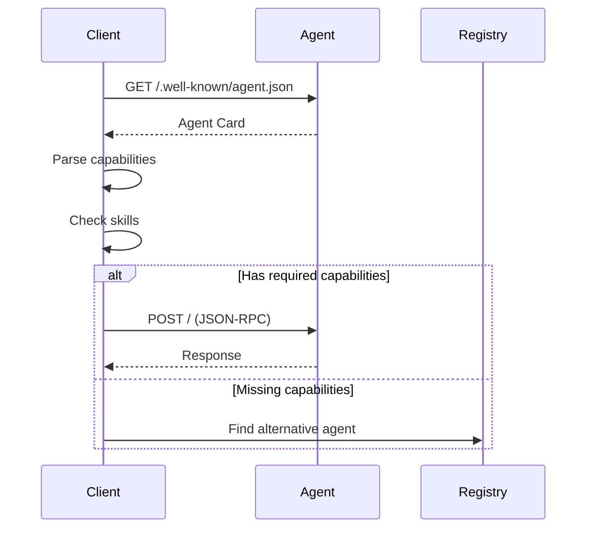

# Agent Discovery

Discover agent capabilities and metadata through the agent card endpoint.

## Get Agent Card

Retrieve agent metadata following the A2A Protocol specification.

### Endpoint

```
GET /.well-known/agent.json
```

<Note>
  This endpoint is public and does not require authentication.
</Note>

### Request

```bash
curl http://localhost:8030/.well-known/agent.json
```

### Response

```json
{
  "name": "First Agent",
  "description": "A helpful AI agent",
  "version": "1.0.0",
  "capabilities": {
    "streaming": true,
    "pushNotifications": false,
    "taskManagement": true
  },
  "skills": [
    {
      "id": "question-answering-v1",
      "name": "Question Answering",
      "description": "Answer questions based on context"
    }
  ],
  "did": "did:bindu:raahul_at_saptha_me:first_agent:e091ddb0",
  "endpoints": {
    "jsonrpc": "http://localhost:8030/",
    "did": "http://localhost:8030/did/resolve"
  }
}
```

---

## Agent Card Fields

### Basic Information

| Field | Type | Description |
|-------|------|-------------|
| `name` | string | Agent name |
| `description` | string | Agent description |
| `version` | string | Agent version (semver) |
| `did` | string | Agent DID identifier |

### Capabilities

| Field | Type | Description |
|-------|------|-------------|
| `streaming` | boolean | Supports streaming responses |
| `pushNotifications` | boolean | Supports push notifications |
| `taskManagement` | boolean | Supports task management |

### Skills

Array of skill summaries:

```json
{
  "id": "skill-id-v1",
  "name": "Skill Name",
  "description": "What the skill does"
}
```

### Endpoints

| Field | Type | Description |
|-------|------|-------------|
| `jsonrpc` | string | JSON-RPC endpoint URL |
| `did` | string | DID resolution endpoint URL |
| `skills` | string | Skills API endpoint URL |

---

## Discovery Flow



---

## Use Cases

### 1. Capability Discovery

Check if agent supports required features:

```javascript
const response = await fetch('http://localhost:8030/.well-known/agent.json');
const agentCard = await response.json();

if (agentCard.capabilities.streaming) {
  console.log('Agent supports streaming');
}

if (agentCard.capabilities.taskManagement) {
  console.log('Agent supports task management');
}
```

### 2. Skill Discovery

Find agents with specific skills:

```javascript
const skills = agentCard.skills;
const hasQA = skills.some(s => s.id === 'question-answering-v1');

if (hasQA) {
  console.log('Agent can answer questions');
}
```

### 3. Endpoint Discovery

Get agent endpoints dynamically:

```javascript
const jsonrpcEndpoint = agentCard.endpoints.jsonrpc;
const didEndpoint = agentCard.endpoints.did;

// Use discovered endpoints
const response = await fetch(jsonrpcEndpoint, {
  method: 'POST',
  body: JSON.stringify(request)
});
```

---

## A2A Protocol Compliance

The agent card follows the [A2A Protocol](https://github.com/google-agentic-commerce/a2a) specification:

- ✅ Standard `.well-known/agent.json` location
- ✅ Required fields (name, version)
- ✅ Capabilities declaration
- ✅ Skills advertisement
- ✅ Endpoint discovery

---

## Examples

### Python

```python
import requests

# Get agent card
response = requests.get('http://localhost:8030/.well-known/agent.json')
agent_card = response.json()

print(f"Agent: {agent_card['name']}")
print(f"Version: {agent_card['version']}")
print(f"Skills: {len(agent_card['skills'])}")

# Check capabilities
if agent_card['capabilities']['streaming']:
    print("Supports streaming")
```

### TypeScript

```typescript
interface AgentCard {
  name: string;
  description: string;
  version: string;
  capabilities: {
    streaming: boolean;
    pushNotifications: boolean;
    taskManagement: boolean;
  };
  skills: Array<{
    id: string;
    name: string;
    description: string;
  }>;
  did: string;
  endpoints: Record<string, string>;
}

async function discoverAgent(url: string): Promise<AgentCard> {
  const response = await fetch(`${url}/.well-known/agent.json`);
  return response.json();
}

const agent = await discoverAgent('http://localhost:8030');
console.log(`Discovered: ${agent.name}`);
```

---

## Next Steps

<CardGroup cols={2}>
  <Card title="Skills API" icon="star" href="/api/skills">
    Explore agent skills in detail
  </Card>
  <Card title="DID Resolution" icon="fingerprint" href="/api/did">
    Learn about DID resolution
  </Card>
  <Card title="JSON-RPC" icon="code" href="/api/jsonrpc">
    Use the JSON-RPC API
  </Card>
  <Card title="A2A Protocol" icon="book-open" href="https://github.com/google-agentic-commerce/a2a">
    Read the A2A specification
  </Card>
</CardGroup>
