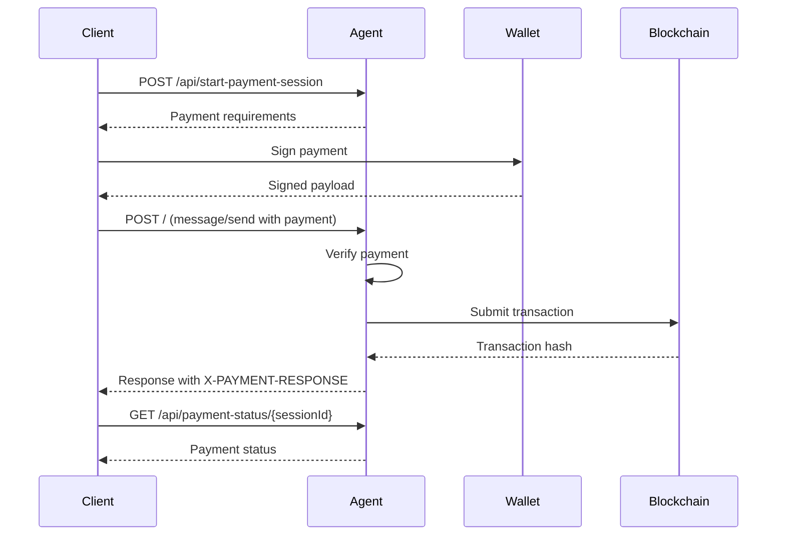

# Payment API

Integrate x402 payment protocol for agent monetization.

<Note>
  Payment endpoints require authentication.
</Note>

---

## Start Payment Session

Initiate a payment session for x402 protocol.

### Endpoint

```
POST /api/start-payment-session
```

### Headers

```
Authorization: Bearer <token>
Content-Type: application/json
```

### Request

```bash
curl -X POST http://localhost:8030/api/start-payment-session \
  -H "Authorization: Bearer <token>" \
  -H "Content-Type: application/json"
```

### Response

```json
{
  "sessionId": "Z_1Y3U3waXK2YUKB6llcIwn9XJcviEBhuFL8WUutAQ8",
  "paymentRequirements": {
    "resource": "/agent/first_agent",
    "scheme": "exact",
    "network": "base-sepolia",
    "asset": "0x036CbD53842c5426634e7929541eC2318f3dCF7e",
    "payTo": "0x742d35Cc6634C0532925a3b844Bc9e7595f0bEb0",
    "amount": "10000",
    "description": "Payment for agent service"
  },
  "expiresAt": "2025-10-26T15:47:52Z"
}
```

---

## Get Payment Status

Retrieve the status of a payment session.

### Endpoint

```
GET /api/payment-status/{sessionId}
```

### Parameters

| Parameter | Type | Required | Description |
|-----------|------|----------|-------------|
| `sessionId` | string | Yes | Payment session identifier |

### Request

```bash
curl http://localhost:8030/api/payment-status/Z_1Y3U3waXK2YUKB6llcIwn9XJcviEBhuFL8WUutAQ8 \
  -H "Authorization: Bearer <token>"
```

### Response

```json
{
  "sessionId": "Z_1Y3U3waXK2YUKB6llcIwn9XJcviEBhuFL8WUutAQ8",
  "status": "completed",
  "transactionHash": "0x...",
  "timestamp": "2025-10-26T14:47:52Z"
}
```

---

## Payment Flow



---

## Payment Requirements

### Fields

| Field | Type | Description |
|-------|------|-------------|
| `resource` | string | Resource being paid for |
| `scheme` | string | Payment scheme (`exact` or `range`) |
| `network` | string | Blockchain network (e.g., `base-sepolia`) |
| `asset` | string | Token contract address |
| `payTo` | string | Recipient wallet address |
| `amount` | string | Amount in atomic units |
| `description` | string | Payment description |

### Supported Networks

- `base-sepolia` - Base Sepolia testnet
- `base` - Base mainnet
- `ethereum` - Ethereum mainnet
- `polygon` - Polygon mainnet

---

## Payment Status

| Status | Description |
|--------|-------------|
| `pending` | Payment initiated, not yet confirmed |
| `completed` | Payment successfully completed |
| `failed` | Payment failed |
| `expired` | Payment session expired |

---

## Using Payments with JSON-RPC

Include payment metadata in `message/send`:

```json
{
  "jsonrpc": "2.0",
  "method": "message/send",
  "params": {
    "message": {
      "role": "user",
      "parts": [{"kind": "text", "text": "Hello"}],
      "kind": "message",
      "messageId": "msg-123",
      "contextId": "ctx-123",
      "taskId": "task-123",
      "metadata": {
        "x402.payment.status": "payment-submitted",
        "x402.payment.payload": {
          "resource": "/agent/my-agent",
          "scheme": "exact",
          "network": "base-sepolia",
          "asset": "0x036CbD53842c5426634e7929541eC2318f3dCF7e",
          "payTo": "0x742d35Cc6634C0532925a3b844Bc9e7595f0bEb0",
          "amount": "10000",
          "signature": "0x...",
          "timestamp": "2025-10-26T14:47:52Z",
          "payer": "0x..."
        }
      }
    }
  },
  "id": "req-123"
}
```

---

## Examples

### Python

```python
import requests

# Start payment session
response = requests.post(
    'http://localhost:8030/api/start-payment-session',
    headers={'Authorization': f'Bearer {token}'}
)
session = response.json()

print(f"Session ID: {session['sessionId']}")
print(f"Amount: {session['paymentRequirements']['amount']}")
print(f"Network: {session['paymentRequirements']['network']}")

# Check payment status
status_response = requests.get(
    f"http://localhost:8030/api/payment-status/{session['sessionId']}",
    headers={'Authorization': f'Bearer {token}'}
)
status = status_response.json()

print(f"Status: {status['status']}")
if status['status'] == 'completed':
    print(f"Transaction: {status['transactionHash']}")
```

### TypeScript

```typescript
interface PaymentSession {
  sessionId: string;
  paymentRequirements: {
    resource: string;
    scheme: string;
    network: string;
    asset: string;
    payTo: string;
    amount: string;
    description: string;
  };
  expiresAt: string;
}

interface PaymentStatus {
  sessionId: string;
  status: 'pending' | 'completed' | 'failed' | 'expired';
  transactionHash?: string;
  timestamp: string;
}

async function startPaymentSession(
  baseUrl: string,
  token: string
): Promise<PaymentSession> {
  const response = await fetch(`${baseUrl}/api/start-payment-session`, {
    method: 'POST',
    headers: {
      'Authorization': `Bearer ${token}`,
      'Content-Type': 'application/json'
    }
  });
  return response.json();
}

async function getPaymentStatus(
  baseUrl: string,
  sessionId: string,
  token: string
): Promise<PaymentStatus> {
  const response = await fetch(
    `${baseUrl}/api/payment-status/${sessionId}`,
    {
      headers: { 'Authorization': `Bearer ${token}` }
    }
  );
  return response.json();
}

// Usage
const session = await startPaymentSession('http://localhost:8030', token);
console.log(`Pay ${session.paymentRequirements.amount} to ${session.paymentRequirements.payTo}`);

const status = await getPaymentStatus('http://localhost:8030', session.sessionId, token);
console.log(`Payment status: ${status.status}`);
```

---

## Next Steps

<CardGroup cols={2}>
  <Card title="X402 Protocol" icon="credit-card" href="/bindu/learn/payment/introduction">
    Learn about x402 payments
  </Card>
  <Card title="JSON-RPC" icon="code" href="/api/jsonrpc">
    Use JSON-RPC with payments
  </Card>
  <Card title="Authentication" icon="lock" href="/bindu/learn/authentication/overview">
    Set up authentication
  </Card>
  <Card title="Testing Guide" icon="flask" href="https://github.com/Saptha-me/Bindu/blob/main/docs/x402-testing-guide.md">
    Test payment integration
  </Card>
</CardGroup>
