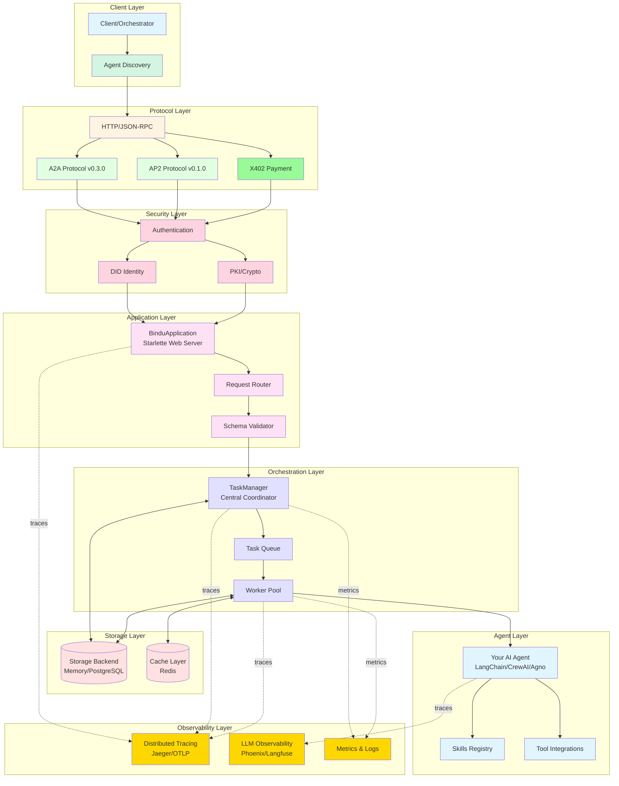
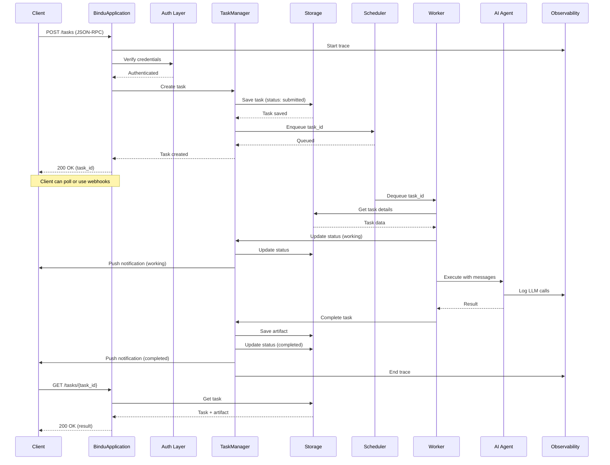

# Architecture: How Bindu Works

Bindu transforms any AI agent into a production-ready server that speaks universal protocols. This guide explains the architectural decisions, components, and data flow that make this possible.

## System Overview



---

## Core Components

### 1. Protocol Layer

Bindu implements three major protocols to enable universal agent communication:

#### A2A Protocol (Agent-to-Agent) v0.3.0
The standard protocol for agent-to-agent communication. Defines:
- **Message Structure**: How agents exchange information
- **Task Lifecycle**: From submission to completion
- **Context Management**: Maintaining conversation state
- **Status Updates**: Real-time progress tracking

#### AP2 Protocol (Agent Protocol 2) v0.1.0
Extensions for advanced agent capabilities:
- **Payment Mandates**: Authorization framework for commerce
- **Cart Management**: Merchant interactions
- **Intent Verification**: User purchase intent validation

#### X402 Payment Protocol
Micropayment infrastructure for agent services:
- **Payment Requests**: Structured payment flows
- **Cryptographic Signatures**: Secure transaction validation
- **Multi-Currency Support**: Flexible payment options

<Note>
All protocols use JSON-RPC 2.0 for standardized request/response handling.
</Note>

---

### 2. Security & Identity Layer

#### Authentication
Multi-provider authentication support:
- **Auth0**: Primary authentication provider
- **OAuth2**: Standard authorization flows
- **API Keys**: Simple token-based auth
- **Mutual TLS**: Certificate-based authentication

#### Decentralized Identity (DID)
Each agent gets a unique, verifiable identity:
```typescript
{
  "did": "did:bindu:agent-123",
  "publicKey": "...",
  "verification_method": "rsa" | "ecdsa"
}
```

**Benefits:**
- **Trustless Verification**: No central authority needed
- **Portable Identity**: Works across networks
- **Cryptographic Proof**: Tamper-proof authentication

#### Public Key Infrastructure (PKI)
Cryptographic key management:
- **Key Generation**: RSA or ECDSA keys
- **Signature Verification**: Validate message authenticity
- **Secure Storage**: Protected key storage

---

### 3. Application Layer

#### BinduApplication (Web Server)
Built on Starlette, a lightweight ASGI framework:

```python
class BinduApplication:
    def __init__(self, agent, config):
        self.app = Starlette()
        self.task_manager = TaskManager()
        self.setup_routes()
        self.setup_middleware()
```

**Key Features:**
- **Async/Await**: Non-blocking I/O for high concurrency
- **WebSocket Support**: Real-time bidirectional communication
- **Middleware Stack**: Authentication, logging, error handling
- **Health Checks**: Readiness and liveness probes

#### Request Router
Routes incoming requests to appropriate handlers:

```python
routes = [
    Route("/agent/card", get_agent_card),
    Route("/agent/skills", list_skills),
    Route("/tasks", handle_task, methods=["POST"]),
    Route("/tasks/{task_id}", get_task),
    Route("/contexts/{context_id}", get_context),
]
```

#### Schema Validator
Ensures all data conforms to protocol specifications:
- **Input Validation**: Verify request structure
- **Type Checking**: Enforce data types
- **Error Reporting**: Clear validation errors

---

### 4. Orchestration Layer

#### TaskManager: The Central Coordinator

The TaskManager is the heart of Bindu's orchestration. Think of it as a restaurant manager coordinating orders, kitchen staff, and customer service.

```python
class TaskManager:
    def __init__(self, storage, scheduler):
        self.storage = storage
        self.scheduler = scheduler
        self.workers = WorkerPool()
    
    async def create_task(self, message, context_id):
        # 1. Create task record
        task = Task(
            id=uuid4(),
            context_id=context_id,
            status="submitted",
            message=message
        )
        
        # 2. Store in database
        await self.storage.save_task(task)
        
        # 3. Queue for execution
        await self.scheduler.enqueue(task.id)
        
        # 4. Return immediately (non-blocking)
        return task
    
    async def update_task_status(self, task_id, status):
        # Update storage
        await self.storage.update_status(task_id, status)
        
        # Notify subscribers
        await self.notify_subscribers(task_id, status)
```

**Responsibilities:**
- **Task Creation**: Initialize new tasks
- **State Management**: Track task lifecycle
- **Worker Coordination**: Assign tasks to workers
- **Error Recovery**: Handle failures gracefully
- **Notification**: Push updates to clients

#### Task Queue & Scheduler

**Memory Scheduler (Development):**
```python
class MemoryScheduler:
    def __init__(self):
        self.queue = asyncio.Queue()
    
    async def enqueue(self, task_id):
        await self.queue.put(task_id)
    
    async def dequeue(self):
        return await self.queue.get()
```

**Redis Scheduler (Production):**
```python
class RedisScheduler:
    def __init__(self, redis_url):
        self.redis = Redis.from_url(redis_url)
    
    async def enqueue(self, task_id):
        await self.redis.lpush("task_queue", task_id)
    
    async def dequeue(self):
        return await self.redis.brpop("task_queue")
```

**Why Redis for Production?**
- **Distributed**: Multiple workers can share the queue
- **Persistent**: Survives server restarts
- **Atomic Operations**: Thread-safe queue operations
- **Priority Queues**: Support for task prioritization

#### Worker Pool

Workers execute tasks asynchronously:

```python
class Worker:
    def __init__(self, agent, task_manager):
        self.agent = agent
        self.task_manager = task_manager
    
    async def run(self):
        while True:
            # 1. Get next task
            task_id = await self.task_manager.scheduler.dequeue()
            
            # 2. Update status
            await self.task_manager.update_task_status(
                task_id, "working"
            )
            
            # 3. Execute agent
            try:
                result = await self.execute_agent(task_id)
                
                # 4. Create artifact
                artifact = Artifact(
                    artifact_id=uuid4(),
                    parts=[TextPart(text=result)]
                )
                
                # 5. Mark complete
                await self.task_manager.complete_task(
                    task_id, artifact
                )
            except Exception as e:
                # 6. Handle errors
                await self.task_manager.fail_task(
                    task_id, str(e)
                )
```

**Worker Features:**
- **Concurrency**: Multiple workers process tasks in parallel
- **Error Handling**: Graceful failure recovery
- **Retry Logic**: Automatic retries for transient failures
- **Timeout Management**: Prevent hung tasks

---

### 5. Storage Layer

#### Storage Backends

**Memory Storage (Development):**
```python
class MemoryStorage:
    def __init__(self):
        self.tasks = {}
        self.contexts = {}
        self.artifacts = {}
    
    async def save_task(self, task):
        self.tasks[task.id] = task
    
    async def get_task(self, task_id):
        return self.tasks.get(task_id)
```

**PostgreSQL Storage (Production):**
```python
class PostgresStorage:
    def __init__(self, connection_string):
        self.pool = create_pool(connection_string)
    
    async def save_task(self, task):
        async with self.pool.acquire() as conn:
            await conn.execute(
                "INSERT INTO tasks (id, context_id, status, data) "
                "VALUES ($1, $2, $3, $4)",
                task.id, task.context_id, task.status, 
                json.dumps(task.dict())
            )
```

**Why PostgreSQL for Production?**
- **ACID Compliance**: Guaranteed data consistency
- **Relational Queries**: Complex task relationships
- **JSON Support**: Store flexible task data
- **Scalability**: Handle millions of tasks

#### Cache Layer (Redis)

Used for:
- **Session Storage**: User sessions and context
- **Rate Limiting**: Prevent abuse
- **Temporary Data**: Short-lived task data
- **Pub/Sub**: Real-time notifications

---

### 6. Agent Layer

#### Agent Integration

Bindu is framework-agnostic. Here's how different frameworks integrate:

**Agno:**
```python
from agno.agent import Agent

agent = Agent(
    instructions="You are a helpful assistant",
    model=OpenAIChat(id="gpt-4o"),
    tools=[DuckDuckGoTools()]
)

def handler(messages):
    result = agent.run(input=messages)
    return result

bindufy(agent, config, handler)
```

**LangChain:**
```python
from langchain.agents import initialize_agent

agent = initialize_agent(
    tools=[...],
    llm=ChatOpenAI(),
    agent=AgentType.OPENAI_FUNCTIONS
)

def handler(messages):
    result = agent.run(messages[-1]["content"])
    return result

bindufy(agent, config, handler)
```

**CrewAI:**
```python
from crewai import Agent, Task, Crew

agent = Agent(
    role="Research Assistant",
    goal="Find and summarize information",
    tools=[...]
)

def handler(messages):
    task = Task(description=messages[-1]["content"])
    crew = Crew(agents=[agent], tasks=[task])
    result = crew.kickoff()
    return result

bindufy(agent, config, handler)
```

#### Skills Registry

Skills define what an agent can do:

```python
class SkillRegistry:
    def __init__(self):
        self.skills = {}
    
    def register(self, skill):
        self.skills[skill.id] = skill
    
    def list_skills(self):
        return list(self.skills.values())
    
    def get_skill(self, skill_id):
        return self.skills.get(skill_id)
```

**Skill Structure:**
```json
{
  "id": "data-analysis",
  "name": "Data Analysis",
  "description": "Analyze datasets and generate insights",
  "tags": ["analytics", "data"],
  "input_modes": ["text/csv", "application/json"],
  "output_modes": ["text/plain", "application/json"],
  "examples": [
    "Analyze this sales data",
    "Calculate statistics for this dataset"
  ]
}
```

---

### 7. Observability Layer

#### Distributed Tracing (Jaeger/OTLP)

Track requests across the entire system:

```python
from opentelemetry import trace
from opentelemetry.exporter.jaeger import JaegerExporter

tracer = trace.get_tracer(__name__)

@tracer.start_as_current_span("process_task")
async def process_task(task_id):
    span = trace.get_current_span()
    span.set_attribute("task.id", task_id)
    
    # Your code here
    
    span.set_attribute("task.status", "completed")
```

**Trace Example:**
```
Request → Router → TaskManager → Queue → Worker → Agent
  |         |          |           |       |        |
  1ms      2ms        5ms         10ms    50ms    500ms
```

#### LLM Observability (Phoenix/Langfuse)

Track LLM-specific metrics:
- **Token Usage**: Input/output tokens per request
- **Latency**: Time to first token, total time
- **Cost**: Estimated cost per request
- **Quality**: User feedback and ratings

```python
from openinference.instrumentation import instrument

instrument(
    provider="phoenix",
    endpoint="http://localhost:6006"
)
```

#### Metrics & Logs

**Key Metrics:**
- **Request Rate**: Requests per second
- **Task Duration**: Average task completion time
- **Error Rate**: Failed tasks percentage
- **Queue Depth**: Pending tasks in queue
- **Worker Utilization**: Active vs idle workers

**Structured Logging:**
```python
logger.info(
    "Task completed",
    extra={
        "task_id": task_id,
        "duration_ms": duration,
        "status": "completed"
    }
)
```

---

## Data Flow

### Complete Request Lifecycle

Let's trace a complete request through the system:



### Step-by-Step Breakdown

**1. Request Arrival (0-10ms)**
- Client sends JSON-RPC request to `/tasks`
- Server validates request structure
- Authentication layer verifies credentials
- DID verification if enabled

**2. Task Creation (10-50ms)**
- TaskManager creates task record
- Assigns unique task_id and context_id
- Stores initial state in database
- Returns immediately to client (non-blocking)

**3. Task Queuing (50-60ms)**
- Task ID added to scheduler queue
- Redis LPUSH for distributed systems
- In-memory queue for development

**4. Worker Assignment (60-100ms)**
- Available worker dequeues task
- Updates task status to "working"
- Sends push notification if configured

**5. Agent Execution (100ms-30s)**
- Worker loads task context
- Passes messages to AI agent
- Agent processes using LLM
- Tools/skills invoked as needed
- All steps traced for observability

**6. Result Processing (30s-30.1s)**
- Worker creates artifact from result
- Updates task status to "completed"
- Stores artifact in database
- Sends completion notification

**7. Client Retrieval (anytime)**
- Client polls `/tasks/{task_id}`
- Or receives webhook notification
- Gets task status and artifacts

---

## Design Principles

### 1. Non-Blocking Architecture

**Problem:** LLM calls can take 10-30 seconds. Blocking the HTTP connection is inefficient.

**Solution:** Immediate task creation with async execution.

```python
# Client makes request
POST /tasks
→ Returns immediately with task_id

# Worker processes in background
Worker → Agent → LLM (30 seconds)

# Client checks status
GET /tasks/{task_id}
→ Returns current status
```

### 2. Separation of Concerns

Each layer has a single responsibility:
- **Protocol Layer**: Handle communication standards
- **Security Layer**: Verify identity and permissions
- **Application Layer**: Route and validate requests
- **Orchestration Layer**: Coordinate task execution
- **Storage Layer**: Persist data reliably
- **Agent Layer**: Execute AI logic
- **Observability Layer**: Monitor and trace

### 3. Framework Agnostic

Bindu doesn't force a specific agent framework:

```python
# Your agent (any framework)
def handler(messages):
    # Your logic here
    return result

# Bindu wraps it
bindufy(agent, config, handler)
```

### 4. Protocol-First Design

All communication follows established protocols:
- **A2A**: Standard agent communication
- **AP2**: Commerce extensions
- **X402**: Payment rails
- **JSON-RPC 2.0**: Request/response format

### 5. Observable by Default

Every operation is traced:
- **Distributed Tracing**: Request flow across components
- **LLM Observability**: Token usage, latency, cost
- **Metrics**: Performance and health indicators
- **Structured Logs**: Searchable, filterable logs

### 6. Secure by Design

Security is built-in, not bolted on:
- **Authentication Required**: No unauthenticated access
- **DID Identity**: Verifiable agent identity
- **Encrypted Communication**: TLS/mTLS support
- **Key Management**: Secure PKI infrastructure

---

## Scalability Patterns

### Horizontal Scaling

**Single Instance:**
```
Client → Server → Worker → Agent
```

**Multiple Workers:**
```
                ┌→ Worker 1 → Agent 1
Client → Server → Worker 2 → Agent 2
                └→ Worker 3 → Agent 3
```

**Multiple Servers:**
```
         ┌→ Server 1 → Workers → Agents
Client → Load Balancer → Server 2 → Workers → Agents
         └→ Server 3 → Workers → Agents
              ↓
         Shared Redis Queue
         Shared PostgreSQL
```

### Vertical Scaling

**Resource Allocation:**
- **CPU**: More cores for parallel workers
- **Memory**: Larger context windows, more caching
- **Storage**: Faster disk I/O for database

### Caching Strategies

**1. Task Result Caching:**
```python
cache_key = hash(task_input)
if cached_result := cache.get(cache_key):
    return cached_result

result = agent.run(task_input)
cache.set(cache_key, result, ttl=3600)
```

**2. Context Caching:**
```python
# Cache conversation history
context_key = f"context:{context_id}"
cache.set(context_key, messages, ttl=86400)
```

**3. Agent Card Caching:**
```python
# Cache agent capabilities
cache.set("agent:card", agent_card, ttl=3600)
```

---

## Deployment Architectures

### Development (Local)

```yaml
services:
  bindu-agent:
    image: your-agent:latest
    ports:
      - "3773:3773"
    environment:
      - STORAGE_TYPE=memory
      - SCHEDULER_TYPE=memory
```

**Characteristics:**
- In-memory storage and scheduling
- Single instance
- No external dependencies
- Fast iteration

### Production (Cloud)

```yaml
services:
  bindu-agent:
    image: your-agent:latest
    replicas: 3
    environment:
      - STORAGE_TYPE=postgres
      - SCHEDULER_TYPE=redis
      - DATABASE_URL=postgresql://...
      - REDIS_URL=redis://...
  
  postgres:
    image: postgres:15
    volumes:
      - pgdata:/var/lib/postgresql/data
  
  redis:
    image: redis:7
    volumes:
      - redisdata:/data
  
  jaeger:
    image: jaegertracing/all-in-one
    ports:
      - "16686:16686"
```

**Characteristics:**
- Multiple agent instances
- Shared PostgreSQL database
- Redis for distributed queue
- Jaeger for tracing
- Load balancer in front

---

## Performance Considerations

### Latency Breakdown

**Typical Request:**
```
Total: 5-30 seconds
├─ HTTP overhead: 10-50ms
├─ Authentication: 10-100ms
├─ Task creation: 10-50ms
├─ Queue wait: 0-5s (depends on load)
├─ Agent execution: 5-30s (LLM call)
└─ Result storage: 10-50ms
```

### Optimization Strategies

**1. Connection Pooling:**
```python
# Database connection pool
pool = create_pool(
    database_url,
    min_size=5,
    max_size=20
)
```

**2. Batch Processing:**
```python
# Process multiple tasks together
async def batch_process(task_ids):
    tasks = await storage.get_tasks(task_ids)
    results = await agent.batch_run(tasks)
    await storage.save_results(results)
```

**3. Streaming Responses:**
```python
# Stream results as they're generated
async def stream_task(task_id):
    async for chunk in agent.stream(task_id):
        yield chunk
```

---

## Summary

Bindu's architecture is designed for:

- **Simplicity**: Wrap any agent with minimal code
- **Scalability**: From localhost to distributed cloud
- **Reliability**: Built-in error handling and recovery
- **Observability**: Complete visibility into operations
- **Security**: Authentication and identity built-in
- **Standards**: Protocol-first design (A2A, AP2, X402)

The layered architecture ensures each component can evolve independently while maintaining a cohesive system. Whether you're prototyping locally or deploying at scale, Bindu's architecture adapts to your needs.

---

## Next Steps

<CardGroup cols={2}>
  <Card title="Protocol Types" icon="code" href="/bindu/concepts/protocol">
    Learn about the data structures and types
  </Card>
  <Card title="Create Your Agent" icon="rocket" href="/bindu/create-bindu-agent/overview">
    Build your first Bindu agent
  </Card>
  <Card title="Observability" icon="eye" href="/bindu/learn/observability/introduction">
    Set up monitoring and tracing
  </Card>
  <Card title="Authentication" icon="shield" href="/bindu/learn/authentication/auth0">
    Configure security and auth
  </Card>
</CardGroup>