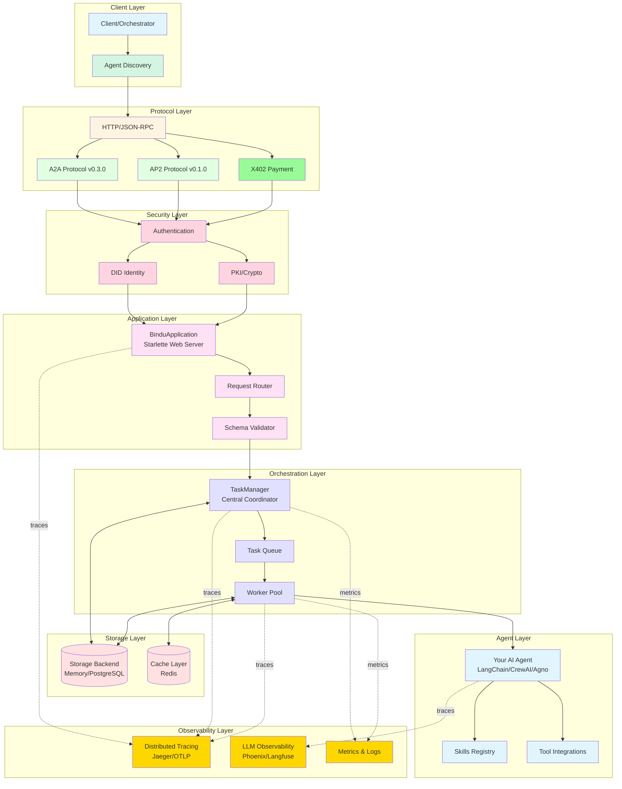
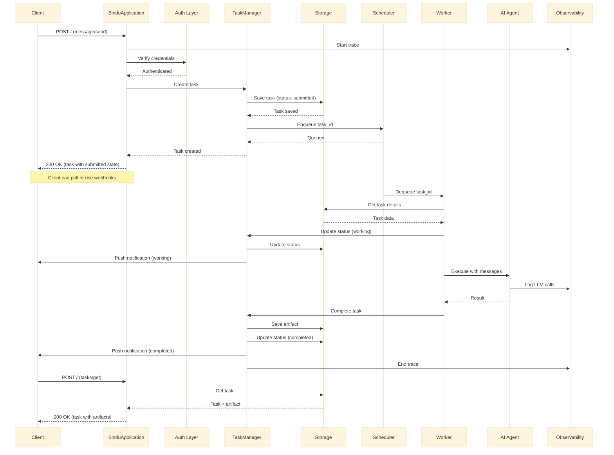

In [Key Concepts](/bindu/introduction/key-concepts), you saw how Bindu's task lifecycle enables interactive conversations with states like `submitted`, `input-required`, and `completed`. This guide explains the **technical architecture** that makes it possible—from protocol layers to storage backends.

**What You'll Learn:**
- How requests flow through Bindu's layered architecture
- Why TaskManager coordinates everything (the "restaurant manager")
- How workers execute your agent asynchronously
- Storage, caching, and scaling strategies

**Quick Context:** When you send a message, it creates a task that flows through multiple layers. This page shows you what happens at each layer and why.

## System Overview

---

## Core Components

### 1. Protocol Layer

**A2A Protocol** - Agent-to-agent communication (task lifecycle, context management)  
**AP2 Protocol** - Commerce extensions (payment mandates, cart management)  
**X402 Protocol** - Micropayments (cryptographic signatures, multi-currency)

All use JSON-RPC 2.0 for request/response handling.

---
### 2. Security & Identity Layer

**Authentication** - Auth0, OAuth2, API Keys, Mutual TLS  
**DID (Decentralized Identity)** - Unique, verifiable agent identity  
**PKI** - RSA/ECDSA key generation, signature verification

---
### 3. Application Layer

**BinduApplication** - Starlette-based web server with async/await, WebSocket support  
**Request Router** - Routes to `/agent/card`, `/agent/skills`, `/tasks/*`, `/contexts/*`  
**Schema Validator** - Validates request structure and types

---
### 4. Orchestration Layer

**TaskManager** - Central coordinator that creates tasks, manages state, coordinates workers  
**Task Queue** - Memory (dev) or Redis (prod) for distributed task scheduling  
**Worker Pool** - Executes tasks asynchronously, handles retries and timeouts

---
### 5. Storage Layer

**Memory Storage** (dev) - In-memory dictionaries for tasks, contexts, artifacts  
**PostgreSQL** (prod) - ACID compliance, relational queries, JSON support  
**Redis Cache** - Session storage, rate limiting, pub/sub notifications

---
### 6. Agent Layer

**Framework Agnostic** - Works with Agno, LangChain, CrewAI, LlamaIndex  
**Skills Registry** - Defines agent capabilities via `/agent/skills` endpoint  
**Tool Integrations** - 113+ built-in toolkits for data, code, web, APIs

---
### 7. Observability Layer

**Distributed Tracing** - Jaeger/OTLP tracks requests across all components  
**LLM Observability** - Phoenix/Langfuse monitors token usage, latency, cost  
**Metrics** - Request rate, task duration, error rate, queue depth, worker utilization

---

## Data Flow

### Complete Request Lifecycle

Let's trace a complete request through the system:

### Request Flow Summary

**Phase 1: Submit (0-50ms)** - Client sends `message/send` → Auth validates → TaskManager creates task → Returns `task_id` immediately

**Phase 2: Execute (async)** - Worker dequeues → Runs your agent → Updates state (`working` → `input-required` or `completed`)

**Phase 3: Retrieve (anytime)** - Client polls with `tasks/get` → Gets current state + artifacts

---

## Summary

Bindu's architecture is designed for:

- **Simplicity**: Wrap any agent with minimal code
- **Scalability**: From localhost to distributed cloud
- **Reliability**: Built-in error handling and recovery
- **Observability**: Complete visibility into operations
- **Security**: Authentication and identity built-in
- **Standards**: Protocol-first design (A2A, AP2, X402)

The layered architecture ensures each component can evolve independently while maintaining a cohesive system. Whether you're prototyping locally or deploying at scale, Bindu's architecture adapts to your needs.

### Connecting the Dots

**You've now seen three perspectives:**

1. **[Key Concepts](/bindu/introduction/key-concepts)** - How task states enable interactive conversations
2. **This Page (Architecture)** - The technical layers that power those states
3. **[Task-First Pattern](/bindu/concepts/task-first-pattern)** - Why this design enables multi-agent orchestration

**The Big Picture:** When you send "create sunset caption" and the agent asks "which platform?", here's what happens:
- Your message hits the Protocol Layer → authenticated by Security Layer
- TaskManager creates a task in "submitted" state → stored in Storage Layer
- Worker executes your agent → agent returns structured response requesting input
- TaskManager updates state to "input-required" → you see the question
- You respond "Instagram" → same task continues → completes with artifact

That's Bindu's architecture in action.

---

## Next Steps

<CardGroup cols={2}>
  <Card title="Protocol Types" icon="code" href="/bindu/concepts/protocol">
    Learn about the data structures and types
  </Card>
  <Card title="Create Your Agent" icon="rocket" href="/bindu/create-bindu-agent/overview">
    Build your first Bindu agent
  </Card>
  <Card title="Observability" icon="eye" href="/bindu/learn/observability/introduction">
    Set up monitoring and tracing
  </Card>
  <Card title="Authentication" icon="shield" href="/bindu/learn/authentication/auth0">
    Configure security and auth
  </Card>
</CardGroup>