Think of protocol types as the vocabulary that agents use to talk to each other. Just like humans need a common language to communicate, agents need a precise set of data structures to understand each other. This guide explains each type in simple terms.

## Overview

Bindu follows two main protocols:
- **A2A (Agent-to-Agent) Protocol v0.3.0** - The standard for agent communication
- **AP2 (Agent Protocol 2) v0.1.0** - Extensions for advanced features

<Note>
Some types are marked as `<NotPartOfA2A>` - these are Bindu-specific extensions that go beyond the standard A2A protocol.
</Note>

---

## Type Aliases & Enums

Protocol types use TypeAlias definitions for enums to ensure type safety and clear state management.

### TaskState

Defines all possible states a task can be in during its lifecycle:

**Standard A2A States:**
- `submitted` - Task has been submitted and is awaiting execution
- `working` - Agent is actively working on the task
- `input-required` - Task is paused, waiting for user input
- `completed` - Task has been successfully completed
- `canceled` - Task has been canceled by the user
- `failed` - Task failed due to an error during execution
- `rejected` - Task was rejected by the agent and was not started
- `auth-required` - Task requires authentication to proceed

**Bindu Extensions** `<NotPartOfA2A>`:
- `payment-required` - Task requires payment to proceed
- `unknown` - Task is in an unknown or indeterminate state
- `trust-verification-required` - Task requires trust verification to proceed
- `pending` - Task is pending execution
- `suspended` - Task is suspended and not currently running
- `resumed` - Task is resumed and currently running
- `negotiation-bid-submitted` - Task is submitted for negotiation
- `negotiation-bid-lost` - Task bid was lost in negotiation
- `negotiation-bid-won` - Task bid was won in negotiation

### NegotiationStatus `<NotPartOfA2A>`

Defines the status of individual negotiation proposals:

- `proposed` - Negotiation is proposed
- `accepted` - Negotiation is accepted
- `rejected` - Negotiation is rejected
- `countered` - Counter-offer made

### NegotiationSessionStatus `<NotPartOfA2A>`

Defines the overall status of a negotiation session:

- `initiated` - Negotiation session is initiated
- `ongoing` - Negotiation session is ongoing
- `completed` - Negotiation session is completed
- `rejected` - Negotiation session is rejected

### TrustLevel `<NotPartOfA2A>`

Defines role-based trust levels for agent authorization (ordered by permission level):

- `super_admin` - Highest level access, all operations permitted
- `admin` - Admin operations, minimal risk
- `manager` - Management operations, elevated permissions
- `operator` - System operations, moderate risk
- `editor` - Edit operations, moderate risk
- `analyst` - Standard operations
- `auditor` - Sensitive operations (read-only)
- `support` - Support operations, troubleshooting access
- `viewer` - View-only access, minimal permissions
- `guest` - Limited access, read-only operations

### IdentityProvider `<NotPartOfA2A>`

Supported authentication identity providers:

- `keycloak` - Keycloak identity provider
- `azure_ad` - Azure AD identity provider
- `okta` - Okta identity provider
- `auth0` - Auth0 identity provider
- `custom` - Custom identity provider

### Data Key Constants `<NotPartOfA2A>`

Standard keys for structured data in DataPart objects:

- `CONTACT_ADDRESS_DATA_KEY` = `"contact_picker.ContactAddress"`
- `PAYMENT_METHOD_DATA_DATA_KEY` = `"payment_request.PaymentMethodData"`
- `CART_MANDATE_DATA_KEY` = `"ap2.mandates.CartMandate"`
- `INTENT_MANDATE_DATA_KEY` = `"ap2.mandates.IntentMandate"`
- `PAYMENT_MANDATE_DATA_KEY` = `"ap2.mandates.PaymentMandate"`

These constants are used to identify specific data types within the protocol's DataPart structure.

## Parts: The Content Pieces

Parts are the fundamental building blocks for agent communication in A2A. Here's how they work in practice:

### TextPart: Simple Text Communication

**Schema:**
```python
class TextPart(TypedDict):
    """Represents a text segment within a message or artifact."""
    
    kind: Literal["text"]           # Discriminator, always "text"
    text: str                       # The actual text content
    metadata: NotRequired[dict[str, Any]]  # Optional metadata for context
    embeddings: NotRequired[list[float]] #The embeddings of Text. <NotPartOfA2A>
```

**Use Case 1: User Instruction**
```json
{
  "kind": "text",
  "text": "Analyze this image and highlight any faces."
}
```

**Use Case 2: Agent Status with Metadata**
```json
{
  "kind": "text",
  "text": "Processing your request... Found 3 faces in the image.",
  "metadata": {
    "timestamp": "2025-10-31T10:00:00Z",
    "confidence": 0.95,
    "processingTime": "2.3s"
  }
}
```

**What it's for:** Human-readable communication including instructions, status updates, error messages, and conversational text between agents and users.

---

### FilePart: Binary Content Exchange

**Schema:**
```python
class FileWithBytes(TypedDict):
    """File representation with binary content."""
    
    bytes: str                      # Base64-encoded file content
    name: NotRequired[str]          # File name (e.g., "document.pdf")
    mimeType: NotRequired[str]      # MIME type (e.g., "application/pdf")
    embeddings: NotRequired[list[float]] #The embeddings of File. <NotPartOfA2A>


class FileWithUri(TypedDict):
    """File representation with URI reference."""
    
    uri: str                        # URL pointing to file content
    name: NotRequired[str]          # File name
    mimeType: NotRequired[str]      # MIME type


class FilePart(TypedDict):
    """Represents a file segment within a message or artifact."""
    
    kind: Literal["file"]           # Discriminator, always "file"
    file: FileWithBytes | FileWithUri  # File content (bytes or URI)
    metadata: NotRequired[dict[str, Any]]  # Optional metadata
    embeddings: NotRequired[list[float]] #The embeddings of File. <NotPartOfA2A>
```

**Use Case 1: Image Upload with Bytes (Client → Agent)**
```json
{
  "jsonrpc": "2.0",
  "id": "req-007",
  "method": "message/send",
  "params": {
    "message": {
      "role": "user",
      "parts": [
        {
          "kind": "text",
          "text": "Analyze this image and highlight any faces."
        },
        {
          "kind": "file",
          "file": {
            "name": "input_image.png",
            "mimeType": "image/png",
            "bytes": "iVBORw0KGgoAAAANSUhEUgAAAAUA..."
          }
        }
      ],
      "messageId": "6dbc13b5-bd57-4c2b-b503-24e381b6c8d6"
    }
  }
}
```

**What it's for:** Binary content exchange including images, documents, media files, and data files. Use `bytes` for small files (< 1MB), `uri` for large files to avoid payload bloat.

---

### DataPart: Structured Information Exchange

**Schema:**
```python
class DataPart(TypedDict):
    """Represents a structured data segment (e.g., JSON) within a message or artifact."""
    
    kind: Literal["data"]           # Discriminator, always "data"
    data: dict[str, Any]            # Structured JSON data
    metadata: NotRequired[dict[str, Any]]  # Optional metadata
    embeddings: NotRequired[list[float]] #The embeddings of Data. <NotPartOfA2A>
```

**Use Case 1: Form Data Submission**
```json
{
  "kind": "data",
  "data": {
    "formType": "user_registration",
    "fields": {
      "username": "john_doe",
      "email": "john@example.com",
      "preferences": {
        "newsletter": true,
        "notifications": "daily"
      }
    },
    "timestamp": "2025-10-31T10:00:00Z"
  }
}
```

**What it's for:** Structured, machine-readable information including API responses, form data, query results, analytics, payment details, and any JSON-serializable data that needs programmatic processing.

---

### Key Takeaways: A2A Part Usage

**Part Types (A2A Standard):**

1. **TextPart** (`kind: "text"`): For conveying plain textual content
   - Use for: Instructions, descriptions, status updates, conversational text
   
2. **FilePart** (`kind: "file"`): For conveying file-based content
   - **FileWithBytes**: Small files provided as base64-encoded bytes
   - **FileWithUri**: Large files referenced by URI
   - Optional: `name` and `mimeType` fields
   
3. **DataPart** (`kind: "data"`): For conveying structured JSON data
   - Use for: Forms, parameters, machine-readable information
   - Data is a JSON object (`dict[str, Any]`)

**Common Features:**
- All parts support optional `metadata` field for additional context
- Parts can be used in both Messages and Artifacts
- Multiple parts can be combined in a single message

**Bindu Extensions** `<NotPartOfA2A>`:
- `embeddings: list[float]` - Vector embeddings for semantic search and similarity

**Best Practices:**
- Use `bytes` for small files, `uri` for large files to avoid payload bloat
- Always specify `mimeType` for files to help agents process content correctly
- Use `metadata` for additional context (timestamps, confidence scores, error codes)
- Structure DataPart content with clear, consistent schemas

---

## Communication Types

### Message: Operational Communication

Messages are the primary way agents, users, and systems communicate during task execution. Unlike artifacts (which contain final results), messages carry operational content like instructions, status updates, and coordination.

**Schema:**
```python
class Message(TypedDict):
    """Communication content exchanged between agents, users, and systems.
    
    Messages represent all non-result communication in the bindu protocol.
    Unlike Artifacts (which contain task outputs), Messages carry operational
    content like instructions, status updates, context, and metadata.
    
    Message Types:
    - User Instructions: Task requests with context and files
    - Agent Communication: Status updates, thoughts, coordination
    - System Messages: Errors, warnings, protocol information
    - Context Sharing: Background information, references, metadata
    
    Multi-part Structure:
    Messages can contain multiple parts to organize different content types:
    - Text parts for instructions or descriptions
    - File parts for context documents or references
    - Data parts for structured metadata or parameters
    
    Flow Pattern:
    Client → Message (request) → Agent → Message (status) → Artifact (result)
    """
    
    message_id: Required[UUID]
    """Identifier created by the message creator."""
    
    context_id: Required[UUID]
    """The context the message is associated with."""
    
    task_id: Required[UUID]
    """Identifier of task the message is related to."""
    
    kind: Required[Literal["message"]]
    """The type discriminator, always "message"."""
    
    role: Required[Literal["user", "agent", "system"]]
    """The role of the message sender."""
    
    parts: Required[list[Part]]
    """The content parts of the message."""
    
    metadata: NotRequired[dict[str, Any]]
    """Metadata associated with the message."""
    
    reference_task_ids: NotRequired[list[UUID]]
    """List of identifiers of tasks that this message references."""
    
    extensions: NotRequired[list[str]]
    """Array of extension URIs."""
```

**Message Roles:**

1. **user**: Messages from humans or client applications
   - Task instructions and requests
   - Follow-up questions
   - Input responses
   
2. **agent**: Messages from AI agents
   - Status updates ("Processing your request...")
   - Thought processes and reasoning
   - Coordination between agents
   - Progress notifications
   
3. **system**: Protocol-level messages `<NotPartOfA2A>`
   - Error notifications
   - Authentication warnings
   - Protocol-level events

**Use Case 1: User Instruction with Context**
```json
{
  "messageId": "6dbc13b5-bd57-4c2b-b503-24e381b6c8d6",
  "contextId": "a1b2c3d4-e5f6-7890-abcd-ef1234567890",
  "taskId": "f9e8d7c6-b5a4-3210-9876-543210fedcba",
  "kind": "message",
  "role": "user",
  "parts": [
    {
      "kind": "text",
      "text": "Analyze this sales data and identify trends."
    },
    {
      "kind": "file",
      "file": {
        "name": "sales_q4.csv",
        "mimeType": "text/csv",
        "uri": "https://example.com/files/sales_q4.csv"
      }
    }
  ],
  "metadata": {
    "priority": "high",
    "deadline": "2025-11-01T00:00:00Z"
  }
}
```


**What it's for:** Real-time communication during task execution including instructions, status updates, questions, coordination, and context sharing. Messages enable interactive, multi-turn conversations between users and agents.

---

### Artifact: Task Results

Artifacts are the **final, immutable outputs** produced by agents after completing work. Once created, they cannot be modified. Ensuring a permanent, trustworthy record of agent execution. They represent tangible deliverables like reports, generated code, processed files, or analysis results. Unlike messages (which are ephemeral communication), artifacts are the persistent, unchangeable products of agent work that can be reliably referenced, shared, and audited.

**Schema:**
```python
class Artifact(TypedDict):
    """Represents the final output generated by an agent after completing a task.
    
    Artifacts are immutable data structures that contain the results of agent execution.
    They can contain multiple parts (text, files, structured data) and are uniquely
    identified for tracking and retrieval.
    
    A single task may produce multiple artifacts when the output naturally
    separates into distinct deliverables (e.g., frontend + backend code).
    """
    
    artifact_id: Required[UUID]
    """Unique identifier for the artifact."""
    
    name: NotRequired[str]
    """Human-readable name of the artifact."""
    
    description: NotRequired[str]
    """A description of the artifact."""
    
    parts: NotRequired[list[Part]]
    """The content parts that make up the artifact."""
    
    metadata: NotRequired[dict[str, Any]]
    """Metadata about the artifact."""
    
    extensions: NotRequired[list[str]]
    """Array of extension URIs."""
    
    append: NotRequired[bool]
    """Whether to append this artifact to an existing one. <NotPartOfA2A>"""
    
    last_chunk: NotRequired[bool]
    """Whether this is the last chunk of the artifact. <NotPartOfA2A>"""
```

**Key Differences from Messages:**
- **Messages** = Operational communication during work (ephemeral)
- **Artifacts** = Final deliverable results after work (persistent)

**Use Case 1: Analysis Report Artifact**
```json
{
  "artifactId": "artifact-001",
  "name": "Q4 Sales Analysis Report",
  "description": "Comprehensive analysis of Q4 sales trends and patterns",
  "parts": [
    {
      "kind": "text",
      "text": "# Q4 Sales Analysis\n\n## Key Findings\n1. Revenue increased 23% compared to Q3\n2. Top performing region: West Coast (35% of total)\n3. Mobile sales grew 45% year-over-year\n\n## Recommendations\n- Increase inventory for top-selling products\n- Expand mobile marketing campaigns\n- Focus on West Coast market expansion"
    },
    {
      "kind": "data",
      "data": {
        "summary": {
          "totalRevenue": 2450000,
          "growthRate": 0.23,
          "topRegion": "West Coast",
          "mobileGrowth": 0.45
        },
        "trends": [
          {"month": "October", "revenue": 750000},
          {"month": "November", "revenue": 820000},
          {"month": "December", "revenue": 880000}
        ]
      }
    }
  ],
  "metadata": {
    "generatedAt": "2025-10-31T10:30:00Z",
    "analysisType": "quarterly_sales",
    "dataSource": "sales_q4.csv"
  }
}
```

**What it's for:** Persistent, immutable deliverables that represent the completed work of an agent. Artifacts are the tangible outputs that users receive after task completion - reports, generated code, processed files, analysis results, or any final product of agent execution.

---

### Communication Flow Pattern

Understanding the relationship between Messages, Tasks, and Artifacts:

**Basic Task Execution Flow:**
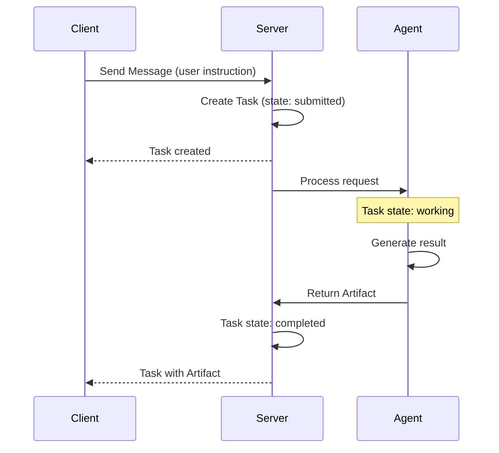
```mermaid
sequenceDiagram
    participant Client
    participant Server
    participant Agent

    Client->>Server: Send Message (user instruction)
    Server->>Server: Create Task (state: submitted)
    Server-->>Client: Task created
    
    Server->>Agent: Process request
    Note over Agent: Task state: working
    Agent->>Agent: Generate result
    
    Agent->>Server: Return Artifact
    Server->>Server: Task state: completed
    Server-->>Client: Task with Artifact
```

**Streaming Task Execution Flow:**
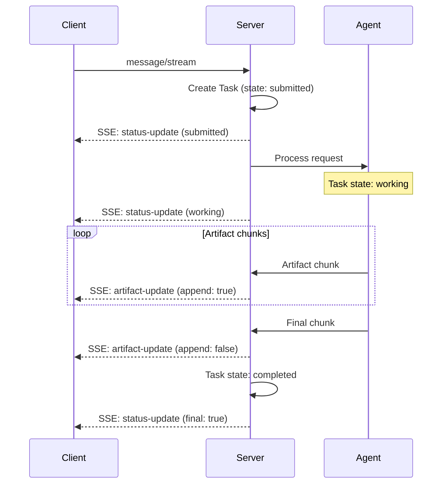
```mermaid
sequenceDiagram
    participant Client
    participant Server
    participant Agent

    Client->>Server: message/stream
    Server->>Server: Create Task (state: submitted)
    Server-->>Client: SSE: status-update (submitted)
    
    Server->>Agent: Process request
    Note over Agent: Task state: working
    Server-->>Client: SSE: status-update (working)
    
    loop Artifact chunks
        Agent->>Server: Artifact chunk
        Server-->>Client: SSE: artifact-update (append: true)
    end
    
    Agent->>Server: Final chunk
    Server-->>Client: SSE: artifact-update (append: false)
    Server->>Server: Task state: completed
    Server-->>Client: SSE: status-update (final: true)
```

**Multi-Turn Interaction Flow:**
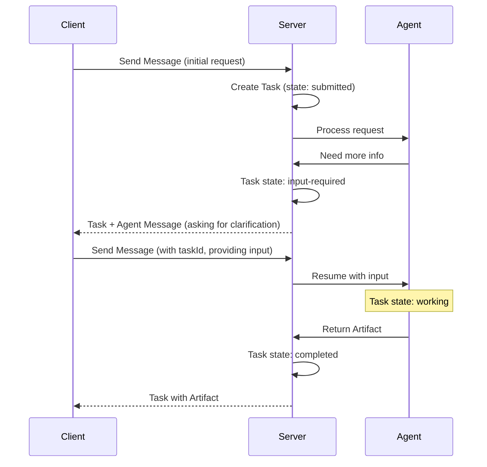
```mermaid
sequenceDiagram
    participant Client
    participant Server
    participant Agent

    Client->>Server: Send Message (initial request)
    Server->>Server: Create Task (state: submitted)
    Server->>Agent: Process request
    
    Agent->>Server: Need more info
    Server->>Server: Task state: input-required
    Server-->>Client: Task + Agent Message (asking for clarification)
    
    Client->>Server: Send Message (with taskId, providing input)
    Server->>Agent: Resume with input
    Note over Agent: Task state: working
    
    Agent->>Server: Return Artifact
    Server->>Server: Task state: completed
    Server-->>Client: Task with Artifact
```

**Key Concepts:**

**Messages:**
- Carry instructions, context, and communication
- User messages initiate or continue tasks
- Agent messages provide status or request input
- Messages are part of the task's `history` array

**Tasks:**
- Central coordination unit tracking work lifecycle
- Created by server in response to user messages
- Contain status, history, and artifacts
- State transitions: `submitted` → `working` → `completed`

**Artifacts:**
- Final, immutable outputs attached to completed tasks
- Delivered as part of the task result
- Can be streamed in chunks for large outputs
- Multiple artifacts possible per task

**Example: Simple Question**
```json
// Client sends message
{
  "method": "message/send",
  "params": {
    "message": {
      "role": "user",
      "parts": [{"kind": "text", "text": "Analyze sales trends"}],
      "messageId": "msg-001"
    }
  }
}

// Server responds with completed task
{
  "result": {
    "id": "task-001",
    "contextId": "ctx-001",
    "status": {"state": "completed"},
    "artifacts": [{
      "artifactId": "art-001",
      "name": "Sales Analysis",
      "parts": [{"kind": "text", "text": "Revenue increased 23%..."}]
    }],
    "history": [/* user message */],
    "kind": "task"
  }
}
```

---

## Task Management

Tasks are the fundamental coordination mechanism in the A2A protocol. They represent stateful execution units that manage the complete lifecycle of work from client request to agent completion. Every interaction between a client and an agent is organized around tasks.

### Task Object

A **Task** is the central coordination unit that tracks work execution. It encapsulates the entire interaction related to a specific goal or request, maintaining conversation history, execution state, and generated artifacts.

**Schema:**
```python
class Task(TypedDict):
    """Stateful execution unit coordinating client-agent interaction.
    
    Tasks serve as the primary coordination mechanism in the bindu protocol,
    managing the complete lifecycle from request to completion. They maintain
    conversation history, track execution state, and collect generated artifacts.
    
    Core Responsibilities:
    - Message Exchange: Facilitate communication between clients and agents
    - State Management: Track task progress and execution status
    - Artifact Collection: Gather and organize agent-generated outputs
    - History Tracking: Maintain complete conversation and decision trail
    
    Task Lifecycle:
    1. Creation: Client initiates task with initial message/requirements
    2. Processing: Agent processes messages and updates status
    3. Communication: Bidirectional message exchange as needed
    4. Artifact Generation: Agent produces deliverable outputs
    5. Completion: Final status update and artifact delivery
    
    Key Properties:
    - Client-Initiated: Always created by clients, never by agents
    - Agent-Controlled: Status and progress determined by executing agent
    - Stateful: Maintains complete execution context and history
    - Traceable: Unique ID enables task tracking and reference
    """
    
    id: Required[UUID]
    """Unique identifier for the task, generated by the server."""
    
    context_id: Required[UUID]
    """The context this task belongs to for session management."""
    
    kind: Required[Literal["task"]]
    """Type discriminator, always "task"."""
    
    status: Required[TaskStatus]
    """Current status including state, timestamp, and optional message."""
    
    artifacts: NotRequired[list[Artifact]]
    """Collection of outputs generated during task execution."""
    
    history: NotRequired[list[Message]]
    """Complete conversation history for this task."""
    
    metadata: NotRequired[dict[str, Any]]
    """Optional metadata for extensions and custom data."""
```

**Realistic Example: Data Analysis Task**

A client requests sales data analysis. The task tracks the entire interaction:

```json
{
  "id": "363422be-b0f9-4692-a24d-278670e7c7f1",
  "contextId": "c295ea44-7543-4f78-b524-7a38915ad6e4",
  "kind": "task",
  "status": {
    "state": "completed",
    "timestamp": "2025-10-31T10:35:00Z",
    "message": {
      "messageId": "status-msg-001",
      "contextId": "c295ea44-7543-4f78-b524-7a38915ad6e4",
      "taskId": "363422be-b0f9-4692-a24d-278670e7c7f1",
      "kind": "message",
      "role": "agent",
      "parts": [
        {
          "kind": "text",
          "text": "Analysis complete. Identified 3 key trends and generated comprehensive report."
        }
      ]
    }
  },
  "artifacts": [
    {
      "artifactId": "9b6934dd-37e3-4eb1-8766-962efaab63a1",
      "name": "Q4 Sales Analysis Report",
      "description": "Comprehensive analysis of Q4 sales trends",
      "parts": [
        {
          "kind": "text",
          "text": "# Q4 Sales Analysis\n\n## Executive Summary\nRevenue increased 23% compared to Q3, driven primarily by mobile sales growth of 45% year-over-year.\n\n## Key Findings\n1. **Revenue Growth**: Total revenue reached $2.45M, up 23% from Q3\n2. **Regional Performance**: West Coast dominated with 35% of total sales\n3. **Mobile Surge**: Mobile channel grew 45% YoY, now 28% of total revenue\n\n## Recommendations\n- Increase inventory allocation for top-performing products\n- Expand mobile marketing campaigns in Q1\n- Focus expansion efforts on West Coast market"
        },
        {
          "kind": "data",
          "data": {
            "summary": {
              "totalRevenue": 2450000,
              "growthRate": 0.23,
              "topRegion": "West Coast",
              "mobileGrowth": 0.45
            },
            "monthlyTrends": [
              {"month": "October", "revenue": 750000, "growth": 0.18},
              {"month": "November", "revenue": 820000, "growth": 0.21},
              {"month": "December", "revenue": 880000, "growth": 0.27}
            ],
            "topProducts": [
              {"name": "Premium Widget", "revenue": 450000, "units": 1200},
              {"name": "Standard Widget", "revenue": 380000, "units": 2500}
            ]
          }
        }
      ],
      "metadata": {
        "generatedAt": "2025-10-31T10:35:00Z",
        "analysisType": "quarterly_sales",
        "dataPoints": 15000
      }
    }
  ],
  "history": [
    {
      "messageId": "9229e770-767c-417b-a0b0-f0741243c589",
      "contextId": "c295ea44-7543-4f78-b524-7a38915ad6e4",
      "taskId": "363422be-b0f9-4692-a24d-278670e7c7f1",
      "kind": "message",
      "role": "user",
      "parts": [
        {
          "kind": "text",
          "text": "Analyze Q4 sales data and identify key trends"
        },
        {
          "kind": "file",
          "file": {
            "name": "sales_q4_2025.csv",
            "mimeType": "text/csv",
            "uri": "https://storage.example.com/data/sales_q4_2025.csv"
          }
        }
      ],
      "metadata": {
        "priority": "high",
        "deadline": "2025-11-01T00:00:00Z"
      }
    },
    {
      "messageId": "agent-msg-001",
      "contextId": "c295ea44-7543-4f78-b524-7a38915ad6e4",
      "taskId": "363422be-b0f9-4692-a24d-278670e7c7f1",
      "kind": "message",
      "role": "agent",
      "parts": [
        {
          "kind": "text",
          "text": "Processing sales data... Analyzing 15,000 transactions across 3 months."
        }
      ],
      "metadata": {
        "timestamp": "2025-10-31T10:30:15Z",
        "processingStage": "data_loading"
      }
    }
  ],
  "metadata": {
    "estimatedDuration": "5 minutes",
    "priority": "high",
    "tags": ["analytics", "sales", "quarterly-report"]
  }
}
```

**What This Example Shows:**
- **Task Identity**: Unique `id` and `contextId` for tracking
- **Status Tracking**: Current state (`completed`) with timestamp and agent message
- **Artifact Delivery**: Complete analysis report with both text and structured data
- **History Preservation**: Full conversation trail from initial request to completion
- **Metadata Context**: Additional information about priority, duration, and categorization

---

### TaskStatus Object

Represents the current state and context of a task at a specific point in time.

**Schema:**
```python
class TaskStatus(TypedDict):
    """Status information for a task at a specific moment.
    
    TaskStatus captures the current execution state along with contextual
    information like timestamps and optional status messages from the agent.
    """
    
    state: Required[TaskState]
    """Current lifecycle state of the task."""
    
    message: NotRequired[Message]
    """Optional message providing status details or context."""
    
    timestamp: Required[str]
    """ISO 8601 datetime when this status was recorded.
    
    Example: "2025-10-31T10:00:00Z"
    """
```

**Example: Task Requiring Input**
```json
{
  "state": "input-required",
  "timestamp": "2025-10-31T10:32:00Z",
  "message": {
    "messageId": "clarification-001",
    "contextId": "c295ea44-7543-4f78-b524-7a38915ad6e4",
    "taskId": "363422be-b0f9-4692-a24d-278670e7c7f1",
    "kind": "message",
    "role": "agent",
    "parts": [
      {
        "kind": "text",
        "text": "I found multiple data files. Which one should I analyze?\n\n1. sales_q4_2025_final.csv\n2. sales_q4_2025_draft.csv\n3. sales_q4_2025_corrected.csv"
      }
    ]
  }
}
```

---

### TaskState Enum

Defines all possible lifecycle states a task can be in during execution.

**Standard A2A States:**

- **`submitted`** - Task has been submitted and is awaiting execution
  - Initial state when task is created
  - Agent has acknowledged receipt but hasn't started processing
  
- **`working`** - Agent is actively working on the task
  - Task is being processed
  - May transition to `input-required`, `completed`, or `failed`
  
- **`input-required`** - Task is paused, waiting for user input
  - Agent needs clarification or additional information
  - Task will resume once user provides required input
  - This is an interrupted state, not terminal
  
- **`completed`** - Task has been successfully completed
  - Final deliverables are available in `artifacts`
  - This is a terminal state - task cannot be modified
  
- **`canceled`** - Task has been canceled by the user
  - User explicitly stopped the task before completion
  - This is a terminal state
  
- **`failed`** - Task failed due to an error during execution
  - Agent encountered an unrecoverable error
  - Error details typically included in status message
  - This is a terminal state
  
- **`rejected`** - Task was rejected by the agent and was not started
  - Agent determined it cannot or will not perform the task
  - May occur during initial creation or after assessment
  - This is a terminal state
  
- **`auth-required`** - Task requires authentication to proceed
  - Additional authentication needed from the client
  - Authentication expected to come out-of-band
  - Not a terminal state - task can resume after auth

**Bindu Extensions** `<NotPartOfA2A>`:

- **`payment-required`** - Task requires payment to proceed
- **`unknown`** - Task is in an unknown or indeterminate state
- **`trust-verification-required`** - Task requires trust verification
- **`pending`** - Task is pending execution (queued)
- **`suspended`** - Task is suspended and not currently running
- **`resumed`** - Task has been resumed after suspension
- **`negotiation-bid-submitted`** - Task bid submitted for negotiation
- **`negotiation-bid-lost`** - Task bid was lost in negotiation
- **`negotiation-bid-won`** - Task bid was won in negotiation

**State Transition Diagram:**

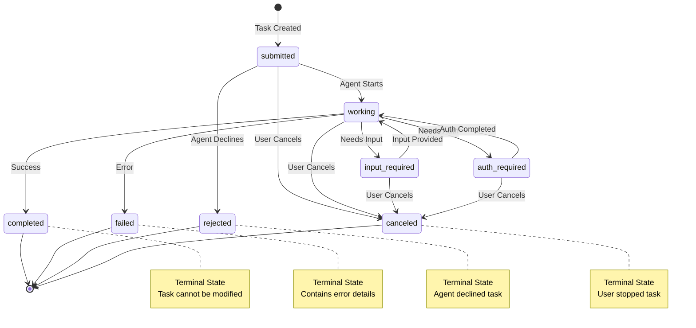
```mermaid
stateDiagram-v2
    [*] --> submitted: Task Created
    
    submitted --> working: Agent Starts
    submitted --> rejected: Agent Declines
    submitted --> canceled: User Cancels
    
    working --> completed: Success
    working --> failed: Error
    working --> input_required: Needs Input
    working --> auth_required: Needs Auth
    working --> canceled: User Cancels
    
    input_required --> working: Input Provided
    input_required --> canceled: User Cancels
    
    auth_required --> working: Auth Completed
    auth_required --> canceled: User Cancels
    
    completed --> [*]
    failed --> [*]
    rejected --> [*]
    canceled --> [*]
    
    note right of completed
        Terminal State
        Task cannot be modified
    end note
    
    note right of failed
        Terminal State
        Contains error details
    end note
    
    note right of rejected
        Terminal State
        Agent declined task
    end note
    
    note right of canceled
        Terminal State
        User stopped task
    end note
```

**Legend:**
- **Terminal States**: `completed`, `failed`, `rejected`, `canceled` - Cannot transition further
- **Interrupted States**: `input-required`, `auth-required` - Can resume to `working`
- **Active States**: `submitted`, `working` - Task is being processed

---

### Task Events

Events notify clients of task state changes and artifact updates, typically used in streaming (SSE) or push notification scenarios to keep clients informed without polling.

#### TaskStatusUpdateEvent

Sent by the agent when a task's status changes, enabling real-time progress tracking.

**Schema:**
```python
class TaskStatusUpdateEvent(TypedDict):
    """Event sent by the agent to notify the client of a change in a task's status.
    
    This is typically used in streaming or subscription models to provide
    real-time updates without requiring the client to poll for changes.
    """
    
    task_id: Required[UUID]
    """The ID of the task being updated."""
    
    context_id: Required[UUID]
    """The ID of the context the task is associated with."""
    
    kind: Required[Literal["status-update"]]
    """The type of the event, always "status-update"."""
    
    status: Required[TaskStatus]
    """The new status of the task."""
    
    final: Required[bool]
    """Indicates if this is the final status update (terminal state reached)."""
    
    metadata: NotRequired[dict[str, Any]]
    """Additional metadata about the event."""
```

**Example: Progress Update During Processing**
```json
{
  "taskId": "225d6247-06ba-4cda-a08b-33ae35c8dcfa",
  "contextId": "05217e44-7e9f-473e-ab4f-2c2dde50a2b1",
  "kind": "status-update",
  "status": {
    "state": "working",
    "timestamp": "2025-10-31T10:30:15Z",
    "message": {
      "messageId": "progress-001",
      "contextId": "05217e44-7e9f-473e-ab4f-2c2dde50a2b1",
      "taskId": "225d6247-06ba-4cda-a08b-33ae35c8dcfa",
      "kind": "message",
      "role": "agent",
      "parts": [
        {
          "kind": "text",
          "text": "Analyzing data... 45% complete"
        }
      ]
    }
  },
  "final": false,
  "metadata": {
    "progressPercentage": 45,
    "estimatedTimeRemaining": "2 minutes"
  }
}
```

**Example: Final Status Update (Completion)**
```json
{
  "taskId": "225d6247-06ba-4cda-a08b-33ae35c8dcfa",
  "contextId": "05217e44-7e9f-473e-ab4f-2c2dde50a2b1",
  "kind": "status-update",
  "status": {
    "state": "completed",
    "timestamp": "2025-10-31T10:35:00Z"
  },
  "final": true
}
```

**Use Cases:**
- Real-time progress tracking for long-running tasks
- Notifying clients when tasks require input or authentication
- Alerting on task completion or failure
- Streaming task execution updates via Server-Sent Events (SSE)

---

#### TaskArtifactUpdateEvent

Sent by the agent when an artifact is generated or updated, enabling incremental delivery of large outputs.

**Schema:**
```python
class TaskArtifactUpdateEvent(TypedDict):
    """Event sent by the agent to notify the client that an artifact has been generated or updated.
    
    This is typically used in streaming models to deliver large artifacts
    incrementally, improving user experience for long-running tasks.
    """
    
    task_id: Required[UUID]
    """The ID of the task producing the artifact."""
    
    context_id: Required[UUID]
    """The ID of the context the task is associated with."""
    
    kind: Required[Literal["artifact-update"]]
    """The type of the event, always "artifact-update"."""
    
    artifact: Required[Artifact]
    """The artifact that has been generated or updated."""
    
    append: NotRequired[bool]
    """If true, append to existing artifact. If false, replace existing artifact."""
    
    last_chunk: NotRequired[bool]
    """If true, this is the last chunk of the artifact."""
    
    metadata: NotRequired[dict[str, Any]]
    """Additional metadata about the event."""
```

**Example: First Chunk (New Artifact)**
```json
{
  "taskId": "225d6247-06ba-4cda-a08b-33ae35c8dcfa",
  "contextId": "05217e44-7e9f-473e-ab4f-2c2dde50a2b1",
  "kind": "artifact-update",
  "artifact": {
    "artifactId": "9b6934dd-37e3-4eb1-8766-962efaab63a1",
    "name": "Market Analysis Report",
    "parts": [
      {
        "kind": "text",
        "text": "# Market Analysis Report\n\n## Executive Summary\n\nOur Q4 analysis reveals significant market shifts..."
      }
    ]
  },
  "append": false,
  "lastChunk": false,
  "metadata": {
    "chunkNumber": 1,
    "totalChunks": 5
  }
}
```

**Example: Subsequent Chunk (Append)**
```json
{
  "taskId": "225d6247-06ba-4cda-a08b-33ae35c8dcfa",
  "contextId": "05217e44-7e9f-473e-ab4f-2c2dde50a2b1",
  "kind": "artifact-update",
  "artifact": {
    "artifactId": "9b6934dd-37e3-4eb1-8766-962efaab63a1",
    "name": "Market Analysis Report",
    "parts": [
      {
        "kind": "text",
        "text": "## Competitive Landscape\n\nThree major competitors have entered the market..."
      }
    ]
  },
  "append": true,
  "lastChunk": false,
  "metadata": {
    "chunkNumber": 3,
    "totalChunks": 5
  }
}
```

**Example: Final Chunk**
```json
{
  "taskId": "225d6247-06ba-4cda-a08b-33ae35c8dcfa",
  "contextId": "05217e44-7e9f-473e-ab4f-2c2dde50a2b1",
  "kind": "artifact-update",
  "artifact": {
    "artifactId": "9b6934dd-37e3-4eb1-8766-962efaab63a1",
    "name": "Market Analysis Report",
    "parts": [
      {
        "kind": "text",
        "text": "## Recommendations\n\n1. Increase marketing spend by 20%\n2. Focus on mobile channels\n3. Expand into West Coast markets"
      }
    ]
  },
  "append": true,
  "lastChunk": true,
  "metadata": {
    "chunkNumber": 5,
    "totalChunks": 5
  }
}
```

**Use Cases:**
- Streaming large reports or documents in chunks
- Progressive rendering of generated content
- Real-time display of agent-generated outputs
- Reducing memory overhead for large artifacts

**Chunking Strategy:**
- `append: false` - Start new artifact or replace existing
- `append: true` - Add content to existing artifact
- `lastChunk: true` - Signal completion of artifact delivery

---

### Task Operations & Parameters

Parameters used for various task operations including execution, querying, and management.

#### TaskSendParams `<NotPartOfA2A>`

Internal parameters for task execution within the Bindu framework.

**Schema:**
```python
class TaskSendParams(TypedDict):
    """Internal parameters for task execution within the framework.
    
    These parameters are used internally by the Bindu framework to manage
    task execution and are not part of the standard A2A protocol.
    """
    
    task_id: Required[UUID]
    """The ID of the task to execute."""
    
    context_id: Required[UUID]
    """The ID of the context the task is associated with."""
    
    message: NotRequired[Message]
    """The message to send to the task."""
    
    history_length: NotRequired[int]
    """The maximum number of history messages to include."""
    
    metadata: NotRequired[dict[str, Any]]
    """Additional metadata for task execution."""
```

**Example:**
```json
{
  "taskId": "363422be-b0f9-4692-a24d-278670e7c7f1",
  "contextId": "c295ea44-7543-4f78-b524-7a38915ad6e4",
  "message": {
    "messageId": "msg-002",
    "role": "user",
    "parts": [
      {
        "kind": "text",
        "text": "Use the final version of the data file"
      }
    ],
    "contextId": "c295ea44-7543-4f78-b524-7a38915ad6e4",
    "taskId": "363422be-b0f9-4692-a24d-278670e7c7f1"
  },
  "historyLength": 10,
  "metadata": {
    "priority": "high"
  }
}
```

---

#### TaskIdParams

Simple parameters containing a task ID, used for basic task operations.

**Schema:**
```python
class TaskIdParams(TypedDict):
    """Defines parameters containing a task ID, used for simple task operations.
    
    This is a base parameter type for operations that only require a task ID,
    such as cancellation or basic retrieval.
    """
    
    task_id: Required[UUID]
    """The ID of the task."""
    
    metadata: NotRequired[dict[str, Any]]
    """Additional metadata for the operation."""
```

**Example: Cancel Task**
```json
{
  "jsonrpc": "2.0",
  "id": 3,
  "method": "tasks/cancel",
  "params": {
    "taskId": "363422be-b0f9-4692-a24d-278670e7c7f1",
    "metadata": {
      "reason": "User requested cancellation"
    }
  }
}
```

---

#### TaskQueryParams

Parameters for querying task details with optional history limiting.

**Schema:**
```python
class TaskQueryParams(TypedDict):
    """Defines parameters for querying a task, with an option to limit history length.
    
    Extends TaskIdParams to add history length control for efficient
    retrieval of task information.
    """
    
    task_id: Required[UUID]
    """The ID of the task to query."""
    
    history_length: NotRequired[int]
    """The maximum number of history messages to return."""
    
    metadata: NotRequired[dict[str, Any]]
    """Additional metadata for the query."""
```

**Example: Get Task with Limited History**
```json
{
  "jsonrpc": "2.0",
  "id": 2,
  "method": "tasks/get",
  "params": {
    "taskId": "363422be-b0f9-4692-a24d-278670e7c7f1",
    "historyLength": 5
  }
}
```

**Response:**
```json
{
  "jsonrpc": "2.0",
  "id": 2,
  "result": {
    "id": "363422be-b0f9-4692-a24d-278670e7c7f1",
    "contextId": "c295ea44-7543-4f78-b524-7a38915ad6e4",
    "kind": "task",
    "status": {
      "state": "completed",
      "timestamp": "2025-10-31T10:35:00Z"
    },
    "artifacts": [/* artifacts */],
    "history": [/* last 5 messages only */]
  }
}
```

**Use Cases:**
- Retrieving task status without full history
- Reducing payload size for list operations
- Efficient polling for task updates
- Getting recent conversation context only

---

#### ListTasksParams `<NotPartOfA2A>`

Parameters for listing multiple tasks with optional history limiting.

**Schema:**
```python
class ListTasksParams(TypedDict):
    """Defines parameters for listing tasks.
    
    This is a Bindu-specific extension for retrieving multiple tasks
    with control over history size to optimize payload.
    """
    
    history_length: NotRequired[int]
    """The maximum number of history messages to return for each task."""
    
    metadata: NotRequired[dict[str, Any]]
    """Additional metadata for filtering or controlling the list operation."""
```

**Example: List All Tasks with Limited History**
```json
{
  "jsonrpc": "2.0",
  "id": 4,
  "method": "tasks/list",
  "params": {
    "historyLength": 3,
    "metadata": {
      "status": "completed",
      "limit": 10
    }
  }
}
```

**Response:**
```json
{
  "jsonrpc": "2.0",
  "id": 4,
  "result": {
    "tasks": [
      {
        "id": "task-001",
        "contextId": "ctx-001",
        "kind": "task",
        "status": {
          "state": "completed",
          "timestamp": "2025-10-31T10:35:00Z"
        },
        "artifacts": [/* artifacts */],
        "history": [/* last 3 messages only */]
      },
      {
        "id": "task-002",
        "contextId": "ctx-001",
        "kind": "task",
        "status": {
          "state": "working",
          "timestamp": "2025-10-31T10:38:00Z"
        },
        "history": [/* last 3 messages only */]
      }
    ],
    "total": 15,
    "page": 1
  }
}
```

**Use Cases:**
- Dashboard views showing multiple tasks
- Task management interfaces
- Batch status checking
- Filtering tasks by status or context
- Pagination with history control

---

#### TaskFeedbackParams `<NotPartOfA2A>`

Parameters for providing feedback on completed tasks.

**Schema:**
```python
class TaskFeedbackParams(TypedDict):
    """Defines parameters for providing feedback on a task.
    
    This is a Bindu-specific extension that enables users to rate
    and provide feedback on task execution quality.
    """
    
    task_id: Required[UUID]
    """The ID of the task to provide feedback for."""
    
    feedback: Required[str]
    """Textual feedback about the task execution."""
    
    rating: NotRequired[int]
    """Optional rating from 1 (lowest) to 5 (highest)."""
    
    metadata: NotRequired[dict[str, Any]]
    """Additional metadata about the feedback."""
```

**Example: Positive Feedback**
```json
{
  "jsonrpc": "2.0",
  "id": 5,
  "method": "tasks/feedback",
  "params": {
    "taskId": "363422be-b0f9-4692-a24d-278670e7c7f1",
    "feedback": "Excellent analysis with actionable insights. The regional breakdown was particularly helpful and the recommendations are clear and practical.",
    "rating": 5,
    "metadata": {
      "helpful": true,
      "accurate": true,
      "timely": true,
      "wouldUseAgain": true
    }
  }
}
```

**Example: Constructive Feedback**
```json
{
  "jsonrpc": "2.0",
  "id": 6,
  "method": "tasks/feedback",
  "params": {
    "taskId": "task-002",
    "feedback": "The analysis was good but took longer than expected. Would appreciate more frequent progress updates.",
    "rating": 3,
    "metadata": {
      "helpful": true,
      "accurate": true,
      "timely": false,
      "suggestions": ["Add progress indicators", "Provide time estimates"]
    }
  }
}
```

**Response:**
```json
{
  "jsonrpc": "2.0",
  "id": 5,
  "result": {
    "success": true,
    "feedbackId": "feedback-001",
    "taskId": "363422be-b0f9-4692-a24d-278670e7c7f1",
    "timestamp": "2025-10-31T10:40:00Z"
  }
}
```

**Rating Scale:**
- **5** - Excellent: Exceeded expectations
- **4** - Good: Met expectations well
- **3** - Satisfactory: Met basic expectations
- **2** - Poor: Below expectations
- **1** - Very Poor: Did not meet expectations

**Use Cases:**
- Quality assurance and agent improvement
- User satisfaction tracking
- Identifying areas for enhancement
- Training data for agent optimization
- Performance metrics and analytics

**Best Practices:**
- Provide specific, actionable feedback
- Use ratings consistently across tasks
- Include context in metadata
- Submit feedback promptly after task completion
- Be constructive in criticism

---

### Message Sending Parameters

Parameters for sending messages to agents to initiate or continue task interactions.

#### MessageSendConfiguration

Configuration options for message sending behavior.

**Schema:**
```python
class MessageSendConfiguration(TypedDict):
    """Configuration for message sending.
    
    Controls how the agent processes the message and how the client
    receives responses, including output format preferences and blocking behavior.
    """
    
    accepted_output_modes: Required[list[str]]
    """The accepted output modes (MIME types) for the response.
    
    Examples: ["text/plain", "application/json", "text/markdown"]
    """
    
    blocking: NotRequired[bool]
    """If true, the request blocks until the task completes or requires input.
    If false, returns immediately with task in 'submitted' or 'working' state.
    """
    
    history_length: NotRequired[int]
    """The maximum number of history messages to include in the response."""
    
    push_notification_config: NotRequired[PushNotificationConfig]
    """Configuration for push notifications about task updates."""
```

**Example: Blocking Request with JSON Output**
```json
{
  "acceptedOutputModes": ["application/json", "text/plain"],
  "blocking": true,
  "historyLength": 10
}
```

**Example: Non-Blocking with Push Notifications**
```json
{
  "acceptedOutputModes": ["text/markdown", "text/plain"],
  "blocking": false,
  "pushNotificationConfig": {
    "id": "notif-001",
    "url": "https://client.example.com/webhook/task-updates",
    "token": "secret-webhook-token",
    "authentication": {
      "type": "http",
      "scheme": "bearer"
    }
  }
}
```

---

#### MessageSendParams

Parameters for sending a message to an agent.

**Schema:**
```python
class MessageSendParams(TypedDict):
    """Parameters for sending messages.
    
    Used to initiate a new task or continue an existing one by sending
    a message to the agent. Cannot be used to restart terminal tasks.
    """
    
    message: Required[Message]
    """The message to send to the agent."""
    
    configuration: Required[MessageSendConfiguration]
    """Configuration for how the message should be processed."""
    
    metadata: NotRequired[dict[str, Any]]
    """Additional metadata for the request."""
```

**Example: Initiate New Task (Blocking)**
```json
{
  "jsonrpc": "2.0",
  "id": 1,
  "method": "message/send",
  "params": {
    "message": {
      "messageId": "9229e770-767c-417b-a0b0-f0741243c589",
      "role": "user",
      "parts": [
        {
          "kind": "text",
          "text": "Analyze Q4 sales data and identify key trends"
        },
        {
          "kind": "file",
          "file": {
            "name": "sales_q4.csv",
            "mimeType": "text/csv",
            "uri": "https://storage.example.com/data/sales_q4.csv"
          }
        }
      ]
    },
    "configuration": {
      "acceptedOutputModes": ["text/plain", "application/json"],
      "blocking": true,
      "historyLength": 5
    },
    "metadata": {
      "priority": "high",
      "source": "dashboard"
    }
  }
}
```

**Response: Completed Task**
```json
{
  "jsonrpc": "2.0",
  "id": 1,
  "result": {
    "id": "363422be-b0f9-4692-a24d-278670e7c7f1",
    "contextId": "c295ea44-7543-4f78-b524-7a38915ad6e4",
    "kind": "task",
    "status": {
      "state": "completed",
      "timestamp": "2025-10-31T10:35:00Z"
    },
    "artifacts": [/* analysis results */],
    "history": [/* conversation */]
  }
}
```

**Example: Continue Existing Task (Provide Input)**
```json
{
  "jsonrpc": "2.0",
  "id": 2,
  "method": "message/send",
  "params": {
    "message": {
      "messageId": "msg-002",
      "taskId": "363422be-b0f9-4692-a24d-278670e7c7f1",
      "contextId": "c295ea44-7543-4f78-b524-7a38915ad6e4",
      "role": "user",
      "parts": [
        {
          "kind": "text",
          "text": "Use the final version: sales_q4_2025_final.csv"
        }
      ]
    },
    "configuration": {
      "acceptedOutputModes": ["text/plain"],
      "blocking": false
    }
  }
}
```

**Important Notes:**
- Cannot restart tasks in terminal states (`completed`, `canceled`, `rejected`, `failed`)
- Use `blocking: true` for quick operations, `false` for long-running tasks
- `acceptedOutputModes` helps agent format response appropriately
- Include `taskId` in message to continue existing task

---

### Push Notification Parameters

Parameters for managing push notification configurations associated with tasks.

#### ListTaskPushNotificationConfigParams

Parameters for retrieving all push notification configurations for a task.

**Schema:**
```python
class ListTaskPushNotificationConfigParams(TypedDict):
    """Parameters for getting list of pushNotificationConfigurations associated with a Task.
    
    Retrieves all webhook configurations that receive updates for this task.
    """
    
    id: Required[UUID]
    """The ID of the task."""
    
    metadata: NotRequired[dict[str, Any]]
    """Additional metadata for the request."""
```

**Example:**
```json
{
  "jsonrpc": "2.0",
  "id": 7,
  "method": "tasks/pushNotificationConfig/list",
  "params": {
    "id": "363422be-b0f9-4692-a24d-278670e7c7f1"
  }
}
```

**Response:**
```json
{
  "jsonrpc": "2.0",
  "id": 7,
  "result": {
    "configs": [
      {
        "id": "notif-001",
        "taskId": "363422be-b0f9-4692-a24d-278670e7c7f1",
        "url": "https://client.example.com/webhook/task-updates",
        "authentication": {
          "type": "http",
          "scheme": "bearer"
        }
      },
      {
        "id": "notif-002",
        "taskId": "363422be-b0f9-4692-a24d-278670e7c7f1",
        "url": "https://backup.example.com/notifications",
        "authentication": {
          "type": "http",
          "scheme": "bearer"
        }
      }
    ]
  }
}
```

---

#### DeleteTaskPushNotificationConfigParams

Parameters for removing a push notification configuration from a task.

**Schema:**
```python
class DeleteTaskPushNotificationConfigParams(TypedDict):
    """Parameters for removing pushNotificationConfiguration associated with a Task.
    
    Removes a specific webhook configuration so it no longer receives
    updates for this task.
    """
    
    id: Required[UUID]
    """The ID of the task."""
    
    push_notification_config_id: Required[UUID]
    """The ID of the push notification configuration to remove."""
    
    metadata: NotRequired[dict[str, Any]]
    """Additional metadata for the request."""
```

**Example:**
```json
{
  "jsonrpc": "2.0",
  "id": 8,
  "method": "tasks/pushNotificationConfig/delete",
  "params": {
    "id": "363422be-b0f9-4692-a24d-278670e7c7f1",
    "pushNotificationConfigId": "notif-001",
    "metadata": {
      "reason": "Webhook endpoint deprecated"
    }
  }
}
```

**Response:**
```json
{
  "jsonrpc": "2.0",
  "id": 8,
  "result": {
    "success": true,
    "deletedConfigId": "notif-001",
    "taskId": "363422be-b0f9-4692-a24d-278670e7c7f1"
  }
}
```

**Use Cases:**
- Clean up obsolete webhook endpoints
- Remove notification configs after task completion
- Update notification routing by removing old configs
- Manage webhook lifecycle

**Related Methods:**
- `tasks/pushNotificationConfig/set` - Add or update notification config
- `tasks/pushNotificationConfig/get` - Retrieve specific config
- `tasks/pushNotificationConfig/list` - List all configs for a task

---

## Context Management

Contexts serve as conversation containers in the Bindu protocol, managing the complete interaction lifecycle between clients and agents. They maintain conversation continuity, preserve context across multiple tasks, and provide session-level organization.

<Note>
Context is a Bindu-specific extension `<NotPartOfA2A>` that goes beyond the standard A2A protocol to enable sophisticated conversation management and session tracking.
</Note>

### Context Object

A **Context** is a conversation session that groups related tasks and maintains interaction history. It provides the organizational structure for multi-turn conversations and enables agents to maintain state across multiple task executions.

**Schema:**
```python
class Context(TypedDict):
    """Conversation session that groups related tasks and maintains interaction history.
    
    Contexts serve as conversation containers in the bindu protocol, managing
    the complete interaction lifecycle between clients and agents. They maintain
    conversation continuity, preserve context across multiple tasks, and provide
    session-level organization.
    
    Core Responsibilities:
    - Session Management: Group related tasks under a unified conversation
    - History Preservation: Maintain complete message history across tasks
    - Context Continuity: Preserve conversation state and references
    - Metadata Tracking: Store session-level information and preferences
    
    Context Lifecycle:
    1. Creation: Client initiates conversation or system creates implicit context
    2. Task Association: Multiple tasks can belong to the same context
    3. History Building: Messages and artifacts accumulate over time
    4. State Management: Track conversation status and metadata
    5. Completion: Context can be closed or archived when conversation ends
    
    Key Properties:
    - Multi-Task: Contains multiple related tasks over time
    - Stateful: Maintains conversation history and context
    - Client-Controlled: Clients can explicitly manage context lifecycle
    - Traceable: Unique ID enables context tracking and reference
    
    Context Relationships:
    - Contains: Multiple tasks (one-to-many relationship)
    - Maintains: Complete conversation history across all tasks
    - Preserves: Session-level metadata and preferences
    - References: Can link to other contexts for complex workflows
    """
    
    context_id: Required[UUID]
    """Unique identifier for the context."""
    
    kind: Required[Literal["context"]]
    """Type discriminator, always "context"."""
    
    tasks: NotRequired[list[UUID]]
    """List of task IDs belonging to this context."""
    
    name: NotRequired[str]
    """Human-readable context name."""
    
    description: NotRequired[str]
    """Context purpose or summary."""
    
    role: Required[str]
    """Role of the context (e.g., "assistant", "analyst", "coordinator")."""
    
    created_at: Required[str]
    """ISO 8601 datetime when context was created.
    
    Example: "2023-10-27T10:00:00Z"
    """
    
    updated_at: Required[str]
    """ISO 8601 datetime when context was last updated.
    
    Example: "2023-10-27T10:00:00Z"
    """
    
    status: NotRequired[Literal["active", "paused", "completed", "archived"]]
    """Current status of the context:
    - active: Context is currently in use
    - paused: Context is temporarily suspended
    - completed: Context has finished its purpose
    - archived: Context is stored for historical reference
    """
    
    tags: NotRequired[list[str]]
    """Organizational tags for categorization and filtering."""
    
    metadata: NotRequired[dict[str, Any]]
    """Custom context metadata for extensions and application-specific data."""
    
    parent_context_id: NotRequired[UUID]
    """For nested or hierarchical contexts."""
    
    reference_context_ids: NotRequired[list[UUID]]
    """Related contexts for cross-referencing."""
    
    extensions: NotRequired[dict[str, Any]]
    """Additional protocol extensions."""
```

**Realistic Example: Multi-Task Analysis Context**

A client engages in a multi-turn conversation about market analysis:

```json
{
  "contextId": "c295ea44-7543-4f78-b524-7a38915ad6e4",
  "kind": "context",
  "name": "Q4 Market Analysis Session",
  "description": "Comprehensive market analysis and strategic planning for Q4 2025",
  "role": "analyst",
  "createdAt": "2025-10-31T09:00:00Z",
  "updatedAt": "2025-10-31T11:30:00Z",
  "status": "active",
  "tasks": [
    "363422be-b0f9-4692-a24d-278670e7c7f1",
    "8f7e6d5c-4b3a-2109-8765-fedcba098765",
    "1a2b3c4d-5e6f-7890-abcd-ef1234567890"
  ],
  "tags": ["market-analysis", "q4-2025", "strategic-planning"],
  "metadata": {
    "department": "Strategy",
    "priority": "high",
    "stakeholders": ["CEO", "CMO", "CFO"],
    "deadline": "2025-11-15T00:00:00Z",
    "budget": 50000,
    "region": "North America"
  }
}
```

**What This Example Shows:**
- **Context Identity**: Unique `contextId` for tracking the conversation
- **Session Organization**: Groups 3 related tasks under one conversation
- **Temporal Tracking**: Creation and update timestamps
- **Status Management**: Active status indicates ongoing work
- **Metadata Context**: Business context like department, priority, and stakeholders
- **Categorization**: Tags for filtering and organization

**Context vs Task:**
- **Context** = The conversation session (container)
- **Task** = Individual work units within the conversation
- One context can contain many tasks
- Tasks inherit context from their parent context

---

### Context Status States

Contexts can be in one of four states:

**Active States:**

- **`active`** - Context is currently in use
  - New tasks can be added
  - Conversation is ongoing
  - Default state for new contexts
  
- **`paused`** - Context is temporarily suspended
  - No new tasks should be created
  - Existing tasks may continue
  - Can be resumed to `active` state

**Terminal States:**

- **`completed`** - Context has finished its purpose
  - All tasks are completed
  - No new tasks should be added
  - Context is considered closed
  
- **`archived`** - Context is stored for historical reference
  - Preserved for audit or review
  - Read-only access
  - Cannot be modified or resumed

**State Transition Diagram:**

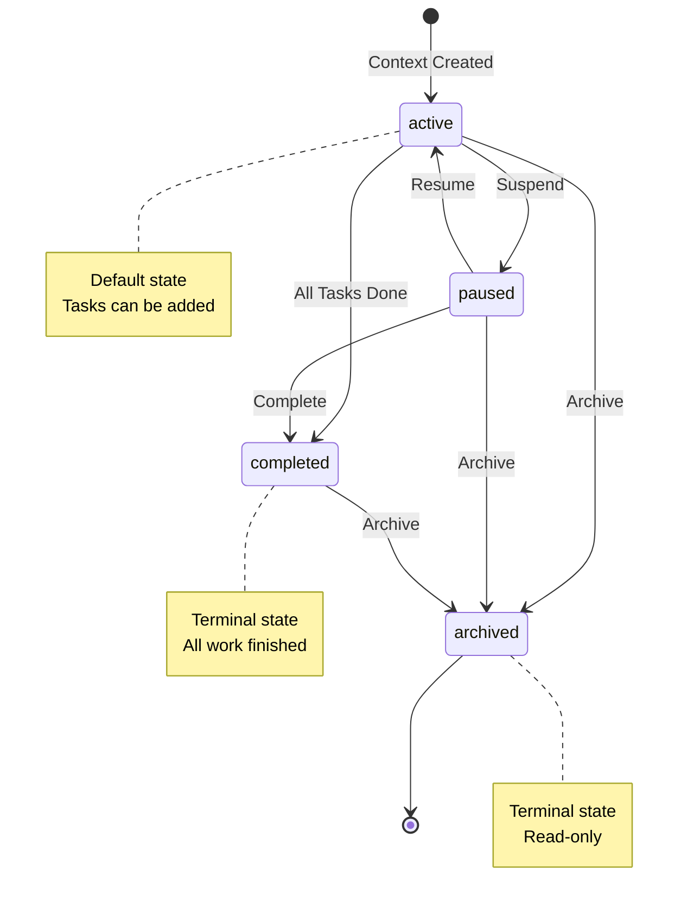
```mermaid
stateDiagram-v2
    [*] --> active: Context Created
    
    active --> paused: Suspend
    active --> completed: All Tasks Done
    active --> archived: Archive
    
    paused --> active: Resume
    paused --> completed: Complete
    paused --> archived: Archive
    
    completed --> archived: Archive
    
    archived --> [*]
    
    note right of active
        Default state
        Tasks can be added
    end note
    
    note right of completed
        Terminal state
        All work finished
    end note
    
    note right of archived
        Terminal state
        Read-only
    end note
```

---

### Context Operations & Parameters

Parameters used for various context operations including creation, querying, and management.

#### ContextIdParams

Simple parameters containing a context ID, used for basic context operations.

**Schema:**
```python
class ContextIdParams(TypedDict):
    """Parameters for context identification.
    
    Used for operations that only require a context ID, such as
    retrieval, deletion, or basic status checks.
    """
    
    context_id: Required[UUID]
    """The ID of the context."""
    
    metadata: NotRequired[dict[str, Any]]
    """Additional metadata for the operation."""
```

**Example: Get Context**
```json
{
  "jsonrpc": "2.0",
  "id": 7,
  "method": "contexts/get",
  "params": {
    "contextId": "c295ea44-7543-4f78-b524-7a38915ad6e4"
  }
}
```

**Response:**
```json
{
  "jsonrpc": "2.0",
  "id": 7,
  "result": {
    "contextId": "c295ea44-7543-4f78-b524-7a38915ad6e4",
    "kind": "context",
    "name": "Q4 Market Analysis Session",
    "role": "analyst",
    "status": "active",
    "tasks": ["363422be-b0f9-4692-a24d-278670e7c7f1"],
    "createdAt": "2025-10-31T09:00:00Z",
    "updatedAt": "2025-10-31T11:30:00Z"
  }
}
```

---

#### ContextQueryParams

Parameters for querying context details with optional history limiting.

**Schema:**
```python
class ContextQueryParams(TypedDict):
    """Query parameters for a context.
    
    Extends ContextIdParams to add history length control for efficient
    retrieval of context information with task history.
    """
    
    context_id: Required[UUID]
    """The ID of the context to query."""
    
    history_length: NotRequired[int]
    """The maximum number of history messages to return per task."""
    
    metadata: NotRequired[dict[str, Any]]
    """Additional metadata for the query."""
```

**Example: Get Context with Limited Task History**
```json
{
  "jsonrpc": "2.0",
  "id": 8,
  "method": "contexts/get",
  "params": {
    "contextId": "c295ea44-7543-4f78-b524-7a38915ad6e4",
    "historyLength": 5
  }
}
```

**Response:**
```json
{
  "jsonrpc": "2.0",
  "id": 8,
  "result": {
    "contextId": "c295ea44-7543-4f78-b524-7a38915ad6e4",
    "kind": "context",
    "name": "Q4 Market Analysis Session",
    "role": "analyst",
    "status": "active",
    "tasks": [
      "363422be-b0f9-4692-a24d-278670e7c7f1",
      "8f7e6d5c-4b3a-2109-8765-fedcba098765"
    ],
    "createdAt": "2025-10-31T09:00:00Z",
    "updatedAt": "2025-10-31T11:30:00Z",
    "metadata": {
      "taskCount": 2,
      "lastActivity": "2025-10-31T11:30:00Z"
    }
  }
}
```

**Use Cases:**
- Retrieving context status without full task history
- Reducing payload size for context queries
- Getting recent conversation context only
- Efficient context monitoring

---

#### ListContextsParams

Parameters for listing multiple contexts with optional history limiting.

**Schema:**
```python
class ListContextsParams(TypedDict):
    """Parameters for listing contexts.
    
    Used to retrieve multiple contexts with control over history size
    and filtering options to optimize payload and query performance.
    """
    
    history_length: NotRequired[int]
    """The maximum number of history messages to return for each task in each context."""
    
    metadata: NotRequired[dict[str, Any]]
    """Additional metadata for filtering or controlling the list operation.
    
    Common filters:
    - status: Filter by context status (active, paused, completed, archived)
    - tags: Filter by tags
    - role: Filter by context role
    - limit: Maximum number of contexts to return
    - offset: Pagination offset
    - sortBy: Sort field (createdAt, updatedAt, name)
    - sortOrder: Sort direction (asc, desc)
    """
```

**Example: List Active Contexts**
```json
{
  "jsonrpc": "2.0",
  "id": 9,
  "method": "contexts/list",
  "params": {
    "historyLength": 3,
    "metadata": {
      "status": "active",
      "limit": 10,
      "sortBy": "updatedAt",
      "sortOrder": "desc"
    }
  }
}
```

**Response:**
```json
{
  "jsonrpc": "2.0",
  "id": 9,
  "result": {
    "contexts": [
      {
        "contextId": "c295ea44-7543-4f78-b524-7a38915ad6e4",
        "kind": "context",
        "name": "Q4 Market Analysis Session",
        "role": "analyst",
        "status": "active",
        "tasks": ["363422be-b0f9-4692-a24d-278670e7c7f1"],
        "createdAt": "2025-10-31T09:00:00Z",
        "updatedAt": "2025-10-31T11:30:00Z",
        "tags": ["market-analysis", "q4-2025"]
      },
      {
        "contextId": "a1b2c3d4-e5f6-7890-abcd-ef1234567890",
        "kind": "context",
        "name": "Customer Support Session",
        "role": "support",
        "status": "active",
        "tasks": ["task-001", "task-002"],
        "createdAt": "2025-10-31T10:15:00Z",
        "updatedAt": "2025-10-31T11:25:00Z",
        "tags": ["support", "customer-inquiry"]
      }
    ],
    "total": 15,
    "page": 1,
    "pageSize": 10
  }
}
```

**Use Cases:**
- Dashboard views showing active conversations
- Context management interfaces
- Session monitoring and analytics
- Filtering contexts by status, role, or tags
- Pagination with history control
- Finding contexts by criteria

**Common Filtering Patterns:**

**By Status:**
```json
{
  "metadata": {
    "status": "active"
  }
}
```

**By Tags:**
```json
{
  "metadata": {
    "tags": ["market-analysis", "high-priority"]
  }
}
```

**By Date Range:**
```json
{
  "metadata": {
    "createdAfter": "2025-10-01T00:00:00Z",
    "createdBefore": "2025-10-31T23:59:59Z"
  }
}
```

**With Pagination:**
```json
{
  "metadata": {
    "limit": 20,
    "offset": 40,
    "sortBy": "updatedAt",
    "sortOrder": "desc"
  }
}
```

---

### Context Best Practices

**Context Decision Flow:**
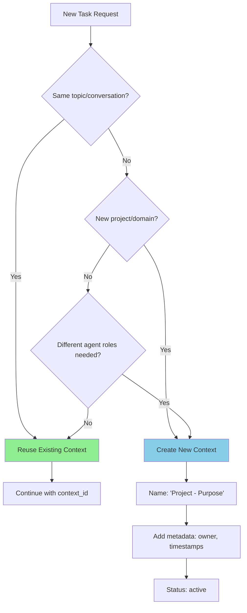
```mermaid
flowchart TD
    Start[New Task Request] --> Question{Same topic/conversation?}
    
    Question -->|Yes| Reuse[Reuse Existing Context]
    Question -->|No| NewTopic{New project/domain?}
    
    NewTopic -->|Yes| Create[Create New Context]
    NewTopic -->|No| Roles{Different agent roles needed?}
    
    Roles -->|Yes| Create
    Roles -->|No| Reuse
    
    Reuse --> Continue[Continue with context_id]
    Create --> Name[Name: 'Project - Purpose']
    
    Name --> Metadata[Add metadata: owner, timestamps]
    Metadata --> Active[Status: active]
    
    style Reuse fill:#90EE90
    style Create fill:#87CEEB
```

**Lifecycle States:**
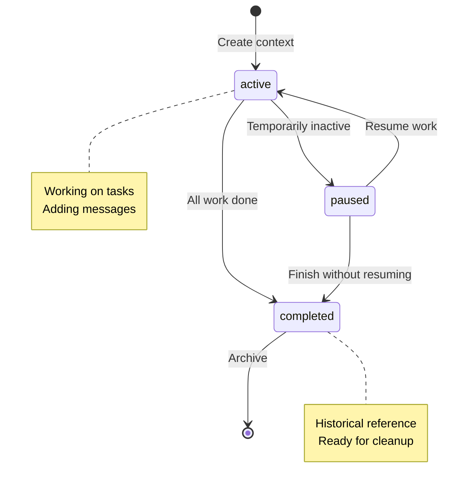
```mermaid
stateDiagram-v2
    [*] --> active: Create context
    active --> paused: Temporarily inactive
    paused --> active: Resume work
    active --> completed: All work done
    paused --> completed: Finish without resuming
    completed --> [*]: Archive
    
    note right of active
        Working on tasks
        Adding messages
    end note
    
    note right of completed
        Historical reference
        Ready for cleanup
    end note
```

**Quick Tips:**
- **Naming**: Use format `"Project - Purpose"` (e.g., "Q4 Sales - Analysis", "Support - Ticket #1234")
- **Metadata**: Store business context, ownership, timestamps for filtering and tracking
- **Performance**: Use `historyLength` parameter to limit payload size when fetching contexts
- **Cleanup**: Regularly archive completed contexts to maintain system performance

---


## Agent-to-Agent Negotiation `<NotPartOfA2A>`

Agent-to-agent negotiation enables autonomous agents to coordinate, negotiate terms, and reach agreements for collaborative task execution. This protocol extension allows agents to propose, counter-propose, accept, or reject collaboration terms in a structured manner.

### NegotiationProposal

A structured negotiation proposal exchanged between agents during the negotiation process.

**Schema:**
```python
@pydantic.with_config(ConfigDict(alias_generator=to_camel))
class NegotiationProposal(TypedDict):
    """Structured negotiation proposal exchanged between agents."""

    proposal_id: Required[UUID]
    """The ID of the proposal."""

    from_agent: Required[UUID]
    """The ID of the agent making the proposal."""

    to_agent: Required[UUID]
    """The ID of the agent receiving the proposal."""

    terms: Required[Dict[str, Any]]
    """The terms of the proposal."""

    timestamp: Required[str]
    """The timestamp of the proposal."""

    status: Required[NegotiationStatus]
    """The status of the proposal."""
```

**Example: Task Delegation Proposal**
```json
{
  "proposalId": "550e8400-e29b-41d4-a716-446655440000",
  "fromAgent": "did:example:agent-1",
  "toAgent": "did:example:agent-2",
  "terms": {
    "taskType": "data-processing",
    "maxDurationMinutes": 30,
    "costCredits": 100,
    "priority": "high",
    "deliverables": ["processed_data.csv", "analysis_report.pdf"]
  },
  "timestamp": "2025-10-31T10:00:00Z",
  "status": "proposed"
}
```

**What it's for:** Enables agents to formally propose collaboration terms including task specifications, resource requirements, costs, and expected deliverables. Proposals can be accepted, rejected, or countered by the receiving agent.

---

### NegotiationContext

Context details for managing the complete lifecycle of agent-to-agent negotiations, including all participants and proposals.

**Schema:**
```python
@pydantic.with_config(ConfigDict(alias_generator=to_camel))
class NegotiationContext(TypedDict):
    """Context details for agent-to-agent negotiations."""

    context_id: Required[UUID]
    """The ID of the context."""

    status: Required[NegotiationStatus]
    """The status of the context."""

    participants: Required[List[str]]
    """The participants in the context."""

    proposals: Required[List[NegotiationProposal]]
    """The proposals in the context."""
```

**Example: Multi-Agent Negotiation Session**
```json
{
  "contextId": "c295ea44-7543-4f78-b524-7a38915ad6e4",
  "status": "ongoing",
  "participants": [
    "did:example:agent-coordinator",
    "did:example:agent-processor",
    "did:example:agent-validator"
  ],
  "proposals": [
    {
      "proposalId": "550e8400-e29b-41d4-a716-446655440000",
      "fromAgent": "did:example:agent-coordinator",
      "toAgent": "did:example:agent-processor",
      "terms": {
        "taskType": "data-processing",
        "maxDurationMinutes": 30,
        "costCredits": 100
      },
      "timestamp": "2025-10-31T10:00:00Z",
      "status": "accepted"
    },
    {
      "proposalId": "661f9511-f3ac-52e5-b827-557766551111",
      "fromAgent": "did:example:agent-coordinator",
      "toAgent": "did:example:agent-validator",
      "terms": {
        "taskType": "validation",
        "maxDurationMinutes": 15,
        "costCredits": 50
      },
      "timestamp": "2025-10-31T10:05:00Z",
      "status": "proposed"
    }
  ]
}
```

**What it's for:** Tracks the complete negotiation session between multiple agents, maintaining all proposals, counter-proposals, and the current negotiation status. Enables complex multi-party negotiations for collaborative task execution.

---

### Negotiation Flow Pattern

Understanding how agents negotiate and reach agreements:

**Basic Negotiation Flow:**
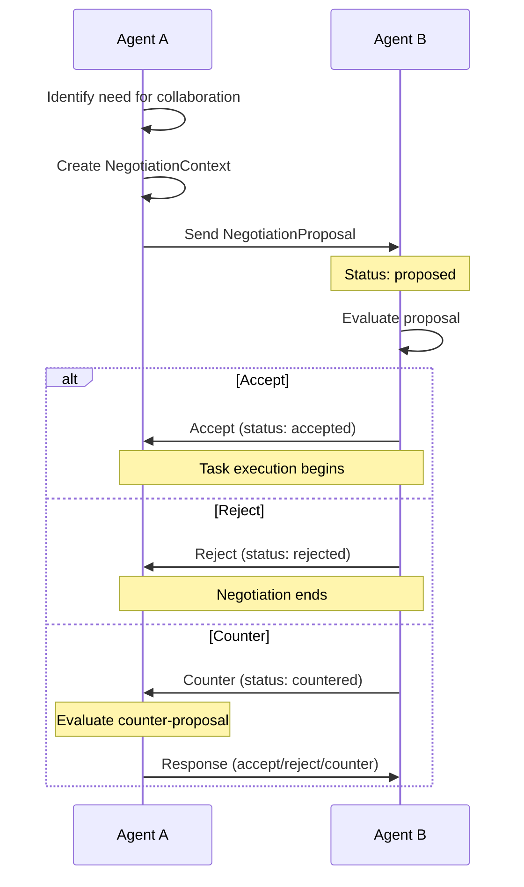
```mermaid
sequenceDiagram
    participant AgentA as Agent A
    participant AgentB as Agent B

    AgentA->>AgentA: Identify need for collaboration
    AgentA->>AgentA: Create NegotiationContext
    
    AgentA->>AgentB: Send NegotiationProposal
    Note over AgentB: Status: proposed
    
    AgentB->>AgentB: Evaluate proposal
    
    alt Accept
        AgentB->>AgentA: Accept (status: accepted)
        Note over AgentA,AgentB: Task execution begins
    else Reject
        AgentB->>AgentA: Reject (status: rejected)
        Note over AgentA,AgentB: Negotiation ends
    else Counter
        AgentB->>AgentA: Counter (status: countered)
        Note over AgentA: Evaluate counter-proposal
        AgentA->>AgentB: Response (accept/reject/counter)
    end
```

**Multi-Agent Negotiation Flow:**
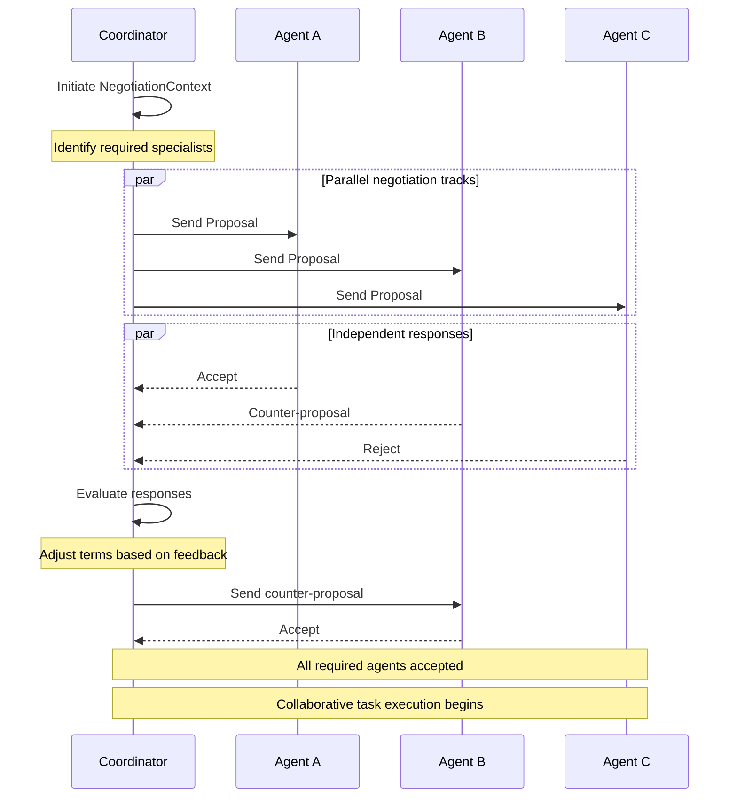
```mermaid
sequenceDiagram
    participant Coord as Coordinator
    participant AgentA as Agent A
    participant AgentB as Agent B
    participant AgentC as Agent C

    Coord->>Coord: Initiate NegotiationContext
    Note over Coord: Identify required specialists
    
    par Parallel negotiation tracks
        Coord->>AgentA: Send Proposal
        Coord->>AgentB: Send Proposal
        Coord->>AgentC: Send Proposal
    end
    
    par Independent responses
        AgentA-->>Coord: Accept
        AgentB-->>Coord: Counter-proposal
        AgentC-->>Coord: Reject
    end
    
    Coord->>Coord: Evaluate responses
    Note over Coord: Adjust terms based on feedback
    
    Coord->>AgentB: Send counter-proposal
    AgentB-->>Coord: Accept
    
    Note over Coord,AgentC: All required agents accepted
    Note over Coord,AgentC: Collaborative task execution begins
```

**Negotiation Statuses (Individual Proposals):**
- **`proposed`** - Initial offer made, awaiting response
- **`accepted`** - Offer accepted, ready to proceed
- **`rejected`** - Offer declined, negotiation path closed
- **`countered`** - Counter-offer made, negotiation continues

**Session Statuses (Overall Context):**
- **`initiated`** - Negotiation session started
- **`ongoing`** - Active negotiation in progress
- **`completed`** - Agreement reached, all parties aligned
- **`rejected`** - Negotiation failed, no agreement possible

---

## Security & Authentication

Security schemes define how agents authenticate requests and establish trust. Bindu supports multiple authentication methods following the [A2A Protocol specification](https://a2a-protocol.org/latest/specification/).

### HTTPAuthSecurityScheme

**Schema:**
```python
class HTTPAuthSecurityScheme(TypedDict):
    """HTTP security scheme supporting various authentication methods.
    
    Supports standard HTTP authentication schemes including Basic, Bearer,
    Digest, and custom schemes. Commonly used for token-based authentication
    with JWTs or other bearer token formats.
    """
    
    type: Required[Literal["http"]]
    """The type of the security scheme. Always "http"."""
    
    scheme: Required[str]
    """The HTTP authentication scheme (e.g., "basic", "bearer", "digest")."""
    
    bearer_format: NotRequired[str]
    """Format hint for bearer tokens (e.g., "JWT")."""
    
    description: NotRequired[str]
    """Human-readable description of the security scheme."""
```

**Use Case 1: Bearer Token with JWT**
```json
{
  "type": "http",
  "scheme": "bearer",
  "bearerFormat": "JWT",
  "description": "JWT bearer token authentication for API access"
}
```

**Use Case 2: Basic Authentication**
```json
{
  "type": "http",
  "scheme": "basic",
  "description": "HTTP Basic authentication with username and password"
}
```

**What it's for:** Token-based authentication using standard HTTP authentication schemes. Most commonly used with Bearer tokens (JWT) for stateless API authentication, but also supports Basic auth for simple username/password scenarios.

---

### APIKeySecurityScheme

**Schema:**
```python
class APIKeySecurityScheme(TypedDict):
    """API Key security scheme for key-based authentication.
    
    Supports passing API keys through query parameters, HTTP headers, or
    cookies. Commonly used for simple service-to-service authentication
    or public API access control.
    """
    
    type: Required[Literal["apiKey"]]
    """The type of the security scheme. Always "apiKey"."""
    
    name: Required[str]
    """The name of the header, query parameter, or cookie."""
    
    in_: Required[Literal["query", "header", "cookie"]]
    """Location of the API key: "query", "header", or "cookie"."""
    
    description: NotRequired[str]
    """Human-readable description of the security scheme."""
```

**Use Case 1: Header-based API Key**
```json
{
  "type": "apiKey",
  "name": "X-API-Key",
  "in": "header",
  "description": "API key passed in custom X-API-Key header"
}
```

**What it's for:** Simple key-based authentication where a static or rotating API key is passed in requests. Ideal for service-to-service communication, webhook authentication, or public API rate limiting and access control.

---

### OAuth2SecurityScheme

**Schema:**
```python
class OAuth2SecurityScheme(TypedDict):
    """OAuth2 security scheme for delegated authorization.
    
    Supports multiple OAuth 2.0 flows including authorization code, implicit,
    password credentials, and client credentials. Used for secure delegated
    access where users authorize agents to act on their behalf.
    """
    
    type: Required[Literal["oauth2"]]
    """The type of the security scheme. Always "oauth2"."""
    
    flows: Required[dict[str, Any]]
    """OAuth2 flow configurations. Supported flows:
    - authorizationCode: Authorization code flow (most secure)
    - implicit: Implicit flow (browser-based)
    - password: Resource owner password credentials flow
    - clientCredentials: Client credentials flow (service-to-service)
    """
    
    description: NotRequired[str]
    """Human-readable description of the security scheme."""
```

**Use Case 1: Authorization Code Flow (User Authorization)**
```json
{
  "type": "oauth2",
  "flows": {
    "authorizationCode": {
      "authorizationUrl": "https://auth.example.com/oauth/authorize",
      "tokenUrl": "https://auth.example.com/oauth/token",
      "scopes": {
        "read": "Read access to user data",
        "write": "Write access to user data",
        "admin": "Administrative access"
      }
    }
  },
  "description": "OAuth2 authorization code flow for user-delegated access"
}
```

**What it's for:** Delegated authorization where agents need to access resources on behalf of users or other services. Authorization code flow is used when users need to grant permission, while client credentials flow is used for direct service-to-service authentication without user involvement.

---

### OpenIdConnectSecurityScheme

**Schema:**
```python
class OpenIdConnectSecurityScheme(TypedDict):
    """OpenID Connect security scheme for identity authentication.
    
    Built on top of OAuth 2.0, OpenID Connect adds an identity layer for
    user authentication. Uses discovery documents for automatic configuration
    of endpoints and supported features.
    """
    
    type: Required[Literal["openIdConnect"]]
    """The type of the security scheme. Always "openIdConnect"."""
    
    open_id_connect_url: Required[str]
    """URL to the OpenID Connect discovery document.
    Typically: https://auth.example.com/.well-known/openid-configuration
    """
    
    description: NotRequired[str]
    """Human-readable description of the security scheme."""
```

**Use Case: Enterprise SSO with OpenID Connect**
```json
{
  "type": "openIdConnect",
  "openIdConnectUrl": "https://auth.example.com/.well-known/openid-configuration",
  "description": "OpenID Connect authentication with automatic discovery for enterprise SSO"
}
```

**What it's for:** Identity authentication using OpenID Connect, typically for enterprise single sign-on (SSO) scenarios. The discovery URL automatically configures authentication endpoints, supported scopes, and token formats, making it easier to integrate with identity providers like Keycloak, Azure AD, or Okta.

---

### MutualTLSSecurityScheme

**Schema:**
```python
class MutualTLSSecurityScheme(TypedDict):
    """Mutual TLS security scheme for certificate-based authentication.
    
    Uses client certificates for mutual authentication where both client
    and server verify each other's identity. Provides strong cryptographic
    authentication for high-security service-to-service communication.
    """
    
    type: Required[Literal["mutualTLS"]]
    """The type of the security scheme. Always "mutualTLS"."""
    
    description: NotRequired[str]
    """Human-readable description of the security scheme."""
```

**Use Case: High-Security Service Communication**
```json
{
  "type": "mutualTLS",
  "description": "Client certificate authentication for secure service-to-service communication"
}
```

**What it's for:** High-security authentication using client certificates where both parties verify each other's identity through TLS. Commonly used in zero-trust architectures, financial services, healthcare systems, or any scenario requiring strong cryptographic authentication without relying on passwords or tokens.

---

### SecurityScheme: Union Type

The `SecurityScheme` type is a discriminated union of all security scheme types:

```python
SecurityScheme = Annotated[
    Union[
        HTTPAuthSecurityScheme,
        APIKeySecurityScheme,
        OAuth2SecurityScheme,
        OpenIdConnectSecurityScheme,
        MutualTLSSecurityScheme,
    ],
    Discriminator("type"),
]
```

The `type` field acts as a discriminator to determine which security scheme is being used. All security schemes use camelCase for field names (e.g., `bearerFormat`, `openIdConnectUrl`) following the A2A Protocol specification.

### Choosing the Right Security Scheme

**Quick Reference:**

| Scheme | Best For | Complexity | Security Level |
|--------|----------|------------|----------------|
| **HTTP Auth (Bearer)** | API tokens, JWTs | Low | Medium-High |
| **HTTP Auth (Basic)** | Simple username/password | Very Low | Low-Medium |
| **API Key** | Service-to-service, webhooks | Very Low | Low-Medium |
| **OAuth2** | User authorization, delegated access | High | High |
| **OpenID Connect** | Enterprise SSO, identity verification | Medium | High |
| **Mutual TLS** | Zero-trust, high-security services | High | Very High |

**Decision Guide:**

- **Need simple token authentication?** → Use HTTP Auth with Bearer tokens (JWT)
- **Building a public API?** → Use API Key for rate limiting and access control
- **Users need to authorize agents?** → Use OAuth2 Authorization Code flow
- **Service-to-service without users?** → Use OAuth2 Client Credentials or API Key
- **Enterprise SSO integration?** → Use OpenID Connect
- **Maximum security required?** → Use Mutual TLS with client certificates
- **Legacy system with Basic auth?** → Use HTTP Auth with Basic scheme

**Security Best Practices:**

- Always use HTTPS/TLS for all authentication schemes except Mutual TLS (which provides its own transport security)
- Rotate API keys regularly and never commit them to version control
- Use short-lived tokens (15-60 minutes) with refresh token rotation for OAuth2
- Implement rate limiting regardless of authentication method
- Log authentication attempts and monitor for suspicious patterns
- Use the principle of least privilege - grant only necessary scopes/permissions

---

## Notifications

Push notification configurations define how servers send real-time updates to clients outside of active sessions. Bindu supports multiple notification patterns following the [A2A Protocol specification](https://a2a-protocol.org/latest/specification/).

### PushNotificationConfig

**Schema:**
```python
@pydantic.with_config(ConfigDict(alias_generator=to_camel))
class PushNotificationConfig(TypedDict):
    """Configuration for push notifications.
    
    When the server needs to notify the client of an update outside of a connected session.
    """
    
    id: NotRequired[str]
    """A unique identifier (e.g. UUID) for the push notification configuration.
    Set by the client to support multiple notification callbacks."""
    
    url: Required[str]
    """The callback URL where the agent should send push notifications."""
    
    token: NotRequired[str]
    """A unique token for this task or session to validate incoming push notifications."""
    
    authentication: NotRequired[PushNotificationAuthenticationInfo]
    """Optional authentication details for the agent to use when calling the notification URL."""
```

**Use Case: Webhook-based Push Notifications**
```json
{
  "url": "https://client.example.com/webhook/notifications",
  "token": "secure-webhook-token",
  "authentication": {
    "schemes": ["Bearer"],
    "credentials": "optional-bearer-token"
  }
}
```

**What it's for:** Configuring push notification endpoints where the server can send real-time updates to clients outside of active sessions. Used for notifying clients about task state changes, completion events, or errors without requiring constant polling.

---

### PushNotificationAuthenticationInfo

**Schema:**
```python
@pydantic.with_config(ConfigDict(alias_generator=to_camel))
class PushNotificationAuthenticationInfo(TypedDict):
    """Authentication information for push notifications.
    
    Defines supported authentication schemes and credentials for push notification endpoints.
    """
    
    schemes: list[str]
    """A list of supported authentication schemes (e.g., 'Basic', 'Bearer')."""
    
    credentials: NotRequired[str]
    """Optional credentials required by the push notification endpoint."""
```

**Use Case: Multi-scheme Authentication Support**
```json
{
  "schemes": ["Bearer", "Basic"],
  "credentials": "eyJhbGciOiJIUzI1NiIsInR5cCI6IkpXVCJ9..."
}
```

**What it's for:** Specifying authentication requirements for push notification endpoints. Allows clients to declare which authentication schemes they support and provide necessary credentials for the server to authenticate when sending notifications.

---

### TaskPushNotificationConfig

**Schema:**
```python
@pydantic.with_config(ConfigDict(alias_generator=to_camel))
class TaskPushNotificationConfig(TypedDict):
    """Configuration for task push notifications.
    
    Links a specific task to a push notification configuration for receiving updates.
    """
    
    task_id: Required[str]
    """The unique identifier (e.g. UUID) of the task."""
    
    push_notification_config: Required[PushNotificationConfig]
    """The push notification configuration for this task."""
```

**Use Case: Task-specific Notification Setup**
```json
{
  "taskId": "43667960-d455-4453-b0cf-1bae4955270d",
  "pushNotificationConfig": {
    "url": "https://client.example.com/webhook/a2a-notifications",
    "token": "secure-client-token-for-task-aaa",
    "authentication": {
      "schemes": ["Bearer"]
    }
  }
}
```

**What it's for:** Associating specific tasks with push notification configurations. Enables task-level notification routing where different tasks can send updates to different endpoints or use different authentication methods.

### How Push Notifications Work

**Workflow:**
1. **Client configures** push notifications when sending a message via `message/send`
2. **Server acknowledges** the task and begins processing
3. **Server completes** the task and POSTs notification to the client's webhook URL
4. **Client validates** the notification using the token and authentication
5. **Client processes** the task update (e.g., updates UI, notifies user)

**Notification Delivery:**
When a task state changes, the server sends an HTTP POST to the configured webhook URL:

```http
POST /webhook/a2a-notifications HTTP/1.1
Host: client.example.com
Authorization: Bearer <server_jwt_for_webhook_audience>
Content-Type: application/json
X-A2A-Notification-Token: secure-client-token-for-task-aaa

{
  "id": "43667960-d455-4453-b0cf-1bae4955270d",
  "contextId": "c295ea44-7543-4f78-b524-7a38915ad6e4",
  "status": {
    "state": "completed",
    "timestamp": "2024-03-15T18:30:00Z"
  },
  "kind": "task"
}
```

### Summary

Push notifications solve a simple problem: instead of constantly asking "Is it done yet?", the agent calls you when it's finished.

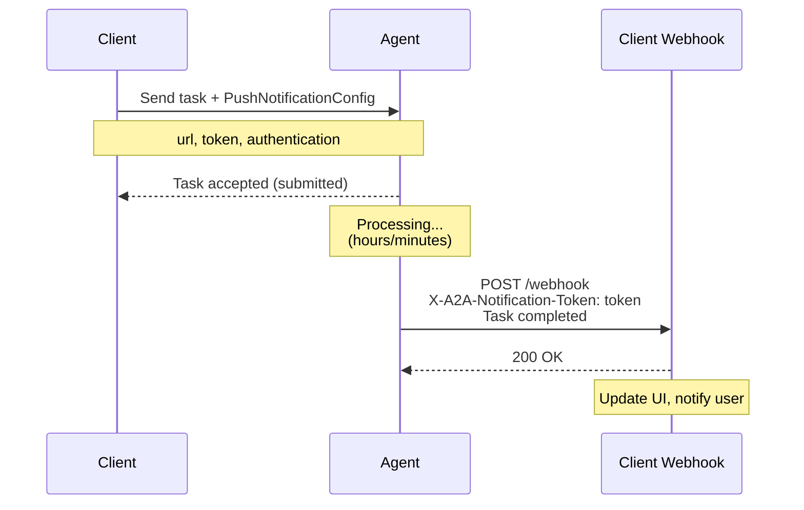
```mermaid
sequenceDiagram
    participant Client
    participant Agent
    participant Webhook as Client Webhook

    Client->>Agent: Send task + PushNotificationConfig
    Note over Client,Agent: url, token, authentication
    Agent-->>Client: Task accepted (submitted)
    
    Note over Agent: Processing...<br/>(hours/minutes)
    
    Agent->>Webhook: POST /webhook<br/>X-A2A-Notification-Token: token<br/>Task completed
    Webhook-->>Agent: 200 OK
    Note over Webhook: Update UI, notify user
```

You configure a **PushNotificationConfig** with your webhook URL and token—like giving the agent your callback number. Add **PushNotificationAuthenticationInfo** to specify how the agent should authenticate when calling your webhook. Use **TaskPushNotificationConfig** to route different tasks to different endpoints with their own security requirements.

This eliminates polling overhead and enables real-time updates for long-running operations—report generation, batch processing, or workflows needing human confirmation.

---

## Payment Models (AP2 Protocol)

Payment models enable agents to handle commerce transactions, from simple purchases to complex multi-party negotiations. These types support the Agent Payments Protocol (AP2) for autonomous commerce.

### Overview

The AP2 protocol defines two categories of types:

**Basic Payment Types** - Building blocks for transactions:
- **ContactAddress** - Physical addresses for shipping/billing
- **PaymentCurrencyAmount** - Monetary values with currency codes
- **PaymentItem** - Line items with pricing and refund policies
- **PaymentShippingOption** - Delivery method choices
- **PaymentOptions** - Checkout configuration (what to collect)
- **PaymentMethodData** - Supported payment methods
- **PaymentDetailsModifier** - Method-specific price adjustments
- **PaymentDetailsInit** - Complete order breakdown
- **PaymentRequest** - Full payment request from merchant
- **PaymentResponse** - User's payment authorization

**Mandate Types** - Trust framework for disputes:
- **IntentMandate** - User's purchase intent with constraints
- **CartContents** - Shopping cart structure
- **CartMandate** - Merchant's signed price guarantee
- **PaymentMandateContents** - Payment authorization details
- **PaymentMandate** - User's cryptographic signature

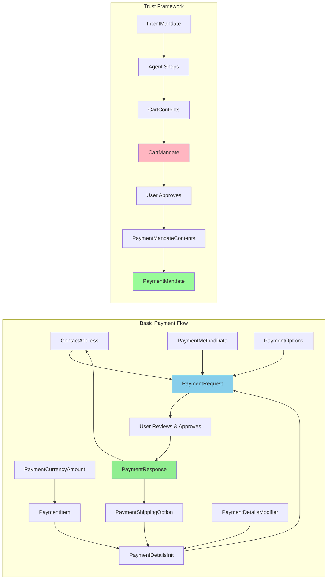
```mermaid
graph LR
    subgraph "Basic Payment Flow"
        A[ContactAddress] --> B[PaymentRequest]
        C[PaymentCurrencyAmount] --> D[PaymentItem]
        D --> E[PaymentDetailsInit]
        F[PaymentShippingOption] --> E
        G[PaymentMethodData] --> B
        H[PaymentOptions] --> B
        E --> B
        I[PaymentDetailsModifier] --> E
        
        B --> J[User Reviews & Approves]
        J --> K[PaymentResponse]
        K --> A
        K --> F
    end
    
    subgraph "Trust Framework"
        L[IntentMandate] --> M[Agent Shops]
        M --> N[CartContents]
        N --> O[CartMandate]
        O --> P[User Approves]
        P --> Q[PaymentMandateContents]
        Q --> R[PaymentMandate]
    end
    
    style B fill:#87CEEB
    style K fill:#90EE90
    style O fill:#FFB6C1
    style R fill:#98FB98
```

---

### ContactAddress

**Schema:**
```python
@pydantic.with_config(ConfigDict(alias_generator=to_camel))
class ContactAddress(TypedDict):
    """The ContactAddress interface represents a physical address.
    
    Used for shipping, billing, or contact information in payment transactions.
    """
    
    city: NotRequired[str]
    """The city."""
    
    country: NotRequired[str]
    """The country."""
    
    dependent_locality: NotRequired[str]
    """The dependent locality."""
    
    organization: NotRequired[str]
    """The organization."""
    
    phone_number: NotRequired[str]
    """The phone number."""
    
    postal_code: NotRequired[str]
    """The postal code."""
    
    recipient: NotRequired[str]
    """The recipient."""
    
    region: NotRequired[str]
    """The region."""
    
    sorting_code: NotRequired[str]
    """The sorting code."""
    
    address_line: NotRequired[list[str]]
    """The address line."""
```

**Use Case: Shipping Address**
```json
{
  "recipient": "John Doe",
  "addressLine": ["123 Main St", "Apt 4B"],
  "city": "San Francisco",
  "region": "CA",
  "postalCode": "94102",
  "country": "US",
  "phoneNumber": "+1-555-0123"
}
```

**What it's for:** Capturing physical addresses for shipping products, billing information, or contact details in payment transactions. Supports international addresses with flexible field structure.

---

### PaymentCurrencyAmount

**Schema:**
```python
@pydantic.with_config(ConfigDict(alias_generator=to_camel))
class PaymentCurrencyAmount(TypedDict):
    """A PaymentCurrencyAmount is used to supply monetary amounts.
    
    Represents a specific amount in a given currency using ISO 4217 codes.
    """
    
    currency: Required[str]
    """The three-letter ISO 4217 currency code."""
    
    value: Required[float]
    """The monetary value."""
```

**Use Case: Product Pricing**
```json
{
  "currency": "USD",
  "value": 29.99
}
```

**What it's for:** Representing monetary amounts with explicit currency specification. Ensures clarity in multi-currency transactions and prevents currency confusion in international commerce.

---

### PaymentItem

**Schema:**
```python
@pydantic.with_config(ConfigDict(alias_generator=to_camel))
class PaymentItem(TypedDict):
    """An item for purchase and the value asked for it.
    
    Represents a line item in a payment request with pricing and metadata.
    """
    
    label: Required[str]
    """A human-readable description of the item."""
    
    amount: Required[PaymentCurrencyAmount]
    """The monetary amount of the item."""
    
    pending: NotRequired[bool]
    """If true, indicates the amount is not final."""
    
    refund_period: NotRequired[int]
    """The refund duration for this item, in days."""
```

**Use Case: Shopping Cart Item**
```json
{
  "label": "Premium Subscription - Annual",
  "amount": {
    "currency": "USD",
    "value": 299.99
  },
  "pending": false,
  "refundPeriod": 30
}
```

**What it's for:** Defining individual items in a payment request with pricing, descriptions, and refund policies. The `pending` flag indicates if the price might change (e.g., shipping costs pending address confirmation).

---

### PaymentShippingOption

**Schema:**
```python
@pydantic.with_config(ConfigDict(alias_generator=to_camel))
class PaymentShippingOption(TypedDict):
    """Describes a shipping option.
    
    Allows customers to choose between different shipping methods with varying costs and speeds.
    """
    
    id: Required[str]
    """A unique identifier for the shipping option."""
    
    label: Required[str]
    """A human-readable description of the shipping option."""
    
    amount: Required[PaymentCurrencyAmount]
    """The cost of this shipping option."""
    
    selected: NotRequired[bool]
    """If true, indicates this as the default option."""
```

**Use Case: Shipping Method Selection**
```json
{
  "id": "standard",
  "label": "Standard Shipping (5-7 business days)",
  "amount": {
    "currency": "USD",
    "value": 5.99
  },
  "selected": true
}
```

**What it's for:** Presenting shipping options to customers with different delivery speeds and costs. The `selected` flag indicates the default or currently chosen option.

---

### PaymentOptions

**Schema:**
```python
@pydantic.with_config(ConfigDict(alias_generator=to_camel))
class PaymentOptions(TypedDict):
    """Information about the eligible payment options for the payment request.
    
    Specifies what information should be collected from the payer during checkout.
    """
    
    request_payer_name: NotRequired[bool]
    """Indicates if the payer's name should be collected."""
    
    request_payer_email: NotRequired[bool]
    """Indicates if the payer's email should be collected."""
    
    request_payer_phone: NotRequired[bool]
    """Indicates if the payer's phone number should be collected."""
    
    request_shipping: NotRequired[bool]
    """Indicates if the payer's shipping address should be collected."""
    
    shipping_type: NotRequired[str]
    """Can be `shipping`, `delivery`, or `pickup`."""
```

**Use Case: Checkout Configuration**
```json
{
  "requestPayerName": true,
  "requestPayerEmail": true,
  "requestPayerPhone": false,
  "requestShipping": true,
  "shippingType": "delivery"
}
```

**What it's for:** Configuring what information to collect during checkout. Digital goods might only need email, while physical products require shipping addresses. The `shipping_type` clarifies the fulfillment method.

---

### PaymentMethodData

**Schema:**
```python
@pydantic.with_config(ConfigDict(alias_generator=to_camel))
class PaymentMethodData(TypedDict):
    """Indicates a payment method and associated data specific to the method.
    
    Describes supported payment methods and their configuration.
    """
    
    supported_methods: Required[str]
    """A string identifying the payment method."""
    
    data: NotRequired[Dict[str, Any]]
    """Payment method specific details."""
```

**Use Case: Card Payment Method**
```json
{
  "supportedMethods": "CARD",
  "data": {
    "paymentProcessorUrl": "https://payment-processor.example.com/process"
  }
}
```

**What it's for:** Declaring which payment methods a merchant accepts (cards, digital wallets, bank transfers) and providing method-specific configuration like processor URLs or supported card networks.

---

### PaymentDetailsModifier

**Schema:**
```python
@pydantic.with_config(ConfigDict(alias_generator=to_camel))
class PaymentDetailsModifier(TypedDict):
    """Provides details that modify the payment details based on a payment method.
    
    Allows different pricing or fees based on the chosen payment method.
    """
    
    supported_methods: Required[str]
    """The payment method ID that this modifier applies to."""
    
    total: NotRequired[PaymentItem]
    """A PaymentItem value that overrides the original item total."""
    
    additional_display_items: NotRequired[list[PaymentItem]]
    """Additional PaymentItems applicable for this payment method."""
    
    data: NotRequired[Any]
    """Payment method specific data for the modifier."""
```

**Use Case: Credit Card Processing Fee**
```json
{
  "supportedMethods": "CARD",
  "additionalDisplayItems": [
    {
      "label": "Credit Card Processing Fee",
      "amount": {
        "currency": "USD",
        "value": 2.50
      }
    }
  ],
  "total": {
    "label": "Total with Card Fee",
    "amount": {
      "currency": "USD",
      "value": 302.49
    }
  }
}
```

**What it's for:** Adjusting prices based on payment method. Credit cards might add processing fees, while bank transfers might offer discounts. The modifier updates the total and adds line items specific to that payment method.

---

### PaymentDetailsInit

**Schema:**
```python
@pydantic.with_config(ConfigDict(alias_generator=to_camel))
class PaymentDetailsInit(TypedDict):
    """Contains the details of the payment being requested.
    
    The complete financial breakdown of a transaction.
    """
    
    id: Required[str]
    """A unique identifier for the payment request."""
    
    display_items: Required[list[PaymentItem]]
    """A list of payment items to be displayed to the user."""
    
    shipping_options: NotRequired[list[PaymentShippingOption]]
    """A list of available shipping options."""
    
    modifiers: NotRequired[list[PaymentDetailsModifier]]
    """A list of price modifiers for particular payment methods."""
    
    total: Required[PaymentItem]
    """The total payment amount."""
    
    description: NotRequired[str]
    """A description of the payment request."""
```

**Use Case: Order Details**
```json
{
  "id": "order-2024-001",
  "displayItems": [
    {
      "label": "Premium Subscription",
      "amount": {"currency": "USD", "value": 299.99}
    },
    {
      "label": "Tax",
      "amount": {"currency": "USD", "value": 24.00}
    }
  ],
  "total": {
    "label": "Total",
    "amount": {"currency": "USD", "value": 323.99}
  },
  "description": "Annual Premium Subscription"
}
```

**What it's for:** Providing the complete financial breakdown of a transaction—line items, taxes, shipping, and total. This is what the user sees before authorizing payment.

---

### PaymentRequest

**Schema:**
```python
@pydantic.with_config(ConfigDict(alias_generator=to_camel))
class PaymentRequest(TypedDict):
    """A request for payment.
    
    The complete payment request sent from merchant to shopper agent.
    """
    
    method_data: list[PaymentMethodData]
    """A list of supported payment methods."""
    
    details: PaymentDetailsInit
    """The financial details of the transaction."""
    
    options: NotRequired[PaymentOptions]
    """Information about the eligible payment options for the payment request."""
    
    shipping_address: NotRequired[ContactAddress]
    """The user's provided shipping address."""
```

**Use Case: Complete Payment Request**
```json
{
  "methodData": [
    {
      "supportedMethods": "CARD",
      "data": {"paymentProcessorUrl": "https://processor.example.com"}
    }
  ],
  "details": {
    "id": "order-123",
    "displayItems": [
      {"label": "Product", "amount": {"currency": "USD", "value": 99.99}}
    ],
    "total": {
      "label": "Total",
      "amount": {"currency": "USD", "value": 99.99}
    }
  },
  "options": {
    "requestShipping": true,
    "requestPayerEmail": true
  }
}
```

**What it's for:** The complete payment request combining accepted payment methods, order details, and checkout options. This is sent from the merchant agent to initiate the payment flow.

---

### PaymentResponse

**Schema:**
```python
@pydantic.with_config(ConfigDict(alias_generator=to_camel))
class PaymentResponse(TypedDict):
    """Indicates a user has chosen a payment method & approved a payment request.
    
    The user's payment authorization response.
    """
    
    request_id: Required[str]
    """The unique ID from the original PaymentRequest."""
    
    method_name: Required[str]
    """The payment method chosen by the user."""
    
    details: NotRequired[Dict[str, Any]]
    """A dictionary generated by a payment method that a merchant can use to process a transaction.
    The contents will depend upon the payment method.
    """
    
    shipping_address: NotRequired[ContactAddress]
    """The user's provided shipping address."""
    
    shipping_option: NotRequired[PaymentShippingOption]
    """The selected shipping option."""
    
    payer_name: NotRequired[str]
    """The name of the payer."""
    
    payer_email: NotRequired[str]
    """The email of the payer."""
    
    payer_phone: NotRequired[str]
    """The phone number of the payer."""
```

**Use Case: User Payment Authorization**
```json
{
  "requestId": "order-123",
  "methodName": "CARD",
  "details": {
    "token": "tok_visa_4242"
  },
  "shippingAddress": {
    "recipient": "Jane Smith",
    "addressLine": ["456 Oak Ave"],
    "city": "Portland",
    "region": "OR",
    "postalCode": "97201",
    "country": "US"
  },
  "payerEmail": "jane@example.com"
}
```

**What it's for:** The user's response after selecting a payment method and authorizing the transaction. Contains the payment token/credentials, selected shipping details, and collected payer information needed to complete the purchase.


---

### Payment Flow Overview

The payment types work together to create a complete checkout experience:

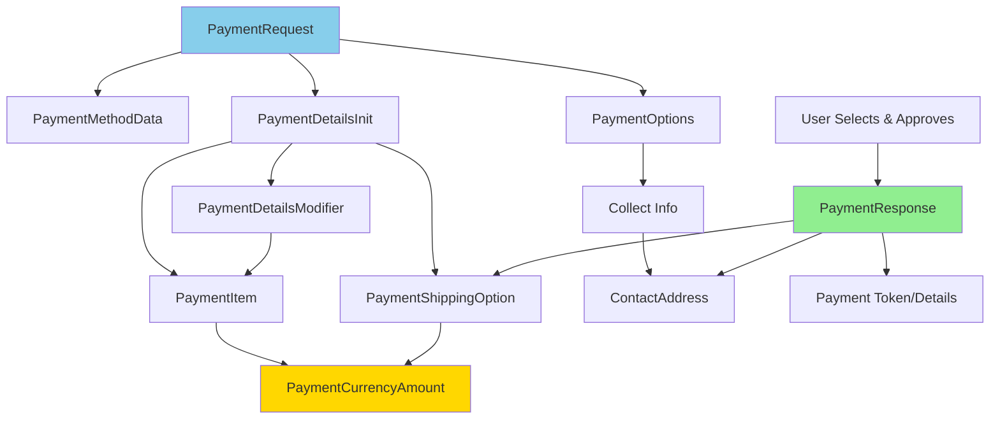
```mermaid
graph TD
    A[PaymentRequest] --> B[PaymentMethodData]
    A --> C[PaymentDetailsInit]
    A --> D[PaymentOptions]
    
    C --> E[PaymentItem]
    C --> F[PaymentShippingOption]
    C --> G[PaymentDetailsModifier]
    
    E --> H[PaymentCurrencyAmount]
    F --> H
    G --> E
    
    D --> I[Collect Info]
    I --> J[ContactAddress]
    
    K[User Selects & Approves] --> L[PaymentResponse]
    L --> M[Payment Token/Details]
    L --> J
    L --> F
    
    style A fill:#87CEEB
    style L fill:#90EE90
    style H fill:#FFD700
```

**Payment Request Flow:**
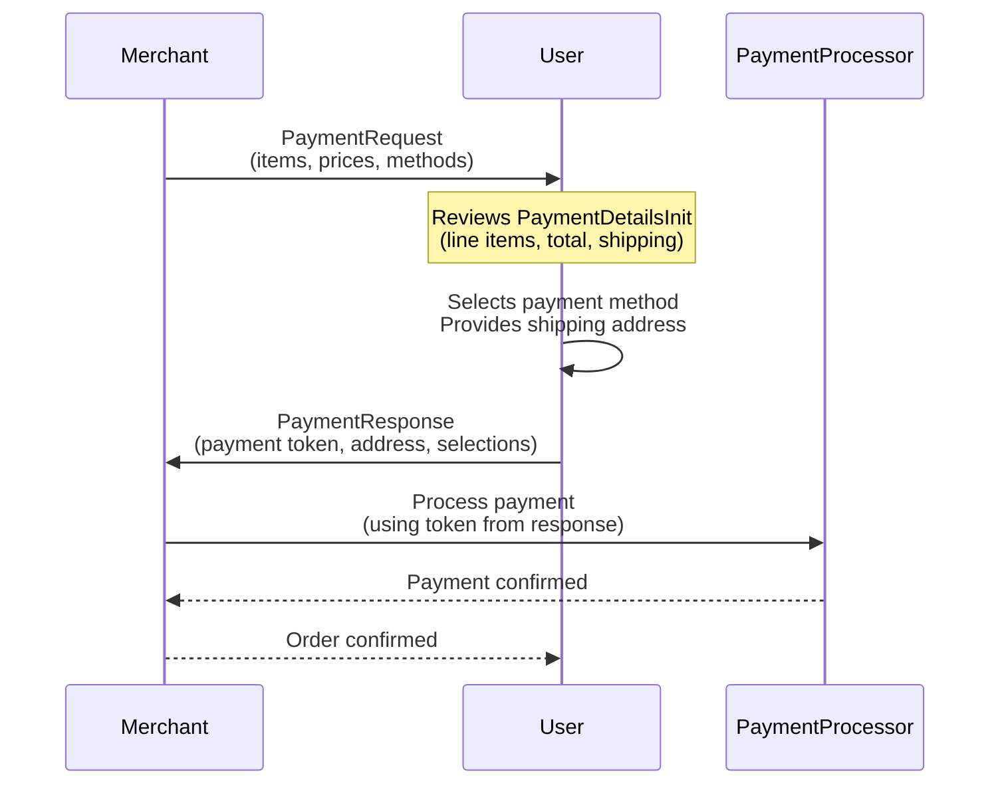
```mermaid
sequenceDiagram
    participant Merchant
    participant User
    participant PaymentProcessor

    Merchant->>User: PaymentRequest<br/>(items, prices, methods)
    Note over User: Reviews PaymentDetailsInit<br/>(line items, total, shipping)
    
    User->>User: Selects payment method<br/>Provides shipping address
    
    User->>Merchant: PaymentResponse<br/>(payment token, address, selections)
    
    Merchant->>PaymentProcessor: Process payment<br/>(using token from response)
    PaymentProcessor-->>Merchant: Payment confirmed
    Merchant-->>User: Order confirmed
```

**Key Relationships:**
- **PaymentRequest** combines method options, order details, and checkout configuration
- **PaymentDetailsInit** breaks down the total into line items with **PaymentItem** and **PaymentCurrencyAmount**
- **PaymentOptions** determines what information to collect (name, email, shipping)
- **PaymentResponse** returns the user's selections and payment credentials
- **PaymentDetailsModifier** adjusts pricing based on the chosen payment method

---

## Payment Mandates (Trust Framework)

Mandates are cryptographically signed documents that establish trust and accountability in agent-driven commerce. They create an immutable audit trail for dispute resolution.

### IntentMandate

**Schema:**
```python
@pydantic.with_config(ConfigDict(alias_generator=to_camel))
class IntentMandate(TypedDict):
    """Represents the user's purchase intent.
    
    These are the initial fields utilized in the human-present flow. For
    human-not-present flows, additional fields will be added to this mandate.
    """
    
    user_cart_confirmation_required: Required[bool]
    """If false, the agent can make purchases on the user's behalf once all
    purchase conditions have been satisfied. This must be true if the
    intent mandate is not signed by the user.
    """
    
    natural_language_description: Required[str]
    """The natural language description of the user's intent. This is
    generated by the shopping agent, and confirmed by the user. The
    goal is to have informed consent by the user."""
    
    merchants: NotRequired[list[str]]
    """Merchants allowed to fulfill the intent. If not set, the shopping
    agent is able to work with any suitable merchant."""
    
    skus: NotRequired[list[str]]
    """A list of specific product SKUs. If not set, any SKU is allowed."""
    
    requires_refundability: NotRequired[bool]
    """If true, items must be refundable."""
    
    intent_expiry: Required[str]
    """When the intent mandate expires, in ISO 8601 format."""
```

**Use Case: Autonomous Shopping with Constraints**
```json
{
  "userCartConfirmationRequired": false,
  "naturalLanguageDescription": "Buy a laptop under $1500 from trusted retailers with 30-day return policy",
  "merchants": ["BestBuy", "Amazon", "Newegg"],
  "requiresRefundability": true,
  "intentExpiry": "2025-12-31T23:59:59Z"
}
```

**What it's for:** Capturing the user's purchase intent with explicit constraints. The agent can autonomously shop within these boundaries—specific merchants, refund requirements, price limits. The natural language description ensures informed consent.

---

### CartContents

**Schema:**
```python
@pydantic.with_config(ConfigDict(alias_generator=to_camel))
class CartContents(TypedDict):
    """The detailed contents of a cart.
    
    This object is signed by the merchant to create a CartMandate.
    """
    
    id: Required[str]
    """A unique identifier for this cart."""
    
    user_cart_confirmation_required: Required[bool]
    """If true, the merchant requires the user to confirm the cart before
    the purchase can be completed."""
    
    payment_request: Required[PaymentRequest]
    """The W3C PaymentRequest object to initiate payment. This contains the
    items being purchased, prices, and the set of payment methods
    accepted by the merchant for this cart."""
    
    cart_expiry: Required[str]
    """When this cart expires, in ISO 8601 format."""
    
    merchant_name: Required[str]
    """The name of the merchant."""
```

**Use Case: Shopping Cart**
```json
{
  "id": "cart-abc123",
  "userCartConfirmationRequired": true,
  "merchantName": "BestBuy",
  "paymentRequest": {
    "methodData": [{"supportedMethods": "CARD"}],
    "details": {
      "id": "order-456",
      "displayItems": [
        {"label": "Laptop", "amount": {"currency": "USD", "value": 1299.99}}
      ],
      "total": {"label": "Total", "amount": {"currency": "USD", "value": 1299.99}}
    }
  },
  "cartExpiry": "2025-11-01T12:00:00Z"
}
```

**What it's for:** The merchant's shopping cart with guaranteed prices and items. Contains the complete payment request and expiration time. This is what gets signed to create a CartMandate.

---

### CartMandate

**Schema:**
```python
@pydantic.with_config(ConfigDict(alias_generator=to_camel))
class CartMandate(TypedDict):
    """A cart whose contents have been digitally signed by the merchant.
    
    This serves as a guarantee of the items and price for a limited time.
    """
    
    contents: Required[CartContents]
    """The contents of the cart."""
    
    merchant_authorization: NotRequired[str]
    """A base64url-encoded JSON Web Token (JWT) that digitally
    signs the cart contents, guaranteeing its authenticity and integrity:
    1. Header includes the signing algorithm and key ID.
    2. Payload includes:
      - iss, sub, aud: Identifiers for the merchant (issuer)
        and the intended recipient (audience), like a payment processor.
      - iat: iat, exp: Timestamps for the token's creation and its
        short-lived expiration (e.g., 5-15 minutes) to enhance security.
      - jti: Unique identifier for the JWT to prevent replay attacks.
      - cart_hash: A secure hash of the CartMandate, ensuring
         integrity. The hash is computed over the canonical JSON
         representation of the CartContents object.
    3. Signature: A digital signature created with the merchant's private
      key. It allows anyone with the public key to verify the token's
      authenticity and confirm that the payload has not been tampered with.
    The entire JWT is base64url encoded to ensure safe transmission.
    """
```

**Use Case: Merchant's Price Guarantee**
```json
{
  "contents": {
    "id": "cart-abc123",
    "merchantName": "BestBuy",
    "userCartConfirmationRequired": true,
    "paymentRequest": { "..." },
    "cartExpiry": "2025-11-01T12:00:00Z"
  },
  "merchantAuthorization": "eyJhbGciOiJFUzI1NiIsImtpZCI6Im1lcmNoYW50LWtleS0xMjMifQ..."
}
```

**What it's for:** The merchant's cryptographic guarantee of cart contents and prices. The JWT signature proves authenticity and prevents tampering. In disputes, this proves what the merchant actually offered.

---

### PaymentMandateContents

**Schema:**
```python
@pydantic.with_config(ConfigDict(alias_generator=to_camel))
class PaymentMandateContents(TypedDict):
    """The data contents of a PaymentMandate.
    
    Contains the payment authorization details before user signature.
    """
    
    payment_mandate_id: Required[str]
    """A unique identifier for this payment mandate."""
    
    payment_details_id: Required[str]
    """A unique identifier for the payment request."""
    
    payment_details_total: Required[PaymentItem]
    """The total payment amount."""
    
    payment_response: Required[PaymentResponse]
    """The payment response containing details of the payment method chosen by the user."""
    
    merchant_agent: Required[str]
    """Identifier for the merchant."""
    
    timestamp: Required[str]
    """The date and time the mandate was created, in ISO 8601 format."""
```

**Use Case: Payment Authorization Details**
```json
{
  "paymentMandateId": "pm-789",
  "paymentDetailsId": "order-456",
  "paymentDetailsTotal": {
    "label": "Total",
    "amount": {"currency": "USD", "value": 1299.99},
    "refundPeriod": 30
  },
  "paymentResponse": {
    "requestId": "order-456",
    "methodName": "CARD",
    "details": {"token": "tok_visa_4242"}
  },
  "merchantAgent": "bestbuy-agent-did",
  "timestamp": "2025-10-31T22:30:00Z"
}
```

**What it's for:** The complete payment authorization details—what's being paid, how much, which payment method, and when. This gets signed by the user to create the final PaymentMandate.

---

### PaymentMandate

**Schema:**
```python
@pydantic.with_config(ConfigDict(alias_generator=to_camel))
class PaymentMandate(TypedDict):
    """Contains the user's instructions & authorization for payment.
    
    While the Cart and Intent mandates are required by the merchant to fulfill the
    order, separately the protocol provides additional visibility into the agentic
    transaction to the payments ecosystem. For this purpose, the PaymentMandate
    (bound to Cart/Intent mandate but containing separate information) may be
    shared with the network/issuer along with the standard transaction
    authorization messages. The goal of the PaymentMandate is to help the
    network/issuer build trust into the agentic transaction.
    """
    
    payment_mandate_contents: Required[PaymentMandateContents]
    """The data contents of the payment mandate."""
    
    user_authorization: NotRequired[str]
    """This is a base64_url-encoded verifiable presentation of a verifiable
    credential signing over the cart_mandate and payment_mandate_hashes.
    For example an sd-jwt-vc would contain:
    
    - An issuer-signed jwt authorizing a 'cnf' claim
    - A key-binding jwt with the claims
        "aud": ...
        "nonce": ...
        "sd_hash": hash of the issuer-signed jwt
        "transaction_data": an array containing the secure hashes of
          CartMandate and PaymentMandateContents.
    """
```

**Use Case: Final User Authorization**
```json
{
  "paymentMandateContents": {
    "paymentMandateId": "pm-789",
    "paymentDetailsId": "order-456",
    "paymentDetailsTotal": {
      "label": "Total",
      "amount": {"currency": "USD", "value": 1299.99}
    },
    "paymentResponse": {
      "requestId": "order-456",
      "methodName": "CARD",
      "details": {"token": "tok_visa_4242"}
    },
    "merchantAgent": "bestbuy-agent-did",
    "timestamp": "2025-10-31T22:30:00Z"
  },
  "userAuthorization": "eyJhbGciOiJFUzI1NksiLCJraWQiOiJkaWQ6ZXhhbXBsZTp1c2VyLWtleSJ9..."
}
```

**What it's for:** The user's cryptographic signature authorizing the payment. Shared with payment networks (Visa, Mastercard) to establish trust in agent-driven transactions. In disputes, this proves the user actually authorized the purchase.

### Summary

The mandate framework creates a trust chain for autonomous commerce:

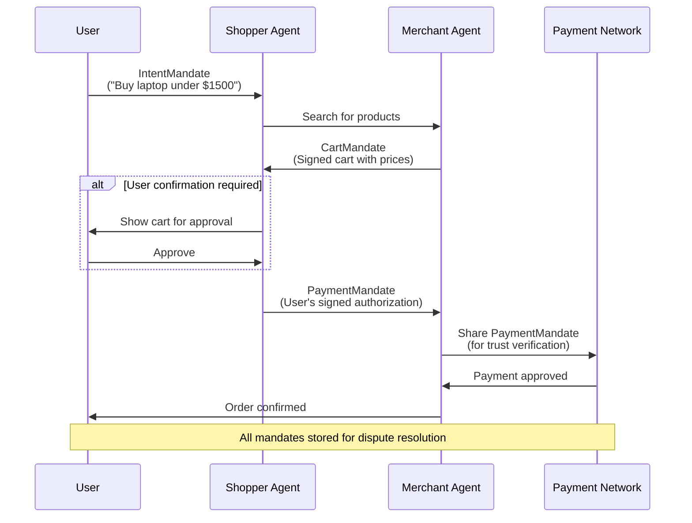
```mermaid
sequenceDiagram
    participant User
    participant ShopperAgent as Shopper Agent
    participant MerchantAgent as Merchant Agent
    participant PaymentNetwork as Payment Network

    User->>ShopperAgent: IntentMandate<br/>("Buy laptop under $1500")
    ShopperAgent->>MerchantAgent: Search for products
    MerchantAgent->>ShopperAgent: CartMandate<br/>(Signed cart with prices)
    
    alt User confirmation required
        ShopperAgent->>User: Show cart for approval
        User->>ShopperAgent: Approve
    end
    
    ShopperAgent->>MerchantAgent: PaymentMandate<br/>(User's signed authorization)
    MerchantAgent->>PaymentNetwork: Share PaymentMandate<br/>(for trust verification)
    PaymentNetwork->>MerchantAgent: Payment approved
    MerchantAgent->>User: Order confirmed
    
    Note over User,PaymentNetwork: All mandates stored for dispute resolution
```

**The Three Mandates:**
- **IntentMandate** - User says "Here's what I want to buy and my constraints"
- **CartMandate** - Merchant says "Here's what I'm offering at this price"
- **PaymentMandate** - User says "I authorize this specific payment"

Each mandate is cryptographically signed, creating an immutable audit trail. In disputes, these prove exactly what was agreed to by each party, enabling fair resolution without relying on agent logs or interpretations.

---

## Credit System `<NotPartOfA2A>`

The credit system enables centralized management of agent execution costs and resource allocation. This is a Bindu-specific extension for managing agent marketplace economics.

### AgentExecutionCost

**Schema:**
```python
@pydantic.with_config(ConfigDict(alias_generator=to_camel))
class AgentExecutionCost(TypedDict):
    """Defines the credit cost for executing an agent.
    
    Sets pricing and access control for agent services.
    """
    
    agent_id: Required[str]
    """The unique identifier of the agent."""
    
    agent_name: Required[str]
    """The name of the agent."""
    
    credits_per_request: Required[int]
    """The number of credits required to execute the agent."""
    
    creator_did: Required[str]
    """The DID of the creator of the agent."""
    
    minimum_trust_level: Required[TrustLevel]
    """The minimum trust level required to execute the agent."""
```

**Use Case: Premium Agent Pricing**
```json
{
  "agentId": "agent-analytics-pro",
  "agentName": "Advanced Analytics Agent",
  "creditsPerRequest": 100,
  "creatorDid": "did:example:creator123",
  "minimumTrustLevel": "analyst"
}
```

**What it's for:** Defining the cost and access requirements for running an agent. Creators set credit prices for their agents, and specify minimum trust levels to ensure only qualified users can execute sensitive operations.

---

### ExecutionRequest

**Schema:**
```python
@pydantic.with_config(ConfigDict(alias_generator=to_camel))
class ExecutionRequest(TypedDict):
    """Represents a request to execute an agent with credit verification.
    
    Initiates agent execution with credit pre-authorization.
    """
    
    request_id: Required[UUID]
    """The unique identifier of the request."""
    
    executor_did: Required[str]
    """The DID of the executor."""
    
    agent_id: Required[str]
    """The unique identifier of the agent."""
    
    input_data: Required[str]
    """The input data for the agent execution."""
    
    estimated_credits: Required[int]
    """The estimated number of credits required for the execution."""
    
    trust_level: Required[TrustLevel]
    """The trust level of the executor."""
```

**Use Case: Agent Execution Request**
```json
{
  "requestId": "550e8400-e29b-41d4-a716-446655440000",
  "executorDid": "did:example:user456",
  "agentId": "agent-analytics-pro",
  "inputData": "Analyze Q4 sales data for trends and anomalies",
  "estimatedCredits": 100,
  "trustLevel": "analyst"
}
```

**What it's for:** Requesting agent execution with credit verification. The system checks if the executor has sufficient credits and meets the minimum trust level before allowing execution.

---

### ExecutionResponse

**Schema:**
```python
@pydantic.with_config(ConfigDict(alias_generator=to_camel))
class ExecutionResponse(TypedDict):
    """Represents the response from an agent execution with credit deduction.
    
    Returns execution results and credit transaction details.
    """
    
    request_id: Required[UUID]
    """The unique identifier of the request."""
    
    execution_id: Required[UUID]
    """The unique identifier of the execution."""
    
    success: Required[bool]
    """Indicates whether the execution was successful."""
    
    credits_charged: Required[int]
    """The number of credits charged for the execution."""
    
    transaction_id: NotRequired[UUID]
    """The unique identifier of the transaction."""
    
    output_data: NotRequired[str]
    """The output data from the agent execution."""
    
    error_message: NotRequired[str]
    """The error message if the execution failed."""
    
    execution_time: Required[str]
    """The time the execution was completed."""
```

**Use Case: Successful Execution**
```json
{
  "requestId": "550e8400-e29b-41d4-a716-446655440000",
  "executionId": "660e8400-e29b-41d4-a716-446655440001",
  "success": true,
  "creditsCharged": 95,
  "transactionId": "770e8400-e29b-41d4-a716-446655440002",
  "outputData": "Analysis complete: Q4 sales increased 23% with peak in December...",
  "executionTime": "2025-10-31T23:45:00Z"
}
```

**What it's for:** Returning execution results with credit transaction details. Shows actual credits charged (may differ from estimate), execution status, and output data. Failed executions may charge reduced or no credits depending on policy.

### Credit System Flow

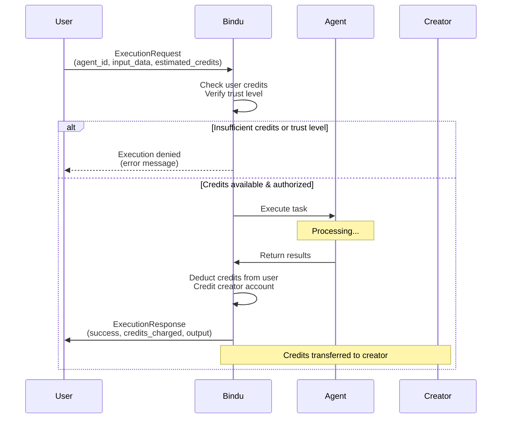
```mermaid
sequenceDiagram
    participant User
    participant Platform as Bindu
    participant Agent
    participant Creator

    User->>Platform: ExecutionRequest<br/>(agent_id, input_data, estimated_credits)
    
    Platform->>Platform: Check user credits<br/>Verify trust level
    
    alt Insufficient credits or trust level
        Platform-->>User: Execution denied<br/>(error message)
    else Credits available & authorized
        Platform->>Agent: Execute task
        Note over Agent: Processing...
        Agent->>Platform: Return results
        
        Platform->>Platform: Deduct credits from user<br/>Credit creator account
        Platform->>User: ExecutionResponse<br/>(success, credits_charged, output)
        
        Note over Platform,Creator: Credits transferred to creator
    end
```

**Key Features:**
- **Pay-per-use model** - Users pay credits only for agent executions
- **Creator monetization** - Agent creators earn credits when their agents are used
- **Trust-based access** - Minimum trust levels prevent unauthorized or malicious usage
- **Transparent pricing** - Credit costs are known upfront via `AgentExecutionCost`
- **Transaction tracking** - Every execution generates a transaction record for auditing

**Use Cases:**
- Premium AI agents with specialized capabilities
- Resource-intensive data processing agents
- Enterprise agents requiring elevated permissions
- Marketplace for third-party agent services
- Usage-based billing for agent platforms

---

## Trust & Identity

Trust and identity management ensures secure agent operations through role-based access control and identity verification. Integrates with enterprise identity providers for centralized authentication.

### KeycloakRole

**Schema:**
```python
@pydantic.with_config(ConfigDict(alias_generator=to_camel))
class KeycloakRole(TypedDict):
    """Keycloak role model.
    
    Defines roles with permissions and trust levels for access control.
    """
    
    role_id: Required[UUID]
    """The ID of the role."""
    
    role_name: Required[str]
    """The name of the role."""
    
    permissions: Required[List[str]]
    """The permissions of the role."""
    
    trust_level: Required[TrustLevel]
    """The trust level of the role."""
    
    realm_name: Required[str]
    """The realm name of the role."""
    
    external_mappings: NotRequired[Dict[str, str]]
    """The external mappings of the role."""
    
    operation_permissions: NotRequired[Dict[str, TrustLevel]]
    """The operation permissions of the role."""
```

**Use Case: Enterprise Admin Role**
```json
{
  "roleId": "550e8400-e29b-41d4-a716-446655440000",
  "roleName": "enterprise_admin",
  "permissions": [
    "agent.create",
    "agent.delete",
    "user.manage",
    "billing.view"
  ],
  "trustLevel": "admin",
  "realmName": "enterprise-production",
  "externalMappings": {
    "azure_ad": "Enterprise-Admins",
    "okta": "admin-group"
  },
  "operationPermissions": {
    "agent.execute": "operator",
    "data.export": "admin"
  }
}
```

**What it's for:** Defining roles with specific permissions and trust levels in Keycloak. Maps to external identity providers (Azure AD, Okta) for SSO integration. Operation permissions specify minimum trust levels required for specific actions.

---

### AgentTrust

**Schema:**
```python
@pydantic.with_config(ConfigDict(alias_generator=to_camel))
class AgentTrust(TypedDict):
    """Trust configuration for an agent.
    
    Establishes identity, permissions, and verification requirements for agent operations.
    """
    
    identity_provider: Required[IdentityProvider]
    """The identity provider of the agent."""
    
    inherited_roles: Required[List[KeycloakRole]]
    """The roles inherited by the agent."""
    
    certificate: NotRequired[str]
    """The certificate of the agent."""
    
    certificate_fingerprint: NotRequired[str]
    """The fingerprint of the certificate of the agent."""
    
    creator_id: Union[UUID, int, str]
    """The creator ID of the agent."""
    
    creation_timestamp: int
    """The creation timestamp of the agent."""
    
    trust_verification_required: bool
    """Whether trust verification is required for this agent."""
    
    allowed_operations: Dict[str, TrustLevel]
    """The allowed operations and their required trust levels."""
```

**Use Case: Trusted Data Processing Agent**
```json
{
  "identityProvider": "keycloak",
  "inheritedRoles": [
    {
      "roleId": "660e8400-e29b-41d4-a716-446655440001",
      "roleName": "data_processor",
      "permissions": ["data.read", "data.process"],
      "trustLevel": "operator",
      "realmName": "enterprise-production"
    }
  ],
  "certificate": "-----BEGIN CERTIFICATE-----\nMIIC...",
  "certificateFingerprint": "SHA256:a1b2c3d4e5f6...",
  "creatorId": "did:example:creator789",
  "creationTimestamp": 1698796800,
  "trustVerificationRequired": true,
  "allowedOperations": {
    "data.read": "analyst",
    "data.process": "operator",
    "data.export": "admin"
  }
}
```

**What it's for:** Configuring trust and identity for agents. Inherits roles from identity providers, uses certificates for cryptographic verification, and defines operation-level permissions. Trust verification ensures the agent's identity is validated before execution.

### Trust Architecture

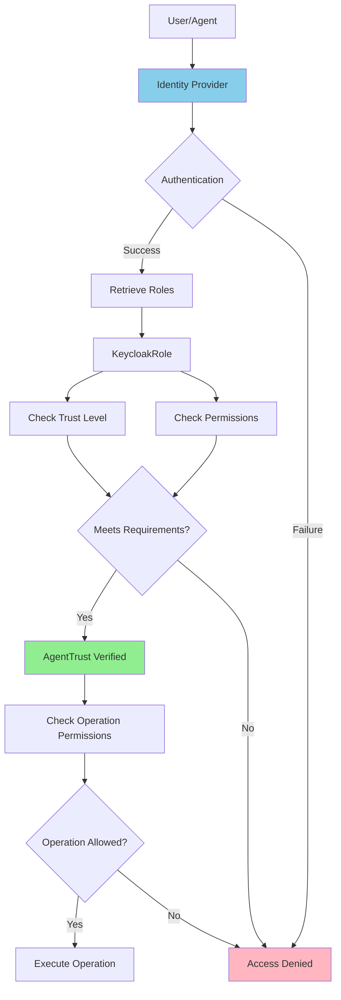
```mermaid
graph TD
    A[User/Agent] --> B[Identity Provider]
    B --> C{Authentication}
    
    C -->|Success| D[Retrieve Roles]
    C -->|Failure| E[Access Denied]
    
    D --> F[KeycloakRole]
    F --> G[Check Trust Level]
    F --> H[Check Permissions]
    
    G --> I{Meets Requirements?}
    H --> I
    
    I -->|Yes| J[AgentTrust Verified]
    I -->|No| E
    
    J --> K[Check Operation Permissions]
    K --> L{Operation Allowed?}
    
    L -->|Yes| M[Execute Operation]
    L -->|No| E
    
    style B fill:#87CEEB
    style J fill:#90EE90
    style E fill:#FFB6C1
```

**Trust Verification Flow:**
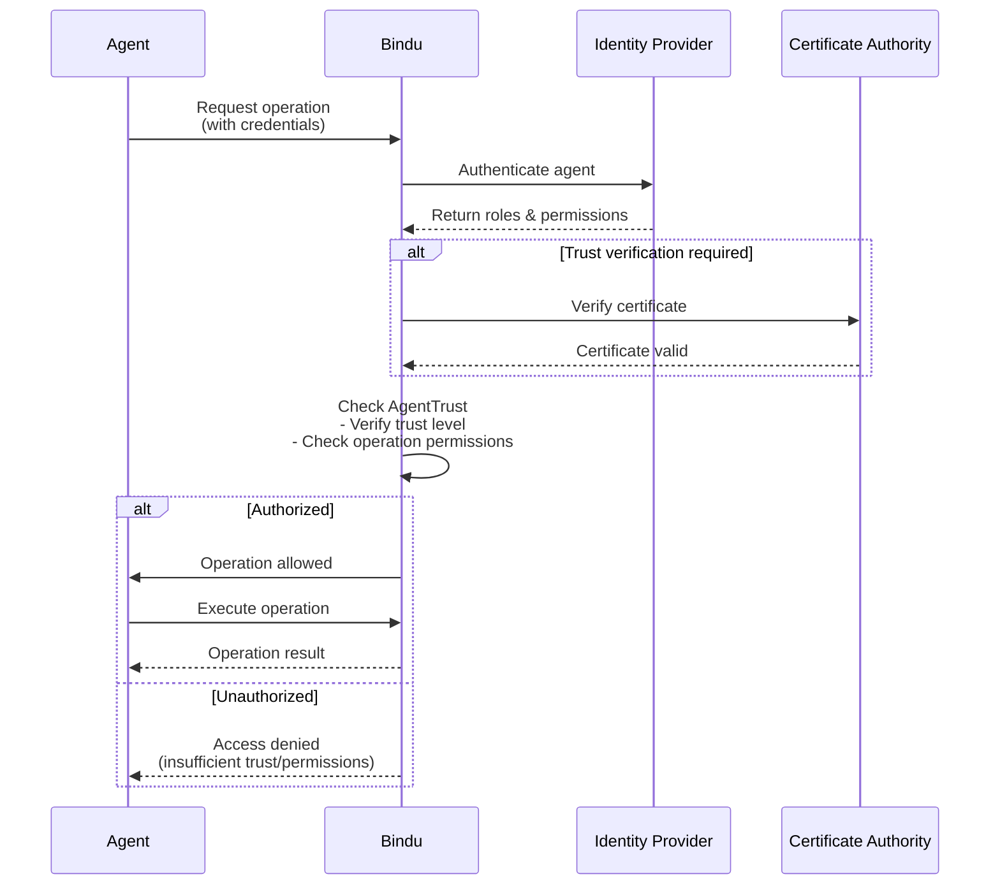
```mermaid
sequenceDiagram
    participant Agent
    participant Platform as Bindu
    participant IDP as Identity Provider
    participant CertAuth as Certificate Authority

    Agent->>Platform: Request operation<br/>(with credentials)
    
    Platform->>IDP: Authenticate agent
    IDP-->>Platform: Return roles & permissions
    
    alt Trust verification required
        Platform->>CertAuth: Verify certificate
        CertAuth-->>Platform: Certificate valid
    end
    
    Platform->>Platform: Check AgentTrust<br/>- Verify trust level<br/>- Check operation permissions
    
    alt Authorized
        Platform->>Agent: Operation allowed
        Agent->>Platform: Execute operation
        Platform-->>Agent: Operation result
    else Unauthorized
        Platform-->>Agent: Access denied<br/>(insufficient trust/permissions)
    end
```


**Summary:**

Trust and identity management combines role-based access control with enterprise identity providers. **KeycloakRole** defines permissions and trust levels with SSO mappings. **AgentTrust** configures agent identity verification using certificates and inherited roles. Each operation requires minimum trust levels, enabling fine-grained security for enterprise deployments, multi-tenant platforms, and high-security operations.

---

## Agent Discovery & Configuration

Agent discovery enables clients to find and understand agent capabilities through standardized metadata. The AgentCard serves as the agent's "business card" containing identity, skills, and operational requirements.

### AgentIdentity

**Schema:**
```python
@pydantic.with_config(ConfigDict(alias_generator=to_camel))
class AgentIdentity(TypedDict):
    """Agent identity configuration with DID and other identifiers.
    
    Establishes decentralized identity for agent authentication and discovery.
    """
    
    did: Required[str]
    """The agent's Decentralized Identifier (DID)."""
    
    did_document: Required[Dict[str, Any]]
    """The agent's DID document containing public keys and other identifiers."""
    
    agentdns_url: NotRequired[str]
    """The agent's AgentDNS URL for decentralized identity resolution."""
    
    endpoint: NotRequired[str]
    """The agent's endpoint URL for communication."""
    
    public_key: Required[str]
    """The agent's public key for authentication."""
    
    csr: Required[str]
    """The agent's Certificate Signing Request (CSR) for authentication."""
```

**Use Case: Decentralized Agent Identity**
```json
{
  "did": "did:example:agent123",
  "didDocument": {
    "id": "did:example:agent123",
    "publicKey": [{
      "id": "did:example:agent123#keys-1",
      "type": "Ed25519VerificationKey2020",
      "controller": "did:example:agent123",
      "publicKeyMultibase": "zH3C2AVvLMv6gmMNam3uVAjZpfkcJCwDwnZn6z3wXmqPV"
    }]
  },
  "agentdnsUrl": "https://agentdns.example.com/agent123",
  "endpoint": "https://agent.example.com/api",
  "publicKey": "-----BEGIN PUBLIC KEY-----\nMIIB...",
  "csr": "-----BEGIN CERTIFICATE REQUEST-----\nMIIC..."
}
```

**What it's for:** Establishing verifiable decentralized identity for agents using DIDs. Enables trustless discovery and authentication without central authorities. The DID document contains public keys for cryptographic verification.

---

### AgentInterface

**Schema:**
```python
@pydantic.with_config(ConfigDict(alias_generator=to_camel))
class AgentInterface(TypedDict):
    """An interface that the agent supports.
    
    Declares available transport protocols and endpoints.
    """
    
    transport: str
    """The transport protocol (e.g., 'jsonrpc', 'websocket')."""
    
    url: str
    """The URL endpoint for this transport."""
    
    description: NotRequired[str]
    """Description of this interface."""
```

**Use Case: Multiple Transport Support**
```json
{
  "transport": "websocket",
  "url": "wss://agent.example.com/ws",
  "description": "WebSocket interface for real-time streaming"
}
```

**What it's for:** Declaring multiple communication protocols an agent supports. Allows clients to choose between JSON-RPC, WebSocket, gRPC, or other transports based on their needs.

---

### AgentExtension

**Schema:**
```python
@pydantic.with_config(ConfigDict(alias_generator=to_camel))
class AgentExtension(TypedDict):
    """A declaration of an extension supported by an Agent.
    
    Extensions add protocol capabilities beyond the core A2A specification.
    """
    
    uri: str
    """The URI of the extension."""
    
    description: NotRequired[str]
    """A description of how this agent uses this extension."""
    
    required: NotRequired[bool]
    """Whether the client must follow specific requirements of the extension."""
    
    params: NotRequired[dict[str, Any]]
    """Optional configuration for the extension."""
```

**Use Case: AP2 Payment Extension**
```json
{
  "uri": "https://github.com/google-agentic-commerce/ap2/tree/v0.1",
  "description": "Supports AP2 protocol for agent payments",
  "required": true,
  "params": {
    "roles": ["merchant", "shopper"]
  }
}
```

**What it's for:** Declaring support for protocol extensions like AP2 (payments), custom authentication schemes, or specialized capabilities. The `required` flag indicates if clients must support the extension.

---

### Skill

**Schema:**
```python
@pydantic.with_config(ConfigDict(alias_generator=to_camel))
class Skill(TypedDict):
    """Skills are a unit of capability that an agent can perform.
    
    Skills can be defined in two ways:
    1. Inline (legacy): All metadata in config JSON
    2. File-based (Claude-style): Rich documentation in SKILL.md files
    """
    
    id: str
    """A unique identifier for the skill."""
    
    name: str
    """Human readable name of the skill."""
    
    description: str
    """A human-readable description of the skill."""
    
    tags: list[str]
    """Set of tag-words describing classes of capabilities."""
    
    examples: NotRequired[list[str]]
    """Example scenarios that the skill can perform."""
    
    input_modes: list[str]
    """Supported mime types for input data."""
    
    output_modes: list[str]
    """Supported mime types for output data."""
    
    # Rich documentation fields (Claude-style skills)
    documentation_path: NotRequired[str]
    """Path to the SKILL.md file containing detailed instructions."""
    
    documentation_content: NotRequired[str]
    """Full content of the SKILL.md file."""
    
    capabilities_detail: NotRequired[dict[str, Any]]
    """Structured capability details for orchestrator matching."""
    
    requirements: NotRequired[dict[str, Any]]
    """Dependencies and system requirements."""
    
    performance: NotRequired[dict[str, Any]]
    """Performance characteristics for orchestrator planning."""
    
    version: NotRequired[str]
    """Skill version for compatibility tracking."""
    
    allowed_tools: NotRequired[list[str]]
    """List of tools/capabilities this skill is allowed to use."""
```

**Use Case: Data Analysis Skill**
```json
{
  "id": "data-analysis",
  "name": "Data Analysis",
  "description": "Analyze datasets and generate insights",
  "tags": ["analytics", "data", "statistics"],
  "examples": [
    "Analyze this sales data and find trends",
    "Calculate statistics for this dataset"
  ],
  "inputModes": ["text/csv", "application/json"],
  "outputModes": ["text/plain", "application/json"],
  "documentationPath": "./skills/data-analysis/SKILL.md",
  "capabilitiesDetail": {
    "statistical_analysis": {"supported": true, "methods": ["regression", "correlation"]},
    "visualization": {"supported": true, "types": ["charts", "graphs"]}
  },
  "requirements": {
    "packages": ["pandas", "numpy", "matplotlib"],
    "minMemoryMb": 1024
  },
  "performance": {
    "avgProcessingTimeMs": 5000,
    "maxFileSizeMb": 100
  },
  "allowedTools": ["Read", "Write"]
}
```

**What it's for:** Defining what an agent can do. Supports both simple inline definitions and rich Claude-style documentation with SKILL.md files. Orchestrators use skills to match agents to tasks.

---

### AgentCapabilities

**Schema:**
```python
@pydantic.with_config(ConfigDict(alias_generator=to_camel))
class AgentCapabilities(TypedDict):
    """Defines optional capabilities supported by an agent.
    
    Declares protocol features the agent implements.
    """
    
    extensions: NotRequired[list[AgentExtension]]
    """List of extensions supported by the agent."""
    
    push_notifications: NotRequired[bool]
    """Whether the agent supports push notifications."""
    
    state_transition_history: NotRequired[bool]
    """Whether the agent supports state transition history."""
    
    streaming: NotRequired[bool]
    """Whether the agent supports streaming."""
```

**Use Case: Full-Featured Agent**
```json
{
  "extensions": [
    {
      "uri": "https://github.com/google-agentic-commerce/ap2/tree/v0.1",
      "description": "AP2 payment support",
      "required": false
    }
  ],
  "pushNotifications": true,
  "stateTransitionHistory": true,
  "streaming": true
}
```

**What it's for:** Declaring which optional A2A protocol features the agent supports. Clients can choose agents based on required capabilities like streaming or push notifications.

---

### AgentCard

**Schema:**
```python
@pydantic.with_config(ConfigDict(alias_generator=to_camel))
class AgentCard(TypedDict):
    """The card that describes an agent - following bindu pattern.
    
    The complete agent metadata for discovery and configuration.
    """
    
    id: Required[UUID]
    """Unique identifier for the agent."""
    
    name: Required[str]
    """Human readable name of the agent."""
    
    description: Required[str]
    """A human-readable description of the agent."""
    
    url: Required[str]
    """URL of the agent."""
    
    version: Required[str]
    """Version of the agent."""
    
    protocol_version: Required[str]
    """Version of the protocol used by the agent."""
    
    documentation_url: NotRequired[str]
    """URL of the documentation of the agent."""
    
    icon_url: NotRequired[str]
    """A URL to an icon for the agent."""
    
    agent_trust: Required[AgentTrust]
    """Trust of the agent."""
    
    capabilities: Required[AgentCapabilities]
    """Capabilities of the agent."""
    
    skills: Required[List[Skill]]
    """Skills of the agent."""
    
    kind: Required[Literal["agent", "team", "workflow"]]
    """Kind of the agent."""
    
    execution_cost: NotRequired[AgentExecutionCost]
    """Execution cost of the agent."""
    
    num_history_sessions: Required[int]
    """Number of history sessions of the agent."""
    
    preferred_transport: NotRequired[str]
    """The transport of the preferred endpoint."""
    
    extra_data: Required[Dict[str, Any]]
    """Extra data about the agent."""
    
    debug_mode: Required[bool]
    """Debug mode of the agent."""
    
    debug_level: Required[Literal[1, 2]]
    """Debug level of the agent."""
    
    monitoring: Required[bool]
    """Monitoring of the agent."""
    
    telemetry: Required[bool]
    """Telemetry of the agent."""
    
    additional_interfaces: NotRequired[list[AgentInterface]]
    """Announcement of additional supported transports."""
    
    security: NotRequired[list[dict[str, list[str]]]]
    """Security requirements for contacting the agent."""
    
    security_schemes: NotRequired[dict[str, SecurityScheme]]
    """Security scheme definitions."""
    
    default_input_modes: list[str]
    """Supported mime types for input data."""
    
    default_output_modes: list[str]
    """Supported mime types for output data."""
```

**Use Case: Complete Agent Card**
```json
{
  "id": "550e8400-e29b-41d4-a716-446655440000",
  "name": "Data Analysis Agent",
  "description": "Analyzes datasets and generates insights",
  "url": "https://agent.example.com",
  "version": "1.0.0",
  "protocolVersion": "0.3.0",
  "kind": "agent",
  "agentTrust": {
    "identityProvider": "keycloak",
    "inheritedRoles": [],
    "creatorId": "did:example:creator",
    "creationTimestamp": 1698796800,
    "trustVerificationRequired": true,
    "allowedOperations": {}
  },
  "capabilities": {
    "streaming": true,
    "pushNotifications": true
  },
  "skills": [
    {
      "id": "data-analysis",
      "name": "Data Analysis",
      "description": "Analyze datasets",
      "tags": ["analytics"],
      "inputModes": ["text/csv"],
      "outputModes": ["text/plain"]
    }
  ],
  "numHistorySessions": 10,
  "debugMode": false,
  "debugLevel": 1,
  "monitoring": true,
  "telemetry": true,
  "defaultInputModes": ["text/plain"],
  "defaultOutputModes": ["text/plain"],
  "extraData": {}
}
```

**What it's for:** The complete agent metadata package. Clients fetch the AgentCard to discover capabilities, skills, security requirements, and operational characteristics before interacting with an agent.

### Agent Discovery Flow

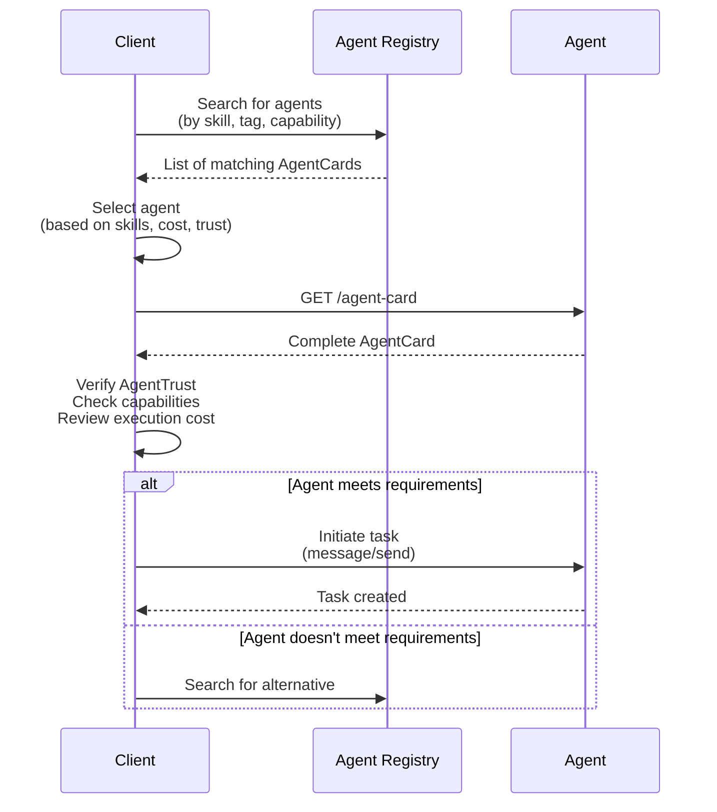
```mermaid
sequenceDiagram
    participant Client
    participant Registry as Agent Registry
    participant Agent

    Client->>Registry: Search for agents<br/>(by skill, tag, capability)
    Registry-->>Client: List of matching AgentCards
    
    Client->>Client: Select agent<br/>(based on skills, cost, trust)
    
    Client->>Agent: GET /agent-card
    Agent-->>Client: Complete AgentCard
    
    Client->>Client: Verify AgentTrust<br/>Check capabilities<br/>Review execution cost
    
    alt Agent meets requirements
        Client->>Agent: Initiate task<br/>(message/send)
        Agent-->>Client: Task created
    else Agent doesn't meet requirements
        Client->>Registry: Search for alternative
    end
```

**Summary:**

Agent discovery uses **AgentCard** as the central metadata structure containing identity (**AgentIdentity**), capabilities (**AgentCapabilities**), skills (**Skill**), and operational requirements. Agents declare support for extensions (**AgentExtension**) and multiple transports (**AgentInterface**). Clients discover agents through registries, evaluate their capabilities and costs, then establish secure connections using the declared security schemes and trust configurations.

---

## Getting Started

Create and deploy your first agent with Bindu:

```bash
uv run examples/agno_example.py
```

**Output:**
```
[23:57:01] INFO     Validating handler function: handler
           INFO     Agent ID: 6616c5797f434a9a8cdb35a043507ee1
           INFO     DID extension initialized: did:bindu:alice@example.com:research_agent:6616c5797f434a9a8cdb35a043507ee1
           INFO     Loading agent skills...
           INFO     Loaded 0 skill(s)
           INFO     DID Extension setup complete
           INFO     Creating agent manifest...
           INFO     Creating agent manifest: name='research_agent', version=1.0.0, kind=agent
           INFO     Agent manifest 'research_agent' created successfully (id=6616c5797f434a9a8cdb35a043507ee1)
           INFO     Agent 'did:bindu:alice@example.com:research_agent:6616c5797f434a9a8cdb35a043507ee1' successfully bindufied!
           INFO     Starting deployment for agent: 6616c5797f434a9a8cdb35a043507ee1

╭─────────────────────────────────────────────────────────────────────────────────────────────────── Bindu 🌻 ────────────────────────────────────────────────────────────────────────────────────────────────────╮
│                                                                                                                                                                                                                 │
│                                                                        }}}}}}}}}}}}}}}}}}}}}}}}}}}}}}}}}}}}}}}}}}}}}}}}}}}}}}}}}}}}}}}}                                                                         │
│                                                                        {{            +             +                  +   @          {{                                                                         │
│                                                                        }}   |                *           o     +                .    }}                                                                         │
│                                                                        {{  -O-    o               .               .          +       {{                                                                         │
│                                                                        }}   |                    _,.-----.,_         o    |          }}                                                                         │
│                                                                        {{           +    *    .-'.         .'-.          -O-         {{                                                                         │
│                                                                        }}      *            .'.-'   .---.   `'.'.         |     *    }}                                                                         │
│                                                                        {{ .                /_.-'   /     \   .'-.\\                   {{                                                                        │
│                                                                        }}         ' -=*<  |-._.-  |   @   |   '-._|  >*=-    .     + }}                                                                         │
│                                                                        {{ -- )--           \`-.    \     /    .-'/                   {{                                                                         │
│                                                                        }}       *     +     `.'.    '---'    .'.'    +       o       }}                                                                         │
│                                                                        {{                  .  '-._         _.-'  .                   {{                                                                         │
│                                                                        }}         |               `~~~~~~~`       - --===D       @   }}                                                                         │
│                                                                        {{   o    -O-      *   .                  *        +          {{                                                                         │
│                                                                        }}         |                      +         .            +    }}                                                                         │
│                                                                        {{ jgs          .     @      o                        *       {{                                                                         │
│                                                                        }}       o                          *          o           .  }}                                                                         │
│                                                                        {{{{{{{{{{{{{{{{{{{{{{{{{{{{{{{{{{{{{{{{{{{{{{{{{{{{{{{{{{{{{{{{                                                                         │
│                                                                                                                                                                                                                 │
│                                                                                           a bindu, part of Saptha.me                                                                                            │
│                                                                                                                                                                                                                 │
╰─────────────────────────────────────────────────────────────────────────────────────────────────────────────────────────────────────────────────────────────────────────────────────────────────────────────────╯

Version: 0.3.20.dev0+g1be868185.d20251029

🚀 Bindu Server 🚀
Agent Server: http://localhost:3773

Agent ID: 6616c5797f434a9a8cdb35a043507ee1
Agent DID: did:bindu:alice@example.com:research_agent:6616c5797f434a9a8cdb35a043507ee1

Protocol Endpoints:
  - A2A: http://localhost:3773/a2a
  - DID Resolution: http://localhost:3773/did/resolve
  - Agent Info: http://localhost:3773/agent/info

⭐️⭐️⭐️ Support Open Source ⭐️⭐️⭐️
⭐️⭐️⭐️ Star on GitHub! ⭐️⭐️⭐️
https://github.com/Saptha-me/Bindu

Join our Community 🤝
https://discord.gg/3w5zuYUuwt

Documentation 🌻
https://docs.saptha.me

[23:57:02] INFO     None
INFO:     Started server process [45927]
INFO:     Waiting for application startup.
           WARNING  Missing OpenInference packages - auto-installation disabled for safety
INFO:     Application startup complete.
INFO:     Uvicorn running on http://localhost:3773 (Press CTRL+C to quit)
```

Your agent is now running with:
- **Decentralized Identity (DID)** - Verifiable agent identity
- **A2A Protocol Endpoints** - Standard agent-to-agent communication
- **DID Resolution** - Discover and verify agent identities
- **Agent Info** - Query agent capabilities and metadata

Visit `http://localhost:3773/agent/info` to see your agent's complete AgentCard.