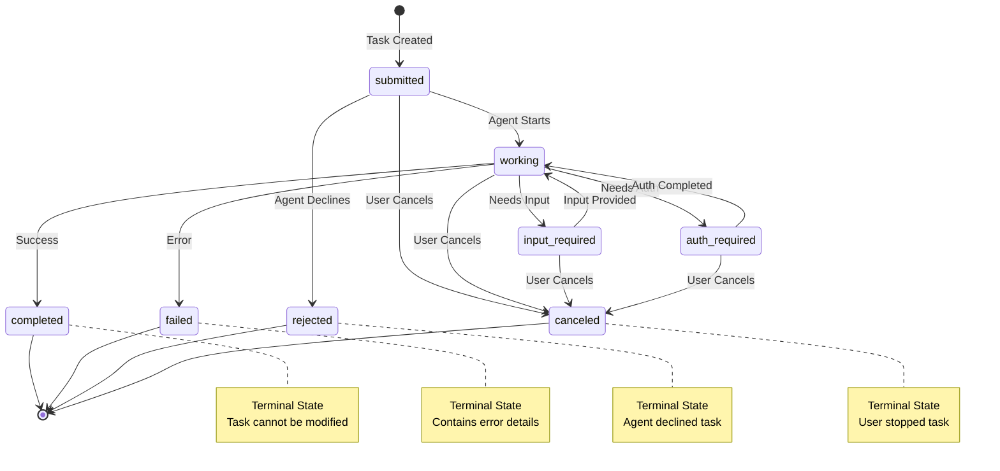
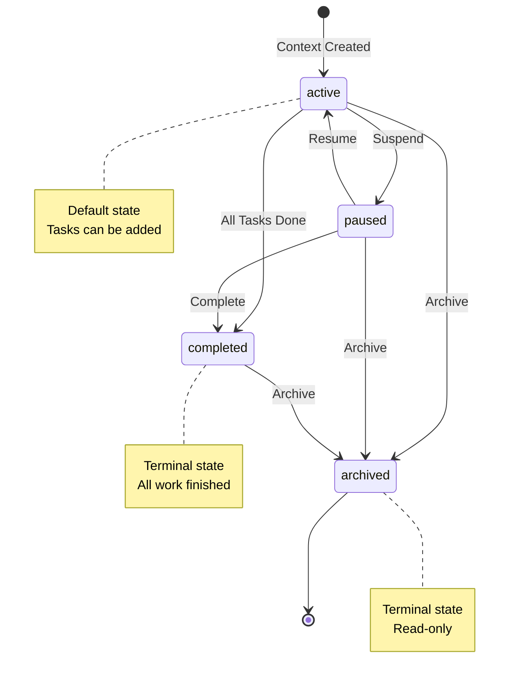

# The Language of Agents

Think of protocol types as the vocabulary that agents use to talk to each other. Just like humans need a common language to communicate, agents need a precise set of data structures to understand each other. This guide explains each type in simple terms.

## Overview

Bindu follows two main protocols:
- **A2A (Agent-to-Agent) Protocol v0.3.0** - The standard for agent communication
- **AP2 (Agent Protocol 2) v0.1.0** - Extensions for advanced features

<Note>
Some types are marked as `<NotPartOfA2A>` - these are Bindu-specific extensions that go beyond the standard A2A protocol.
</Note>

---

## Type Aliases & Enums

Protocol types use TypeAlias definitions for enums to ensure type safety and clear state management.

### TaskState

Defines all possible states a task can be in during its lifecycle:

**Standard A2A States:**
- `submitted` - Task has been submitted and is awaiting execution
- `working` - Agent is actively working on the task
- `input-required` - Task is paused, waiting for user input
- `completed` - Task has been successfully completed
- `canceled` - Task has been canceled by the user
- `failed` - Task failed due to an error during execution
- `rejected` - Task was rejected by the agent and was not started
- `auth-required` - Task requires authentication to proceed

**Bindu Extensions** `<NotPartOfA2A>`:
- `payment-required` - Task requires payment to proceed
- `unknown` - Task is in an unknown or indeterminate state
- `trust-verification-required` - Task requires trust verification to proceed
- `pending` - Task is pending execution
- `suspended` - Task is suspended and not currently running
- `resumed` - Task is resumed and currently running
- `negotiation-bid-submitted` - Task is submitted for negotiation
- `negotiation-bid-lost` - Task bid was lost in negotiation
- `negotiation-bid-won` - Task bid was won in negotiation

### NegotiationStatus `<NotPartOfA2A>`

Defines the status of individual negotiation proposals:

- `proposed` - Negotiation is proposed
- `accepted` - Negotiation is accepted
- `rejected` - Negotiation is rejected
- `countered` - Counter-offer made

### NegotiationSessionStatus `<NotPartOfA2A>`

Defines the overall status of a negotiation session:

- `initiated` - Negotiation session is initiated
- `ongoing` - Negotiation session is ongoing
- `completed` - Negotiation session is completed
- `rejected` - Negotiation session is rejected

### TrustLevel `<NotPartOfA2A>`

Defines role-based trust levels for agent authorization (ordered by permission level):

- `super_admin` - Highest level access, all operations permitted
- `admin` - Admin operations, minimal risk
- `manager` - Management operations, elevated permissions
- `operator` - System operations, moderate risk
- `editor` - Edit operations, moderate risk
- `analyst` - Standard operations
- `auditor` - Sensitive operations (read-only)
- `support` - Support operations, troubleshooting access
- `viewer` - View-only access, minimal permissions
- `guest` - Limited access, read-only operations

### IdentityProvider `<NotPartOfA2A>`

Supported authentication identity providers:

- `keycloak` - Keycloak identity provider
- `azure_ad` - Azure AD identity provider
- `okta` - Okta identity provider
- `auth0` - Auth0 identity provider
- `custom` - Custom identity provider

### Data Key Constants `<NotPartOfA2A>`

Standard keys for structured data in DataPart objects:

- `CONTACT_ADDRESS_DATA_KEY` = `"contact_picker.ContactAddress"`
- `PAYMENT_METHOD_DATA_DATA_KEY` = `"payment_request.PaymentMethodData"`
- `CART_MANDATE_DATA_KEY` = `"ap2.mandates.CartMandate"`
- `INTENT_MANDATE_DATA_KEY` = `"ap2.mandates.IntentMandate"`
- `PAYMENT_MANDATE_DATA_KEY` = `"ap2.mandates.PaymentMandate"`

These constants are used to identify specific data types within the protocol's DataPart structure.

## Parts: The Content Pieces

Parts are the fundamental building blocks for agent communication in A2A. Here's how they work in practice:

### TextPart: Simple Text Communication

**Schema:**
```python
class TextPart(TypedDict):
    """Represents a text segment within a message or artifact."""
    
    kind: Literal["text"]           # Discriminator, always "text"
    text: str                       # The actual text content
    metadata: NotRequired[dict[str, Any]]  # Optional metadata for context
    embeddings: NotRequired[list[float]] #The embeddings of Text. <NotPartOfA2A>
```

**Use Case 1: User Instruction**
```json
{
  "kind": "text",
  "text": "Analyze this image and highlight any faces."
}
```

**Use Case 2: Agent Status with Metadata**
```json
{
  "kind": "text",
  "text": "Processing your request... Found 3 faces in the image.",
  "metadata": {
    "timestamp": "2025-10-31T10:00:00Z",
    "confidence": 0.95,
    "processingTime": "2.3s"
  }
}
```

**What it's for:** Human-readable communication including instructions, status updates, error messages, and conversational text between agents and users.

---

### FilePart: Binary Content Exchange

**Schema:**
```python
class FileWithBytes(TypedDict):
    """File representation with binary content."""
    
    bytes: str                      # Base64-encoded file content
    name: NotRequired[str]          # File name (e.g., "document.pdf")
    mimeType: NotRequired[str]      # MIME type (e.g., "application/pdf")
    embeddings: NotRequired[list[float]] #The embeddings of File. <NotPartOfA2A>


class FileWithUri(TypedDict):
    """File representation with URI reference."""
    
    uri: str                        # URL pointing to file content
    name: NotRequired[str]          # File name
    mimeType: NotRequired[str]      # MIME type


class FilePart(TypedDict):
    """Represents a file segment within a message or artifact."""
    
    kind: Literal["file"]           # Discriminator, always "file"
    file: FileWithBytes | FileWithUri  # File content (bytes or URI)
    metadata: NotRequired[dict[str, Any]]  # Optional metadata
    embeddings: NotRequired[list[float]] #The embeddings of File. <NotPartOfA2A>
```

**Use Case 1: Image Upload with Bytes (Client → Agent)**
```json
{
  "jsonrpc": "2.0",
  "id": "req-007",
  "method": "message/send",
  "params": {
    "message": {
      "role": "user",
      "parts": [
        {
          "kind": "text",
          "text": "Analyze this image and highlight any faces."
        },
        {
          "kind": "file",
          "file": {
            "name": "input_image.png",
            "mimeType": "image/png",
            "bytes": "iVBORw0KGgoAAAANSUhEUgAAAAUA..."
          }
        }
      ],
      "messageId": "6dbc13b5-bd57-4c2b-b503-24e381b6c8d6"
    }
  }
}
```

**What it's for:** Binary content exchange including images, documents, media files, and data files. Use `bytes` for small files (< 1MB), `uri` for large files to avoid payload bloat.

---

### DataPart: Structured Information Exchange

**Schema:**
```python
class DataPart(TypedDict):
    """Represents a structured data segment (e.g., JSON) within a message or artifact."""
    
    kind: Literal["data"]           # Discriminator, always "data"
    data: dict[str, Any]            # Structured JSON data
    metadata: NotRequired[dict[str, Any]]  # Optional metadata
    embeddings: NotRequired[list[float]] #The embeddings of Data. <NotPartOfA2A>
```

**Use Case 1: Form Data Submission**
```json
{
  "kind": "data",
  "data": {
    "formType": "user_registration",
    "fields": {
      "username": "john_doe",
      "email": "john@example.com",
      "preferences": {
        "newsletter": true,
        "notifications": "daily"
      }
    },
    "timestamp": "2025-10-31T10:00:00Z"
  }
}
```

**What it's for:** Structured, machine-readable information including API responses, form data, query results, analytics, payment details, and any JSON-serializable data that needs programmatic processing.

---

### Key Takeaways: A2A Part Usage

**Part Types (A2A Standard):**

1. **TextPart** (`kind: "text"`): For conveying plain textual content
   - Use for: Instructions, descriptions, status updates, conversational text
   
2. **FilePart** (`kind: "file"`): For conveying file-based content
   - **FileWithBytes**: Small files provided as base64-encoded bytes
   - **FileWithUri**: Large files referenced by URI
   - Optional: `name` and `mimeType` fields
   
3. **DataPart** (`kind: "data"`): For conveying structured JSON data
   - Use for: Forms, parameters, machine-readable information
   - Data is a JSON object (`dict[str, Any]`)

**Common Features:**
- All parts support optional `metadata` field for additional context
- Parts can be used in both Messages and Artifacts
- Multiple parts can be combined in a single message

**Bindu Extensions** `<NotPartOfA2A>`:
- `embeddings: list[float]` - Vector embeddings for semantic search and similarity

**Best Practices:**
- Use `bytes` for small files, `uri` for large files to avoid payload bloat
- Always specify `mimeType` for files to help agents process content correctly
- Use `metadata` for additional context (timestamps, confidence scores, error codes)
- Structure DataPart content with clear, consistent schemas

---

## Communication Types

### Message: Operational Communication

Messages are the primary way agents, users, and systems communicate during task execution. Unlike artifacts (which contain final results), messages carry operational content like instructions, status updates, and coordination.

**Schema:**
```python
class Message(TypedDict):
    """Communication content exchanged between agents, users, and systems.
    
    Messages represent all non-result communication in the bindu protocol.
    Unlike Artifacts (which contain task outputs), Messages carry operational
    content like instructions, status updates, context, and metadata.
    
    Message Types:
    - User Instructions: Task requests with context and files
    - Agent Communication: Status updates, thoughts, coordination
    - System Messages: Errors, warnings, protocol information
    - Context Sharing: Background information, references, metadata
    
    Multi-part Structure:
    Messages can contain multiple parts to organize different content types:
    - Text parts for instructions or descriptions
    - File parts for context documents or references
    - Data parts for structured metadata or parameters
    
    Flow Pattern:
    Client → Message (request) → Agent → Message (status) → Artifact (result)
    """
    
    message_id: Required[UUID]
    """Identifier created by the message creator."""
    
    context_id: Required[UUID]
    """The context the message is associated with."""
    
    task_id: Required[UUID]
    """Identifier of task the message is related to."""
    
    kind: Required[Literal["message"]]
    """The type discriminator, always "message"."""
    
    role: Required[Literal["user", "agent", "system"]]
    """The role of the message sender."""
    
    parts: Required[list[Part]]
    """The content parts of the message."""
    
    metadata: NotRequired[dict[str, Any]]
    """Metadata associated with the message."""
    
    reference_task_ids: NotRequired[list[UUID]]
    """List of identifiers of tasks that this message references."""
    
    extensions: NotRequired[list[str]]
    """Array of extension URIs."""
```

**Message Roles:**

1. **user**: Messages from humans or client applications
   - Task instructions and requests
   - Follow-up questions
   - Input responses
   
2. **agent**: Messages from AI agents
   - Status updates ("Processing your request...")
   - Thought processes and reasoning
   - Coordination between agents
   - Progress notifications
   
3. **system**: Protocol-level messages `<NotPartOfA2A>`
   - Error notifications
   - Authentication warnings
   - Protocol-level events

**Use Case 1: User Instruction with Context**
```json
{
  "messageId": "6dbc13b5-bd57-4c2b-b503-24e381b6c8d6",
  "contextId": "a1b2c3d4-e5f6-7890-abcd-ef1234567890",
  "taskId": "f9e8d7c6-b5a4-3210-9876-543210fedcba",
  "kind": "message",
  "role": "user",
  "parts": [
    {
      "kind": "text",
      "text": "Analyze this sales data and identify trends."
    },
    {
      "kind": "file",
      "file": {
        "name": "sales_q4.csv",
        "mimeType": "text/csv",
        "uri": "https://example.com/files/sales_q4.csv"
      }
    }
  ],
  "metadata": {
    "priority": "high",
    "deadline": "2025-11-01T00:00:00Z"
  }
}
```


**What it's for:** Real-time communication during task execution including instructions, status updates, questions, coordination, and context sharing. Messages enable interactive, multi-turn conversations between users and agents.

---

### Artifact: Task Results

Artifacts are the **final, immutable outputs** produced by agents after completing work. Once created, they cannot be modified. Ensuring a permanent, trustworthy record of agent execution. They represent tangible deliverables like reports, generated code, processed files, or analysis results. Unlike messages (which are ephemeral communication), artifacts are the persistent, unchangeable products of agent work that can be reliably referenced, shared, and audited.

**Schema:**
```python
class Artifact(TypedDict):
    """Represents the final output generated by an agent after completing a task.
    
    Artifacts are immutable data structures that contain the results of agent execution.
    They can contain multiple parts (text, files, structured data) and are uniquely
    identified for tracking and retrieval.
    
    A single task may produce multiple artifacts when the output naturally
    separates into distinct deliverables (e.g., frontend + backend code).
    """
    
    artifact_id: Required[UUID]
    """Unique identifier for the artifact."""
    
    name: NotRequired[str]
    """Human-readable name of the artifact."""
    
    description: NotRequired[str]
    """A description of the artifact."""
    
    parts: NotRequired[list[Part]]
    """The content parts that make up the artifact."""
    
    metadata: NotRequired[dict[str, Any]]
    """Metadata about the artifact."""
    
    extensions: NotRequired[list[str]]
    """Array of extension URIs."""
    
    append: NotRequired[bool]
    """Whether to append this artifact to an existing one. <NotPartOfA2A>"""
    
    last_chunk: NotRequired[bool]
    """Whether this is the last chunk of the artifact. <NotPartOfA2A>"""
```

**Key Differences from Messages:**
- **Messages** = Operational communication during work (ephemeral)
- **Artifacts** = Final deliverable results after work (persistent)

**Use Case 1: Analysis Report Artifact**
```json
{
  "artifactId": "artifact-001",
  "name": "Q4 Sales Analysis Report",
  "description": "Comprehensive analysis of Q4 sales trends and patterns",
  "parts": [
    {
      "kind": "text",
      "text": "# Q4 Sales Analysis\n\n## Key Findings\n1. Revenue increased 23% compared to Q3\n2. Top performing region: West Coast (35% of total)\n3. Mobile sales grew 45% year-over-year\n\n## Recommendations\n- Increase inventory for top-selling products\n- Expand mobile marketing campaigns\n- Focus on West Coast market expansion"
    },
    {
      "kind": "data",
      "data": {
        "summary": {
          "totalRevenue": 2450000,
          "growthRate": 0.23,
          "topRegion": "West Coast",
          "mobileGrowth": 0.45
        },
        "trends": [
          {"month": "October", "revenue": 750000},
          {"month": "November", "revenue": 820000},
          {"month": "December", "revenue": 880000}
        ]
      }
    }
  ],
  "metadata": {
    "generatedAt": "2025-10-31T10:30:00Z",
    "analysisType": "quarterly_sales",
    "dataSource": "sales_q4.csv"
  }
}
```

**What it's for:** Persistent, immutable deliverables that represent the completed work of an agent. Artifacts are the tangible outputs that users receive after task completion - reports, generated code, processed files, analysis results, or any final product of agent execution.

---

### Communication Flow Pattern

Understanding the relationship between Messages, Tasks, and Artifacts:

**Basic Task Execution Flow:**
```
1. Client sends Message (user instruction)
   → Server creates Task (state: "submitted")
   ↓
2. Task transitions to "working"
   → Agent processes the request
   ↓
3. Task produces Artifact (final result)
   ↓
4. Task transitions to "completed"
   → Client receives Task with Artifact
```

**Streaming Task Execution Flow:**
```
1. Client sends Message via message/stream
   → Server creates Task (state: "submitted")
   ↓
2. Task transitions to "working"
   → Server sends status-update events
   ↓
3. Agent produces Artifact chunks
   → Server sends artifact-update events (append: true/false)
   ↓
4. Task transitions to "completed"
   → Server sends final status-update (final: true)
```

**Multi-Turn Interaction Flow:**
```
1. Client sends Message (initial request)
   → Server creates Task (state: "submitted")
   ↓
2. Task transitions to "input-required"
   → Server includes agent Message asking for clarification
   ↓
3. Client sends Message (with taskId, providing input)
   → Task resumes processing
   ↓
4. Task produces Artifact and transitions to "completed"
```

**Key Concepts:**

**Messages:**
- Carry instructions, context, and communication
- User messages initiate or continue tasks
- Agent messages provide status or request input
- Messages are part of the task's `history` array

**Tasks:**
- Central coordination unit tracking work lifecycle
- Created by server in response to user messages
- Contain status, history, and artifacts
- State transitions: `submitted` → `working` → `completed`

**Artifacts:**
- Final, immutable outputs attached to completed tasks
- Delivered as part of the task result
- Can be streamed in chunks for large outputs
- Multiple artifacts possible per task

**Example: Simple Question**
```json
// Client sends message
{
  "method": "message/send",
  "params": {
    "message": {
      "role": "user",
      "parts": [{"kind": "text", "text": "Analyze sales trends"}],
      "messageId": "msg-001"
    }
  }
}

// Server responds with completed task
{
  "result": {
    "id": "task-001",
    "contextId": "ctx-001",
    "status": {"state": "completed"},
    "artifacts": [{
      "artifactId": "art-001",
      "name": "Sales Analysis",
      "parts": [{"kind": "text", "text": "Revenue increased 23%..."}]
    }],
    "history": [/* user message */],
    "kind": "task"
  }
}
```

---

## Task Management

Tasks are the fundamental coordination mechanism in the A2A protocol. They represent stateful execution units that manage the complete lifecycle of work from client request to agent completion. Every interaction between a client and an agent is organized around tasks.

### Task Object

A **Task** is the central coordination unit that tracks work execution. It encapsulates the entire interaction related to a specific goal or request, maintaining conversation history, execution state, and generated artifacts.

**Schema:**
```python
class Task(TypedDict):
    """Stateful execution unit coordinating client-agent interaction.
    
    Tasks serve as the primary coordination mechanism in the bindu protocol,
    managing the complete lifecycle from request to completion. They maintain
    conversation history, track execution state, and collect generated artifacts.
    
    Core Responsibilities:
    - Message Exchange: Facilitate communication between clients and agents
    - State Management: Track task progress and execution status
    - Artifact Collection: Gather and organize agent-generated outputs
    - History Tracking: Maintain complete conversation and decision trail
    
    Task Lifecycle:
    1. Creation: Client initiates task with initial message/requirements
    2. Processing: Agent processes messages and updates status
    3. Communication: Bidirectional message exchange as needed
    4. Artifact Generation: Agent produces deliverable outputs
    5. Completion: Final status update and artifact delivery
    
    Key Properties:
    - Client-Initiated: Always created by clients, never by agents
    - Agent-Controlled: Status and progress determined by executing agent
    - Stateful: Maintains complete execution context and history
    - Traceable: Unique ID enables task tracking and reference
    """
    
    id: Required[UUID]
    """Unique identifier for the task, generated by the server."""
    
    context_id: Required[UUID]
    """The context this task belongs to for session management."""
    
    kind: Required[Literal["task"]]
    """Type discriminator, always "task"."""
    
    status: Required[TaskStatus]
    """Current status including state, timestamp, and optional message."""
    
    artifacts: NotRequired[list[Artifact]]
    """Collection of outputs generated during task execution."""
    
    history: NotRequired[list[Message]]
    """Complete conversation history for this task."""
    
    metadata: NotRequired[dict[str, Any]]
    """Optional metadata for extensions and custom data."""
```

**Realistic Example: Data Analysis Task**

A client requests sales data analysis. The task tracks the entire interaction:

```json
{
  "id": "363422be-b0f9-4692-a24d-278670e7c7f1",
  "contextId": "c295ea44-7543-4f78-b524-7a38915ad6e4",
  "kind": "task",
  "status": {
    "state": "completed",
    "timestamp": "2025-10-31T10:35:00Z",
    "message": {
      "messageId": "status-msg-001",
      "contextId": "c295ea44-7543-4f78-b524-7a38915ad6e4",
      "taskId": "363422be-b0f9-4692-a24d-278670e7c7f1",
      "kind": "message",
      "role": "agent",
      "parts": [
        {
          "kind": "text",
          "text": "Analysis complete. Identified 3 key trends and generated comprehensive report."
        }
      ]
    }
  },
  "artifacts": [
    {
      "artifactId": "9b6934dd-37e3-4eb1-8766-962efaab63a1",
      "name": "Q4 Sales Analysis Report",
      "description": "Comprehensive analysis of Q4 sales trends",
      "parts": [
        {
          "kind": "text",
          "text": "# Q4 Sales Analysis\n\n## Executive Summary\nRevenue increased 23% compared to Q3, driven primarily by mobile sales growth of 45% year-over-year.\n\n## Key Findings\n1. **Revenue Growth**: Total revenue reached $2.45M, up 23% from Q3\n2. **Regional Performance**: West Coast dominated with 35% of total sales\n3. **Mobile Surge**: Mobile channel grew 45% YoY, now 28% of total revenue\n\n## Recommendations\n- Increase inventory allocation for top-performing products\n- Expand mobile marketing campaigns in Q1\n- Focus expansion efforts on West Coast market"
        },
        {
          "kind": "data",
          "data": {
            "summary": {
              "totalRevenue": 2450000,
              "growthRate": 0.23,
              "topRegion": "West Coast",
              "mobileGrowth": 0.45
            },
            "monthlyTrends": [
              {"month": "October", "revenue": 750000, "growth": 0.18},
              {"month": "November", "revenue": 820000, "growth": 0.21},
              {"month": "December", "revenue": 880000, "growth": 0.27}
            ],
            "topProducts": [
              {"name": "Premium Widget", "revenue": 450000, "units": 1200},
              {"name": "Standard Widget", "revenue": 380000, "units": 2500}
            ]
          }
        }
      ],
      "metadata": {
        "generatedAt": "2025-10-31T10:35:00Z",
        "analysisType": "quarterly_sales",
        "dataPoints": 15000
      }
    }
  ],
  "history": [
    {
      "messageId": "9229e770-767c-417b-a0b0-f0741243c589",
      "contextId": "c295ea44-7543-4f78-b524-7a38915ad6e4",
      "taskId": "363422be-b0f9-4692-a24d-278670e7c7f1",
      "kind": "message",
      "role": "user",
      "parts": [
        {
          "kind": "text",
          "text": "Analyze Q4 sales data and identify key trends"
        },
        {
          "kind": "file",
          "file": {
            "name": "sales_q4_2025.csv",
            "mimeType": "text/csv",
            "uri": "https://storage.example.com/data/sales_q4_2025.csv"
          }
        }
      ],
      "metadata": {
        "priority": "high",
        "deadline": "2025-11-01T00:00:00Z"
      }
    },
    {
      "messageId": "agent-msg-001",
      "contextId": "c295ea44-7543-4f78-b524-7a38915ad6e4",
      "taskId": "363422be-b0f9-4692-a24d-278670e7c7f1",
      "kind": "message",
      "role": "agent",
      "parts": [
        {
          "kind": "text",
          "text": "Processing sales data... Analyzing 15,000 transactions across 3 months."
        }
      ],
      "metadata": {
        "timestamp": "2025-10-31T10:30:15Z",
        "processingStage": "data_loading"
      }
    }
  ],
  "metadata": {
    "estimatedDuration": "5 minutes",
    "priority": "high",
    "tags": ["analytics", "sales", "quarterly-report"]
  }
}
```

**What This Example Shows:**
- **Task Identity**: Unique `id` and `contextId` for tracking
- **Status Tracking**: Current state (`completed`) with timestamp and agent message
- **Artifact Delivery**: Complete analysis report with both text and structured data
- **History Preservation**: Full conversation trail from initial request to completion
- **Metadata Context**: Additional information about priority, duration, and categorization

---

### TaskStatus Object

Represents the current state and context of a task at a specific point in time.

**Schema:**
```python
class TaskStatus(TypedDict):
    """Status information for a task at a specific moment.
    
    TaskStatus captures the current execution state along with contextual
    information like timestamps and optional status messages from the agent.
    """
    
    state: Required[TaskState]
    """Current lifecycle state of the task."""
    
    message: NotRequired[Message]
    """Optional message providing status details or context."""
    
    timestamp: Required[str]
    """ISO 8601 datetime when this status was recorded.
    
    Example: "2025-10-31T10:00:00Z"
    """
```

**Example: Task Requiring Input**
```json
{
  "state": "input-required",
  "timestamp": "2025-10-31T10:32:00Z",
  "message": {
    "messageId": "clarification-001",
    "contextId": "c295ea44-7543-4f78-b524-7a38915ad6e4",
    "taskId": "363422be-b0f9-4692-a24d-278670e7c7f1",
    "kind": "message",
    "role": "agent",
    "parts": [
      {
        "kind": "text",
        "text": "I found multiple data files. Which one should I analyze?\n\n1. sales_q4_2025_final.csv\n2. sales_q4_2025_draft.csv\n3. sales_q4_2025_corrected.csv"
      }
    ]
  }
}
```

---

### TaskState Enum

Defines all possible lifecycle states a task can be in during execution.

**Standard A2A States:**

- **`submitted`** - Task has been submitted and is awaiting execution
  - Initial state when task is created
  - Agent has acknowledged receipt but hasn't started processing
  
- **`working`** - Agent is actively working on the task
  - Task is being processed
  - May transition to `input-required`, `completed`, or `failed`
  
- **`input-required`** - Task is paused, waiting for user input
  - Agent needs clarification or additional information
  - Task will resume once user provides required input
  - This is an interrupted state, not terminal
  
- **`completed`** - Task has been successfully completed
  - Final deliverables are available in `artifacts`
  - This is a terminal state - task cannot be modified
  
- **`canceled`** - Task has been canceled by the user
  - User explicitly stopped the task before completion
  - This is a terminal state
  
- **`failed`** - Task failed due to an error during execution
  - Agent encountered an unrecoverable error
  - Error details typically included in status message
  - This is a terminal state
  
- **`rejected`** - Task was rejected by the agent and was not started
  - Agent determined it cannot or will not perform the task
  - May occur during initial creation or after assessment
  - This is a terminal state
  
- **`auth-required`** - Task requires authentication to proceed
  - Additional authentication needed from the client
  - Authentication expected to come out-of-band
  - Not a terminal state - task can resume after auth

**Bindu Extensions** `<NotPartOfA2A>`:

- **`payment-required`** - Task requires payment to proceed
- **`unknown`** - Task is in an unknown or indeterminate state
- **`trust-verification-required`** - Task requires trust verification
- **`pending`** - Task is pending execution (queued)
- **`suspended`** - Task is suspended and not currently running
- **`resumed`** - Task has been resumed after suspension
- **`negotiation-bid-submitted`** - Task bid submitted for negotiation
- **`negotiation-bid-lost`** - Task bid was lost in negotiation
- **`negotiation-bid-won`** - Task bid was won in negotiation

**State Transition Diagram:**



**Legend:**
- **Terminal States**: `completed`, `failed`, `rejected`, `canceled` - Cannot transition further
- **Interrupted States**: `input-required`, `auth-required` - Can resume to `working`
- **Active States**: `submitted`, `working` - Task is being processed

---

### Task Events

Events notify clients of task state changes and artifact updates, typically used in streaming (SSE) or push notification scenarios to keep clients informed without polling.

#### TaskStatusUpdateEvent

Sent by the agent when a task's status changes, enabling real-time progress tracking.

**Schema:**
```python
class TaskStatusUpdateEvent(TypedDict):
    """Event sent by the agent to notify the client of a change in a task's status.
    
    This is typically used in streaming or subscription models to provide
    real-time updates without requiring the client to poll for changes.
    """
    
    task_id: Required[UUID]
    """The ID of the task being updated."""
    
    context_id: Required[UUID]
    """The ID of the context the task is associated with."""
    
    kind: Required[Literal["status-update"]]
    """The type of the event, always "status-update"."""
    
    status: Required[TaskStatus]
    """The new status of the task."""
    
    final: Required[bool]
    """Indicates if this is the final status update (terminal state reached)."""
    
    metadata: NotRequired[dict[str, Any]]
    """Additional metadata about the event."""
```

**Example: Progress Update During Processing**
```json
{
  "taskId": "225d6247-06ba-4cda-a08b-33ae35c8dcfa",
  "contextId": "05217e44-7e9f-473e-ab4f-2c2dde50a2b1",
  "kind": "status-update",
  "status": {
    "state": "working",
    "timestamp": "2025-10-31T10:30:15Z",
    "message": {
      "messageId": "progress-001",
      "contextId": "05217e44-7e9f-473e-ab4f-2c2dde50a2b1",
      "taskId": "225d6247-06ba-4cda-a08b-33ae35c8dcfa",
      "kind": "message",
      "role": "agent",
      "parts": [
        {
          "kind": "text",
          "text": "Analyzing data... 45% complete"
        }
      ]
    }
  },
  "final": false,
  "metadata": {
    "progressPercentage": 45,
    "estimatedTimeRemaining": "2 minutes"
  }
}
```

**Example: Final Status Update (Completion)**
```json
{
  "taskId": "225d6247-06ba-4cda-a08b-33ae35c8dcfa",
  "contextId": "05217e44-7e9f-473e-ab4f-2c2dde50a2b1",
  "kind": "status-update",
  "status": {
    "state": "completed",
    "timestamp": "2025-10-31T10:35:00Z"
  },
  "final": true
}
```

**Use Cases:**
- Real-time progress tracking for long-running tasks
- Notifying clients when tasks require input or authentication
- Alerting on task completion or failure
- Streaming task execution updates via Server-Sent Events (SSE)

---

#### TaskArtifactUpdateEvent

Sent by the agent when an artifact is generated or updated, enabling incremental delivery of large outputs.

**Schema:**
```python
class TaskArtifactUpdateEvent(TypedDict):
    """Event sent by the agent to notify the client that an artifact has been generated or updated.
    
    This is typically used in streaming models to deliver large artifacts
    incrementally, improving user experience for long-running tasks.
    """
    
    task_id: Required[UUID]
    """The ID of the task producing the artifact."""
    
    context_id: Required[UUID]
    """The ID of the context the task is associated with."""
    
    kind: Required[Literal["artifact-update"]]
    """The type of the event, always "artifact-update"."""
    
    artifact: Required[Artifact]
    """The artifact that has been generated or updated."""
    
    append: NotRequired[bool]
    """If true, append to existing artifact. If false, replace existing artifact."""
    
    last_chunk: NotRequired[bool]
    """If true, this is the last chunk of the artifact."""
    
    metadata: NotRequired[dict[str, Any]]
    """Additional metadata about the event."""
```

**Example: First Chunk (New Artifact)**
```json
{
  "taskId": "225d6247-06ba-4cda-a08b-33ae35c8dcfa",
  "contextId": "05217e44-7e9f-473e-ab4f-2c2dde50a2b1",
  "kind": "artifact-update",
  "artifact": {
    "artifactId": "9b6934dd-37e3-4eb1-8766-962efaab63a1",
    "name": "Market Analysis Report",
    "parts": [
      {
        "kind": "text",
        "text": "# Market Analysis Report\n\n## Executive Summary\n\nOur Q4 analysis reveals significant market shifts..."
      }
    ]
  },
  "append": false,
  "lastChunk": false,
  "metadata": {
    "chunkNumber": 1,
    "totalChunks": 5
  }
}
```

**Example: Subsequent Chunk (Append)**
```json
{
  "taskId": "225d6247-06ba-4cda-a08b-33ae35c8dcfa",
  "contextId": "05217e44-7e9f-473e-ab4f-2c2dde50a2b1",
  "kind": "artifact-update",
  "artifact": {
    "artifactId": "9b6934dd-37e3-4eb1-8766-962efaab63a1",
    "name": "Market Analysis Report",
    "parts": [
      {
        "kind": "text",
        "text": "## Competitive Landscape\n\nThree major competitors have entered the market..."
      }
    ]
  },
  "append": true,
  "lastChunk": false,
  "metadata": {
    "chunkNumber": 3,
    "totalChunks": 5
  }
}
```

**Example: Final Chunk**
```json
{
  "taskId": "225d6247-06ba-4cda-a08b-33ae35c8dcfa",
  "contextId": "05217e44-7e9f-473e-ab4f-2c2dde50a2b1",
  "kind": "artifact-update",
  "artifact": {
    "artifactId": "9b6934dd-37e3-4eb1-8766-962efaab63a1",
    "name": "Market Analysis Report",
    "parts": [
      {
        "kind": "text",
        "text": "## Recommendations\n\n1. Increase marketing spend by 20%\n2. Focus on mobile channels\n3. Expand into West Coast markets"
      }
    ]
  },
  "append": true,
  "lastChunk": true,
  "metadata": {
    "chunkNumber": 5,
    "totalChunks": 5
  }
}
```

**Use Cases:**
- Streaming large reports or documents in chunks
- Progressive rendering of generated content
- Real-time display of agent-generated outputs
- Reducing memory overhead for large artifacts

**Chunking Strategy:**
- `append: false` - Start new artifact or replace existing
- `append: true` - Add content to existing artifact
- `lastChunk: true` - Signal completion of artifact delivery

---

### Task Operations & Parameters

Parameters used for various task operations including execution, querying, and management.

#### TaskSendParams `<NotPartOfA2A>`

Internal parameters for task execution within the Bindu framework.

**Schema:**
```python
class TaskSendParams(TypedDict):
    """Internal parameters for task execution within the framework.
    
    These parameters are used internally by the Bindu framework to manage
    task execution and are not part of the standard A2A protocol.
    """
    
    task_id: Required[UUID]
    """The ID of the task to execute."""
    
    context_id: Required[UUID]
    """The ID of the context the task is associated with."""
    
    message: NotRequired[Message]
    """The message to send to the task."""
    
    history_length: NotRequired[int]
    """The maximum number of history messages to include."""
    
    metadata: NotRequired[dict[str, Any]]
    """Additional metadata for task execution."""
```

**Example:**
```json
{
  "taskId": "363422be-b0f9-4692-a24d-278670e7c7f1",
  "contextId": "c295ea44-7543-4f78-b524-7a38915ad6e4",
  "message": {
    "messageId": "msg-002",
    "role": "user",
    "parts": [
      {
        "kind": "text",
        "text": "Use the final version of the data file"
      }
    ],
    "contextId": "c295ea44-7543-4f78-b524-7a38915ad6e4",
    "taskId": "363422be-b0f9-4692-a24d-278670e7c7f1"
  },
  "historyLength": 10,
  "metadata": {
    "priority": "high"
  }
}
```

---

#### TaskIdParams

Simple parameters containing a task ID, used for basic task operations.

**Schema:**
```python
class TaskIdParams(TypedDict):
    """Defines parameters containing a task ID, used for simple task operations.
    
    This is a base parameter type for operations that only require a task ID,
    such as cancellation or basic retrieval.
    """
    
    task_id: Required[UUID]
    """The ID of the task."""
    
    metadata: NotRequired[dict[str, Any]]
    """Additional metadata for the operation."""
```

**Example: Cancel Task**
```json
{
  "jsonrpc": "2.0",
  "id": 3,
  "method": "tasks/cancel",
  "params": {
    "taskId": "363422be-b0f9-4692-a24d-278670e7c7f1",
    "metadata": {
      "reason": "User requested cancellation"
    }
  }
}
```

---

#### TaskQueryParams

Parameters for querying task details with optional history limiting.

**Schema:**
```python
class TaskQueryParams(TypedDict):
    """Defines parameters for querying a task, with an option to limit history length.
    
    Extends TaskIdParams to add history length control for efficient
    retrieval of task information.
    """
    
    task_id: Required[UUID]
    """The ID of the task to query."""
    
    history_length: NotRequired[int]
    """The maximum number of history messages to return."""
    
    metadata: NotRequired[dict[str, Any]]
    """Additional metadata for the query."""
```

**Example: Get Task with Limited History**
```json
{
  "jsonrpc": "2.0",
  "id": 2,
  "method": "tasks/get",
  "params": {
    "taskId": "363422be-b0f9-4692-a24d-278670e7c7f1",
    "historyLength": 5
  }
}
```

**Response:**
```json
{
  "jsonrpc": "2.0",
  "id": 2,
  "result": {
    "id": "363422be-b0f9-4692-a24d-278670e7c7f1",
    "contextId": "c295ea44-7543-4f78-b524-7a38915ad6e4",
    "kind": "task",
    "status": {
      "state": "completed",
      "timestamp": "2025-10-31T10:35:00Z"
    },
    "artifacts": [/* artifacts */],
    "history": [/* last 5 messages only */]
  }
}
```

**Use Cases:**
- Retrieving task status without full history
- Reducing payload size for list operations
- Efficient polling for task updates
- Getting recent conversation context only

---

#### ListTasksParams `<NotPartOfA2A>`

Parameters for listing multiple tasks with optional history limiting.

**Schema:**
```python
class ListTasksParams(TypedDict):
    """Defines parameters for listing tasks.
    
    This is a Bindu-specific extension for retrieving multiple tasks
    with control over history size to optimize payload.
    """
    
    history_length: NotRequired[int]
    """The maximum number of history messages to return for each task."""
    
    metadata: NotRequired[dict[str, Any]]
    """Additional metadata for filtering or controlling the list operation."""
```

**Example: List All Tasks with Limited History**
```json
{
  "jsonrpc": "2.0",
  "id": 4,
  "method": "tasks/list",
  "params": {
    "historyLength": 3,
    "metadata": {
      "status": "completed",
      "limit": 10
    }
  }
}
```

**Response:**
```json
{
  "jsonrpc": "2.0",
  "id": 4,
  "result": {
    "tasks": [
      {
        "id": "task-001",
        "contextId": "ctx-001",
        "kind": "task",
        "status": {
          "state": "completed",
          "timestamp": "2025-10-31T10:35:00Z"
        },
        "artifacts": [/* artifacts */],
        "history": [/* last 3 messages only */]
      },
      {
        "id": "task-002",
        "contextId": "ctx-001",
        "kind": "task",
        "status": {
          "state": "working",
          "timestamp": "2025-10-31T10:38:00Z"
        },
        "history": [/* last 3 messages only */]
      }
    ],
    "total": 15,
    "page": 1
  }
}
```

**Use Cases:**
- Dashboard views showing multiple tasks
- Task management interfaces
- Batch status checking
- Filtering tasks by status or context
- Pagination with history control

---

#### TaskFeedbackParams `<NotPartOfA2A>`

Parameters for providing feedback on completed tasks.

**Schema:**
```python
class TaskFeedbackParams(TypedDict):
    """Defines parameters for providing feedback on a task.
    
    This is a Bindu-specific extension that enables users to rate
    and provide feedback on task execution quality.
    """
    
    task_id: Required[UUID]
    """The ID of the task to provide feedback for."""
    
    feedback: Required[str]
    """Textual feedback about the task execution."""
    
    rating: NotRequired[int]
    """Optional rating from 1 (lowest) to 5 (highest)."""
    
    metadata: NotRequired[dict[str, Any]]
    """Additional metadata about the feedback."""
```

**Example: Positive Feedback**
```json
{
  "jsonrpc": "2.0",
  "id": 5,
  "method": "tasks/feedback",
  "params": {
    "taskId": "363422be-b0f9-4692-a24d-278670e7c7f1",
    "feedback": "Excellent analysis with actionable insights. The regional breakdown was particularly helpful and the recommendations are clear and practical.",
    "rating": 5,
    "metadata": {
      "helpful": true,
      "accurate": true,
      "timely": true,
      "wouldUseAgain": true
    }
  }
}
```

**Example: Constructive Feedback**
```json
{
  "jsonrpc": "2.0",
  "id": 6,
  "method": "tasks/feedback",
  "params": {
    "taskId": "task-002",
    "feedback": "The analysis was good but took longer than expected. Would appreciate more frequent progress updates.",
    "rating": 3,
    "metadata": {
      "helpful": true,
      "accurate": true,
      "timely": false,
      "suggestions": ["Add progress indicators", "Provide time estimates"]
    }
  }
}
```

**Response:**
```json
{
  "jsonrpc": "2.0",
  "id": 5,
  "result": {
    "success": true,
    "feedbackId": "feedback-001",
    "taskId": "363422be-b0f9-4692-a24d-278670e7c7f1",
    "timestamp": "2025-10-31T10:40:00Z"
  }
}
```

**Rating Scale:**
- **5** - Excellent: Exceeded expectations
- **4** - Good: Met expectations well
- **3** - Satisfactory: Met basic expectations
- **2** - Poor: Below expectations
- **1** - Very Poor: Did not meet expectations

**Use Cases:**
- Quality assurance and agent improvement
- User satisfaction tracking
- Identifying areas for enhancement
- Training data for agent optimization
- Performance metrics and analytics

**Best Practices:**
- Provide specific, actionable feedback
- Use ratings consistently across tasks
- Include context in metadata
- Submit feedback promptly after task completion
- Be constructive in criticism

---

### Message Sending Parameters

Parameters for sending messages to agents to initiate or continue task interactions.

#### MessageSendConfiguration

Configuration options for message sending behavior.

**Schema:**
```python
class MessageSendConfiguration(TypedDict):
    """Configuration for message sending.
    
    Controls how the agent processes the message and how the client
    receives responses, including output format preferences and blocking behavior.
    """
    
    accepted_output_modes: Required[list[str]]
    """The accepted output modes (MIME types) for the response.
    
    Examples: ["text/plain", "application/json", "text/markdown"]
    """
    
    blocking: NotRequired[bool]
    """If true, the request blocks until the task completes or requires input.
    If false, returns immediately with task in 'submitted' or 'working' state.
    """
    
    history_length: NotRequired[int]
    """The maximum number of history messages to include in the response."""
    
    push_notification_config: NotRequired[PushNotificationConfig]
    """Configuration for push notifications about task updates."""
```

**Example: Blocking Request with JSON Output**
```json
{
  "acceptedOutputModes": ["application/json", "text/plain"],
  "blocking": true,
  "historyLength": 10
}
```

**Example: Non-Blocking with Push Notifications**
```json
{
  "acceptedOutputModes": ["text/markdown", "text/plain"],
  "blocking": false,
  "pushNotificationConfig": {
    "id": "notif-001",
    "url": "https://client.example.com/webhook/task-updates",
    "token": "secret-webhook-token",
    "authentication": {
      "type": "http",
      "scheme": "bearer"
    }
  }
}
```

---

#### MessageSendParams

Parameters for sending a message to an agent.

**Schema:**
```python
class MessageSendParams(TypedDict):
    """Parameters for sending messages.
    
    Used to initiate a new task or continue an existing one by sending
    a message to the agent. Cannot be used to restart terminal tasks.
    """
    
    message: Required[Message]
    """The message to send to the agent."""
    
    configuration: Required[MessageSendConfiguration]
    """Configuration for how the message should be processed."""
    
    metadata: NotRequired[dict[str, Any]]
    """Additional metadata for the request."""
```

**Example: Initiate New Task (Blocking)**
```json
{
  "jsonrpc": "2.0",
  "id": 1,
  "method": "message/send",
  "params": {
    "message": {
      "messageId": "9229e770-767c-417b-a0b0-f0741243c589",
      "role": "user",
      "parts": [
        {
          "kind": "text",
          "text": "Analyze Q4 sales data and identify key trends"
        },
        {
          "kind": "file",
          "file": {
            "name": "sales_q4.csv",
            "mimeType": "text/csv",
            "uri": "https://storage.example.com/data/sales_q4.csv"
          }
        }
      ]
    },
    "configuration": {
      "acceptedOutputModes": ["text/plain", "application/json"],
      "blocking": true,
      "historyLength": 5
    },
    "metadata": {
      "priority": "high",
      "source": "dashboard"
    }
  }
}
```

**Response: Completed Task**
```json
{
  "jsonrpc": "2.0",
  "id": 1,
  "result": {
    "id": "363422be-b0f9-4692-a24d-278670e7c7f1",
    "contextId": "c295ea44-7543-4f78-b524-7a38915ad6e4",
    "kind": "task",
    "status": {
      "state": "completed",
      "timestamp": "2025-10-31T10:35:00Z"
    },
    "artifacts": [/* analysis results */],
    "history": [/* conversation */]
  }
}
```

**Example: Continue Existing Task (Provide Input)**
```json
{
  "jsonrpc": "2.0",
  "id": 2,
  "method": "message/send",
  "params": {
    "message": {
      "messageId": "msg-002",
      "taskId": "363422be-b0f9-4692-a24d-278670e7c7f1",
      "contextId": "c295ea44-7543-4f78-b524-7a38915ad6e4",
      "role": "user",
      "parts": [
        {
          "kind": "text",
          "text": "Use the final version: sales_q4_2025_final.csv"
        }
      ]
    },
    "configuration": {
      "acceptedOutputModes": ["text/plain"],
      "blocking": false
    }
  }
}
```

**Important Notes:**
- Cannot restart tasks in terminal states (`completed`, `canceled`, `rejected`, `failed`)
- Use `blocking: true` for quick operations, `false` for long-running tasks
- `acceptedOutputModes` helps agent format response appropriately
- Include `taskId` in message to continue existing task

---

### Push Notification Parameters

Parameters for managing push notification configurations associated with tasks.

#### ListTaskPushNotificationConfigParams

Parameters for retrieving all push notification configurations for a task.

**Schema:**
```python
class ListTaskPushNotificationConfigParams(TypedDict):
    """Parameters for getting list of pushNotificationConfigurations associated with a Task.
    
    Retrieves all webhook configurations that receive updates for this task.
    """
    
    id: Required[UUID]
    """The ID of the task."""
    
    metadata: NotRequired[dict[str, Any]]
    """Additional metadata for the request."""
```

**Example:**
```json
{
  "jsonrpc": "2.0",
  "id": 7,
  "method": "tasks/pushNotificationConfig/list",
  "params": {
    "id": "363422be-b0f9-4692-a24d-278670e7c7f1"
  }
}
```

**Response:**
```json
{
  "jsonrpc": "2.0",
  "id": 7,
  "result": {
    "configs": [
      {
        "id": "notif-001",
        "taskId": "363422be-b0f9-4692-a24d-278670e7c7f1",
        "url": "https://client.example.com/webhook/task-updates",
        "authentication": {
          "type": "http",
          "scheme": "bearer"
        }
      },
      {
        "id": "notif-002",
        "taskId": "363422be-b0f9-4692-a24d-278670e7c7f1",
        "url": "https://backup.example.com/notifications",
        "authentication": {
          "type": "http",
          "scheme": "bearer"
        }
      }
    ]
  }
}
```

---

#### DeleteTaskPushNotificationConfigParams

Parameters for removing a push notification configuration from a task.

**Schema:**
```python
class DeleteTaskPushNotificationConfigParams(TypedDict):
    """Parameters for removing pushNotificationConfiguration associated with a Task.
    
    Removes a specific webhook configuration so it no longer receives
    updates for this task.
    """
    
    id: Required[UUID]
    """The ID of the task."""
    
    push_notification_config_id: Required[UUID]
    """The ID of the push notification configuration to remove."""
    
    metadata: NotRequired[dict[str, Any]]
    """Additional metadata for the request."""
```

**Example:**
```json
{
  "jsonrpc": "2.0",
  "id": 8,
  "method": "tasks/pushNotificationConfig/delete",
  "params": {
    "id": "363422be-b0f9-4692-a24d-278670e7c7f1",
    "pushNotificationConfigId": "notif-001",
    "metadata": {
      "reason": "Webhook endpoint deprecated"
    }
  }
}
```

**Response:**
```json
{
  "jsonrpc": "2.0",
  "id": 8,
  "result": {
    "success": true,
    "deletedConfigId": "notif-001",
    "taskId": "363422be-b0f9-4692-a24d-278670e7c7f1"
  }
}
```

**Use Cases:**
- Clean up obsolete webhook endpoints
- Remove notification configs after task completion
- Update notification routing by removing old configs
- Manage webhook lifecycle

**Related Methods:**
- `tasks/pushNotificationConfig/set` - Add or update notification config
- `tasks/pushNotificationConfig/get` - Retrieve specific config
- `tasks/pushNotificationConfig/list` - List all configs for a task

---

## Context Management

Contexts serve as conversation containers in the Bindu protocol, managing the complete interaction lifecycle between clients and agents. They maintain conversation continuity, preserve context across multiple tasks, and provide session-level organization.

<Note>
Context is a Bindu-specific extension `<NotPartOfA2A>` that goes beyond the standard A2A protocol to enable sophisticated conversation management and session tracking.
</Note>

### Context Object

A **Context** is a conversation session that groups related tasks and maintains interaction history. It provides the organizational structure for multi-turn conversations and enables agents to maintain state across multiple task executions.

**Schema:**
```python
class Context(TypedDict):
    """Conversation session that groups related tasks and maintains interaction history.
    
    Contexts serve as conversation containers in the bindu protocol, managing
    the complete interaction lifecycle between clients and agents. They maintain
    conversation continuity, preserve context across multiple tasks, and provide
    session-level organization.
    
    Core Responsibilities:
    - Session Management: Group related tasks under a unified conversation
    - History Preservation: Maintain complete message history across tasks
    - Context Continuity: Preserve conversation state and references
    - Metadata Tracking: Store session-level information and preferences
    
    Context Lifecycle:
    1. Creation: Client initiates conversation or system creates implicit context
    2. Task Association: Multiple tasks can belong to the same context
    3. History Building: Messages and artifacts accumulate over time
    4. State Management: Track conversation status and metadata
    5. Completion: Context can be closed or archived when conversation ends
    
    Key Properties:
    - Multi-Task: Contains multiple related tasks over time
    - Stateful: Maintains conversation history and context
    - Client-Controlled: Clients can explicitly manage context lifecycle
    - Traceable: Unique ID enables context tracking and reference
    
    Context Relationships:
    - Contains: Multiple tasks (one-to-many relationship)
    - Maintains: Complete conversation history across all tasks
    - Preserves: Session-level metadata and preferences
    - References: Can link to other contexts for complex workflows
    """
    
    context_id: Required[UUID]
    """Unique identifier for the context."""
    
    kind: Required[Literal["context"]]
    """Type discriminator, always "context"."""
    
    tasks: NotRequired[list[UUID]]
    """List of task IDs belonging to this context."""
    
    name: NotRequired[str]
    """Human-readable context name."""
    
    description: NotRequired[str]
    """Context purpose or summary."""
    
    role: Required[str]
    """Role of the context (e.g., "assistant", "analyst", "coordinator")."""
    
    created_at: Required[str]
    """ISO 8601 datetime when context was created.
    
    Example: "2023-10-27T10:00:00Z"
    """
    
    updated_at: Required[str]
    """ISO 8601 datetime when context was last updated.
    
    Example: "2023-10-27T10:00:00Z"
    """
    
    status: NotRequired[Literal["active", "paused", "completed", "archived"]]
    """Current status of the context:
    - active: Context is currently in use
    - paused: Context is temporarily suspended
    - completed: Context has finished its purpose
    - archived: Context is stored for historical reference
    """
    
    tags: NotRequired[list[str]]
    """Organizational tags for categorization and filtering."""
    
    metadata: NotRequired[dict[str, Any]]
    """Custom context metadata for extensions and application-specific data."""
    
    parent_context_id: NotRequired[UUID]
    """For nested or hierarchical contexts."""
    
    reference_context_ids: NotRequired[list[UUID]]
    """Related contexts for cross-referencing."""
    
    extensions: NotRequired[dict[str, Any]]
    """Additional protocol extensions."""
```

**Realistic Example: Multi-Task Analysis Context**

A client engages in a multi-turn conversation about market analysis:

```json
{
  "contextId": "c295ea44-7543-4f78-b524-7a38915ad6e4",
  "kind": "context",
  "name": "Q4 Market Analysis Session",
  "description": "Comprehensive market analysis and strategic planning for Q4 2025",
  "role": "analyst",
  "createdAt": "2025-10-31T09:00:00Z",
  "updatedAt": "2025-10-31T11:30:00Z",
  "status": "active",
  "tasks": [
    "363422be-b0f9-4692-a24d-278670e7c7f1",
    "8f7e6d5c-4b3a-2109-8765-fedcba098765",
    "1a2b3c4d-5e6f-7890-abcd-ef1234567890"
  ],
  "tags": ["market-analysis", "q4-2025", "strategic-planning"],
  "metadata": {
    "department": "Strategy",
    "priority": "high",
    "stakeholders": ["CEO", "CMO", "CFO"],
    "deadline": "2025-11-15T00:00:00Z",
    "budget": 50000,
    "region": "North America"
  }
}
```

**What This Example Shows:**
- **Context Identity**: Unique `contextId` for tracking the conversation
- **Session Organization**: Groups 3 related tasks under one conversation
- **Temporal Tracking**: Creation and update timestamps
- **Status Management**: Active status indicates ongoing work
- **Metadata Context**: Business context like department, priority, and stakeholders
- **Categorization**: Tags for filtering and organization

**Context vs Task:**
- **Context** = The conversation session (container)
- **Task** = Individual work units within the conversation
- One context can contain many tasks
- Tasks inherit context from their parent context

---

### Context Status States

Contexts can be in one of four states:

**Active States:**

- **`active`** - Context is currently in use
  - New tasks can be added
  - Conversation is ongoing
  - Default state for new contexts
  
- **`paused`** - Context is temporarily suspended
  - No new tasks should be created
  - Existing tasks may continue
  - Can be resumed to `active` state

**Terminal States:**

- **`completed`** - Context has finished its purpose
  - All tasks are completed
  - No new tasks should be added
  - Context is considered closed
  
- **`archived`** - Context is stored for historical reference
  - Preserved for audit or review
  - Read-only access
  - Cannot be modified or resumed

**State Transition Diagram:**



---

### Context Operations & Parameters

Parameters used for various context operations including creation, querying, and management.

#### ContextIdParams

Simple parameters containing a context ID, used for basic context operations.

**Schema:**
```python
class ContextIdParams(TypedDict):
    """Parameters for context identification.
    
    Used for operations that only require a context ID, such as
    retrieval, deletion, or basic status checks.
    """
    
    context_id: Required[UUID]
    """The ID of the context."""
    
    metadata: NotRequired[dict[str, Any]]
    """Additional metadata for the operation."""
```

**Example: Get Context**
```json
{
  "jsonrpc": "2.0",
  "id": 7,
  "method": "contexts/get",
  "params": {
    "contextId": "c295ea44-7543-4f78-b524-7a38915ad6e4"
  }
}
```

**Response:**
```json
{
  "jsonrpc": "2.0",
  "id": 7,
  "result": {
    "contextId": "c295ea44-7543-4f78-b524-7a38915ad6e4",
    "kind": "context",
    "name": "Q4 Market Analysis Session",
    "role": "analyst",
    "status": "active",
    "tasks": ["363422be-b0f9-4692-a24d-278670e7c7f1"],
    "createdAt": "2025-10-31T09:00:00Z",
    "updatedAt": "2025-10-31T11:30:00Z"
  }
}
```

---

#### ContextQueryParams

Parameters for querying context details with optional history limiting.

**Schema:**
```python
class ContextQueryParams(TypedDict):
    """Query parameters for a context.
    
    Extends ContextIdParams to add history length control for efficient
    retrieval of context information with task history.
    """
    
    context_id: Required[UUID]
    """The ID of the context to query."""
    
    history_length: NotRequired[int]
    """The maximum number of history messages to return per task."""
    
    metadata: NotRequired[dict[str, Any]]
    """Additional metadata for the query."""
```

**Example: Get Context with Limited Task History**
```json
{
  "jsonrpc": "2.0",
  "id": 8,
  "method": "contexts/get",
  "params": {
    "contextId": "c295ea44-7543-4f78-b524-7a38915ad6e4",
    "historyLength": 5
  }
}
```

**Response:**
```json
{
  "jsonrpc": "2.0",
  "id": 8,
  "result": {
    "contextId": "c295ea44-7543-4f78-b524-7a38915ad6e4",
    "kind": "context",
    "name": "Q4 Market Analysis Session",
    "role": "analyst",
    "status": "active",
    "tasks": [
      "363422be-b0f9-4692-a24d-278670e7c7f1",
      "8f7e6d5c-4b3a-2109-8765-fedcba098765"
    ],
    "createdAt": "2025-10-31T09:00:00Z",
    "updatedAt": "2025-10-31T11:30:00Z",
    "metadata": {
      "taskCount": 2,
      "lastActivity": "2025-10-31T11:30:00Z"
    }
  }
}
```

**Use Cases:**
- Retrieving context status without full task history
- Reducing payload size for context queries
- Getting recent conversation context only
- Efficient context monitoring

---

#### ListContextsParams

Parameters for listing multiple contexts with optional history limiting.

**Schema:**
```python
class ListContextsParams(TypedDict):
    """Parameters for listing contexts.
    
    Used to retrieve multiple contexts with control over history size
    and filtering options to optimize payload and query performance.
    """
    
    history_length: NotRequired[int]
    """The maximum number of history messages to return for each task in each context."""
    
    metadata: NotRequired[dict[str, Any]]
    """Additional metadata for filtering or controlling the list operation.
    
    Common filters:
    - status: Filter by context status (active, paused, completed, archived)
    - tags: Filter by tags
    - role: Filter by context role
    - limit: Maximum number of contexts to return
    - offset: Pagination offset
    - sortBy: Sort field (createdAt, updatedAt, name)
    - sortOrder: Sort direction (asc, desc)
    """
```

**Example: List Active Contexts**
```json
{
  "jsonrpc": "2.0",
  "id": 9,
  "method": "contexts/list",
  "params": {
    "historyLength": 3,
    "metadata": {
      "status": "active",
      "limit": 10,
      "sortBy": "updatedAt",
      "sortOrder": "desc"
    }
  }
}
```

**Response:**
```json
{
  "jsonrpc": "2.0",
  "id": 9,
  "result": {
    "contexts": [
      {
        "contextId": "c295ea44-7543-4f78-b524-7a38915ad6e4",
        "kind": "context",
        "name": "Q4 Market Analysis Session",
        "role": "analyst",
        "status": "active",
        "tasks": ["363422be-b0f9-4692-a24d-278670e7c7f1"],
        "createdAt": "2025-10-31T09:00:00Z",
        "updatedAt": "2025-10-31T11:30:00Z",
        "tags": ["market-analysis", "q4-2025"]
      },
      {
        "contextId": "a1b2c3d4-e5f6-7890-abcd-ef1234567890",
        "kind": "context",
        "name": "Customer Support Session",
        "role": "support",
        "status": "active",
        "tasks": ["task-001", "task-002"],
        "createdAt": "2025-10-31T10:15:00Z",
        "updatedAt": "2025-10-31T11:25:00Z",
        "tags": ["support", "customer-inquiry"]
      }
    ],
    "total": 15,
    "page": 1,
    "pageSize": 10
  }
}
```

**Use Cases:**
- Dashboard views showing active conversations
- Context management interfaces
- Session monitoring and analytics
- Filtering contexts by status, role, or tags
- Pagination with history control
- Finding contexts by criteria

**Common Filtering Patterns:**

**By Status:**
```json
{
  "metadata": {
    "status": "active"
  }
}
```

**By Tags:**
```json
{
  "metadata": {
    "tags": ["market-analysis", "high-priority"]
  }
}
```

**By Date Range:**
```json
{
  "metadata": {
    "createdAfter": "2025-10-01T00:00:00Z",
    "createdBefore": "2025-10-31T23:59:59Z"
  }
}
```

**With Pagination:**
```json
{
  "metadata": {
    "limit": 20,
    "offset": 40,
    "sortBy": "updatedAt",
    "sortOrder": "desc"
  }
}
```

---

### Context Best Practices

**When to Create a New Context:**
- Starting a new conversation or session
- Beginning a new project or workflow
- Switching to a different topic or domain
- Requiring different agent roles or capabilities

**When to Reuse an Existing Context:**
- Continuing an ongoing conversation
- Adding follow-up tasks to existing work
- Maintaining conversation continuity
- Preserving historical context

**Context Naming Conventions:**
- Use descriptive, human-readable names
- Include key identifiers (project name, date, purpose)
- Keep names concise but informative
- Examples: "Q4 Sales Analysis", "Customer Support - Ticket #1234"

**Metadata Best Practices:**
- Store application-specific data in metadata
- Use consistent key naming conventions
- Include relevant business context
- Add timestamps for important events
- Track ownership and permissions

**Context Lifecycle Management:**
- Set status to `paused` for temporarily inactive contexts
- Mark as `completed` when all work is done
- Archive old contexts for historical reference
- Clean up archived contexts periodically
- Monitor context age and activity

**Performance Considerations:**
- Use `historyLength` to limit payload size
- Filter contexts by status to reduce query load
- Paginate large context lists
- Archive completed contexts regularly
- Index frequently queried metadata fields

---

## Security & Authentication

### Security Schemes
Bindu supports multiple authentication methods:

#### HTTP Authentication
```json
{
  "type": "http",
  "scheme": "bearer",
  "bearer_format": "JWT"
}
```

#### API Key
```json
{
  "type": "apiKey",
  "name": "X-API-Key",
  "in_": "header"
}
```

#### OAuth2
```json
{
  "type": "oauth2",
  "flows": {
    "authorizationCode": {
      "authorizationUrl": "https://auth.example.com/oauth/authorize",
      "tokenUrl": "https://auth.example.com/oauth/token"
    }
  }
}
```

#### OpenID Connect
```json
{
  "type": "openIdConnect",
  "open_id_connect_url": "https://auth.example.com/.well-known/openid-configuration"
}
```

#### Mutual TLS
```json
{
  "type": "mutualTLS",
  "description": "Client certificate authentication"
}
```

### Trust Levels
Bindu uses role-based trust levels to control what agents can do:

- **super_admin**: Full system access
- **admin**: Administrative operations
- **manager**: Management operations with elevated permissions
- **operator**: System operations, moderate risk
- **editor**: Edit operations, moderate risk
- **analyst**: Standard operations
- **auditor**: Sensitive operations (read-only)
- **support**: Troubleshooting access
- **viewer**: View-only, minimal permissions
- **guest**: Limited read-only access

### Identity Providers
Supported authentication providers:
- **keycloak**: Open-source identity management
- **azure_ad**: Microsoft Azure Active Directory
- **okta**: Okta identity platform
- **auth0**: Auth0 authentication service
- **custom**: Custom identity provider

---

## Notifications

### Push Notifications
For real-time updates when tasks change state:

```typescript
{
  "id": "uuid",
  "url": "https://client.example.com/webhook",
  "token": "secret-token",
  "authentication": {
    "type": "http",
    "scheme": "bearer"
  }
}
```

**Use Cases:**
- Notify client when task completes
- Alert on errors or state changes
- Stream progress updates

### Task Events

#### Status Update Event
```typescript
{
  "task_id": "uuid",
  "context_id": "uuid",
  "kind": "status-update",
  "status": {
    "state": "completed",
    "timestamp": "2025-10-10T10:00:00Z"
  },
  "final": true
}
```

#### Artifact Update Event
```typescript
{
  "task_id": "uuid",
  "context_id": "uuid",
  "kind": "artifact-update",
  "artifact": {/* artifact object */},
  "append": false,
  "last_chunk": true
}
```

---

## Payment & Commerce (AP2 Protocol)

### Payment Types

#### Contact Address
Physical address for shipping:

```typescript
{
  "recipient": "John Doe",
  "address_line": ["123 Main St", "Apt 4B"],
  "city": "San Francisco",
  "region": "CA",
  "postal_code": "94102",
  "country": "US",
  "phone_number": "+1-555-0123"
}
```

#### Payment Currency Amount
```typescript
{
  "currency": "USD",
  "value": 29.99
}
```

#### Payment Item
```typescript
{
  "label": "Premium Subscription",
  "amount": {
    "currency": "USD",
    "value": 29.99
  },
  "pending": false,
  "refund_period": 30
}
```

### Payment Request
Complete payment request structure:

```typescript
{
  "method_data": [{
    "supported_methods": "basic-card",
    "data": {
      "supportedNetworks": ["visa", "mastercard"]
    }
  }],
  "details": {
    "id": "order-123",
    "total": {
      "label": "Total",
      "amount": {"currency": "USD", "value": 29.99}
    },
    "display_items": [
      {"label": "Subscription", "amount": {"currency": "USD", "value": 29.99}}
    ]
  },
  "options": {
    "request_payer_email": true,
    "request_shipping": false
  }
}
```

### Mandates: Authorization Framework

#### Intent Mandate
User's purchase intent and constraints:

```typescript
{
  "user_cart_confirmation_required": true,
  "natural_language_description": "Buy a laptop under $1500 from trusted retailers",
  "merchants": ["BestBuy", "Amazon"],
  "requires_refundability": true,
  "intent_expiry": "2025-12-31T23:59:59Z"
}
```

**What it means:** "I authorize the agent to buy a laptop, but I want to confirm the cart before purchase, it must be refundable, and only from these merchants."

#### Cart Mandate
Merchant's signed cart with guaranteed prices:

```typescript
{
  "contents": {
    "id": "cart-456",
    "merchant_name": "BestBuy",
    "user_cart_confirmation_required": true,
    "payment_request": {/* payment details */},
    "cart_expiry": "2025-10-10T12:00:00Z"
  },
  "merchant_authorization": "eyJhbGc..."
}
```

**What it means:** Merchant guarantees these items at these prices until expiry. The JWT proves authenticity.

#### Payment Mandate
Final payment authorization with user signature:

```typescript
{
  "payment_mandate_contents": {
    "payment_mandate_id": "pm-789",
    "payment_details_id": "order-123",
    "payment_details_total": {/* total amount */},
    "payment_response": {/* chosen payment method */},
    "merchant_agent": "bestbuy-agent-did",
    "timestamp": "2025-10-10T10:30:00Z"
  },
  "user_authorization": "eyJhbGc..."
}
```

**What it means:** User's cryptographic signature authorizing the payment. Shared with payment networks for trust.

---

## Agent Discovery & Capabilities

### Agent Card
The "business card" that describes an agent:

```typescript
{
  "id": "uuid",
  "name": "Data Analysis Agent",
  "description": "Analyzes datasets and generates insights",
  "url": "https://agent.example.com",
  "version": "1.0.0",
  "protocol_version": "0.3.0",
  "kind": "agent",
  
  "skills": [{
    "id": "data-analysis",
    "name": "Data Analysis",
    "description": "Analyze CSV and JSON datasets",
    "tags": ["analytics", "data", "statistics"],
    "input_modes": ["text/csv", "application/json"],
    "output_modes": ["text/plain", "application/json"],
    "examples": [
      "Analyze this sales data and find trends",
      "Calculate statistics for this dataset"
    ]
  }],
  
  "capabilities": {
    "streaming": true,
    "push_notifications": true,
    "extensions": [{
      "uri": "https://bindu.me/extensions/advanced-analytics",
      "required": false
    }]
  },
  
  "agent_trust": {
    "identity_provider": "keycloak",
    "inherited_roles": [],
    "creator_id": "creator-uuid",
    "trust_verification_required": true
  },
  
  "default_input_modes": ["text/plain"],
  "default_output_modes": ["text/plain"]
}
```

### Skills
Skills define what an agent can do. Two styles are supported:

#### Inline Skills (Simple)
All metadata in the config:

```typescript
{
  "id": "email-sender",
  "name": "Email Sender",
  "description": "Send emails to recipients",
  "tags": ["communication", "email"],
  "input_modes": ["text/plain"],
  "output_modes": ["text/plain"],
  "examples": ["Send an email to john@example.com"]
}
```

#### File-Based Skills (Rich Documentation)
Claude-style with detailed SKILL.md files:

```typescript
{
  "id": "pdf-processor",
  "name": "PDF Processor",
  "description": "Extract and process PDF documents",
  "tags": ["documents", "pdf", "extraction"],
  "input_modes": ["application/pdf"],
  "output_modes": ["text/plain", "application/json"],
  
  "documentation_path": "./skills/pdf-processor/SKILL.md",
  "documentation_content": "# PDF Processor\n\n## When to Use...",
  
  "capabilities_detail": {
    "text_extraction": {"supported": true, "types": ["standard", "ocr"]},
    "form_filling": {"supported": true}
  },
  
  "requirements": {
    "packages": ["pypdf", "pdfplumber"],
    "system": ["tesseract-ocr"],
    "min_memory_mb": 512
  },
  
  "performance": {
    "avg_processing_time_ms": 2000,
    "max_file_size_mb": 50
  },
  
  "allowed_tools": ["Read", "Write"]
}
```

---

## JSON-RPC Protocol

All communication uses JSON-RPC 2.0 format.

### Request Structure
```typescript
{
  "jsonrpc": "2.0",
  "id": "uuid",
  "method": "message/send",
  "params": {
    "message": {/* message object */},
    "configuration": {
      "accepted_output_modes": ["text/plain"],
      "blocking": false
    }
  }
}
```

### Response Structure
```typescript
{
  "jsonrpc": "2.0",
  "id": "uuid",
  "result": {/* success result */},
  "error": {
    "code": -32600,
    "message": "Invalid request",
    "data": {}
  }
}
```

### Available Methods

**Task Operations:**
- **message/send**: Send a message to create or update a task
- **message/stream**: Stream a message for real-time updates
- **tasks/get**: Retrieve task details
- **tasks/list**: List all tasks
- **tasks/cancel**: Cancel a running task
- **tasks/feedback**: Provide feedback on completed task
- **tasks/resubscribe**: Resubscribe to task updates

**Context Operations:**
- **contexts/list**: List all contexts
- **contexts/clear**: Clear a context

**Notification Operations:**
- **tasks/pushNotification/set**: Configure push notifications
- **tasks/pushNotification/get**: Get notification config
- **tasks/pushNotificationConfig/list**: List all configs
- **tasks/pushNotificationConfig/delete**: Remove a config

### Error Codes

#### Standard JSON-RPC Errors
- **-32700**: Parse error (invalid JSON)
- **-32600**: Invalid request (malformed structure)
- **-32601**: Method not found
- **-32602**: Invalid params
- **-32603**: Internal error

#### A2A Protocol Errors
- **-32001**: Task not found
- **-32002**: Task not cancelable
- **-32003**: Push notifications not supported
- **-32004**: Unsupported operation
- **-32005**: Content type not supported
- **-32006**: Invalid agent response
- **-32007**: Authenticated card not configured
- **-32008**: Task immutable (terminal state)

#### Bindu Authentication Errors
- **-32009**: Authentication required
- **-32010**: Invalid token
- **-32011**: Token expired
- **-32012**: Invalid token signature
- **-32013**: Insufficient permissions

#### Bindu Context Errors
- **-32020**: Context not found
- **-32021**: Context not cancelable

#### Bindu Skill Errors
- **-32030**: Skill not found

---

## Agent Negotiation

For multi-agent coordination and resource negotiation:

### Negotiation Proposal
```typescript
{
  "proposal_id": "uuid",
  "from_agent": "agent-1-uuid",
  "to_agent": "agent-2-uuid",
  "terms": {
    "task_type": "data-processing",
    "max_duration_minutes": 30,
    "cost_credits": 100
  },
  "timestamp": "2025-10-10T10:00:00Z",
  "status": "proposed"
}
```

### Negotiation Context
```typescript
{
  "context_id": "uuid",
  "status": "ongoing",
  "participants": ["agent-1-did", "agent-2-did"],
  "proposals": [/* array of proposals */]
}
```

**Negotiation Statuses:**
- **proposed**: Initial offer made
- **accepted**: Offer accepted
- **rejected**: Offer declined
- **countered**: Counter-offer made

**Session Statuses:**
- **initiated**: Negotiation started
- **ongoing**: Active negotiation
- **completed**: Agreement reached
- **rejected**: Negotiation failed

---

## Agent Execution & Credits

### Execution Cost
Define how much it costs to run an agent:

```typescript
{
  "agent_id": "agent-123",
  "agent_name": "Premium Analyzer",
  "credits_per_request": 100,
  "creator_did": "did:example:creator",
  "minimum_trust_level": "analyst"
}
```

### Execution Request
```typescript
{
  "request_id": "uuid",
  "executor_did": "did:example:user",
  "agent_id": "agent-123",
  "input_data": "Analyze this dataset...",
  "estimated_credits": 100,
  "trust_level": "analyst"
}
```

### Execution Response
```typescript
{
  "request_id": "uuid",
  "execution_id": "uuid",
  "success": true,
  "credits_charged": 95,
  "transaction_id": "uuid",
  "output_data": "Analysis complete...",
  "execution_time": "2025-10-10T10:05:00Z"
}
```

---

## Summary

The Bindu protocol types provide a complete vocabulary for agent communication:

- **Parts** (Text, File, Data) - Content building blocks
- **Messages** - Operational communication
- **Artifacts** - Final deliverable results
- **Tasks** - Work coordination units
- **Contexts** - Conversation sessions
- **Security** - Authentication and authorization
- **Payments** - Commerce and transactions
- **Agent Cards** - Capability discovery
- **JSON-RPC** - Communication protocol

Each type serves a specific purpose in enabling agents to work together effectively, securely, and transparently.
