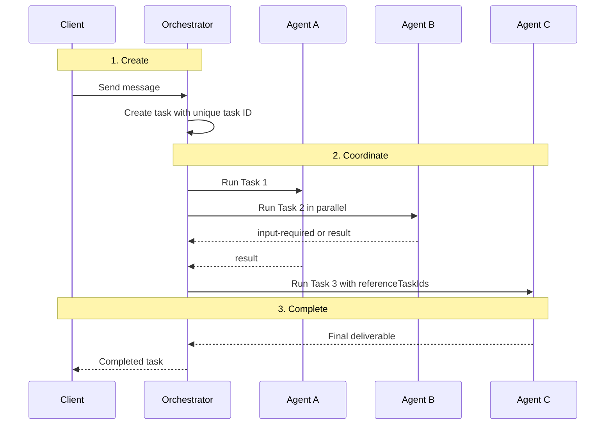
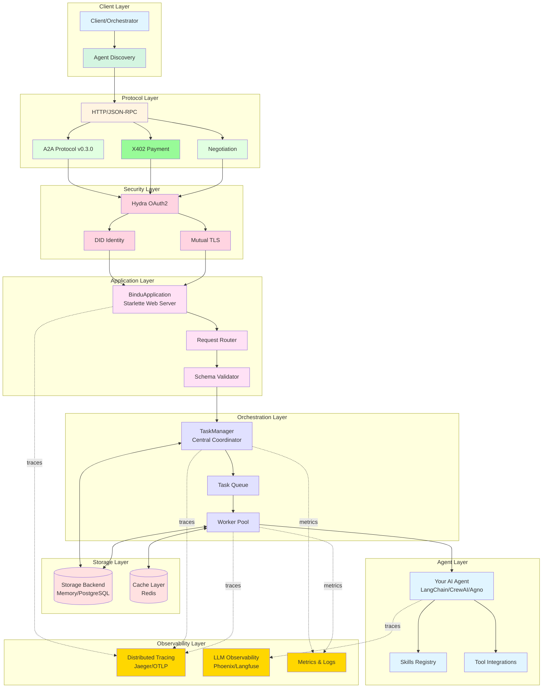
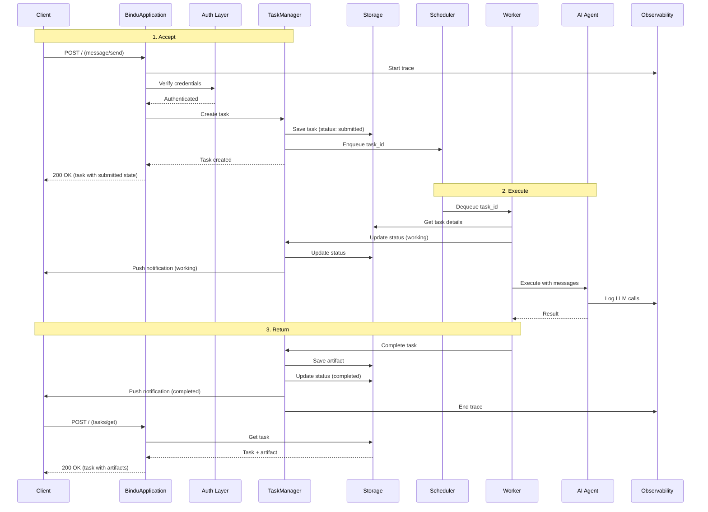

Messages alone are enough for a simple chat loop. They are not enough when several agents are working at once, some tasks depend on others, and parts of the workflow may pause for input before continuing.

# Task-First Agent Pattern

## Why Task-First Matters

In [Key Concepts](/bindu/introduction/key-concepts#task-lifecycle--states), you saw how Bindu task states enable interactive conversations. The reason Bindu leans so hard on tasks is that tasks are what make orchestration possible in the first place.

| Message-first thinking | Task-first thinking |
| --- | --- |
| Communication is easy, but execution is hard to track | Every unit of work has a durable identifier and state |
| Parallel work becomes ambiguous | Multiple tasks can run at the same time with separate IDs |
| Dependencies live in application logic only | `referenceTaskIds` makes task relationships explicit |
| Paused work is hard to resume cleanly | State tells you whether work is `working`, `input-required`, or done |
| Multi-agent coordination gets messy quickly | Orchestrators can manage work by task instead of by guesswork |

That is the shift: in Bindu, a task is not just a log entry or status wrapper. It is the unit that makes parallel execution, dependency tracking, and interactive workflows manageable.

<Note>
Bindu follows the A2A "Task-only Agent" pattern where all responses are Task objects. That is what gives orchestrators a stable unit to coordinate at scale.
</Note>

## How The Task-First Pattern Works

Every message creates a task that moves through a lifecycle such as `submitted` -> `working` -> `input-required` -> `completed`. The message starts the work, but the task is what tracks it.

### The Core Model

A task gives the system a few things that a plain message cannot:

- a unique task ID
- clear task state
- explicit dependency links through `referenceTaskIds`
- safe parallel execution across agents

<CardGroup cols={3}>
  <Card title="Trackable" icon="list-tree">
    Every interaction becomes a unit of work with its own task ID.
  </Card>
  <Card title="Stateful" icon="clock">
    A task can be working, blocked on input, completed, or failed without losing the thread of execution.
  </Card>
  <Card title="Composable" icon="boxes-stacked">
    Tasks can depend on other tasks, which is what makes orchestration and parallelism practical.
  </Card>
</CardGroup>

### The Lifecycle: Create, Coordinate, Complete

Under the hood, every task-first workflow moves through three practical stages.



<Steps>
  <Step title="Creation">
    A message creates a task. That task gets a unique ID and starts its lifecycle in a known state.

    The quick recap is still the core of the model:

    ```text
    submitted -> working -> input-required -> completed
    ```

    The important part is not only the message itself. It is the fact that the work now has a durable identity the system can track.
  </Step>

  <Step title="Coordination">
    Once work has task IDs, orchestrators can coordinate several pieces of work at the same time.

    Real-world example: travel planning

    ```text
    Task1 -> WeatherAgent: "Check Helsinki weather next week"
      -> Returns: weather-data.json

    Task2 -> FlightAgent: "Book flight" (references Task1)
      -> Asks: "How many travelers?"
      -> State: input-required

    Task3 -> HotelAgent: "Find hotel" (runs in parallel with Task2)
      -> Returns: hotel-booking.pdf

    Task4 -> ItineraryAgent: "Create itinerary" (waits for Task2 & Task3)
      -> referenceTaskIds: [Task2, Task3]
      -> Returns: complete-itinerary.pdf
    ```

    Without task IDs, the orchestrator could not keep that workflow straight. With task IDs, dependencies and parallel work become explicit.
  </Step>

  <Step title="Completion">
    The task reaches a terminal state when the work is done, fails, is canceled, or is rejected.

    At that point, the task becomes immutable. If the user wants refinement later, the system creates a new task instead of reopening the old one.
  </Step>
</Steps>

---

## Messages Vs Artifacts

Tasks sit at the center, but messages and artifacts still play different roles around them.

| Aspect | Messages | Artifacts |
| --- | --- | --- |
| **Purpose** | Interaction, negotiation, status updates, explanations | Final deliverable, task output |
| **Task State** | `working`, `input-required`, `auth-required`, `completed`, `failed` | `completed` only |
| **When Used** | During task execution AND at completion | When task completes successfully |
| **Immutability** | Task still mutable (non-terminal) or immutable (terminal) | Task becomes immutable |
| **Content** | Agent's response text, explanations, error messages | Structured deliverable (files, data) |

The distinction is important:

- **Intermediate states** (`input-required`, `auth-required`) - message only, no artifacts
- **Completed state** - message (explanation) plus artifact (deliverable)
- **Failed state** - message (error explanation) only, no artifacts
- **Canceled state** - state change only, no new content

<Note>
Messages carry the conversation while work is happening. Artifacts carry the deliverable once the work is done.
</Note>

### Task State Rules

There are two broad categories of task state.

**Non-terminal (task open):**

- `submitted`
- `working`
- `input-required`
- `auth-required`

**Terminal (task immutable):**

- `completed`
- `failed`
- `canceled`
- `rejected`

## A2A Protocol Compliance

The task-first model lines up with the A2A protocol in a few concrete ways.

<CardGroup cols={3}>
  <Card title="Task Immutability" icon="shield-check">
    Terminal tasks cannot restart. Refinements create new tasks.
  </Card>
  <Card title="Context Continuity" icon="link">
    Multiple tasks can share `contextId` so conversation history stays coherent.
  </Card>
  <Card title="Dependency Management" icon="list-tree">
    `referenceTaskIds` gives the system a clean way to express chained work.
  </Card>
</CardGroup>

The practical consequences are:

- **Task Immutability** - terminal tasks cannot restart; refinements create new tasks
- **Context Continuity** - multiple tasks share `contextId` for conversation history
- **Parallel Execution** - tasks run independently, tracked by unique IDs
- **Dependency Management** - use `referenceTaskIds` to chain tasks

## The Value Of Task-First Execution

This model matters most when workflows stop being linear.

<AccordionGroup>
  <Accordion title="Parallel execution">
    Multiple tasks can run at the same time because each task has its own ID and state. The system does not need to overload one message thread with all active work.
  </Accordion>

  <Accordion title="Dependency tracking">
    When one task depends on another, `referenceTaskIds` makes that dependency explicit. This is what lets an orchestrator wait for Task2 and Task3 before starting Task4.
  </Accordion>

  <Accordion title="Interactive pauses">
    A task can move into `input-required` or `auth-required` and stay there until the missing piece arrives. That pause does not destroy the task or require the system to infer where to resume.
  </Accordion>

  <Accordion title="Multi-agent coordination">
    Orchestrators like Sapthami can coordinate several agents because the work is represented as tasks, not just as a pile of messages with implied state.
  </Accordion>
</AccordionGroup>

---

# Architecture: How Bindu Works

When you send a message to a Bindu agent, a lot more happens than a simple function call. The request moves through protocol handling, security checks, task orchestration, worker execution, storage, and observability before it comes back as a result.

## Why Architecture Matters

In [Key Concepts](/bindu/introduction/key-concepts), you saw how task states like `submitted`, `input-required`, and `completed` make interactive workflows possible. The architecture is the part that makes those states real in a running system.

| Flat application model | Bindu layered architecture |
| --- | --- |
| Request handling, execution, and storage blur together | Each layer has a clear job in the lifecycle |
| Scaling usually means rewriting core pieces | Storage, queueing, and workers can evolve independently |
| Observability is bolted on late | Traces, LLM observability, and metrics are part of the runtime |
| Protocol support becomes tightly coupled to business logic | Protocol, security, orchestration, and execution stay separated |
| Hard to reason about what happens after a message arrives | The request flow is explicit from client to artifact |

That is the shift: Bindu is built as a layered system so each part of task execution can do one job well without collapsing into a single opaque runtime.

<Note>
When a message creates a task, that task moves through several layers, not just one server endpoint. The architecture matters because each layer is responsible for part of that lifecycle.
</Note>

## How Bindu Architecture Works

Bindu is organized into protocol, security, application, orchestration, storage, agent, and observability layers. Each one participates in turning a message into a task and a task into a result.

### The System Layout



The layered structure is what lets Bindu stay simple on the surface while still handling protocol, identity, execution, and scaling concerns underneath.

<CardGroup cols={3}>
  <Card title="Layered" icon="boxes-stacked">
    Protocol, security, orchestration, storage, and observability each live in their own part of the system.
  </Card>
  <Card title="Task-Centered" icon="list-tree">
    TaskManager sits in the middle because task state is the thing the rest of the system coordinates around.
  </Card>
  <Card title="Scalable" icon="globe">
    Storage backends, queues, workers, and agent frameworks can change without changing the whole model.
  </Card>
</CardGroup>

### The Lifecycle: Accept, Execute, Return

Under the hood, every request moves through three practical stages.



<Steps>
  <Step title="Accept">
    A client sends a `message/send` request. The protocol and security layers handle the request first, then the application layer validates it and passes it to `TaskManager`.

    `TaskManager` creates the task, stores it with state `submitted`, puts the task ID on the queue, and returns the task immediately.
  </Step>

  <Step title="Execute">
    A worker dequeues the task, fetches the task details, and moves the task into `working`.

    The worker then calls your agent. That agent may use frameworks such as Agno, LangChain, CrewAI, or LlamaIndex, plus skills and tool integrations.
  </Step>

  <Step title="Return">
    Once the agent returns a result, `TaskManager` saves the artifact, updates the task state, and makes the finished task available through retrieval APIs and notifications.

    The request flow summary is still the same:

    - **Phase 1: Submit (0-50ms)** - Client sends `message/send` -> Auth validates -> TaskManager creates task -> Returns `task_id` immediately
    - **Phase 2: Execute (async)** - Worker dequeues -> Runs your agent -> Updates state (`working` -> `input-required` or `completed`)
    - **Phase 3: Retrieve (anytime)** - Client polls with `tasks/get` -> Gets current state + artifacts
  </Step>
</Steps>

---

## Core Components

The architecture is easier to reason about when the layers are spelled out directly.

### Protocol Layer

- **A2A Protocol v0.3.0** - Agent-to-agent communication (task lifecycle, context management) over JSON-RPC 2.0
- **X402 Protocol** - Micropayments delivered as an A2A extension (payment sessions, cryptographic signatures)
- **Negotiation** - Bid/award flow for matching tasks to capable agents, exposed at `/agent/negotiation`

A2A method calls (`message/send`, `tasks/get`, `tasks/cancel`, `contexts/*`) are dispatched through JSON-RPC at `POST /`. Discovery, skills, payments, and negotiation use dedicated HTTP routes.

### Security And Identity Layer

- **Hydra OAuth2** - ORY Hydra acts as the OAuth2 / OIDC provider for authenticated routes
- **Mutual TLS** - Optional cert-pinned transport via the mTLS extension (step-ca issuance)
- **DID (Decentralized Identity)** - Unique, verifiable agent identity surfaced in the agent card and accepted in `allowed_dids` allowlists

### Application Layer

- **BinduApplication** - Starlette-based ASGI web server with async/await
- **Request Router** - Registers `/`, `/.well-known/agent.json`, `/agent/private.json` (when configured), `/agent/skills`, `/agent/skills/{skill_id}`, `/agent/skills/{skill_id}/documentation`, `/agent/negotiation`, `/did/resolve`, `/health`, `/metrics`, plus payment-session routes when X402 is enabled
- **Schema Validator** - Validates request structure and types

### Orchestration Layer

- **TaskManager** - Central coordinator that creates tasks, manages state, coordinates workers
- **Task Queue** - Memory (dev) or Redis (prod) for distributed task scheduling
- **Worker Pool** - Executes tasks asynchronously, handles retries and timeouts

### Storage Layer

- **Memory Storage** (dev) - In-memory dictionaries for tasks, contexts, artifacts
- **PostgreSQL** (prod) - ACID compliance, relational queries, JSON support
- **Redis Cache** - Session storage, rate limiting, pub/sub notifications

### Agent Layer

- **Framework Agnostic** - Works with Agno, LangChain, CrewAI, LlamaIndex
- **Skills Registry** - Defines agent capabilities via `/agent/skills` endpoint
- **Tool Integrations** - 113+ built-in toolkits for data, code, web, APIs

### Observability Layer

- **Distributed Tracing** - Jaeger/OTLP tracks requests across all components
- **LLM Observability** - Phoenix/Langfuse monitors token usage, latency, cost
- **Metrics** - Request rate, task duration, error rate, queue depth, worker utilization

<Note>
The system works because these layers stay distinct. Protocol is not storage. Storage is not orchestration. Orchestration is not the agent itself.
</Note>

## The Value Of Layered Architecture

The architecture is designed around a few practical goals.

- **Simplicity** - Wrap any agent with minimal code
- **Scalability** - From localhost to distributed cloud
- **Reliability** - Built-in error handling and recovery
- **Observability** - Complete visibility into operations
- **Security** - Authentication and identity built-in
- **Standards** - Protocol-first design (`A2A`, `X402`)

This is the point of the layered design: each part can evolve independently while still fitting into one coherent system.

## Real-World Use Cases

<AccordionGroup>
  <Accordion title="Following one request through the system">
    When you send "create sunset caption", the request hits the Protocol Layer, is authenticated by the Security Layer, validated in the Application Layer, turned into a task by `TaskManager`, executed by a worker, and returned as a completed task with an artifact.
  </Accordion>

  <Accordion title="Interactive conversations with paused work">
    If the agent asks "which platform?", the task does not disappear. `TaskManager` updates it into `input-required`, stores that state, and lets the same task continue when the user answers.
  </Accordion>

  <Accordion title="Scaling from local development to production">
    In development, the same architecture can run with in-memory storage and queues. In production, those pieces can move to PostgreSQL and Redis without changing the task model.
  </Accordion>

  <Accordion title="Observing the whole path">
    Tracing and metrics sit alongside execution so you can see requests move through the server, manager, worker, and agent instead of guessing which layer is slow or failing.
  </Accordion>
</AccordionGroup>


---

<span className="brand-quote">
  

  <span className="brand-quote-text">
    Bindu treats work as{" "}
    <span className="brand-quote-highlight">
      something to track, coordinate, and complete explicitly
    </span>
    , so multi-agent execution stays understandable as systems grow.
  </span>
</span>

<span className="brand-quote">
  

  <span className="brand-quote-text">
    Bindu works because each layer{" "}
    <span className="brand-quote-highlight">
      does one part of the job clearly
    </span>
    , so task execution stays understandable as the system grows.
  </span>
</span>
