Create Bindu Agent is a cookiecutter template that scaffolds production-ready AI agents in 2 minutes. No boilerplate, no configuration hell, just answer a few questions and get a fully deployable agent that speaks A2A, AP2, and X402 protocols.

## What It Does

Transforms this:
```bash
uvx cookiecutter https://github.com/getbindu/create-bindu-agent.git
```

Into a complete agent project with:
- **Protocol Support** - A2A, AP2, and X402 built-in
- **Authentication** - Auth0, DID, and PKI ready
- **Observability** - Phoenix, Langfuse, and Jaeger integration
- **CI/CD** - GitHub Actions workflows
- **Testing** - pytest with coverage
- **Documentation** - MkDocs setup
- **Containerization** - Docker/Podman ready
- **Code Quality** - Ruff, ty, and pre-commit hooks

## Project Structure

After running cookiecutter, you get:

```
your-agent/
├── agent_config.json          # Agent configuration with A2A/AP2/X402 settings
├── your_agent/
│   ├── main.py               # Agent entry point (Bindu-fied!)
│   └── __init__.py
├── skills/                   # Template for adding agent skills
├── tests/                    # Pre-configured pytest tests
├── pyproject.toml            # Dependencies managed by uv
├── Dockerfile                # Ready for containerization
├── .github/workflows/        # CI/CD pipelines
└── README.md                 # Complete setup instructions
```

## Why Use It?

<AccordionGroup>
  <Accordion title="2-Minute Setup">
    Answer simple questions and get a complete production-ready agentic system. No boilerplate, no configuration hell.
  </Accordion>
  
  <Accordion title="Protocol-Ready">
    Built-in support for A2A, AP2, and X402—your agent speaks the universal language of the Internet of Agents.
  </Accordion>
  
  <Accordion title="Framework Agnostic">
    Works with Agno, LangChain, CrewAI, LlamaIndex, FastAgent, and more. Bring your own framework.
  </Accordion>
  
  <Accordion title="Production-Ready">
    Includes CI/CD, testing, Docker, documentation, and deployment configs out of the box.
  </Accordion>
  
  <Accordion title="Secure by Design">
    Built-in authentication, error tracking, and monitoring. DID support for decentralized identity.
  </Accordion>
  
  <Accordion title="Best Practices">
    Pre-configured with ruff, ty, pytest, pre-commit hooks, and code quality tools.
  </Accordion>
</AccordionGroup>

## How It Works

```mermaid
sequenceDiagram
    participant You
    participant Cookiecutter
    participant Agent
    participant Network as Internet of Agents
    
    You->>Cookiecutter: Run uvx cookiecutter
    Cookiecutter->>You: Prompt for configuration
    You->>Cookiecutter: Answer prompts
    Cookiecutter->>Agent: Generate project
    Agent-->>You: Project created
    You->>Agent: Deploy
    Agent->>Network: Connect via A2A, AP2, X402
    Network-->>Agent: Ready to join the Force 🌐
```



## Next Steps

<CardGroup cols={2}>
  <Card title="Configuration Reference" icon="gear" href="/bindu/create-bindu-agent/configuration">
    Complete guide to all configuration options
  </Card>
  <Card title="Quick Start" icon="rocket" href="/bindu/introduction/create-agent">
    Create your first agent in 2 minutes
  </Card>
</CardGroup>
