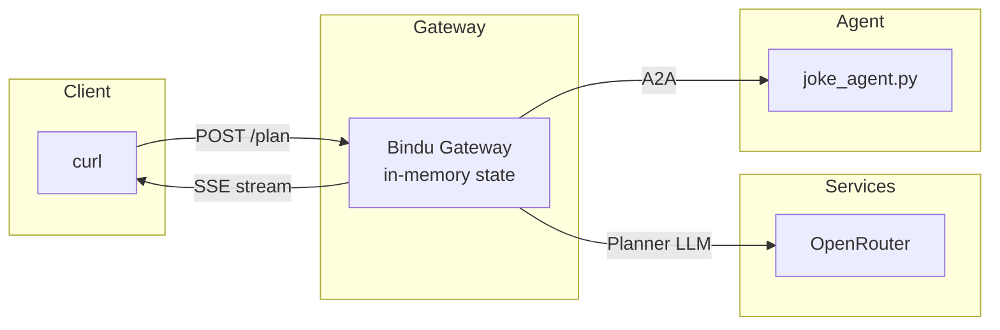

This chapter has six steps. Follow them in order.

---

## Step 1 - What you need

You need two things before starting. You may already have them; skim and decide.

<CardGroup cols={2}>
  <Card title="Node.js 22+" icon="node-js">
    The gateway is TypeScript; we run it with `tsx`, no separate build step.
  </Card>
  <Card title="OpenRouter API key" icon="key">
    Paid proxy to dozens of models. The gateway uses it for the planner LLM.
  </Card>
</CardGroup>

<AccordionGroup>
  <Accordion title="Checking Node" icon="terminal">
    ```bash
    node --version    # should print v22.x or higher
    ```
  </Accordion>
  <Accordion title="Getting an OpenRouter key" icon="key">
    Sign up at [openrouter.ai](https://openrouter.ai), add a few dollars of credit, and copy the key from the *API* section. It looks like `sk-or-v1-<long random string>`.
  </Accordion>
</AccordionGroup>

<Note>
**No database required.** The gateway is **stateless** — it holds per-request state in memory for the lifetime of each `/plan` call and drops it when the call ends. The calling client owns durable history: pass prior turns in the `history` field and the latest compaction summary in `prior_summary` on the next call. Old releases required Supabase; that's gone.
</Note>

---

## Step 2 - Get the code and install

```bash
git clone https://github.com/GetBindu/Bindu
cd Bindu

# Python side - runs the small sample agents we'll call
uv sync --dev --extra agents

# TypeScript side - runs the gateway
cd gateway
npm install
cd ..
```

<Tip>
The `uv sync` line uses [uv](https://github.com/astral-sh/uv), a fast Python package manager. If you don't have it:

```bash
curl -LsSf https://astral.sh/uv/install.sh | sh
```
</Tip>

---

## Step 3 - Configure the gateway

Create `gateway/.env.local` from the template:

```bash
cp gateway/.env.example gateway/.env.local
```

Open it in an editor. Fill in:

```bash gateway/.env.local
# One bearer token the caller must send to talk to the gateway.
# Generate a strong one:
#   openssl rand -base64 32 | tr -d '=' | tr '+/' '-_'
# Paste the output here:
GATEWAY_API_KEY=<paste generated token>

# The planner AI
OPENROUTER_API_KEY=sk-or-v1-<your key>

# Gateway listens here (these are optional — defaults shown)
GATEWAY_PORT=3774
GATEWAY_HOSTNAME=0.0.0.0
```

And `examples/.env` (used by the sample Python agents - the file already exists, you just add the key):

```bash examples/.env
OPENROUTER_API_KEY=sk-or-v1-<same key>
```

<Note>
**What's a "bearer token"?**

Think of `GATEWAY_API_KEY` like the password on a movie ticket booth. Whoever holds this string can ask the gateway to do work on their behalf. The gateway checks it on every request by hashing both sides and comparing the hashes in constant time (so neither a timing nor a length attack can recover the token). Don't paste it into chat apps or commit it to a public repo. Rotate it when you suspect it leaked.
</Note>

<Info>
You may notice old `SUPABASE_URL` / `SUPABASE_SERVICE_ROLE_KEY` lines in `.env.example`. Leave them blank — the gateway no longer reads them. See [`gateway/src/config/loader.ts:110`](https://github.com/GetBindu/Bindu/blob/main/gateway/src/config/loader.ts#L110) for the explicit removal note in the code.
</Info>

---

## Step 4 - Start one agent

Open a terminal. Start the joke agent — one Python file that answers with jokes. We pin the port to 3773 with `BINDU_PORT` so it matches the next chapter's fleet layout (the file's own default is 5773):

```bash
BINDU_PORT=3773 uv run python examples/gateway_test_fleet/joke_agent.py
```

The boot prints a block of `bindufy` setup logs. The last line you should see is:

```
INFO bindu.utils.server_runner: Starting uvicorn server at http://0.0.0.0:3773...
INFO bindu.utils.server_runner: Press Ctrl+C to stop the server gracefully
INFO:     Uvicorn running on http://0.0.0.0:3773 (Press CTRL+C to quit)
```

Leave that terminal running.

---

## Step 5 - Start the gateway

In a **second** terminal:

```bash
cd gateway
npm run dev
```

Expected output:

```
[bindu-gateway] no DID identity configured (set BINDU_GATEWAY_DID_SEED, _AUTHOR, _NAME to enable did_signed peer auth)
[bindu-gateway] listening on http://0.0.0.0:3774
[bindu-gateway] session mode: stateless
```

<Info>
The *"no DID identity configured"* line is expected for now. The [DID signing chapter](/bindu/gateway/identity) turns on cryptographic signing. `session mode: stateless` is the only mode in the current gateway — the `mode` field is kept on the schema for forward-compat but `stateful` is rejected at boot. Leave this terminal running too.
</Info>

---

## Step 6 - Ask a question

In a **third** terminal, load your gateway token into the shell so you don't have to copy-paste it every time:

```bash
set -a && source gateway/.env.local && set +a
```

Now send the request:

```bash
curl -N http://localhost:3774/plan \
  -H "Authorization: Bearer ${GATEWAY_API_KEY}" \
  -H "Content-Type: application/json" \
  -d '{
    "question": "Tell me a joke about databases.",
    "agents": [
      {
        "name": "joke",
        "endpoint": "http://localhost:3773",
        "auth": { "type": "none" },
        "skills": [{ "id": "tell_joke", "description": "Tell a joke" }]
      }
    ]
  }'
```

<Tip>
The `-N` flag tells curl not to buffer - you'll see output appear one line at a time over about 5 seconds.
</Tip>

Expected stream (a few fields like `agent_did`, `agent_did_source`, and `signatures` are elided for readability — they're documented in the [Gateway API reference](/gateway-api/introduction)):

```
event: session
data: {"session_id":"s_01H...","external_session_id":null,"created":true}

event: plan
data: {"plan_id":"m_01H...","session_id":"s_01H..."}

event: task.started
data: {"task_id":"call_01H...","agent":"joke","skill":"tell_joke","input":{"input":"Tell me a joke about databases."}}

event: task.artifact
data: {"task_id":"call_01H...","agent":"joke","content":"<remote_content agent=\"joke\" verified=\"unknown\">Why did the database admin break up? Because they had too many relationships!</remote_content>"}

event: task.finished
data: {"task_id":"call_01H...","agent":"joke","state":"completed"}

event: text.delta
data: {"session_id":"s_01H...","part_id":"p_01H...","delta":"Here"}

event: text.delta
data: {"session_id":"s_01H...","part_id":"p_01H...","delta":"'s a joke..."}
... (many more deltas) ...

event: final
data: {"session_id":"s_01H...","stop_reason":"stop","usage":{"inputTokens":1130,"outputTokens":52,"totalTokens":1182,"cachedInputTokens":0}}

event: done
data: {}
```

**You made a plan.** 🎉

---

## Reading the output line by line

That format is called **Server-Sent Events** (SSE). It's plain HTTP, but the server keeps the connection open and writes events one at a time instead of sending one big response at the end. Two parts per event: a label (`event: session`) and a JSON payload (`data: {...}`).

What each event means, in the order they arrived:

| # | Event | What it means |
|---|---|---|
| 1 | `session` | The gateway opened an in-memory session for this `/plan` call. `session_id` is a per-call handle; `external_session_id` echoes whatever the client sent (or `null`). Since the gateway is stateless, this id is *not* a resumption key — to give the planner context across requests, pass prior turns via the `history` field on each call. |
| 2 | `plan` | The planner started its first turn. |
| 3 | `task.started` | The planner decided to call the joke agent. `input: {input: "..."}` is what it's sending. |
| 4 | `task.artifact` | The agent replied. The text inside `<remote_content>` is the real answer. That envelope is there so the planner (and you) remember this is *untrusted* data. The `verified` attribute takes one of four values — `yes`, `no`, `unsigned`, `unknown` — and is `unknown` here because we used `auth.type: "none"`. With `did_signed` it becomes `yes` (signed and verified), `no` (signature mismatch), or `unsigned` (the peer didn't sign). |
| 5 | `task.finished` | That call is complete. |
| 6 | `text.delta` (many) | The planner is now writing its own final answer, streamed a word or two at a time. Concatenate them in order (they all share a `part_id`). |
| 7 | `final` | Done. `stop_reason: "stop"` means "natural end". `usage` reports token counts for billing. |
| 8 | `done` | Last event. Close the connection. |

You may also see one more event on long conversations:

| Event | When | Meaning |
|---|---|---|
| `compaction-summary` | Mid-stream, zero or one per call | The planner ran out of context window, compacted history into a summary. Persist the `summary` field client-side and ship it back as `prior_summary` on the next `/plan` call. |

---

## What's actually running

You now have three things talking to each other:



<Tip>
The gateway is a **coordinator**. It doesn't answer the question itself; it picks an agent, sends the question, gets the reply, writes a final summary using its own planner LLM. It also doesn't persist anything — when the `/plan` call ends, the session is gone.
</Tip>

If this is the moment the idea clicks - great. Next we'll add a second agent so the gateway has a real choice to make: **[Adding a second agent →](/bindu/gateway/multi-agent)**

<span className="brand-quote">
  

  <span className="brand-quote-text">
    Gateway is stateless -{" "}
    <span className="brand-quote-highlight">the client owns history</span>.
  </span>
</span>
