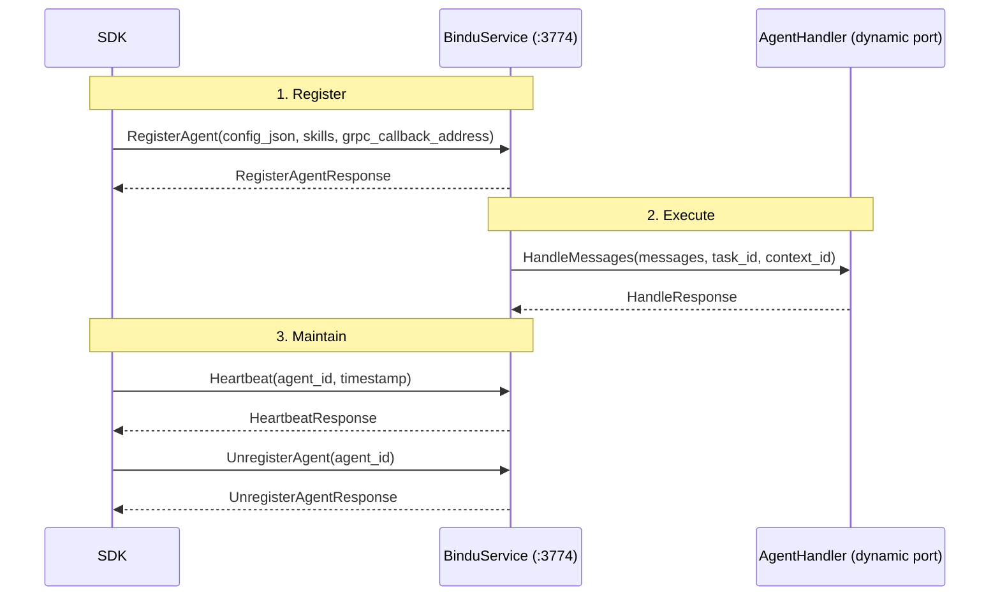

This is the complete gRPC contract between SDKs and the Bindu core. Everything on this page is defined in `proto/agent_handler.proto` — the single source of truth for how SDKs register agents, send heartbeats, expose handler callbacks, and keep the language-agnostic runtime aligned with the Python core.

## Why This API Matters

The gRPC layer is not an add-on around Bindu. It is the contract that keeps registration, liveness, handler execution, and capability discovery consistent across SDKs while the core continues to run the shared infrastructure.

To understand why this matters, compare what happens without it:

| Ad-hoc SDK integration | Bindu gRPC contract |
| --- | --- |
| Each SDK invents its own registration and callback shape | One protocol defines the shared contract between SDKs and the core |
| Liveness and capability checks vary across languages | Heartbeat, HealthCheck, and GetCapabilities are standardized |
| Remote handlers can drift from local bindufy behavior | RegisterAgent preserves the same bindufy pipeline in the core |
| Message execution contracts become SDK-specific | HandleMessages keeps one handler request/response model |
| Operational behavior becomes harder to debug | Ports, methods, and message schemas stay explicit and testable |

The proto turns the language boundary into a stable interface. SDKs and the core can evolve around one shared contract instead of growing separate integration logic.

<Note>
  The reference here is not just a list of RPCs. It is the runtime boundary that allows
  remote SDKs to participate in the same `bindufy` lifecycle as local Python agents.
</Note>

## How The gRPC Contract Works

The contract is split across two services that face opposite directions. Understanding which service lives where is the key to reading the rest of this page.

### The Service Split

`BinduService` runs on port `3774` in the Bindu core. SDKs use it to register and manage agents.

`AgentHandler` runs on a dynamic port in the SDK. The core uses it to execute the developer's handler and query runtime status.

<CardGroup cols={3}>
  <Card title="Registration" icon="link">
    `BinduService` is the control plane for agent registration, heartbeats, and shutdown.
  </Card>
  <Card title="Execution" icon="code">
    `AgentHandler` is the runtime callback plane for message handling and health checks.
  </Card>
  <Card title="Shared Proto" icon="shield-check">
    Both sides follow the same message schema from `proto/agent_handler.proto`.
  </Card>
</CardGroup>

### The Lifecycle: Register, Execute, Maintain

Every SDK follows the same three-phase lifecycle. First the SDK registers with the core. Then the core calls the SDK when work arrives. Finally, the SDK keeps the connection alive and shuts down cleanly.



Let's walk through each phase and look at the exact message shapes involved.

<Steps>
  <Step title="Register">
    `RegisterAgent` is the main entry point. The SDK sends config, skills, and its
    callback address. The core runs the full `bindufy` pipeline and returns the agent's
    identity.

    <CodeGroup>
      ```protobuf Request
      message RegisterAgentRequest {
        string config_json = 1;              // Full config as JSON string
        repeated SkillDefinition skills = 2; // Skills with file content
        string grpc_callback_address = 3;    // SDK's AgentHandler address
      }
      ```

      ```protobuf Response
      message RegisterAgentResponse {
        bool success = 1;
        string agent_id = 2;   // Generated UUID
        string did = 3;        // "did:bindu:author:name:id"
        string agent_url = 4;  // "http://localhost:3773"
        string error = 5;      // Error message if success=false
      }
      ```
    </CodeGroup>

    `config_json` matches the Python `bindufy()` config format:

    ```json
    {
      "author": "dev@example.com",
      "name": "my-agent",
      "description": "What it does",
      "deployment": {"url": "http://localhost:3773", "expose": true},
      "execution_cost": {"amount": "1000000", "token": "USDC"}
    }
    ```

    The core validates config, generates agent ID as `UUID(SHA256("{author}:{name}").hexdigest()[:32])`
    ([`bindufy.py:74-76`](https://github.com/getbindu/Bindu/blob/main/bindu/penguin/bindufy.py#L74)),
    creates Ed25519 DID keys, sets up x402 payments (when `execution_cost` is provided),
    creates the manifest with `GrpcAgentClient` as the handler, and starts the HTTP/A2A
    server on the configured URL.

    The DID's `author` and `name` segments are sanitized (`@` → `_at_`, `.` → `_`, spaces → `_`,
    lowercased) — see [`did_agent_extension.py:124`](https://github.com/getbindu/Bindu/blob/main/bindu/extensions/did/did_agent_extension.py#L124).
    So `author = "Dev@Example.com"`, `name = "my-agent"` produces a DID like
    `did:bindu:dev_at_example_com:my-agent:{agent_id}`.
  </Step>

  <Step title="Execute">
    `HandleMessages` is how the core invokes the SDK handler once work arrives. This is the
    hot path — every user message passes through this RPC.

    <CodeGroup>
      ```protobuf Request
      message HandleRequest {
        repeated ChatMessage messages = 1;  // Conversation history
        string task_id = 2;
        string context_id = 3;
      }

      message ChatMessage {
        string role = 1;     // "user", "assistant", or "system"
        string content = 2;
      }
      ```

      ```protobuf Response
      message HandleResponse {
        string content = 1;                  // The response text
        string state = 2;                    // "" = completed, "input-required", "auth-required"
        string prompt = 3;                   // Follow-up prompt (when state is set)
        bool is_final = 4;                   // true for unary; true on last chunk for streaming
        map<string, string> metadata = 5;    // Optional extra key-value pairs
      }
      ```
    </CodeGroup>

    Response rules:

    - Normal response: `{content: "answer", state: ""}` → task completes
    - Need more info: `{state: "input-required", prompt: "Can you clarify?"}` → task stays open
    - Need auth: `{state: "auth-required"}` → task stays open
    - Error: Return gRPC `INTERNAL` status → task fails
  </Step>

  <Step title="Maintain">
    `Heartbeat` and `UnregisterAgent` handle liveness and clean shutdown. The heartbeat
    keeps the core informed that your SDK is still running. Unregister tells it you are
    leaving on purpose.

    <CodeGroup>
      ```protobuf Heartbeat
      message HeartbeatRequest {
        string agent_id = 1;
        int64 timestamp = 2;   // Unix timestamp in milliseconds
      }

      message HeartbeatResponse {
        bool acknowledged = 1;      // true if agent_id is registered
        int64 server_timestamp = 2;
      }
      ```

      ```protobuf Shutdown
      message UnregisterAgentRequest { string agent_id = 1; }
      message UnregisterAgentResponse { bool success = 1; string error = 2; }
      ```
    </CodeGroup>

    SDKs send `Heartbeat` every 30 seconds and call `UnregisterAgent` before exiting.
  </Step>
</Steps>

---

## Service Reference

Here are the two services summarized for quick lookup.

### BinduService (port 3774)

Lives in the Bindu core. SDKs call this to register and manage agents.

| Method | What it does |
| --- | --- |
| `RegisterAgent` | SDK sends config + skills, core runs the full `bindufy` pipeline and returns the agent's identity |
| `Heartbeat` | Keep-alive signal sent every 30 seconds |
| `UnregisterAgent` | Clean shutdown call before SDK exit |

### AgentHandler (dynamic port)

Lives in the SDK. The core calls this when work arrives.

| Method | What it does |
| --- | --- |
| `HandleMessages` | Core sends conversation history, SDK runs the developer's handler and returns the response |
| `HandleMessagesStream` | Server-side streaming variant — supported in `GrpcAgentClient` via `use_streaming=True` |
| `GetCapabilities` | Core queries what the SDK agent supports |
| `HealthCheck` | Core verifies the SDK is responsive |

<Info>
  `HandleMessagesStream` is fully supported. `GrpcAgentClient` calls it when initialized
  with `use_streaming=True`. The SDK's `AgentHandler` must implement this RPC to use
  streaming. The TypeScript SDK currently returns `supports_streaming: false` from
  `GetCapabilities`, but the proto contract and Python core are both fully ready for it.
</Info>

---

## Shared Message Types

These message types are used across both services. Understanding them helps when building [Custom SDKs](/bindu/grpc/custom-sdks) or debugging registration issues.

### SkillDefinition

`SkillDefinition` is sent during registration and carries the skill file content so the core does not need filesystem access. The `name`, `description`, and `tags` fields describe the skill for discovery. The `input_modes` and `output_modes` declare what formats the skill accepts and produces. The `raw_content` and `format` fields carry the original file content so the core can process it directly.

```protobuf
message SkillDefinition {
  string name = 1;
  string description = 2;
  repeated string tags = 3;
  repeated string input_modes = 4;
  repeated string output_modes = 5;
  string version = 6;
  string author = 7;
  string raw_content = 8;   // Full skill.yaml or SKILL.md content
  string format = 9;        // "yaml" or "markdown"
}
```

<Note>
  Sending skill content during registration lets the SDK remain the source of truth for
  skill files while the core receives the exact material it needs to build the manifest.
</Note>

### Capability and Health Responses

These are the responses the core gets when it queries your SDK about what it can do and whether it is still running.

<CodeGroup>
  ```protobuf Capabilities
  message GetCapabilitiesResponse {
    string name = 1;
    string description = 2;
    string version = 3;
    bool supports_streaming = 4;
    repeated SkillDefinition skills = 5;
  }
  ```

  ```protobuf Health
  message HealthCheckResponse {
    bool healthy = 1;
    string message = 2;   // "OK" or diagnostic info
  }
  ```
</CodeGroup>

---

## Configuration

These environment variables control the gRPC server in the Bindu core. You typically do not need to change them unless you are running in a non-standard environment or debugging port conflicts.

| Variable | Default | Description |
| --- | --- | --- |
| `GRPC__ENABLED` | `false` | Enable gRPC server |
| `GRPC__HOST` | `0.0.0.0` | Bind address |
| `GRPC__PORT` | `3774` | Server port |
| `GRPC__MAX_WORKERS` | `10` | Thread pool size |
| `GRPC__MAX_MESSAGE_LENGTH` | `4194304` | Max message size (4MB) |
| `GRPC__HANDLER_TIMEOUT` | `30.0` | `HandleMessages` timeout (seconds) |
| `GRPC__HEALTH_CHECK_INTERVAL` | `30` | Health check interval (seconds) |

---

## Practical gRPC Calls

If you want to test the contract directly without writing SDK code, `grpcurl` lets you call any of these RPCs from the command line. This is useful for debugging registration issues or verifying that the core is running correctly.

<AccordionGroup>
  <Accordion title="List services">
    ```bash
    grpcurl -plaintext \
      -import-path proto \
      -proto agent_handler.proto \
      localhost:3774 list
    ```
  </Accordion>

  <Accordion title="Send Heartbeat">
    ```bash
    grpcurl -plaintext -emit-defaults \
      -proto proto/agent_handler.proto -import-path proto \
      -d '{"agent_id": "test", "timestamp": 1711234567890}' \
      localhost:3774 bindu.grpc.BinduService.Heartbeat
    ```
  </Accordion>

  <Accordion title="Call RegisterAgent">
    ```bash
    grpcurl -plaintext -emit-defaults \
      -proto proto/agent_handler.proto -import-path proto \
      -d '{
        "config_json": "{\"author\":\"test@example.com\",\"name\":\"test\",\"deployment\":{\"url\":\"http://localhost:3773\",\"expose\":true}}",
        "skills": [],
        "grpc_callback_address": "localhost:50052"
      }' \
      localhost:3774 bindu.grpc.BinduService.RegisterAgent
    ```
  </Accordion>
</AccordionGroup>

---

## Operational Guarantees

<CardGroup cols={2}>
  <Card title="Stable Contract" icon="shield-check">
    The proto keeps SDK registration, handler execution, and liveness signaling aligned
    across languages.
  </Card>
  <Card title="Explicit Interfaces" icon="link">
    Ports, message types, and RPC boundaries stay visible and testable with tools like
    `grpcurl`.
  </Card>
</CardGroup>

## Related

- [gRPC Overview](/bindu/grpc/overview) — the conceptual tour of why the sidecar exists
- [Agent Implementation](/bindu/grpc/agent-client) — handler patterns and the bridge internals
- [Custom SDKs](/bindu/grpc/custom-sdks) — how to build SDKs for other languages using this contract

<span className="brand-quote">
  

  <span className="brand-quote-text">
    Bindu keeps the runtime contract{" "}
    <span className="brand-quote-highlight">explicit at the boundary</span>, so
    SDKs and the core can behave like one system across languages.
  </span>
</span>
