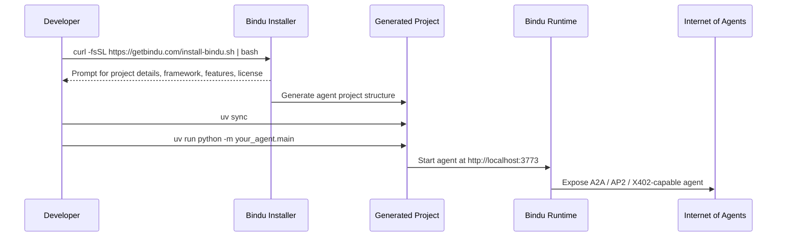
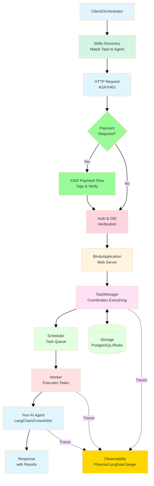
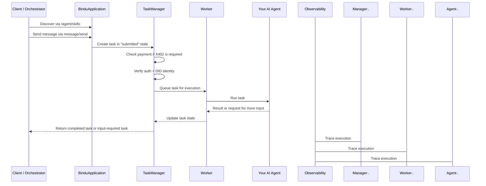
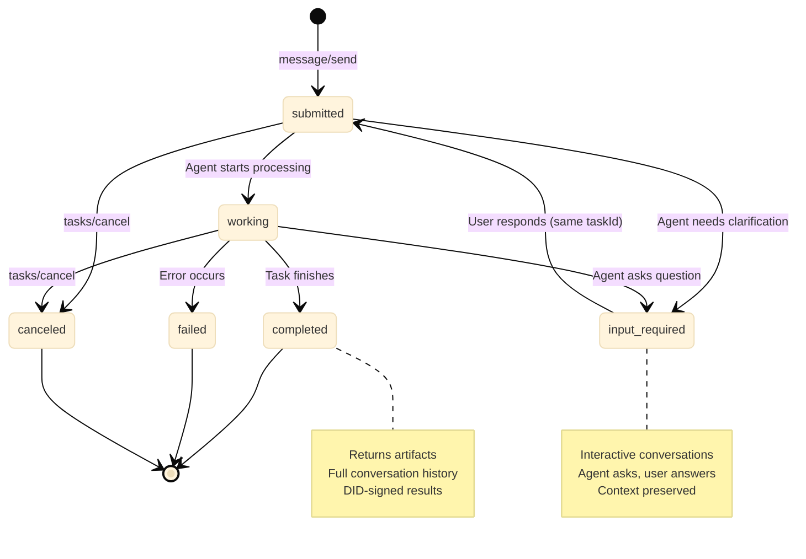
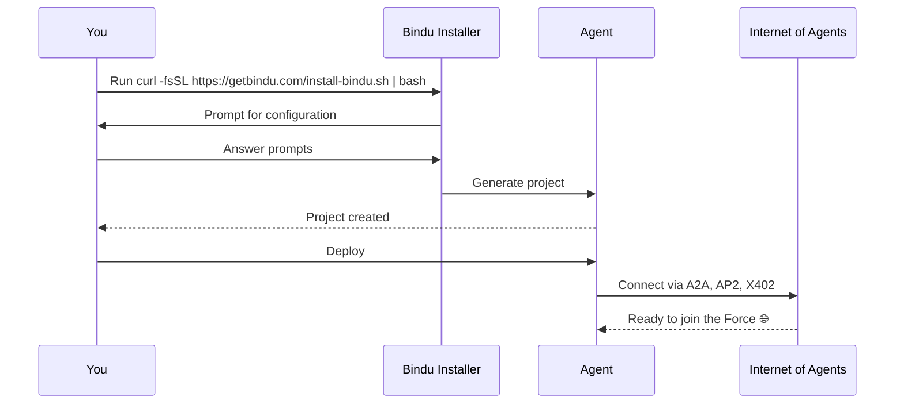
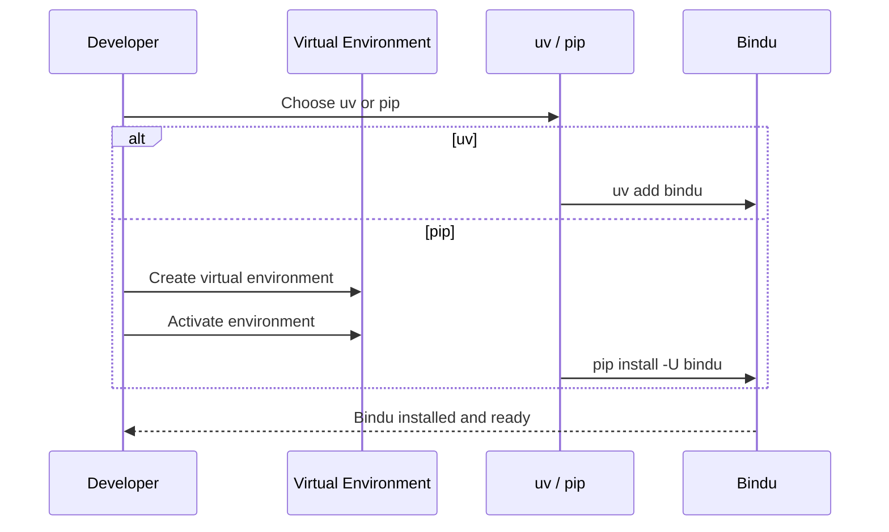

# Join the Internet of Agents

As developers, we love building agents. The logic is fun, the possibilities are exciting. But then comes the reality check - servers, protocols, authentication, deployment, CI/CD, and suddenly your weekend project becomes a three-week infrastructure marathon.

## Why This Matters

Let me share a quick story about why this matters.

**Situation**: You've just built an amazing agent that works perfectly on your laptop. You're excited to share it with the world.

**Task**: Get your agent from local development to a production environment where other agents can discover and interact with it.

**Action**: You could spend weeks setting up servers, implementing protocols, configuring authentication, and building deployment pipelines - or you could use Bindu.

**Result**: Instead of a three-week infrastructure marathon, you get a production-ready agent in minutes, complete with protocol support, authentication, observability, and deployment scaffolding.

The real challenge isn't writing your agent - it's getting from "it works on my laptop" to "this agent can actually talk to other agents in production."

| Starting From Scratch | Starting With Bindu |
| --- | --- |
| You assemble the server, config, auth, and deployment stack yourself | The template gives you a production-ready starting point |
| Protocol support is another project | A2A, AP2, and X402 are already part of the setup |
| Identity, tracing, and testing come later | DID, observability, and pytest are included from the start |
| Existing agents need custom infrastructure glue | `bindufy()` wraps what you already built |
| First usable version can take weeks | First usable version takes minutes |

Getting onto the Internet of Agents shouldn't mean rebuilding the plumbing every single time.

<Note>
In the next 2 minutes, you can have a production-ready agent. Not a demo. Not a prototype. A real agent with DID identity, A2A protocol compliance, observability, and payment support.
</Note>

## Getting Started

You have two paths forward. If you want the fastest start from scratch, use the Bindu installer. If you already have an agent you love, just wrap it with `bindufy()`.

### The Fastest Path: Bindu Installer

**Time to first agent: about 2 minutes**

Navigate to where you want your agent project and run:

```bash
curl -fsSL https://getbindu.com/install-bindu.sh | bash
```

<CardGroup cols={3}>
  <Card title="Fast Setup" icon="rocket">
    Start from a working project scaffold instead of wiring everything by hand.
  </Card>
  <Card title="Protocol-Ready" icon="globe">
    Your generated project supports A2A, AP2, and X402 protocols from day one.
  </Card>
  <Card title="Production Baseline" icon="server">
    Testing, CI/CD, docs, and deployment scaffolding are already set up for you.
  </Card>
</CardGroup>

### The Journey: Generate, Run, Join



<Steps>
  <Step title="Generate The Project">
    Run the Bindu installer and answer a few questions about your project:

    <CodeGroup>
      ```bash Create Project
      curl -fsSL https://getbindu.com/install-bindu.sh | bash
      ```

      ```bash Install uv (if needed)
      curl -LsSf https://astral.sh/uv/install.sh | sh
      ```
    </CodeGroup>
  </Step>

  <Step title="Install And Start">
    Move into your new project, install dependencies, and start the agent:

    ```bash
    cd your-agent
    uv sync
    uv run python -m your_agent.main
    ```
  </Step>

  <Step title="Join The Network">
    Your agent is now live at `http://localhost:3773` with A2A, AP2, and X402 protocols - other agents can discover it, talk to it, and pay it for services.
  </Step>
</Steps>

---

## Already Have an Agent?

Perfect. Whether it's built with LangChain, CrewAI, or custom code, you can make it Bindu-ready in **5 minutes**.

You just need two things: a configuration file and the `bindufy` wrapper.

### Step 1: Create Your Configuration

Create an `agent_config.json` file:

```json
{
  "author": "your.email@example.com",
  "name": "my_existing_agent",
  "description": "My agent with Bindu superpowers",
  "version": "1.0.0",
  "deployment": {
    "url": "http://localhost:3773",
    "expose": true
  }
}
```

<Note>
See the [Configuration Reference](/bindu/create-bindu-agent/configuration) for all available protocol configuration options.
</Note>

### Step 2: Wrap Your Agent

```python
from bindu.penguin.bindufy import bindufy
from agno.agent import Agent
from agno.models.openai import OpenAIChat
import json

# Load your config
with open("agent_config.json", "r") as f:
    config = json.load(f)

# Your existing agent (no changes needed)
my_agent = Agent(
    instructions="Your agent instructions",
    model=OpenAIChat(id="gpt-4o"),
)

# Handler function
def agent_handler(messages: list[dict[str, str]]):
    result = my_agent.run(input=messages)
    return result

# Bindufy it!
bindufy(config, agent_handler)
```

And that's it! Your agent is now live and ready to communicate with other agents in the Internet of Agents.

No infrastructure setup.  
No protocol implementation.  
No weeks of DevOps work.

<Note>
Check out [examples](https://github.com/getbindu/Bindu/tree/main/examples) for different agent frameworks like LangChain, CrewAI, and more.
</Note>

## What Happens During Setup?

When you run the installer, it asks for:

- **Project details** - Name, description, author info
- **Agent framework** - Agno, LangChain, CrewAI, etc.
- **Features** - Authentication, DID, observability, CI/CD
- **License type** - MIT, Apache, BSD, GPL, ISC

Then you get a complete project structure:

```text
your-agent/
├── your_agent/
│   ├── skills/               # Template for adding agent skills
|   ├── agent_config.json     # Agent configuration with A2A/AP2/X402 settings
|   ├── main.py               # Agent entry point (Bindu-fied!)
│   └── __init__.py
├── tests/                    # Pre-configured pytest tests
├── pyproject.toml            # Dependencies managed by uv
├── Dockerfile                # Ready for containerization
├── .github/workflows/        # CI/CD pipelines
└── README.md                 # Complete setup instructions
```

Each file serves a purpose:

- `agent_config.json` holds your agent's configuration with protocol settings
- `main.py` is where your agent starts, already wrapped with Bindu
- `skills/` provides a structure for adding agent capabilities
- `tests/` comes with pytest ready to go
- `pyproject.toml` manages dependencies with `uv`
- `Dockerfile` makes container deployment simple
- `.github/workflows/` sets up automated testing and deployment
- `README.md` contains your generated setup instructions

## What You Get Out of the Box

All of this comes ready to use - no extra setup, no infrastructure sprint:

<CardGroup cols={2}>
  <Card title="Protocol Support" icon="globe">
    Native A2A, AP2, and X402 protocol compliance.
  </Card>
  <Card title="Authentication" icon="lock">
    Secure authentication with Ory Hydra for production, Auth0, and DID support. Authentication is optional for development and testing.
  </Card>
  <Card title="Observability" icon="chart-bar">
    Phoenix, Langfuse, and Jaeger integration.
  </Card>
  <Card title="CI/CD" icon="code">
    GitHub Actions workflows for testing and deployment.
  </Card>
  <Card title="Testing" icon="check">
    Pre-configured pytest with coverage reporting.
  </Card>
  <Card title="Documentation" icon="file-text">
    MkDocs setup for beautiful documentation.
  </Card>
  <Card title="Containerization" icon="server">
    Docker/Podman ready for easy deployment.
  </Card>
  <Card title="Code Quality" icon="gear">
    Ruff, ty, and pre-commit hooks configured.
  </Card>
</CardGroup>

---

# Built for the Internet of Agents

Bindu transforms any agent into a production-ready server that speaks the universal protocols of the Internet of Agents.

## Why These Concepts Matter

Let me explain why these concepts are crucial with a practical example.

**Situation**: You've seen countless agent demos that take a prompt and return a response. They look impressive, but what happens when you need to build something real?

**Task**: Create an agent system that can handle real-world scenarios like multi-turn conversations, payments, and working with other agents.

**Action**: Instead of just wrapping your model in an API, Bindu provides discovery mechanisms, persistent task state, payment integration, and observability from day one.

**Result**: You get an agent that can participate in the broader Internet of Agents ecosystem, not just exist in isolation.

Most agent demos stop at a simple prompt-response. Real agent systems need much more - they need discovery, identity, payment rails, task state, observability, storage, and the ability to maintain conversations across multiple interactions.

| A Basic Agent Wrapper | Bindu |
| --- | --- |
| Exposes a model behind a custom endpoint | Turns an agent into a protocol-native server |
| Treats interactions as one-off requests | Every interaction is a trackable task |
| Context often lost between calls | Context and history persist across states |
| Payments and auth are bolted on later | X402, DID, and auth built into the request path |
| Observability added separately | Phoenix, Langfuse, and Jaeger tracing built in |

This is the key difference: Bindu isn't just a wrapper around your agent framework. It provides the infrastructure your agent needs to operate effectively in the Internet of Agents.

<Note>
Bindu is built around the idea that agent infrastructure shouldn't be stitched together by hand every time. Discovery, task state, routing, identity, and execution all need to work as one cohesive system.
</Note>

## How Bindu Works

Bindu turns your agent into a server that can be discovered, called, authenticated, paid, traced, and resumed. The entire request flow is protocol-native from the first message to the final artifact.

### The System Flow



<CardGroup cols={3}>
  <Card title="Protocol-Native" icon="globe">
    Native support for A2A, AP2, and X402 protocols without custom transport layers.
  </Card>
  <Card title="Task-First" icon="list">
    Every interaction becomes a trackable task with clear state, history, and lifecycle.
  </Card>
  <Card title="Production-Ready" icon="server">
    Identity, payments, storage, scheduling, and tracing are built-in from the start.
  </Card>
</CardGroup>

### The Lifecycle: Discovery, Execution, Completion



<Steps>
  <Step title="Discovery">
    Clients find agents through the `/agent/skills` endpoint, which lists available capabilities.
  </Step>

  <Step title="Execution">
    Send a message via `message/send` → Task enters **"submitted"** state. If X402 is required, payment is verified first. Auth0 + DID verify identity. Task moves to **"working"** state and the agent executes.
  </Step>

  <Step title="Completion">
    If the agent needs input, task enters **"input-required"** state. When finished, task reaches **"completed"** state with artifacts. Full execution trace is captured via Phoenix, Langfuse, and Jaeger.
  </Step>
</Steps>

---

## Task Lifecycle And States

Let me walk you through how Bindu handles tasks using a real-world scenario.

**Situation**: You want your agent to create social media captions, but sometimes it needs clarification about which platform to use.

**Task**: Submit a request like "create sunset caption" and handle the interactive conversation that follows.

**Action**: Bindu tracks your task through different states - submitted, working, input-required, and completed - preserving context throughout the entire conversation.

**Result**: You get a complete caption with the ability to have back-and-forth conversations, and later tasks can build on previous results.

This task-first approach means every interaction is a trackable, resumable task with persistent state.



| State | Description | Can Cancel? | Next Actions |
| --- | --- | --- | --- |
| **`submitted`** | Task received, queued for processing | Yes | Wait or poll with `tasks/get` |
| **`working`** | Agent actively processing | Yes | Wait for completion or input request |
| **`input-required`** | Agent needs user input to continue | Yes | Send follow-up message with same `taskId` |
| **`completed`** | Task finished successfully | No | Retrieve artifacts, submit feedback |
| **`failed`** | Task encountered an error | No | Check error details, retry if needed |
| **`canceled`** | Task was canceled by user | No | Create new task if needed |

Each lifecycle state solves real problems:

- **Resumable Conversations**: Tasks pause for user input and resume seamlessly
- **Context Preservation**: Full conversation history maintained across all states
- **Reference Previous Tasks**: Use `referenceTaskIds` to build on prior results
- **Async by Default**: Submit task, get immediate response, poll for completion
- **Artifact Storage**: Final results stored with DID signatures for verification

<CodeGroup>
  ```python Example Flow
  # 1. Submit task
  response = await agent.send_message("create sunset caption")
  # State: "submitted" -> "input-required"
  # Agent asks: "Which platform? Instagram, Pinterest, or General?"

  # 2. Check status
  task = await agent.get_task(task_id)
  # State: "input-required"
  # History shows agent's question

  # 3. Respond to agent (same taskId, new messageId)
  response = await agent.send_message("Instagram", task_id=task_id)
  # State: "submitted" -> "working" -> "completed"

  # 4. Get final result
  task = await agent.get_task(task_id)
  # State: "completed"
  # Artifacts: ["Chasing sunsets and dreams. 🌅 #SunsetLovers"]

  # 5. Build on previous result (new task, reference old one)
  response = await agent.send_message(
      "make it shorter",
      reference_task_ids=[task_id]
  )
  # Agent accesses previous caption and shortens it
  # Result: "Sunset vibes. 🌅 #GoldenHour"
  ```
</CodeGroup>

<Note>
Unlike stateless APIs, Bindu preserves the entire conversation context. Agents can ask clarifying questions, users can respond on the same task, and later tasks can build on earlier results.
</Note>

## Protocol-Native Architecture

The architecture is built around open agent protocols and real execution infrastructure - not just a model call behind an endpoint.

<CardGroup cols={2}>
  <Card title="Universal Protocol Support" icon="link">
    Native <a href="https://github.com/a2aproject/A2A">A2A</a>, <a href="https://github.com/google-agentic-commerce/AP2">AP2</a>, and <a href="https://github.com/coinbase/x402">X402</a> compliance out of the box.
  </Card>
  <Card title="Framework Agnostic" icon="box">
    Works with <a href="https://github.com/agno-agi/agno">Agno</a>, <a href="https://github.com/langchain-ai/langchain">LangChain</a>, <a href="https://github.com/crewAIInc/crewAI">CrewAI</a>, <a href="https://developers.llamaindex.ai/python/framework/use_cases/agents/">LlamaIndex</a>, <a href="https://github.com/evalstate/fast-agent">FastAgent</a>, and any Python-based framework.
  </Card>
  <Card title="DID Authentication" icon="shield">
    Built-in Decentralized Identity for secure agent-to-agent communication. Influenced by <a href="https://atproto.com/specs/did">AT Protocol DID structure</a>.
  </Card>
  <Card title="Type Safe" icon="code">
    Enforce structured I/O through schema validation for predictable behavior.
  </Card>
</CardGroup>

## Infrastructure And Deployment

Infrastructure isn't an afterthought - it's part of the core design.

<AccordionGroup>
  <Accordion title="Simple Server Setup">
    Turn your AI agent into <a href="https://github.com/getbindu/Bindu/blob/main/bindu/server/applications.py">a web server using Starlette</a>. The `BinduApplication` class handles all the complex setup. You provide your agent, it creates a fully functional server ready to receive requests.
  </Accordion>

  <Accordion title="Built-In Reliability">
    Automatic error handling, task retry mechanisms, health checks, and backup systems. If something fails, <a href="https://github.com/getbindu/Bindu/blob/main/bindu/server/task_manager.py">Bindu recovers gracefully without crashing your agent</a>.
  </Accordion>

  <Accordion title="Run Anywhere">
    Start locally (localhost) and deploy to any cloud platform when ready. <a href="https://github.com/getbindu/create-bindu-agent/blob/main/docker-compose.yml">Works with Docker and Podman containers</a> for easy packaging and shipping to production.
  </Accordion>

  <Accordion title="Storage And Orchestration">
    Choose between in-memory, PostgreSQL, or Redis for context and history. Redis-based scheduler coordinates tasks across agent instances. Route to agents based on capabilities and availability, with sequential, parallel, or collaborative execution patterns.
  </Accordion>
</AccordionGroup>

## Developer Experience

Great infrastructure only helps if developers can actually use it without spending weeks wiring everything together.

<CardGroup cols={2}>
  <Card title="2-Minute Setup" icon="rocket">
    Production-ready agent with the Bindu installer.
  </Card>
  <Card title="Best Practices Built-In" icon="check">
    Pre-configured with ruff, ty, pytest, and pre-commit hooks.
  </Card>
  <Card title="113+ Built-In Toolkits" icon="wrench">
    Access thousands of tools across data, code, web, and enterprise APIs.
  </Card>
  <Card title="MCP Integration" icon="link">
    First-class Model Context Protocol support to connect agents with external systems.
  </Card>
</CardGroup>

---

# Create Bindu Agent Overview

The Bindu installer scaffolds production-ready AI agents in 2 minutes. No boilerplate, no configuration hell - just answer a few questions and get a fully deployable agent with A2A, AP2, and X402 protocols.

## What It Does

Transforms a simple command into a complete agent project with:
- **Protocol Support** - A2A, AP2, and X402 protocols built-in
- **Authentication** - Ory Hydra for production, Auth0, DID, and PKI ready (optional for development)
- **Observability** - Phoenix, Langfuse, and Jaeger integration
- **CI/CD** - GitHub Actions workflows
- **Testing** - pytest with coverage
- **Documentation** - MkDocs setup
- **Containerization** - Docker/Podman ready
- **Code Quality** - Ruff, ty, and pre-commit hooks

## Project Structure

After running the installer, you get:

```
your-agent/
├── your_agent/
│   ├── skills/               # Template for adding agent skills
|   ├── agent_config.json     # Agent configuration with A2A/AP2/X402 settings
|   ├── main.py               # Agent entry point (Bindu-fied!)
│   └── __init__.py
├── tests/                    # Pre-configured pytest tests
├── pyproject.toml            # Dependencies managed by uv
├── Dockerfile                # Ready for containerization
├── .github/workflows/        # CI/CD pipelines
└── README.md                 # Complete setup instructions
```

## Why Use It?

<AccordionGroup>
  <Accordion title="2-Minute Setup">
    Answer simple questions and get a complete production-ready agentic system. No boilerplate, no configuration hell.
  </Accordion>
  
  <Accordion title="Protocol-Ready">
    Your agent speaks the universal language of the Internet of Agents with A2A, AP2, and X402 protocols.
  </Accordion>
  
  <Accordion title="Framework Agnostic">
    Works with Agno, LangChain, CrewAI, LlamaIndex, FastAgent, and more. Bring your own framework.
  </Accordion>
  
  <Accordion title="Production-Ready">
    Includes CI/CD, testing, Docker, documentation, and deployment configs out of the box.
  </Accordion>
  
  <Accordion title="Secure by Design">
    Built-in authentication, error tracking, and monitoring. DID support for decentralized identity.
  </Accordion>
  
  <Accordion title="Best Practices">
    Pre-configured with ruff, ty, pytest, pre-commit hooks, and code quality tools.
  </Accordion>
</AccordionGroup>

## How It Works



## Next Steps

<CardGroup cols={2}>
  <Card title="Configuration Reference" icon="gear" href="/bindu/create-bindu-agent/configuration">
    Complete guide to all configuration options
  </Card>
  <Card title="Quick Start" icon="rocket" href="/bindu/create-bindu-agent/deploy">
    Create your first agent in 2 minutes
  </Card>
</CardGroup>

---

# Install & Setup

Installation should be boring. You should be able to get Bindu into your environment, verify it works, and move on to building your agent.

## Why This Matters

Let me explain why getting installation right matters so much.

**Situation**: You're excited to start building your agent, but you hit installation issues that eat up your time and motivation.

**Task**: Get Bindu installed and running so you can focus on what actually matters - building your agent.

**Action**: Use our streamlined installation process with either `uv` for the fastest setup or `pip` for traditional workflows.

**Result**: You're up and running in minutes, not hours, with a clean foundation that lets you jump straight into agent development.

The first setup step sets the tone for everything that follows. If installation is messy, everything after it gets harder. If it's clean, you get to the part that actually matters much faster.

<Note>
This guide covers two installation paths: `uv` for the shortest route, and `pip` if you prefer a standard virtual environment workflow.
</Note>

## How To Install Bindu

You can install Bindu with `uv` or `pip`. `uv` is the recommended approach.

### Using `uv` (Recommended)

```bash
uv add bindu
```

<CardGroup cols={2}>
  <Card title="Recommended Path" icon="rocket">
    `uv` is the shortest way to add Bindu and keep dependency management simple.
  </Card>
  <Card title="Standard Path" icon="folder">
    If your workflow already uses `pip` and virtual environments, that still works fine.
  </Card>
</CardGroup>

### The Setup Flow



<Steps>
  <Step title="Use uv">
    If you already use `uv`, install Bindu directly:

    ```bash
    uv add bindu
    ```
  </Step>

  <Step title="Use pip">
    If you prefer a traditional virtual environment setup, create one first and then install Bindu.

    <CodeGroup>
      ```bash Mac
      python3 -m venv ~/.venvs/bindu
      source ~/.venvs/bindu/bin/activate
      pip install -U bindu
      ```

      ```bash Windows
      python3 -m venv binduenv
      binduenv/scripts/activate
      pip install -U bindu
      ```
    </CodeGroup>
  </Step>

  <Step title="Fix Common Installer Issues">
    If installation fails, update `pip` and retry:

    ```bash
    python -m pip install --upgrade pip
    ```
  </Step>
</Steps>

---

## Contributing

If you want to contribute to Bindu itself, set up the development environment from the repository.

```bash
# Clone the repository
git clone https://github.com/getbindu/Bindu.git
cd Bindu

# Install development dependencies with uv
uv sync

# Install pre-commit hooks
pre-commit run --all-files
```

Each command serves a specific purpose:

- `git clone` gets the source code locally
- `cd Bindu` moves into the repository directory
- `uv sync` installs all development dependencies
- `pre-commit run --all-files` runs configured code-quality checks

<Note>
See our [Contributing Guidelines](https://github.com/getbindu/Bindu/blob/main/.github/contributing.md) for more details.
</Note>

## Practical Notes

<AccordionGroup>
  <Accordion title="When should I use uv?">
    Use `uv` for the recommended path and shorter setup flow:

    ```bash
    uv add bindu
    ```
  </Accordion>

  <Accordion title="When should I use pip?">
    Use `pip` if your local workflow already depends on a standard Python virtual environment.

    <CodeGroup>
      ```bash Mac
      python3 -m venv ~/.venvs/bindu
      source ~/.venvs/bindu/bin/activate
      pip install -U bindu
      ```

      ```bash Windows
      python3 -m venv binduenv
      binduenv/scripts/activate
      pip install -U bindu
      ```
    </CodeGroup>
  </Accordion>

  <Accordion title="What should I do if pip fails?">
    Update `pip` first and try again:

    ```bash
    python -m pip install --upgrade pip
    ```
  </Accordion>

  <Accordion title="How do I set up the repo for development?">
    Clone the repository, sync dependencies, and run pre-commit checks:

    ```bash
    git clone https://github.com/getbindu/Bindu.git
    cd Bindu
    uv sync
    pre-commit run --all-files
    ```
  </Accordion>
</AccordionGroup>

---

## Learn More

<AccordionGroup>
  <Accordion title="Configuration Reference">
    Complete guide to all configuration options.

    Path: [Configuration Reference](/bindu/create-bindu-agent/configuration)
  </Accordion>

  <Accordion title="Template Overview">
    Learn more about create-bindu-agent.

    Path: [Template Overview](/bindu/create-bindu-agent/overview)
  </Accordion>

  <Accordion title="Key Concepts">
    Understand Bindu's core concepts.

    Path: [Key Concepts](/bindu/introduction/key-concepts)
  </Accordion>

  <Accordion title="Authentication">
    Configure authentication for your agent.

    Path: [Authentication](/bindu/learn/authentication)
  </Accordion>

  <Accordion title="DID Setup">
    Set up Decentralized Identifiers.

    Path: [DID Setup](/bindu/learn/did)
  </Accordion>

  <Accordion title="Observability">
    Monitor your agent with Phoenix or Langfuse.

    Path: [Observability](/bindu/learn/observability)
  </Accordion>
</AccordionGroup>

## When Things Go Wrong

Most of the time, the template path is smooth. When issues do occur, they're usually familiar ones.

<CardGroup cols={2}>
  <Card title="uv Not Found" icon="terminal">
    Install `uv` first with `curl -LsSf https://astral.sh/uv/install.sh | sh`, then restart your terminal and try again.
  </Card>
  <Card title="Port Already In Use" icon="warning">
    Something is already running on port `3773`. Change the `deployment_port` in `agent_config.json` to something else, or stop the process using that port.
  </Card>
  
  <Card title="Authentication Errors" icon="lock">
    You probably haven't set up Auth0 credentials yet. Check the generated README for environment variables, or disable auth in your config while testing.
  </Card>
  
  <Card title="Dependencies Not Installing" icon="download">
    Sometimes the virtual environment gets corrupted. Remove it, run `uv sync` again, and retry.
  </Card>
</CardGroup>

---

## Related

- https://github.com/getbindu/Bindu/tree/main/examples
- https://github.com/getbindu/Bindu/blob/main/.github/contributing.md

---

<span className="brand-quote">
  

  <span className="brand-quote-text">
    Bindu helps you get from{" "}
    <span className="brand-quote-highlight">
      agent idea to live agent
    </span>
    , without spending the next three weeks buried in infrastructure.
  </span>
</span>
