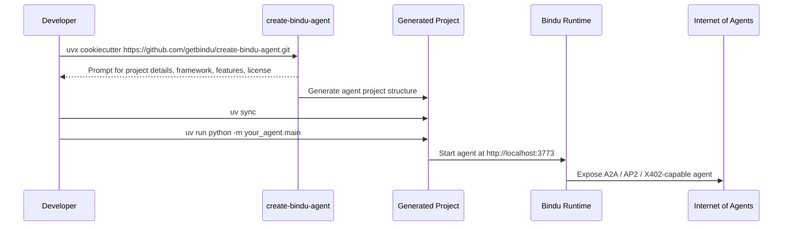

---
title: "Join the Internet of Agents"
description: "Get a production-ready Bindu agent running in minutes with the cookiecutter template or bindufy()"
---

Most developers do not get stuck on the agent logic. They get stuck on everything around it. Server setup, protocol handling, auth, identity, observability, deployment, CI, and the long trail of things that somehow become your job before the agent can go live.

## Why This Matters

The hard part is usually not writing the agent. The hard part is getting from "it works on my laptop" to "this thing can actually talk to other agents in production."

| Starting From Scratch | Starting With Bindu |
| --- | --- |
| You assemble the server, config, auth, and deployment stack yourself | The template gives you a production-ready starting point |
| Protocol support is another project | A2A, AP2, and X402 are already part of the setup |
| Identity, tracing, and testing come later | DID, observability, and pytest are included from the start |
| Existing agents need custom infrastructure glue | `bindufy()` wraps what you already built |
| First usable version can take weeks | First usable version takes minutes |

That is the point of this page: getting onto the Internet of Agents should not mean spending three weeks rebuilding plumbing.

<Note>
In the next 2 minutes, you can have a production-ready agent. Not a demo. Not a prototype. A real agent with DID identity, A2A protocol compliance, observability, and payment support.
</Note>

## How To Get Started Fast

There are two practical paths. Use the cookiecutter template if you want the fastest clean start. Use `bindufy()` if you already have an agent and want to put it on Bindu without rewriting it.

### The Fast Way: Cookiecutter Style

Time to first agent: **~2 minutes**

This is the fastest way to get started.

Navigate to the directory where you want to create your agent project and run:

```bash
uvx cookiecutter https://github.com/getbindu/create-bindu-agent.git
```

<CardGroup cols={3}>
  <Card title="Fast Setup" icon="rocket">
    Start from a working project scaffold instead of wiring the basics by hand.
  </Card>
  <Card title="Protocol-Ready" icon="globe">
    The generated project is ready for A2A, AP2, and X402-aware agent workflows.
  </Card>
  <Card title="Production Baseline" icon="server">
    Testing, CI/CD, docs, and deployment scaffolding are already in place.
  </Card>
</CardGroup>

### The Lifecycle: Generate, Run, Join



<Steps>
  <Step title="Generate The Project">
    Run the cookiecutter command and answer the setup prompts for project details, agent framework, features, and license type.

    <CodeGroup>
      ```bash Create Project
      uvx cookiecutter https://github.com/getbindu/create-bindu-agent.git
      ```

      ```bash Install uv
      curl -LsSf https://astral.sh/uv/install.sh | sh
      ```
    </CodeGroup>
  </Step>

  <Step title="Install And Start">
    Move into the generated project, install dependencies with `uv`, and start the agent.

    ```bash
    cd your-agent
    uv sync
    uv run python -m your_agent.main
    ```
  </Step>

  <Step title="Join The Network">
    Your agent is now live at `http://localhost:3773`. It is speaking A2A, AP2, and X402, and other agents can discover it, talk to it, and pay it for services.
  </Step>
</Steps>

---

## Already Built Something?

You've got an agent running. Maybe it's in LangChain. Maybe CrewAI. Maybe custom code.

It does not matter. You can Bindu-fy it in **5 minutes**.

Two things you need: a config file and the `bindufy` wrapper. That's it.

### Step 1: Create `agent_config.json`

```json
{
  "author": "your.email@example.com",
  "name": "my_existing_agent",
  "description": "My agent with Bindu superpowers",
  "version": "1.0.0",
  "deployment": {
    "url": "http://localhost:3773",
    "expose": true
  }
}
```

<Note>
See the [Configuration Reference](/bindu/create-bindu-agent/configuration) for all available options including A2A, AP2, and X402 protocol settings.
</Note>

### Step 2: Wrap Your Agent With `bindufy`

```python
from bindu.penguin.bindufy import bindufy
from agno.agent import Agent
from agno.models.openai import OpenAIChat
import json

# Load your config
with open("agent_config.json", "r") as f:
    config = json.load(f)

# Your existing agent
my_agent = Agent(
    instructions="Your agent instructions",
    model=OpenAIChat(id="gpt-4o"),
)

# Handler function
def agent_handler(messages: list[dict[str, str]]):
    result = my_agent.run(input=messages)
    return result

# Bindufy it!
bindufy(config, agent_handler)
```

**Done.**

Your agent is now live. Ready to communicate with other agents in the Internet of Agents.

No infrastructure setup.  
No protocol implementation.  
No weeks of DevOps work.

<Note>
Check out [examples](https://github.com/getbindu/Bindu/tree/main/examples) for different agent frameworks like LangChain, CrewAI, and more.
</Note>

## What Happens During Setup?

When you run the cookiecutter command, you'll be prompted for:

- **Project details** - Name, description, author info
- **Agent framework** - Agno, LangChain, CrewAI, etc.
- **Features** - Authentication, DID, observability, CI/CD
- **License type** - MIT, Apache, BSD, GPL, ISC

Then your agent project is ready with:

```text
your-agent/
├── agent_config.json          # Agent configuration with A2A/AP2/X402 settings
├── your_agent/
│   ├── main.py               # Agent entry point (Bindu-fied!)
│   └── __init__.py
├── skills/                   # Template for adding agent skills
├── tests/                    # Pre-configured pytest tests
├── pyproject.toml            # Dependencies managed by uv
├── Dockerfile                # Ready for containerization
├── .github/workflows/        # CI/CD pipelines
└── README.md                 # Complete setup instructions
```

Each piece has a job:

- `agent_config.json` holds the agent configuration with A2A, AP2, and X402 settings
- `main.py` is the generated entry point where the agent is already Bindu-fied
- `skills/` gives you the starting structure for agent skills
- `tests/` comes pre-configured for pytest
- `pyproject.toml` keeps dependencies managed by `uv`
- `Dockerfile` makes containerization straightforward
- `.github/workflows/` sets up CI/CD pipelines
- `README.md` gives you the generated setup instructions

## What You Just Got

All of this comes out of the box. No extra setup phase. No separate infrastructure sprint.

<CardGroup cols={2}>
  <Card title="Protocol Support" icon="network-wired">
    Built-in A2A, AP2, and X402 protocol compliance.
  </Card>
  <Card title="Authentication" icon="lock">
    Secure authentication with Auth0 and DID support.
  </Card>
  <Card title="Observability" icon="chart-line">
    Phoenix, Langfuse, and Jaeger integration.
  </Card>
  <Card title="CI/CD" icon="code-branch">
    GitHub Actions workflows for testing and deployment.
  </Card>
  <Card title="Testing" icon="flask">
    Pre-configured pytest with coverage reporting.
  </Card>
  <Card title="Documentation" icon="book">
    MkDocs setup for beautiful documentation.
  </Card>
  <Card title="Containerization" icon="docker">
    Docker/Podman ready for easy deployment.
  </Card>
  <Card title="Code Quality" icon="check-circle">
    Ruff, ty, and pre-commit hooks configured.
  </Card>
</CardGroup>

## Learn More

<AccordionGroup>
  <Accordion title="Configuration Reference">
    Complete guide to all configuration options.

    Path: [Configuration Reference](/bindu/create-bindu-agent/configuration)
  </Accordion>

  <Accordion title="Template Overview">
    Learn more about create-bindu-agent.

    Path: [Template Overview](/bindu/create-bindu-agent/overview)
  </Accordion>

  <Accordion title="Key Concepts">
    Understand Bindu's core concepts.

    Path: [Key Concepts](/bindu/introduction/key-concepts)
  </Accordion>

  <Accordion title="Authentication">
    Configure authentication for your agent.

    Path: [Authentication](/bindu/learn/authentication)
  </Accordion>

  <Accordion title="DID Setup">
    Set up Decentralized Identifiers.

    Path: [DID Setup](/bindu/learn/did)
  </Accordion>

  <Accordion title="Observability">
    Monitor your agent with Phoenix or Langfuse.

    Path: [Observability](/bindu/learn/observability)
  </Accordion>
</AccordionGroup>

## When Things Go Wrong

Most of the time the template path is smooth. When it is not, the failures are usually familiar ones.

<CardGroup cols={2}>
  <Card title="uv Not Found" icon="terminal">
    Install `uv` first with `curl -LsSf https://astral.sh/uv/install.sh | sh`, then restart your terminal and try again.
  </Card>
  <Card title="Port Already In Use" icon="plug">
    Something is already running on port `3773`. Change the `deployment_port` in `agent_config.json` to something else, or stop the process using that port.
  </Card>
  
  {/* Changed to 'lock' for a universally understood authentication symbol */}
  <Card title="Authentication Errors" icon="lock">
    You probably have not set up Auth0 credentials yet. Check the generated README for environment variables, or disable auth in your config while testing.
  </Card>
  
  {/* Changed to 'boxes-stacked' to represent package dependencies */}
  <Card title="Dependencies Not Installing" icon="boxes-stacked">
    Sometimes the virtual environment gets corrupted. Remove it, run `uv sync` again, and retry.
  </Card>
</CardGroup>

---

## Related

- https://github.com/getbindu/Bindu/tree/main/examples

---

<span className="brand-quote">
  

  <span className="brand-quote-text">
    Bindu helps you get from{" "}
    <span className="brand-quote-highlight">
      agent idea to live agent
    </span>
    , without spending the next three weeks buried in infrastructure.
  </span>
</span>

