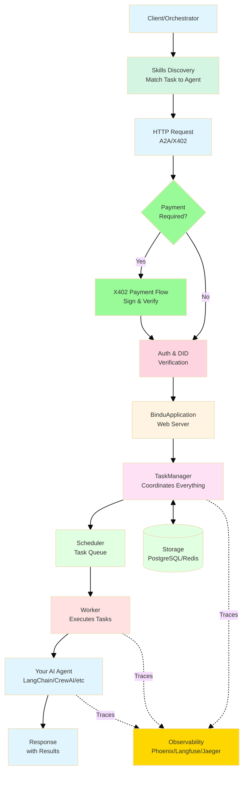
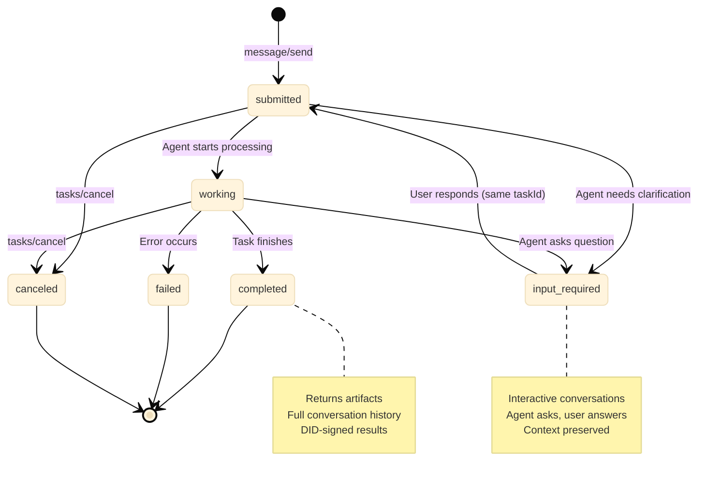

Transform any agent into a production-ready server that speaks universal protocols.



**How It Works**

1. **Discovery**: Client finds agents via `/agent/skills` endpoint
2. **Submit Task**: Send message via `message/send` → Task enters **"submitted"** state
3. **Payment** (optional): X402 verifies payment if required
4. **Authentication**: Auth0 + DID verify identity
5. **Processing**: Task moves to **"working"** state, agent executes
6. **Interactive Loop**: If agent needs input, task enters **"input-required"** state
7. **Completion**: Task reaches **"completed"** state with artifacts
8. **Observability**: Full trace captured via Phoenix/Langfuse/Jaeger

### Task Lifecycle & States

Bindu uses a **task-first pattern** where every interaction is a trackable, resumable task with persistent state:



**Core States:**

| State | Description | Can Cancel? | Next Actions |
|-------|-------------|-------------|--------------|
| **`submitted`** | Task received, queued for processing | ✅ Yes | Wait or poll with `tasks/get` |
| **`working`** | Agent actively processing | ✅ Yes | Wait for completion or input request |
| **`input-required`** | Agent needs user input to continue | ✅ Yes | Send follow-up message with same `taskId` |
| **`completed`** | Task finished successfully | ❌ No | Retrieve artifacts, submit feedback |
| **`failed`** | Task encountered an error | ❌ No | Check error details, retry if needed |
| **`canceled`** | Task was canceled by user | ❌ No | Create new task if needed |

**Key Features:**

- **Resumable Conversations**: Tasks can pause for user input and resume seamlessly
- **Context Preservation**: Full conversation history maintained across all states
- **Reference Previous Tasks**: Use `referenceTaskIds` to build on prior results
- **Async by Default**: Submit task, get immediate response, poll for completion
- **Artifact Storage**: Final results stored with DID signatures for verification

**Example Flow:**

```python
# 1. Submit task
response = await agent.send_message("create sunset caption")
# State: "submitted" → "input-required"
# Agent asks: "Which platform? Instagram, Pinterest, or General?"

# 2. Check status
task = await agent.get_task(task_id)
# State: "input-required"
# History shows agent's question

# 3. Respond to agent (same taskId, new messageId)
response = await agent.send_message("Instagram", task_id=task_id)
# State: "submitted" → "working" → "completed"

# 4. Get final result
task = await agent.get_task(task_id)
# State: "completed"
# Artifacts: ["Chasing sunsets and dreams. 🌅 #SunsetLovers"]

# 5. Build on previous result (new task, reference old one)
response = await agent.send_message(
    "make it shorter",
    reference_task_ids=[task_id]
)
# Agent accesses previous caption and shortens it
# Result: "Sunset vibes. 🌅 #GoldenHour"
```

<Tip>
**Why This Matters**: Unlike stateless APIs, Bindu preserves the entire conversation context. Agents can ask clarifying questions, users can provide additional input, and subsequent tasks can reference previous results—enabling true multi-turn agent interactions.
</Tip>

### Protocol-Native Architecture

- **Universal Protocol Support**: Native [A2A](https://github.com/a2aproject/A2A), [AP2](https://github.com/google-agentic-commerce/AP2), and [X402](https://github.com/coinbase/x402) compliance out of the box.

- **Framework Agnostic**: Works with [Agno](https://github.com/agno-agi/agno), [LangChain](https://github.com/langchain-ai/langchain), [CrewAI](https://github.com/crewAIInc/crewAI), [LlamaIndex](https://developers.llamaindex.ai/python/framework/use_cases/agents/), [FastAgent](https://github.com/evalstate/fast-agent), and any Python-based framework.

- **DID Authentication**: Built-in Decentralized Identity for secure agent-to-agent communication. Influenced by [AT Protocol DID structure](https://atproto.com/specs/did).

- **Type Safe**: Enforce structured I/O through schema validation for predictable behavior.

### Infrastructure & Deployment

- **Simple Server Setup**: Turn your AI agent into [a web server using Starlette (a Python web framework)](https://github.com/getbindu/Bindu/blob/main/bindu/server/applications.py). The `BinduApplication` class handles all the complex setup. You just provide your agent and it creates a fully functional server ready to receive requests.

- **Built-In Reliability**: Comes with automatic error handling, task retry mechanisms, health checks, and backup systems. If something fails, [Bindu knows how to recover gracefully without crashing your agent](https://github.com/getbindu/Bindu/blob/main/bindu/server/task_manager.py).

- **Run Anywhere**: Start on your local machine (localhost) and deploy to any cloud platform when ready. [Works with Docker and Podman containers](https://github.com/getbindu/create-bindu-agent/blob/main/%7B%7Bcookiecutter.project_name%7D%7D/docker-compose.yml), making it easy to package and ship your agent to production environments.

### Observability & Monitoring

- **Built-in Tracing**: Native integration with Phoenix, Langfuse, and Jaeger for complete visibility.

- **Real-time Monitoring**: Track agent health, performance metrics, and execution flows.

- **Error Tracking**: Comprehensive error handling and logging for distributed systems.

### Storage & Orchestration

- **Flexible Storage**: Choose between in-memory, PostgreSQL, or Redis for context and history.

- **Distributed Scheduling**: Redis-based scheduler for coordinating tasks across agent instances.

- **Intelligent Routing**: Analyze tasks and route to agents based on capabilities and availability.

- **Execution Modes**: Sequential, parallel, or collaborative patterns for complex workflows.

### Payment & Commerce

- **X402 Payment Rails**: Native support for agent-to-agent payments and micropayments.

- **AP2 Commerce Protocol**: Enable agents to participate in agentic commerce ecosystems.

### Security & Privacy

- **Multi-Provider Auth**: Support for AuthKit, GitHub, AWS Cognito, Google, and Azure.

- **Private by Default**: Runs in your infrastructure—no external data sharing or vendor lock-in.

### Developer Experience

- **2-Minute Setup**: Production-ready agent with `create-bindu-agent` cookiecutter template.

- **Best Practices Built-in**: Pre-configured with ruff, ty, pytest, and pre-commit hooks.

- **113+ Built-in Toolkits**: Access thousands of tools across data, code, web, and enterprise APIs.

- **MCP Integration**: First-class Model Context Protocol support to connect agents with external systems.

<Card title="Start Building" icon="code" href="/bindu/introduction/create-agent">
  Create your first Bindu agent →
</Card>
