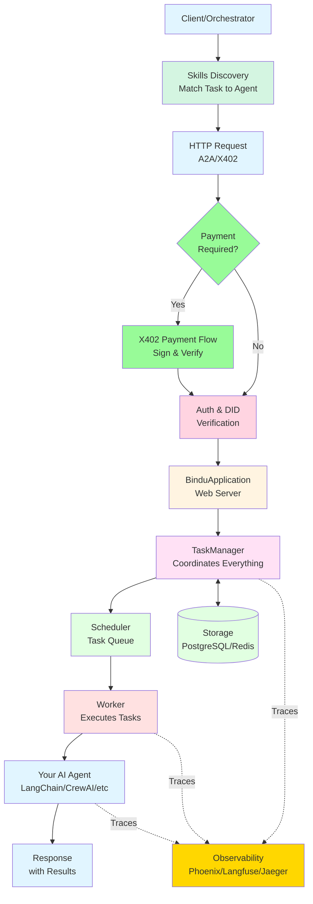

Transform any agent into a production-ready server that speaks universal protocols.

**How It Works**

1. **Skills Discovery**: Find the right agent using `/agent/skills` API (YAML metadata)
2. **HTTP Request**: Send task via A2A or X402 protocol
3. **Payment Flow**: If required, X402 handles payment signing and verification
4. **Auth & DID**: Verify identity and permissions (Auth0 + DID)
5. **Web Server**: BinduApplication receives and routes the request
6. **TaskManager**: Coordinates the entire operation (restaurant manager)
7. **Scheduler**: Queues tasks for execution
8. **Worker**: Executes your AI agent (LangChain, CrewAI, etc.)
9. **Response**: Returns results with completion status
10. **Observability**: Traces everything via Phoenix/Langfuse/Jaeger (dotted lines)
11. **Storage**: PostgreSQL or Redis for persistence

### Protocol-Native Architecture

- **Universal Protocol Support**: Native [A2A](https://github.com/a2aproject/A2A), [AP2](https://github.com/google-agentic-commerce/AP2), and [X402](https://github.com/coinbase/x402) compliance out of the box.

- **Framework Agnostic**: Works with [Agno](https://github.com/agno-agi/agno), [LangChain](https://github.com/langchain-ai/langchain), [CrewAI](https://github.com/crewAIInc/crewAI), [LlamaIndex](https://developers.llamaindex.ai/python/framework/use_cases/agents/), [FastAgent](https://github.com/evalstate/fast-agent), and any Python-based framework.

- **DID Authentication**: Built-in Decentralized Identity for secure agent-to-agent communication. Influenced by [AT Protocol DID structure](https://atproto.com/specs/did).

- **Type Safe**: Enforce structured I/O through schema validation for predictable behavior.

### Infrastructure & Deployment

- **Simple Server Setup**: Turn your AI agent into [a web server using Starlette (a Python web framework)](https://github.com/Saptha-me/Bindu/blob/main/bindu/server/applications.py). The `BinduApplication` class handles all the complex setup.You just provide your agent and it creates a fully functional server ready to receive requests.

- **Built-In Reliability**: Comes with automatic error handling, task retry mechanisms, health checks, and backup systems. If something fails, [Bindu knows how to recover gracefully without crashing your agent](https://github.com/Saptha-me/Bindu/blob/main/bindu/server/task_manager.py).

- **Run Anywhere**: Start on your local machine (localhost) and deploy to any cloud platform when ready. [Works with Docker and Podman containers](https://github.com/Saptha-me/create-bindu-agent/blob/main/%7B%7Bcookiecutter.project_name%7D%7D/docker-compose.yml), making it easy to package and ship your agent to production environments.

### Observability & Monitoring

- **Built-in Tracing**: Native integration with Phoenix, Langfuse, and Jaeger for complete visibility.

- **Real-time Monitoring**: Track agent health, performance metrics, and execution flows.

- **Error Tracking**: Comprehensive error handling and logging for distributed systems.

### Storage & Orchestration

- **Flexible Storage**: Choose between in-memory, PostgreSQL, or Redis for context and history.

- **Distributed Scheduling**: Redis-based scheduler for coordinating tasks across agent instances.

- **Intelligent Routing**: Analyze tasks and route to agents based on capabilities and availability.

- **Execution Modes**: Sequential, parallel, or collaborative patterns for complex workflows.

### Payment & Commerce

- **X402 Payment Rails**: Native support for agent-to-agent payments and micropayments.

- **AP2 Commerce Protocol**: Enable agents to participate in agentic commerce ecosystems.

### Security & Privacy

- **Multi-Provider Auth**: Support for AuthKit, GitHub, AWS Cognito, Google, and Azure.

- **Private by Default**: Runs in your infrastructure—no external data sharing or vendor lock-in.

### Developer Experience

- **2-Minute Setup**: Production-ready agent with `create-bindu-agent` cookiecutter template.

- **Best Practices Built-in**: Pre-configured with ruff, ty, pytest, and pre-commit hooks.

- **113+ Built-in Toolkits**: Access thousands of tools across data, code, web, and enterprise APIs.

- **MCP Integration**: First-class Model Context Protocol support to connect agents with external systems.

<Card title="Start Building" icon="code" href="/bindu/introduction/create-agent">
  Create your first Bindu agent →
</Card>
