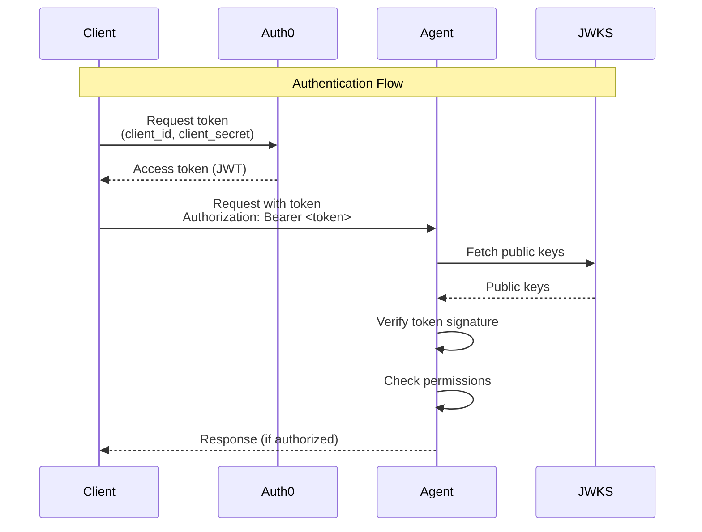

# Authentication Overview

Bindu supports Auth0 authentication to secure your AI agents with industry-standard OAuth 2.0 and JWT tokens, enabling fine-grained access control for your agent services.

## Why Authentication?

Authentication provides:

- **Security** - Protect your agents from unauthorized access
- **Audit Trail** - Track which service or user performed which action
- **Access Control** - Fine-grained permissions for different operations
- **Multi-tenancy** - Isolate different clients or organizations
- **Compliance** - Meet security and regulatory requirements

---

## Supported Authentication Methods

### Auth0 (Current)

Bindu currently supports Auth0 for authentication with:

- ✅ **Machine-to-Machine (M2M)** - Service-to-service authentication
- ✅ **JWT Validation** - Signature verification using JWKS
- ✅ **Permission-Based Access** - Fine-grained operation control
- ✅ **Token Caching** - Automatic refresh and caching
- ✅ **Public Endpoints** - Agent discovery remains accessible

### Coming Soon

Additional authentication providers on the [roadmap](/roadmap/authentication):

- 🔜 **GitHub OAuth** - Authenticate with GitHub accounts
- 🔜 **AWS Cognito** - Enterprise identity management
- 🔜 **Google OAuth** - Sign in with Google
- 🔜 **Azure AD (Microsoft Entra)** - Enterprise SSO

---

## How It Works



### Authentication Process

1. **Client requests token** from Auth0 with credentials
2. **Auth0 issues JWT** with permissions and metadata
3. **Client includes token** in Authorization header
4. **Agent validates token** using Auth0's public keys
5. **Agent checks permissions** against required scopes
6. **Request processed** if authorized

---

## Configuration

### Enable Authentication

Add authentication configuration to your agent:

```json
{
  "author": "your-email@example.com",
  "name": "Secure Agent",
  "auth": {
    "enabled": true,
    "domain": "your-tenant.auth0.com",
    "audience": "https://api.bindu.ai"
  }
}
```

### Configuration Options

| Field | Required | Description |
|-------|----------|-------------|
| `enabled` | Yes | Enable/disable authentication |
| `domain` | Yes* | Auth0 tenant domain |
| `audience` | Yes* | API identifier |
| `algorithms` | No | JWT algorithms (default: `["RS256"]`) |
| `issuer` | No | Token issuer (auto-generated) |
| `jwks_uri` | No | JWKS endpoint (auto-generated) |
| `require_permissions` | No | Enable permission checking |
| `permissions` | No | Permission mappings for methods |

*Required when `enabled: true`

---

## Public vs Protected Endpoints

### Public Endpoints (No Authentication)

These endpoints are always accessible:

- `/.well-known/agent.json` - Agent card (discovery)
- `/did/resolve` - DID resolution
- `/agent/info` - Agent information
- `/health` - Health check

### Protected Endpoints (Authentication Required)

These require valid JWT token:

- `POST /` - All JSON-RPC methods:
  - `message/send` - Send messages to agent
  - `tasks/get` - Get task details
  - `tasks/cancel` - Cancel running tasks
  - `tasks/list` - List all tasks
  - `contexts/list` - List conversation contexts
  - `tasks/feedback` - Provide task feedback

---

## Permission-Based Access Control

### Enable Permissions

Configure fine-grained access control:

```json
{
  "auth": {
    "enabled": true,
    "require_permissions": true,
    "permissions": {
      "message/send": ["agent:write"],
      "tasks/get": ["agent:read"],
      "tasks/cancel": ["agent:admin"],
      "tasks/list": ["agent:read"],
      "contexts/list": ["agent:read"],
      "tasks/feedback": ["agent:write"]
    }
  }
}
```

### Permission Scopes

Define permissions in Auth0 API:

- `agent:read` - Read tasks, contexts, agent info
- `agent:write` - Send messages, create tasks, provide feedback
- `agent:admin` - Cancel tasks, clear contexts, admin operations

### How It Works

1. Define permissions in Auth0 API settings
2. Grant permissions to M2M applications
3. Auth0 includes permissions in JWT token
4. Agent validates token has required permissions
5. Request allowed/denied based on permissions

---

## Error Codes

| Code | Message | Description |
|------|---------|-------------|
| `-32001` | Authentication required | No Authorization header provided |
| `-32002` | Invalid token | Signature verification failed |
| `-32003` | Insufficient permissions | Token lacks required permissions |
| `-32004` | Token has expired | Token exp claim has passed |

### Error Response Example

```json
{
  "jsonrpc": "2.0",
  "error": {
    "code": -32001,
    "message": "Authentication required",
    "data": {
      "details": "No Authorization header provided"
    }
  },
  "id": "1"
}
```

---

## Security Best Practices

<Warning>
  **Never expose client secrets in code or version control.** Always use environment variables or secure secret management.
</Warning>

### Recommended Practices

1. ✅ **Store credentials securely** - Use environment variables
2. ✅ **Use HTTPS in production** - Encrypt all traffic
3. ✅ **Rotate secrets regularly** - Update client secrets periodically
4. ✅ **Grant minimum permissions** - Principle of least privilege
5. ✅ **Monitor Auth0 logs** - Track suspicious activity
6. ✅ **Cache tokens** - Reduce Auth0 API calls
7. ✅ **Separate environments** - Use different tenants for dev/staging/prod
8. ✅ **Validate audience** - Ensure tokens are for your API
9. ✅ **Check token expiration** - Implement automatic refresh
10. ✅ **Use short-lived tokens** - Reduce exposure window

---

## Quick Start

<Steps>
  <Step title="Create Auth0 Account">
    Sign up at [auth0.com](https://auth0.com) and create a tenant.
  </Step>

  <Step title="Configure API">
    Create an API with identifier `https://api.bindu.ai` and define permissions.
  </Step>

  <Step title="Create M2M Application">
    Create a Machine-to-Machine application and authorize it for your API.
  </Step>

  <Step title="Enable in Agent">
    Add auth configuration to your agent config with Auth0 credentials.
  </Step>

  <Step title="Test Authentication">
    Use the provided client examples to test authenticated requests.
  </Step>
</Steps>

---

## Client Examples

### Python

```python
from bindu.client import BinduM2MClient

client = BinduM2MClient(
    auth0_domain="your-tenant.auth0.com",
    client_id="your_client_id",
    client_secret="your_client_secret",
    audience="https://api.bindu.ai",
    agent_url="http://localhost:3773"
)

# Automatically handles token management
result = client.send_message("Hello, secure agent!")
```

### JavaScript/TypeScript

```typescript
import { BinduM2MClient } from '@bindu/client';

const client = new BinduM2MClient({
  auth0Domain: 'your-tenant.auth0.com',
  clientId: process.env.AUTH0_CLIENT_ID,
  clientSecret: process.env.AUTH0_CLIENT_SECRET,
  audience: 'https://api.bindu.ai',
  agentUrl: 'http://localhost:3773'
});

// Automatically handles token management
const result = await client.sendMessage('Hello, secure agent!');
```

---

## Troubleshooting

<AccordionGroup>
  <Accordion title="Authentication required error">
    **Cause:** No Authorization header provided.
    
    **Solution:** Include `Authorization: Bearer <token>` header in all requests to protected endpoints.
  </Accordion>

  <Accordion title="Invalid token signature">
    **Cause:** Token signature verification failed.
    
    **Solution:** Verify `domain` and `audience` in agent config match Auth0 settings. Ensure token is not expired.
  </Accordion>

  <Accordion title="Insufficient permissions">
    **Cause:** Token lacks required permissions.
    
    **Solution:** Grant required permissions to M2M application in Auth0 dashboard.
  </Accordion>

  <Accordion title="Token expired">
    **Cause:** JWT exp claim has passed.
    
    **Solution:** Implement automatic token refresh in your client. Tokens typically expire after 24 hours.
  </Accordion>
</AccordionGroup>

---

## Next Steps

<CardGroup cols={2}>
  <Card title="Auth0 Setup Guide" icon="lock" href="/bindu/learn/authentication/auth0">
    Complete step-by-step Auth0 configuration
  </Card>
  <Card title="Azure AD Setup" icon="microsoft" href="/bindu/learn/authentication/azure">
    Configure Azure AD authentication
  </Card>
  <Card title="Roadmap" icon="map" href="/roadmap/authentication">
    See upcoming authentication features
  </Card>
  <Card title="GitHub" icon="github" href="https://github.com/Saptha-me/Bindu">
    View code examples and contribute
  </Card>
</CardGroup>

---

## Resources

- **[Auth0 Documentation](https://auth0.com/docs)** - Official Auth0 guides
- **[JWT.io](https://jwt.io)** - Debug and decode JWT tokens
- **[OAuth 2.0 Spec](https://oauth.net/2/)** - OAuth 2.0 specification
- **[GitHub Examples](https://github.com/Saptha-me/Bindu/tree/main/examples)** - Client implementation examples
