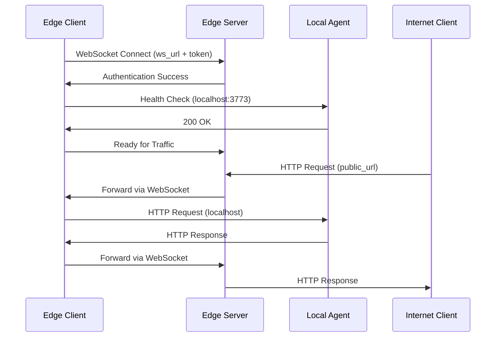

# Bindu Edge Client

The Bindu Edge Client enables you to make your locally running agent accessible on the internet **without deploying** it to any cloud infrastructure. It creates a secure tunnel from your local machine to the internet using WebSocket connections, giving your development agent a publicly accessible URL.

<Info>
**Perfect for Development** - Test your agent in a production-like environment without the complexity of deployment, containerization, or cloud infrastructure setup.
</Info>

---

## Why Use Bindu Edge?

### 1. Zero-Deployment Development

Focus on building, not deploying:
- **Instant public access**: Get a public URL for your local agent in seconds
- **No Docker required**: Skip containerization during development
- **No cloud setup**: Avoid complex cloud deployments while iterating
- **Keep working locally**: Use your familiar development environment and tools
- **Live reload**: Changes to your local code are immediately accessible via the public URL

### 2. Rapid Testing & Iteration

Speed up your development workflow:
- **Test webhooks locally**: Receive callbacks from external services directly to your local agent
- **Integration testing**: Test with third-party APIs that require public endpoints
- **Real-world scenarios**: Simulate production conditions without production deployment
- **Quick debugging**: Debug issues in a public-facing context while keeping full IDE access
- **Instant sharing**: Share your work-in-progress with team members or stakeholders

### 3. Secure Tunneling

Enterprise-grade security for development tunnels:
- **Token-based authentication**: Every tunnel requires a secure authentication token
- **Encrypted connections**: All traffic flows through secure WebSocket (WSS) connections
- **Request validation**: Only authorized requests are forwarded to your local agent
- **Private by default**: Tunnels are only accessible with the correct URL and token
- **Temporary access**: Create and destroy tunnels on-demand for specific testing sessions

### 4. A2A Protocol Compatible

Seamlessly integrate with the agent-to-agent ecosystem:
- **DID support**: Your local agent maintains its Decentralized Identity
- **Protocol compliance**: Full A2A protocol support through the tunnel
- **Message routing**: Receive tasks and messages from other agents on the internet
- **Discovery**: Make your local agent discoverable in the Bindu Directory
- **Agent networking**: Test multi-agent interactions without deploying all agents

### 5. Perfect for Demos

Showcase your agent to clients and stakeholders:
- **No deployment wait**: Present your latest changes without CI/CD delays
- **Live demonstrations**: Run demos directly from your development machine
- **Quick iterations**: Make changes based on feedback and show results immediately
- **Cost-effective**: Avoid spinning up cloud resources for every demo
- **Full control**: Keep complete control over your demo environment

---

## Use Cases

### 🧪 Development & Testing

**Local Development with Public Endpoints**
```python
# Your agent runs on localhost:3773
# But is accessible via https://your-agent.bindus.directory
```

- Develop and test webhooks without ngrok or similar tools
- Test OAuth callbacks that require public redirect URLs
- Validate API integrations that need to reach your agent
- Debug in real-time with full IDE support

### 🤝 Team Collaboration

**Share Your Work-in-Progress**

- Let team members interact with your local agent
- Gather feedback without pushing to staging
- Collaborate on features before committing code
- Test integrations with other team members' agents

### 🎯 Client Demonstrations

**Show, Don't Tell**

- Demo new features directly from your development environment
- Make real-time adjustments during presentations
- Showcase work-in-progress without formal deployments
- Get immediate client feedback and iterate quickly

### 🔗 Webhook Development

**Test Inbound Webhooks Locally**

Common scenarios:
- Payment provider webhooks (Stripe, PayPal)
- Communication platform callbacks (Slack, Discord)
- External service notifications (GitHub, Jira)
- Third-party API events

### 🌐 Multi-Agent Testing

**Test Agent-to-Agent Communication**

- Run one agent locally while others are in production
- Test new agent interactions without deploying everything
- Debug communication issues in a hybrid environment
- Validate protocol changes before deployment

---

## Quick Start Guide

### Prerequisites

Before starting, ensure you have:
- A Bindu agent running locally
- Access to [bindus.directory](https://bindus.directory)
- Python environment with Bindu installed

### Step 1: Create a Tunnel

Visit [bindus.directory](https://bindus.directory) and set up your tunnel:

<Steps>
  <Step title="Log in to your account">
    Navigate to bindus.directory and authenticate with your credentials.
  </Step>
  
  <Step title="Navigate to tunnels section">
    Find the "Tunnels" or "Edge" section in your dashboard.
  </Step>
  
  <Step title="Create a new tunnel">
    Click "Create Tunnel" and configure your tunnel settings.
  </Step>
</Steps>

After creation, you'll receive three critical pieces of information:

- **`ws_url`**: WebSocket URL for the tunnel connection (e.g., `wss://tunnel.bindus.directory/ws`)
- **`token`**: Authentication token for secure access (e.g., `bnd_tk_abc123...`)
- **`public_url`**: Your agent's public internet URL (e.g., `https://agent-abc.bindus.directory`)

<Warning>
Keep your `token` secure! It grants access to forward traffic to your local machine. Never commit it to version control.
</Warning>

### Step 2: Configure Your Local Agent

Create an `edge.config.json` file in your project directory:

```json edge.config.json
{
  "ws_url": "wss://tunnel.bindus.directory/ws/your-tunnel-id",
  "token": "bnd_tk_your_secret_token_here",
  "local_port": 3773
}
```

**Configuration Options:**

| Field | Description | Default | Required |
|-------|-------------|---------|----------|
| `ws_url` | WebSocket URL provided by bindus.directory | - | ✅ Yes |
| `token` | Authentication token for your tunnel | - | ✅ Yes |
| `local_port` | Port where your local agent is running | `3773` | ❌ No |

<Tip>
The `local_port` defaults to `3773` (Bindu's default port). Only change this if your agent runs on a different port.
</Tip>

### Step 3: Start Your Local Agent

Ensure your Bindu agent is running on the configured port:

```bash
# Standard Bindu agent startup
uv run python -m your_agent

# Or with uvicorn directly
uvicorn your_agent.main:app --host 0.0.0.0 --port 3773
```

Verify your agent is accessible locally:
```bash
curl http://localhost:3773/health
```

### Step 4: Start the Edge Client

With your agent running, start the edge client in a new terminal:

```bash
uv run python -m bindu.edge_client
```

You should see output confirming the connection:
```
🌐 Bindu Edge Client Starting...
✓ Connected to tunnel: wss://tunnel.bindus.directory/ws/your-tunnel-id
✓ Authentication successful
✓ Local agent detected on port 3773
✅ Your agent is now live at: https://agent-abc.bindus.directory

Press Ctrl+C to stop the tunnel
```

### Step 5: Test the Connection

Your agent is now publicly accessible! Test it:

```bash
# From anywhere on the internet
curl https://agent-abc.bindus.directory/health
```

Or send an A2A protocol message:

```bash
curl -X POST https://agent-abc.bindus.directory/a2a/task/create \
  -H "Content-Type: application/json" \
  -d '{
    "task_id": "test-task-001",
    "input": {
      "action": "greet",
      "message": "Hello from the internet!"
    }
  }'
```

<Success>
**That's it!** 🎉 Your local agent is now accessible on the internet at your `public_url`.
</Success>

---

## Advanced Configuration

### Environment Variables

Instead of using `edge.config.json`, you can set environment variables:

```bash
export BINDU_EDGE_WS_URL="wss://tunnel.bindus.directory/ws/your-tunnel-id"
export BINDU_EDGE_TOKEN="bnd_tk_your_secret_token"
export BINDU_EDGE_LOCAL_PORT="3773"

uv run python -m bindu.edge_client
```

### Custom Port Configuration

If your agent runs on a non-standard port:

```json edge.config.json
{
  "ws_url": "wss://tunnel.bindus.directory/ws/your-tunnel-id",
  "token": "bnd_tk_your_secret_token",
  "local_port": 8080  // Custom port
}
```

### Multiple Agents

Run multiple agents with separate tunnels:

**Terminal 1 - Agent A on port 3773:**
```bash
# edge-agent-a.config.json
{
  "ws_url": "wss://tunnel.bindus.directory/ws/tunnel-a",
  "token": "bnd_tk_token_a",
  "local_port": 3773
}

uv run python -m bindu.edge_client --config edge-agent-a.config.json
```

**Terminal 2 - Agent B on port 3774:**
```bash
# edge-agent-b.config.json
{
  "ws_url": "wss://tunnel.bindus.directory/ws/tunnel-b",
  "token": "bnd_tk_token_b",
  "local_port": 3774
}

uv run python -m bindu.edge_client --config edge-agent-b.config.json
```

### Programmatic Usage

Integrate Edge Client into your code:

```python
from bindu.edge_client import EdgeClient
import asyncio

async def main():
    client = EdgeClient(
        ws_url="wss://tunnel.bindus.directory/ws/your-tunnel-id",
        token="bnd_tk_your_secret_token",
        local_port=3773
    )
    
    await client.connect()
    print(f"✅ Agent accessible at: {client.public_url}")
    
    # Keep running
    try:
        await client.run_forever()
    except KeyboardInterrupt:
        await client.disconnect()
        print("👋 Tunnel closed")

if __name__ == "__main__":
    asyncio.run(main())
```

---

## How It Works

### Architecture Overview

```
Internet Request → Bindu Edge Server → WebSocket Tunnel → Local Agent
                  (bindus.directory)                      (localhost:3773)
```

**Request Flow:**

1. **Incoming Request**: External client sends request to `https://agent-abc.bindus.directory`
2. **Edge Server**: Bindu Edge server receives and validates the request
3. **Authentication**: Server verifies the request against tunnel configuration
4. **WebSocket Forward**: Request is forwarded through the WebSocket tunnel
5. **Local Processing**: Edge client receives request and forwards to `localhost:3773`
6. **Agent Response**: Your local agent processes and returns response
7. **Return Path**: Response flows back through tunnel to Edge server
8. **Client Response**: Original client receives response from your local agent

### Connection Lifecycle



### Security Model

**Multi-Layer Security:**

1. **Token Authentication**: Every tunnel requires a unique token
2. **WSS Encryption**: WebSocket connections use TLS encryption
3. **Request Validation**: Edge server validates all incoming requests
4. **Local Firewall**: Your local machine's firewall remains intact
5. **No Port Forwarding**: No need to open ports or configure routers

---

## Troubleshooting

### Connection Issues

**Problem: "Cannot connect to tunnel"**

```bash
❌ Error: Failed to connect to wss://tunnel.bindus.directory/ws/tunnel-id
```

**Solutions:**
1. Verify your `ws_url` is correct and includes the tunnel ID
2. Check your internet connection
3. Ensure the tunnel still exists at bindus.directory
4. Verify no firewall is blocking WebSocket connections

### Authentication Failures

**Problem: "Authentication failed"**

```bash
❌ Error: Token authentication failed
```

**Solutions:**
1. Double-check your `token` value in `edge.config.json`
2. Ensure the token hasn't expired (check bindus.directory dashboard)
3. Verify you haven't regenerated the token since creating the config
4. Check for extra spaces or quotes in the token string

### Local Agent Not Found

**Problem: "Cannot reach local agent"**

```bash
❌ Error: Connection refused to localhost:3773
```

**Solutions:**
1. Ensure your Bindu agent is actually running
2. Verify it's listening on the correct port (`local_port` in config)
3. Check if another process is using the port: `lsof -i :3773`
4. Try accessing `http://localhost:3773/health` directly

### Request Timeout

**Problem: Requests timeout through the tunnel**

**Solutions:**
1. Check if your local agent is responding slowly
2. Increase timeout settings in your agent configuration
3. Verify your internet connection stability
4. Check Edge client logs for error messages

### Port Already in Use

**Problem: Edge client can't bind**

```bash
❌ Error: Address already in use
```

**Solutions:**
1. Another Edge client might already be running
2. Kill existing process: `pkill -f bindu.edge_client`
3. Find and stop the conflicting process: `lsof -i :3773`

---

## Best Practices

### Development Workflow

1. **Start with local testing** before enabling the tunnel
2. **Use tunnels temporarily** - close them when not needed
3. **Rotate tokens regularly** for security
4. **Monitor logs** from both agent and edge client
5. **Test locally first** before exposing via tunnel

### Security Guidelines

<Warning>
**Never share your tunnel token publicly.** It grants direct access to your local machine.
</Warning>

- ✅ **DO**: Store tokens in `edge.config.json` (add to `.gitignore`)
- ✅ **DO**: Use environment variables in shared environments
- ✅ **DO**: Rotate tokens after demos or testing sessions
- ✅ **DO**: Delete unused tunnels from bindus.directory
- ❌ **DON'T**: Commit `edge.config.json` to version control
- ❌ **DON'T**: Share tunnel URLs without authentication
- ❌ **DON'T**: Leave tunnels running when not in use
- ❌ **DON'T**: Use production credentials in tunneled agents

### Performance Tips

- **Close idle tunnels**: Each tunnel consumes resources
- **Use local testing first**: Only tunnel when you need public access
- **Monitor bandwidth**: Large file transfers may be slow
- **Check latency**: Tunnel adds ~50-200ms latency depending on location
- **Limit concurrent requests**: Local machine may not handle production load

### Git Configuration

Add to your `.gitignore`:

```gitignore
# Bindu Edge Client
edge.config.json
*.edge.config.json
.bindu-edge/
```

---

## Comparison with Alternatives

| Feature | Bindu Edge | ngrok | localtunnel | SSH Tunnel |
|---------|------------|-------|-------------|------------|
| A2A Protocol Support | ✅ Native | ❌ No | ❌ No | ❌ No |
| Setup Complexity | ⭐ Simple | ⭐⭐ Medium | ⭐ Simple | ⭐⭐⭐ Complex |
| Authentication | ✅ Token | ✅ API Key | ❌ Public | 🔑 SSH Keys |
| DID Integration | ✅ Yes | ❌ No | ❌ No | ❌ No |
| Free Tier | ✅ Yes | ✅ Limited | ✅ Yes | ✅ Yes |
| Bindu Directory | ✅ Integrated | ❌ No | ❌ No | ❌ No |
| Custom Domains | ✅ Yes | 💰 Paid | ❌ No | ⚙️ Manual |
| WebSocket Support | ✅ Native | ✅ Yes | ✅ Yes | ✅ Yes |

---

## Limitations

### Current Limitations

- **Development Only**: Not recommended for production traffic
- **Single Machine**: One tunnel per local agent instance
- **Bandwidth**: Limited by your local internet connection
- **Latency**: Additional ~50-200ms compared to direct deployment
- **Uptime**: Depends on your local machine staying powered on
- **Scalability**: Cannot auto-scale like cloud deployments

### Not Suitable For

❌ **Production deployments** - Use proper cloud hosting instead  
❌ **High-traffic applications** - Local bandwidth limitations  
❌ **Mission-critical services** - No redundancy or failover  
❌ **24/7 availability** - Requires your machine to stay on  
❌ **Load balancing** - Single instance only

### When to Move to Production

Consider deploying to the cloud when you need:
- ✅ High availability and uptime guarantees
- ✅ Auto-scaling based on traffic
- ✅ Load balancing across multiple instances
- ✅ Professional monitoring and alerting
- ✅ Disaster recovery and backups
- ✅ SLA commitments to users

---

## FAQ

<AccordionGroup>
  <Accordion title="Is Bindu Edge free to use?">
    Yes! Bindu Edge is free for development and testing purposes. Check [bindus.directory](https://bindus.directory) for current pricing and limits.
  </Accordion>

  <Accordion title="Can I use Bindu Edge for production?">
    No, Bindu Edge is designed for development, testing, and demos only. For production deployments, use proper cloud hosting with Kubernetes, Docker, or serverless platforms.
  </Accordion>

  <Accordion title="How many tunnels can I create?">
    Limits depend on your bindus.directory account tier. Free tier typically allows 1-3 concurrent tunnels. Check your dashboard for specifics.
  </Accordion>

  <Accordion title="What happens if my internet disconnects?">
    The Edge client will automatically attempt to reconnect to the tunnel. If your local machine goes offline, the tunnel becomes inaccessible until reconnected.
  </Accordion>

  <Accordion title="Can I use a custom domain?">
    Yes! Premium plans on bindus.directory support custom domain mapping. Contact support for configuration details.
  </Accordion>

  <Accordion title="Is my data secure through the tunnel?">
    Yes. All connections use WSS (WebSocket Secure) with TLS encryption, and authentication tokens prevent unauthorized access. However, never send sensitive production data through development tunnels.
  </Accordion>

  <Accordion title="Can multiple people access my tunneled agent?">
    Yes, anyone with the `public_url` can access your agent. Use authentication at the agent level if you need access control.
  </Accordion>

  <Accordion title="Does Edge Client work with Docker?">
    Yes! Just ensure Docker port mapping matches your `local_port` configuration, and run the Edge client on the host machine or in a separate container with network access to your agent container.
  </Accordion>
</AccordionGroup>

---

## Next Steps

Now that you have Bindu Edge set up:

<CardGroup cols={2}>
  <Card title="Test Webhooks" icon="webhook" href="/bindu/learn/notification/overview">
    Configure webhook integrations that require public URLs
  </Card>
  
  <Card title="Multi-Agent Testing" icon="network-wired" href="/bindu/concepts/protocol">
    Test agent-to-agent communication with your local agent
  </Card>
  
  <Card title="Deploy to Production" icon="cloud-upload" href="/bindu/create-bindu-agent/deploy">
    Ready to go live? Learn how to deploy your agent properly
  </Card>
  
  <Card title="Join Community" icon="users" href="/bindu/introduction/getting-help">
    Get help and share your Edge Client experiences
  </Card>
</CardGroup>

---

## Related Resources

- [Bindu Directory](https://bindus.directory) - Create and manage your tunnels
- [A2A Protocol](/bindu/concepts/protocol) - Learn about agent-to-agent communication
- [Agent Deployment](/bindu/create-bindu-agent/deploy) - Production deployment guide
- [Getting Help](/bindu/introduction/getting-help) - Community support channels
