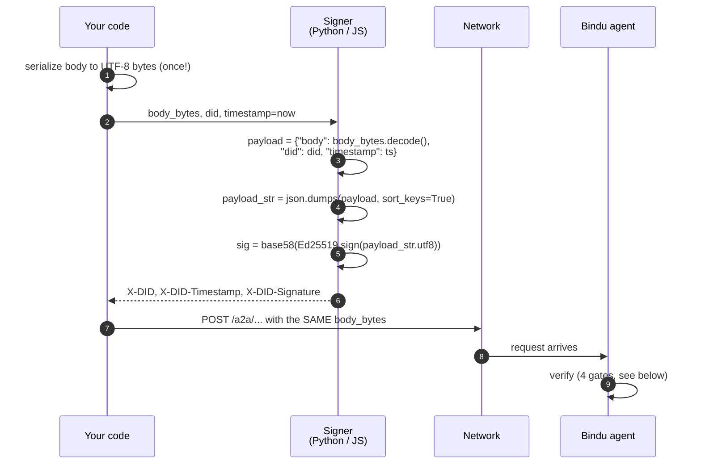

<Note>
Read the [Authentication page](/bindu/learn/authentication/overview) first if you haven't. This page builds on it. In one line:

- **Authentication** (bearer tokens, Hydra) answers: *are you allowed to make this request?*
- **DIDs** answer the other half: *are you really who you say you are?*

You need both. Lose either and things break — or worse, go through when they shouldn't.
</Note>

This page is the second half. We'll go slow, no assumed crypto background, lots of stories.

---

## The milk-truck problem

You run a coffee shop. Every morning at 6am, a truck pulls up claiming to be your milk delivery. The driver says, *"I'm from Acme Dairy, same as always."*

How do you know they really are? A few options:

1. **Ask for an ID card.** Anyone can print a card that says "Acme Dairy." You can't tell a real one from a fake one.
2. **Call Acme and ask, "is this driver yours?"** Works — but now you're calling Acme every single morning. And if Acme's phone line is down, no milk for anyone. Your cappuccinos are ruined.
3. **Acme gives the driver a special key.** A cryptographic one. The driver proves they have it, on the spot, without calling anyone. Even if Acme's office burns down overnight, the key still works.

Option 3 is the spirit of a **DID**.

Instead of calling a central authority to vouch for you (option 2), you carry proof you can demonstrate anywhere, to anyone, without a phone call. No gatekeeper. No single point of failure.

For software agents, "calling a central authority" looks like asking Facebook if this user is real, or asking a platform if this agent is legitimate. Which is great — until the platform decides to kick you off, or just disappears. Your identity disappears with it.

DIDs move your identity from a company's database into math. Math doesn't shut down.

---

## The passport and the day-pass

Imagine walking into a secure building. The security desk wants to know three things:

1. Is your **passport** a real passport? (Document authentic?)
2. Does the **face** on it match you? (Really you?)
3. Do you have a **day-pass** for today? (Allowed in *today*?)

Real life uses two documents:

- **The passport** — expensive to forge, issued once, lasts years. Proves *who you are*.
- **The day-pass** — a sticker you get at the front desk. Proves *you have access today*.

You need both. A passport without a day-pass? You're a verified stranger. A day-pass without a passport? Anyone could claim it.

Bindu uses the same pattern:

| Real life | Bindu |
|---|---|
| Passport | **DID + signature** — long-lived cryptographic identity |
| Day-pass | **Bearer token** — short-lived (~1 hour) access grant |
| Photo on passport | **Public key** stored in the DID document |
| Secret signature only you can make | **Private key** only you hold |
| Guard checks passport photo | Server checks DID signature |
| Guard checks day-pass | Server checks bearer token via Hydra |

This page is about the passport side. The day-pass side was the [Authentication page](/bindu/learn/authentication/overview).

---

## Public and private keys, without the math

Before we go further, one concept. You've probably heard **public-key cryptography** before. Here's what it actually means, stripped of math.

A **key pair** is two matched pieces of data — a **private key** and a **public key**. Born together, in one moment, from one random number. They have two almost-magical properties:

1. **You can give the public key to anyone.** Strangers on the internet. Billboards. T-shirts. Doesn't matter. That's why it's *public*.
2. **If you "sign" a message with the private key, anyone with the public key can verify the signature.** They can't *make* signatures — only you can, because only you have the private key. But they can check yours.

Think of it like a medieval scribe's **unique wax stamp**. The scribe keeps the stamp in a locked chest. The king gives an imprint of the stamp (the public key) to every city. Now:

- A letter with the stamp is verifiably from the scribe.
- A letter without it is just paper.
- A forged stamp gets spotted instantly because the stamp has unique geometry nobody else can reproduce.

<Note>
Cryptographers love to call this stuff "elegant." What they mean is: someone really smart in the 1970s figured out how to build a lock where the key you give out (public) can only *verify* locks, but the key you keep (private) can actually *make* them. We're still collectively shocked this works.
</Note>

In Bindu we use a specific kind of key pair called **Ed25519**. You don't need to know why. Just three facts:

- Keys are **tiny** — 32 bytes each. Fits in a header.
- **Fast** to sign and verify. Sub-millisecond.
- **Heavily audited.** Signal uses it. SSH uses it. Tor uses it. It's trusted.

Two terms to remember — we'll come back to them:

- **Seed** — a 32-byte random number that *generates* the key pair. If you have the seed, you can always re-derive both keys.
- **Signature** — the 64-byte output of signing a message. Usually encoded as Base58 so it's a readable string. If the signature verifies, you know the message really came from someone with the private key.

<Info>
**A note on storage.** A Bindu agent doesn't store the seed itself — `DIDAgentExtension` in `bindu/extensions/did/did_agent_extension.py` writes a PKCS8 PEM private key to `private.pem` (mode `0o600`) and a SubjectPublicKeyInfo PEM to `public.pem` (mode `0o644`), under the `pki_dir` (default `.bindu/`). The PEM file can optionally be encrypted at rest with `key_password`. The "seed" pattern you'll see in scripts (Postman, browser POC) is a separate convenience — it derives the same key pair without ever touching PEM.
</Info>

---

## What a DID actually is

Take a deep breath. A DID is just a **string**. A specific shape of string that says "this identifier belongs to a specific identity system, and here's where to look up more info about it."

Bindu DIDs look like this:

```
did:bindu:dutta_raahul_at_gmail_com:postman:ee67868d-d4b6-6441-93d6-ba4b29dc5e1d
```

Five parts, separated by colons (this is what `DIDAgentExtension.did` builds when `author`, `agent_name`, and `agent_id` are all set):

| Part | In the example | What it means |
|---|---|---|
| 1 | `did` | The literal prefix. "This is a Decentralized Identifier." Every DID ever, in every system, starts with this. W3C standard. |
| 2 | `bindu` | The **method**. Tells you which DID system to use. Others exist: `did:web`, `did:ethr`, `did:key`. Here we use Bindu's. |
| 3 | `dutta_raahul_at_gmail_com` | The **author segment**. A human-readable identifier of whoever created this DID. Sanitized by `_sanitize_identifier`: lowercased, spaces → `_`, `@` → `_at_`, `.` → `_`. Pure metadata — helps humans know whose agent this is. |
| 4 | `postman` | The **agent name**. A short label, run through the same sanitizer. |
| 5 | `ee67868d-...-ba4b29dc5e1d` | The **agent ID** — a UUID-shaped string. By convention it's derived from the first 16 bytes of `sha256(public_key)` (the Postman generator does exactly that), but `DIDAgentExtension` will accept whatever `agent_id` you pass in. |

When you only supply a key — no author, no agent name — the extension falls back to a W3C `did:key` form: `did:key:z<base58-multibase-public-key>` (the `z` is the multibase prefix for Base58btc). Useful for ad-hoc identities; Bindu native agents always use the five-part `did:bindu:...` form.

### DID string rules

A few constraints — the ones enforced by `DIDValidation` in `bindu/extensions/did/validation.py`:

- Must start with `did:` (settings `did.prefix`)
- Must match the basic pattern `^did:[a-z0-9]+:.+$` (case-insensitive)
- For `did:bindu`: must match `^did:bindu:[^:]+:[^:]+(:[^:]+)?$` — author and agent name are mandatory, agent ID is optional in the regex but mandatory in practice

W3C also says: only ASCII letters, digits, and `._:%-`; case-sensitive; no `?`, `#`, or spaces; under 2048 characters. Bindu doesn't re-enforce all of these on the wire, but cross-protocol parsers will.

<Warning>
`DIDValidation` splits the DID with `split(":", bindu_parts - 1)` where `bindu_parts = 4`. That produces at most 4 chunks, so for a five-segment DID the last chunk is `agent_name:agent_id` glued together. The regex still accepts it, and `parts[3]` is checked for non-empty. Don't read more semantics into the validator than it actually enforces.
</Warning>

---

## The DID document — the thing servers actually trust

The DID string is just a name. To trust you, a server needs your **public key**. That mapping — DID string → public key — lives in a JSON file called the **DID document**.

Here's exactly what `DIDAgentExtension.get_did_document()` returns:

```json
{
  "@context": [
    "https://www.w3.org/ns/did/v1",
    "https://getbindu.com/ns/v1"
  ],
  "id": "did:bindu:dutta_raahul_at_gmail_com:postman:ee67868d-d4b6-6441-93d6-ba4b29dc5e1d",
  "created": "2026-04-19T17:23:45+00:00",
  "authentication": [
    {
      "id":              "did:bindu:...#key-1",
      "type":            "Ed25519VerificationKey2020",
      "controller":      "did:bindu:...",
      "publicKeyBase58": "BJx2RYuVCGNkgXuxcQEYe8FKTBqypJjz5gvTxXto9kQv"
    }
  ]
}
```

Line by line:

- **`@context`** — `["https://www.w3.org/ns/did/v1", "https://getbindu.com/ns/v1"]`. Parsers care; you don't.
- **`id`** — the DID itself.
- **`created`** — UTC ISO timestamp cached at extension construction time.
- **`authentication`** — a list of **verification methods**. The default one has a fragment `#key-1` (`did.key_fragment`), type `Ed25519VerificationKey2020`, controller equal to the DID itself, and the public key as **raw 32 bytes, Base58btc-encoded**.

<Note>
**Where does Bindu store this document?** Two places, depending on who's resolving:

- The **agent** advertises its own DID document inline in `/.well-known/agent.json` and exposes `POST /did/resolve` (path from `did.resolver_endpoint`) for direct lookups.
- The **gateway** (when you authenticate against Hydra) stores client public keys in the Hydra OAuth client's `metadata.public_key` field. The middleware in `bindu/server/middleware/auth/hydra.py` pulls that key to verify the `X-DID-Signature` header.

`DIDValidation.validate_did_document` enforces `@context` and `id` are present, that each entry in `authentication` is an object with `type` and `controller`, and — if a `service` array is present — that every `serviceEndpoint` matches the configured `network.default_url`.
</Note>

---

## Signing a request (what the client does)

You want to send a request to a Hydra-fronted Bindu agent. You want to sign it, so the agent knows the request really came from you — not a replay, not a man-in-the-middle tampering in transit.

The signer and the verifier share one contract: they must agree on the bytes. The reference implementation lives in `bindu/utils/did/signature.py::create_signature_payload`.



<Steps>
  <Step title="Gather three inputs">
    - **Body** — the exact bytes of the HTTP request body, as they'll go on the wire. Not a parsed object. Not "reformatted." The exact UTF-8 bytes the server will receive. **This is the single thing people get wrong most often.**
    - **DID** — your DID string.
    - **Timestamp** — current Unix time, in seconds (an integer).

    <Warning>
    `create_signature_payload` accepts `str` or `bytes` only. It rejects `dict` with `TypeError`. That's deliberate — passing a dict to the signer used to silently `json.dumps` it on the signer side while the verifier got whatever raw bytes the HTTP client decided to send, and the mismatch surfaced as `crypto_mismatch` with no clue why. **Serialize once, sign and send the same bytes.**
    </Warning>
  </Step>

  <Step title="Build the signing payload">
    Combine the three into a small JSON object:

    ```python
    {"body": <body_str>, "did": <did>, "timestamp": <ts>}
    ```

    Then serialize it **using Python's `json.dumps(sort_keys=True)` convention**. Two things matter:

    1. **Keys sorted alphabetically** at every level. So `body` → `did` → `timestamp`.
    2. **Default Python separators** — `", "` and `": "`. **With a space.** After the comma. After the colon.

    That second rule is where every other language trips over its own feet. JavaScript's `JSON.stringify` omits those spaces by default. Python doesn't. If your client skips the spaces, the bytes you signed don't match the bytes the server reconstructs, and the signature fails — even though you "signed the right thing."

    A correct payload for a small example:

    ```
    {"body": "{\"test\": \"value\"}", "did": "did:bindu:test", "timestamp": 1000}
    ```

    Notice the spaces after `:` and `,`. Notice `body` comes first. If what you produce matches `json.dumps(payload, sort_keys=True)`, you're good.

    For JS/TS, replicate it with the `pythonSortedJson` helper from `docs/postman-did-signing.js` — it walks the value, sorts object keys, and inserts the Python-style separators.
  </Step>

  <Step title="Sign the bytes">
    Take the UTF-8 bytes of that payload string. Sign them with your Ed25519 private key. Base58-encode the resulting 64-byte signature.

    In Python, against a `DIDAgentExtension`:

    ```python
    import json, time
    payload = {"body": body_str, "did": did, "timestamp": int(time.time())}
    payload_str = json.dumps(payload, sort_keys=True)
    signature = did_extension.sign_text(payload_str)  # returns base58 string
    ```

    Or use the bundled `sign_request` helper:

    ```python
    from bindu.utils.did.signature import sign_request
    body_bytes = json.dumps(data).encode("utf-8")
    headers = sign_request(body_bytes, did, did_extension)
    # headers == {"X-DID": ..., "X-DID-Signature": ..., "X-DID-Timestamp": ...}
    httpx.post(url, content=body_bytes, headers=headers)
    ```
  </Step>

  <Step title="Attach four headers">
    Three for the signature:

    ```
    X-DID:             <your DID string>
    X-DID-Timestamp:   <ts>
    X-DID-Signature:   <base58-encoded signature>
    ```

    Plus your bearer token from the [Authentication flow](/bindu/learn/authentication/overview):

    ```
    Authorization:     Bearer <access token>
    ```

    Send the request. The body on the wire has to be **exactly the same bytes** you used in the signing payload. If any middleware reformats the JSON between your sign-step and the network — the signature breaks.
  </Step>
</Steps>

### curl with signed headers

A complete, working curl once you've computed the signature:

```bash
curl -X POST 'https://your-agent.getbindu.com/a2a/jsonrpc' \
  -H 'Authorization: Bearer eyJhbGc...' \
  -H 'X-DID: did:bindu:user_at_ex_com:my_agent:ee67868d-d4b6-6441-93d6-ba4b29dc5e1d' \
  -H 'X-DID-Timestamp: 1747569600' \
  -H 'X-DID-Signature: 3SfU4VPTHLbzZzCn17ZqU6y2tnzHQbdo2nnXQr6XZXk34XgyzwSKRrCYEWRmmGXrV39mdkyhTsy5oasfTpNuqyM2' \
  -H 'Content-Type: application/json' \
  --data-binary @body.json
```

`--data-binary @body.json` matters — `--data` strips newlines and breaks the signature.

---

## Verifying a request (what the server does)

When a Hydra-fronted Bindu agent receives your request, four gates fire in order (see `bindu/server/middleware/auth/hydra.py::_verify_did_signature_asgi` and `bindu/utils/did/signature.py::verify_signature`). Fail any one, and the request is rejected with a `reason` telling you which gate.

```mermaid
flowchart TD
    A[Incoming request] --> G1{Gate 1<br/>Bearer token valid?<br/>(Hydra introspect)}
    G1 -->|no| R1[invalid_token / expired]
    G1 -->|yes, client_id is did:*| G2{Gate 2<br/>X-DID-* headers present?<br/>X-DID == client_id?}
    G2 -->|missing| R2a[missing_signature_headers]
    G2 -->|mismatch| R2b[did_mismatch]
    G2 -->|ok| G3{Gate 3<br/>Public key in<br/>Hydra metadata?}
    G3 -->|no| R3[public_key_unavailable]
    G3 -->|yes| G4a{Gate 4a<br/>timestamp within<br/>±300s?}
    G4a -->|no| R4a[timestamp_out_of_window]
    G4a -->|yes| G4b{Gate 4b<br/>Ed25519 verify<br/>signature?}
    G4b -->|malformed b58| R4b[malformed_input]
    G4b -->|bad sig| R4c[crypto_mismatch]
    G4b -->|ok| OK[Request proceeds to handler]
```

Each `reason` in a rejection points to exactly one gate:

| Reason | Gate | What's wrong |
|---|---|---|
| `missing_signature_headers` | 2 | Bearer token present, client is a DID, but no `X-DID-*` headers |
| `did_mismatch` | 2 | `X-DID` header disagrees with the token's `client_id` |
| `public_key_unavailable` | 3 | Hydra has no public key for this DID |
| `payload_too_large` | 3 | Body exceeds `MAX_BODY_SIZE_BYTES` — can't safely buffer for verify |
| `timestamp_out_of_window` | 4a | `\|now - X-DID-Timestamp\| > 300s` (replay guard) |
| `malformed_input` | 4b | `X-DID-Signature` or public key isn't valid Base58 / wrong length |
| `crypto_mismatch` | 4b | Signature doesn't verify — wrong key, wrong bytes, or tampering |

<Info>
The verifier reconstructs the payload from the **raw ASGI body bytes** plus the `X-DID` and `X-DID-Timestamp` headers, then re-runs `json.dumps(payload, sort_keys=True)` and checks the signature against the result. The body bytes are buffered from the ASGI stream and replayed to downstream handlers via a proxy receiver — your handler still sees the body.
</Info>

---

## Setting up your own DID from scratch

Two paths, depending on whether you're running an agent or signing as a client.

### Path A: Generate a seed and derive everything (client-side)

This is what the Postman pre-script and the browser POC do. One Python command does it all:

```bash
python3 -c "
import os, base64, base58, hashlib
from nacl.signing import SigningKey

AUTHOR = 'your.email@example.com'   # replace
NAME   = 'my_agent'                  # replace (short, no colons)

seed = os.urandom(32)
sk   = SigningKey(seed)
pk   = bytes(sk.verify_key)
h    = hashlib.sha256(pk).hexdigest()
agent_id = f'{h[0:8]}-{h[8:12]}-{h[12:16]}-{h[16:20]}-{h[20:32]}'
author_safe = AUTHOR.replace('@', '_at_').replace('.', '_')
did  = f'did:bindu:{author_safe}:{NAME}:{agent_id}'

print()
print('did              =', did)
print('seed (base64)    =', base64.b64encode(seed).decode())
print('public key (b58) =', base58.b58encode(pk).decode())
"
```

You get three lines. **Save them somewhere safe.** The seed is your private key.

<Warning>
Lose the seed and the DID is orphaned — there's no reset link, no recovery email, no customer support line. The DID just... becomes a string nobody can sign with anymore. It's the password equivalent of losing the only key to a chest at the bottom of the ocean.
</Warning>

### Path B: Let `DIDAgentExtension` manage the keypair (agent-side)

If you're embedding the DID extension into a Bindu agent, you don't write a script — you instantiate the extension and let it write `private.pem` / `public.pem` under `pki_dir` (default `.bindu/`):

```python
from pathlib import Path
from bindu.extensions.did import DIDAgentExtension

ext = DIDAgentExtension(
    recreate_keys=False,                  # True = rotate, with caution
    key_dir=Path(".bindu"),
    author="your.email@example.com",
    agent_name="my_agent",
    agent_id="ee67868d-d4b6-6441-93d6-ba4b29dc5e1d",  # any UUID-shaped string
    key_password=None,                    # or "env:DID_KEY_PASSWORD"
)
ext.generate_and_save_key_pair()
ext.check_integrity()                     # validates both keys + DID doc

print(ext.did)                            # did:bindu:your_email_at_ex_com:my_agent:ee67868d-...
print(ext.public_key_base58)
print(ext.get_did_document())
```

Files written:

- `private.pem` — Ed25519 PKCS8 PEM, mode `0o600` (or encrypted, if `key_password` set)
- `public.pem` — Ed25519 SubjectPublicKeyInfo PEM, mode `0o644`

### Register the client with Hydra

Whichever path you took, the gateway needs to know your public key. Register a Hydra OAuth client and stash the Base58 public key in `metadata.public_key`:

```bash
curl -X POST 'https://hydra-admin.getbindu.com/admin/clients' \
  -H 'Content-Type: application/json' \
  -d '{
    "client_id":     "<your DID>",
    "client_secret": "<a strong random secret>",
    "grant_types":   ["client_credentials"],
    "response_types": ["token"],
    "scope":         "openid offline agent:read agent:write",
    "token_endpoint_auth_method": "client_secret_post",
    "metadata": {
      "agent_id":            "<the uuid portion of the did>",
      "did":                 "<your DID>",
      "public_key":          "<base58 public key>",
      "key_type":            "Ed25519",
      "verification_method": "Ed25519VerificationKey2020",
      "hybrid_auth":          true
    }
  }'
```

`metadata.public_key` is exactly what Gate 3 reads. `hybrid_auth: true` signals to the middleware that this client requires DID signatures on top of a bearer token — once that's set, unsigned requests get `missing_signature_headers`.

### Get a bearer token

Head back to the [Authentication guide](/bindu/learn/authentication/overview) — step 2 of "Getting your first token." Same flow, your shiny new DID is the `client_id`.

### Sign and send a request

Use `bindu/utils/did/signature.py::sign_request` (Python), the Postman pre-script from `docs/postman-did-signing.js` (JS, browser-compat Web Crypto), or roll your own. All three produce identical bytes — they've been cross-tested.

<Info>
**Canonical fixture for cross-language testing**. Rolling your own signer? Use this:

- seed = 32 zero bytes
- DID = `did:bindu:test`
- body = `{"test": "value"}`
- timestamp = `1000`

Your signature should Base58-encode to:

```
3SfU4VPTHLbzZzCn17ZqU6y2tnzHQbdo2nnXQr6XZXk34XgyzwSKRrCYEWRmmGXrV39mdkyhTsy5oasfTpNuqyM2
```

If it doesn't, your Python-compatible JSON serialization is almost certainly the culprit — either missing spaces, or keys aren't sorted.
</Info>

---

## What goes wrong in real life

This section is long because this is where people lose hours. Every one of these happened to a real person setting up Bindu. Learn from their pain.

<AccordionGroup>
  <Accordion title="I'm getting did_mismatch and the strings look identical">
    `X-DID` must be **byte-identical** to the `client_id` Hydra returns when introspecting your token. Three things to check, in this order:

    1. **Are you talking to the right Hydra?** Your agent's `HYDRA__ADMIN_URL` and the Hydra that issued your token must be the same. Run:
       ```bash
       curl -X POST '<your agent hydra admin>/admin/oauth2/introspect' -d 'token=<your token>'
       ```
       The `client_id` field must exactly match `X-DID`.
    2. **Did a character get auto-edited?** Some clients (pasting from Slack, from Markdown tables) turn `-` into `–` (en dash). Same-looking, different bytes. Spot it with:
       ```bash
       diff <(xxd <<< "$a") <(xxd <<< "$b")
       ```
    3. **Is Postman holding onto a stale token?** Open Postman Console (Option-Cmd-C) and read the actual outgoing headers — not what you think you sent, what actually went out.
  </Accordion>

  <Accordion title="I'm getting crypto_mismatch">
    Gate 4b tried to verify your signature and it didn't match. Four usual suspects:

    - **Body bytes drifted.** Your signing code serialized the JSON object, then some middleware or HTTP client re-serialized the body before sending. Same object, different whitespace or key order. **Fix:** sign the exact string you'll put on the wire, not the parsed object. `create_signature_payload` raises `TypeError` on dicts specifically to make this hard to do by accident.
    - **Wrong public key in Hydra.** You rotated the key locally but forgot to update `metadata.public_key`. Server verifies against the old key. **Fix:** re-register with the new key.
    - **Python-compat JSON mismatch.** You're probably in JavaScript, and `JSON.stringify` omits the spaces. **Fix:** use `pythonSortedJson` from `docs/postman-did-signing.js`, or replicate it.
    - **Actually forged / wrong seed.** The key you're signing with doesn't match the public key in Hydra. Walk the chain: `private key → public key → metadata.public_key`. One of the links is broken.
  </Accordion>

  <Accordion title="I'm getting malformed_input">
    Verifier got either `X-DID-Signature` or the registered public key, and one of them didn't decode as valid Base58, or decoded to the wrong length. Common causes:

    - You URL-encoded the signature. Don't — Base58 has no reserved characters.
    - You sent the public key as hex instead of Base58.
    - You concatenated/truncated bytes somewhere.

    Confirm: `len(base58.b58decode(sig)) == 64` and `len(base58.b58decode(pubkey)) == 32`.
  </Accordion>

  <Accordion title="I'm getting timestamp_out_of_window">
    Two causes:

    - **Your clock is wrong.** Check `date -u` against a known-good time server. Container clocks drift all the time.
    - **Someone's replaying a captured request.** Or you're trying to resend a request your logs captured 10 minutes ago. Sign fresh every time.

    The window is `±300s` by default (`max_age_seconds` in `verify_signature`).
  </Accordion>

  <Accordion title="I'm getting public_key_unavailable">
    The DID in `X-DID` doesn't have a public key registered with Hydra. Two paths:

    - You haven't registered yet → see "Register the client with Hydra" above.
    - You registered, but put the public key somewhere other than `metadata.public_key`. Look at `GET /admin/clients/<did>` and confirm `metadata.public_key` is a non-empty Base58 string.
  </Accordion>

  <Accordion title="I'm getting missing_signature_headers">
    You sent `Authorization: Bearer <token>` where the token's `client_id` is a DID, but didn't send the three `X-DID-*` headers. Once `client_id` starts with `did:`, signing is mandatory — there's no "unsigned is fine" fallback (this used to fail-open and was closed; see `bugs/2026-04-18-did-signature-fail-open.md` in the repo).
  </Accordion>

  <Accordion title="I'm getting payload_too_large">
    Body exceeds the configured `MAX_BODY_SIZE_BYTES`. The middleware refuses to buffer arbitrarily large bodies for signature verification. Split the payload, or talk to whoever runs the gateway about raising the limit.
  </Accordion>
</AccordionGroup>

---

## Keeping your key safe

The private key — whether held as a 32-byte seed or as `private.pem` — is the single thing that gives you authority over your DID. Treat it like a password — but worse, because there's no "forgot password" flow. Lose it and the DID is gone forever.

<CardGroup cols={2}>
  <Card title="Storage" icon="lock">
    Secret manager (1Password, AWS Secrets Manager, Vault) for prod. Gitignored `.env` for local. **Never** in source. Never logged in plaintext.
  </Card>
  <Card title="Permissions" icon="file-lock">
    `DIDAgentExtension` writes `private.pem` mode `0o600` on POSIX. Verify with `ls -l ~/.bindu/private.pem` — should be `-rw-------`.
  </Card>
  <Card title="At-rest encryption" icon="key">
    Pass `key_password` (or `env:DID_KEY_PASSWORD`) to `DIDAgentExtension` and the PEM is wrapped with `BestAvailableEncryption`. Loading the key without the password raises `ValueError`.
  </Card>
  <Card title="Rotation" icon="rotate">
    Generate new key, `PUT` to `/admin/clients/<did>` with updated `metadata.public_key`, restart agent with `recreate_keys=True`, discard old key. Old signatures stop verifying immediately — do it in a maintenance window.
  </Card>
</CardGroup>

### If you think the key is compromised

Assume the attacker has full signing authority until you've:

- Rotated the key.
- Revoked all outstanding bearer tokens (Hydra's admin API can do this).
- Audited recent requests signed by this DID — what did the attacker do?
- Read your logs for unfamiliar `X-DID-Timestamp` values or weird request patterns.

Don't just rotate — **investigate**. The key didn't leak on its own.

---

## Bonus: agents sign their responses too

So far we've talked about you signing requests. Agents sign their responses right back. Every artifact a Bindu agent produces is run through `did_extension.sign_text(text_value)` in `bindu/utils/worker/artifacts.py`, and the Base58 signature is stuffed into the artifact metadata under the key `did.message.signature` (from `app_settings.did.agent_extension_metadata`).

Look for this inside a task response:

```json
"metadata": {
  "did.message.signature": "<base58 signature>"
}
```

To verify, resolve the agent's DID document, grab `publicKeyBase58`, and check the signature against the message bytes using the same `verify_text` logic the extension uses internally:

```python
from nacl.signing import VerifyKey
import base58

pk = VerifyKey(base58.b58decode(pub_key_b58))
pk.verify(text.encode("utf-8"), base58.b58decode(signature))  # raises if bad
```

The agent's DID lives in its agent card at `/.well-known/agent.json`, and the full DID document is at `POST /did/resolve`.

You don't *have* to verify. The server does the heavy lifting on the way in. But if you're building something compliance-heavy (legal, medical, financial), client-side verification gives you a proof you can put in an audit log.

---

## Signing is not encryption

One clarification that comes up constantly:

- **Signing** gives you **authenticity** ("really from this DID") and **integrity** ("not modified in transit"). It does **not** hide the contents. Anyone who sees the traffic can read the body as plain JSON.
- **Encryption** hides the contents. For network transport, use HTTPS (TLS). Bindu's public endpoints are HTTPS in production.

If you need messages to be unreadable even by the middle — that's **end-to-end encryption**, and it's a separate feature Bindu doesn't currently ship. TLS + DID signing is the production model.

---

## Why Ed25519 (optional reading)

The short version: Ed25519 is a modern elliptic-curve signature scheme that is:

- **Small.** Keys are 32 bytes, signatures 64 bytes. Fits in headers.
- **Fast.** Sub-millisecond sign/verify on modern CPUs.
- **Deterministic.** Same input → same signature. Makes cross-language testing painless.
- **Well-vetted.** Signal, Tor, SSH, RFC 8032. No known practical attacks.

The alternative was RSA. RSA keys are ten times larger, signatures are bigger, signing is slower, and RSA has a long and colourful history of subtly broken implementations. For a protocol that signs on every single request, Ed25519 is the right default.

If you ever see a DID from outside Bindu with a different key type, the `authentication[].type` in its DID document tells you which algorithm to use. Bindu-native DIDs always use `Ed25519VerificationKey2020`.

---

## Related

<CardGroup cols={2}>
  <Card title="Authentication" icon="key" href="/bindu/learn/authentication/overview">
    The bearer-token half. Read this first if you haven't.
  </Card>
  <Card title="Payment (x402)" icon="credit-card" href="/bindu/learn/payment/introduction">
    Payment receipts are signed with the same DID keypair.
  </Card>
  <Card title="W3C DID Core" icon="book" href="https://www.w3.org/TR/did-core/">
    The governing standard for all DID methods.
  </Card>
  <Card title="RFC 8032 / Ed25519" icon="book" href="https://datatracker.ietf.org/doc/html/rfc8032">
    The signature scheme itself.
  </Card>
</CardGroup>

---

## The whole thing in one paragraph

A DID is a long identifier string that maps, through a public document, to an Ed25519 public key. When you make a request, you sign specific bytes — `json.dumps({"body", "did", "timestamp"}, sort_keys=True)` — with your private key and attach the signature as `X-DID-Signature`. The middleware introspects your bearer token, checks that `X-DID` matches the token's `client_id`, looks up your public key in Hydra's `metadata.public_key`, reconstructs the same bytes from the raw ASGI body, and verifies. If everything lines up, the request reaches your handler; otherwise it's rejected with a one-word `reason` pointing at the exact gate that failed. Combined with the bearer token from the [Authentication page](/bindu/learn/authentication/overview), Bindu gets two independent guarantees: *this request is permitted* (token) and *this request is authentic* (signature). Lose either and the request is rejected. Get both right and you have a system where identity and access are verifiable end-to-end — without trusting any single central authority.

<span className="brand-quote">
  

  <span className="brand-quote-text">
    DID lets you -{" "}
    <span className="brand-quote-highlight">prove yourself to agents</span>.
  </span>
</span>
