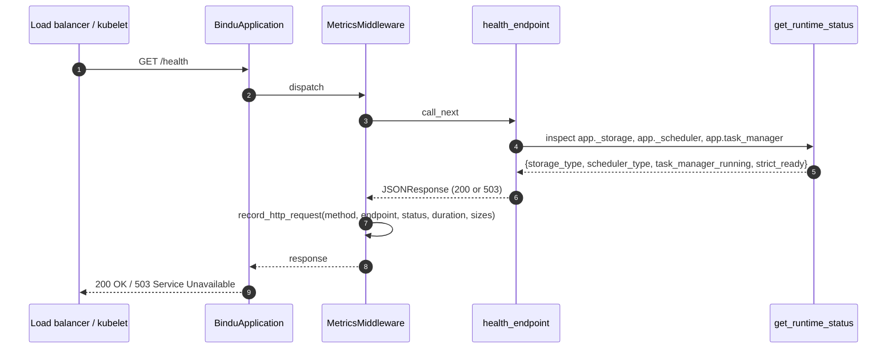

A process can be "running" and still broken. Postgres is down, Redis dropped the connection, the worker pool deadlocked — the agent is still binding port `:3773` and answering TCP, but the next real request fails.

So `/health` in Bindu does more than return `200 OK`. It walks the runtime — storage, scheduler, task manager — and returns `503 Service Unavailable` when any of them is missing or not running. `/metrics` exposes Prometheus text-format counters, gauges, histograms, and summaries for request traffic, latency, task state, errors, and per-agent task completion.

You do not configure either. Both endpoints are registered on `BinduApplication` startup, both are on the auth allowlist, and both are exempt from the startup gate so Kubernetes can probe the pod while storage and the scheduler are still coming up. Point your load balancer at `/health` and your scrapers at `/metrics` — you have visibility from request one.

## Liveness, readiness, metrics

Bindu does not split liveness and readiness across multiple paths. There is one health endpoint and it makes the strict choice for you: 200 means every dependency is ready, 503 means at least one is not.

| Question | Endpoint | Status code | Use for |
| --- | --- | --- | --- |
| Is the process alive at all? | `/health` reachable | TCP-level | Liveness probe |
| Is the agent ready to take work? | `/health` returns 200 | 200 vs 503 | Readiness probe, load balancer health checks |
| How has it been behaving over time? | `/metrics` | 200 | Prometheus scrape, Grafana dashboards |

<Note>
  Strict readiness means **storage + scheduler + task manager** are all initialized and the
  task manager's run loop is active. Anything less and `/health` returns HTTP 503 with
  `"status": "degraded"`, `"ready": false`, `"health": "degraded"`.
</Note>

<CardGroup cols={3}>
  <Card title="Readable" icon="heart-pulse">
    `/health` returns a single JSON document with runtime, application, and system blocks.
  </Card>
  <Card title="Scrapeable" icon="chart-line">
    `/metrics` is Prometheus text format `version=0.0.4` — scrape it with anything OpenMetrics-compatible.
  </Card>
  <Card title="Probe-safe" icon="shield-check">
    Both paths are exempt from the startup gate and the auth middleware allowlist, so probes never get a 500 or 401.
  </Card>
</CardGroup>

---

## Request flow



The metrics middleware runs on every request *except* `/metrics` itself (skipped to avoid feedback loops), sanitizes path parameters (UUIDs and numeric IDs are rewritten to `:id` to keep cardinality bounded), and feeds the global `PrometheusMetrics` singleton.

---

## /health

<Steps>
  <Step title="Probe it">
    <CodeGroup>
      ```bash Request
      curl -i http://localhost:3773/health
      ```

      ```json Response (200 — strict_ready)
      {
        "version": "2026.6.7.dev65+g6742cd6eb.d20260210",
        "health": "healthy",
        "runtime": {
          "storage_backend": "PostgresStorage",
          "scheduler_backend": "RedisScheduler",
          "task_manager_running": true,
          "strict_ready": true
        },
        "application": {
          "penguin_id": "8f5c…",
          "agent_did": "did:bindu:…"
        },
        "system": {
          "python_version": "3.12.4",
          "platform": "Linux",
          "environment": "production"
        },
        "status": "ok",
        "ready": true,
        "uptime_seconds": 37.56
      }
      ```

      ```json Response (503 — degraded)
      {
        "version": "2026.6.7.dev65+g6742cd6eb.d20260210",
        "health": "degraded",
        "runtime": {
          "storage_backend": "PostgresStorage",
          "scheduler_backend": null,
          "task_manager_running": false,
          "strict_ready": false
        },
        "application": {
          "penguin_id": "8f5c…",
          "agent_did": "did:bindu:…"
        },
        "system": {
          "python_version": "3.12.4",
          "platform": "Linux",
          "environment": "production"
        },
        "status": "degraded",
        "ready": false,
        "uptime_seconds": 4.12
      }
      ```
    </CodeGroup>
  </Step>

  <Step title="Read the fields">
    | Field | Type | Meaning |
    | --- | --- | --- |
    | `status` | string | `"ok"` when `strict_ready=true`, else `"degraded"` |
    | `ready` | bool | Mirrors `runtime.strict_ready` — use this for readiness probes |
    | `health` | string | `"healthy"` or `"degraded"` — same trigger as `status` |
    | `uptime_seconds` | float | Seconds since the process imported `health.py` (monotonic clock) |
    | `version` | string | Value of `bindu.__version__` |
    | `runtime.storage_backend` | string \| null | Class name of `app._storage` (e.g. `PostgresStorage`, `InMemoryStorage`) |
    | `runtime.scheduler_backend` | string \| null | Class name of `app._scheduler` (e.g. `RedisScheduler`, `MemoryScheduler`) |
    | `runtime.task_manager_running` | bool | True only if `app.task_manager.is_running` |
    | `runtime.strict_ready` | bool | True when **all** of storage, scheduler, task manager are present and running |
    | `application.penguin_id` | string | UUID identifying this server process |
    | `application.agent_did` | string \| null | Agent DID from the manifest, if present |
    | `system.python_version` | string | `sys.version.split()[0]` |
    | `system.platform` | string | `platform.system()` — e.g. `Linux`, `Darwin` |
    | `system.environment` | string | Value of `$ENV` env var, defaults to `"development"` |
  </Step>

  <Step title="Wire it to your orchestrator">
    Kubernetes treats any 2xx as healthy; 503 fails the probe. That maps directly to
    `strict_ready`, so a single config covers both liveness and readiness:

    ```yaml
    livenessProbe:
      httpGet:
        path: /health
        port: 3773
      initialDelaySeconds: 5
      periodSeconds: 10
    readinessProbe:
      httpGet:
        path: /health
        port: 3773
      initialDelaySeconds: 2
      periodSeconds: 5
    ```

    <Info>
      During boot — before storage and scheduler initialize inside the ASGI lifespan —
      `/health` returns 503 without raising. The startup gate in
      `BinduApplication.__call__` whitelists `/health`, `/healthz`, and `/metrics`, so probes
      get a proper response code instead of a 500.
    </Info>
  </Step>
</Steps>

<Note>
  Only `/health` is registered as a route. The `/healthz` path is **whitelisted** in the
  startup gate (so it cannot 500 mid-boot) but no handler exists for it — a request to
  `/healthz` returns 404 once the app is running. Use `/health` everywhere.
</Note>

---

## /metrics

```bash
curl http://localhost:3773/metrics
```

Returns `text/plain; version=0.0.4; charset=utf-8` with `Cache-Control: no-cache`. Before generating output, the endpoint refreshes the per-agent active-task gauge by counting tasks in `submitted`, `working`, and `input-required` states from storage.

```prometheus
# HELP http_requests_total Total number of HTTP requests
# TYPE http_requests_total counter
http_requests_total{method="GET",endpoint="/health",status="200"} 42
http_requests_total{method="POST",endpoint="/",status="200"} 17

# HELP http_request_duration_seconds HTTP request latency
# TYPE http_request_duration_seconds histogram
http_request_duration_seconds_bucket{le="0.1"} 55
http_request_duration_seconds_bucket{le="0.5"} 58
http_request_duration_seconds_bucket{le="1.0"} 59
http_request_duration_seconds_bucket{le="+Inf"} 59
http_request_duration_seconds_sum 4.2
http_request_duration_seconds_count 59

# HELP agent_tasks_active Currently active tasks
# TYPE agent_tasks_active gauge
agent_tasks_active{agent_id="did:bindu:abc123"} 3

# HELP agent_tasks_completed_total Total completed tasks
# TYPE agent_tasks_completed_total counter
agent_tasks_completed_total{agent_id="did:bindu:abc123",status="success"} 128

# HELP http_requests_in_flight Current number of HTTP requests being processed
# TYPE http_requests_in_flight gauge
http_requests_in_flight 1
```

### Metric reference

<AccordionGroup>
  <Accordion title="http_requests_total — counter">
    Total HTTP requests handled by `MetricsMiddleware`, labelled by method, sanitized endpoint, and status code.

    Path parameters are normalized: UUIDs match `[0-9a-f]{8}-…` and runs of digits both collapse to `/:id`. That keeps cardinality bounded even with high-traffic task endpoints like `/tasks/<uuid>`.

    ```promql
    rate(http_requests_total[5m])
    sum by (status) (rate(http_requests_total[1m]))
    ```
  </Accordion>

  <Accordion title="http_request_duration_seconds — histogram">
    Request latency in seconds. Buckets: `0.1`, `0.5`, `1.0`, `+Inf`. Exposes `_bucket`, `_sum`, `_count`.

    The histogram is **global**, not per-endpoint — there are no method or path labels on the buckets. If you need per-route p95, build it from request count buckets in your aggregator, or alert on the global p95.

    ```promql
    histogram_quantile(0.95, rate(http_request_duration_seconds_bucket[5m]))
    ```
  </Accordion>

  <Accordion title="agent_tasks_active — gauge">
    Tasks currently in `submitted`, `working`, or `input-required` state for the agent. Updated lazily — only when `/metrics` is scraped, by querying `storage.count_tasks(status=…)` for each active state. Only emitted when at least one agent has reported.
  </Accordion>

  <Accordion title="agent_tasks_completed_total — counter">
    Cumulative finished tasks per `(agent_id, status)`. Status values come from the task manager and are typically `success`, `failed`, or `canceled`. Only emitted when at least one task has completed.

    ```promql
    sum by (status) (rate(agent_tasks_completed_total[5m]))
    ```
  </Accordion>

  <Accordion title="task_duration_seconds — histogram">
    End-to-end task execution time, labelled by `agent_id` and `status`. Buckets: `1`, `5`, `10`, `30`, `60`, `+Inf` seconds. Exposes `_bucket`, `_sum`, `_count`. Only emitted when at least one task has finished.

    ```promql
    histogram_quantile(0.95,
      sum by (le, agent_id) (rate(task_duration_seconds_bucket[5m]))
    )
    ```
  </Accordion>

  <Accordion title="agent_errors_total — counter">
    Errors raised during task execution, labelled by `agent_id` and `error_type` (e.g. `timeout`, `validation`, `execution`). Only emitted when at least one error has been recorded.
  </Accordion>

  <Accordion title="http_request_size_bytes / http_response_size_bytes — summary">
    Aggregate byte totals and counts for request and response bodies. Exposed as Prometheus
    summaries with `_sum` and `_count` only (no quantiles). Sizes are read from the
    `Content-Length` header — chunked responses without a length register as zero.
  </Accordion>

  <Accordion title="http_requests_in_flight — gauge">
    Number of concurrent in-flight HTTP requests. Incremented in the middleware before
    `call_next`, decremented in the `finally` block, so it always reflects current
    concurrency even on exceptions.

    Always emitted, even at zero — useful for "agent is alive but idle" dashboards.
  </Accordion>
</AccordionGroup>

### Prometheus scrape config

```yaml
scrape_configs:
  - job_name: bindu-agents
    metrics_path: /metrics
    scrape_interval: 15s
    static_configs:
      - targets:
          - localhost:3773
        labels:
          service: bindu
          env: production
```

<Info>
  The metrics middleware **skips collection for `/metrics` itself**, so scrape calls do not
  inflate `http_requests_total`. Your dashboards measure user traffic, not Prometheus
  polling.
</Info>

---

## Use cases

<AccordionGroup>
  <Accordion title="Kubernetes liveness + readiness">
    Use `/health` for both probes. The endpoint returns 503 while storage or scheduler is
    initializing, so kubelet does not route traffic to a half-booted pod, and it returns 200
    only once `task_manager.is_running` is true.
  </Accordion>

  <Accordion title="Load-balancer health check">
    Point your LB at `GET /health`. Anything other than `200` should drain the instance.
    `status: "degraded"` is your signal that the process is up but should not receive
    traffic.
  </Accordion>

  <Accordion title="Prometheus + Grafana monitoring">
    Scrape `/metrics` every 15s. Build dashboards on
    `rate(http_requests_total)`, `histogram_quantile(0.95, …)` for p95 latency,
    `agent_tasks_active` for concurrency, and `agent_errors_total` for fault rates.
  </Accordion>

  <Accordion title="Debugging a stuck or degraded agent">
    If an agent appears live but rejects work, hit `/health` and inspect the `runtime`
    block. A `null` `storage_backend` or `scheduler_backend` means initialization never
    completed; `task_manager_running: false` means the loop exited or never started.

    ```bash
    curl -s http://localhost:3773/health | jq .runtime
    ```
  </Accordion>

  <Accordion title="Sentry + APM cohabitation">
    Bindu's Sentry integration filters `/health`, `/healthz`, and `/metrics` out of
    transaction traces by default (`SentrySettings.filter_transactions`), so probe and
    scrape traffic does not eat your Sentry quota or pollute performance dashboards.
  </Accordion>
</AccordionGroup>

---

## Best practices

<CardGroup cols={2}>
  <Card title="Probe readiness, not just the port" icon="heart-pulse">
    A TCP check on `:3773` will pass while storage is still connecting. Use HTTP `/health`
    and treat any non-200 as not-ready.
  </Card>
  <Card title="Scrape every 15s" icon="chart-column">
    The default Prometheus interval is enough for `agent_tasks_active` to track real
    concurrency. Below 10s mostly buys noise.
  </Card>
  <Card title="Alert on degraded, not down" icon="bell">
    By the time `/health` is unreachable you are already on fire. Alert on `status="degraded"`
    or `health="degraded"` returns for an early warning.
  </Card>
  <Card title="Keep both paths public" icon="lock-open">
    Both `/health` and `/metrics` are in the auth allowlist by default. Do not put them
    behind your OAuth gateway — probes and scrapers do not carry tokens.
  </Card>
</CardGroup>

---

## Related

- [Observability](/bindu/learn/observability/overview)
- [Storage](/bindu/learn/storage/overview)
- [Scheduler](/bindu/learn/scheduler/overview)
- [Prometheus](https://prometheus.io/)
- [OpenMetrics text format 0.0.4](https://prometheus.io/docs/instrumenting/exposition_formats/)

<span className="brand-quote">
  

  <span className="brand-quote-text">
    With Bindu, agent health is like a field of sunflowers —{" "}
    <span className="brand-quote-highlight">each one standing on its own</span>,
    yet easy to observe and trust.
  </span>
</span>
