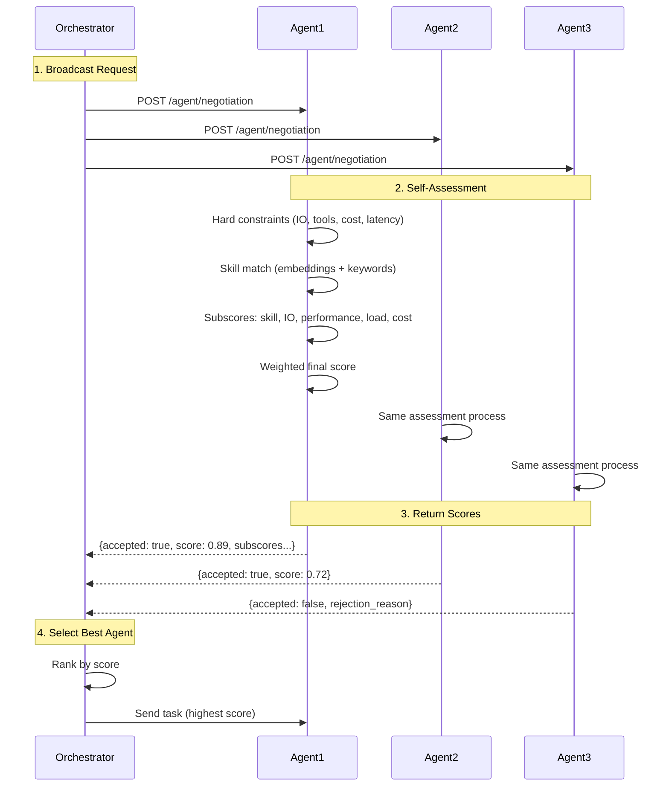
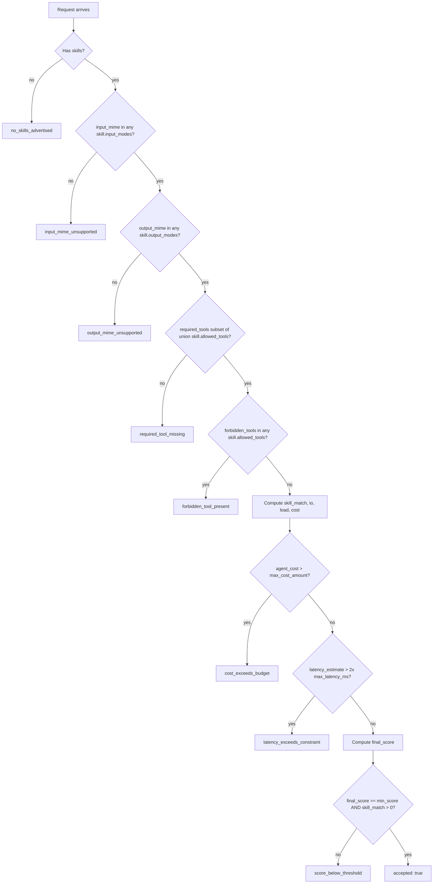

You have three research agents on the network. Two are good, one is overloaded, one charges 5x more than the others. Static routing — "always send research tasks to Agent A" — works until Agent A goes down or starts dropping quality on a topic outside its training.

Negotiation flips the question. Instead of the orchestrator guessing who's best, it asks each candidate to score itself against the task. The agent looks at its own skills, queue depth, latency profile, and (if x402 is enabled) price, and replies with an `accepted` flag, a numeric `score`, and a per-skill reasoning trail. The orchestrator ranks the replies and picks one.

The endpoint is `POST /agent/negotiation`. It's public — no auth, no DID handshake — so any orchestrator on the network can probe an agent before sending a real task.

<Note>
  Bindu ships the **client side** only: each agent self-assesses against an incoming
  negotiation request. The broadcast-and-rank logic lives in the orchestrator, which is
  out of scope for the runtime. See [Custom orchestrator](#custom-orchestrator) below for
  a minimal implementation.
</Note>

## How Bindu Negotiation Works

The agent owns the scoring. It knows its skills, its queue, its latency history, its prices. The orchestrator just asks the question and ranks the answers.

### The Negotiation Model

```text
broadcast request -> per-agent self-assessment -> ranking -> selection
```

| Static routing | Negotiation |
| --- | --- |
| Orchestrator hardcodes "send X to agent A" | Orchestrator asks "who can do X?" |
| Breaks when A is overloaded or down | Live load and latency feed the score |
| New agents need router config changes | New agents advertise skills and join the pool |
| Single point of failure | Per-request fan-out across candidates |
| No visibility into why A was chosen | Response includes subscores and matched skills |

<CardGroup cols={3}>
  <Card title="Adaptive" icon="code-branch">
    Selection can change per request instead of being fixed in advance.
  </Card>
  <Card title="Explainable" icon="shield-check">
    Responses include per-component subscores and per-skill match reasoning, not a
    black-box yes or no.
  </Card>
  <Card title="Efficient" icon="gauge">
    Hard constraints reject early. Only candidates that survive the gate compute a full
    score.
  </Card>
</CardGroup>

### The Lifecycle: Broadcast, Assess, Select



<Steps>
  <Step title="Broadcast">
    The orchestrator POSTs the same assessment request to every candidate URL. Only
    `task_summary` is required — everything else (IO types, tools, latency budget, cost
    cap, weights) is optional and turns into either a hard gate or a soft score.

    <CodeGroup>
      ```bash Request
      POST /agent/negotiation
      Content-Type: application/json

      {
        "task_summary": "Extract tables from PDF invoices",
        "task_details": "Process invoice PDFs and extract structured data",
        "input_mime_types": ["application/pdf"],
        "output_mime_types": ["application/json"],
        "required_tools": ["pdf_parser"],
        "forbidden_tools": ["web_search"],
        "max_latency_ms": 5000,
        "max_cost_amount": "0.001",
        "min_score": 0.7,
        "weights": {
          "skill_match": 0.55,
          "io_compatibility": 0.20,
          "performance": 0.15,
          "load": 0.05,
          "cost": 0.05
        }
      }
      ```

      ```text Fields
      task_summary       - Required. Brief description of the task (max 10000 chars).
      task_details       - Optional longer description; folded into keyword + embedding match.
      input_mime_types   - Hard gate. Reject if no skill declares any of these in input_modes.
      output_mime_types  - Hard gate. Reject if no skill declares any of these in output_modes.
      required_tools     - Hard gate. Reject if union of skills.allowed_tools misses any.
      forbidden_tools    - Hard gate. Reject if any skill.allowed_tools contains a forbidden tool.
      max_latency_ms     - Soft: shapes performance subscore. Hard reject only if estimate > 2x.
      max_cost_amount    - Soft if x402 enabled. Hard reject if agent price > cap.
      min_score          - Acceptance threshold. Default 0.0 — must also have skill match > 0.
      weights            - Optional override; auto-normalized to sum to 1.0.
      ```
    </CodeGroup>
  </Step>

  <Step title="Assess">
    The agent runs `CapabilityCalculator.calculate()`. The pipeline is fixed:

    1. **Empty skill list** -> reject with `no_skills_advertised`.
    2. **Hard constraints** -> check IO modes, required tools, forbidden tools. First failure exits with the matching `rejection_reason`.
    3. **Skill match** -> hybrid score per skill (see [Capability matching](#capability-matching)).
    4. **Cost** -> if x402 says the agent's price exceeds `max_cost_amount`, exit with `cost_exceeds_budget`.
    5. **Latency** -> estimate from the skills' `performance.avg_processing_time_ms`. If the estimate exceeds `max_latency_ms * 2`, exit with `latency_exceeds_constraint`.
    6. **Combine** -> weighted average of five subscores.
    7. **Accept** if `final_score >= min_score` **and** at least one skill matched.

    Default weights (from `app_settings.negotiation`):

    ```python
    score = (
        skill_match      * 0.55 +  # capability fit (embeddings + keywords)
        io_compatibility * 0.20 +  # input/output mime support
        performance      * 0.15 +  # estimated latency vs constraint
        load             * 0.05 +  # 1 / (1 + queue_depth)
        cost             * 0.05   # linear discount under cap (if x402)
    )
    ```

    Any caller-supplied `weights` block is normalized to sum to 1.0 — you don't have to
    pre-balance them.
  </Step>

  <Step title="Select">
    The agent returns `accepted`, `score`, `confidence`, per-skill `skill_matches`, and a
    `subscores` breakdown. The orchestrator filters by `accepted`, applies its own policy
    (highest score, cheapest above threshold, lowest queue, etc.), and sends the actual
    task to the winner.

    <CodeGroup>
      ```json Response (accepted)
      {
        "accepted": true,
        "score": 0.89,
        "confidence": 0.95,
        "skill_matches": [
          {
            "skill_id": "pdf-processing-v1",
            "skill_name": "PDF Processing",
            "score": 0.92,
            "reasons": [
              "semantic similarity: 0.95",
              "tags: pdf, tables, extraction",
              "capabilities: text_extraction, table_extraction"
            ]
          }
        ],
        "matched_tags": ["pdf", "tables", "extraction"],
        "matched_capabilities": ["text_extraction", "table_extraction"],
        "latency_estimate_ms": 2000,
        "queue_depth": 2,
        "subscores": {
          "skill_match": 0.92,
          "io_compatibility": 1.0,
          "performance": 0.85,
          "load": 0.3333,
          "cost": 1.0
        }
      }
      ```

      ```json Response (rejected)
      {
        "accepted": false,
        "score": 0.0,
        "confidence": 1.0,
        "rejection_reason": "required_tool_missing"
      }
      ```

      ```text Fields
      accepted             - Final accept/reject decision.
      score                - Weighted final score in [0, 1].
      confidence           - Agent's self-assessed data-quality confidence (base 0.5 + boosts).
      rejection_reason     - One of: no_skills_advertised, input_mime_unsupported,
                             output_mime_unsupported, required_tool_missing,
                             forbidden_tool_present, cost_exceeds_budget,
                             latency_exceeds_constraint, score_below_threshold.
      skill_matches        - Ranked per-skill matches with reasoning strings.
      matched_tags         - Tags that intersected the task's keyword set.
      matched_capabilities - capabilities_detail keys that intersected.
      latency_estimate_ms  - max(skill.performance.avg_processing_time_ms) or 5000 default.
      queue_depth          - Count of tasks currently in non-terminal states.
      subscores            - Per-component breakdown that produced score.
      ```
    </CodeGroup>
  </Step>
</Steps>

---

## Capability matching

Skill match is the largest weight (55%) and the most interesting part of the pipeline. It runs as a hybrid:

```python
# Per skill, when an OpenRouter key is configured:
base = 0.7 * cosine(task_embedding, skill_embedding)  # semantic
     + 0.3 * jaccard(task_keywords, skill_keywords)   # exact tokens

# Then per-skill assessment block can boost:
if specialization.domain in task_summary.lower():
    base = min(1.0, base + specialization.confidence_boost)

# Anti-patterns short-circuit the skill out of the pool:
if any(pattern in task_text for pattern in skill.assessment.anti_patterns):
    skip this skill entirely
```

Without an OpenRouter key, the embedding term is dropped and the score is pure Jaccard over keywords. The pipeline still works — it just gets less forgiving on paraphrased tasks.

<Info>
  Embeddings come from OpenRouter (`text-embedding-3-small` by default). Skill embeddings
  are computed once on first request and cached on the agent. Task embeddings are cached
  in a per-instance LRU (max 1000 entries) so identical follow-ups don't re-hit the API.
</Info>

### What the agent embeds per skill

The `SkillEmbedder` builds a single string from each skill's `name`, `description`, `tags`, `assessment.keywords`, and the keys of `capabilities_detail`. That string is what gets compared against the embedded `task_summary + task_details`.

### Keyword extraction

Both the task and each skill are tokenized with `re.split(r"[^a-z0-9]+", ...)`, lowercased, and filtered to tokens of length 2-100. Jaccard similarity (`|A ∩ B| / |A ∪ B|`) gives a deterministic, no-network fallback.

### Confidence

A separate signal from `score`. Confidence starts at 0.5 and gains:

- +0.2 if best skill match > 0.3, else +0.1 if any match exists
- +0.1 each for IO constraints, latency constraint, and queue depth being present in the request

It tells the orchestrator how much data the agent had to work with — not how good the fit is.

---

## Hard constraints and rejection

Hard constraints reject before any scoring happens. The full list:



<Note>
  The latency gate uses a 2x multiplier. Saying `max_latency_ms: 5000` rejects only when
  the agent's estimated latency exceeds 10000 ms. Everything between 5000 and 10000 ms
  passes the gate but contributes a lower `performance` subscore.
</Note>

---

## Configuration

### Enable negotiation on an agent

```python
config = {
    "name": "my_agent",
    "skills": ["skills/pdf-processing"],
    "capabilities": {
        "negotiation": True,        # turns on /agent/negotiation auto-enrichment
        "push_notifications": True, # required by the enricher branch for negotiation
    },
    "negotiation": {
        "embedding_api_key": os.getenv("OPENROUTER_API_KEY"),
    },
}
```

When `capabilities.negotiation` is `True`, Bindu reads `OPENROUTER_API_KEY` from the environment and injects it into `negotiation.embedding_api_key` if you haven't set it explicitly. With no key configured, the calculator silently falls back to keyword-only matching.

<Info>
  The `/agent/negotiation` route is always mounted — it doesn't require the capability
  flag to respond. The flag controls config enrichment (auto-loading the OpenRouter key).
  An agent that omits the flag but sets the key directly still gets full embedding-backed
  matching.
</Info>

### Authoring skills for good matches

Skill metadata is what the agent has to score against. Two fields move the needle most:

```yaml
# skill.yaml
id: pdf-processing-v1
name: PDF Processing
description: Extracts tables and text from invoice and report PDFs
tags: [pdf, tables, extraction, invoice, ocr]
input_modes: [application/pdf]
output_modes: [application/json]

capabilities_detail:
  text_extraction:
    supported: true
    types: [standard, ocr]
  table_extraction:
    supported: true

allowed_tools: [pdf_parser, ocr]

performance:
  avg_processing_time_ms: 2000      # feeds latency_estimate_ms

assessment:
  keywords: [pdf, extract, invoice, table, document]
  specializations:
    - domain: invoice_processing
      confidence_boost: 0.3          # added to base when 'invoice_processing' appears in task
  anti_patterns:
    - pdf editing                    # task mentioning these makes the skill bow out
    - create pdf
```

The `assessment` block is the lever. Keywords beef up the keyword side of the hybrid score, `specializations` give you targeted boosts when a domain phrase shows up in the task, and `anti_patterns` are how you opt out of tasks you'd technically match on tags but actually can't do well.

### Environment variables

```bash
# Auto-injected when capabilities.negotiation is enabled
OPENROUTER_API_KEY=sk-or-v1-your-key-here

# Or set directly via NEGOTIATION__ prefix
NEGOTIATION__EMBEDDING_API_KEY=sk-or-v1-your-key-here
NEGOTIATION__EMBEDDING_MODEL=text-embedding-3-small
NEGOTIATION__USE_EMBEDDINGS=true

# Weight overrides (all are normalized at runtime)
NEGOTIATION__SKILL_MATCH_WEIGHT=0.55
NEGOTIATION__IO_COMPATIBILITY_WEIGHT=0.20
NEGOTIATION__PERFORMANCE_WEIGHT=0.15
NEGOTIATION__LOAD_WEIGHT=0.05
NEGOTIATION__COST_WEIGHT=0.05

# Hybrid match tuning
NEGOTIATION__EMBEDDING_WEIGHT=0.7
NEGOTIATION__KEYWORD_WEIGHT=0.3
```

---

## Asking "who can do X?"

### curl

```bash
curl -sS -X POST http://localhost:3773/agent/negotiation \
  -H 'Content-Type: application/json' \
  -d '{
    "task_summary": "Translate technical manual to Spanish",
    "input_mime_types": ["text/plain"],
    "output_mime_types": ["text/plain"],
    "max_latency_ms": 8000,
    "min_score": 0.6
  }' | jq
```

### Python orchestrator

A minimum-viable orchestrator: fan out, filter rejections, rank, return the winner.

```python
import asyncio
import httpx

async def probe(client, url, payload):
    try:
        r = await client.post(f"{url}/agent/negotiation", json=payload, timeout=5)
        if r.status_code == 200:
            return {"url": url, **r.json()}
    except Exception:
        return None

async def find_best_agent(task_summary, agent_urls, min_score=0.6):
    payload = {"task_summary": task_summary, "min_score": min_score}
    async with httpx.AsyncClient() as client:
        results = await asyncio.gather(
            *[probe(client, u, payload) for u in agent_urls]
        )
    accepted = [r for r in results if r and r.get("accepted")]
    if not accepted:
        return None
    return max(accepted, key=lambda r: r["score"])

best = asyncio.run(find_best_agent(
    "Extract tables from PDF invoice",
    ["http://agent1:3773", "http://agent2:3773", "http://agent3:3773"],
))
print(best["url"], best["score"])
```

---

## Real-world use cases

<AccordionGroup>
  <Accordion title="Multi-agent translation">
    Query every translation agent in parallel. The specialist with matching domain
    keywords (e.g. `technical_translation` in `specializations`) bubbles up over the
    generalist even with a deeper queue.

    ```text
    Agent 1: accepted=true,  score=0.98  (technical specialist, queue=2)
    Agent 2: accepted=true,  score=0.82  (general translator, queue=0)
    Agent 3: accepted=false, reason=score_below_threshold (no technical specialization)
    ```
  </Accordion>

  <Accordion title="Cost-aware routing with x402">
    When an agent advertises a price via the `x402` capability, the `cost` subscore
    becomes meaningful. Set `max_cost_amount` to your budget and the agent rejects with
    `cost_exceeds_budget` if it can't fit. Among the survivors, pick by your own rule —
    cheapest, fastest, highest score.

    ```python
    accepted = [r for r in results if r and r["accepted"] and r["score"] > 0.8]
    cheapest = min(accepted, key=lambda r: r["subscores"]["cost"])
    ```
  </Accordion>

  <Accordion id="custom-orchestrator" title="Custom orchestrator">
    The orchestrator is yours to write. Bindu doesn't ship one — it ships the side of the
    protocol that lets any agent answer the question honestly. Re-rank by custom
    business rules without changing agents:

    ```python
    # Prefer agents with lower queue depth among those above the quality bar
    candidates = [r for r in results if r and r["accepted"] and r["score"] > 0.75]
    pick = min(candidates, key=lambda r: r.get("queue_depth", 0))
    ```
  </Accordion>

  <Accordion title="Gateway routing">
    The Bindu gateway is stateless and forwards by agent ID — it does not orchestrate
    negotiation. If you want capability-based routing in front of the gateway, run a
    thin orchestrator that calls `/agent/negotiation` on each candidate and forwards the
    real task to the winner via the gateway as usual.
  </Accordion>
</AccordionGroup>

---

## Edge cases & FAQ

<AccordionGroup>
  <Accordion title="What happens when no agent accepts?">
    Each agent returns `accepted: false` with a specific `rejection_reason`. The
    orchestrator's job is to either fall back to a relaxed query (drop `min_score`, drop
    `required_tools`), pick the highest-scoring rejection anyway and accept the risk, or
    surface the failure to the caller. The agent itself takes no further action.
  </Accordion>

  <Accordion title="What if I send no skills?">
    The calculator returns `accepted: false, rejection_reason: "no_skills_advertised"`
    immediately. No scoring runs. Negotiation requires that the agent has declared at
    least one `Skill` in its manifest.
  </Accordion>

  <Accordion title="What if I don't have an OpenRouter key?">
    `use_embeddings` stays on, but the lazy load fails the first time it's needed, logs
    a warning, and flips the flag off. The pipeline degrades to pure keyword (Jaccard)
    matching. You lose paraphrase resilience but the endpoint stays functional.
  </Accordion>

  <Accordion title="How is queue_depth measured?">
    The endpoint asks the task manager's storage layer for all tasks and counts the ones
    whose `status.state` is in `app_settings.agent.non_terminal_states`. So a busy agent
    actually scores lower on `load` — the formula is `1 / (1 + queue_depth)`, which goes
    from 1.0 at idle to 0.5 at one in-flight to 0.33 at two, and so on.
  </Accordion>

  <Accordion title="Can the agent lie?">
    Yes. Self-assessment is a trust contract, not a proof. The orchestrator should track
    actual outcomes (latency, success rate) and either down-rank dishonest agents or
    publish reputation back into selection. Bindu does not enforce honesty in the
    response — the protocol just exposes the agent's claim.
  </Accordion>

  <Accordion title="Is /agent/negotiation authenticated?">
    No. It's in the public-endpoints allowlist alongside `/agent/info` and
    `/.well-known/agent.json`. Anyone reachable on the network can probe. If that's not
    OK for your deployment, front the agent with a gateway or proxy that gates the
    route.
  </Accordion>
</AccordionGroup>

---

## Design principles

<CardGroup cols={3}>
  <Card title="Honest" icon="certificate">
    Agents score themselves with real data — queue depth from storage, latency from
    skill metadata, price from the x402 extension. Inflating scores is technically
    possible but observably wrong over time.
  </Card>
  <Card title="Weighted" icon="scale-balanced">
    Orchestrators tune weights per request. Same agent, same skills, different ranking
    depending on whether you want speed, fit, or cost.
  </Card>
  <Card title="Composable" icon="boxes-stacked">
    The endpoint is one POST with one JSON body. Build the orchestrator however you
    like — broadcast, two-phase, hedged requests, reputation-weighted.
  </Card>
</CardGroup>

---

## Related

- [Skills](/bindu/skills/introduction/overview)
- [Scheduler](/bindu/learn/scheduler/overview)
- [Observability](/bindu/learn/observability/overview)

<span className="brand-quote">
  

  <span className="brand-quote-text">
    Bindu enables agents to negotiate like sunflowers —{" "}
    <span className="brand-quote-highlight">independent in stance</span>, yet
    aligned in trust across the Internet of Agents.
  </span>
</span>
