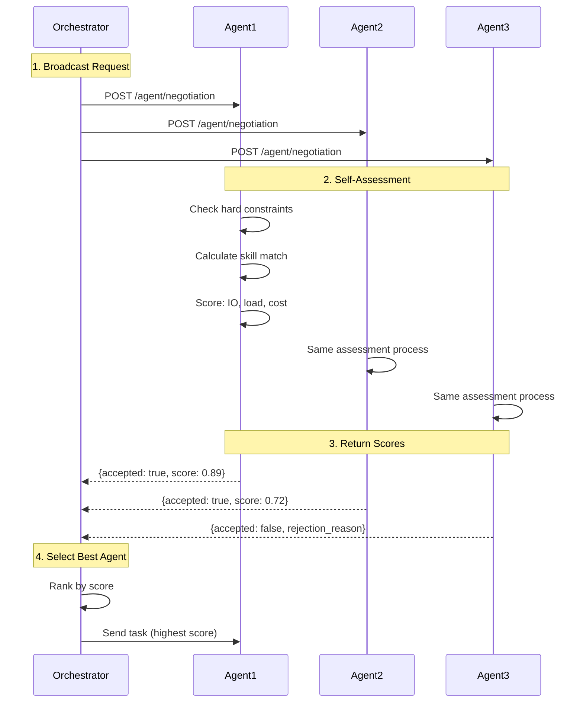

You have three research agents on the network. Two are good, one is overloaded, and one charges 5x more than the others. The orchestrator needs to pick one. Static routing — "always send research tasks to Agent A" — works until Agent A goes down or starts dropping quality on a topic outside its training.

Negotiation flips the question. Instead of the orchestrator guessing who's best, it asks. Each candidate agent receives the task, looks at its own load, skills, cost, and confidence, and replies with a bid: "I can do this for X USDC, in Y seconds, with Z% confidence." The orchestrator picks the best fit or declines them all.

The protocol is Bindu-specific (marked `<NotPartOfA2A>` in the type system) but rides on the same A2A transport. No special infrastructure. Just a few extra message kinds.

## How Bindu Negotiation Works

Bindu's negotiation system enables orchestrators to query multiple agents and select the best one for a task based on skills, performance, load, and cost.

### The Negotiation Model

Bindu uses a simple decision pattern:

```text
broadcast request -> self-assessment -> ranking -> selection
```

The model stays readable to developers while still giving agents room to make nuanced decisions:

- The orchestrator asks multiple agents for an assessment
- Each agent evaluates hard constraints and fit
- The response returns acceptance, score, and reasoning
- The orchestrator ranks responses and sends the task to the strongest match

<CardGroup cols={3}>
  <Card title="Adaptive" icon="code-branch">
    Agent selection can change per request instead of being fixed in advance.
  </Card>
  <Card title="Explainable" icon="shield-check">
    Responses include scores, subscores, and skill reasoning rather than a black-box
    yes or no.
  </Card>
  <Card title="Efficient" icon="gauge">
    Orchestrators can avoid weak matches early and send work to the best-fit agent
    faster.
  </Card>
</CardGroup>

### The Lifecycle: Broadcast, Assess, Select



<Steps>
  <Step title="Broadcast">
    The orchestrator sends the same assessment request to multiple candidate agents.

    The request includes the task summary, input and output expectations, tool
    requirements, latency and cost constraints, and an optional scoring model.

    <CodeGroup>
      ```bash Request
      POST /agent/negotiation
      Content-Type: application/json

      {
        "task_summary": "Extract tables from PDF invoices",
        "task_details": "Process invoice PDFs and extract structured data",
        "input_mime_types": ["application/pdf"],
        "output_mime_types": ["application/json"],
        "required_tools": ["pdf_parser"],
        "forbidden_tools": ["web_search"],
        "max_latency_ms": 5000,
        "max_cost_amount": "0.001",
        "min_score": 0.7,
        "weights": {
          "skill_match": 0.55,
          "io_compatibility": 0.20,
          "performance": 0.15,
          "load": 0.05,
          "cost": 0.05
        }
      }
      ```

      ```text Fields
      task_summary       - Brief description of the task
      task_details       - Detailed requirements (optional)
      input_mime_types   - Expected input formats
      output_mime_types  - Expected output formats
      required_tools     - Tools the task requires (causes rejection if missing)
      forbidden_tools    - Tools that must not be present (causes rejection if present)
      max_latency_ms     - Maximum acceptable latency
      max_cost_amount    - Budget constraint
      min_score          - Minimum confidence threshold
      weights            - Custom scoring weights (optional)
      ```
    </CodeGroup>
  </Step>

  <Step title="Assess">
    Each agent runs a self-assessment. It first checks hard constraints such as
    supported tools or input/output compatibility, then scores softer dimensions like
    fit, performance, load, and cost.

    The default weighted formula is:

    ```python
    score = (
        skill_match * 0.55 +        # Primary: capability matching
        io_compatibility * 0.20 +   # Input/output format support
        performance * 0.15 +        # Speed and reliability
        load * 0.05 +               # Current availability
        cost * 0.05                 # Pricing
    )
    ```

    An agent can reject cleanly on hard constraints, or accept and explain how strong
    the fit actually is.
  </Step>

  <Step title="Select">
    Agents return acceptance, score, confidence, and supporting reasoning. The
    orchestrator ranks the candidates and chooses the best one.

    <CodeGroup>
      ```json Response
      {
        "accepted": true,
        "score": 0.89,
        "confidence": 0.95,
        "skill_matches": [
          {
            "skill_id": "pdf-processing-v1",
            "skill_name": "PDF Processing",
            "score": 0.92,
            "reasons": [
              "semantic similarity: 0.95",
              "tags: pdf, tables, extraction",
              "capabilities: text_extraction, table_extraction"
            ]
          }
        ],
        "matched_tags": ["pdf", "tables", "extraction"],
        "matched_capabilities": ["text_extraction", "table_extraction"],
        "latency_estimate_ms": 2000,
        "queue_depth": 2,
        "subscores": {
          "skill_match": 0.92,
          "io_compatibility": 1.0,
          "performance": 0.85,
          "load": 0.90,
          "cost": 1.0
        }
      }
      ```

      ```text Fields
      accepted           - Whether agent can handle the task
      rejection_reason   - Reason for rejection when accepted=false
      score              - Overall confidence score (0-1)
      confidence         - Agent's self-assessed confidence
      skill_matches      - Matched skills with reasoning
      matched_tags       - Tags that aligned with the request
      matched_capabilities - Capabilities that aligned
      latency_estimate_ms - Expected processing time
      queue_depth        - Current task queue size
      subscores          - Breakdown of scoring factors
      ```
    </CodeGroup>
  </Step>
</Steps>

---

## Configuration

### Enable Negotiation

```python
config = {
    "name": "my_agent",
    "skills": ["skills/pdf-processing"],
    "negotiation": {
        "embedding_api_key": os.getenv("OPENROUTER_API_KEY"),
    }
}
```

When the embedding API key is present, skill matching uses semantic similarity in addition to exact tag matching.

### Environment Variables

```bash
# Primary: auto-injected when negotiation capability is enabled
OPENROUTER_API_KEY=sk-or-v1-your-key-here

# Alternative: set directly via nested settings
NEGOTIATION__EMBEDDING_API_KEY=sk-or-v1-your-key-here
```

---

## Negotiation Design Principles

<CardGroup cols={3}>
  <Card title="Honest" icon="certificate">
    Agents should score themselves realistically instead of over-claiming capability.
  </Card>
  <Card title="Weighted" icon="scale-balanced">
    Orchestrators can tune weights to favor quality, latency, load, or cost.
  </Card>
  <Card title="Composable" icon="boxes-stacked">
    Negotiation fits naturally into orchestration layers that query many agents at once.
  </Card>
</CardGroup>

---

## Real-World Use Cases

<AccordionGroup>
  <Accordion title="Multi-agent translation">
    An orchestrator can query many translation agents at once, compare specialization
    and queue depth, and send the work to the strongest candidate.

    ```bash
    # Query multiple translation agents
    for agent in translation-agents:
      curl http://$agent:3773/agent/negotiation \
        -d '{"task_summary": "Translate technical manual to Spanish"}'

    # Responses ranked by orchestrator:
    # Agent 1: score=0.98 (technical specialist, queue=2)
    # Agent 2: score=0.82 (general translator, queue=0)
    # Agent 3: score=0.65 (no technical specialization)
    ```
  </Accordion>

  <Accordion title="Cost optimization">
    Negotiation can be used to find the cheapest acceptable agent instead of simply the
    highest-quality one.

    ```python
    agents = [a for a in query_all_agents(task) if a.score > 0.8]
    cheapest = min(agents, key=lambda a: a.cost)
    ```
  </Accordion>

  <Accordion title="Custom orchestrator selection">
    Orchestrators can collect negotiation responses directly and apply their own
    business logic before assigning the final task.

    ```python
    import httpx

    async def find_best_agent(task_summary, agent_urls):
        responses = []

        async with httpx.AsyncClient() as client:
            for url in agent_urls:
                try:
                    resp = await client.post(
                        f"{url}/agent/negotiation",
                        json={"task_summary": task_summary}
                    )
                    if resp.status_code == 200:
                        responses.append({"url": url, "data": resp.json()})
                except Exception as e:
                    print(f"Agent {url} failed: {e}")

        if not responses:
            return None

        best = max(responses, key=lambda r: r["data"]["score"])
        return best["url"]

    best_agent = await find_best_agent(
        "Extract tables from PDF invoice",
        ["http://agent1:3773", "http://agent2:3773"]
    )
    ```
  </Accordion>
</AccordionGroup>

---

## Security Best Practices

<CardGroup cols={2}>
  <Card title="Score Honestly" icon="shield">
    Agents should return realistic confidence and capability scores instead of
    inflating their fit.
  </Card>
  <Card title="Use Thresholds" icon="sliders">
    Orchestrators should set minimum score thresholds and fallback paths instead of
    accepting every response.
  </Card>
</CardGroup>

---

## Related

- [Skills](/bindu/skills/introduction/overview)
- [Scheduler](/bindu/learn/scheduler/overview)
- [Observability](/bindu/learn/observability/overview)

<span className="brand-quote">
  

  <span className="brand-quote-text">
    Bindu enables agents to negotiate like sunflowers —{" "}
    <span className="brand-quote-highlight">independent in stance</span>, yet
    aligned in trust across the Internet of Agents.
  </span>
</span>
