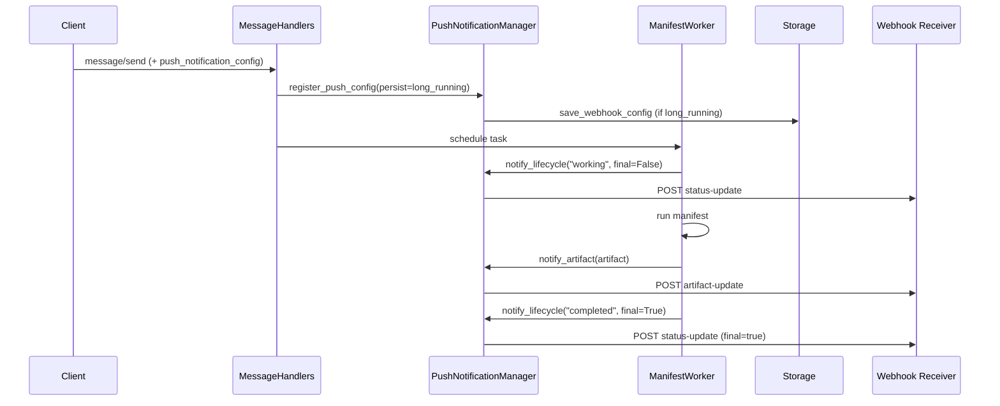

Your agent kicks off a job that takes 8 minutes. The caller has two bad options: hold the HTTP connection open for 8 minutes (and watch it die to a proxy timeout at minute 6), or poll `tasks/get` every few seconds (and discover that 95% of those calls return "still working").

Webhooks fix it. The caller registers a URL once, then goes about their day. When the task transitions — `working`, `input-required`, `completed`, `failed`, and so on — Bindu `POST`s a signed JSON event to that URL. One notification per real event. Zero wasted requests.

This follows the [A2A Protocol push notification spec](https://a2a-protocol.org/latest/specification/), so any A2A-compliant client can subscribe without custom code.

<Note>
  Use webhooks when a task may outlive a normal request timeout — minutes, hours, or days.
  For sub-second responses, just keep the connection open and skip this entirely.
</Note>

## Push vs polling

<CardGroup cols={2}>
  <Card title="Polling (tasks/get)" icon="rotate">
    Client decides cadence. Wastes requests. Latency = poll interval. Works
    everywhere, no inbound port required on the client.
  </Card>
  <Card title="Push (this doc)" icon="bell">
    Server decides cadence. One event per real state change. Sub-second latency.
    Client must expose an HTTPS endpoint Bindu can reach.
  </Card>
</CardGroup>

| Property | Polling | Push |
|---|---|---|
| Requests per task | Many (one per poll) | One per state change |
| Worst-case latency | Poll interval | Network RTT |
| Client must accept inbound HTTP | No | Yes |
| Survives server restart | Trivially | Only if `long_running=true` |
| Auth direction | Client authenticates server | Server authenticates to client (`Bearer` token) |

---

## How it works

<CardGroup cols={3}>
  <Card title="Per-task or global" icon="link">
    Register a webhook per task at `message/send`, or set one `global_webhook_url`
    on the manifest that catches everything else.
  </Card>
  <Card title="Persistent" icon="database">
    When the caller sets `long_running=true`, the webhook config is written to
    storage and reloaded on startup, so notifications survive restarts.
  </Card>
  <Card title="SSRF-hardened" icon="shield-check">
    Bindu resolves the webhook hostname once, refuses private / loopback /
    metadata IPs, and connects directly to the resolved address — no DNS-rebinding
    window between validation and delivery.
  </Card>
</CardGroup>



<Steps>
  <Step title="Subscribe">
    Send `push_notification_config` inline with `message/send`, or call
    `tasks/pushNotificationConfig/set` later. Add `long_running: true` if you
    need the subscription to survive a Bindu restart.
  </Step>

  <Step title="Execute">
    `ManifestWorker` runs the task. Every state transition and every artifact
    flush hits `PushNotificationManager`.
  </Step>

  <Step title="Deliver">
    `NotificationService.send_event` validates the URL, JSON-encodes the event
    (`default=str` for UUIDs/datetimes), POSTs with `Authorization: Bearer <token>`,
    and retries transient failures up to 3 attempts with exponential backoff.
  </Step>
</Steps>

---

## Quick start

### 1. Declare the capability

```python
from bindu.penguin.manifest import bindufy

config = {
    "name": "data-processor",
    "capabilities": {"push_notifications": True},   # required
    "global_webhook_url": "https://myapp.com/webhooks/global",  # optional fallback
    "global_webhook_token": "global_secret_token",              # optional
}

bindufy(config, handler)
```

<Info>
  `WEBHOOK_URL` and `WEBHOOK_TOKEN` environment variables auto-populate
  `global_webhook_url` / `global_webhook_token` when `push_notifications` is
  enabled, so you can keep secrets out of code.
</Info>

### 2. Send a task with a webhook

```python
import requests
from uuid import uuid4

resp = requests.post("http://localhost:3773/", json={
    "jsonrpc": "2.0",
    "id": "req-1",
    "method": "message/send",
    "params": {
        "message": {
            "message_id": str(uuid4()),
            "task_id": str(uuid4()),
            "context_id": str(uuid4()),
            "kind": "message",
            "role": "user",
            "parts": [{"kind": "text", "text": "Process large dataset"}],
        },
        "configuration": {
            "accepted_output_modes": ["application/json"],
            "long_running": True,
            "push_notification_config": {
                "id": str(uuid4()),
                "url": "https://myapp.com/webhooks/task-updates",
                "token": "secret_abc123",
            },
        },
    },
})
print(resp.json()["result"]["id"])
```

### 3. Receive events

```python
from fastapi import FastAPI, Request, Header, HTTPException

app = FastAPI()
EXPECTED = "Bearer secret_abc123"

@app.post("/webhooks/task-updates")
async def handle(request: Request, authorization: str = Header(None)):
    if authorization != EXPECTED:
        raise HTTPException(401)

    event = await request.json()
    kind = event["kind"]

    if kind == "status-update":
        state = event["status"]["state"]
        print(f"task {event['task_id']} -> {state}")
        # input-required / auth-required carry the prompt in status.message
        if state in ("input-required", "auth-required"):
            msg = event["status"].get("message", {})
            print("agent asks:", msg.get("parts", [{}])[0].get("text"))
        if event["final"]:
            print("terminal")

    elif kind == "artifact-update":
        print("artifact:", event["artifact"].get("name"))

    return {"ok": True}
```

<Note>
  If `capabilities.push_notifications` is missing or `False`, every push RPC
  returns JSON-RPC error `-32005` (`PushNotificationNotSupportedError`) and no
  events fire. Enable the capability first.
</Note>

---

## Events Bindu actually emits

Bindu does not emit a `submitted` event. `submitted` is the initial database state set when a task is accepted; the first webhook you ever receive is `working`. Every event is a JSON-RPC-free POST body — no envelope, just the event object.

### Common envelope

Every event carries the same top-level fields:

```json
{
  "event_id": "550e8400-e29b-41d4-a716-446655440000",
  "sequence": 1,
  "timestamp": "2026-05-18T08:00:00.123456+00:00",
  "kind": "status-update",
  "task_id": "123e4567-e89b-12d3-a456-426614174000",
  "context_id": "789e0123-e89b-12d3-a456-426614174000"
}
```

- `event_id` — unique per emission; use it to deduplicate on the receiver.
- `sequence` — monotonically increasing per task, starting at 1. Use to detect out-of-order delivery.
- `timestamp` — ISO 8601, UTC, microsecond precision.

<AccordionGroup>
  <Accordion title="status-update — working">
    Emitted when the worker picks the task up and transitions out of `submitted`.

    ```json
    {
      "event_id": "...",
      "sequence": 1,
      "timestamp": "2026-05-18T08:00:00.123456+00:00",
      "kind": "status-update",
      "task_id": "...",
      "context_id": "...",
      "status": {
        "state": "working",
        "timestamp": "2026-05-18T08:00:00.123456+00:00"
      },
      "final": false
    }
    ```
  </Accordion>

  <Accordion title="status-update — input-required / auth-required">
    Emitted when the agent needs more from the user before it can continue.
    The agent's prompt is embedded inside `status.message` as an A2A `Message`
    so operator-facing clients (like the Bindu inbox) can show it directly.

    ```json
    {
      "event_id": "...",
      "sequence": 2,
      "timestamp": "2026-05-18T08:01:00.000000+00:00",
      "kind": "status-update",
      "task_id": "...",
      "context_id": "...",
      "status": {
        "state": "input-required",
        "timestamp": "2026-05-18T08:01:00.000000+00:00",
        "message": {
          "role": "agent",
          "kind": "message",
          "parts": [{"kind": "text", "text": "Which date range should I use?"}]
        }
      },
      "final": false
    }
    ```

    Same shape applies for `auth-required` and any future intermediate state
    that passes a `status_message` through.
  </Accordion>

  <Accordion title="artifact-update">
    Emitted for each artifact the task produces, fired *after* the task has been
    persisted to storage (outbox pattern — the DB write commits before the
    notification leaves, so the webhook never references state that isn't yet
    durable).

    ```json
    {
      "event_id": "...",
      "sequence": 3,
      "timestamp": "2026-05-18T08:05:00.000000+00:00",
      "kind": "artifact-update",
      "task_id": "...",
      "context_id": "...",
      "artifact": {
        "artifact_id": "456e7890-e89b-12d3-a456-426614174000",
        "name": "results.json",
        "parts": [
          {"kind": "data", "data": {"records": 10000, "status": "ok"}}
        ]
      }
    }
    ```

    JSON encoding uses `json.dumps(..., default=str)`, so UUIDs and datetimes
    inside the artifact serialize as strings — your receiver should treat
    `artifact_id` as a string, not a UUID type.
  </Accordion>

  <Accordion title="status-update — completed / failed / canceled / rejected">
    Terminal events. `final: true` tells the receiver no more events are coming
    for this `task_id`.

    ```json
    {
      "event_id": "...",
      "sequence": 4,
      "timestamp": "2026-05-18T08:05:01.000000+00:00",
      "kind": "status-update",
      "task_id": "...",
      "context_id": "...",
      "status": {
        "state": "completed",
        "timestamp": "2026-05-18T08:05:01.000000+00:00"
      },
      "final": true
    }
    ```

    Order is: all `artifact-update` events first (for `completed`), then the
    terminal `status-update`.
  </Accordion>
</AccordionGroup>

<Info>
  **States that can appear in a `status-update`:** `working`, `input-required`,
  `auth-required`, `completed`, `failed`, `canceled`, `rejected`. Bindu also
  supports extended states (`payment-required`, `negotiation-bid-submitted`,
  etc.) — these emit the same envelope when the worker transitions to them.
</Info>

---

## Headers sent on every POST

```http
POST /webhooks/task-updates HTTP/1.1
Host: myapp.com
Content-Type: application/json
Authorization: Bearer secret_abc123
```

That's it. There is no HMAC signature header today — authentication is the bearer token. Compare it constant-time on receive.

<Warning>
  Bindu does **not** sign payloads with an HMAC. The bearer token is the only
  authentication signal. If you need stronger integrity, mint a fresh token
  per task and rotate aggressively, or terminate the webhook behind a gateway
  that adds its own signing.
</Warning>

---

## Registration paths

<CardGroup cols={2}>
  <Card title="Inline (recommended)" icon="code">
    Send `push_notification_config` in the `message/send` configuration.
    The subscription exists before the task starts, so no `working` event
    can race past you.
  </Card>
  <Card title="RPC after the fact" icon="link">
    `tasks/pushNotificationConfig/set` — useful for late-binding a webhook
    to an existing task, or rotating the URL/token mid-flight.
  </Card>
</CardGroup>

<AccordionGroup>
  <Accordion title="Inline registration">
    ```json
    {
      "params": {
        "message": { /* ... */ },
        "configuration": {
          "accepted_output_modes": ["application/json"],
          "long_running": true,
          "push_notification_config": {
            "id": "webhook-123",
            "url": "https://myapp.com/webhook",
            "token": "secret_token"
          }
        }
      }
    }
    ```
  </Accordion>

  <Accordion title="Separate RPC registration">
    ```json
    {
      "jsonrpc": "2.0",
      "id": "rpc-7",
      "method": "tasks/pushNotificationConfig/set",
      "params": {
        "id": "task-123",
        "long_running": true,
        "push_notification_config": {
          "id": "webhook-456",
          "url": "https://myapp.com/webhook",
          "token": "secret_token"
        }
      }
    }
    ```

    Only the task owner (the DID that originally submitted the task) may call
    this. A non-owner gets `TaskNotFound` — Bindu does not leak that the task
    exists.
  </Accordion>
</AccordionGroup>

---

## Persistence and fallback

### Long-running tasks

When the caller sets `long_running: true`, `PushNotificationManager` calls
`storage.save_webhook_config(task_id, config)`. On boot, `initialize()` calls
`storage.load_all_webhook_configs()` and reinstalls every subscription before
the worker pool starts accepting tasks.

```
POST / (message/send, long_running=true)
  -> register_push_config(persist=True)
  -> Storage.save_webhook_config
[ server crash + restart ]
  -> PushNotificationManager.initialize()
  -> Storage.load_all_webhook_configs() -> {task_id: config, ...}
  -> notifications resume
```

<Warning>
  If `long_running` is omitted or `false`, the subscription lives in memory
  only. A restart silently drops it and the caller's webhook goes quiet.
</Warning>

### Webhook precedence

`get_effective_webhook_config(task_id)` resolves in this order:

1. Task-specific config registered for `task_id`
2. Manifest `global_webhook_url` (if set)
3. `None` — no delivery, event is dropped silently

---

## API reference

### RPC methods

<CodeGroup>
```json tasks/pushNotificationConfig/set
{
  "jsonrpc": "2.0",
  "id": "1",
  "method": "tasks/pushNotificationConfig/set",
  "params": {
    "id": "task-123",
    "long_running": true,
    "push_notification_config": {
      "id": "webhook-456",
      "url": "https://myapp.com/webhook",
      "token": "secret"
    }
  }
}
```

```json tasks/pushNotificationConfig/get
{
  "jsonrpc": "2.0",
  "id": "2",
  "method": "tasks/pushNotificationConfig/get",
  "params": { "task_id": "task-123" }
}
```

```json tasks/pushNotificationConfig/list
{
  "jsonrpc": "2.0",
  "id": "3",
  "method": "tasks/pushNotificationConfig/list",
  "params": { "id": "task-123" }
}
```

```json tasks/pushNotificationConfig/delete
{
  "jsonrpc": "2.0",
  "id": "4",
  "method": "tasks/pushNotificationConfig/delete",
  "params": {
    "id": "task-123",
    "push_notification_config_id": "webhook-456"
  }
}
```
</CodeGroup>

<Note>
  All four methods enforce caller ownership. If `caller_did` does not match
  the task owner stored at submission, the response is the same as a missing
  task — Bindu refuses to leak existence.
</Note>

### PushNotificationConfig

```python
class PushNotificationConfig(TypedDict):
    id: Required[UUID]            # subscription ID — used for delete
    url: Required[str]            # http or https; private IPs rejected
    token: NotRequired[str]       # sent verbatim as "Authorization: Bearer <token>"
    authentication: NotRequired[SecurityScheme]  # optional richer auth schema
```

---

## Delivery, retries, and failure handling

`NotificationService` lives in `bindu/utils/notifications.py` and handles every
outbound POST. It is not Kafka, not SNS, not a queue — it is a direct HTTP call
wrapped in the unified retry decorator.

| Knob | Value |
|---|---|
| Transport | HTTP/HTTPS POST |
| Timeout | 5 s connect + read |
| Max attempts | 3 |
| Backoff | Exponential, `0.5s → 5s` |
| Retried on | 5xx, 429, connection errors, timeouts |
| Dropped on | 4xx (except 429) — logged and abandoned |
| After exhaustion | Logged, no DLQ, event is lost |

<Warning>
  There is no dead-letter queue. If your endpoint is down for longer than the
  retry window (~10 s with backoff), the event is dropped. Treat webhook
  delivery as *best-effort* and reconcile with `tasks/get` on reconnect for
  anything you cannot afford to miss.
</Warning>

### Why 4xx is dropped

A 4xx means "your request is broken" — replaying it will fail the same way.
Bindu logs at `WARNING` and moves on rather than burning retry budget. `429`
is the exception: it means "slow down," so it gets the full retry treatment.

### SSRF protection (server side, automatic)

Before every POST, `validate_config` does this:

1. Parse the URL; require `http` or `https` scheme and a non-empty netloc.
2. Resolve the hostname via `socket.getaddrinfo` *once*.
3. Reject loopback / private / link-local / metadata addresses.
4. Pass the resolved IP through to the connection layer. The HTTP client
   connects directly to that IP and uses the original hostname only for the
   TLS SNI / cert verification.

This closes the TOCTOU DNS-rebinding window where a malicious DNS server could
return a public IP for validation and a private IP for the actual connection.
You do not need to re-implement any of this on the client.

---

## Receiver patterns

### Verify the token (constant-time)

```python
import hmac
from fastapi import FastAPI, Request, Header, HTTPException

app = FastAPI()
EXPECTED = "Bearer secret_abc123"

@app.post("/webhook")
async def hook(request: Request, authorization: str = Header(None)):
    if not authorization or not hmac.compare_digest(authorization, EXPECTED):
        raise HTTPException(401)
    return await _process(await request.json())
```

### Dedupe by `event_id`, order by `sequence`

```python
seen: set[str] = set()
last_seq: dict[str, int] = {}

async def _process(event):
    eid = event["event_id"]
    if eid in seen:
        return {"ok": True, "dedup": True}
    seen.add(eid)

    tid = event["task_id"]
    if event["sequence"] <= last_seq.get(tid, 0):
        # out-of-order or replay — fold into reconciliation pass, not state
        return {"ok": True, "stale": True}
    last_seq[tid] = event["sequence"]

    # ... do work ...
    return {"ok": True}
```

### Node / Express receiver

```javascript
const express = require("express");
const app = express();
app.use(express.json());

const EXPECTED = "Bearer secret_abc123";

app.post("/webhook", (req, res) => {
  if (req.headers.authorization !== EXPECTED) {
    return res.status(401).json({ error: "unauthorized" });
  }
  const ev = req.body;
  if (ev.kind === "status-update") {
    console.log(`${ev.task_id} -> ${ev.status.state}${ev.final ? " (final)" : ""}`);
  } else if (ev.kind === "artifact-update") {
    console.log(`artifact ${ev.artifact.name} for ${ev.task_id}`);
  }
  res.json({ ok: true });
});

app.listen(8000);
```

### Smoke-test with curl

```bash
curl -X POST https://myapp.com/webhooks/task-updates \
  -H "Authorization: Bearer secret_abc123" \
  -H "Content-Type: application/json" \
  -d '{
    "event_id": "test-1",
    "sequence": 1,
    "timestamp": "2026-05-18T00:00:00+00:00",
    "kind": "status-update",
    "task_id": "11111111-1111-1111-1111-111111111111",
    "context_id": "22222222-2222-2222-2222-222222222222",
    "status": {"state": "working", "timestamp": "2026-05-18T00:00:00+00:00"},
    "final": false
  }'
```

---

## Disabling

Drop `push_notifications` from `capabilities` (or set it to `False`) and all
four RPCs return JSON-RPC error `-32005` (`PushNotificationNotSupportedError`).
No events fire. Callers should fall back to `tasks/get`.

To disable just the global fallback while leaving per-task webhooks intact,
unset `global_webhook_url` (and unset `WEBHOOK_URL` in the environment).

---

## Troubleshooting

<AccordionGroup>
  <Accordion title="Webhook never receives anything">
    Confirm the capability flag is on:

    ```python
    manifest.capabilities["push_notifications"] is True
    ```

    Confirm the subscription is registered:

    ```json
    { "method": "tasks/pushNotificationConfig/get", "params": {"task_id": "task-123"} }
    ```

    If `get` returns `Push notification configuration not found for task.`, the
    inline `push_notification_config` in `message/send` was missing or the task
    completed and the manager has dropped the entry.
  </Accordion>

  <Accordion title="Webhooks vanish after a restart">
    `long_running: true` is required for persistence. Without it the
    subscription is in-memory only.

    ```python
    "configuration": {
        "long_running": True,
        "push_notification_config": {...},
    }
    ```
  </Accordion>

  <Accordion title="Got a 401 from my own webhook">
    Bindu sends exactly `Authorization: Bearer <token>` — token verbatim, no
    extra whitespace. The `token` you registered must match byte-for-byte.
    Compare with `hmac.compare_digest`, not `==`.
  </Accordion>

  <Accordion title="Bindu refuses my webhook URL">
    `validate_config` rejects:

    - Non-`http`/`https` schemes
    - Missing hostname
    - Hostnames that resolve to loopback, private, link-local, or cloud-metadata IPs

    Use a publicly resolvable hostname. For local dev, expose via a tunnel
    rather than pointing at `127.0.0.1` or `10.x.x.x`.
  </Accordion>

  <Accordion title="Duplicate events">
    Bindu emits one event per state change, but a 5xx-then-success retry can
    cause the same `event_id` to appear twice on the wire. Dedupe on
    `event_id` and you are safe.
  </Accordion>

  <Accordion title="Out-of-order events">
    `artifact-update` events fire before the terminal `completed` event by
    design. Within a single TCP-bound `task_id`, follow `sequence` to detect
    reordering caused by retries.
  </Accordion>
</AccordionGroup>

---

## Related

<CardGroup cols={2}>
  <Card title="Retry policy" icon="rotate" href="/bindu/learn/retry/overview">
    How the 3-attempt exponential backoff is wired and how to tune it.
  </Card>
  <Card title="Storage" icon="database" href="/bindu/learn/storage/overview">
    Where `long_running=true` actually persists webhook configs.
  </Card>
  <Card title="Scheduler" icon="calendar" href="/bindu/learn/scheduler/overview">
    The path between `message/send` and the worker that fires events.
  </Card>
  <Card title="A2A spec" icon="link" href="https://a2a-protocol.org/latest/specification/">
    The interop contract this implementation follows.
  </Card>
</CardGroup>

<span className="brand-quote">
  

  <span className="brand-quote-text">
    Bindu turns long-running work into{" "}
    <span className="brand-quote-highlight">
      something clients can follow without polling
    </span>
    , so tasks can keep running while updates keep moving.
  </span>
</span>
