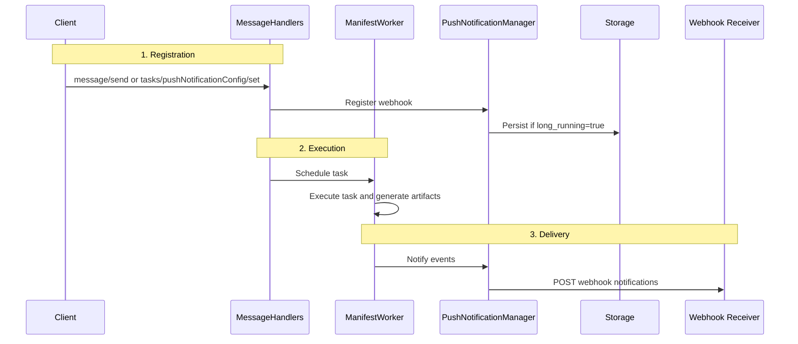

Your agent kicks off a job that takes 8 minutes. The caller has two bad options: hold the HTTP connection open for 8 minutes (and watch it die to a proxy timeout at minute 6), or poll `tasks/get` every few seconds (and discover that 95% of those calls return "still working").

Webhooks fix it. The caller registers a URL once, then goes about their day. When the task's state changes — `working`, `input-required`, `completed`, `failed` — Bindu POSTs an update to that URL. One notification per real event. Zero wasted requests.

This follows the [A2A Protocol push notification spec](https://a2a-protocol.org/latest/specification/), so any A2A-compliant client can talk to it without custom code.

<Note>
  This is for tasks that outlive normal request timeouts. If a task may run for minutes,
  hours, or days, a webhook is usually a better fit than holding the connection open or
  polling every few seconds.
</Note>

## How Bindu Notifications Work

<CardGroup cols={3}>
  <Card title="Persistent" icon="globe">
    Webhook configurations survive server restarts when `long_running=true`.
  </Card>
  <Card title="Flexible" icon="link">
    Webhooks can be registered inline during task creation or later through a separate
    RPC endpoint.
  </Card>
  <Card title="Practical" icon="shield-check">
    Supports task-level webhooks and an agent-level global fallback.
  </Card>
</CardGroup>

### The Lifecycle: Registration, Execution, Delivery



<Steps>
  <Step title="Registration">
    A client creates a task and includes webhook configuration, or registers the webhook
    later through a dedicated RPC method.

    The two supported registration paths are:
    - Inline during `message/send`
    - Separate RPC registration through `tasks/pushNotificationConfig/set`

    If `long_running=true`, the webhook configuration is persisted so it survives
    restarts.
  </Step>

  <Step title="Execution">
    Once the task is scheduled, `ManifestWorker` executes it and generates artifacts as
    usual. The notification path sits alongside execution, not in place of it.

    1. Task Creation — client sends task with webhook configuration
    2. Registration — `MessageHandlers` registers webhook (persists if `long_running=true`)
    3. Execution — `ManifestWorker` executes task
    4. Notification — `PushNotificationManager` sends events to webhook
  </Step>

  <Step title="Delivery">
    `PushNotificationManager` sends notification events to the configured webhook URL
    covering task status changes and artifact generation.

    If the task has no task-specific webhook, the system falls back to a global webhook
    configured at the agent level.
  </Step>
</Steps>

---

## Quick Start

### Enable Push Notifications in Agent Manifest

```python
from bindu.common.models import AgentManifest

manifest = AgentManifest(
    name="Data Processor",
    capabilities={
        "push_notifications": True  # Required
    },
    # Optional: global webhook for all tasks
    global_webhook_url="https://myapp.com/webhooks/global",
    global_webhook_token="global_secret_token",
)
```

### Send Task With Webhook

```python
import requests
from uuid import uuid4

response = requests.post("http://localhost:3773/", json={
    "jsonrpc": "2.0",
    "id": "req-1",
    "method": "message/send",
    "params": {
        "message": {
            "message_id": str(uuid4()),
            "task_id": str(uuid4()),
            "context_id": str(uuid4()),
            "kind": "message",
            "role": "user",
            "parts": [{"kind": "text", "text": "Process large dataset"}]
        },
        "configuration": {
            "accepted_output_modes": ["application/json"],
            "long_running": True,
            "push_notification_config": {
                "id": str(uuid4()),
                "url": "https://myapp.com/webhooks/task-updates",
                "token": "secret_abc123"
            }
        }
    }
})

task = response.json()["result"]
print(f"Task created: {task['id']}")
```

### Implement Webhook Receiver

```python
from fastapi import FastAPI, Request, Header, HTTPException

app = FastAPI()

@app.post("/webhooks/task-updates")
async def handle_task_update(
    request: Request,
    authorization: str = Header(None)
):
    if authorization != "Bearer secret_abc123":
        raise HTTPException(status_code=401, detail="Unauthorized")

    event = await request.json()

    if event["kind"] == "status-update":
        print(f"Task {event['task_id']} state: {event['status']['state']}")
        if event["final"]:
            print("Task completed!")

    elif event["kind"] == "artifact-update":
        print(f"Artifact generated: {event['artifact']['name']}")

    return {"status": "received"}
```

<Note>
  If the agent does not declare `"push_notifications": True`, the rest of the setup does
  not help. The capability has to be enabled first.
</Note>

---

## Notification Events

### Status Update Event

Sent when task state changes (`submitted` → `working` → `completed` / `failed`).

```json
{
  "event_id": "550e8400-e29b-41d4-a716-446655440000",
  "sequence": 1,
  "timestamp": "2025-12-26T08:00:00Z",
  "kind": "status-update",
  "task_id": "123e4567-e89b-12d3-a456-426614174000",
  "context_id": "789e0123-e89b-12d3-a456-426614174000",
  "status": {
    "state": "working",
    "timestamp": "2025-12-26T08:00:00Z"
  },
  "final": false
}
```

Task states: `submitted` · `working` · `input-required` · `auth-required` · `completed` · `failed` · `canceled`

### Artifact Update Event

Sent when artifacts are generated.

```json
{
  "event_id": "550e8400-e29b-41d4-a716-446655440001",
  "sequence": 2,
  "timestamp": "2025-12-26T08:05:00Z",
  "kind": "artifact-update",
  "task_id": "123e4567-e89b-12d3-a456-426614174000",
  "context_id": "789e0123-e89b-12d3-a456-426614174000",
  "artifact": {
    "artifact_id": "456e7890-e89b-12d3-a456-426614174000",
    "name": "results.json",
    "parts": [
      {
        "kind": "data",
        "data": {"status": "success", "records_processed": 10000}
      }
    ]
  }
}
```

<Note>
  Status events tell the client where the task is. Artifact events tell the client what
  the task produced.
</Note>

---

## Registration Paths

<CardGroup cols={2}>
  <Card title="Inline Registration" icon="code">
    Recommended. Register the webhook during `message/send` so it is ready before the
    task starts.
  </Card>
  <Card title="Separate RPC Registration" icon="link">
    Useful when the webhook must be added or updated after the task already exists.
  </Card>
</CardGroup>

<AccordionGroup>
  <Accordion title="Method 1: Inline registration">
    Register the webhook when creating the task.

    ```json
    {
      "params": {
        "message": {},
        "configuration": {
          "accepted_output_modes": ["application/json"],
          "long_running": true,
          "push_notification_config": {
            "id": "webhook-123",
            "url": "https://myapp.com/webhook",
            "token": "secret_token"
          }
        }
      }
    }
    ```

    Advantages: single API call, no race conditions, webhook ready before task starts.
  </Accordion>

  <Accordion title="Method 2: Separate RPC registration">
    Register the webhook after task creation.

    ```json
    {
      "jsonrpc": "2.0",
      "method": "tasks/pushNotificationConfig/set",
      "params": {
        "id": "task-123",
        "long_running": true,
        "push_notification_config": {
          "id": "webhook-456",
          "url": "https://myapp.com/webhook",
          "token": "secret_token"
        }
      }
    }
    ```

    Advantages: can update webhook mid-task, useful for dynamic workflows.
    Disadvantages: two API calls, possible race condition for fast tasks.
  </Accordion>
</AccordionGroup>

---

## Persistence and Fallback

### Persistence Across Restarts

When `long_running=true`, the webhook config is saved to the database and reloaded on startup:

```python
# Before restart
POST / (method: "message/send", long_running=true)
# -> Task created: task-123
# -> Webhook persisted to database
# -> Server restarts

# After restart
# -> TaskManager.initialize() loads webhook for task-123
# -> Task continues executing
# -> Notifications still work
```

### Global Webhook Fallback

```python
manifest = AgentManifest(
    name="My Agent",
    capabilities={"push_notifications": True},
    global_webhook_url="https://myapp.com/webhooks/global",
    global_webhook_token="global_secret"
)
```

Priority order:
1. Task-specific webhook (highest priority)
2. Global webhook (fallback)
3. No webhook (no notifications)

---

## API Reference

### RPC Methods

<CodeGroup>
  ```json tasks/pushNotificationConfig/set
  {
    "jsonrpc": "2.0",
    "method": "tasks/pushNotificationConfig/set",
    "params": {
      "id": "task-123",
      "long_running": true,
      "push_notification_config": {
        "id": "webhook-456",
        "url": "https://myapp.com/webhook",
        "token": "secret"
      }
    }
  }
  ```

  ```json tasks/pushNotificationConfig/get
  {
    "jsonrpc": "2.0",
    "method": "tasks/pushNotificationConfig/get",
    "params": {
      "task_id": "task-123"
    }
  }
  ```

  ```json tasks/pushNotificationConfig/delete
  {
    "jsonrpc": "2.0",
    "method": "tasks/pushNotificationConfig/delete",
    "params": {
      "id": "task-123",
      "push_notification_config_id": "webhook-456"
    }
  }
  ```
</CodeGroup>

### PushNotificationConfig

```python
class PushNotificationConfig(TypedDict):
    id: Required[UUID]
    url: Required[str]          # HTTPS webhook URL
    token: NotRequired[str]     # Bearer token for authentication
    authentication: NotRequired[dict]  # Advanced auth schemes
```

---

## Security

### Server Side: Sending Notifications

Validate webhook URLs to prevent SSRF:

```python
def validate_webhook_url(url: str) -> bool:
    parsed = urlparse(url)
    if parsed.scheme != "https":
        return False
    if is_internal_ip(parsed.hostname):
        return False
    return True
```

### Client Side: Receiving Notifications

Verify the bearer token on every request:

```python
@app.post("/webhook")
async def handle_webhook(request: Request, authorization: str = Header(None)):
    if authorization != "Bearer secret_abc123":
        raise HTTPException(status_code=401)
    # process event
```

Prevent replay attacks by checking timestamps and deduplicating `event_id`:

```python
event = await request.json()
event_time = datetime.fromisoformat(event["timestamp"])
if (datetime.now(timezone.utc) - event_time).total_seconds() > 300:
    raise HTTPException(status_code=400, detail="Event too old")

if redis.exists(f"event:{event['event_id']}"):
    raise HTTPException(status_code=400, detail="Duplicate event")

redis.setex(f"event:{event['event_id']}", 600, "1")
```

---

## Troubleshooting

<AccordionGroup>
  <Accordion title="Webhook not receiving notifications">
    Check that push notifications are enabled in the manifest:

    ```python
    manifest.capabilities["push_notifications"] == True
    ```

    Query the registered webhook config:

    ```json
    { "method": "tasks/pushNotificationConfig/get", "params": {"task_id": "task-123"} }
    ```

    Test the webhook endpoint directly:

    ```bash
    curl -X POST https://myapp.com/webhook \
      -H "Authorization: Bearer secret_token" \
      -H "Content-Type: application/json" \
      -d '{"test": "event"}'
    ```
  </Accordion>

  <Accordion title="Webhooks lost after restart">
    Ensure `long_running=true` is set in the configuration:

    ```python
    "configuration": {
        "long_running": True,  # Required for persistence
        "push_notification_config": {...}
    }
    ```
  </Accordion>

  <Accordion title="Duplicate notifications">
    Track `event_id` to deduplicate on the receiver side:

    ```python
    processed_events = set()

    @app.post("/webhook")
    async def handle_webhook(request: Request):
        event = await request.json()
        if event["event_id"] in processed_events:
            return {"status": "duplicate"}
        processed_events.add(event["event_id"])
        # process event
    ```
  </Accordion>

  <Accordion title="Authentication failures">
    Verify the token format matches exactly:

    ```python
    # Server sends:  Authorization: Bearer secret_token
    # Client checks: authorization == "Bearer secret_token"
    ```
  </Accordion>
</AccordionGroup>

---

## Related

- [A2A Protocol Specification](https://a2a-protocol.org/latest/specification/)
- [Push Notifications Spec](https://a2a-protocol.org/latest/specification/#push-notifications)
- [Storage](/bindu/learn/storage/overview)
- [Scheduler](/bindu/learn/scheduler/overview)

<span className="brand-quote">
  

  <span className="brand-quote-text">
    Bindu turns long-running work into{" "}
    <span className="brand-quote-highlight">
      something clients can follow without polling
    </span>
    , so tasks can keep running while updates keep moving.
  </span>
</span>
