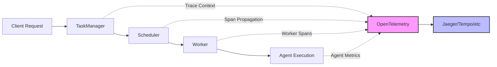

# Observability Overview

Bindu provides comprehensive observability through OpenTelemetry, enabling you to monitor, trace, and analyze your agent's performance and behavior in real-time.

## What is Observability?

Observability gives you deep insights into your agent's internal state through:

- **Traces** - Follow requests through the entire system
- **Metrics** - Track performance and resource usage
- **Logs** - Capture detailed execution information
- **Events** - Monitor state transitions and key moments

---

## Why Observability Matters

<CardGroup cols={2}>
  <Card title="Performance Analysis" icon="chart-line">
    Identify bottlenecks and optimize agent response times
  </Card>
  <Card title="Error Debugging" icon="bug">
    Quickly diagnose and fix issues with detailed traces
  </Card>
  <Card title="State Visibility" icon="eye">
    Track task state transitions and agent behavior
  </Card>
  <Card title="Production Monitoring" icon="server">
    Monitor agent health and performance in production
  </Card>
</CardGroup>

---

## Architecture

Bindu implements distributed tracing across the entire task execution lifecycle:



### Trace Flow

1. **TaskManager** - Creates root span for operations
2. **Scheduler** - Propagates trace context to workers
3. **Worker** - Restores context and creates child spans
4. **Agent** - Tracks execution time and state changes

---

## Key Features

### Distributed Tracing

Track requests across the entire system:

- ✅ **End-to-end visibility** - From API request to agent response
- ✅ **Span propagation** - Maintains context across async boundaries
- ✅ **Parent-child relationships** - Clear hierarchy of operations
- ✅ **Timing information** - Precise duration of each operation

### Rich Attributes

Comprehensive metadata on every span:

- `bindu.operation` - Operation name (e.g., "send_message")
- `bindu.task_id` - Task UUID
- `bindu.context_id` - Conversation context
- `bindu.agent.name` - Agent identifier
- `bindu.agent.did` - Agent DID
- `bindu.agent.execution_time` - Agent processing time

### State Transition Events

Timeline markers for key moments:

- Task state changes (working → completed)
- Error occurrences with stack traces
- Input/auth requirements
- Custom agent events

### Performance Metrics

Automatic metric collection:

- `bindu_tasks_total` - Counter of tasks processed
- `bindu_task_duration_seconds` - Histogram of durations
- `bindu_active_tasks` - Current active tasks
- `bindu_contexts_total` - Contexts managed

---

## Supported Backends

Bindu works with any OpenTelemetry-compatible backend:

### Open Source

- **[Jaeger](/bindu/learn/observability/jaeger)** - Distributed tracing platform
- **Grafana Tempo** - High-scale distributed tracing
- **Zipkin** - Distributed tracing system
- **SigNoz** - Full-stack observability platform

### Commercial

- **Honeycomb** - Observability for production systems
- **New Relic** - Full-stack observability
- **Datadog** - Monitoring and analytics
- **Lightstep** - Observability for microservices

---

## Quick Start

<Steps>
  <Step title="Start Jaeger">
    ```bash
    docker run -d --name jaeger \
      -e COLLECTOR_OTLP_ENABLED=true \
      -p 16686:16686 \
      -p 4317:4317 \
      -p 4318:4318 \
      jaegertracing/all-in-one:latest
    ```
  </Step>

  <Step title="Configure Agent">
    Add to your agent config:
    
    ```json
    {
      "name": "my-agent",
      "telemetry": true,
      "oltp": {
        "endpoint": "http://localhost:4318/v1/traces",
        "service_name": "bindu-agent"
      }
    }
    ```
  </Step>

  <Step title="Run Agent">
    ```bash
    python your_agent.py
    ```
  </Step>

  <Step title="View Traces">
    Open http://localhost:16686 and select your service
  </Step>
</Steps>

---

## Configuration Options

### Agent Config (Recommended)

```json
{
  "telemetry": true,
  "oltp": {
    "endpoint": "http://localhost:4318/v1/traces",
    "service_name": "bindu-agent",
    "service_version": "1.0.0",
    "deployment_environment": "production"
  }
}
```

### Environment Variables

```bash
# OTLP endpoint
export OTEL_EXPORTER_OTLP_ENDPOINT="http://localhost:4318/v1/traces"

# Service identification
export OTEL_SERVICE_NAME="bindu-agent"
export OTEL_SERVICE_VERSION="1.0.0"
export DEPLOYMENT_ENV="production"

# Batch processing (recommended)
export OTEL_USE_BATCH_PROCESSOR="true"
export OTEL_BSP_SCHEDULE_DELAY="5000"
export OTEL_BSP_MAX_EXPORT_BATCH_SIZE="512"
```

<Note>
  Agent config takes precedence over environment variables.
</Note>

---

## Example Trace

Here's what a complete trace looks like:

```
task_manager.send_message (250ms)
├─ bindu.operation: "send_message"
├─ bindu.request_id: "req-123"
├─ bindu.task_id: "task-456"
└─ run task (220ms)
   └─ agent.execute (200ms)
      ├─ bindu.agent.name: "my-agent"
      ├─ bindu.agent.did: "did:bindu:user:agent:uuid"
      ├─ bindu.agent.execution_time: 0.200
      └─ Events:
         └─ task.state_changed
            ├─ from_state: "working"
            └─ to_state: "completed"
```

### Trace Attributes

| Attribute | Description | Example |
|-----------|-------------|---------|
| `bindu.operation` | Operation type | `send_message` |
| `bindu.task_id` | Task identifier | `task-456` |
| `bindu.agent.name` | Agent name | `my-agent` |
| `bindu.agent.execution_time` | Processing time | `0.200` |
| `bindu.success` | Success flag | `true` |

---

## Observability Best Practices

### 1. Consistent Naming

Use clear, consistent span names:

```python
# Good
"task_manager.send_message"
"agent.execute"
"scheduler.enqueue"

# Avoid
"send_msg"
"exec"
"queue"
```

### 2. Rich Attributes

Add meaningful context to spans:

```python
span.set_attribute("bindu.agent.name", agent_name)
span.set_attribute("bindu.task_id", task_id)
span.set_attribute("bindu.message_count", len(messages))
```

### 3. Span Events

Use events for timeline markers:

```python
span.add_event("task.state_changed", {
    "from_state": "working",
    "to_state": "completed"
})
```

### 4. Error Handling

Always record errors with context:

```python
try:
    result = await agent.execute()
except Exception as e:
    span.record_exception(e)
    span.set_status(Status(StatusCode.ERROR))
    raise
```

### 5. Sampling Strategy

Configure sampling for high-volume production:

```bash
# Sample 10% of traces
export OTEL_TRACES_SAMPLER="parentbased_traceidratio"
export OTEL_TRACES_SAMPLER_ARG="0.1"
```

---

## Performance Tuning

### Batch Processor

Optimize for production workloads:

```bash
# High-volume production
export OTEL_BSP_MAX_QUEUE_SIZE="4096"
export OTEL_BSP_SCHEDULE_DELAY="10000"
export OTEL_BSP_MAX_EXPORT_BATCH_SIZE="1024"
export OTEL_BSP_EXPORT_TIMEOUT="60000"
```

### Development vs Production

**Development:**
```bash
# Immediate export for debugging
export OTEL_USE_BATCH_PROCESSOR="false"
```

**Production:**
```bash
# Batched export for efficiency
export OTEL_USE_BATCH_PROCESSOR="true"
export OTEL_BSP_SCHEDULE_DELAY="5000"
```

---

## Troubleshooting

<AccordionGroup>
  <Accordion title="No traces appearing">
    **Check:**
    - Jaeger is running: `docker ps | grep jaeger`
    - Endpoint is correct: `echo $OTEL_EXPORTER_OTLP_ENDPOINT`
    - Agent logs show observability initialization
    - Test endpoint: `curl http://localhost:4318/v1/traces`
  </Accordion>

  <Accordion title="Traces delayed">
    **Cause:** BatchSpanProcessor batches spans before sending (default: 5s)
    
    **Solution:** Set `OTEL_USE_BATCH_PROCESSOR="false"` for development
  </Accordion>

  <Accordion title="Wrong service name">
    **Solution:** Set `OTEL_SERVICE_NAME` or configure in agent config
  </Accordion>

  <Accordion title="High memory usage">
    **Cause:** Queue size too large or export delays
    
    **Solution:** Tune batch processor parameters:
    ```bash
    export OTEL_BSP_MAX_QUEUE_SIZE="2048"
    export OTEL_BSP_SCHEDULE_DELAY="5000"
    ```
  </Accordion>
</AccordionGroup>

---

## Next Steps

<CardGroup cols={2}>
  <Card title="Tracing Guide" icon="route" href="/bindu/learn/observability/tracing">
    Learn about distributed tracing in detail
  </Card>
  <Card title="Jaeger Setup" icon="server" href="/bindu/learn/observability/jaeger">
    Set up Jaeger for trace visualization
  </Card>
  <Card title="Metrics" icon="chart-bar" href="/bindu/learn/observability/metrics">
    Understand metrics and performance monitoring
  </Card>
  <Card title="Phoenix Dashboard" icon="gauge" href="/bindu/learn/observability/phoenix">
    Use the monitoring dashboard
  </Card>
</CardGroup>

---

## Resources

- **[OpenTelemetry Docs](https://opentelemetry.io/docs/)** - Official OpenTelemetry documentation
- **[Jaeger Documentation](https://www.jaegertracing.io/docs/)** - Jaeger tracing platform
- **[GitHub Examples](https://github.com/Saptha-me/Bindu/tree/main/examples)** - Code examples
- **[Discord Community](https://discord.gg/3w5zuYUuwt)** - Get help and share insights
