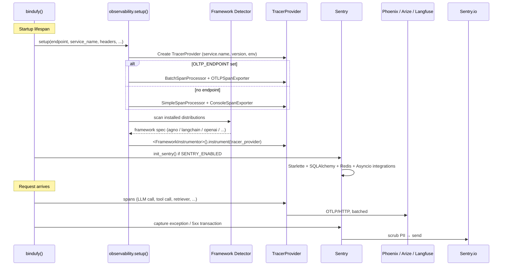

Production is silent until it screams. At 2am you get the page: `agents/research` is slow. You log in. Which call is slow? Which downstream API? Was it the LLM, the retriever, or the tool? You scroll through unstructured logs hoping to spot the timestamp that explains everything.

You shouldn't have to do that. Bindu wires up two complementary signals on startup:

- **OpenInference** — semantic spans for agent frameworks (Agno, CrewAI, LangChain, LlamaIndex, DSPy, Haystack, AutoGen, etc.) and LLM providers (OpenAI, Anthropic, Mistral, Groq, Bedrock, VertexAI, Google GenAI, LiteLLM). Auto-detected at boot. Shipped over OTLP/HTTP to any compatible backend — Phoenix, Arize, Langfuse — or printed to your console if no endpoint is set.
- **Sentry** — exceptions, 5xx requests, performance transactions, release tagging. Auto-instruments Starlette HTTP endpoints, SQLAlchemy queries, Redis calls, and asyncio tasks. Strips secrets before they leave the process.

## Why Agent Observability Is Different

A typical web app trace ends with a SQL query. An agent trace doesn't.

| Concern | Web app | Agent |
| --- | --- | --- |
| Slowest hop is usually... | DB query | LLM call or tool loop |
| Cost per request | ~free | $0.001 – $1+ per turn |
| Determinism | High | None |
| Retries | Idempotent | Side-effects on every call |
| "What did it do?" | Stack trace | Prompt + response + tool sequence |

OpenInference captures the agent-shaped data (prompts, tool calls, token counts, model name, reasoning steps) using semantic conventions designed for LLM workloads. Sentry handles the parts that look like a normal service (HTTP errors, DB latency, releases).

<CardGroup cols={3}>
  <Card title="Traceable" icon="route">
    OpenInference auto-instruments your agent framework and LLM client, attaching prompts,
    completions, tool calls, and token usage to each span.
  </Card>
  <Card title="Actionable" icon="bug">
    Sentry captures unhandled exceptions and 5xx responses with stack trace, release tag,
    environment, and request context. Secrets are scrubbed before send.
  </Card>
  <Card title="Portable" icon="globe">
    OTLP/HTTP spans flow to Phoenix, Arize, Langfuse, or anything that speaks
    OpenTelemetry — no vendor lock-in.
  </Card>
</CardGroup>

## How It Works


```mermaid
sequenceDiagram
    participant Bindufy as bindufy()
    participant Setup as observability.setup()
    participant Detect as Framework Detector
    participant OTel as TracerProvider
    participant Sentry
    participant Backend as Phoenix / Arize / Langfuse
    participant SentryIO as Sentry.io

    Note over Bindufy: Startup lifespan
    Bindufy->>Setup: setup(endpoint, service_name, headers, ...)
    Setup->>OTel: Create TracerProvider (service.name, version, env)
    alt OLTP_ENDPOINT set
        Setup->>OTel: BatchSpanProcessor + OTLPSpanExporter
    else no endpoint
        Setup->>OTel: SimpleSpanProcessor + ConsoleSpanExporter
    end
    Setup->>Detect: scan installed distributions
    Detect-->>Setup: framework spec (agno / langchain / openai / ...)
    Setup->>OTel: <FrameworkInstrumentor>().instrument(tracer_provider)

    Bindufy->>Sentry: init_sentry() if SENTRY_ENABLED
    Sentry->>Sentry: Starlette + SQLAlchemy + Redis + Asyncio integrations

    Note over Bindufy: Request arrives
    Bindufy->>OTel: spans (LLM call, tool call, retriever, ...)
    OTel->>Backend: OTLP/HTTP, batched
    Bindufy->>Sentry: capture exception / 5xx transaction
    Sentry->>SentryIO: scrub PII → send
```

<Steps>
  <Step title="Instrument">
    On startup, Bindu calls `observability.setup()` (OpenInference + OTel) and
    `init_sentry()`. The tracer provider is always created — even with no endpoint,
    spans print to console so local development works without a backend.
  </Step>
  <Step title="Detect">
    `setup()` walks installed Python distributions, picks the first supported framework
    (agent frameworks before raw LLM SDKs to avoid double-instrumentation), and calls
    its OpenInference instrumentor.
  </Step>
  <Step title="Export & diagnose">
    Spans batch-export to your OTLP endpoint. Exceptions and 5xx transactions hit Sentry.
    Open Phoenix for trace timelines, Sentry for the stack trace.
  </Step>
</Steps>

<Note>
  If no agent framework is detected (or the installed version is below the OpenInference
  minimum), Bindu logs the missing packages and the suggested install command, then
  continues without LLM-level tracing. The tracer provider stays active so any other
  OTel-emitting library still works.
</Note>

---

## OpenInference Setup

### Auto-Detected Frameworks

Bindu picks the first match it finds, in this priority order. Agent frameworks come
before raw LLM SDKs so you don't get duplicate spans (e.g. Agno calling OpenAI shouldn't
emit one span from each).

| Tier | Frameworks |
| --- | --- |
| Agent frameworks | `agno`, `crewai`, `langchain`, `llama-index`, `dspy`, `haystack`, `instructor`, `pydantic-ai`, `autogen`, `smolagents` |
| LLM providers | `litellm`, `openai`, `anthropic`, `mistralai`, `groq`, `bedrock`, `vertexai`, `google-genai` |

You don't list these in config. Whatever's in your `pyproject.toml` is what gets traced.

### Supported Backends

<CardGroup cols={3}>
  <Card title="Phoenix" icon="chart-line" href="https://docs.arize.com/phoenix">
    Local LLM observability UI. Default Bindu dev target. Run with `docker run -p 6006:6006 arizephoenix/phoenix`.
  </Card>
  <Card title="Langfuse" icon="signal" href="https://langfuse.com">
    Self-hosted or cloud. LLM analytics, evals, and prompt management.
  </Card>
  <Card title="Arize" icon="eye" href="https://arize.com">
    Production AI observability with drift detection.
  </Card>
</CardGroup>

Anything else that speaks OTLP/HTTP works too — Jaeger, Honeycomb, Grafana Tempo, etc.
You just need the right endpoint and headers.

### Configuration

Bindu's setup function takes its arguments either programmatically (via `bindufy` config)
or from environment variables that the config enricher reads. Env vars use the `OLTP_`
prefix (yes, with the `L` — it's the canonical spelling in the Bindu codebase).

<Note>
  `OLTP_HEADERS` must be valid JSON. The enricher calls `json.loads()` on it and raises
  if it isn't parseable.
</Note>

```bash
# Master switch — defaults to true
TELEMETRY_ENABLED=true

# Where to send spans (omit for console output)
OLTP_ENDPOINT=https://cloud.langfuse.com/api/public/otel/v1/traces

# service.name attribute on every span
OLTP_SERVICE_NAME=research-agent

# Authentication headers as JSON
OLTP_HEADERS={"Authorization":"Basic <base64(public_key:secret_key)>"}
```

The `setup()` function also accepts these — pass them through `bindufy` config or rely
on the defaults in `bindu/observability/openinference.py`:

```bash
# Resource attributes
OLTP_SERVICE_VERSION=1.0.0
OLTP_DEPLOYMENT_ENVIRONMENT=production

# BatchSpanProcessor tuning
OLTP_BATCH_MAX_QUEUE_SIZE=2048
OLTP_BATCH_SCHEDULE_DELAY_MILLIS=5000
OLTP_BATCH_MAX_EXPORT_BATCH_SIZE=512
OLTP_BATCH_EXPORT_TIMEOUT_MILLIS=30000

# Print each export result to logs
OLTP_VERBOSE_LOGGING=true
```

### Per-Backend Setup

<AccordionGroup>
  <Accordion title="Phoenix (local dev)">
    Start Phoenix locally:

    ```bash
    docker run -p 6006:6006 arizephoenix/phoenix
    ```

    Point Bindu at it:

    ```bash
    TELEMETRY_ENABLED=true
    OLTP_ENDPOINT=http://localhost:6006/v1/traces
    OLTP_SERVICE_NAME=research-agent-local
    ```

    No headers required. Open `http://localhost:6006` to see traces stream in.
  </Accordion>

  <Accordion title="Langfuse">
    1. Sign up at [cloud.langfuse.com](https://cloud.langfuse.com) (or self-host).
    2. Settings → API Keys → create a key pair.
    3. Base64-encode `<public_key>:<secret_key>`:

       ```bash
       echo -n "pk-xxx:sk-xxx" | base64
       ```

    4. Configure env:

       ```bash
       TELEMETRY_ENABLED=true
       OLTP_ENDPOINT=https://cloud.langfuse.com/api/public/otel/v1/traces
       OLTP_SERVICE_NAME=research-agent
       OLTP_HEADERS={"Authorization":"Basic <base64-encoded-credentials>"}
       OLTP_VERBOSE_LOGGING=true
       ```

    Langfuse needs the full path including `/api/public/otel/v1/traces`. Bindu's exporter
    will log a hint if the endpoint looks wrong.
  </Accordion>

  <Accordion title="Arize">
    1. Sign up at [arize.com](https://arize.com).
    2. Settings → API Keys → copy Space ID and API Key.
    3. Configure env:

       ```bash
       TELEMETRY_ENABLED=true
       OLTP_ENDPOINT=https://otlp.arize.com/v1
       OLTP_SERVICE_NAME=research-agent
       OLTP_HEADERS={"space_id":"<your-space-id>","api_key":"<your-api-key>"}
       OLTP_VERBOSE_LOGGING=true
       ```
  </Accordion>

  <Accordion title="Any OTLP/HTTP backend">
    Bindu uses `OTLPSpanExporter` from `opentelemetry.exporter.otlp.proto.http`. Anything
    that accepts OTLP over HTTP (Jaeger, Honeycomb, Tempo, New Relic, Datadog OTLP) will
    work — set the endpoint and required headers.

    ```bash
    TELEMETRY_ENABLED=true
    OLTP_ENDPOINT=https://api.honeycomb.io/v1/traces
    OLTP_HEADERS={"x-honeycomb-team":"<your-api-key>"}
    ```
  </Accordion>

  <Accordion title="Multiple endpoints">
    `setup()` accepts a list — useful when you want Phoenix locally and Langfuse in
    parallel. Each endpoint gets its own `BatchSpanProcessor`:

    ```python
    from bindu.observability import setup

    setup(
        oltp_endpoint=[
            "http://localhost:6006/v1/traces",
            "https://cloud.langfuse.com/api/public/otel/v1/traces",
        ],
        oltp_headers={"Authorization": "Basic <base64>"},
        oltp_service_name="research-agent",
    )
    ```
  </Accordion>
</AccordionGroup>

### What Ends Up In a Trace

A typical agent turn looks roughly like this in Phoenix or Langfuse:

```text
research-agent · message/send                          1.2s
├─ AgnoAgent.run                                       1.2s
│  ├─ ChatOpenAI.chat                                  0.8s
│  │  ├─ openinference.span.kind = LLM
│  │  ├─ llm.model_name = gpt-4o-mini
│  │  ├─ llm.input_messages = [...]
│  │  ├─ llm.output_messages = [...]
│  │  ├─ llm.usage.prompt_tokens = 412
│  │  └─ llm.usage.completion_tokens = 87
│  └─ ToolCall.web_search                              0.3s
│     ├─ openinference.span.kind = TOOL
│     ├─ tool.name = web_search
│     ├─ input.value = "latest LLM benchmarks 2025"
│     └─ output.value = [...]
```

Span structure follows the [OpenInference semantic conventions](https://github.com/Arize-ai/openinference/blob/main/spec/semantic_conventions.md).

---

## Sentry Setup

Sentry handles the operational side — exceptions, 5xx responses, slow transactions.
Bindu wires four integrations automatically:

- **Starlette** — every HTTP endpoint under `bindu/server/endpoints/`. Failed-request
  status codes default to 500–511.
- **SQLAlchemy** — query spans when using PostgreSQL storage.
- **Redis** — Redis scheduler commands.
- **Asyncio** — task and gather instrumentation so async errors don't disappear.

### Configuration

<Note>
  Sentry uses two env-var shapes: flat (`SENTRY_ENABLED`, `SENTRY_DSN`) for the master
  switches read by the config enricher, and nested (`SENTRY__*`) for fields on
  `SentrySettings` — the double underscore maps to Pydantic's nested env delimiter.
</Note>

```bash
# Master switches (flat, read by enricher)
SENTRY_ENABLED=true
SENTRY_DSN=https://<key>@<org-id>.ingest.sentry.io/<project-id>

# Nested settings (Pydantic SentrySettings)
SENTRY__ENVIRONMENT=production
SENTRY__RELEASE=research-agent@1.0.0       # defaults to bindu@<version> if unset
SENTRY__TRACES_SAMPLE_RATE=1.0             # 0.0–1.0
SENTRY__PROFILES_SAMPLE_RATE=0.1           # 0.0–1.0, default is 0.1 (not 1.0)
SENTRY__ENABLE_TRACING=true
SENTRY__SEND_DEFAULT_PII=false             # keep false in production
SENTRY__ATTACH_STACKTRACE=true
SENTRY__MAX_BREADCRUMBS=100
SENTRY__DEBUG=false
```

If `SENTRY_ENABLED=true` but `SENTRY_DSN` is missing, the enricher raises at startup.

### Built-in Safety Rails

These are wired in `bindu/observability/sentry.py` — you get them for free.

- **PII scrubbing on every event.** `_before_send` strips `authorization`, `x-api-key`,
  `cookie`, `x-auth-token` headers and `password`, `token`, `secret`, `api_key`,
  `private_key` body keys before the event leaves the process.
- **Health-check noise filtering.** `_before_send_transaction` drops transactions whose
  name matches `/healthz`, `/health`, `/metrics`, `/favicon.ico`.
- **Auto release tagging.** If `SENTRY__RELEASE` is unset, Bindu falls back to
  `bindu@<version>` from `bindu._version`.
- **Hostname as `server_name`** — set via `socket.gethostname()` if you don't override it.
- **Ignored exceptions.** `KeyboardInterrupt` and `SystemExit` are never reported.

### Enabling

<Steps>
  <Step title="Create a Sentry project">
    [sentry.io](https://sentry.io) → New Project → Python → copy the DSN.
  </Step>
  <Step title="Set env vars">
    ```bash
    SENTRY_ENABLED=true
    SENTRY_DSN=https://xxx@xxx.ingest.sentry.io/xxx
    SENTRY__ENVIRONMENT=production
    SENTRY__RELEASE=research-agent@1.0.0
    SENTRY__TRACES_SAMPLE_RATE=0.2   # sample 20% in prod
    ```
  </Step>
  <Step title="Restart">
    `init_sentry()` runs in the FastAPI/Starlette lifespan. Look for
    `✅ Sentry initialized` in the logs.
  </Step>
</Steps>

---

## Adding Custom Spans and Context

OpenInference auto-instruments the framework. Anything outside the framework — your own
preprocessing, post-processing, business logic — needs explicit spans:

```python
from opentelemetry import trace

tracer = trace.get_tracer("my-agent")

with tracer.start_as_current_span("preprocess_documents") as span:
    span.set_attribute("doc.count", len(docs))
    span.set_attribute("doc.total_bytes", total_bytes)
    result = clean_and_chunk(docs)
    span.set_attribute("chunks.count", len(result))
```

For Sentry, attach tags and context to all errors raised inside a request:

```python
import sentry_sdk

sentry_sdk.set_tag("feature", "pdf-processing")
sentry_sdk.set_context("business", {
    "plan": "premium",
    "credits_remaining": 100,
})

# breadcrumbs show up on any subsequent exception
sentry_sdk.add_breadcrumb(
    category="agent",
    message="Started document ingestion",
    level="info",
)
```

---

## Agent Configuration

No code changes are required — observability reads env vars on startup.

```python
from bindu import bindufy

config = {
    "author": "you@example.com",
    "name": "research_agent",
    "description": "A research assistant agent",
    "deployment": {"url": "http://localhost:3773", "expose": True},
    "skills": ["skills/question-answering"],
}

bindufy(config, handler)
```

The agent defines behavior. The environment defines how deeply it's observed.

---

## Production Tips

### Sample traces, not errors

```bash
# Sentry: keep 100% of errors, sample 10% of transactions
SENTRY__TRACES_SAMPLE_RATE=0.1
SENTRY__PROFILES_SAMPLE_RATE=0.1
```

OpenInference doesn't sample by default — every span is exported. If you need head
sampling, configure it on the OTel backend (Phoenix, Tempo, etc.) or front the exporter
with a sampler.

### Separate environments

```bash
# Development
SENTRY__ENVIRONMENT=development
OLTP_SERVICE_NAME=research-agent-dev
OLTP_ENDPOINT=http://localhost:6006/v1/traces

# Production
SENTRY__ENVIRONMENT=production
OLTP_SERVICE_NAME=research-agent-prod
OLTP_ENDPOINT=https://cloud.langfuse.com/api/public/otel/v1/traces
```

### No backend? You still get traces

If `OLTP_ENDPOINT` is unset, Bindu falls back to `ConsoleSpanExporter` — every span
pretty-prints to stdout. Great for local debugging, terrible for production. Set an
endpoint before you ship.

<Info>
  When Bindu can't reach the configured OTLP endpoint, the wrapped exporter logs a
  one-time hint specific to the URL pattern (e.g. "Langfuse requires endpoint:
  &lt;base-url&gt;/api/public/otel/v1/traces"). Check logs first when traces don't show up.
</Info>

---

## Related

- [Health Check & Metrics](/bindu/learn/health-metrics/overview)
- [OpenInference (GitHub)](https://github.com/Arize-ai/openinference)
- [OpenInference Semantic Conventions](https://github.com/Arize-ai/openinference/blob/main/spec/semantic_conventions.md)
- [Phoenix Documentation](https://docs.arize.com/phoenix)
- [Langfuse Documentation](https://langfuse.com/docs)
- [Sentry Python SDK](https://docs.sentry.io/platforms/python/)
- [OpenTelemetry Python](https://opentelemetry.io/docs/languages/python/)

<span className="brand-quote">
  

  <span className="brand-quote-text">
    Bindu brings clarity to your agents —{" "}
    <span className="brand-quote-highlight">
      each one visible, traceable, and growing in trust
    </span>{" "}
    across the Internet of Agents.
  </span>
</span>
