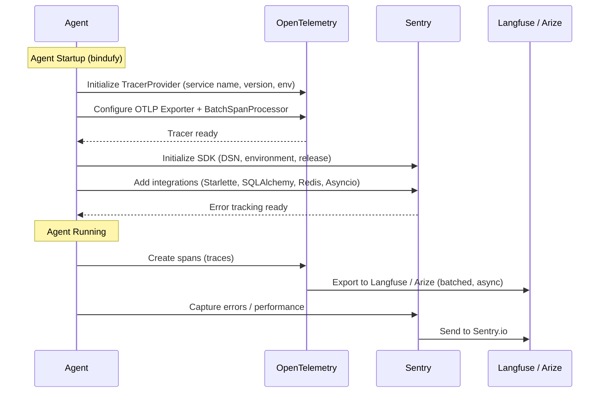

Production is silent until it screams. At 2am you get the page: "agents/research is slow." You log in. Which call is slow? Which downstream API? Was the LLM itself the bottleneck, or was it the vector DB? You scroll through unstructured logs hoping to spot the timestamp that explains everything.

You shouldn't have to do that. Bindu emits OpenTelemetry spans across the whole request path — HTTP in, queue, worker, handler, LLM call, tool calls, response out — with timing on every leg. Send them to Jaeger, Phoenix, Langfuse, Honeycomb, or any OTel-compatible backend and you find the slow span in 30 seconds instead of 30 minutes.

Errors get the same treatment. Sentry integration means failed tasks land in your issue tracker with full stack trace, release tag, and environment label. No more "I think someone said it broke yesterday."

## How Bindu Observability Works

Bindu integrates with OpenTelemetry (OTEL) and Sentry to provide comprehensive observability and error tracking. Bindu splits observability into two complementary channels:

```text
OpenTelemetry -> traces and execution flow
Sentry        -> errors, releases, and performance incidents
```

- OpenTelemetry shows how work moved
- Sentry shows where things failed and under what release or environment

<CardGroup cols={3}>
  <Card title="Traceable" icon="route">
    OpenTelemetry creates spans so developers can follow execution across the runtime.
  </Card>
  <Card title="Actionable" icon="bug">
    Sentry captures failures with context that helps teams respond faster.
  </Card>
  <Card title="Portable" icon="globe">
    OTLP-compatible telemetry can be sent to Langfuse or Arize without changing the
    agent model.
  </Card>
</CardGroup>

### The Lifecycle: Instrument, Export, Diagnose


```mermaid
sequenceDiagram
    participant Agent
    participant OTEL as OpenTelemetry
    participant Sentry
    participant Platform as Langfuse / Arize

    Note over Agent: Agent Startup (bindufy)

    Agent->>OTEL: Initialize TracerProvider (service name, version, env)
    Agent->>OTEL: Configure OTLP Exporter + BatchSpanProcessor
    OTEL-->>Agent: Tracer ready

    Agent->>Sentry: Initialize SDK (DSN, environment, release)
    Agent->>Sentry: Add integrations (Starlette, SQLAlchemy, Redis, Asyncio)
    Sentry-->>Agent: Error tracking ready

    Note over Agent: Agent Running

    Agent->>OTEL: Create spans (traces)
    OTEL->>Platform: Export to Langfuse / Arize (batched, async)
    Agent->>Sentry: Capture errors / performance
    Sentry->>Platform: Send to Sentry.io
```

<Steps>
  <Step title="Instrument">
    On startup, Bindu checks whether telemetry and Sentry are enabled. If they are, it
    initializes the tracer provider, OTLP exporter, span processor, and Sentry SDK with
    the right environment and release metadata.

    Good observability starts before the first request, not after the first incident.
  </Step>

  <Step title="Export">
    Once the agent is running, spans are created and exported asynchronously to an
    OTEL-compatible backend, while Sentry captures exceptions and performance
    information through its own pipeline.

    One system explains flow. The other explains failure.
  </Step>

  <Step title="Diagnose">
    When something goes wrong, teams can inspect traces for path-level visibility and
    use Sentry for release-aware error context, stack traces, and performance events.

    Together, they shorten the distance between "something broke" and "we know why."
  </Step>
</Steps>

---

## OpenTelemetry Setup

### Supported Platforms

<CardGroup cols={3}>
  <Card title="Langfuse" icon="chart-line" href="https://cloud.langfuse.com">
    Open-source LLM engineering platform with tracing and analytics.
  </Card>
  <Card title="Arize" icon="eye" href="https://arize.com">
    AI observability platform for monitoring and debugging ML models.
  </Card>
  <Card title="Any OTEL Platform" icon="globe">
    Supports standard OTLP protocol — works with any compatible backend.
  </Card>
</CardGroup>

### Configuration

<Note>
  Bindu uses the `OLTP_` prefix (not `OTEL_`) for these variables in the codebase.
</Note>

```bash
# Enable telemetry
TELEMETRY_ENABLED=true

# OTEL endpoint (platform-specific)
OLTP_ENDPOINT=https://cloud.langfuse.com/api/public/otel/v1/traces

# Service name for your agent
OLTP_SERVICE_NAME=research-agent

# Authentication headers (platform-specific)
OLTP_HEADERS={"Authorization":"Basic <base64-encoded-credentials>"}

# Optional
OLTP_VERBOSE_LOGGING=true
OLTP_SERVICE_VERSION=1.0.0
OLTP_DEPLOYMENT_ENVIRONMENT=production
OLTP_BATCH_MAX_QUEUE_SIZE=2048
OLTP_BATCH_SCHEDULE_DELAY_MILLIS=5000
```

### Platform-Specific Setup

<AccordionGroup>
  <Accordion title="Langfuse">
    1. Sign up at [cloud.langfuse.com](https://cloud.langfuse.com)
    2. Navigate to Settings → API Keys and create a new key pair
    3. Base64-encode your credentials:

    ```bash
    echo -n "pk-xxx:sk-xxx" | base64
    ```

    4. Configure environment:

    ```bash
    TELEMETRY_ENABLED=true
    OLTP_ENDPOINT=https://cloud.langfuse.com/api/public/otel/v1/traces
    OLTP_SERVICE_NAME=your-agent-name
    OLTP_HEADERS={"Authorization":"Basic <base64-encoded-credentials>"}
    OLTP_VERBOSE_LOGGING=true
    ```
  </Accordion>

  <Accordion title="Arize">
    1. Sign up at [arize.com](https://arize.com)
    2. Navigate to Settings → API Keys and copy your Space ID and API Key
    3. Configure environment:

    ```bash
    TELEMETRY_ENABLED=true
    OLTP_ENDPOINT=https://otlp.arize.com/v1
    OLTP_SERVICE_NAME=your-agent-name
    OLTP_HEADERS={"space_id":"<your-space-id>","api_key":"<your-api-key>"}
    OLTP_VERBOSE_LOGGING=true
    ```
  </Accordion>
</AccordionGroup>

---

## Sentry Error Tracking

### Configuration

<Note>
  Bindu reads `SENTRY_ENABLED` and `SENTRY_DSN` as flat variables. All detailed
  settings use a double-underscore (`__`) to map to internal nested configuration.
</Note>

```bash
# Core setup (flat variables)
SENTRY_ENABLED=true
SENTRY_DSN=https://<key>@<org-id>.ingest.sentry.io/<project-id>

# Detailed configuration (double-underscore prefix)
SENTRY__ENVIRONMENT=production
SENTRY__RELEASE=1.0.0
SENTRY__TRACES_SAMPLE_RATE=1.0
SENTRY__PROFILES_SAMPLE_RATE=1.0
SENTRY__ENABLE_TRACING=true
SENTRY__SEND_DEFAULT_PII=false
SENTRY__DEBUG=false
```

### Setup

1. Sign up at [sentry.io](https://sentry.io)
2. Create a project and select Python as the platform
3. Copy the DSN from project settings
4. Configure environment:

```bash
SENTRY_ENABLED=true
SENTRY_DSN=https://xxx@xxx.ingest.sentry.io/xxx
SENTRY__ENVIRONMENT=production
SENTRY__RELEASE=1.0.0
```

5. Restart the agent — Sentry initializes on startup

---

## Agent Configuration

No code changes are needed. Observability is configured entirely via environment variables:

```python
config = {
    "author": "your.email@example.com",
    "name": "research_agent",
    "description": "A research assistant agent",
    "deployment": {"url": "http://localhost:3773", "expose": True},
    "skills": ["skills/question-answering"],
}

bindufy(config, handler)
```

The agent defines behavior. The environment defines how deeply that behavior should be observed.

---

## Best Practices

### Sampling for High-Traffic Agents

```bash
# Sample 10% of traces to reduce cost
SENTRY__TRACES_SAMPLE_RATE=0.1
SENTRY__PROFILES_SAMPLE_RATE=0.1
```

### Environment Separation

```bash
# Development
SENTRY__ENVIRONMENT=development
OLTP_SERVICE_NAME=agent-dev

# Production
SENTRY__ENVIRONMENT=production
OLTP_SERVICE_NAME=agent-prod
```

### Custom Sentry Context

```python
import sentry_sdk

sentry_sdk.set_context("business", {
    "plan": "premium",
    "credits": 100
})

sentry_sdk.set_tag("feature", "pdf-processing")
```

---

## Related

- [OpenTelemetry Python](https://opentelemetry.io/docs/languages/python/)
- [Langfuse Documentation](https://langfuse.com/docs)
- [Arize Documentation](https://docs.arize.com)
- [Sentry Python SDK](https://docs.sentry.io/platforms/python/)
- [Health Check & Metrics](/bindu/learn/health-metrics/overview)

<span className="brand-quote">
  

  <span className="brand-quote-text">
    Bindu brings clarity to your agents —{" "}
    <span className="brand-quote-highlight">
      each one visible, traceable, and growing in trust
    </span>{" "}
    across the Internet of Agents.
  </span>
</span>
