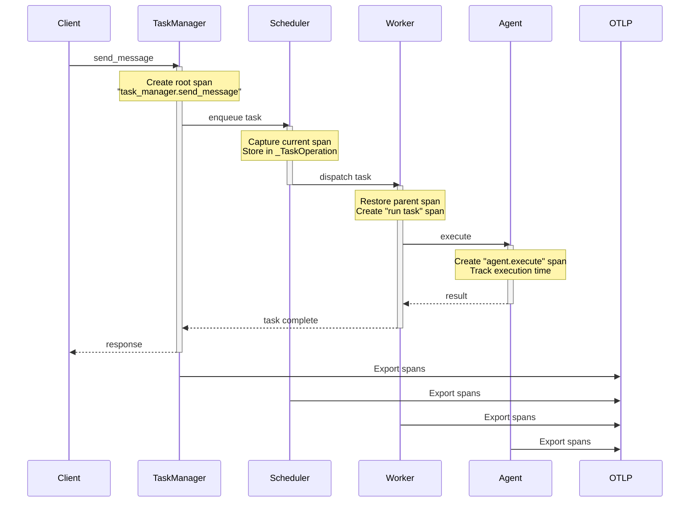

# Distributed Tracing

Bindu implements comprehensive distributed tracing using OpenTelemetry to provide end-to-end visibility across the entire task execution lifecycle.

## Overview

Distributed tracing tracks requests as they flow through your agent system:

**TaskManager → Scheduler → Worker → Agent**

Each component creates spans that form a complete trace, showing:

- ⏱️ **Timing** - How long each operation takes
- 🔗 **Relationships** - Parent-child span hierarchy
- 📊 **Attributes** - Rich metadata about operations
- 📝 **Events** - Timeline markers for key moments
- ❌ **Errors** - Exception details and stack traces

---

## Architecture



---

## Key Components

### 1. TaskManager Tracing

**File:** `task_telemetry.py`

**Decorator:** `@trace_task_operation(operation_name)`

Creates root spans for all task operations:

```python
@trace_task_operation("send_message")
async def send_message(self, params: dict):
    # Automatically traced with:
    # - Span name: "task_manager.send_message"
    # - Timing information
    # - Success/error status
    # - Request parameters
    pass
```

**Captured Attributes:**

- `bindu.operation` - Operation name (e.g., "send_message")
- `bindu.request_id` - JSON-RPC request ID
- `bindu.task_id` - Task UUID
- `bindu.context_id` - Context UUID
- `bindu.component` - "task_manager"
- `bindu.success` - Boolean success flag
- `bindu.error_type` - Exception class (on error)
- `bindu.error_message` - Error description (on error)

### 2. Scheduler Span Propagation

**Files:** `base.py`, `memory_scheduler.py`

**Challenge:** Async boundaries break automatic context propagation

**Solution:** Explicit span passing

```python
class _TaskOperation(TypedDict):
    operation: str              # "run", "cancel", etc.
    params: dict                # Task parameters
    _current_span: Span         # ⭐ Preserves trace context
```

**How it works:**

1. Scheduler captures active span: `get_current_span()`
2. Stores span in `_TaskOperation._current_span`
3. Sends operation to worker queue
4. Worker restores span to continue trace

### 3. Worker Tracing

**File:** `base.py`

Restores parent span and creates child spans:

```python
# Restore parent span from TaskManager
with use_span(task_operation["_current_span"]):
    # Create child span for worker operation
    with tracer.start_as_current_span(f"{operation} task"):
        await handler(params)
```

**Maintains:**
- Trace continuity across async boundaries
- Parent-child span relationships
- Complete trace hierarchy

### 4. Agent Execution Tracing

**File:** `manifest_worker.py`

Tracks agent-level execution:

```python
with tracer.start_as_current_span("agent.execute") as span:
    span.set_attribute("bindu.agent.name", agent_name)
    span.set_attribute("bindu.agent.did", agent_did)
    span.set_attribute("bindu.agent.message_count", len(messages))
    
    start_time = time.time()
    result = await agent.execute()
    execution_time = time.time() - start_time
    
    span.set_attribute("bindu.agent.execution_time", execution_time)
```

**Captured Attributes:**

- `bindu.agent.name` - Agent name from manifest
- `bindu.agent.did` - Agent DID identifier
- `bindu.agent.message_count` - Number of messages
- `bindu.agent.execution_time` - Processing time (seconds)
- `bindu.component` - "agent_execution"

**Span Events:**

```python
span.add_event("task.state_changed", {
    "from_state": "working",
    "to_state": "completed"
})
```

---

## Complete Trace Example

### Scenario: User sends a message

```
task_manager.send_message (250ms)
│
├─ Attributes:
│  ├─ bindu.operation: "send_message"
│  ├─ bindu.request_id: "req-abc123"
│  ├─ bindu.task_id: "task-def456"
│  ├─ bindu.context_id: "ctx-ghi789"
│  ├─ bindu.component: "task_manager"
│  └─ bindu.success: true
│
└─ run task (220ms)
   │
   ├─ Attributes:
   │  ├─ bindu.task_id: "task-def456"
   │  └─ bindu.operation: "run"
   │
   └─ agent.execute (200ms)
      │
      ├─ Attributes:
      │  ├─ bindu.agent.name: "my-agent"
      │  ├─ bindu.agent.did: "did:bindu:user:agent:uuid"
      │  ├─ bindu.agent.message_count: 3
      │  ├─ bindu.agent.execution_time: 0.200
      │  └─ bindu.component: "agent_execution"
      │
      └─ Events:
         ├─ task.state_changed (t=0ms)
         │  ├─ from_state: "pending"
         │  └─ to_state: "working"
         │
         └─ task.state_changed (t=200ms)
            ├─ from_state: "working"
            └─ to_state: "completed"
```

---

## Configuration

### Agent Config (Recommended)

```json
{
  "name": "my-agent",
  "telemetry": true,
  "oltp": {
    "endpoint": "http://localhost:4318/v1/traces",
    "service_name": "bindu-agent",
    "service_version": "1.0.0",
    "deployment_environment": "production"
  }
}
```

### Environment Variables

```bash
# OTLP endpoint
export OTEL_EXPORTER_OTLP_ENDPOINT="http://localhost:4318/v1/traces"

# Service identification
export OTEL_SERVICE_NAME="bindu-agent"
export OTEL_SERVICE_VERSION="1.0.0"
export DEPLOYMENT_ENV="production"

# Resource attributes
export OTEL_RESOURCE_ATTRIBUTES="team=ai-platform,region=us-west"

# Batch processing (recommended)
export OTEL_USE_BATCH_PROCESSOR="true"
export OTEL_BSP_SCHEDULE_DELAY="5000"
export OTEL_BSP_MAX_EXPORT_BATCH_SIZE="512"
```

<Note>
  Agent config parameters take precedence over environment variables.
</Note>

---

## Span Attributes Reference

### Standard Attributes

| Attribute | Type | Description | Example |
|-----------|------|-------------|----------|
| `bindu.operation` | string | Operation name | `send_message` |
| `bindu.task_id` | string | Task UUID | `task-abc123` |
| `bindu.context_id` | string | Context UUID | `ctx-def456` |
| `bindu.request_id` | string | Request ID | `req-ghi789` |
| `bindu.component` | string | Component name | `task_manager` |
| `bindu.success` | boolean | Success flag | `true` |

### Agent Attributes

| Attribute | Type | Description | Example |
|-----------|------|-------------|----------|
| `bindu.agent.name` | string | Agent name | `my-agent` |
| `bindu.agent.did` | string | Agent DID | `did:bindu:...` |
| `bindu.agent.message_count` | int | Message count | `3` |
| `bindu.agent.execution_time` | float | Execution time (s) | `0.200` |

### Error Attributes

| Attribute | Type | Description | Example |
|-----------|------|-------------|----------|
| `bindu.error_type` | string | Exception class | `ValueError` |
| `bindu.error_message` | string | Error message | `Invalid input` |
| `exception.type` | string | Exception type | `ValueError` |
| `exception.message` | string | Exception message | `Invalid input` |
| `exception.stacktrace` | string | Stack trace | `Traceback...` |

---

## Span Events

Events are timeline markers within a span:

### Task State Changes

```python
span.add_event("task.state_changed", {
    "from_state": "working",
    "to_state": "completed",
    "timestamp": "2025-01-01T12:00:00Z"
})
```

### Custom Events

```python
span.add_event("llm.call_started", {
    "model": "gpt-4",
    "tokens": 150
})

span.add_event("llm.call_completed", {
    "duration_ms": 1500,
    "tokens_generated": 75
})
```

---

## Best Practices

### 1. Consistent Naming

Use clear, hierarchical span names:

```python
# Good
"task_manager.send_message"
"agent.execute"
"scheduler.enqueue"
"worker.process_task"

# Avoid
"send_msg"
"exec"
"queue"
```

### 2. Rich Attributes

Add meaningful context:

```python
span.set_attribute("bindu.agent.name", agent_name)
span.set_attribute("bindu.task_id", task_id)
span.set_attribute("bindu.message_count", len(messages))
span.set_attribute("bindu.model", "gpt-4")
```

### 3. Error Handling

Always record exceptions:

```python
try:
    result = await agent.execute()
except Exception as e:
    span.record_exception(e)
    span.set_status(Status(StatusCode.ERROR, str(e)))
    span.set_attribute("bindu.error_type", type(e).__name__)
    span.set_attribute("bindu.error_message", str(e))
    raise
```

### 4. Span Events vs Attributes

**Use Attributes for:**
- Static metadata (IDs, names)
- Final results (execution time, success)
- Configuration values

**Use Events for:**
- State transitions
- Timeline markers
- Multiple occurrences
- Detailed logs

### 5. Sampling Strategy

For high-volume production:

```bash
# Sample 10% of traces
export OTEL_TRACES_SAMPLER="parentbased_traceidratio"
export OTEL_TRACES_SAMPLER_ARG="0.1"

# Always sample errors
export OTEL_TRACES_SAMPLER="parentbased_always_on"
```

---

## Performance Considerations

### Batch Processing

**Development:**
```bash
# Immediate export for debugging
export OTEL_USE_BATCH_PROCESSOR="false"
```

**Production:**
```bash
# Batched export for efficiency
export OTEL_USE_BATCH_PROCESSOR="true"
export OTEL_BSP_MAX_QUEUE_SIZE="2048"
export OTEL_BSP_SCHEDULE_DELAY="5000"
export OTEL_BSP_MAX_EXPORT_BATCH_SIZE="512"
export OTEL_BSP_EXPORT_TIMEOUT="30000"
```

### Tuning Guidelines

| Workload | Queue Size | Delay (ms) | Batch Size |
|----------|-----------|------------|------------|
| Low volume | 1024 | 5000 | 256 |
| Medium volume | 2048 | 5000 | 512 |
| High volume | 4096 | 10000 | 1024 |
| Very high volume | 8192 | 15000 | 2048 |

---

## Troubleshooting

<AccordionGroup>
  <Accordion title="Spans not appearing">
    **Check:**
    
    1. Observability initialization in logs:
    ```
    [INFO] Initializing observability...
    [INFO] Configured OTLP exporter endpoint=...
    ```
    
    2. OTLP endpoint is reachable:
    ```bash
    curl -X POST http://localhost:4318/v1/traces \
      -H "Content-Type: application/json" \
      -d '{"resourceSpans":[]}'
    ```
    
    3. Environment variables:
    ```bash
    echo $OTEL_EXPORTER_OTLP_ENDPOINT
    echo $OTEL_SERVICE_NAME
    ```
  </Accordion>

  <Accordion title="Broken trace hierarchy">
    **Cause:** Span context not properly propagated
    
    **Solution:** Ensure `_current_span` is passed through async boundaries:
    ```python
    task_operation["_current_span"] = get_current_span()
    ```
  </Accordion>

  <Accordion title="Missing agent spans">
    **Cause:** Agent execution not creating spans
    
    **Solution:** Verify `manifest_worker.py` has agent execution tracing:
    ```python
    with tracer.start_as_current_span("agent.execute"):
        # agent execution
    ```
  </Accordion>

  <Accordion title="High memory usage">
    **Cause:** Queue size too large or export delays
    
    **Solution:** Tune batch processor:
    ```bash
    export OTEL_BSP_MAX_QUEUE_SIZE="2048"
    export OTEL_BSP_SCHEDULE_DELAY="5000"
    ```
  </Accordion>
</AccordionGroup>

---

## Integration Examples

### Custom Agent Tracing

Add custom spans in your agent:

```python
from opentelemetry import trace

tracer = trace.get_tracer(__name__)

class MyAgent:
    async def execute(self, messages):
        with tracer.start_as_current_span("my_agent.process") as span:
            span.set_attribute("message_count", len(messages))
            
            # LLM call
            with tracer.start_as_current_span("llm.call") as llm_span:
                llm_span.set_attribute("model", "gpt-4")
                response = await self.llm.generate(messages)
                llm_span.set_attribute("tokens", response.tokens)
            
            return response
```

### External Service Tracing

Trace calls to external services:

```python
with tracer.start_as_current_span("external.api_call") as span:
    span.set_attribute("http.method", "POST")
    span.set_attribute("http.url", "https://api.example.com")
    
    try:
        response = await http_client.post(url, data=payload)
        span.set_attribute("http.status_code", response.status_code)
    except Exception as e:
        span.record_exception(e)
        span.set_status(Status(StatusCode.ERROR))
        raise
```

---

## Next Steps

<CardGroup cols={2}>
  <Card title="Jaeger Setup" icon="server" href="/bindu/learn/observability/jaeger">
    Set up Jaeger for trace visualization
  </Card>
  <Card title="Metrics" icon="chart-bar" href="/bindu/learn/observability/metrics">
    Learn about metrics collection
  </Card>
  <Card title="Overview" icon="eye" href="/bindu/learn/observability/overview">
    Back to observability overview
  </Card>
  <Card title="GitHub" icon="github" href="https://github.com/getbindu/Bindu">
    View implementation details
  </Card>
</CardGroup>

---

## Resources

- **[OpenTelemetry Tracing](https://opentelemetry.io/docs/concepts/signals/traces/)** - Official tracing documentation
- **[Semantic Conventions](https://opentelemetry.io/docs/specs/semconv/)** - Standard attribute names
- **[Python API](https://opentelemetry-python.readthedocs.io/)** - OpenTelemetry Python docs
- **[Best Practices](https://opentelemetry.io/docs/concepts/instrumentation/manual/)** - Manual instrumentation guide
