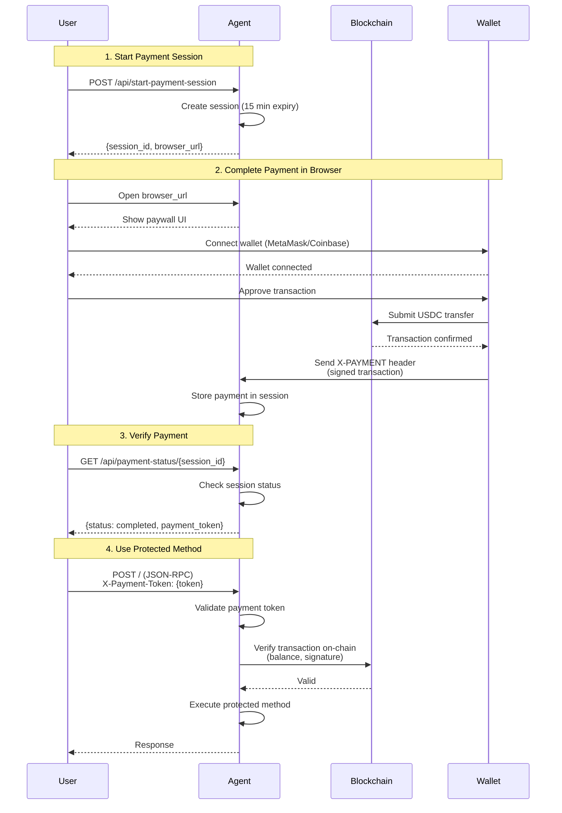

Bindu supports the **X402 payment protocol**, enabling you to monetize your AI agents by requiring cryptocurrency payments before executing specific methods.

## How It Works



## Configuration

Add `execution_cost` to your agent config:

```python
config = {
    "author": "your.email@example.com",
    "name": "paid_agent",
    "description": "An agent that requires payment",
    "deployment": {"url": "http://localhost:3773", "expose": True},
    "execution_cost": {
        "amount": "$0.0001",           # Amount in USD (converted to USDC)
        "token": "USDC",                # Token type
        "network": "base-sepolia",      # Network (base-sepolia for testing)
        "pay_to_address": "0x265<your-wallet-address>",
        "protected_methods": [
            "message/send"              # Methods requiring payment
        ]
    }
}
```

## Setup for Testing

### 1. Create a Crypto Wallet

**MetaMask (Recommended):**
1. Install [MetaMask browser extension](https://metamask.io/)
2. Create a new wallet
3. Copy your wallet address (starts with `0x...`)

**Coinbase Wallet:**
1. Install [Coinbase Wallet extension](https://www.coinbase.com/wallet)
2. Set up your wallet
3. Copy your wallet address

### 2. Get Test USDC

For Base Sepolia testnet:

1. **Get Base Sepolia ETH** (for gas fees):
   - Visit [Chainlink Faucet](https://faucets.chain.link/base-sepolia)
   - Connect your wallet
   - Request test ETH

2. **Get Base Sepolia USDC**:
   - The payment system will guide you through obtaining test USDC

### 3. Update Agent Configuration

```python
"pay_to_address": "0xYourWalletAddressHere"
```

## Payment Flow

### Step 1: Start a Payment Session

```bash
curl --location --request POST 'http://localhost:3773/api/start-payment-session' \
--header 'Content-Type: application/json' \
--header 'Authorization: Bearer <your-access-token>'
```

**Response:**
```json
{
    "session_id": "<session-id>",
    "browser_url": "http://localhost:3773/payment-capture?session_id=<session-id>",
    "expires_at": "<expires-at>",
    "status": "pending"
}
```

### Step 2: Complete Payment in Browser

1. Open the `browser_url` in your browser
2. Connect your wallet (MetaMask or Coinbase Wallet)
3. Review payment details:
   - Amount in USDC
   - Recipient address
   - Network (Base Sepolia)
4. Approve and sign the transaction
5. Wait for blockchain confirmation

### Step 3: Verify Payment Status

```bash
curl --location 'http://localhost:3773/api/payment-status/<session_id>' \
--header 'Authorization: Bearer <your-access-token>'
```

**Response:**
```json
{
    "session_id": "<session-id>",
    "status": "completed",
    "payment_token": "eyJhbGciOiJIUzI1NiIsInR5cCI6IkpXVCJ9..."
}
```

### Step 4: Use the Agent with Payment Token

```bash
curl --location 'http://localhost:3773/' \
--header 'Content-Type: application/json' \
--header 'Authorization: Bearer <your-access-token>' \
--header 'X-Payment-Token: <payment-token>' \
--data '{
    "jsonrpc": "2.0",
    "method": "message/send",
    "params": {
        "message": {
            "role": "user",
            "content": "Hello, paid agent!"
        }
    },
    "id": 1
}'
```

## Example Implementation

See the complete example:
```
examples/beginner/echo_agent_behind_paywall.py
```

## Payment Behavior

- Each new task requires payment when the agent is behind a paywall
- If a task returns `input_required` status, no payment is needed for that interaction
- Once a task completes successfully, a new payment is required for the next task
- Payment tokens are task-specific and cannot be reused

## Security Considerations

- **Wallet Security**: Never share private keys or seed phrases
- **Test Networks**: Always test on Base Sepolia before mainnet
- **Payment Verification**: Payments are verified on-chain via blockchain signatures
- **Session Expiration**: Payment sessions expire after 60 seconds by default
- **Token Storage**: Payment tokens are JWTs with expiration times

## Production Deployment

When ready for production:

1. **Switch to Base Mainnet**:
   ```python
   "network": "base"  # Change from "base-sepolia"
   ```

2. **Use Real USDC**: Ensure users have actual USDC on Base mainnet

3. **Update Wallet Address**: Use your production wallet address

4. **Monitor Payments**: Track incoming payments to your wallet

5. **Set Appropriate Pricing**: Adjust `amount` based on service value

## Tips

- **Start Small**: Use low amounts for testing (e.g., `$0.0001`)
- **Clear Communication**: Inform users about payment requirements upfront
- **Handle Failures**: Implement proper error handling for failed payments
- **Session Management**: Clean up expired payment sessions regularly
- **User Experience**: Provide clear instructions in your UI

## Related

- [X402 Protocol Specification](https://github.com/coinbase/x402)
- [Base Sepolia Testnet](https://docs.base.org/network-information)
