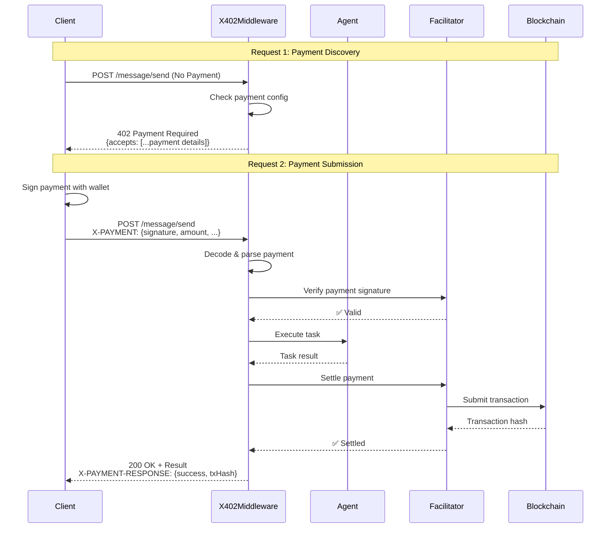

# X402 Payment Protocol

Bindu implements the [x402 payment protocol](https://github.com/google-agentic-commerce/a2a-x402) following the official A2A specification, enabling agents to monetize their services through secure on-chain payments.

## Overview

The x402 protocol allows agents to:

- **Monetize services** through cryptocurrency payments
- **Accept payments** on multiple blockchain networks
- **Verify transactions** using payment facilitators
- **Settle payments** automatically after task completion

<Note>
  X402 is implemented as HTTP middleware, providing a clean and standard way to handle payments without modifying your agent logic.
</Note>

---

## How It Works

### Payment Flow

The x402 payment flow consists of two requests:



<Steps>
  <Step title="First Request - Payment Discovery">
    Client sends a request without payment. Agent responds with `402 Payment Required` and payment details.

    ```json
    {
      "x402Version": 1,
      "accepts": [{
        "scheme": "exact",
        "network": "base-sepolia",
        "asset": "0x036CbD53842c5426634e7929541eC2318f3dCF7e",
        "max_amount_required": "10000",
        "resource": "did:bindu:user:agent:uuid",
        "description": "Payment required to use my_agent",
        "pay_to": "0x742d35Cc6634C0532925a3b844Bc9e7595f0bEb0",
        "max_timeout_seconds": 600
      }]
    }
    ```
  </Step>

  <Step title="Second Request - Payment Submission">
    Client includes payment proof in `X-PAYMENT` header. Middleware verifies, executes task, and settles payment.

    ```http
    POST / HTTP/1.1
    Content-Type: application/json
    X-PAYMENT: eyJ4NDAyVmVyc2lvbiI6MSwic2NoZW1lIjoi...

    {
      "jsonrpc": "2.0",
      "method": "message/send",
      "params": {...}
    }
    ```
  </Step>
</Steps>

### Middleware Actions

When a payment is submitted, the middleware automatically:

1. ✅ Decodes the `X-PAYMENT` header
2. ✅ Parses the payment payload
3. ✅ Matches against payment requirements
4. ✅ Verifies with payment facilitator
5. ✅ Allows request to proceed
6. ✅ Executes agent task
7. ✅ Settles payment on-chain
8. ✅ Returns `X-PAYMENT-RESPONSE` header

---

## Configuration

### Enable Payments for Your Agent

Configure payment requirements in your agent manifest:

```python
from bindu.core.manifest import Manifest, PaymentConfig

manifest = Manifest(
    name="my_paid_agent",
    payment_config=PaymentConfig(
        enabled=True,
        network="base-sepolia",
        asset="0x036CbD53842c5426634e7929541eC2318f3dCF7e",  # USDC
        amount="10000",  # 0.01 USDC (6 decimals)
        pay_to="0x742d35Cc6634C0532925a3b844Bc9e7595f0bEb0",
        facilitator_url="https://facilitator.example.com",
        timeout_seconds=600
    )
)
```

### Configuration Options

| Parameter | Description | Required |
|-----------|-------------|----------|
| `enabled` | Enable payment requirement | Yes |
| `network` | Blockchain network (e.g., `base-sepolia`) | Yes |
| `asset` | Token contract address | Yes |
| `amount` | Payment amount in smallest unit | Yes |
| `pay_to` | Recipient wallet address | Yes |
| `facilitator_url` | Payment verification service URL | Yes |
| `timeout_seconds` | Payment validity timeout | No (default: 600) |

---

## Supported Networks

Bindu supports payments on multiple blockchain networks:

- **Base Sepolia** (Testnet) - `base-sepolia`
- **Base Mainnet** - `base`
- **Ethereum Mainnet** - `ethereum`
- **Polygon** - `polygon`

<Note>
  For testing, we recommend using Base Sepolia testnet with test USDC tokens.
</Note>

---

## Testing Payments

### Quick Start

<Steps>
  <Step title="Generate Test Wallet">
    ```bash
    python examples/generate_test_wallet.py
    ```

    Save the generated address and private key for testing.
  </Step>

  <Step title="Send First Request">
    ```bash
    curl --location 'http://localhost:3773/' \
    --header 'Content-Type: application/json' \
    --data '{
        "jsonrpc": "2.0",
        "method": "message/send",
        "params": {
            "message": {
                "role": "user",
                "parts": [{"kind": "text", "text": "Hello"}],
                "kind": "message",
                "messageId": "msg-1",
                "contextId": "ctx-1",
                "taskId": "task-1"
            }
        },
        "id": "1"
    }'
    ```

    Response will include payment requirements in metadata.
  </Step>

  <Step title="Generate Signed Payment">
    ```bash
    python examples/sign_payment.py \
      --private-key "0xYOUR_PRIVATE_KEY" \
      --network "base-sepolia" \
      --asset "0x036CbD53842c5426634e7929541eC2318f3dCF7e" \
      --amount "10000" \
      --pay-to "0x742d35Cc6634C0532925a3b844Bc9e7595f0bEb0"
    ```
  </Step>

  <Step title="Send Payment Request">
    Include the signed payment in the `X-PAYMENT` header and retry the request.
  </Step>
</Steps>

### Testing Scenarios

Test different payment scenarios:

- ✅ **Successful payment flow** - Valid payment with correct signature
- ❌ **Invalid signature** - Payment with incorrect signature
- ❌ **Settlement failure** - Payment verification succeeds but settlement fails
- ✅ **Agent without payment** - Request to agent that doesn't require payment

---

## Client Integration

### JavaScript/TypeScript

```typescript
import { X402Client } from '@bindu/x402-client';

const client = new X402Client({
  agentUrl: 'http://localhost:3773',
  wallet: {
    privateKey: process.env.WALLET_PRIVATE_KEY,
    network: 'base-sepolia'
  }
});

// Automatically handles payment flow
const response = await client.sendMessage({
  role: 'user',
  parts: [{ kind: 'text', text: 'Hello' }]
});
```

### Python

```python
from bindu.client import X402Client

client = X402Client(
    agent_url="http://localhost:3773",
    private_key="0xYOUR_PRIVATE_KEY",
    network="base-sepolia"
)

# Automatically handles payment flow
response = client.send_message(
    role="user",
    parts=[{"kind": "text", "text": "Hello"}]
)
```

---

## Architecture

### Middleware Design

X402 is implemented as HTTP middleware, providing clean separation of concerns:

```
Request → X402Middleware → MessageHandler → Agent → Response
            ↓                                          ↓
      Verify Payment                            Settle Payment
```

**Benefits:**

- ✅ **Clean separation** - Payment logic separate from agent logic
- ✅ **Standard protocol** - Follows official x402 specification
- ✅ **Easy integration** - No changes to existing agent code
- ✅ **Secure** - Cryptographic verification of all payments

---

## Implementation Phases

The x402 implementation was completed in three phases:

### Phase 1: Payment Detection ✅
- Return `402 Payment Required` with payment details
- Include payment requirements in task metadata
- Support payment configuration in agent manifest

### Phase 2: Payment Verification & Settlement ✅
- Verify payment signatures and amounts
- Integrate with payment facilitators
- Settle payments on-chain after task completion
- Handle payment errors gracefully

### Phase 3: Optimization & Polish ✅
- Performance optimization
- Enhanced error messages
- Comprehensive testing
- Documentation and examples

---

## Security Considerations

<Warning>
  **Never expose private keys in your code or version control.** Always use environment variables or secure key management systems.
</Warning>

### Best Practices

- **Use testnet first** - Test thoroughly on Base Sepolia before mainnet
- **Secure private keys** - Use environment variables or key management services
- **Validate amounts** - Always verify payment amounts match requirements
- **Monitor transactions** - Track payment settlements on-chain
- **Handle errors** - Implement proper error handling for payment failures

---

## Troubleshooting

### Common Issues

<AccordionGroup>
  <Accordion title="Payment verification failed">
    **Cause:** Invalid signature or payment parameters don't match requirements.
    
    **Solution:** Verify that the payment signature is correct and all parameters (network, asset, amount) match the agent's requirements.
  </Accordion>

  <Accordion title="Payment settlement failed">
    **Cause:** On-chain transaction failed or facilitator error.
    
    **Solution:** Check facilitator logs, verify wallet has sufficient gas, and ensure the payment hasn't already been settled.
  </Accordion>

  <Accordion title="Payment required error persists">
    **Cause:** Missing or invalid `X-PAYMENT` header.
    
    **Solution:** Ensure the `X-PAYMENT` header is included in the second request with a valid signed payment payload.
  </Accordion>
</AccordionGroup>

---

## Resources

- **[X402 Specification](https://github.com/google-agentic-commerce/a2a-x402)** - Official protocol documentation
- **[Implementation Guide](https://github.com/Saptha-me/Bindu/blob/main/docs/x402-middleware-implementation.md)** - Detailed implementation details
- **[Testing Guide](https://github.com/Saptha-me/Bindu/blob/main/docs/x402-testing-guide.md)** - Complete testing instructions
- **[Phase Documentation](https://github.com/Saptha-me/Bindu/blob/main/docs/x402-implementation-phases.md)** - Implementation phases and progress

---

## Next Steps

<CardGroup cols={2}>
  <Card title="Configure Your Agent" icon="gear" href="/bindu/create-bindu-agent/configuration">
    Add payment configuration to your agent manifest
  </Card>
  <Card title="Test Payments" icon="flask" href="https://github.com/Saptha-me/Bindu/blob/main/docs/x402-testing-guide.md">
    Follow the testing guide to verify your setup
  </Card>
  <Card title="Client Integration" icon="code" href="https://github.com/Saptha-me/Bindu">
    Integrate x402 client in your application
  </Card>
  <Card title="Join Discord" icon="discord" href="https://discord.gg/3w5zuYUuwt">
    Get help from the community
  </Card>
</CardGroup>
