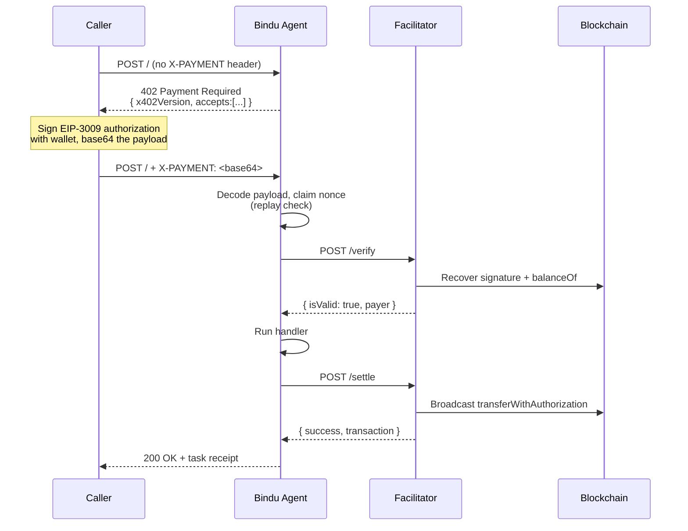

Your agent costs real money to run — LLM tokens, compute, a paid API behind the scenes. You want callers to chip in *before* the work happens, programmatically, without invoices or dashboards or human approval.

Bindu plugs into [**x402**](https://github.com/coinbase/x402), an open protocol that revives the long-dormant `HTTP 402 Payment Required` status for machine payments. A caller hits your agent; if they haven't paid, you reply `402` with exactly what's owed. They sign a one-shot authorization with their wallet, retry with an `X-PAYMENT` header, and your handler runs only after a facilitator has verified the payment on-chain.

## Why HTTP 402

| Without payment gating | With Bindu x402 |
| --- | --- |
| Anyone hits your handler; you eat the compute | Callers must prove payment before the handler runs |
| Billing depends on dashboards, webhooks, accounts | Settlement is a signed EIP-3009 authorization on a blockchain |
| Per-call micropayments are impractical | Per-call micropayments are native (USDC scales to 6 decimals) |
| Replay protection is your problem | Bindu rejects replayed nonces before settlement |
| Hard to compose into autonomous A2A workflows | Built into the A2A request path; agents can pay agents |
| Coupled to a centralized provider | Facilitator is pluggable; chains/tokens are operator-configurable |

<Note>
  x402 is for **per-request micropayments between machines** — a few cents
  per call, on the request hot path. It is not a replacement for subscriptions,
  marketplaces, or human checkout flows. Different problem, different tool.
</Note>

## The Protocol Flow


```mermaid
sequenceDiagram
    participant Caller
    participant Agent as Bindu Agent
    participant Facilitator
    participant Chain as Blockchain

    Caller->>Agent: POST / (no X-PAYMENT header)
    Agent-->>Caller: 402 Payment Required<br/>{ x402Version, accepts:[...] }

    Note over Caller: Sign EIP-3009 authorization<br/>with wallet, base64 the payload

    Caller->>Agent: POST / + X-PAYMENT: <base64>
    Agent->>Agent: Decode payload, claim nonce<br/>(replay check)
    Agent->>Facilitator: POST /verify
    Facilitator->>Chain: Recover signature + balanceOf
    Facilitator-->>Agent: { isValid: true, payer }
    Agent->>Agent: Run handler
    Agent->>Facilitator: POST /settle
    Facilitator->>Chain: Broadcast transferWithAuthorization
    Facilitator-->>Agent: { success, transaction }
    Agent-->>Caller: 200 OK + task receipt
```

Three trips, four moving parts:

1. **Caller** — anything that speaks HTTP and can sign with an EVM wallet.
2. **Your Bindu agent** — gatekeeper. Tells callers what it costs, accepts proof, runs the handler.
3. **Facilitator** — separate HTTP service. Reads the signature, checks the chain, broadcasts the transfer. Bindu never speaks to the blockchain directly; it trusts the facilitator's yes/no.
4. **Blockchain** — where USDC actually moves.

<CardGroup cols={3}>
  <Card title="402 + retry" icon="rotate">
    Standard HTTP. No SDK lock-in for the caller — just a header and a body.
  </Card>
  <Card title="Verified on-chain" icon="shield-check">
    Facilitator recovers EIP-3009 signatures and checks balance before the handler runs.
  </Card>
  <Card title="Replay-safe" icon="lock">
    Nonces are claimed in Redis (or in-memory) before settlement. Re-sent payloads bounce.
  </Card>
</CardGroup>

---

## Turning Payments On

Add one block to your `bindufy` config — a price, a token, a network, an address:

```python
from bindu.penguin.bindufy import bindufy

config = {
    "author": "you@example.com",
    "name": "paid_agent",
    "description": "An agent that earns its keep.",
    "deployment": {"url": "http://localhost:3773", "expose": True},

    # ← The whole "I cost money" surface lives in this block.
    "execution_cost": {
        "amount": "0.01",                          # 1 cent. String, not float.
        "token": "USDC",                           # USDC is what's supported today.
        "network": "base-sepolia",                 # Base's testnet.
        "pay_to_address": "0xYourWalletHere",      # Where the money lands.
    },
}

bindufy(config, handler)
```

That's it. Any caller hitting `message/send` without payment now gets a 402 describing exactly what's required.

<Note>
  By default only `message/send` is gated. To gate more methods set the
  environment variable `X402__PROTECTED_METHODS` or edit
  `app_settings.x402.protected_methods`. The default is intentionally narrow —
  you don't want to charge for `tasks/get` polling.
</Note>

### Multiple payment options

Make `execution_cost` a list and the 402 response advertises **all** of them. The caller picks one:

```python
"execution_cost": [
    {
        "amount": "0.1",
        "token": "USDC",
        "network": "base",
        "pay_to_address": "0xYourWallet",
    },
    {
        "amount": "0.01",
        "token": "USDC",
        "network": "skale-europa",
        "pay_to_address": "0xYourSkaleWallet",
    },
],
```

<Warning>
  Strings only for `amount`. The middleware multiplies by `10**asset_decimals`
  (6 for USDC), so `"0.01"` becomes `10000` atomic units on the wire.
  Floats round inconsistently; strings don't.
</Warning>

---

## What 402 Actually Looks Like

When a caller hits a protected method without `X-PAYMENT`, Bindu replies with the v2 wire format from `x402.PaymentRequired`:

```json
{
  "x402Version": 2,
  "error": "X-PAYMENT header required",
  "accepts": [
    {
      "scheme": "exact",
      "network": "eip155:84532",
      "asset": "0x036CbD53842c5426634e7929541eC2318f3dCF7e",
      "amount": "10000",
      "payTo": "0xYourWallet",
      "maxTimeoutSeconds": 60,
      "extra": { "name": "USDC", "version": "2" }
    }
  ],
  "agent": {
    "name": "paid_agent",
    "description": "An agent that earns its keep.",
    "agentCard": "/.well-known/agent.json"
  }
}
```

The translation that just happened:

- `"0.01"` from your config → `"10000"` on the wire (atomic units; USDC has 6 decimals).
- `"base-sepolia"` from your config → `"eip155:84532"` (CAIP-2 chain ID; the x402 v2 SDK keys everything off CAIP-2 strings internally).
- `extra.name` / `extra.version` populate the **EIP-712 domain** the caller must sign over — must match the on-chain token's domain separator or signature recovery fails.

The `agent` block is Bindu-specific (not part of the x402 spec) — it lets callers discover the agent card without a second round-trip.

### What the caller sends back

The caller builds an EIP-3009 `TransferWithAuthorization`, signs it with their wallet, wraps it in the v2 payload envelope, and base64-encodes the JSON:

```json
{
  "x402Version": 2,
  "payload": {
    "signature": "0x...",
    "authorization": {
      "from":  "0xCallerWallet",
      "to":    "0xYourWallet",
      "value": "10000",
      "validAfter":  "0",
      "validBefore": "9999999999",
      "nonce": "0x<random-32-bytes>"
    }
  },
  "accepted": {
    "scheme": "exact",
    "network": "eip155:84532",
    "asset":   "0x036CbD53842c5426634e7929541eC2318f3dCF7e",
    "amount":  "10000",
    "payTo":   "0xYourWallet",
    "maxTimeoutSeconds": 60,
    "extra": { "name": "USDC", "version": "2" }
  }
}
```

That JSON, base64-encoded, becomes the `X-PAYMENT` header on the retry.

<Info>
  v1 payloads are **rejected** outright. The middleware logs
  `"x402 v1 payment payloads are no longer accepted; please re-sign with v2"`
  and returns 402. Re-sign with a v2 client.
</Info>

---

## End-to-End Flow

<Steps>
  <Step title="Unpaid request">
    Caller fires a `message/send` with no `X-PAYMENT`. Middleware replies 402
    with the `accepts` block above.

    ```bash
    curl -i -X POST http://localhost:3773/ \
      -H 'Content-Type: application/json' \
      -d '{
        "jsonrpc": "2.0",
        "method":  "message/send",
        "id":      "req-1",
        "params":  { "message": { "role": "user", "parts": [{ "kind": "text", "text": "hi" }] } }
      }'
    # HTTP/1.1 402 Payment Required
    # Content-Type: application/json
    # { "x402Version": 2, "error": "X-PAYMENT header required", "accepts": [...] }
    ```
  </Step>

  <Step title="Sign + retry">
    Caller signs an EIP-3009 authorization with their wallet, base64-encodes
    the v2 payload, sends it as `X-PAYMENT`.

    ```bash
    PAYMENT=$(python build_payment.py)   # produces base64 of the JSON above

    curl -X POST http://localhost:3773/ \
      -H 'Content-Type: application/json' \
      -H "X-PAYMENT: $PAYMENT" \
      -d '{ "jsonrpc": "2.0", "method": "message/send", "id": "req-2", "params": {...} }'
    ```

    The middleware now:

    1. Decodes the base64 + parses the v2 payload.
    2. Matches it against your `execution_cost` requirements (`find_matching_requirements`).
    3. Claims `(network, asset, nonce)` in the nonce store — **before** any facilitator round-trip. Replays bounce here.
    4. Calls the facilitator's `/verify` — signature recovery + on-chain `balanceOf`. Trusts `result.is_valid`. No fall-through.
    5. Hands the request off to your handler with `request.state.payer` set.
  </Step>

  <Step title="Handler runs, settlement at completion">
    Your handler executes. When the task finishes, the worker calls the
    facilitator's `/settle` endpoint, which broadcasts the
    `transferWithAuthorization` on-chain. The receipt lands on the task:

    ```json
    {
      "result": {
        "status": { "state": "completed" },
        "artifacts": [{ "parts": [{ "kind": "text", "text": "..." }] }],
        "metadata": {
          "x402.payment.status": "payment-completed",
          "x402.payment.receipts": [{
            "success":     true,
            "payer":       "0xCallerWallet",
            "transaction": "0x<tx-hash>",
            "network":     "eip155:84532"
          }]
        }
      }
    }
    ```

    The `metadata` block is your audit trail. `x402.payment.status` and
    `x402.payment.receipts` are the keys to query later if you ever need to
    reconcile, dispute, or refund.
  </Step>
</Steps>

---

## Browser-Capture Flow (for non-agent callers)

Sometimes the caller is a human, not another agent — and a human wants to click a MetaMask popup, not generate an EIP-3009 signature in Python. Bindu ships three endpoints that wrap the same x402 machinery in a browser-friendly flow:

| Endpoint | Method | Purpose |
| --- | --- | --- |
| `/api/start-payment-session` | POST | Mint a session ID + `browser_url`. |
| `/payment-capture?session_id=...` | GET | Paywall page; renders MetaMask flow; captures the signed token. |
| `/api/payment-status/{session_id}` | GET | Poll for the captured `payment_token` (base64). |

```bash
# 1. Start a session
curl -X POST http://localhost:3773/api/start-payment-session
# { "session_id": "...", "browser_url": ".../payment-capture?session_id=...",
#   "expires_at": "...", "status": "pending" }

# 2. User opens browser_url, completes payment in their wallet.

# 3. Poll for the captured token
curl http://localhost:3773/api/payment-status/<session_id>
# { "session_id": "...", "status": "completed",
#   "payment_token": "<base64-X-PAYMENT-value>" }

# 4. Use that payment_token as the X-PAYMENT header on your real request.
```

<Note>
  Sessions expire after **15 minutes** by default (see
  `PaymentSessionManager(session_timeout_minutes=15)`). The token returned by
  `/api/payment-status/...` is the same base64 payload the middleware expects
  — Bindu **does not consume it** when you poll, so you can pass it on to
  the actual `message/send` call.
</Note>

---

## Facilitators and Networks

Bindu doesn't talk to chains directly. It talks to a **facilitator** — an HTTP service that implements `/supported`, `/verify`, `/settle` per the x402 spec. The facilitator is what dictates which chains and tokens actually work.

<AccordionGroup>
  <Accordion title="Default facilitator (Coinbase)">
    `https://x402.org/facilitator` — Coinbase-operated, this is what Bindu uses
    out of the box. Supports Base mainnet, Base Sepolia, plus some non-EVM
    chains (Solana, Algorand, Aptos, Stellar) via x402's broader scheme set.

    **Does not** support SKALE, Polygon, Avalanche, Ethereum mainnet, or
    arbitrary L2s. If you need those, you need a different facilitator.
  </Accordion>

  <Accordion title="Swapping facilitators">
    Single environment variable:

    ```bash
    export X402__FACILITATOR_URL=https://your-facilitator.example.com
    ```

    Bindu picks it up at startup and wires the
    `HTTPFacilitatorClient(FacilitatorConfig(url=...))` into the
    `x402ResourceServer`. Restart the agent for the change to take effect.
  </Accordion>

  <Accordion title="Adding non-default EVM chains">
    The x402 v2 SDK only ships built-in asset metadata for Base mainnet
    (`eip155:8453`) and Base Sepolia (`eip155:84532`). For any other EVM
    chain, you need to declare two things:

    1. **A facilitator that supports it** (set via `X402__FACILITATOR_URL`).
    2. **The USDC contract on that chain**, so Bindu can convert a
       human-readable price like `"$0.01"` into atomic units of the right
       ERC-20.

    The second piece lives in `app_settings.x402.extra_networks`:

    ```python
    # bindu/settings.py — ships with this entry by default
    extra_networks = {
        "skale-europa": ExtraNetwork(
            caip2="eip155:1187947933",
            asset="0x85889c8c714505E0c94b30fcfcF64fE3Ac8FCb20",
            asset_symbol="USDC",
            asset_name="Bridged USDC (SKALE Bridge)",
            asset_decimals=6,
            asset_eip712_version="2",
        ),
    }
    ```

    `asset_name` and `asset_eip712_version` go straight into the EIP-712
    domain the caller signs over — they **must** match the on-chain token's
    `name()` and domain version, or signature recovery on the facilitator
    side fails.

    With that registered, your agent config uses the friendly slug:

    ```python
    "execution_cost": {
        "amount": "0.01",
        "token":  "USDC",
        "network": "skale-europa",   # Bindu translates to eip155:1187947933
        "pay_to_address": "0xYourWallet",
    },
    ```
  </Accordion>

  <Accordion title="Built-in network slugs">
    Bindu translates these friendly names to CAIP-2 automatically:

    | Slug | CAIP-2 |
    | --- | --- |
    | `base-sepolia` | `eip155:84532` |
    | `base`, `base-mainnet` | `eip155:8453` |
    | `ethereum`, `ethereum-mainnet` | `eip155:1` |
    | `ethereum-sepolia` | `eip155:11155111` |
    | *(operator-defined)* | from `extra_networks[...].caip2` |

    Anything else gets passed through verbatim — useful if you already speak
    CAIP-2.
  </Accordion>
</AccordionGroup>

---

## Configuration Reference

All settings live on `app_settings.x402` (env prefix `X402__`):

| Setting | Env var | Default | Purpose |
| --- | --- | --- | --- |
| `facilitator_url` | `X402__FACILITATOR_URL` | `https://x402.org/facilitator` | Where `/verify` and `/settle` are called. |
| `default_network` | `X402__DEFAULT_NETWORK` | `base-sepolia` | Used when `execution_cost.network` is missing. |
| `pay_to_env` | `X402__PAY_TO_ENV` | `X402_PAY_TO` | Env var name for the recipient wallet (fallback). |
| `max_timeout_seconds` | `X402__MAX_TIMEOUT_SECONDS` | `600` | Hard ceiling on authorization windows. |
| `extension_uri` | `X402__EXTENSION_URI` | `https://github.com/google-a2a/a2a-x402/v0.1` | A2A extension URI advertised on the agent card. |
| `protected_methods` | `X402__PROTECTED_METHODS` | `["message/send"]` | JSON-RPC methods that demand payment. |
| `extra_networks` | (Python only) | `{ "skale-europa": ... }` | Operator-supplied EVM chain registrations. |

<Note>
  Per-requirement `max_timeout_seconds` is hard-coded to **60** in
  `_create_payment_requirements` — that's the EIP-3009 authorization window
  Bindu advertises in the 402. `app_settings.x402.max_timeout_seconds` is the
  outer ceiling, not the per-request value.
</Note>

---

## Replay Protection

Without server-side dedupe, a caller who saw one valid payment could replay it within the `validBefore` window and get unlimited work for one payment. Bindu closes this by claiming `(network, asset, nonce)` in a nonce store **before** calling the facilitator:

| Backend | When | TTL |
| --- | --- | --- |
| `InMemoryNonceStore` | No Redis configured | `max_timeout_seconds + 60s buffer` |
| `RedisNonceStore` | `app_settings.scheduler.redis_url` set | Same, via `SET NX EX` (atomic) |

A replayed payload returns `402 { "error": "Payment nonce already used (replay)" }` and **never** reaches the facilitator. The buffer (`NONCE_TTL_BUFFER_SECONDS = 60`) keeps the dedupe key alive a bit past the EIP-3009 `validBefore` so clock skew or a slow settlement doesn't free the slot prematurely.

<Warning>
  In-memory dedupe is **per-process**. If you run multiple Bindu workers
  behind a load balancer without Redis, a replay against a sibling worker
  will not be caught. Configure
  `app_settings.scheduler.redis_url` for any production multi-process
  deployment.
</Warning>

---

## How the Middleware Decides

Pipeline on every request to the protected path (`/`, `POST`):

1. **Parse JSON-RPC body.** Unparseable → `402 { "error": "Malformed JSON-RPC body" }`. (A previous `except Exception` here let bad bodies fall through to the handler unpaid; that's fixed.)
2. **Method check.** If the method isn't in `protected_methods`, the request flows straight through unpaid.
3. **`X-PAYMENT` present?** Missing → 402.
4. **Decode + parse v2 payload.** Bad base64 or bad JSON → 402.
5. **Match a requirement.** No match → `402 { "error": "No matching payment requirements found" }`.
6. **Claim the nonce.** Already used → `402 { "error": "Payment nonce already used (replay)" }`. Store error → fail closed.
7. **Facilitator `/verify`.** `isValid: false` or exception → 402 with `Invalid payment: <reason>` or `Payment verification failed`.
8. **Handler runs.** On task completion, the worker calls `/settle` and stamps the receipt onto task metadata.

Every step **fails closed**. There is no fall-through path that runs the handler on an error.

---

## Going to Production

<Steps>
  <Step title="Develop on testnet">
    Use `base-sepolia` and the Coinbase facilitator. Get testnet ETH from a
    Base Sepolia faucet for gas; get testnet USDC from the Base Sepolia USDC
    faucet. Run the full flow against your own agent until the happy path is
    boring.
  </Step>
  <Step title="Flip one config line">
    Change `"network": "base-sepolia"` to `"network": "base"`. Same code,
    same wallet shape, same payload shape — real USDC on Base mainnet.
  </Step>
  <Step title="Configure Redis">
    Set `app_settings.scheduler.redis_url`. Without it, replay protection is
    per-process and breaks under horizontal scale.
  </Step>
  <Step title="Pick prices that match your costs">
    A penny per call sounds reasonable until an LLM call costs you five
    cents. Math out provider cost vs `amount` before you ship. Each new task
    needs a new payment — a finished task doesn't grant credit to the next
    one.
  </Step>
  <Step title="Watch the receipts">
    Every settled task has `metadata["x402.payment.receipts"]` attached.
    That's your audit trail. Persist it. If you ever need to dispute or
    reconcile, this is where you start.
  </Step>
</Steps>

---

## Calling a Paid Agent from Python

Once you've got a base64 `X-PAYMENT` (either signed yourself or fetched from `/api/payment-status/...`), the actual call is unremarkable:

```python
import httpx, uuid

async def call_paid_agent(payment_token: str, prompt: str) -> dict:
    body = {
        "jsonrpc": "2.0",
        "method":  "message/send",
        "id":      str(uuid.uuid4()),
        "params": {
            "configuration": {"accepted_output_modes": ["text"]},
            "message": {
                "role":  "user",
                "kind":  "message",
                "parts": [{"kind": "text", "text": prompt}],
                "messageId": str(uuid.uuid4()),
                "contextId": str(uuid.uuid4()),
                "taskId":    str(uuid.uuid4()),
            },
        },
    }
    async with httpx.AsyncClient() as client:
        r = await client.post(
            "http://localhost:3773/",
            headers={"X-PAYMENT": payment_token, "Content-Type": "application/json"},
            json=body,
        )
    return r.json()
```

For a complete signing example targeting Base Sepolia, see the `hermes_agent` example in the Bindu repo — same EIP-3009 flow works on any EVM chain.

---

## Troubleshooting

<AccordionGroup>
  <Accordion title="Caller keeps getting 402 forever">
    The `X-PAYMENT` header is missing, malformed, or doesn't match any
    advertised requirement. The 402 body tells you exactly which (`error`
    field).
  </Accordion>

  <Accordion title='"Payment verification failed"'>
    The facilitator's `/verify` raised or returned `isValid: false`. Either
    the signature is wrong, the chain is wrong, or the facilitator doesn't
    know the chain you asked for. Check the agent's server logs for the
    facilitator's `invalid_reason`.
  </Accordion>

  <Accordion title='"Payment nonce already used (replay)"'>
    Caller is sending the same authorization twice. They need to sign a
    fresh one with a new nonce for every request.
  </Accordion>

  <Accordion title='"No matching payment requirements found"'>
    The `accepted` block in the payload doesn't match anything in your
    `execution_cost`. Usually a network or asset address mismatch — confirm
    the caller signed for the same `network` and `asset` you advertised.
  </Accordion>

  <Accordion title='"x402 v1 payment payloads are no longer accepted"'>
    The caller's library is producing v1 payloads. v2 verification on the
    Bindu side rejects them; re-sign with a v2 client.
  </Accordion>
</AccordionGroup>

---

## Related

- [x402 Protocol](https://github.com/coinbase/x402) — the open standard everything here is built on.
- [Base documentation](https://docs.base.org/network-information) — what you'll be paying on by default.
- [Decentralized Identifiers (DIDs)](/bindu/learn/did/overview) — pair payment with peer identity for end-to-end accountability.

<span className="brand-quote">
  

  <span className="brand-quote-text">
    Bindu allows agents to bloom independently —{" "}
    <span className="brand-quote-highlight">turning trust into verifiable value</span>,
    and bringing light to the Internet of Agents.
  </span>
</span>
