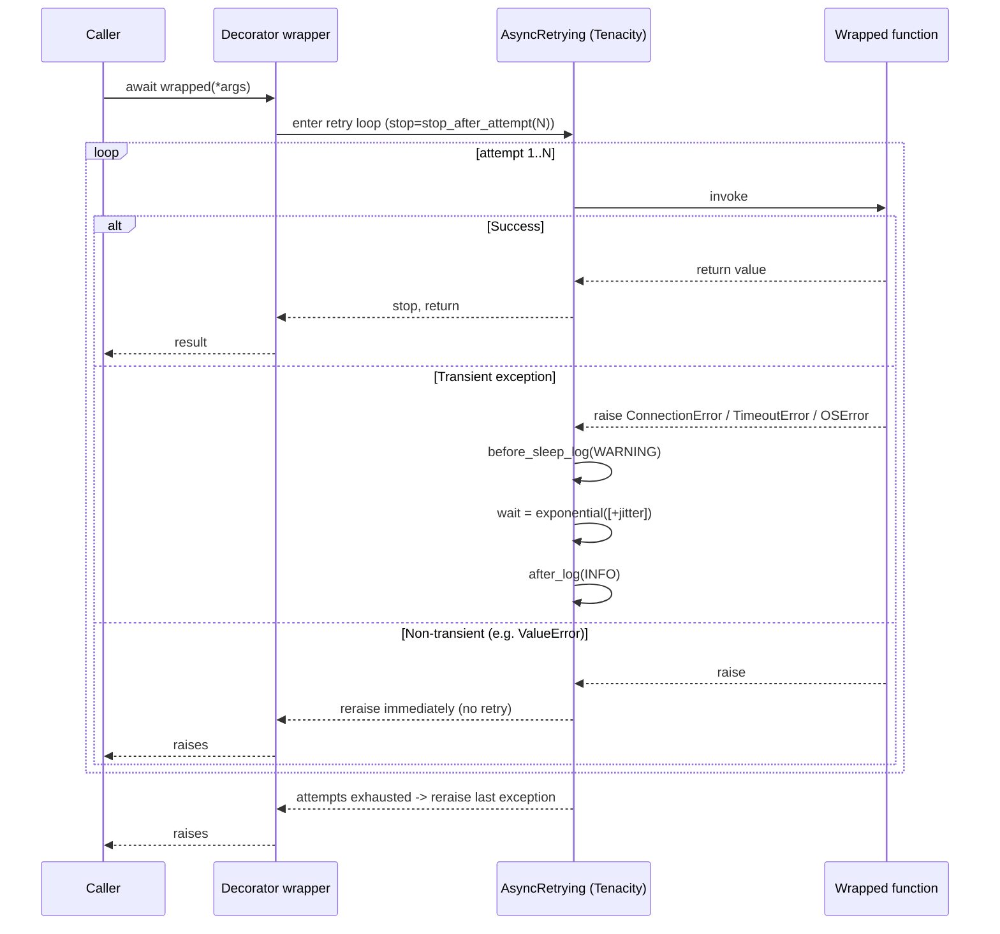

Things fail in production for ordinary reasons. A database connection drops. Redis goes away for a moment. An API times out. Most of those failures are transient. If the system treats every one of them as final, tasks fail for no good reason and recovering services get hammered the instant they come back.

Bindu wraps every brittle boundary — workers, storage, scheduler, outbound HTTP — in a small set of Tenacity decorators that retry transient errors with exponential backoff and reraise everything else immediately.

## Why Retry Matters

| Without retry                                                     | With Bindu retry                                            |
| ----------------------------------------------------------------- | ----------------------------------------------------------- |
| Temporary failures surface as immediate task failures             | Transient errors recover automatically before users see them |
| Recovering services get a thundering herd                         | Per-attempt backoff (with jitter on three of four families) spreads load |
| Worker, storage, scheduler, and HTTP each need custom handling    | Four named decorators wrap the same Tenacity machinery       |
| Logic bugs and transient errors are retried indistinguishably     | Only a narrow allowlist of transient exceptions is retried   |
| Tuning behaviour requires code changes                            | `RETRY__*` env vars override every default                   |

## How Bindu Retry Works

All four decorators are thin wrappers around a single factory, `create_retry_decorator(operation_type, ...)`, defined in `bindu/utils/retry.py`. The factory:

1. Looks up the family's defaults on `app_settings.retry` (or honours your override).
2. Picks a wait strategy — `wait_random_exponential` (jitter) or `wait_exponential` (no jitter).
3. Builds an `AsyncRetrying` loop that retries only on `TRANSIENT_EXCEPTIONS`.
4. Logs at `WARNING` before each sleep (via `before_sleep_log`) and at `INFO` after each attempt (via `after_log`).
5. Reraises the original exception once attempts are exhausted (`reraise=True`).

<Note>
Only **transient** exceptions are retried. Application errors like `ValueError` or `KeyError` raise on the first attempt — they are not in the retry list.
</Note>

### The Lifecycle: Fail, Wait, Try Again



### What Counts As Transient

The allowlist lives in `bindu/utils/retry.py` as `TRANSIENT_EXCEPTIONS`:

```python
TRANSIENT_EXCEPTIONS = (
    ConnectionError,
    ConnectionRefusedError,
    ConnectionResetError,
    ConnectionAbortedError,
    TimeoutError,
    asyncio.TimeoutError,
    OSError,  # covers BrokenPipeError and friends
)
```

A second tuple, `HTTP_RETRYABLE_EXCEPTIONS`, extends this with `HTTPConnectionError`, `HTTPTimeoutError`, and `HTTPServerError` (5xx). It is defined for HTTP callers but the four headline decorators currently all use `TRANSIENT_EXCEPTIONS`.

<Info>
Subclasses count: any custom exception that inherits from `ConnectionError`, `TimeoutError`, or `OSError` is retried automatically.
</Info>

### Backoff: Plain vs. Jittered

Bindu picks between two Tenacity wait strategies per family:

```python
wait_strategy = (
    wait_random_exponential(multiplier=1, min=_min_wait, max=_max_wait)
    if use_jitter
    else wait_exponential(multiplier=1, min=_min_wait, max=_max_wait)
)
```

- `wait_exponential` doubles the wait each attempt, clamped to `[min_wait, max_wait]`. Deterministic. Used for **storage**.
- `wait_random_exponential` samples uniformly in `[0, min(max_wait, multiplier * 2^attempt)]`. Spreads retries to avoid thundering herds. Used for **worker**, **scheduler**, and **api**.

Storage is intentionally jitter-free: a single process serialises its own retries, and deterministic backoff is easier to reason about against a local in-memory store. Anything that talks over the network gets jitter so that N pods don't all retry at the same instant.

---

## The Four Decorator Families

<CardGroup cols={2}>
  <Card title="retry_worker_operation" icon="screwdriver-wrench">
    Wraps `ManifestWorker` task execution. Default 3 attempts, 1.0–10.0 s, jittered. Used in `bindu/server/workers/manifest_worker.py` on `run_task` and `cancel_task`.
  </Card>
  <Card title="retry_storage_operation" icon="database">
    Wraps storage CRUD on the in-memory backend. Default 5 attempts, 0.5–5.0 s, **no jitter**. Used in `bindu/server/storage/memory_storage.py` on `load_task`, `submit_task`, `update_task`.
  </Card>
  <Card title="retry_scheduler_operation" icon="calendar-days">
    Wraps scheduler enqueue calls. Default 3 attempts, 1.0–8.0 s, jittered. Used in `bindu/server/scheduler/memory_scheduler.py` and `bindu/server/scheduler/redis_scheduler.py` on `run_task`, `cancel_task`, `pause_task`, `resume_task`.
  </Card>
  <Card title="retry_api_call" icon="globe">
    Wraps outbound HTTP. Default 4 attempts, 1.0–15.0 s, jittered. Used via `create_retry_decorator("api")` on the HTTP client in `bindu/utils/http/client.py` (`get`, `post`, `put`, `delete`, `request`) and on push delivery in `bindu/utils/notifications.py` (`_post_with_retry`).
  </Card>
</CardGroup>

All four call into the same `create_retry_decorator(operation_type, ...)` factory. They exist as named convenience wrappers for grep-ability and for backward compatibility — calling `create_retry_decorator("api")` is exactly equivalent to `retry_api_call()`.

### Why four decorators, not one?

The split is operational, not technical:

- **Storage** retries should be many and fast — a flaky local connection deserves five 0.5–5 s pokes, not three 10 s sulks. Storage runs in-process, so jitter buys you nothing.
- **API** retries should be fewer and longer — remote services need room to breathe, and jitter prevents pods from synchronising.
- **Worker** retries cover task execution and should be conservative; retrying agent logic too aggressively masks real bugs.
- **Scheduler** retries cover broker hand-off, where the failure mode is "Redis briefly unavailable" — short attempts, modest wait.

Each family has its own env knobs so you can tune them independently without rebuilding the image.

---

## Defaults and Configuration

### Family Defaults

Defined in `RetrySettings` (`bindu/settings.py`):

| Family    | `max_attempts` | `min_wait` | `max_wait` | Jitter |
| --------- | -------------- | ---------- | ---------- | ------ |
| worker    | 3              | 1.0 s      | 10.0 s     | yes    |
| storage   | 5              | 0.5 s      | 5.0 s      | **no** |
| scheduler | 3              | 1.0 s      | 8.0 s      | yes    |
| api       | 4              | 1.0 s      | 15.0 s     | yes    |

### Environment Variables

`RetrySettings` lives under the top-level `Settings` model, which uses `env_nested_delimiter="__"`. The variable name is `RETRY__<field>`:

```bash
# Worker
RETRY__WORKER_MAX_ATTEMPTS=3
RETRY__WORKER_MIN_WAIT=1.0
RETRY__WORKER_MAX_WAIT=10.0

# Storage
RETRY__STORAGE_MAX_ATTEMPTS=5
RETRY__STORAGE_MIN_WAIT=0.5
RETRY__STORAGE_MAX_WAIT=5.0

# Scheduler
RETRY__SCHEDULER_MAX_ATTEMPTS=3
RETRY__SCHEDULER_MIN_WAIT=1.0
RETRY__SCHEDULER_MAX_WAIT=8.0

# External API
RETRY__API_MAX_ATTEMPTS=4
RETRY__API_MIN_WAIT=1.0
RETRY__API_MAX_WAIT=15.0
```

<Note>
Per-call overrides on the decorator (`@retry_storage_operation(max_attempts=10)`) win over env vars, which win over the defaults baked into `RetrySettings`. The `or` fallback inside `create_retry_decorator` means an override of `0` or `None` falls back to settings — pass a real positive value.
</Note>

---

## Decorator Reference

<AccordionGroup>

<Accordion title="retry_worker_operation()" icon="screwdriver-wrench">

**Family**: `worker` &middot; **Jitter**: yes &middot; **Defaults**: 3 attempts, 1.0–10.0 s

Wraps task execution on `ManifestWorker`. Failures during `manifest.run(...)` only retry when they bubble up as `ConnectionError`/`TimeoutError`/`OSError`. Agent-side `ValueError` or `RuntimeError` is **not** retried — the worker catches it, marks the task `failed`, and reraises.

Real call sites (`bindu/server/workers/manifest_worker.py`):

```python
@retry_worker_operation()                     # line 96
async def run_task(self, params: TaskSendParams) -> None: ...

@retry_worker_operation(max_attempts=2)       # line 232
async def cancel_task(self, params: TaskIdParams) -> None: ...
```

`cancel_task` deliberately caps at 2 attempts: a cancel that fails twice is not going to start working on attempt three.

</Accordion>

<Accordion title="retry_storage_operation()" icon="database">

**Family**: `storage` &middot; **Jitter**: **no** (`wait_exponential`) &middot; **Defaults**: 5 attempts, 0.5–5.0 s

Wraps storage CRUD on `InMemoryStorage`. The implementation overrides per-call to a tighter budget tuned for in-process memory:

`bindu/server/storage/memory_storage.py` (lines 41–44):

```python
DEFAULT_STORAGE_RETRY_ATTEMPTS = 3
DEFAULT_STORAGE_MIN_WAIT = 0.1
DEFAULT_STORAGE_MAX_WAIT = 1.0
```

Applied at lines 71, 103, 242:

```python
@retry_storage_operation(
    max_attempts=DEFAULT_STORAGE_RETRY_ATTEMPTS,
    min_wait=DEFAULT_STORAGE_MIN_WAIT,
    max_wait=DEFAULT_STORAGE_MAX_WAIT,
)
async def load_task(self, task_id, history_length=None) -> Task | None: ...
```

Same decorator covers `submit_task` and `update_task`.

<Info>
The Postgres storage backend does **not** use `@retry_storage_operation`. It calls `execute_with_retry` directly via its own `_retry_on_connection_error` helper (`bindu/server/storage/postgres_storage.py` line 243), keyed off `storage.postgres_max_retries` and `storage.postgres_retry_delay` from `StorageSettings`. So the `RETRY__STORAGE_*` env vars affect the in-memory backend and any code that uses the decorator directly — they do not retune Postgres.
</Info>

</Accordion>

<Accordion title="retry_scheduler_operation()" icon="calendar-days">

**Family**: `scheduler` &middot; **Jitter**: yes &middot; **Defaults**: 3 attempts, 1.0–8.0 s

Wraps the four enqueue operations on both scheduler backends.

`bindu/server/scheduler/redis_scheduler.py` (lines 114, 124, 134, 144):

```python
@retry_scheduler_operation()
async def run_task(self, params: TaskSendParams) -> None: ...

@retry_scheduler_operation()
async def cancel_task(self, params: TaskIdParams) -> None: ...

@retry_scheduler_operation()
async def pause_task(self, params: TaskIdParams) -> None: ...

@retry_scheduler_operation()
async def resume_task(self, params: TaskIdParams) -> None: ...
```

`bindu/server/scheduler/memory_scheduler.py` (lines 73, 83, 93, 103) overrides defaults for its anyio stream — tight 0.1–1.0 s window across 3 attempts:

```python
DEFAULT_RETRY_ATTEMPTS = 3
DEFAULT_RETRY_MIN_WAIT = 0.1
DEFAULT_RETRY_MAX_WAIT = 1.0

@retry_scheduler_operation(
    max_attempts=DEFAULT_RETRY_ATTEMPTS,
    min_wait=DEFAULT_RETRY_MIN_WAIT,
    max_wait=DEFAULT_RETRY_MAX_WAIT,
)
async def run_task(self, params: TaskSendParams) -> None: ...
```

</Accordion>

<Accordion title="retry_api_call()" icon="globe">

**Family**: `api` &middot; **Jitter**: yes &middot; **Defaults**: 4 attempts, 1.0–15.0 s

The headline name. Internally, Bindu's HTTP client and push notifier reach for the factory directly so they can mix in extra parameters.

`bindu/utils/http/client.py` (lines 195, 219, 245, 271, 291):

```python
@create_retry_decorator("api")
async def get(self, endpoint, *, params=None, headers=None, **kwargs): ...

@create_retry_decorator("api")
async def post(self, endpoint, *, data=None, json=None, headers=None, **kwargs): ...
```

`bindu/utils/notifications.py` (line 125) — push delivery uses a tighter override:

```python
@create_retry_decorator("api", max_attempts=3, min_wait=0.5, max_wait=5.0)
async def _post_with_retry(self, url, resolved_ip, headers, payload, event): ...
```

Push delivery additionally short-circuits the retry for 4xx (except 429) inside the wrapped body — the decorator only sees the exceptions you let escape.

</Accordion>

</AccordionGroup>

---

## Inside an Attempt

<Steps>
  <Step title="Invoke the wrapped function">
    `AsyncRetrying` enters its loop with `stop=stop_after_attempt(N)`, `wait=<exponential strategy>`, `retry=retry_if_exception_type(TRANSIENT_EXCEPTIONS)`, `reraise=True`. A `debug` log records the attempt number.
  </Step>
  <Step title="On success: stop">
    The `with attempt:` block records success; the `async for` exits and the wrapper returns the value.
  </Step>
  <Step title="On non-transient exception: reraise now">
    Anything outside `TRANSIENT_EXCEPTIONS` (e.g. `ValueError`) skips the retry-decision path and propagates immediately. There is no backoff and no further attempt.
  </Step>
  <Step title="On transient exception: log and sleep">
    `before_sleep_log(logger, WARNING)` writes a warning. The wait strategy computes the next sleep — `min(max_wait, multiplier * 2^attempt)` either deterministic (storage) or sampled uniformly (everyone else). `after_log(logger, INFO)` records the attempt outcome.
  </Step>
  <Step title="On exhaustion: reraise the last exception">
    Once `stop_after_attempt` trips, `reraise=True` means the **original** exception is raised — not a `RetryError`. Callers see the underlying `ConnectionError` and can catch it normally.
  </Step>
</Steps>

---

## Examples

### Custom decorator usage

```python
from bindu.utils.retry import (
    retry_worker_operation,
    retry_storage_operation,
    retry_api_call,
)

@retry_worker_operation(max_attempts=2)
async def cancel_task(self, params): ...

@retry_storage_operation(max_attempts=10, min_wait=2.0)
async def slow_update(self, task_id, state): ...

@retry_api_call(max_attempts=6, max_wait=30.0)
async def call_llm(self, prompt: str) -> str: ...
```

### Ad-hoc retry (no decorator)

`execute_with_retry` is what `applications.py` uses to retry storage and scheduler construction at startup, and what `postgres_storage.py` uses for every query.

```python
from bindu.utils.retry import execute_with_retry

result = await execute_with_retry(
    fetch_remote_thing,
    "task_id_123",
    max_attempts=5,
    min_wait=1.0,
    max_wait=10.0,
)
```

It uses `wait_random_exponential` (jitter) and the same `TRANSIENT_EXCEPTIONS` allowlist.

### Env-var overrides for a noisy network

```bash
# Network-flaky environment: more attempts, longer ceiling
RETRY__API_MAX_ATTEMPTS=6
RETRY__API_MIN_WAIT=2.0
RETRY__API_MAX_WAIT=30.0

# Local dev with reliable storage: keep retries snappy
RETRY__STORAGE_MAX_ATTEMPTS=3
RETRY__STORAGE_MIN_WAIT=0.1
RETRY__STORAGE_MAX_WAIT=1.0
```

### Make sure operations are idempotent

Anything wrapped by a retry decorator should be safe to run twice. Set-like operations are naturally idempotent:

```python
@retry_storage_operation()
async def update_task_status(self, task_id: UUID, status: str) -> None:
    await self.db.execute(
        "UPDATE tasks SET status = :status WHERE task_id = :task_id",
        {"status": status, "task_id": task_id},
    )
```

### Distinguish transient from logic errors

```python
@retry_api_call()
async def call_api(self, data: dict) -> dict:
    response = await api_client.post("/endpoint", json=data)
    if response.status_code == 400:
        raise ValueError("Invalid request")  # NOT retried - not in TRANSIENT_EXCEPTIONS
    if response.status_code >= 500:
        raise ConnectionError("Upstream 5xx")  # retried
    return response.json()
```

### Sample log output

A storage call that fails twice then succeeds (logger `bindu.utils.retry`):

```text
[DEBUG] bindu.utils.retry  Executing storage operation load_task (attempt 1/5)
[WARNING] bindu.utils.retry  Retrying ... in 0.5 seconds as it raised ConnectionError: Database connection lost.
[INFO] bindu.utils.retry   Finished call to 'load_task' after 0.512(s), this was the 1 time calling it.
[DEBUG] bindu.utils.retry  Executing storage operation load_task (attempt 2/5)
[WARNING] bindu.utils.retry  Retrying ... in 1.0 seconds as it raised ConnectionError: Database connection lost.
[INFO] bindu.utils.retry   Finished call to 'load_task' after 1.013(s), this was the 2 time calling it.
[DEBUG] bindu.utils.retry  Executing storage operation load_task (attempt 3/5)
[INFO] bindu.utils.retry   Finished call to 'load_task' after 0.004(s), this was the 3 time calling it.
```

The `before_sleep_log` / `after_log` lines come from Tenacity directly; the `Executing ... operation` line comes from the wrapper inside `create_retry_decorator`.

---

## Troubleshooting

**Retries are taking too long.** Lower `max_attempts` and/or `max_wait`:

```bash
RETRY__WORKER_MAX_ATTEMPTS=2
RETRY__WORKER_MAX_WAIT=5.0
```

**An operation never retries.** The exception is not in `TRANSIENT_EXCEPTIONS`. Either subclass `ConnectionError`/`TimeoutError`/`OSError` in your own exception, or wrap it before raising:

```python
try:
    await flaky_call()
except SomeLibraryError as e:
    raise ConnectionError(str(e)) from e
```

**Retries hide a real bug.** A logic error wrapped as `ConnectionError` will be retried N times before failing — exactly what you don't want. Keep `TRANSIENT_EXCEPTIONS` narrow and raise application errors as `ValueError`/`RuntimeError` so they fail fast.

**Postgres retries don't respond to `RETRY__STORAGE_*`.** Correct — Postgres uses `storage.postgres_max_retries` / `storage.postgres_retry_delay` from `StorageSettings`, not `RetrySettings`.

---

## Testing

```python
import pytest
from bindu.utils.retry import retry_worker_operation

@pytest.mark.asyncio
async def test_retry_success_after_failure():
    attempts = 0

    @retry_worker_operation(max_attempts=3, min_wait=0.01, max_wait=0.05)
    async def flaky():
        nonlocal attempts
        attempts += 1
        if attempts < 3:
            raise ConnectionError("transient")
        return "ok"

    assert await flaky() == "ok"
    assert attempts == 3
```

```bash
uv run pytest tests/unit/test_retry.py -v
```

---

## Related

- [Storage](/bindu/learn/storage/overview) — backend that exposes the in-memory `@retry_storage_operation` calls and the Postgres `_retry_on_connection_error` helper.
- [Scheduler](/bindu/learn/scheduler/overview) — Redis and in-memory schedulers whose enqueue paths are retry-wrapped.
- [Notifications](/bindu/learn/notification/overview) — push delivery uses `@create_retry_decorator("api", ...)` with its own tighter budget.
- [Observability](/bindu/learn/observability/overview) — every retry attempt is logged via the `bindu.utils.retry` logger and surfaced through your existing log pipeline.

<span className="brand-quote">
  

  <span className="brand-quote-text">
    Bindu treats transient failures as{" "}
    <span className="brand-quote-highlight">
      something to recover from, not something to fear
    </span>{" "}
    so agents stay resilient when networks, databases, and APIs stumble.
  </span>
</span>
