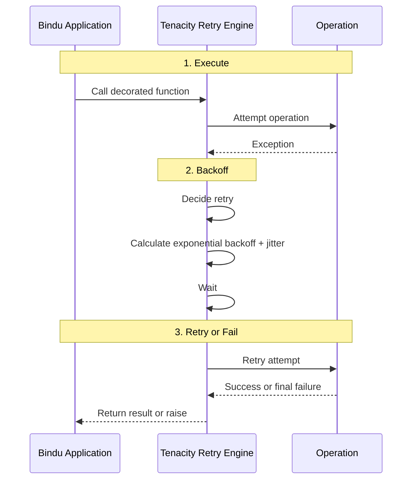

Things fail in production for ordinary reasons. A database connection drops. Redis goes away for a moment. An API times out. Most of those failures are temporary, but if the system treats every one of them as final, tasks fail for no good reason.

## Why Retry Matters

Bindu includes a built-in Tenacity-based retry mechanism to handle transient failures across workers, storage, schedulers, and API calls.

| Without retry                                                     | With Bindu retry                                            |
| ----------------------------------------------------------------- | ----------------------------------------------------------- |
| Temporary failures surface as immediate task failures             | Transient failures can recover automatically                |
| Recovering services get hit again at the same time                | Exponential backoff with jitter spreads retry pressure out  |
| Worker, storage, and scheduler failures each need custom handling | The same retry approach covers all critical operation types |
| Troubleshooting depends on guesswork                              | Retry attempts and outcomes are logged                      |
| Tuning behavior requires code changes                             | Environment variables and overrides make tuning easier      |

## How Bindu Retry Works

Retry logic is applied across four main operation types: worker, storage, scheduler, and API calls.

### The Lifecycle: Fail, Wait, Try Again



```
- `@retry_worker_operation()`
- `@retry_storage_operation()`
- `@retry_scheduler_operation()`
- `@retry_api_call()`
```

```
By default, retries happen on:

- `ConnectionError` (and subclasses)
- `TimeoutError`
- `asyncio.TimeoutError`
- `OSError` (covers `BrokenPipeError` and similar)

Application logic errors (`ValueError`, `KeyError`, etc.) are not retried.
```

````
```text
wait = min_wait * (2 ^ attempt) + random_jitter
```

The wait is capped at `max_wait`. The operation either succeeds on a later attempt
or exhausts the retry budget and fails.
````

---

## Configuration

### Environment Variables

```bash
# Worker Retry Settings
RETRY__WORKER_MAX_ATTEMPTS=3
RETRY__WORKER_MIN_WAIT=1.0
RETRY__WORKER_MAX_WAIT=10.0

# Storage Retry Settings
RETRY__STORAGE_MAX_ATTEMPTS=5
RETRY__STORAGE_MIN_WAIT=0.5
RETRY__STORAGE_MAX_WAIT=5.0

# Scheduler Retry Settings
RETRY__SCHEDULER_MAX_ATTEMPTS=3
RETRY__SCHEDULER_MIN_WAIT=1.0
RETRY__SCHEDULER_MAX_WAIT=8.0

# API Retry Settings
RETRY__API_MAX_ATTEMPTS=4
RETRY__API_MIN_WAIT=1.0
RETRY__API_MAX_WAIT=15.0
```

### Defaults

| Operation Type | Max Attempts | Min Wait | Max Wait |
| -------------- | ------------ | -------- | -------- |
| Worker         | 3            | 1.0s     | 10.0s    |
| Storage        | 5            | 0.5s     | 5.0s     |
| Scheduler      | 3            | 1.0s     | 8.0s     |
| API            | 4            | 1.0s     | 15.0s    |

---

## Retry Decorators

```python
from bindu.utils.retry import retry_worker_operation

@retry_worker_operation()
async def run_task(self, params: TaskSendParams) -> None:
    # 3 attempts, 1-10s wait
    pass

@retry_worker_operation(max_attempts=2)
async def cancel_task(self, task_id: UUID) -> None:
    # Custom: 2 attempts
    pass
```

```python
from bindu.utils.retry import retry_storage_operation

@retry_storage_operation()
async def load_task(self, task_id: UUID) -> Task:
    # 5 attempts, 0.5-5s wait
    pass

@retry_storage_operation(max_attempts=10, min_wait=2.0)
async def update_task(self, task_id: UUID, state: str) -> Task:
    # Custom: 10 attempts, 2-5s wait
    pass
```

```python
from bindu.utils.retry import retry_scheduler_operation

@retry_scheduler_operation()
async def run_task(self, task: Task) -> None:
    # 3 attempts, 1-8s wait
    pass
```

```python
from bindu.utils.retry import retry_api_call

@retry_api_call()
async def call_external_service(self, data: dict) -> dict:
    # 4 attempts, 1-15s wait
    pass

@retry_api_call(max_attempts=6, max_wait=30.0)
async def call_llm_api(self, prompt: str) -> str:
    # Custom: 6 attempts, 1-30s wait
    pass
```

### Ad-Hoc Retry

For one-off retry logic without decorators:

```python
from bindu.utils.retry import execute_with_retry

result = await execute_with_retry(
    some_async_function,
    arg1,
    arg2,
    max_attempts=5,
    min_wait=1.0,
    max_wait=10.0,
)
```

---

## Best Practices

```bash
# Fast in-memory operations
RETRY__STORAGE_MAX_ATTEMPTS=3
RETRY__STORAGE_MIN_WAIT=0.1
RETRY__STORAGE_MAX_WAIT=1.0

# Network-dependent operations
RETRY__API_MAX_ATTEMPTS=5
RETRY__API_MIN_WAIT=2.0
RETRY__API_MAX_WAIT=30.0
```

Make operations safe to retry — setting the same value twice should be harmless.

```python
@retry_storage_operation()
async def update_task_status(self, task_id: UUID, status: str) -> None:
    await self.db.execute(
        "UPDATE tasks SET status = :status WHERE task_id = :task_id",
        {"status": status, "task_id": task_id}
    )
```

```python
@retry_api_call()
async def call_api(self, data: dict) -> dict:
    response = await api_client.post("/endpoint", json=data)
    if response.status_code == 400:
        raise ValueError("Invalid request")  # Not retried
    return response.json()
```

```python
@retry_api_call(max_attempts=3)
async def call_with_timeout(self, data: dict) -> dict:
    return await asyncio.wait_for(
        api_client.post("/endpoint", json=data),
        timeout=10.0
    )
```

```text
[WARNING] Retry attempt 1/3 for run_task failed: ConnectionError
[WARNING] Retry attempt 2/3 for run_task failed: ConnectionError
[INFO] Retry succeeded on attempt 3/3 for run_task
```

---

## Troubleshooting

Reduce `max_attempts` or `max_wait`, and fix the underlying cause:

```bash
RETRY__WORKER_MAX_ATTEMPTS=2
RETRY__WORKER_MAX_WAIT=5.0
```

Check that the decorator is present and the exception type is retryable:

```python
from bindu.utils.logging import get_logger

logger = get_logger(__name__)

@retry_worker_operation()
async def process_task(self, task_id: UUID) -> None:
    logger.info("Processing task", task_id=str(task_id))
    try:
        # Task processing
        pass
    except Exception as e:
        logger.error(
            "Task processing failed",
            task_id=str(task_id),
            error=str(e)
        )
        raise
```

## Monitoring And Observability

Retry attempts are logged automatically:

```text
[WARNING] Retry attempt 1/5 for load_task failed: ConnectionError: Database connection lost
[INFO] Waiting 0.8s before retry attempt 2/5
[WARNING] Retry attempt 2/5 for load_task failed: ConnectionError: Database connection lost
[INFO] Waiting 1.9s before retry attempt 3/5
[INFO] Retry succeeded on attempt 3/5 for load_task
```

Key metrics to watch:

* Retry rate
* Retry success rate
* Average retry attempts
* Retry duration
* Failure types

Retry failures are automatically captured by Sentry:

```python
# Failed retries appear in Sentry with full context
# Including: operation name, attempt count, exception details
```

## Testing

### Unit Tests

```python
import pytest
from bindu.utils.retry import retry_worker_operation

@pytest.mark.asyncio
async def test_retry_success_after_failure():
    """Test that operation succeeds after transient failure."""
    attempts = 0

    @retry_worker_operation(max_attempts=3, min_wait=0.1, max_wait=0.5)
    async def flaky_operation():
        nonlocal attempts
        attempts += 1
        if attempts < 3:
            raise ConnectionError("Transient failure")
        return "success"

    result = await flaky_operation()
    assert result == "success"
    assert attempts == 3
```

### Integration Tests

```bash
# Run retry tests
uv run pytest tests/unit/test_retry.py -v

# Run all tests
uv run pytest tests/ -v
```

<span className="brand-quote">
  

  <span className="brand-quote-text">
    Bindu treats transient failures as {" "}
    <span className="brand-quote-highlight">
      something to recover from, not something to fear
    </span>{" "}
    so agents stay resilient when networks, databases, and APIs stumble.
  </span>
</span>
