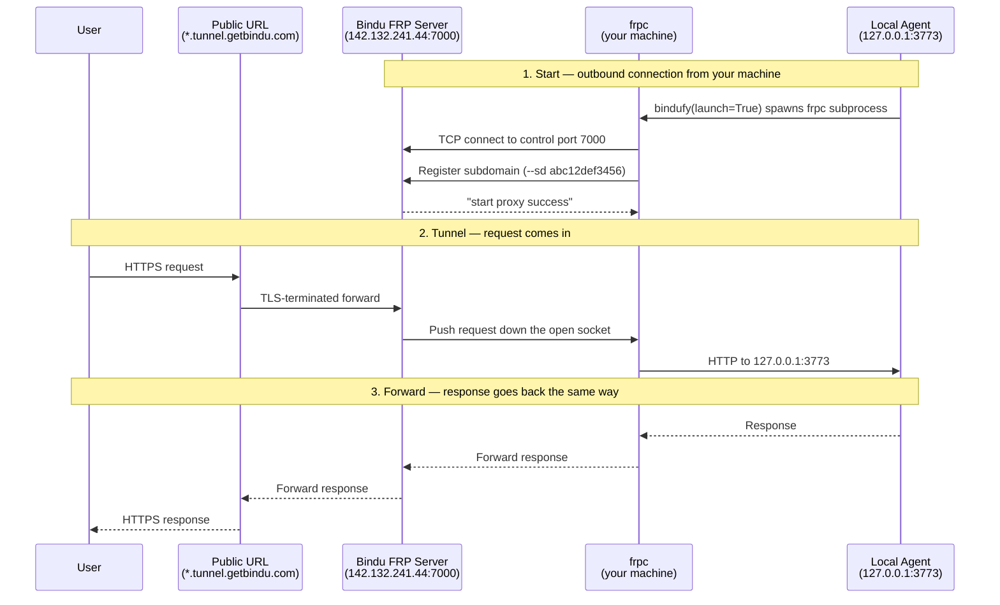

Local development is comfortable right up until something outside your machine needs to hit your agent. A webhook provider, a teammate, or a quick external test all run into the same wall: `localhost` does not exist anywhere except your own machine.

## Why Tunneling Matters

Bindu ships a built-in FRP-based tunnel so a local agent can be reached from the public internet without a deploy step. The agent process stays on your machine; only the network path changes.

| Local-only development | Development with tunneling |
| --- | --- |
| Agent is reachable only on `localhost` | Agent gets a public `https://` URL |
| Webhook testing is awkward or impossible | External services call back into your local agent |
| Sharing requires a deployment step | Anyone with the URL can hit the agent directly |
| Iteration stays trapped in one machine | Development stays local while access becomes public |
| Production setup is overkill for quick feedback | Public access is available for testing and demos |

<Note>
  Tunneling is for local development and testing only. Do not use it in production.
  Production deployments should sit behind proper hosting, certificates, and auth — not
  a shared FRP relay.
</Note>

## What A Reverse Tunnel Actually Does

If you've never used FRP or ngrok before, the trust model is the important part.

A normal server *listens* for incoming connections. That doesn't work from a laptop behind NAT or a corporate firewall: nothing on the public internet can route a packet to `127.0.0.1`.

A **reverse tunnel** flips the direction. Your agent opens an **outbound** connection to a public FRP server. That connection stays open. When a request hits the public URL, the FRP server pushes it down the already-open socket to your agent, which responds back through the same pipe.

<Info>
  Your laptop never accepts a new inbound connection. It only keeps one outbound TCP
  connection open to the FRP server. That is why this works through NAT and most
  corporate firewalls, and it is the reason the agent — not the user — is the side that
  initiates the tunnel.
</Info>

Trust model in one line: anyone with the public URL can call your agent. Treat the URL as a development secret, and use Bindu's auth (Hydra, DID, x402) the same way you would in production if you're testing auth-protected flows.

## How Bindu Tunneling Works

Bindu uses [FRP (Fast Reverse Proxy)](https://github.com/fatedier/frp) to relay traffic between a public URL and your local agent.

<Info>
  The first time you enable tunneling, Bindu downloads the official `frpc` client binary
  (currently `v0.61.0`) from the FRP GitHub releases and caches it under
  `~/.bindu/frpc/`. Subsequent runs reuse the cached binary. If your OS or firewall
  prompts about a new executable making outbound network connections, that is expected.
</Info>

### The Public Address Model

Tunneling is enabled with `launch=True` in `bindufy()`:

```python
from bindu import bindufy

config = {
    "author": "your.email@example.com",
    "name": "my_agent",
    "description": "My development agent",
    "deployment": {"url": "http://localhost:3773", "expose": True},
    "skills": ["skills/question-answering"],
}

async def handler(message):
    return {"role": "assistant", "content": "Hello!"}

# Enable tunneling for local development
bindufy(config, handler, launch=True)
```

When the agent starts, the logs look like this:

```text
INFO  bindu.penguin.bindufy   Tunnel enabled, creating public URL...
INFO  bindu.tunneling.manager Creating tunnel for localhost:3773 with subdomain 'abc12def3456'
INFO  bindu.tunneling.binary  Downloading FRP client binary for darwin_arm64...
INFO  bindu.tunneling.binary  ✅ FRP client binary downloaded to /Users/you/.bindu/frpc/frpc_darwin_arm64_v0.61.0
INFO  bindu.tunneling.tunnel  Starting FRP tunnel...
INFO  bindu.tunneling.tunnel  ✅ Tunnel established: https://abc12def3456.tunnel.getbindu.com
INFO  bindu.penguin.bindufy   ✅ Tunnel created: https://abc12def3456.tunnel.getbindu.com
🌐 Public URL: https://abc12def3456.tunnel.getbindu.com
```

The URL maps back to the local agent for as long as the process is alive.

<CardGroup cols={3}>
  <Card title="Local First" icon="code">
    Your agent still runs locally on `localhost:3773`. Nothing about the handler
    changes.
  </Card>
  <Card title="Public URL" icon="globe">
    A random 12-character subdomain is generated under `tunnel.getbindu.com` — one
    lowercase letter followed by 11 alphanumerics.
  </Card>
  <Card title="Development Only" icon="shield-check">
    This is meant for testing, webhooks, and demos — not production traffic.
  </Card>
</CardGroup>

### The Lifecycle: Start, Tunnel, Forward

Under the hood, tunneling moves through three practical stages.



<Steps>
  <Step title="Start">
    `bindufy()` constructs a `TunnelConfig(enabled=True)`, the binary is downloaded if
    missing, and a `TunnelManager` spawns `frpc` as a subprocess that connects to the
    Bindu FRP server.
  </Step>

  <Step title="Tunnel">
    `frpc` registers a subdomain on the server. The subdomain is either:

    - **Random** (default) — 12 characters: 1 lowercase letter + 11 lowercase letters or
      digits, e.g. `abc12def3456`.
    - **Custom** — whatever you set via `TUNNEL_SUBDOMAIN` env var, the `tunnel.subdomain`
      config key, or by calling `TunnelManager.create_tunnel(subdomain="my-agent")`.

    On success, the server replies `start proxy success` and Bindu logs the public URL.
  </Step>

  <Step title="Forward">
    For every public request, `frpc` reads it off the already-open socket and forwards
    it to `127.0.0.1:<your_port>`. Responses go back the same way. The agent has no
    idea it's being tunneled — to the handler it looks like a normal local request.

    When the agent process exits, `atexit` terminates the `frpc` subprocess and the
    public URL stops resolving.
  </Step>
</Steps>

---

## Configuration

### TunnelConfig

The dataclass in `bindu.tunneling.config` controls every knob.

| Field | Type | Default | Notes |
| --- | --- | --- | --- |
| `enabled` | `bool` | `False` | Master switch. `launch=True` sets this to `True`. |
| `server_address` | `str` | `142.132.241.44:7000` | FRP server `host:port`. Override for self-hosted FRP. |
| `subdomain` | `Optional[str]` | `None` | Custom subdomain. Auto-generated if `None`. |
| `tunnel_domain` | `str` | `tunnel.getbindu.com` | Base domain the subdomain attaches to. |
| `protocol` | `str` | `"http"` | One of `http`, `https`, `tcp`. Passed straight to `frpc`. |
| `use_tls` | `bool` | `False` | TLS between `frpc` and the FRP server. The public URL is always `https` regardless — the server terminates TLS. |
| `local_host` | `str` | `127.0.0.1` | Local interface to forward to. |
| `local_port` | `Optional[int]` | `None` | Set automatically from your `deployment.url`. |

### Custom Subdomain

The default subdomain is random and changes every restart. To pin it, set
`TUNNEL_SUBDOMAIN`:

```bash
export TUNNEL_SUBDOMAIN=my-agent-dev
uv run python my_agent.py
# → https://my-agent-dev.tunnel.getbindu.com
```

Or pass a tunnel block in your config:

```python
config = {
    "author": "your.email@example.com",
    "name": "my_agent",
    "deployment": {"url": "http://localhost:3773", "expose": True},
    "skills": ["skills/question-answering"],
    "tunnel": {
        "enabled": True,
        "subdomain": "my-agent-dev",
        "protocol": "http",
    },
}

bindufy(config, handler, launch=True)
```

<Warning>
  Custom subdomains are first-come, first-served on the shared `tunnel.getbindu.com`
  domain. If someone else already holds it, `frpc` will fail with a registration error
  and Bindu falls back to running local-only.
</Warning>

### Environment Variables

Every `TunnelConfig` field has an env-var equivalent that
`create_tunnel_config_from_env()` reads:

| Variable | Maps to |
| --- | --- |
| `TUNNEL_ENABLED` | `enabled` |
| `TUNNEL_SERVER_ADDRESS` | `server_address` |
| `TUNNEL_SUBDOMAIN` | `subdomain` |
| `TUNNEL_DOMAIN` | `tunnel_domain` |
| `TUNNEL_PROTOCOL` | `protocol` |
| `TUNNEL_USE_TLS` | `use_tls` |
| `TUNNEL_LOCAL_HOST` | `local_host` |

### DID-Derived Subdomains

`TunnelManager._generate_subdomain_from_did()` converts an agent DID into a DNS-safe
label (strips `did:`, replaces colons with hyphens, lowercases, truncates to 63 chars).
It exists for future stable per-agent URLs, but the default `create_tunnel()` path uses
the random generator — wire it in yourself if you want DID-stable URLs today:

```python
from bindu.tunneling import TunnelManager

manager = TunnelManager()
did_subdomain = TunnelManager._generate_subdomain_from_did(
    "did:bindu:alice:my_agent:0001"
)
# → "bindu-alice-my-agent-0001"
public_url = manager.create_tunnel(local_port=3773, subdomain=did_subdomain)
```

---

## Programmatic Use

`bindufy(..., launch=True)` is the common path. For tests, scripts, or anything that
isn't a full agent, `TunnelManager` can be used directly as a context manager — it
handles `frpc` cleanup on exit.

```python
from bindu.tunneling import TunnelManager, TunnelConfig

# Expose any local HTTP service, not just a Bindu agent
with TunnelManager() as manager:
    public_url = manager.create_tunnel(
        local_port=3773,
        subdomain="my-test-run",
    )
    print(f"Hit me at: {public_url}")

    # ... run your test, send some traffic ...

# Tunnel is torn down here; frpc subprocess is terminated.
```

A more explicit config:

```python
config = TunnelConfig(
    enabled=True,
    subdomain="webhook-staging",
    protocol="http",
    local_host="127.0.0.1",
)

with TunnelManager() as manager:
    url = manager.create_tunnel(local_port=8000, config=config)
    ...
```

`TunnelManager` allows exactly one active tunnel per instance — calling
`create_tunnel()` twice raises `RuntimeError`. The process also registers an `atexit`
hook globally, so even hard exits clean up the `frpc` subprocess.

---

## Local Testing Through The Tunnel

### Basic Development Test

```bash
# Terminal 1: Start agent with tunnel
uv run python my_agent.py

# Terminal 2: Test from anywhere
curl https://abc12def3456.tunnel.getbindu.com/.well-known/agent.json
curl https://abc12def3456.tunnel.getbindu.com/health
```

### End-To-End Webhook Test

A common reason to tunnel: an external service (Stripe, GitHub, a partner agent) needs
to POST into your local agent during development.

```bash
# 1. Pin a subdomain so the upstream URL doesn't change every restart
export TUNNEL_SUBDOMAIN=alice-webhook-dev
uv run python my_agent.py
# → https://alice-webhook-dev.tunnel.getbindu.com

# 2. Register the URL with the upstream service
#    e.g. set the webhook URL in Stripe / GitHub / your provider to:
#    https://alice-webhook-dev.tunnel.getbindu.com/webhooks/incoming

# 3. Trigger an event upstream and watch your local logs.
#    Requests land on your handler exactly as if the agent were deployed.
```

<Note>
  The tunneled agent is still your local process. If `python my_agent.py` stops, the
  public URL keeps resolving for a moment but returns 404 — there's nothing behind it.
</Note>

### Use Cases

<AccordionGroup>
  <Accordion title="Local development">
    Test your agent without deploying it. The agent runs on your machine, but the public
    URL makes it reachable for quick external checks.
  </Accordion>

  <Accordion title="Webhook testing">
    Let an external service call back into your local agent during development. Pin a
    custom subdomain so the upstream URL doesn't change every restart.
  </Accordion>

  <Accordion title="Sharing work in progress">
    Share the public URL so someone else can hit the agent without you having to deploy
    it first. Combine with auth if the agent handles anything sensitive.
  </Accordion>

  <Accordion title="Quick demos">
    Use the tunnel for demos where local iteration matters more than production
    deployment. Combine with `expose: True` in your `deployment` block so the agent card
    advertises the public URL.
  </Accordion>

  <Accordion title="Cross-machine A2A">
    Point another agent at your tunnel URL to test A2A flows (negotiation, task send)
    end-to-end without standing up shared infrastructure.
  </Accordion>
</AccordionGroup>

---

## Limits And Troubleshooting

Tunneling is intentionally narrow in scope. It solves development reachability, not
production hosting.

### Current Limits

- **Development only** — not suitable for production traffic.
- **Shared relay** — `tunnel.getbindu.com` is operated as a convenience, not as
  guaranteed infrastructure. No SLA.
- **Temporary URLs by default** — the random 12-character subdomain changes every
  restart unless you pin one.
- **One tunnel per `TunnelManager`** — start a second `bindufy(launch=True)` in the
  same process and you'll get a `RuntimeError`.
- **No persistence** — when the agent stops, `frpc` is terminated and the URL stops
  resolving.

### Troubleshooting

<AccordionGroup>
  <Accordion title="Tunnel fails to start (timeout)">
    `frpc` couldn't reach the FRP server within the default 30-second timeout. Check
    network egress first:

    ```bash
    # DNS + reachability
    ping tunnel.getbindu.com

    # The FRP control channel uses TCP 7000 on 142.132.241.44
    nc -vz 142.132.241.44 7000
    ```

    Corporate firewalls often block arbitrary outbound TCP ports. Port 7000 is the one
    to allowlist.
  </Accordion>

  <Accordion title="Subdomain registration fails">
    If you pinned a subdomain via `TUNNEL_SUBDOMAIN` and someone else already holds it,
    `frpc` exits non-zero. Bindu logs the failure and continues local-only. Pick
    something less generic (`alice-agent-dev` beats `agent`).
  </Accordion>

  <Accordion title="Binary download fails">
    On first run Bindu fetches `frpc_<os>_<arch>` from the official FRP GitHub release.
    If your platform isn't in the release matrix, you'll see a 404 from
    `bindu.tunneling.binary`. Download `frpc` manually from
    https://github.com/fatedier/frp/releases and drop it at
    `~/.bindu/frpc/frpc_<os>_<arch>_v0.61.0` with executable permissions.
  </Accordion>

  <Accordion title="frpc subprocess survives after Ctrl+C">
    Bindu registers an `atexit` hook to terminate `frpc`. If the parent dies in a way
    that skips `atexit` (`kill -9`, OOM kill), the subprocess can linger. Kill it
    manually:

    ```bash
    pkill -f "bindu-tunnel"
    ```
  </Accordion>
</AccordionGroup>

### For Production

Do not use tunneling in production. Use proper hosting with your own certificates and
ingress — Cloudflare, a managed load balancer, or whatever your platform offers — and
keep `launch=False` in deployed environments.

---

## Practical Boundaries

<CardGroup cols={2}>
  <Card title="Good Fit" icon="globe">
    Tunneling is a good fit when you need quick public access to a local agent for
    testing, demos, or webhook development.
  </Card>
  <Card title="Wrong Fit" icon="shield-check">
    It's the wrong fit for production traffic, persistent public infrastructure, or
    anything that depends on strong uptime guarantees.
  </Card>
</CardGroup>

## Related

- [Architecture](/bindu/concepts/task-first-and-architecture)

<span className="brand-quote">
  

  <span className="brand-quote-text">
    Bindu tunneling makes a local agent{" "}
    <span className="brand-quote-highlight">
      reachable for development without pretending to be production
    </span>
    , so testing can move faster without changing where you build.
  </span>
</span>
