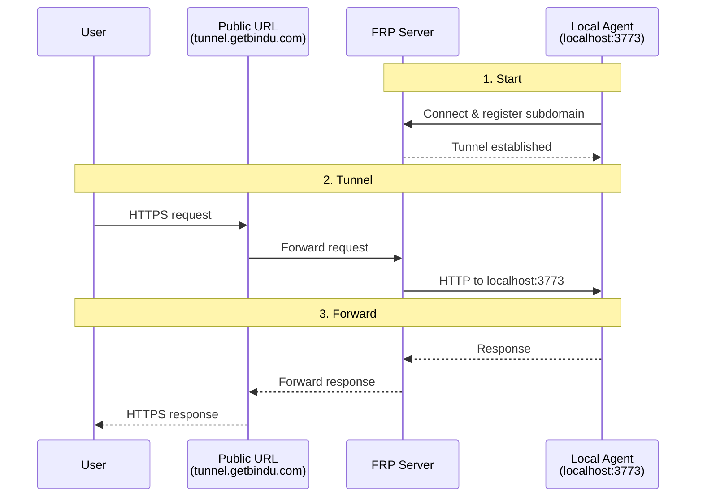

Local development is comfortable right up until something outside your machine needs to hit your agent. A webhook provider, a teammate, or a quick external test all run into the same wall: `localhost` does not exist anywhere except your own machine.

## Why Tunneling Matters

Bindu provides built-in tunneling so you can expose a local agent to the internet during development and testing without deploying it to a server first. That makes it easier to share a work-in-progress agent or test webhook flows while keeping the code and runtime local.

| Local-only development | Development with tunneling |
| --- | --- |
| Agent is reachable only on `localhost` | Agent gets a public internet URL |
| Webhook testing is awkward or impossible | External services can call into your local agent |
| Sharing requires a deployment step | Others can access the tunneled URL directly |
| Iteration stays trapped in one machine | Development stays local while access becomes public |
| Production setup is overkill for quick feedback | Public access is available for testing and demos |

That is the shift: tunneling keeps the agent on your machine, but removes the `localhost` barrier when you need public reachability.

<Note>
  Tunneling is for local development and testing only. Do not use it in production. For
  production deployments, use proper hosting with SSL certificates and security
  configurations.
</Note>

## How Bindu Tunneling Works

Bindu uses FRP (Fast Reverse Proxy) tunneling to create a secure connection between your local agent and a public URL.

<Info>
  Behind the scenes: the first time you enable tunneling, Bindu automatically downloads
  the official `frpc` (FRP client) binary to `~/.bindu/frpc/`. If your OS or firewall
  prompts you about a new executable making outbound network connections, this is
  expected behavior.
</Info>

### The Public Address Model

Tunneling starts by enabling `launch=True` in `bindufy()`:

```python
from bindu import bindufy

config = {
    "author": "your.email@example.com",
    "name": "my_agent",
    "description": "My development agent",
    "deployment": {"url": "http://localhost:3773", "expose": True},
    "skills": ["skills/question-answering"],
}

async def handler(message):
    return {"role": "assistant", "content": "Hello!"}

# Enable tunneling for local development
bindufy(config, handler, launch=True)
```

When the agent starts, you will see output like this:

```text
✅ Tunnel established: https://abc123xyz.tunnel.getbindu.com
🌐 Public URL: https://abc123xyz.tunnel.getbindu.com
```

The public URL is temporary and maps back to your local agent.

<CardGroup cols={3}>
  <Card title="Local First" icon="code">
    Your agent still runs locally on `localhost:3773`.
  </Card>
  <Card title="Public URL" icon="globe">
    FRP assigns a random 12-character public subdomain such as
    `abc123xyz.tunnel.getbindu.com`.
  </Card>
  <Card title="Development Only" icon="shield-check">
    This is meant for testing and demos, not for production traffic.
  </Card>
</CardGroup>

### The Lifecycle: Start, Tunnel, Forward

Under the hood, tunneling moves through three practical stages.



<Steps>
  <Step title="Start">
    Your local agent starts on `localhost:3773` with `launch=True` enabled in
    `bindufy()`.

    That is the only change in the local setup. The rest of the agent continues to run
    as usual on your machine.
  </Step>

  <Step title="Tunnel">
    The FRP client connects to Bindu's tunnel server and creates a tunnel for the local
    agent.

    At that point, a public URL is generated with a random subdomain, for example:

    ```text
    abc123xyz.tunnel.getbindu.com
    ```
  </Step>

  <Step title="Forward">
    Requests sent to the public URL are forwarded to the local agent and the response
    goes back through the same path.

    1. Local Agent Starts — your agent runs on `localhost:3773`
    2. Tunnel Created — FRP client connects to Bindu's tunnel server
    3. Public URL Generated — random 12-character subdomain assigned
    4. Traffic Forwarded — requests to public URL are forwarded to your local agent
  </Step>
</Steps>

---

## Local Testing Through The Tunnel

Once the tunnel is up, you can test the local agent from outside your machine.

### Basic Development Test

```bash
# Terminal 1: Start agent with tunnel
uv run python my_agent.py

# Terminal 2: Test from anywhere
curl https://abc123xyz.tunnel.getbindu.com/
```

This is the simplest use case: keep the code local, but make the agent reachable from the internet during development.

<Note>
  The tunneled agent is still your local process. If the process stops, the tunnel is
  no longer useful because there is nothing listening behind it.
</Note>

### The Value Of A Public Development URL

Tunneling is most useful when local development has to interact with something outside the machine.

<AccordionGroup>
  <Accordion title="Local development">
    Test your agent without deploying it. The agent runs on your machine, but the public
    URL makes it reachable for quick external checks.
  </Accordion>

  <Accordion title="Webhook testing">
    Use the tunnel when an external service needs to call back into your local agent
    during development.
  </Accordion>

  <Accordion title="Sharing work in progress">
    Share the public URL with someone else so they can hit the agent without asking you
    to deploy it first.
  </Accordion>

  <Accordion title="Quick demos">
    Use the tunnel for demos where local iteration matters more than production
    deployment.
  </Accordion>
</AccordionGroup>

---

## Limits And Troubleshooting

Tunneling is intentionally narrow in scope. It solves development reachability, not production hosting.

### Current Limits

- Development Only — not suitable for production traffic
- Temporary URLs — the 12-character subdomain changes on each restart
- No Persistence — the tunnel closes when the agent stops

### For Production

Do not use tunneling in production. Production workloads should use proper infrastructure instead of a development tunnel.

### Connection Timeout

If the tunnel fails to connect, verify your network allows outbound connections to the FRP server:

```bash
# Check internet connection
ping tunnel.getbindu.com

# Ensure outbound connections to port 7000 are allowed
```

If the tunnel cannot connect, start with the network path and firewall rules (specifically port 7000) before debugging anything in the agent itself.

---

## Practical Boundaries

<CardGroup cols={2}>
  <Card title="Good Fit" icon="globe">
    Tunneling is a good fit when you need quick public access to a local agent for
    testing, demos, or webhook development.
  </Card>
  <Card title="Wrong Fit" icon="shield-check">
    It is the wrong fit for production traffic, persistent public infrastructure, or
    anything that depends on strong uptime guarantees.
  </Card>
</CardGroup>

## Related

- [Architecture](/bindu/concepts/task-first-and-architecture)
- [Create Bindu Agent](/bindu/create-bindu-agent/deploy)

<span className="brand-quote">
  

  <span className="brand-quote-text">
    Bindu tunneling makes a local agent{" "}
    <span className="brand-quote-highlight">
      reachable for development without pretending to be production
    </span>
    , so testing can move faster without changing where you build.
  </span>
</span>
