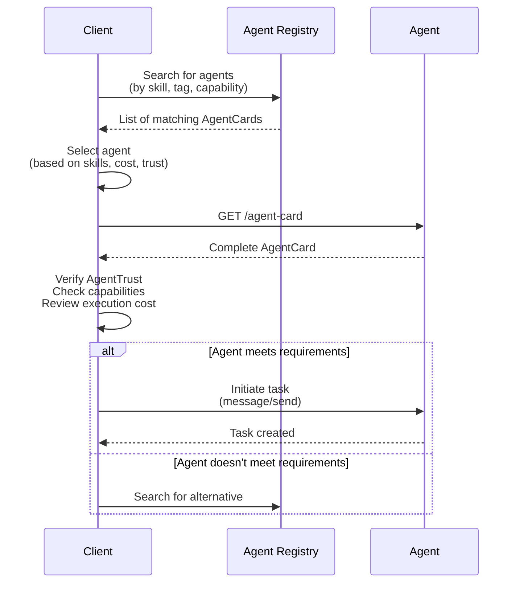

Agent discovery enables clients to find and understand agent capabilities through standardized metadata. The AgentCard serves as the agent's "business card" containing identity, skills, and operational requirements.

### AgentIdentity

**Schema:**
```python
@pydantic.with_config(ConfigDict(alias_generator=to_camel))
class AgentIdentity(TypedDict):
    """Agent identity configuration with DID and other identifiers.
    
    Establishes decentralized identity for agent authentication and discovery.
    """
    
    did: Required[str]
    """The agent's Decentralized Identifier (DID)."""
    
    did_document: Required[Dict[str, Any]]
    """The agent's DID document containing public keys and other identifiers."""
    
    agentdns_url: NotRequired[str]
    """The agent's AgentDNS URL for decentralized identity resolution."""
    
    endpoint: NotRequired[str]
    """The agent's endpoint URL for communication."""
    
    public_key: Required[str]
    """The agent's public key for authentication."""
    
    csr: Required[str]
    """The agent's Certificate Signing Request (CSR) for authentication."""
```

**Use Case: Decentralized Agent Identity**
```json
{
  "did": "did:example:agent123",
  "didDocument": {
    "id": "did:example:agent123",
    "publicKey": [{
      "id": "did:example:agent123#keys-1",
      "type": "Ed25519VerificationKey2020",
      "controller": "did:example:agent123",
      "publicKeyMultibase": "zH3C2AVvLMv6gmMNam3uVAjZpfkcJCwDwnZn6z3wXmqPV"
    }]
  },
  "agentdnsUrl": "https://agentdns.example.com/agent123",
  "endpoint": "https://agent.example.com/api",
  "publicKey": "-----BEGIN PUBLIC KEY-----\nMIIB...",
  "csr": "-----BEGIN CERTIFICATE REQUEST-----\nMIIC..."
}
```

**What it's for:** Establishing verifiable decentralized identity for agents using DIDs. Enables trustless discovery and authentication without central authorities. The DID document contains public keys for cryptographic verification.

---

### AgentInterface

**Schema:**
```python
@pydantic.with_config(ConfigDict(alias_generator=to_camel))
class AgentInterface(TypedDict):
    """An interface that the agent supports.
    
    Declares available transport protocols and endpoints.
    """
    
    transport: str
    """The transport protocol (e.g., 'jsonrpc', 'websocket')."""
    
    url: str
    """The URL endpoint for this transport."""
    
    description: NotRequired[str]
    """Description of this interface."""
```

**Use Case: Multiple Transport Support**
```json
{
  "transport": "websocket",
  "url": "wss://agent.example.com/ws",
  "description": "WebSocket interface for real-time streaming"
}
```

**What it's for:** Declaring multiple communication protocols an agent supports. Allows clients to choose between JSON-RPC, WebSocket, gRPC, or other transports based on their needs.

---

### AgentExtension

**Schema:**
```python
@pydantic.with_config(ConfigDict(alias_generator=to_camel))
class AgentExtension(TypedDict):
    """A declaration of an extension supported by an Agent.
    
    Extensions add protocol capabilities beyond the core A2A specification.
    """
    
    uri: str
    """The URI of the extension."""
    
    description: NotRequired[str]
    """A description of how this agent uses this extension."""
    
    required: NotRequired[bool]
    """Whether the client must follow specific requirements of the extension."""
    
    params: NotRequired[dict[str, Any]]
    """Optional configuration for the extension."""
```

**Use Case: AP2 Payment Extension**
```json
{
  "uri": "https://github.com/google-agentic-commerce/ap2/tree/v0.1",
  "description": "Supports AP2 protocol for agent payments",
  "required": true,
  "params": {
    "roles": ["merchant", "shopper"]
  }
}
```

**What it's for:** Declaring support for protocol extensions like AP2 (payments), custom authentication schemes, or specialized capabilities. The `required` flag indicates if clients must support the extension.

---

### Skill

**Schema:**
```python
@pydantic.with_config(ConfigDict(alias_generator=to_camel))
class Skill(TypedDict):
    """Skills are a unit of capability that an agent can perform.
    
    Skills can be defined in two ways:
    1. Inline (legacy): All metadata in config JSON
    2. File-based (Claude-style): Rich documentation in SKILL.md files
    """
    
    id: str
    """A unique identifier for the skill."""
    
    name: str
    """Human readable name of the skill."""
    
    description: str
    """A human-readable description of the skill."""
    
    tags: list[str]
    """Set of tag-words describing classes of capabilities."""
    
    examples: NotRequired[list[str]]
    """Example scenarios that the skill can perform."""
    
    input_modes: list[str]
    """Supported mime types for input data."""
    
    output_modes: list[str]
    """Supported mime types for output data."""
    
    # Rich documentation fields (Claude-style skills)
    documentation_path: NotRequired[str]
    """Path to the SKILL.md file containing detailed instructions."""
    
    documentation_content: NotRequired[str]
    """Full content of the SKILL.md file."""
    
    capabilities_detail: NotRequired[dict[str, Any]]
    """Structured capability details for orchestrator matching."""
    
    requirements: NotRequired[dict[str, Any]]
    """Dependencies and system requirements."""
    
    performance: NotRequired[dict[str, Any]]
    """Performance characteristics for orchestrator planning."""
    
    version: NotRequired[str]
    """Skill version for compatibility tracking."""
    
    allowed_tools: NotRequired[list[str]]
    """List of tools/capabilities this skill is allowed to use."""
```

**Use Case: Data Analysis Skill**
```json
{
  "id": "data-analysis",
  "name": "Data Analysis",
  "description": "Analyze datasets and generate insights",
  "tags": ["analytics", "data", "statistics"],
  "examples": [
    "Analyze this sales data and find trends",
    "Calculate statistics for this dataset"
  ],
  "inputModes": ["text/csv", "application/json"],
  "outputModes": ["text/plain", "application/json"],
  "documentationPath": "./skills/data-analysis/SKILL.md",
  "capabilitiesDetail": {
    "statistical_analysis": {"supported": true, "methods": ["regression", "correlation"]},
    "visualization": {"supported": true, "types": ["charts", "graphs"]}
  },
  "requirements": {
    "packages": ["pandas", "numpy", "matplotlib"],
    "minMemoryMb": 1024
  },
  "performance": {
    "avgProcessingTimeMs": 5000,
    "maxFileSizeMb": 100
  },
  "allowedTools": ["Read", "Write"]
}
```

**What it's for:** Defining what an agent can do. Supports both simple inline definitions and rich Claude-style documentation with SKILL.md files. Orchestrators use skills to match agents to tasks.

---

### AgentCapabilities

**Schema:**
```python
@pydantic.with_config(ConfigDict(alias_generator=to_camel))
class AgentCapabilities(TypedDict):
    """Defines optional capabilities supported by an agent.
    
    Declares protocol features the agent implements.
    """
    
    extensions: NotRequired[list[AgentExtension]]
    """List of extensions supported by the agent."""
    
    push_notifications: NotRequired[bool]
    """Whether the agent supports push notifications."""
    
    state_transition_history: NotRequired[bool]
    """Whether the agent supports state transition history."""
    
    streaming: NotRequired[bool]
    """Whether the agent supports streaming."""
```

**Use Case: Full-Featured Agent**
```json
{
  "extensions": [
    {
      "uri": "https://github.com/google-agentic-commerce/ap2/tree/v0.1",
      "description": "AP2 payment support",
      "required": false
    }
  ],
  "pushNotifications": true,
  "stateTransitionHistory": true,
  "streaming": true
}
```

**What it's for:** Declaring which optional A2A protocol features the agent supports. Clients can choose agents based on required capabilities like streaming or push notifications.

---

### AgentCard

**Schema:**
```python
@pydantic.with_config(ConfigDict(alias_generator=to_camel))
class AgentCard(TypedDict):
    """The card that describes an agent - following bindu pattern.
    
    The complete agent metadata for discovery and configuration.
    """
    
    id: Required[UUID]
    """Unique identifier for the agent."""
    
    name: Required[str]
    """Human readable name of the agent."""
    
    description: Required[str]
    """A human-readable description of the agent."""
    
    url: Required[str]
    """URL of the agent."""
    
    version: Required[str]
    """Version of the agent."""
    
    protocol_version: Required[str]
    """Version of the protocol used by the agent."""
    
    documentation_url: NotRequired[str]
    """URL of the documentation of the agent."""
    
    icon_url: NotRequired[str]
    """A URL to an icon for the agent."""
    
    agent_trust: Required[AgentTrust]
    """Trust of the agent."""
    
    capabilities: Required[AgentCapabilities]
    """Capabilities of the agent."""
    
    skills: Required[List[Skill]]
    """Skills of the agent."""
    
    kind: Required[Literal["agent", "team", "workflow"]]
    """Kind of the agent."""
    
    execution_cost: NotRequired[AgentExecutionCost]
    """Execution cost of the agent."""
    
    num_history_sessions: Required[int]
    """Number of history sessions of the agent."""
    
    preferred_transport: NotRequired[str]
    """The transport of the preferred endpoint."""
    
    extra_data: Required[Dict[str, Any]]
    """Extra data about the agent."""
    
    debug_mode: Required[bool]
    """Debug mode of the agent."""
    
    debug_level: Required[Literal[1, 2]]
    """Debug level of the agent."""
    
    monitoring: Required[bool]
    """Monitoring of the agent."""
    
    telemetry: Required[bool]
    """Telemetry of the agent."""
    
    additional_interfaces: NotRequired[list[AgentInterface]]
    """Announcement of additional supported transports."""
    
    security: NotRequired[list[dict[str, list[str]]]]
    """Security requirements for contacting the agent."""
    
    security_schemes: NotRequired[dict[str, SecurityScheme]]
    """Security scheme definitions."""
    
    default_input_modes: list[str]
    """Supported mime types for input data."""
    
    default_output_modes: list[str]
    """Supported mime types for output data."""
```

**Use Case: Complete Agent Card**
```json
{
  "id": "550e8400-e29b-41d4-a716-446655440000",
  "name": "Data Analysis Agent",
  "description": "Analyzes datasets and generates insights",
  "url": "https://agent.example.com",
  "version": "1.0.0",
  "protocolVersion": "0.3.0",
  "kind": "agent",
  "agentTrust": {
    "identityProvider": "keycloak",
    "inheritedRoles": [],
    "creatorId": "did:example:creator",
    "creationTimestamp": 1698796800,
    "trustVerificationRequired": true,
    "allowedOperations": {}
  },
  "capabilities": {
    "streaming": true,
    "pushNotifications": true
  },
  "skills": [
    {
      "id": "data-analysis",
      "name": "Data Analysis",
      "description": "Analyze datasets",
      "tags": ["analytics"],
      "inputModes": ["text/csv"],
      "outputModes": ["text/plain"]
    }
  ],
  "numHistorySessions": 10,
  "debugMode": false,
  "debugLevel": 1,
  "monitoring": true,
  "telemetry": true,
  "defaultInputModes": ["text/plain"],
  "defaultOutputModes": ["text/plain"],
  "extraData": {}
}
```

**What it's for:** The complete agent metadata package. Clients fetch the AgentCard to discover capabilities, skills, security requirements, and operational characteristics before interacting with an agent.

### Agent Discovery Flow



**Summary:**

Agent discovery uses **AgentCard** as the central metadata structure containing identity (**AgentIdentity**), capabilities (**AgentCapabilities**), skills (**Skill**), and operational requirements. Agents declare support for extensions (**AgentExtension**) and multiple transports (**AgentInterface**). Clients discover agents through registries, evaluate their capabilities and costs, then establish secure connections using the declared security schemes and trust configurations.

---

