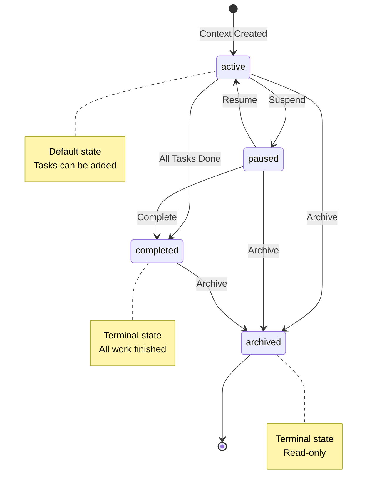
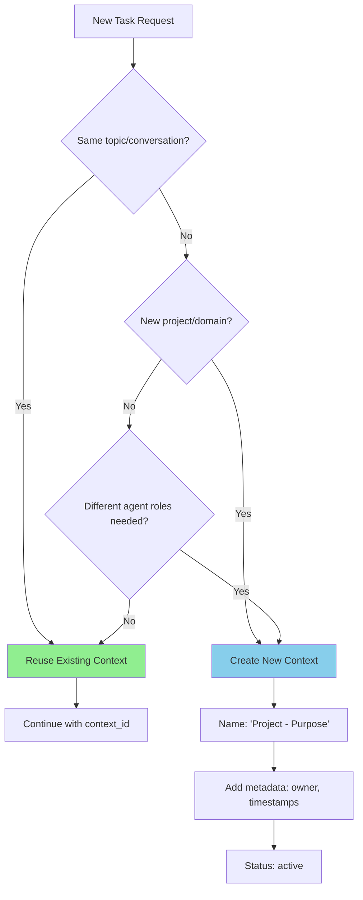
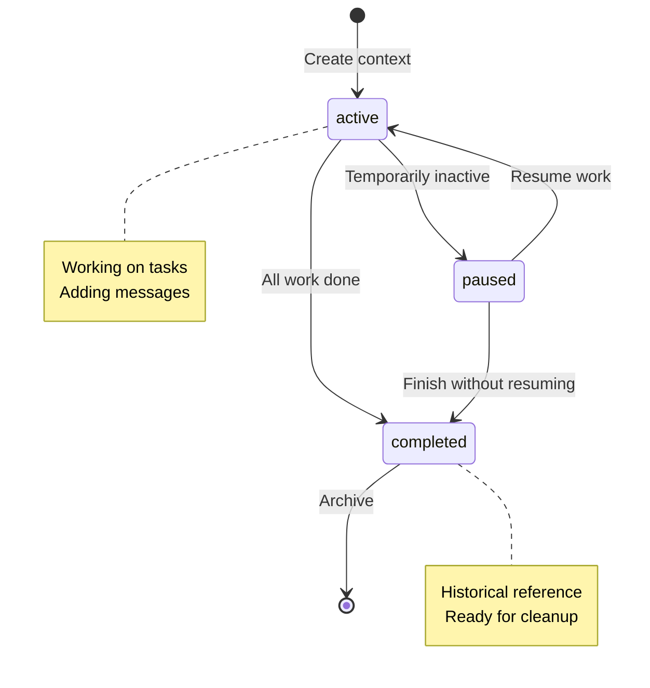

Contexts serve as conversation containers in the Bindu protocol, managing the complete interaction lifecycle between clients and agents. They maintain conversation continuity, preserve context across multiple tasks, and provide session-level organization.

<Note>
Context is a Bindu-specific extension `<NotPartOfA2A>` that goes beyond the standard A2A protocol to enable sophisticated conversation management and session tracking.
</Note>

### Context Object

A **Context** is a conversation session that groups related tasks and maintains interaction history. It provides the organizational structure for multi-turn conversations and enables agents to maintain state across multiple task executions.

**Schema:**
```python
class Context(TypedDict):
    """Conversation session that groups related tasks and maintains interaction history.
    
    Contexts serve as conversation containers in the bindu protocol, managing
    the complete interaction lifecycle between clients and agents. They maintain
    conversation continuity, preserve context across multiple tasks, and provide
    session-level organization.
    
    Core Responsibilities:
    - Session Management: Group related tasks under a unified conversation
    - History Preservation: Maintain complete message history across tasks
    - Context Continuity: Preserve conversation state and references
    - Metadata Tracking: Store session-level information and preferences
    
    Context Lifecycle:
    1. Creation: Client initiates conversation or system creates implicit context
    2. Task Association: Multiple tasks can belong to the same context
    3. History Building: Messages and artifacts accumulate over time
    4. State Management: Track conversation status and metadata
    5. Completion: Context can be closed or archived when conversation ends
    
    Key Properties:
    - Multi-Task: Contains multiple related tasks over time
    - Stateful: Maintains conversation history and context
    - Client-Controlled: Clients can explicitly manage context lifecycle
    - Traceable: Unique ID enables context tracking and reference
    
    Context Relationships:
    - Contains: Multiple tasks (one-to-many relationship)
    - Maintains: Complete conversation history across all tasks
    - Preserves: Session-level metadata and preferences
    - References: Can link to other contexts for complex workflows
    """
    
    context_id: Required[UUID]
    """Unique identifier for the context."""
    
    kind: Required[Literal["context"]]
    """Type discriminator, always "context"."""
    
    tasks: NotRequired[list[UUID]]
    """List of task IDs belonging to this context."""
    
    name: NotRequired[str]
    """Human-readable context name."""
    
    description: NotRequired[str]
    """Context purpose or summary."""
    
    role: Required[str]
    """Role of the context (e.g., "assistant", "analyst", "coordinator")."""
    
    created_at: Required[str]
    """ISO 8601 datetime when context was created.
    
    Example: "2023-10-27T10:00:00Z"
    """
    
    updated_at: Required[str]
    """ISO 8601 datetime when context was last updated.
    
    Example: "2023-10-27T10:00:00Z"
    """
    
    status: NotRequired[Literal["active", "paused", "completed", "archived"]]
    """Current status of the context:
    - active: Context is currently in use
    - paused: Context is temporarily suspended
    - completed: Context has finished its purpose
    - archived: Context is stored for historical reference
    """
    
    tags: NotRequired[list[str]]
    """Organizational tags for categorization and filtering."""
    
    metadata: NotRequired[dict[str, Any]]
    """Custom context metadata for extensions and application-specific data."""
    
    parent_context_id: NotRequired[UUID]
    """For nested or hierarchical contexts."""
    
    reference_context_ids: NotRequired[list[UUID]]
    """Related contexts for cross-referencing."""
    
    extensions: NotRequired[dict[str, Any]]
    """Additional protocol extensions."""
```

**Realistic Example: Multi-Task Analysis Context**

A client engages in a multi-turn conversation about market analysis:

```json
{
  "contextId": "c295ea44-7543-4f78-b524-7a38915ad6e4",
  "kind": "context",
  "name": "Q4 Market Analysis Session",
  "description": "Comprehensive market analysis and strategic planning for Q4 2025",
  "role": "analyst",
  "createdAt": "2025-10-31T09:00:00Z",
  "updatedAt": "2025-10-31T11:30:00Z",
  "status": "active",
  "tasks": [
    "363422be-b0f9-4692-a24d-278670e7c7f1",
    "8f7e6d5c-4b3a-2109-8765-fedcba098765",
    "1a2b3c4d-5e6f-7890-abcd-ef1234567890"
  ],
  "tags": ["market-analysis", "q4-2025", "strategic-planning"],
  "metadata": {
    "department": "Strategy",
    "priority": "high",
    "stakeholders": ["CEO", "CMO", "CFO"],
    "deadline": "2025-11-15T00:00:00Z",
    "budget": 50000,
    "region": "North America"
  }
}
```

**What This Example Shows:**
- **Context Identity**: Unique `contextId` for tracking the conversation
- **Session Organization**: Groups 3 related tasks under one conversation
- **Temporal Tracking**: Creation and update timestamps
- **Status Management**: Active status indicates ongoing work
- **Metadata Context**: Business context like department, priority, and stakeholders
- **Categorization**: Tags for filtering and organization

**Context vs Task:**
- **Context** = The conversation session (container)
- **Task** = Individual work units within the conversation
- One context can contain many tasks
- Tasks inherit context from their parent context

---

### Context Status States

Contexts can be in one of four states:

**Active States:**

- **`active`** - Context is currently in use
  - New tasks can be added
  - Conversation is ongoing
  - Default state for new contexts
  
- **`paused`** - Context is temporarily suspended
  - No new tasks should be created
  - Existing tasks may continue
  - Can be resumed to `active` state

**Terminal States:**

- **`completed`** - Context has finished its purpose
  - All tasks are completed
  - No new tasks should be added
  - Context is considered closed
  
- **`archived`** - Context is stored for historical reference
  - Preserved for audit or review
  - Read-only access
  - Cannot be modified or resumed

**State Transition Diagram:**



---

### Context Operations & Parameters

Parameters used for various context operations including creation, querying, and management.

#### ContextIdParams

Simple parameters containing a context ID. Used internally whenever an
operation needs to identify a single context (for example, as the base
type extended by `ContextQueryParams` and `ContextsClearParams`).

**Schema:**
```python
class ContextIdParams(TypedDict):
    """Parameters for context identification.

    Used for operations that only require a context ID.
    """

    context_id: Required[UUID]
    """The ID of the context."""

    metadata: NotRequired[dict[str, Any]]
    """Additional metadata for the operation."""
```

---

#### ContextQueryParams

Extends `ContextIdParams` with a `history_length` cap — a future
building block for single-context retrieval. The currently exposed
RPC for listing contexts is `contexts/list`; see its params below.

**Schema:**
```python
class ContextQueryParams(TypedDict):
    """Query parameters for a context.

    Extends ContextIdParams to add history length control for efficient
    retrieval of context information with task history.
    """

    context_id: Required[UUID]
    """The ID of the context to query."""

    history_length: NotRequired[int]
    """The maximum number of history messages to return per task."""

    metadata: NotRequired[dict[str, Any]]
    """Additional metadata for the query."""
```

---

#### ListContextsParams

Parameters for listing multiple contexts with optional history limiting.

**Schema:**
```python
class ListContextsParams(TypedDict):
    """Parameters for listing contexts.
    
    Used to retrieve multiple contexts with control over history size
    and filtering options to optimize payload and query performance.
    """
    
    history_length: NotRequired[int]
    """The maximum number of history messages to return for each task in each context."""
    
    metadata: NotRequired[dict[str, Any]]
    """Additional metadata for filtering or controlling the list operation.
    
    Common filters:
    - status: Filter by context status (active, paused, completed, archived)
    - tags: Filter by tags
    - role: Filter by context role
    - limit: Maximum number of contexts to return
    - offset: Pagination offset
    - sortBy: Sort field (createdAt, updatedAt, name)
    - sortOrder: Sort direction (asc, desc)
    """
```

**Example: List Active Contexts**
```json
{
  "jsonrpc": "2.0",
  "id": 9,
  "method": "contexts/list",
  "params": {
    "historyLength": 3,
    "metadata": {
      "status": "active",
      "limit": 10,
      "sortBy": "updatedAt",
      "sortOrder": "desc"
    }
  }
}
```

**Response:**
```json
{
  "jsonrpc": "2.0",
  "id": 9,
  "result": {
    "contexts": [
      {
        "contextId": "c295ea44-7543-4f78-b524-7a38915ad6e4",
        "kind": "context",
        "name": "Q4 Market Analysis Session",
        "role": "analyst",
        "status": "active",
        "tasks": ["363422be-b0f9-4692-a24d-278670e7c7f1"],
        "createdAt": "2025-10-31T09:00:00Z",
        "updatedAt": "2025-10-31T11:30:00Z",
        "tags": ["market-analysis", "q4-2025"]
      },
      {
        "contextId": "a1b2c3d4-e5f6-7890-abcd-ef1234567890",
        "kind": "context",
        "name": "Customer Support Session",
        "role": "support",
        "status": "active",
        "tasks": ["task-001", "task-002"],
        "createdAt": "2025-10-31T10:15:00Z",
        "updatedAt": "2025-10-31T11:25:00Z",
        "tags": ["support", "customer-inquiry"]
      }
    ],
    "total": 15,
    "page": 1,
    "pageSize": 10
  }
}
```

**Use Cases:**
- Dashboard views showing active conversations
- Context management interfaces
- Session monitoring and analytics
- Filtering contexts by status, role, or tags
- Pagination with history control
- Finding contexts by criteria

**Common Filtering Patterns:**

**By Status:**
```json
{
  "metadata": {
    "status": "active"
  }
}
```

**By Tags:**
```json
{
  "metadata": {
    "tags": ["market-analysis", "high-priority"]
  }
}
```

**By Date Range:**
```json
{
  "metadata": {
    "createdAfter": "2025-10-01T00:00:00Z",
    "createdBefore": "2025-10-31T23:59:59Z"
  }
}
```

**With Pagination:**
```json
{
  "metadata": {
    "limit": 20,
    "offset": 40,
    "sortBy": "updatedAt",
    "sortOrder": "desc"
  }
}
```

---

### Context Best Practices

**Context Decision Flow:**


**Lifecycle States:**


**Quick Tips:**
- **Naming**: Use format `"Project - Purpose"` (e.g., "Q4 Sales - Analysis", "Support - Ticket #1234")
- **Metadata**: Store business context, ownership, timestamps for filtering and tracking
- **Performance**: Use `historyLength` parameter to limit payload size when fetching contexts
- **Cleanup**: Regularly archive completed contexts to maintain system performance

---


