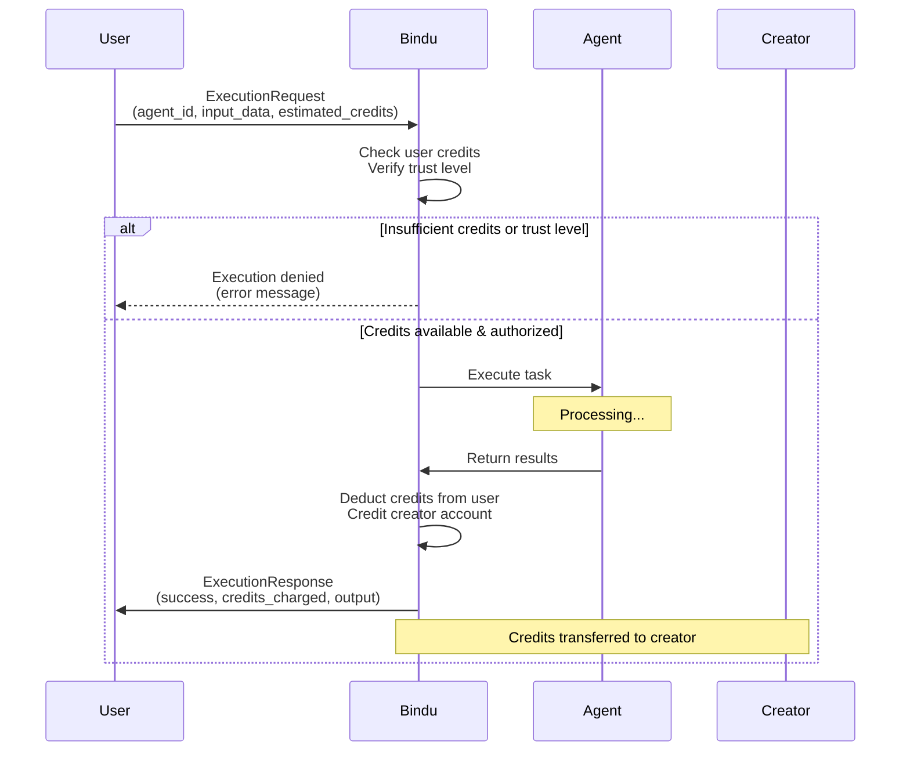

The credit system is a Bindu-specific extension for managing agent marketplace economics — centralized accounting of agent execution costs, creator monetization, and trust-gated access.

<Note>
  **Implementation status (2026-05): types only, no runtime enforcement.**

  `AgentExecutionCost`, `ExecutionRequest`, and `ExecutionResponse` ship as TypedDicts in [`bindu/common/protocol/types.py:873-916`](https://github.com/getbindu/Bindu/blob/main/bindu/common/protocol/types.py) and are accepted on the wire, but there are **no JSON-RPC handlers** wired to debit or credit balances, no credit ledger storage, and no middleware that blocks execution on insufficient credits. For monetary gating that *is* live, use the x402 paywall — see [Payments](./payment).

  The schemas below are stable; the orchestration around them is in design. Treat the flow diagrams as the target shape, not what runs today.
</Note>

### AgentExecutionCost

**Schema:**
```python
@pydantic.with_config(ConfigDict(alias_generator=to_camel))
class AgentExecutionCost(TypedDict):
    """Defines the credit cost for executing an agent.
    
    Sets pricing and access control for agent services.
    """
    
    agent_id: Required[str]
    """The unique identifier of the agent."""
    
    agent_name: Required[str]
    """The name of the agent."""
    
    credits_per_request: Required[int]
    """The number of credits required to execute the agent."""
    
    creator_did: Required[str]
    """The DID of the creator of the agent."""
    
    minimum_trust_level: Required[TrustLevel]
    """The minimum trust level required to execute the agent."""
```

**Use Case: Premium Agent Pricing**
```json
{
  "agentId": "agent-analytics-pro",
  "agentName": "Advanced Analytics Agent",
  "creditsPerRequest": 100,
  "creatorDid": "did:example:creator123",
  "minimumTrustLevel": "analyst"
}
```

**What it's for:** Defining the cost and access requirements for running an agent. Creators set credit prices for their agents, and specify minimum trust levels to ensure only qualified users can execute sensitive operations.

---

### ExecutionRequest

**Schema:**
```python
@pydantic.with_config(ConfigDict(alias_generator=to_camel))
class ExecutionRequest(TypedDict):
    """Represents a request to execute an agent with credit verification.
    
    Initiates agent execution with credit pre-authorization.
    """
    
    request_id: Required[UUID]
    """The unique identifier of the request."""
    
    executor_did: Required[str]
    """The DID of the executor."""
    
    agent_id: Required[str]
    """The unique identifier of the agent."""
    
    input_data: Required[str]
    """The input data for the agent execution."""
    
    estimated_credits: Required[int]
    """The estimated number of credits required for the execution."""
    
    trust_level: Required[TrustLevel]
    """The trust level of the executor."""
```

**Use Case: Agent Execution Request**
```json
{
  "requestId": "550e8400-e29b-41d4-a716-446655440000",
  "executorDid": "did:example:user456",
  "agentId": "agent-analytics-pro",
  "inputData": "Analyze Q4 sales data for trends and anomalies",
  "estimatedCredits": 100,
  "trustLevel": "analyst"
}
```

**What it's for:** Requesting agent execution with credit verification. The system checks if the executor has sufficient credits and meets the minimum trust level before allowing execution.

---

### ExecutionResponse

**Schema:**
```python
@pydantic.with_config(ConfigDict(alias_generator=to_camel))
class ExecutionResponse(TypedDict):
    """Represents the response from an agent execution with credit deduction.
    
    Returns execution results and credit transaction details.
    """
    
    request_id: Required[UUID]
    """The unique identifier of the request."""
    
    execution_id: Required[UUID]
    """The unique identifier of the execution."""
    
    success: Required[bool]
    """Indicates whether the execution was successful."""
    
    credits_charged: Required[int]
    """The number of credits charged for the execution."""
    
    transaction_id: NotRequired[UUID]
    """The unique identifier of the transaction."""
    
    output_data: NotRequired[str]
    """The output data from the agent execution."""
    
    error_message: NotRequired[str]
    """The error message if the execution failed."""
    
    execution_time: Required[str]
    """The time the execution was completed."""
```

**Use Case: Successful Execution**
```json
{
  "requestId": "550e8400-e29b-41d4-a716-446655440000",
  "executionId": "660e8400-e29b-41d4-a716-446655440001",
  "success": true,
  "creditsCharged": 95,
  "transactionId": "770e8400-e29b-41d4-a716-446655440002",
  "outputData": "Analysis complete: Q4 sales increased 23% with peak in December...",
  "executionTime": "2025-10-31T23:45:00Z"
}
```

**What it's for:** Returning execution results with credit transaction details. Shows actual credits charged (may differ from estimate), execution status, and output data. Failed executions may charge reduced or no credits depending on policy.

### Credit System Flow



**Key Features:**
- **Pay-per-use model** - Users pay credits only for agent executions
- **Creator monetization** - Agent creators earn credits when their agents are used
- **Trust-based access** - Minimum trust levels prevent unauthorized or malicious usage
- **Transparent pricing** - Credit costs are known upfront via `AgentExecutionCost`
- **Transaction tracking** - Every execution generates a transaction record for auditing

**Use Cases:**
- Premium AI agents with specialized capabilities
- Resource-intensive data processing agents
- Enterprise agents requiring elevated permissions
- Marketplace for third-party agent services
- Usage-based billing for agent platforms

---

