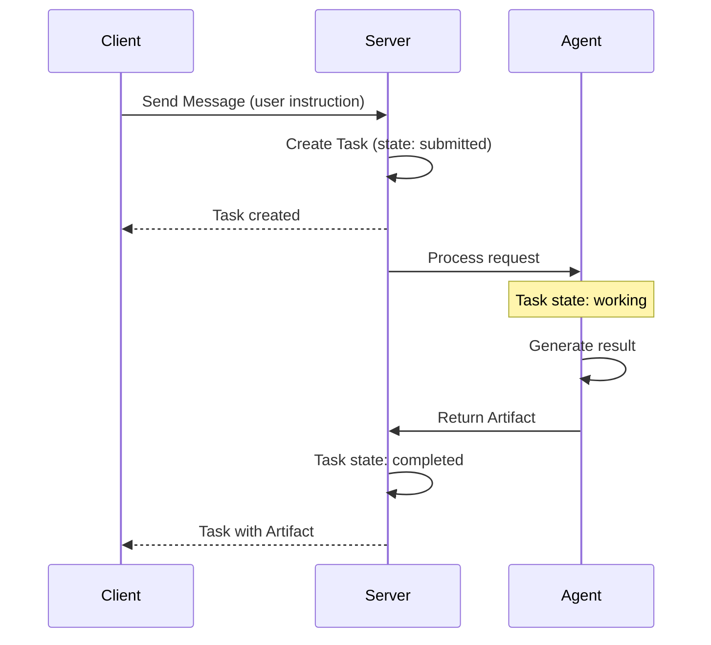
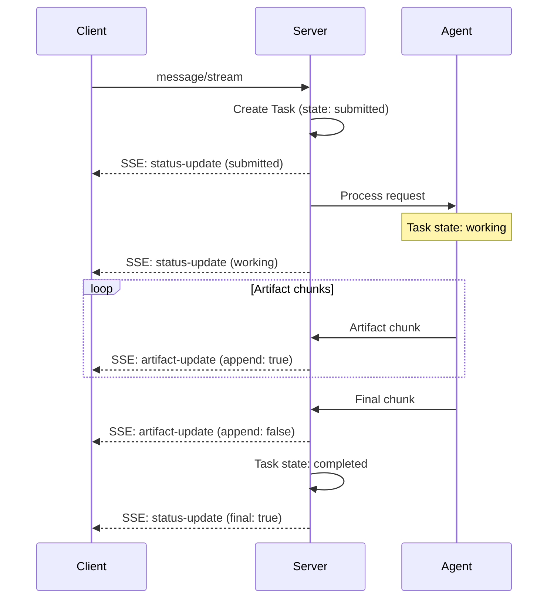
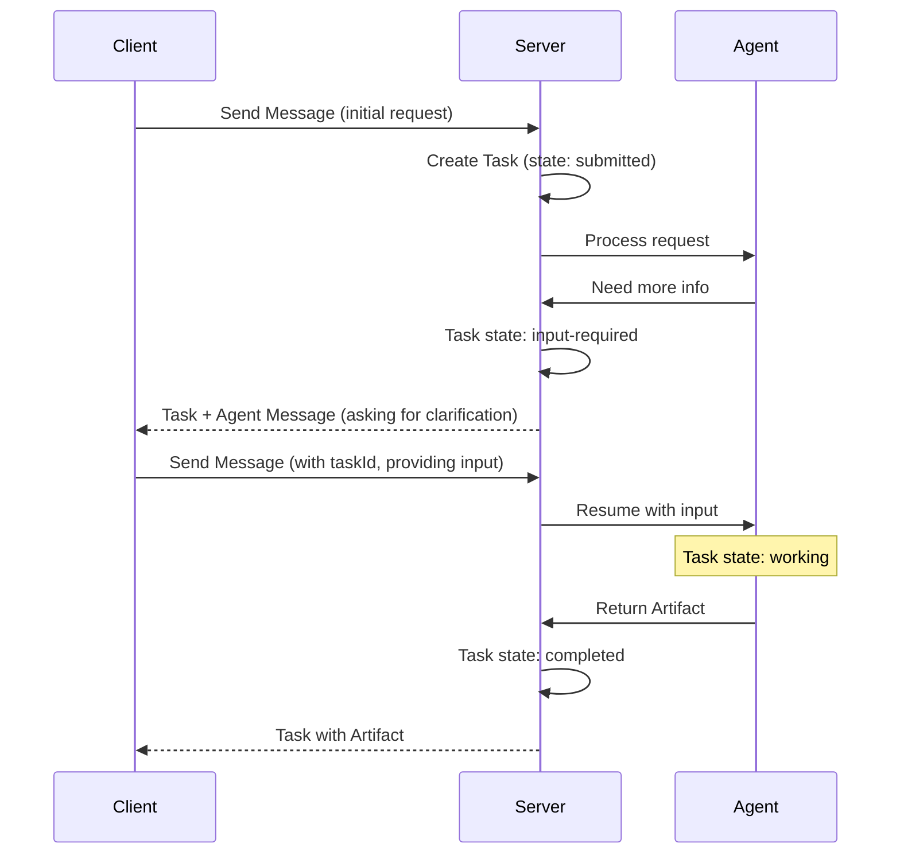

Parts are the fundamental building blocks for agent communication in A2A. Here's how they work in practice:

### TextPart: Simple Text Communication

**Schema:**
```python
class TextPart(TypedDict):
    """Represents a text segment within a message or artifact."""
    
    kind: Literal["text"]           # Discriminator, always "text"
    text: str                       # The actual text content
    metadata: NotRequired[dict[str, Any]]  # Optional metadata for context
    embeddings: NotRequired[list[float]] #The embeddings of Text. <NotPartOfA2A>
```

**Use Case 1: User Instruction**
```json
{
  "kind": "text",
  "text": "Analyze this image and highlight any faces."
}
```

**Use Case 2: Agent Status with Metadata**
```json
{
  "kind": "text",
  "text": "Processing your request... Found 3 faces in the image.",
  "metadata": {
    "timestamp": "2025-10-31T10:00:00Z",
    "confidence": 0.95,
    "processingTime": "2.3s"
  }
}
```

**What it's for:** Human-readable communication including instructions, status updates, error messages, and conversational text between agents and users.

---

### FilePart: Binary Content Exchange

**Schema:**
```python
class FileWithBytes(TypedDict):
    """File representation with binary content."""
    
    bytes: str                      # Base64-encoded file content
    name: NotRequired[str]          # File name (e.g., "document.pdf")
    mimeType: NotRequired[str]      # MIME type (e.g., "application/pdf")
    embeddings: NotRequired[list[float]] #The embeddings of File. <NotPartOfA2A>


class FileWithUri(TypedDict):
    """File representation with URI reference."""
    
    uri: str                        # URL pointing to file content
    name: NotRequired[str]          # File name
    mimeType: NotRequired[str]      # MIME type


class FilePart(TypedDict):
    """Represents a file segment within a message or artifact."""
    
    kind: Literal["file"]           # Discriminator, always "file"
    file: FileWithBytes | FileWithUri  # File content (bytes or URI)
    metadata: NotRequired[dict[str, Any]]  # Optional metadata
    embeddings: NotRequired[list[float]] #The embeddings of File. <NotPartOfA2A>
```

**Use Case 1: Image Upload with Bytes (Client → Agent)**
```json
{
  "jsonrpc": "2.0",
  "id": "req-007",
  "method": "message/send",
  "params": {
    "message": {
      "role": "user",
      "parts": [
        {
          "kind": "text",
          "text": "Analyze this image and highlight any faces."
        },
        {
          "kind": "file",
          "file": {
            "name": "input_image.png",
            "mimeType": "image/png",
            "bytes": "iVBORw0KGgoAAAANSUhEUgAAAAUA..."
          }
        }
      ],
      "messageId": "6dbc13b5-bd57-4c2b-b503-24e381b6c8d6"
    }
  }
}
```

**What it's for:** Binary content exchange including images, documents, media files, and data files. Use `bytes` for small files (< 1MB), `uri` for large files to avoid payload bloat.

---

### DataPart: Structured Information Exchange

**Schema:**
```python
class DataPart(TypedDict):
    """Represents a structured data segment (e.g., JSON) within a message or artifact."""
    
    kind: Literal["data"]           # Discriminator, always "data"
    data: dict[str, Any]            # Structured JSON data
    metadata: NotRequired[dict[str, Any]]  # Optional metadata
    embeddings: NotRequired[list[float]] #The embeddings of Data. <NotPartOfA2A>
```

**Use Case 1: Form Data Submission**
```json
{
  "kind": "data",
  "data": {
    "formType": "user_registration",
    "fields": {
      "username": "john_doe",
      "email": "john@example.com",
      "preferences": {
        "newsletter": true,
        "notifications": "daily"
      }
    },
    "timestamp": "2025-10-31T10:00:00Z"
  }
}
```

**What it's for:** Structured, machine-readable information including API responses, form data, query results, analytics, payment details, and any JSON-serializable data that needs programmatic processing.

---

### Key Takeaways: A2A Part Usage

**Part Types (A2A Standard):**

1. **TextPart** (`kind: "text"`): For conveying plain textual content
   - Use for: Instructions, descriptions, status updates, conversational text
   
2. **FilePart** (`kind: "file"`): For conveying file-based content
   - **FileWithBytes**: Small files provided as base64-encoded bytes
   - **FileWithUri**: Large files referenced by URI
   - Optional: `name` and `mimeType` fields
   
3. **DataPart** (`kind: "data"`): For conveying structured JSON data
   - Use for: Forms, parameters, machine-readable information
   - Data is a JSON object (`dict[str, Any]`)

**Common Features:**
- All parts support optional `metadata` field for additional context
- Parts can be used in both Messages and Artifacts
- Multiple parts can be combined in a single message

**Bindu Extensions** `<NotPartOfA2A>`:
- `embeddings: list[float]` - Vector embeddings for semantic search and similarity

**Best Practices:**
- Use `bytes` for small files, `uri` for large files to avoid payload bloat
- Always specify `mimeType` for files to help agents process content correctly
- Use `metadata` for additional context (timestamps, confidence scores, error codes)
- Structure DataPart content with clear, consistent schemas

---

## Communication Types

### Message: Operational Communication

Messages are the primary way agents, users, and systems communicate during task execution. Unlike artifacts (which contain final results), messages carry operational content like instructions, status updates, and coordination.

**Schema:**
```python
class Message(TypedDict):
    """Communication content exchanged between agents, users, and systems.
    
    Messages represent all non-result communication in the bindu protocol.
    Unlike Artifacts (which contain task outputs), Messages carry operational
    content like instructions, status updates, context, and metadata.
    
    Message Types:
    - User Instructions: Task requests with context and files
    - Agent Communication: Status updates, thoughts, coordination
    - System Messages: Errors, warnings, protocol information
    - Context Sharing: Background information, references, metadata
    
    Multi-part Structure:
    Messages can contain multiple parts to organize different content types:
    - Text parts for instructions or descriptions
    - File parts for context documents or references
    - Data parts for structured metadata or parameters
    
    Flow Pattern:
    Client → Message (request) → Agent → Message (status) → Artifact (result)
    """
    
    message_id: Required[UUID]
    """Identifier created by the message creator."""
    
    context_id: Required[UUID]
    """The context the message is associated with."""
    
    task_id: Required[UUID]
    """Identifier of task the message is related to."""
    
    kind: Required[Literal["message"]]
    """The type discriminator, always "message"."""
    
    role: Required[Literal["user", "agent", "system"]]
    """The role of the message sender."""
    
    parts: Required[list[Part]]
    """The content parts of the message."""
    
    metadata: NotRequired[dict[str, Any]]
    """Metadata associated with the message."""
    
    reference_task_ids: NotRequired[list[UUID]]
    """List of identifiers of tasks that this message references."""
    
    extensions: NotRequired[list[str]]
    """Array of extension URIs."""
```

**Message Roles:**

1. **user**: Messages from humans or client applications
   - Task instructions and requests
   - Follow-up questions
   - Input responses
   
2. **agent**: Messages from AI agents
   - Status updates ("Processing your request...")
   - Thought processes and reasoning
   - Coordination between agents
   - Progress notifications
   
3. **system**: Protocol-level messages `<NotPartOfA2A>`
   - Error notifications
   - Authentication warnings
   - Protocol-level events

**Use Case 1: User Instruction with Context**
```json
{
  "messageId": "6dbc13b5-bd57-4c2b-b503-24e381b6c8d6",
  "contextId": "a1b2c3d4-e5f6-7890-abcd-ef1234567890",
  "taskId": "f9e8d7c6-b5a4-3210-9876-543210fedcba",
  "kind": "message",
  "role": "user",
  "parts": [
    {
      "kind": "text",
      "text": "Analyze this sales data and identify trends."
    },
    {
      "kind": "file",
      "file": {
        "name": "sales_q4.csv",
        "mimeType": "text/csv",
        "uri": "https://example.com/files/sales_q4.csv"
      }
    }
  ],
  "metadata": {
    "priority": "high",
    "deadline": "2025-11-01T00:00:00Z"
  }
}
```


**What it's for:** Real-time communication during task execution including instructions, status updates, questions, coordination, and context sharing. Messages enable interactive, multi-turn conversations between users and agents.

---

### Artifact: Task Results

Artifacts are the **final, immutable outputs** produced by agents after completing work. Once created, they cannot be modified. Ensuring a permanent, trustworthy record of agent execution. They represent tangible deliverables like reports, generated code, processed files, or analysis results. Unlike messages (which are ephemeral communication), artifacts are the persistent, unchangeable products of agent work that can be reliably referenced, shared, and audited.

**Schema:**
```python
class Artifact(TypedDict):
    """Represents the final output generated by an agent after completing a task.
    
    Artifacts are immutable data structures that contain the results of agent execution.
    They can contain multiple parts (text, files, structured data) and are uniquely
    identified for tracking and retrieval.
    
    A single task may produce multiple artifacts when the output naturally
    separates into distinct deliverables (e.g., frontend + backend code).
    """
    
    artifact_id: Required[UUID]
    """Unique identifier for the artifact."""
    
    name: NotRequired[str]
    """Human-readable name of the artifact."""
    
    description: NotRequired[str]
    """A description of the artifact."""
    
    parts: NotRequired[list[Part]]
    """The content parts that make up the artifact."""
    
    metadata: NotRequired[dict[str, Any]]
    """Metadata about the artifact."""
    
    extensions: NotRequired[list[str]]
    """Array of extension URIs."""
    
    append: NotRequired[bool]
    """Whether to append this artifact to an existing one. <NotPartOfA2A>"""
    
    last_chunk: NotRequired[bool]
    """Whether this is the last chunk of the artifact. <NotPartOfA2A>"""
```

**Key Differences from Messages:**
- **Messages** = Operational communication during work (ephemeral)
- **Artifacts** = Final deliverable results after work (persistent)

**Use Case 1: Analysis Report Artifact**
```json
{
  "artifactId": "artifact-001",
  "name": "Q4 Sales Analysis Report",
  "description": "Comprehensive analysis of Q4 sales trends and patterns",
  "parts": [
    {
      "kind": "text",
      "text": "# Q4 Sales Analysis\n\n## Key Findings\n1. Revenue increased 23% compared to Q3\n2. Top performing region: West Coast (35% of total)\n3. Mobile sales grew 45% year-over-year\n\n## Recommendations\n- Increase inventory for top-selling products\n- Expand mobile marketing campaigns\n- Focus on West Coast market expansion"
    },
    {
      "kind": "data",
      "data": {
        "summary": {
          "totalRevenue": 2450000,
          "growthRate": 0.23,
          "topRegion": "West Coast",
          "mobileGrowth": 0.45
        },
        "trends": [
          {"month": "October", "revenue": 750000},
          {"month": "November", "revenue": 820000},
          {"month": "December", "revenue": 880000}
        ]
      }
    }
  ],
  "metadata": {
    "generatedAt": "2025-10-31T10:30:00Z",
    "analysisType": "quarterly_sales",
    "dataSource": "sales_q4.csv"
  }
}
```

**What it's for:** Persistent, immutable deliverables that represent the completed work of an agent. Artifacts are the tangible outputs that users receive after task completion - reports, generated code, processed files, analysis results, or any final product of agent execution.

---

### Communication Flow Pattern

Understanding the relationship between Messages, Tasks, and Artifacts:

**Basic Task Execution Flow:**


**Streaming Task Execution Flow:**


**Multi-Turn Interaction Flow:**


**Key Concepts:**

**Messages:**
- Carry instructions, context, and communication
- User messages initiate or continue tasks
- Agent messages provide status or request input
- Messages are part of the task's `history` array

**Tasks:**
- Central coordination unit tracking work lifecycle
- Created by server in response to user messages
- Contain status, history, and artifacts
- State transitions: `submitted` → `working` → `completed`

**Artifacts:**
- Final, immutable outputs attached to completed tasks
- Delivered as part of the task result
- Can be streamed in chunks for large outputs
- Multiple artifacts possible per task

**Example: Simple Question**
```json
// Client sends message
{
  "method": "message/send",
  "params": {
    "message": {
      "role": "user",
      "parts": [{"kind": "text", "text": "Analyze sales trends"}],
      "messageId": "msg-001"
    }
  }
}

// Server responds with completed task
{
  "result": {
    "id": "task-001",
    "contextId": "ctx-001",
    "status": {"state": "completed"},
    "artifacts": [{
      "artifactId": "art-001",
      "name": "Sales Analysis",
      "parts": [{"kind": "text", "text": "Revenue increased 23%..."}]
    }],
    "history": [/* user message */],
    "kind": "task"
  }
}
```

---

