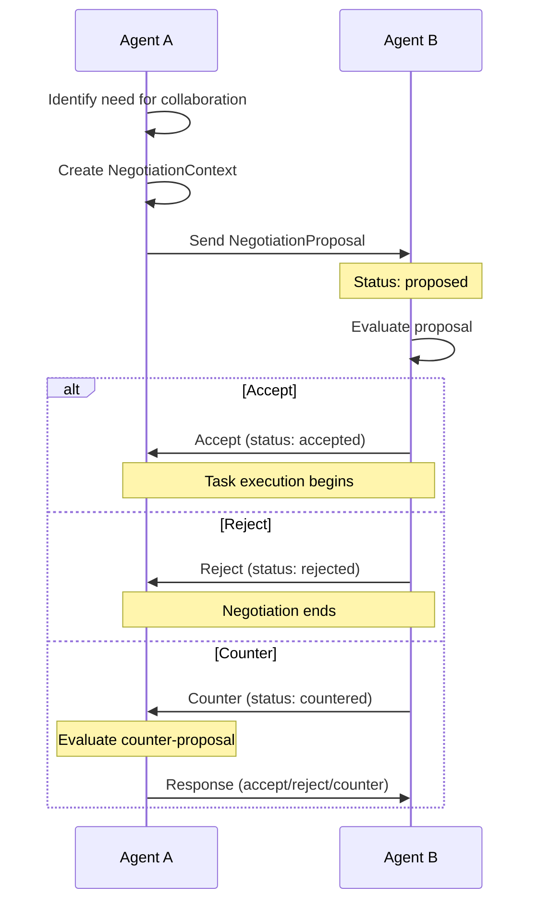
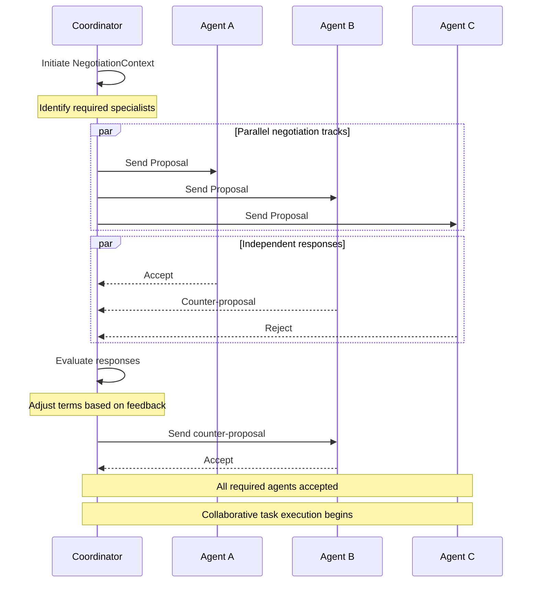

Agent-to-agent negotiation enables autonomous agents to coordinate, negotiate terms, and reach agreements for collaborative task execution. This protocol extension allows agents to propose, counter-propose, accept, or reject collaboration terms in a structured manner.

<Note>
  **Implementation status (2026-05): types only, no runtime endpoints.**

  `NegotiationProposal`, `NegotiationContext`, `NegotiationStatus`, and `NegotiationSessionStatus` exist as TypedDicts/enums in [`bindu/common/protocol/types.py`](https://github.com/getbindu/Bindu/blob/main/bindu/common/protocol/types.py), but there are **no JSON-RPC methods** for `negotiation/*` and no server handlers driving the state transitions. The schemas are stable enough to plan against; the dispatch logic is not yet wired up.

  Agents that need ad-hoc coordination today can carry these payloads inside `DataPart` content on regular `message/send` calls — the structure is well-defined, the routing is just up to your application.
</Note>

### NegotiationProposal

A structured negotiation proposal exchanged between agents during the negotiation process.

**Schema:**
```python
@pydantic.with_config(ConfigDict(alias_generator=to_camel))
class NegotiationProposal(TypedDict):
    """Structured negotiation proposal exchanged between agents."""

    proposal_id: Required[UUID]
    """The ID of the proposal."""

    from_agent: Required[UUID]
    """The ID of the agent making the proposal."""

    to_agent: Required[UUID]
    """The ID of the agent receiving the proposal."""

    terms: Required[Dict[str, Any]]
    """The terms of the proposal."""

    timestamp: Required[str]
    """The timestamp of the proposal."""

    status: Required[NegotiationStatus]
    """The status of the proposal."""
```

**Example: Task Delegation Proposal**
```json
{
  "proposalId": "550e8400-e29b-41d4-a716-446655440000",
  "fromAgent": "did:example:agent-1",
  "toAgent": "did:example:agent-2",
  "terms": {
    "taskType": "data-processing",
    "maxDurationMinutes": 30,
    "costCredits": 100,
    "priority": "high",
    "deliverables": ["processed_data.csv", "analysis_report.pdf"]
  },
  "timestamp": "2025-10-31T10:00:00Z",
  "status": "proposed"
}
```

**What it's for:** Enables agents to formally propose collaboration terms including task specifications, resource requirements, costs, and expected deliverables. Proposals can be accepted, rejected, or countered by the receiving agent.

---

### NegotiationContext

Context details for managing the complete lifecycle of agent-to-agent negotiations, including all participants and proposals.

**Schema:**
```python
@pydantic.with_config(ConfigDict(alias_generator=to_camel))
class NegotiationContext(TypedDict):
    """Context details for agent-to-agent negotiations."""

    context_id: Required[UUID]
    """The ID of the context."""

    status: Required[NegotiationStatus]
    """The status of the context."""

    participants: Required[List[str]]
    """The participants in the context."""

    proposals: Required[List[NegotiationProposal]]
    """The proposals in the context."""
```

**Example: Multi-Agent Negotiation Session**
```json
{
  "contextId": "c295ea44-7543-4f78-b524-7a38915ad6e4",
  "status": "ongoing",
  "participants": [
    "did:example:agent-coordinator",
    "did:example:agent-processor",
    "did:example:agent-validator"
  ],
  "proposals": [
    {
      "proposalId": "550e8400-e29b-41d4-a716-446655440000",
      "fromAgent": "did:example:agent-coordinator",
      "toAgent": "did:example:agent-processor",
      "terms": {
        "taskType": "data-processing",
        "maxDurationMinutes": 30,
        "costCredits": 100
      },
      "timestamp": "2025-10-31T10:00:00Z",
      "status": "accepted"
    },
    {
      "proposalId": "661f9511-f3ac-52e5-b827-557766551111",
      "fromAgent": "did:example:agent-coordinator",
      "toAgent": "did:example:agent-validator",
      "terms": {
        "taskType": "validation",
        "maxDurationMinutes": 15,
        "costCredits": 50
      },
      "timestamp": "2025-10-31T10:05:00Z",
      "status": "proposed"
    }
  ]
}
```

**What it's for:** Tracks the complete negotiation session between multiple agents, maintaining all proposals, counter-proposals, and the current negotiation status. Enables complex multi-party negotiations for collaborative task execution.

---

### Negotiation Flow Pattern

Understanding how agents negotiate and reach agreements:

**Basic Negotiation Flow:**


**Multi-Agent Negotiation Flow:**


**Negotiation Statuses (Individual Proposals):**
- **`proposed`** - Initial offer made, awaiting response
- **`accepted`** - Offer accepted, ready to proceed
- **`rejected`** - Offer declined, negotiation path closed
- **`countered`** - Counter-offer made, negotiation continues

**Session Statuses (Overall Context):**
- **`initiated`** - Negotiation session started
- **`ongoing`** - Active negotiation in progress
- **`completed`** - Agreement reached, all parties aligned
- **`rejected`** - Negotiation failed, no agreement possible

---

