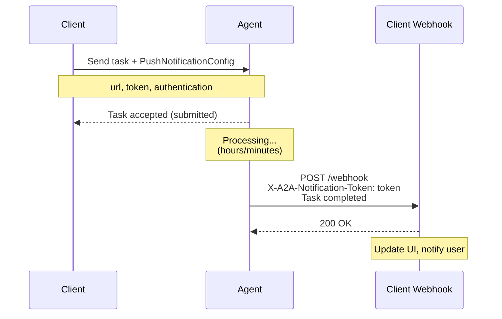

Push notification configurations define how servers send real-time updates to clients outside of active sessions. Bindu supports multiple notification patterns following the [A2A Protocol specification](https://a2a-protocol.org/latest/specification/).

### PushNotificationConfig

Defined in [`bindu/common/protocol/types.py:397`](https://github.com/getbindu/Bindu/blob/main/bindu/common/protocol/types.py#L397).

**Schema (exact):**
```python
@pydantic.with_config(A2A_MODEL_CONFIG)
class PushNotificationConfig(TypedDict):
    """Configuration for push notifications.

    When the server needs to notify the client of an update outside of a connected session.
    """

    id: Required[UUID]
    """The ID of the push notification configuration."""

    url: Required[str]
    """The URL of the push notification configuration."""

    token: NotRequired[str]
    """The token of the push notification configuration."""

    authentication: NotRequired[SecurityScheme]
    """The authentication of the push notification configuration."""
```

The `authentication` field is a [`SecurityScheme`](./security) — the same discriminated union used for inbound auth on the agent. This is a deliberate choice: the agent declares how *it* will authenticate to your webhook using the same vocabulary you'd use to declare how callers authenticate to it.

**Use Case: Webhook with bearer-token auth (`SecurityScheme` form)**
```json
{
  "id": "8f0b6df8-1f1e-4b2d-9b0a-6c5e7e4d3a2b",
  "url": "https://client.example.com/webhook/notifications",
  "token": "secure-webhook-token",
  "authentication": {
    "type": "http",
    "scheme": "bearer",
    "bearerFormat": "JWT",
    "description": "Server-issued JWT for this webhook audience"
  }
}
```

**Use Case: Webhook with API-key auth**
```json
{
  "id": "8f0b6df8-1f1e-4b2d-9b0a-6c5e7e4d3a2b",
  "url": "https://client.example.com/webhook/notifications",
  "authentication": {
    "type": "apiKey",
    "name": "X-Webhook-Key",
    "in": "header"
  }
}
```

**What it's for:** Configuring push notification endpoints where the server can send real-time updates to clients outside of active sessions. Used for notifying clients about task state changes, completion events, or errors without requiring constant polling.

---

### PushNotificationAuthenticationInfo

Defined in [`bindu/common/protocol/types.py:417`](https://github.com/getbindu/Bindu/blob/main/bindu/common/protocol/types.py#L417).

<Note>
  This type exists in the schema as an A2A-spec-compatibility shape, but `PushNotificationConfig.authentication` is typed as [`SecurityScheme`](./security), **not** `PushNotificationAuthenticationInfo`. Use `SecurityScheme` when sending a config; treat this type as informational.
</Note>

**Schema:**
```python
@pydantic.with_config(A2A_MODEL_CONFIG)
class PushNotificationAuthenticationInfo(TypedDict):
    """Authentication information for push notifications."""

    schemes: list[str]
    """A list of supported authentication schemes (e.g., 'Basic', 'Bearer')."""

    credentials: NotRequired[str]
    """Optional credentials required by the push notification endpoint."""
```

---

### TaskPushNotificationConfig

Defined in [`bindu/common/protocol/types.py:428`](https://github.com/getbindu/Bindu/blob/main/bindu/common/protocol/types.py#L428).

**Schema (exact):**
```python
@pydantic.with_config(A2A_MODEL_CONFIG)
class TaskPushNotificationConfig(TypedDict):
    """Configuration for task push notifications."""

    id: Required[UUID]
    """The ID of the task push notification configuration."""

    push_notification_config: Required[PushNotificationConfig]
    """The push notification configuration of the task push notification configuration."""

    long_running: NotRequired[bool]
    """Flag indicating task expects to run longer than typical request timeouts.

    When True, the push_notification_config should be persisted for notifications
    across server restarts. Defaults to False if not specified.
    """
```

<Warning>
  The top-level `id` here is the **task ID** that this notification config is bound to — *not* a separate config identifier. The field is `id`, not `taskId`.
</Warning>

**Use Case: Long-running task with persistent webhook**
```json
{
  "id": "43667960-d455-4453-b0cf-1bae4955270d",
  "longRunning": true,
  "pushNotificationConfig": {
    "id": "8f0b6df8-1f1e-4b2d-9b0a-6c5e7e4d3a2b",
    "url": "https://client.example.com/webhook/a2a-notifications",
    "token": "secure-client-token-for-task-aaa",
    "authentication": {
      "type": "http",
      "scheme": "bearer",
      "bearerFormat": "JWT"
    }
  }
}
```

**What it's for:** Associating specific tasks with push notification configurations. Setting `longRunning: true` tells the server to persist the webhook configuration across restarts so notifications still fire when the task finally completes. Wired through the JSON-RPC methods `tasks/pushNotificationConfig/{set,get,list,delete}` ([`settings.py:445-448`](https://github.com/getbindu/Bindu/blob/main/bindu/settings.py)).

### How Push Notifications Work

**Workflow:**
1. **Client configures** push notifications when sending a message via `message/send`
2. **Server acknowledges** the task and begins processing
3. **Server completes** the task and POSTs notification to the client's webhook URL
4. **Client validates** the notification using the token and authentication
5. **Client processes** the task update (e.g., updates UI, notifies user)

**Notification Delivery:**
When a task state changes, the server sends an HTTP POST to the configured webhook URL:

```http
POST /webhook/a2a-notifications HTTP/1.1
Host: client.example.com
Authorization: Bearer <server_jwt_for_webhook_audience>
Content-Type: application/json
X-A2A-Notification-Token: secure-client-token-for-task-aaa

{
  "id": "43667960-d455-4453-b0cf-1bae4955270d",
  "contextId": "c295ea44-7543-4f78-b524-7a38915ad6e4",
  "status": {
    "state": "completed",
    "timestamp": "2024-03-15T18:30:00Z"
  },
  "kind": "task"
}
```

### Summary

Push notifications solve a simple problem: instead of constantly asking "Is it done yet?", the agent calls you when it's finished.



You configure a **PushNotificationConfig** with your webhook URL and token—like giving the agent your callback number. Add **PushNotificationAuthenticationInfo** to specify how the agent should authenticate when calling your webhook. Use **TaskPushNotificationConfig** to route different tasks to different endpoints with their own security requirements.

This eliminates polling overhead and enables real-time updates for long-running operations—report generation, batch processing, or workflows needing human confirmation.

---

