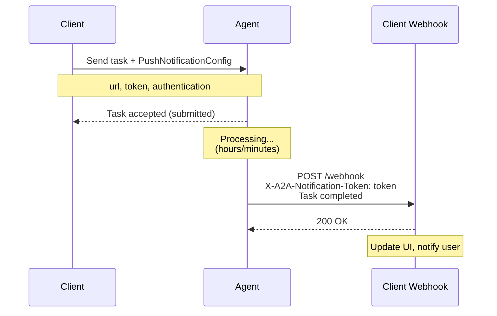

Push notification configurations define how servers send real-time updates to clients outside of active sessions. Bindu supports multiple notification patterns following the [A2A Protocol specification](https://a2a-protocol.org/latest/specification/).

### PushNotificationConfig

**Schema:**
```python
@pydantic.with_config(ConfigDict(alias_generator=to_camel))
class PushNotificationConfig(TypedDict):
    """Configuration for push notifications.
    
    When the server needs to notify the client of an update outside of a connected session.
    """
    
    id: NotRequired[str]
    """A unique identifier (e.g. UUID) for the push notification configuration.
    Set by the client to support multiple notification callbacks."""
    
    url: Required[str]
    """The callback URL where the agent should send push notifications."""
    
    token: NotRequired[str]
    """A unique token for this task or session to validate incoming push notifications."""
    
    authentication: NotRequired[PushNotificationAuthenticationInfo]
    """Optional authentication details for the agent to use when calling the notification URL."""
```

**Use Case: Webhook-based Push Notifications**
```json
{
  "url": "https://client.example.com/webhook/notifications",
  "token": "secure-webhook-token",
  "authentication": {
    "schemes": ["Bearer"],
    "credentials": "optional-bearer-token"
  }
}
```

**What it's for:** Configuring push notification endpoints where the server can send real-time updates to clients outside of active sessions. Used for notifying clients about task state changes, completion events, or errors without requiring constant polling.

---

### PushNotificationAuthenticationInfo

**Schema:**
```python
@pydantic.with_config(ConfigDict(alias_generator=to_camel))
class PushNotificationAuthenticationInfo(TypedDict):
    """Authentication information for push notifications.
    
    Defines supported authentication schemes and credentials for push notification endpoints.
    """
    
    schemes: list[str]
    """A list of supported authentication schemes (e.g., 'Basic', 'Bearer')."""
    
    credentials: NotRequired[str]
    """Optional credentials required by the push notification endpoint."""
```

**Use Case: Multi-scheme Authentication Support**
```json
{
  "schemes": ["Bearer", "Basic"],
  "credentials": "eyJhbGciOiJIUzI1NiIsInR5cCI6IkpXVCJ9..."
}
```

**What it's for:** Specifying authentication requirements for push notification endpoints. Allows clients to declare which authentication schemes they support and provide necessary credentials for the server to authenticate when sending notifications.

---

### TaskPushNotificationConfig

**Schema:**
```python
@pydantic.with_config(ConfigDict(alias_generator=to_camel))
class TaskPushNotificationConfig(TypedDict):
    """Configuration for task push notifications.
    
    Links a specific task to a push notification configuration for receiving updates.
    """
    
    task_id: Required[str]
    """The unique identifier (e.g. UUID) of the task."""
    
    push_notification_config: Required[PushNotificationConfig]
    """The push notification configuration for this task."""
```

**Use Case: Task-specific Notification Setup**
```json
{
  "taskId": "43667960-d455-4453-b0cf-1bae4955270d",
  "push_notification_config": {
    "url": "https://client.example.com/webhook/a2a-notifications",
    "token": "secure-client-token-for-task-aaa",
    "authentication": {
      "schemes": ["Bearer"]
    }
  }
}
```

**What it's for:** Associating specific tasks with push notification configurations. Enables task-level notification routing where different tasks can send updates to different endpoints or use different authentication methods.

### How Push Notifications Work

**Workflow:**
1. **Client configures** push notifications when sending a message via `message/send`
2. **Server acknowledges** the task and begins processing
3. **Server completes** the task and POSTs notification to the client's webhook URL
4. **Client validates** the notification using the token and authentication
5. **Client processes** the task update (e.g., updates UI, notifies user)

**Notification Delivery:**
When a task state changes, the server sends an HTTP POST to the configured webhook URL:

```http
POST /webhook/a2a-notifications HTTP/1.1
Host: client.example.com
Authorization: Bearer <server_jwt_for_webhook_audience>
Content-Type: application/json
X-A2A-Notification-Token: secure-client-token-for-task-aaa

{
  "id": "43667960-d455-4453-b0cf-1bae4955270d",
  "contextId": "c295ea44-7543-4f78-b524-7a38915ad6e4",
  "status": {
    "state": "completed",
    "timestamp": "2024-03-15T18:30:00Z"
  },
  "kind": "task"
}
```

### Summary

Push notifications solve a simple problem: instead of constantly asking "Is it done yet?", the agent calls you when it's finished.



You configure a **PushNotificationConfig** with your webhook URL and token—like giving the agent your callback number. Add **PushNotificationAuthenticationInfo** to specify how the agent should authenticate when calling your webhook. Use **TaskPushNotificationConfig** to route different tasks to different endpoints with their own security requirements.

This eliminates polling overhead and enables real-time updates for long-running operations—report generation, batch processing, or workflows needing human confirmation.

---

