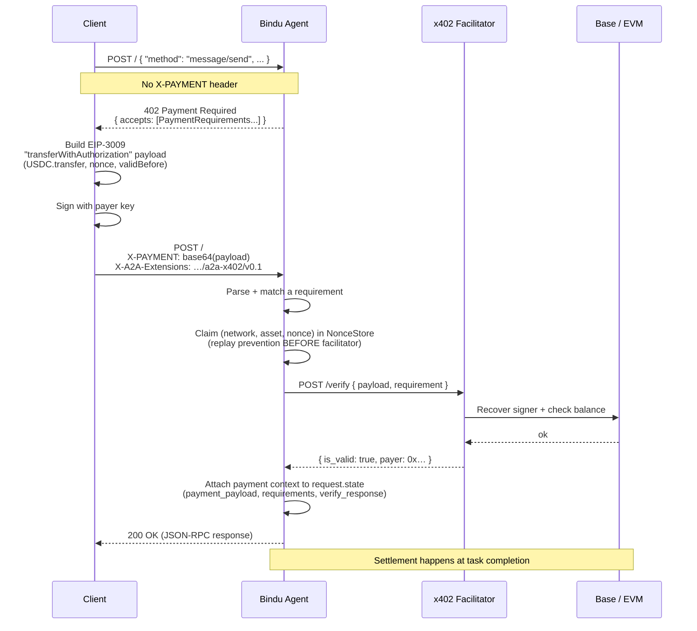

<Note>
  **What ships today.** Bindu's payment layer is the [x402 protocol](https://github.com/google-a2a/a2a-x402) — a stablecoin paywall over HTTP 402, originally from Coinbase, formalized as an A2A extension. The W3C Payment Request shapes (`PaymentMandate`, `IntentMandate`, `CartMandate`, etc.) sometimes referenced in AP2 drafts are **not implemented** in this codebase. If you find references to them anywhere in Bindu, treat those references as spec sketches rather than runtime types.
</Note>

x402 lets a server respond with HTTP 402 plus a structured `paymentRequirements` payload, the client signs an EIP-3009 transfer-with-authorization, and the server forwards the signed payload to a facilitator that verifies signature + balance + replay. Settlement happens on-chain when the task completes.

Concretely, in Bindu:

- **Default network:** `base-sepolia` (Base Sepolia testnet)
- **Default token:** USDC
- **Default facilitator:** `https://x402.org/facilitator` (Coinbase-hosted)
- **Default protected method:** JSON-RPC `message/send`
- **Extension URI:** `https://github.com/google-a2a/a2a-x402/v0.1`

All of this is configurable via [`X402Settings`](https://github.com/getbindu/Bindu/blob/main/bindu/settings.py).

---

## Declaring payment on an agent

Add an `execution_cost` block to your agent config. Source: [`examples/beginner/agno_paywall_example.py`](https://github.com/getbindu/Bindu/blob/main/examples/beginner/agno_paywall_example.py):

```python
from bindu.penguin.bindufy import bindufy

config = {
    "author": "your.email@example.com",
    "name": "research_agent_paywall",
    "description": "A research assistant agent gated by x402 payment",
    "deployment": {
        "url": "http://localhost:3775",
        "expose": True,
    },
    "execution_cost": {
        "amount": "$0.0001",                                  # USD string or atomic units
        "token": "USDC",
        "network": "base-sepolia",
        "pay_to_address": "0x2654bb8B272f117c514aAc3d4032B1795366BA5d",
        "protected_methods": ["message/send"],
    },
}

def handler(messages):
    ...

bindufy(config, handler)
```

What each field means — see [`X402AgentExtension.__init__`](https://github.com/getbindu/Bindu/blob/main/bindu/extensions/x402/x402_agent_extension.py):

| Field | Required | Notes |
|---|---|---|
| `amount` | yes (if no `payment_options`) | Either a USD string (`"$0.0001"`) or atomic units as a string (`"1000000"` = 1 USDC). |
| `token` | no (default `"USDC"`) | Token symbol the facilitator knows about. |
| `network` | no (default `"base-sepolia"`) | Any network the configured facilitator advertises. See `extra_networks` below for adding custom ones. |
| `pay_to_address` | yes (when payment is required) | EVM address that receives the funds. Required when `required=True`. |
| `protected_methods` | no | JSON-RPC methods that demand payment. Default `["message/send"]` from [`settings.py:378-381`](https://github.com/getbindu/Bindu/blob/main/bindu/settings.py). |
| `payment_options` | no | A list of dicts for multi-network / multi-token offers. The first entry becomes the primary; the full list is published as payment requirements. |

You can also offer multiple payment options:

```python
"execution_cost": {
    "payment_options": [
        {"amount": "$0.0001", "token": "USDC", "network": "base-sepolia",
         "pay_to_address": "0x2654..."},
        {"amount": "$0.0001", "token": "USDC", "network": "skale-europa",
         "pay_to_address": "0x2654..."},
    ],
    "protected_methods": ["message/send"],
}
```

---

## The request/response flow



This is implemented in [`bindu/server/middleware/x402/x402_middleware.py`](https://github.com/getbindu/Bindu/blob/main/bindu/server/middleware/x402/x402_middleware.py). The order — **claim nonce before facilitator verify** — is deliberate: replays cost zero facilitator round-trips, and we never rely on the on-chain contract to reject replays.

---

## Headers

### `X-A2A-Extensions` (activation)

Clients that want x402 to *engage* echo the extension URI on their request:

```http
X-A2A-Extensions: https://github.com/google-a2a/a2a-x402/v0.1
```

The server confirms activation by echoing the same header on the response. Helper: [`X402ActivationHandler`](https://github.com/getbindu/Bindu/blob/main/bindu/extensions/x402/extension.py).

### `X-PAYMENT` (the signed payload)

The serialized x402 `PaymentPayload`, base64-encoded:

```http
X-PAYMENT: eyJ4NDAyVmVyc2lvbiI6Mi…
```

The decoded payload is a JSON object the x402 SDK parses via `parse_payment_payload`. v1 payloads are explicitly rejected — only v2 (signed EIP-3009) is accepted.

---

## Payment-related task states

x402 introduces task states beyond standard A2A. From [`X402Settings`](https://github.com/getbindu/Bindu/blob/main/bindu/settings.py#L390-L395):

| State | Meaning |
|---|---|
| `payment-required` | Server returned 402; client must sign and re-send with `X-PAYMENT`. |
| `payment-submitted` | Client posted an `X-PAYMENT` header; verification is in flight. |
| `payment-verified` | Facilitator returned `is_valid: true`; task proceeds to execution. |
| `payment-completed` | Task finished; on-chain settlement receipt recorded. |
| `payment-failed` | Verification or settlement failed; receipt or error in metadata. |

These are written to `Task.metadata` under well-known keys ([`settings.py:384-388`](https://github.com/getbindu/Bindu/blob/main/bindu/settings.py)):

```python
meta_status_key   = "x402.payment.status"
meta_required_key = "x402.payment.required"
meta_payload_key  = "x402.payment.payload"
meta_receipts_key = "x402.payment.receipts"
meta_error_key    = "x402.payment.error"
```

Helpers in [`bindu/extensions/x402/utils.py`](https://github.com/getbindu/Bindu/blob/main/bindu/extensions/x402/utils.py) build these dicts:

```python
def build_payment_completed_metadata(receipt: dict) -> dict[str, Any]:
    return {
        app_settings.x402.meta_status_key: app_settings.x402.status_completed,
        app_settings.x402.meta_receipts_key: [receipt],
    }
```

A completed task ends up with metadata roughly like:

```json
{
  "x402.payment.status": "payment-completed",
  "x402.payment.receipts": [
    {
      "network": "base-sepolia",
      "asset": "0x036CbD53842c5426634e7929541eC2318f3dCF7e",
      "tx_hash": "0x…",
      "payer": "0x…",
      "amount": "100"
    }
  ]
}
```

(The exact receipt shape comes from the facilitator response.)

---

## 402 response shape (what your client gets)

When payment is missing or invalid, the middleware returns HTTP 402 with a JSON body the x402 SDK can consume. The minimal contract:

```json
{
  "x402Version": 2,
  "accepts": [
    {
      "scheme": "exact",
      "network": "base-sepolia",
      "asset": "0x036CbD53842c5426634e7929541eC2318f3dCF7e",
      "maxAmountRequired": "100",
      "payTo": "0x2654bb8B272f117c514aAc3d4032B1795366BA5d",
      "maxTimeoutSeconds": 600,
      "resource": "/",
      "mimeType": "application/json",
      "description": "…"
    }
  ],
  "error": "X-PAYMENT header required"
}
```

The `accepts` array contains every `PaymentRequirements` your agent published — one per entry in `payment_options` (or one synthesized from the single `amount`/`token`/`network`).

---

## Configuring the facilitator and networks

The Coinbase default (`https://x402.org/facilitator`) supports Base mainnet and Base Sepolia out of the box. For other EVM networks the SDK doesn't know about, add an entry to `X402Settings.extra_networks`:

```python
from bindu.settings import ExtraNetwork

X402Settings.extra_networks = {
    "skale-europa": ExtraNetwork(
        caip2="eip155:1187947933",
        asset="0x85889c8c714505E0c94b30fcfcF64fE3Ac8FCb20",
        asset_symbol="USDC",
        asset_name="Bridged USDC (SKALE Bridge)",
    ),
}
```

The facilitator must also know the network. The Coinbase default does **not** support SKALE today — point `facilitator_url` at one that does (e.g. `https://facilitator.x402.fi`).

All knobs are environment-driven (`X402__FACILITATOR_URL`, `X402__DEFAULT_NETWORK`, …) — see the `env_prefix="X402__"` on [`X402Settings`](https://github.com/getbindu/Bindu/blob/main/bindu/settings.py#L358).

---

## What's not in this implementation

So you know where the boundaries are:

- No `PaymentRequest` / `PaymentResponse` / `PaymentMandate` / `IntentMandate` / `CartMandate` types — those AP2 shapes don't exist as Python types in this repo. If you've seen them in older Bindu docs, they were spec sketches.
- No multi-currency fiat support — payments are stablecoin transfers on EVM chains via x402.
- No subscription model — every protected call is a one-shot payment authorization. Long-running tasks bind one payment to one task ID; renewals are not handled by the protocol.
- Settlement currently happens at task completion. There is no partial-credit / metered billing within a single task.

If you need one of these and want to discuss adding it, [open an issue](https://github.com/getbindu/Bindu/issues/new/choose).
