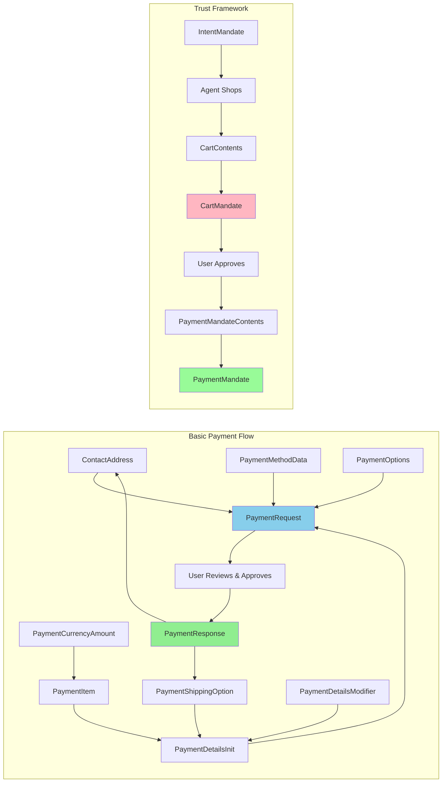
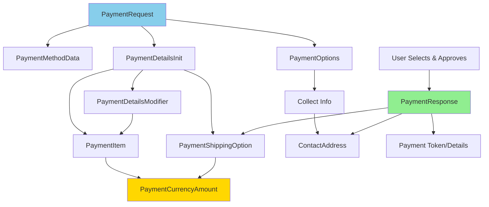
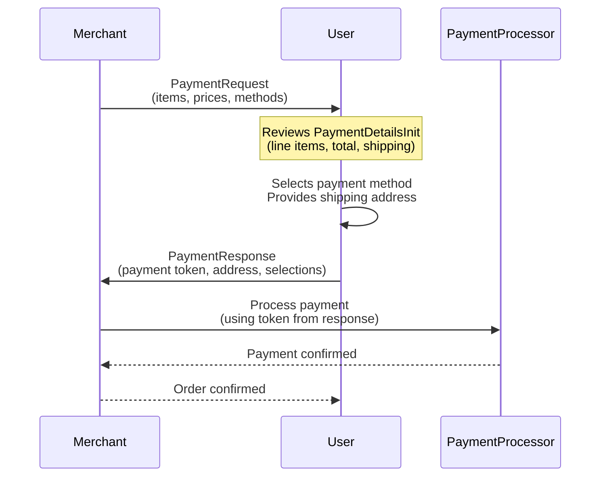
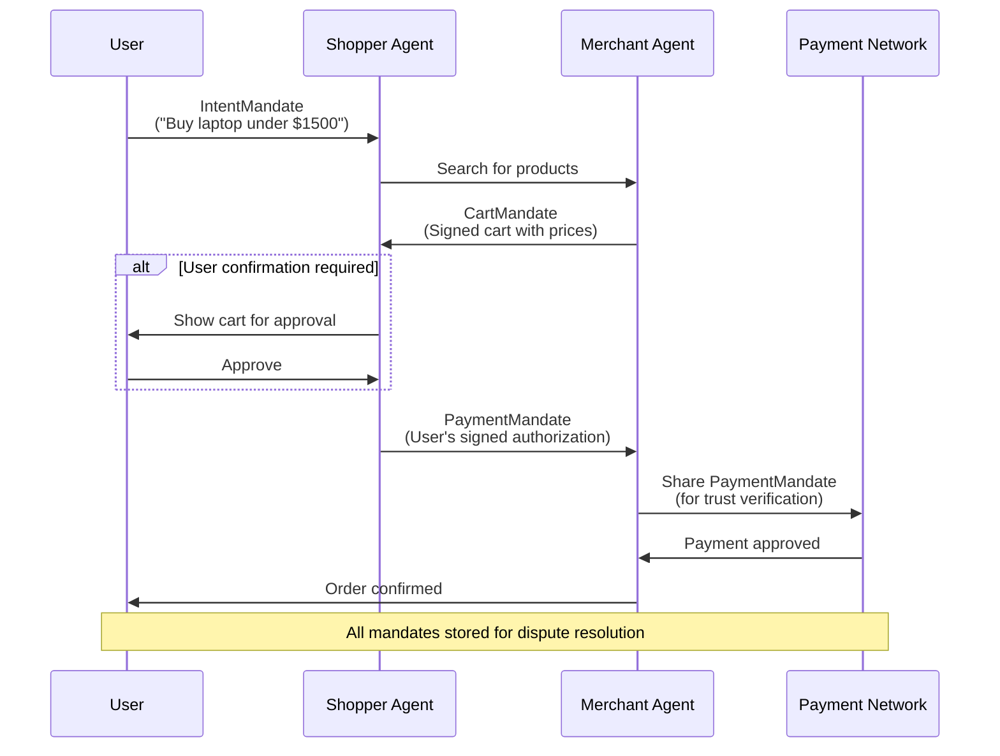

Payment models enable agents to handle commerce transactions, from simple purchases to complex multi-party negotiations. These types support the Agent Payments Protocol (AP2) for autonomous commerce.

### Overview

The AP2 protocol defines two categories of types:

**Basic Payment Types** - Building blocks for transactions:
- **ContactAddress** - Physical addresses for shipping/billing
- **PaymentCurrencyAmount** - Monetary values with currency codes
- **PaymentItem** - Line items with pricing and refund policies
- **PaymentShippingOption** - Delivery method choices
- **PaymentOptions** - Checkout configuration (what to collect)
- **PaymentMethodData** - Supported payment methods
- **PaymentDetailsModifier** - Method-specific price adjustments
- **PaymentDetailsInit** - Complete order breakdown
- **PaymentRequest** - Full payment request from merchant
- **PaymentResponse** - User's payment authorization

**Mandate Types** - Trust framework for disputes:
- **IntentMandate** - User's purchase intent with constraints
- **CartContents** - Shopping cart structure
- **CartMandate** - Merchant's signed price guarantee
- **PaymentMandateContents** - Payment authorization details
- **PaymentMandate** - User's cryptographic signature



---

### ContactAddress

**Schema:**
```python
@pydantic.with_config(ConfigDict(alias_generator=to_camel))
class ContactAddress(TypedDict):
    """The ContactAddress interface represents a physical address.
    
    Used for shipping, billing, or contact information in payment transactions.
    """
    
    city: NotRequired[str]
    """The city."""
    
    country: NotRequired[str]
    """The country."""
    
    dependent_locality: NotRequired[str]
    """The dependent locality."""
    
    organization: NotRequired[str]
    """The organization."""
    
    phone_number: NotRequired[str]
    """The phone number."""
    
    postal_code: NotRequired[str]
    """The postal code."""
    
    recipient: NotRequired[str]
    """The recipient."""
    
    region: NotRequired[str]
    """The region."""
    
    sorting_code: NotRequired[str]
    """The sorting code."""
    
    address_line: NotRequired[list[str]]
    """The address line."""
```

**Use Case: Shipping Address**
```json
{
  "recipient": "John Doe",
  "addressLine": ["123 Main St", "Apt 4B"],
  "city": "San Francisco",
  "region": "CA",
  "postalCode": "94102",
  "country": "US",
  "phoneNumber": "+1-555-0123"
}
```

**What it's for:** Capturing physical addresses for shipping products, billing information, or contact details in payment transactions. Supports international addresses with flexible field structure.

---

### PaymentCurrencyAmount

**Schema:**
```python
@pydantic.with_config(ConfigDict(alias_generator=to_camel))
class PaymentCurrencyAmount(TypedDict):
    """A PaymentCurrencyAmount is used to supply monetary amounts.
    
    Represents a specific amount in a given currency using ISO 4217 codes.
    """
    
    currency: Required[str]
    """The three-letter ISO 4217 currency code."""
    
    value: Required[float]
    """The monetary value."""
```

**Use Case: Product Pricing**
```json
{
  "currency": "USD",
  "value": 29.99
}
```

**What it's for:** Representing monetary amounts with explicit currency specification. Ensures clarity in multi-currency transactions and prevents currency confusion in international commerce.

---

### PaymentItem

**Schema:**
```python
@pydantic.with_config(ConfigDict(alias_generator=to_camel))
class PaymentItem(TypedDict):
    """An item for purchase and the value asked for it.
    
    Represents a line item in a payment request with pricing and metadata.
    """
    
    label: Required[str]
    """A human-readable description of the item."""
    
    amount: Required[PaymentCurrencyAmount]
    """The monetary amount of the item."""
    
    pending: NotRequired[bool]
    """If true, indicates the amount is not final."""
    
    refund_period: NotRequired[int]
    """The refund duration for this item, in days."""
```

**Use Case: Shopping Cart Item**
```json
{
  "label": "Premium Subscription - Annual",
  "amount": {
    "currency": "USD",
    "value": 299.99
  },
  "pending": false,
  "refundPeriod": 30
}
```

**What it's for:** Defining individual items in a payment request with pricing, descriptions, and refund policies. The `pending` flag indicates if the price might change (e.g., shipping costs pending address confirmation).

---

### PaymentShippingOption

**Schema:**
```python
@pydantic.with_config(ConfigDict(alias_generator=to_camel))
class PaymentShippingOption(TypedDict):
    """Describes a shipping option.
    
    Allows customers to choose between different shipping methods with varying costs and speeds.
    """
    
    id: Required[str]
    """A unique identifier for the shipping option."""
    
    label: Required[str]
    """A human-readable description of the shipping option."""
    
    amount: Required[PaymentCurrencyAmount]
    """The cost of this shipping option."""
    
    selected: NotRequired[bool]
    """If true, indicates this as the default option."""
```

**Use Case: Shipping Method Selection**
```json
{
  "id": "standard",
  "label": "Standard Shipping (5-7 business days)",
  "amount": {
    "currency": "USD",
    "value": 5.99
  },
  "selected": true
}
```

**What it's for:** Presenting shipping options to customers with different delivery speeds and costs. The `selected` flag indicates the default or currently chosen option.

---

### PaymentOptions

**Schema:**
```python
@pydantic.with_config(ConfigDict(alias_generator=to_camel))
class PaymentOptions(TypedDict):
    """Information about the eligible payment options for the payment request.
    
    Specifies what information should be collected from the payer during checkout.
    """
    
    request_payer_name: NotRequired[bool]
    """Indicates if the payer's name should be collected."""
    
    request_payer_email: NotRequired[bool]
    """Indicates if the payer's email should be collected."""
    
    request_payer_phone: NotRequired[bool]
    """Indicates if the payer's phone number should be collected."""
    
    request_shipping: NotRequired[bool]
    """Indicates if the payer's shipping address should be collected."""
    
    shipping_type: NotRequired[str]
    """Can be `shipping`, `delivery`, or `pickup`."""
```

**Use Case: Checkout Configuration**
```json
{
  "requestPayerName": true,
  "requestPayerEmail": true,
  "requestPayerPhone": false,
  "requestShipping": true,
  "shippingType": "delivery"
}
```

**What it's for:** Configuring what information to collect during checkout. Digital goods might only need email, while physical products require shipping addresses. The `shipping_type` clarifies the fulfillment method.

---

### PaymentMethodData

**Schema:**
```python
@pydantic.with_config(ConfigDict(alias_generator=to_camel))
class PaymentMethodData(TypedDict):
    """Indicates a payment method and associated data specific to the method.
    
    Describes supported payment methods and their configuration.
    """
    
    supported_methods: Required[str]
    """A string identifying the payment method."""
    
    data: NotRequired[Dict[str, Any]]
    """Payment method specific details."""
```

**Use Case: Card Payment Method**
```json
{
  "supportedMethods": "CARD",
  "data": {
    "paymentProcessorUrl": "https://payment-processor.example.com/process"
  }
}
```

**What it's for:** Declaring which payment methods a merchant accepts (cards, digital wallets, bank transfers) and providing method-specific configuration like processor URLs or supported card networks.

---

### PaymentDetailsModifier

**Schema:**
```python
@pydantic.with_config(ConfigDict(alias_generator=to_camel))
class PaymentDetailsModifier(TypedDict):
    """Provides details that modify the payment details based on a payment method.
    
    Allows different pricing or fees based on the chosen payment method.
    """
    
    supported_methods: Required[str]
    """The payment method ID that this modifier applies to."""
    
    total: NotRequired[PaymentItem]
    """A PaymentItem value that overrides the original item total."""
    
    additional_display_items: NotRequired[list[PaymentItem]]
    """Additional PaymentItems applicable for this payment method."""
    
    data: NotRequired[Any]
    """Payment method specific data for the modifier."""
```

**Use Case: Credit Card Processing Fee**
```json
{
  "supportedMethods": "CARD",
  "additionalDisplayItems": [
    {
      "label": "Credit Card Processing Fee",
      "amount": {
        "currency": "USD",
        "value": 2.50
      }
    }
  ],
  "total": {
    "label": "Total with Card Fee",
    "amount": {
      "currency": "USD",
      "value": 302.49
    }
  }
}
```

**What it's for:** Adjusting prices based on payment method. Credit cards might add processing fees, while bank transfers might offer discounts. The modifier updates the total and adds line items specific to that payment method.

---

### PaymentDetailsInit

**Schema:**
```python
@pydantic.with_config(ConfigDict(alias_generator=to_camel))
class PaymentDetailsInit(TypedDict):
    """Contains the details of the payment being requested.
    
    The complete financial breakdown of a transaction.
    """
    
    id: Required[str]
    """A unique identifier for the payment request."""
    
    display_items: Required[list[PaymentItem]]
    """A list of payment items to be displayed to the user."""
    
    shipping_options: NotRequired[list[PaymentShippingOption]]
    """A list of available shipping options."""
    
    modifiers: NotRequired[list[PaymentDetailsModifier]]
    """A list of price modifiers for particular payment methods."""
    
    total: Required[PaymentItem]
    """The total payment amount."""
    
    description: NotRequired[str]
    """A description of the payment request."""
```

**Use Case: Order Details**
```json
{
  "id": "order-2024-001",
  "displayItems": [
    {
      "label": "Premium Subscription",
      "amount": {"currency": "USD", "value": 299.99}
    },
    {
      "label": "Tax",
      "amount": {"currency": "USD", "value": 24.00}
    }
  ],
  "total": {
    "label": "Total",
    "amount": {"currency": "USD", "value": 323.99}
  },
  "description": "Annual Premium Subscription"
}
```

**What it's for:** Providing the complete financial breakdown of a transaction—line items, taxes, shipping, and total. This is what the user sees before authorizing payment.

---

### PaymentRequest

**Schema:**
```python
@pydantic.with_config(ConfigDict(alias_generator=to_camel))
class PaymentRequest(TypedDict):
    """A request for payment.
    
    The complete payment request sent from merchant to shopper agent.
    """
    
    method_data: list[PaymentMethodData]
    """A list of supported payment methods."""
    
    details: PaymentDetailsInit
    """The financial details of the transaction."""
    
    options: NotRequired[PaymentOptions]
    """Information about the eligible payment options for the payment request."""
    
    shipping_address: NotRequired[ContactAddress]
    """The user's provided shipping address."""
```

**Use Case: Complete Payment Request**
```json
{
  "methodData": [
    {
      "supportedMethods": "CARD",
      "data": {"paymentProcessorUrl": "https://processor.example.com"}
    }
  ],
  "details": {
    "id": "order-123",
    "displayItems": [
      {"label": "Product", "amount": {"currency": "USD", "value": 99.99}}
    ],
    "total": {
      "label": "Total",
      "amount": {"currency": "USD", "value": 99.99}
    }
  },
  "options": {
    "requestShipping": true,
    "requestPayerEmail": true
  }
}
```

**What it's for:** The complete payment request combining accepted payment methods, order details, and checkout options. This is sent from the merchant agent to initiate the payment flow.

---

### PaymentResponse

**Schema:**
```python
@pydantic.with_config(ConfigDict(alias_generator=to_camel))
class PaymentResponse(TypedDict):
    """Indicates a user has chosen a payment method & approved a payment request.
    
    The user's payment authorization response.
    """
    
    request_id: Required[str]
    """The unique ID from the original PaymentRequest."""
    
    method_name: Required[str]
    """The payment method chosen by the user."""
    
    details: NotRequired[Dict[str, Any]]
    """A dictionary generated by a payment method that a merchant can use to process a transaction.
    The contents will depend upon the payment method.
    """
    
    shipping_address: NotRequired[ContactAddress]
    """The user's provided shipping address."""
    
    shipping_option: NotRequired[PaymentShippingOption]
    """The selected shipping option."""
    
    payer_name: NotRequired[str]
    """The name of the payer."""
    
    payer_email: NotRequired[str]
    """The email of the payer."""
    
    payer_phone: NotRequired[str]
    """The phone number of the payer."""
```

**Use Case: User Payment Authorization**
```json
{
  "requestId": "order-123",
  "methodName": "CARD",
  "details": {
    "token": "tok_visa_4242"
  },
  "shippingAddress": {
    "recipient": "Jane Smith",
    "addressLine": ["456 Oak Ave"],
    "city": "Portland",
    "region": "OR",
    "postalCode": "97201",
    "country": "US"
  },
  "payerEmail": "jane@example.com"
}
```

**What it's for:** The user's response after selecting a payment method and authorizing the transaction. Contains the payment token/credentials, selected shipping details, and collected payer information needed to complete the purchase.


---

### Payment Flow Overview

The payment types work together to create a complete checkout experience:



**Payment Request Flow:**


**Key Relationships:**
- **PaymentRequest** combines method options, order details, and checkout configuration
- **PaymentDetailsInit** breaks down the total into line items with **PaymentItem** and **PaymentCurrencyAmount**
- **PaymentOptions** determines what information to collect (name, email, shipping)
- **PaymentResponse** returns the user's selections and payment credentials
- **PaymentDetailsModifier** adjusts pricing based on the chosen payment method

---

## Payment Mandates (Trust Framework)

Mandates are cryptographically signed documents that establish trust and accountability in agent-driven commerce. They create an immutable audit trail for dispute resolution.

### IntentMandate

**Schema:**
```python
@pydantic.with_config(ConfigDict(alias_generator=to_camel))
class IntentMandate(TypedDict):
    """Represents the user's purchase intent.
    
    These are the initial fields utilized in the human-present flow. For
    human-not-present flows, additional fields will be added to this mandate.
    """
    
    user_cart_confirmation_required: Required[bool]
    """If false, the agent can make purchases on the user's behalf once all
    purchase conditions have been satisfied. This must be true if the
    intent mandate is not signed by the user.
    """
    
    natural_language_description: Required[str]
    """The natural language description of the user's intent. This is
    generated by the shopping agent, and confirmed by the user. The
    goal is to have informed consent by the user."""
    
    merchants: NotRequired[list[str]]
    """Merchants allowed to fulfill the intent. If not set, the shopping
    agent is able to work with any suitable merchant."""
    
    skus: NotRequired[list[str]]
    """A list of specific product SKUs. If not set, any SKU is allowed."""
    
    requires_refundability: NotRequired[bool]
    """If true, items must be refundable."""
    
    intent_expiry: Required[str]
    """When the intent mandate expires, in ISO 8601 format."""
```

**Use Case: Autonomous Shopping with Constraints**
```json
{
  "userCartConfirmationRequired": false,
  "naturalLanguageDescription": "Buy a laptop under $1500 from trusted retailers with 30-day return policy",
  "merchants": ["BestBuy", "Amazon", "Newegg"],
  "requiresRefundability": true,
  "intentExpiry": "2025-12-31T23:59:59Z"
}
```

**What it's for:** Capturing the user's purchase intent with explicit constraints. The agent can autonomously shop within these boundaries—specific merchants, refund requirements, price limits. The natural language description ensures informed consent.

---

### CartContents

**Schema:**
```python
@pydantic.with_config(ConfigDict(alias_generator=to_camel))
class CartContents(TypedDict):
    """The detailed contents of a cart.
    
    This object is signed by the merchant to create a CartMandate.
    """
    
    id: Required[str]
    """A unique identifier for this cart."""
    
    user_cart_confirmation_required: Required[bool]
    """If true, the merchant requires the user to confirm the cart before
    the purchase can be completed."""
    
    payment_request: Required[PaymentRequest]
    """The W3C PaymentRequest object to initiate payment. This contains the
    items being purchased, prices, and the set of payment methods
    accepted by the merchant for this cart."""
    
    cart_expiry: Required[str]
    """When this cart expires, in ISO 8601 format."""
    
    merchant_name: Required[str]
    """The name of the merchant."""
```

**Use Case: Shopping Cart**
```json
{
  "id": "cart-abc123",
  "userCartConfirmationRequired": true,
  "merchantName": "BestBuy",
  "paymentRequest": {
    "methodData": [{"supportedMethods": "CARD"}],
    "details": {
      "id": "order-456",
      "displayItems": [
        {"label": "Laptop", "amount": {"currency": "USD", "value": 1299.99}}
      ],
      "total": {"label": "Total", "amount": {"currency": "USD", "value": 1299.99}}
    }
  },
  "cartExpiry": "2025-11-01T12:00:00Z"
}
```

**What it's for:** The merchant's shopping cart with guaranteed prices and items. Contains the complete payment request and expiration time. This is what gets signed to create a CartMandate.

---

### CartMandate

**Schema:**
```python
@pydantic.with_config(ConfigDict(alias_generator=to_camel))
class CartMandate(TypedDict):
    """A cart whose contents have been digitally signed by the merchant.
    
    This serves as a guarantee of the items and price for a limited time.
    """
    
    contents: Required[CartContents]
    """The contents of the cart."""
    
    merchant_authorization: NotRequired[str]
    """A base64url-encoded JSON Web Token (JWT) that digitally
    signs the cart contents, guaranteeing its authenticity and integrity:
    1. Header includes the signing algorithm and key ID.
    2. Payload includes:
      - iss, sub, aud: Identifiers for the merchant (issuer)
        and the intended recipient (audience), like a payment processor.
      - iat: iat, exp: Timestamps for the token's creation and its
        short-lived expiration (e.g., 5-15 minutes) to enhance security.
      - jti: Unique identifier for the JWT to prevent replay attacks.
      - cart_hash: A secure hash of the CartMandate, ensuring
         integrity. The hash is computed over the canonical JSON
         representation of the CartContents object.
    3. Signature: A digital signature created with the merchant's private
      key. It allows anyone with the public key to verify the token's
      authenticity and confirm that the payload has not been tampered with.
    The entire JWT is base64url encoded to ensure safe transmission.
    """
```

**Use Case: Merchant's Price Guarantee**
```json
{
  "contents": {
    "id": "cart-abc123",
    "merchantName": "BestBuy",
    "userCartConfirmationRequired": true,
    "paymentRequest": { "..." },
    "cartExpiry": "2025-11-01T12:00:00Z"
  },
  "merchantAuthorization": "eyJhbGciOiJFUzI1NiIsImtpZCI6Im1lcmNoYW50LWtleS0xMjMifQ..."
}
```

**What it's for:** The merchant's cryptographic guarantee of cart contents and prices. The JWT signature proves authenticity and prevents tampering. In disputes, this proves what the merchant actually offered.

---

### PaymentMandateContents

**Schema:**
```python
@pydantic.with_config(ConfigDict(alias_generator=to_camel))
class PaymentMandateContents(TypedDict):
    """The data contents of a PaymentMandate.
    
    Contains the payment authorization details before user signature.
    """
    
    payment_mandate_id: Required[str]
    """A unique identifier for this payment mandate."""
    
    payment_details_id: Required[str]
    """A unique identifier for the payment request."""
    
    payment_details_total: Required[PaymentItem]
    """The total payment amount."""
    
    payment_response: Required[PaymentResponse]
    """The payment response containing details of the payment method chosen by the user."""
    
    merchant_agent: Required[str]
    """Identifier for the merchant."""
    
    timestamp: Required[str]
    """The date and time the mandate was created, in ISO 8601 format."""
```

**Use Case: Payment Authorization Details**
```json
{
  "paymentMandateId": "pm-789",
  "paymentDetailsId": "order-456",
  "paymentDetailsTotal": {
    "label": "Total",
    "amount": {"currency": "USD", "value": 1299.99},
    "refundPeriod": 30
  },
  "paymentResponse": {
    "requestId": "order-456",
    "methodName": "CARD",
    "details": {"token": "tok_visa_4242"}
  },
  "merchantAgent": "bestbuy-agent-did",
  "timestamp": "2025-10-31T22:30:00Z"
}
```

**What it's for:** The complete payment authorization details—what's being paid, how much, which payment method, and when. This gets signed by the user to create the final PaymentMandate.

---

### PaymentMandate

**Schema:**
```python
@pydantic.with_config(ConfigDict(alias_generator=to_camel))
class PaymentMandate(TypedDict):
    """Contains the user's instructions & authorization for payment.
    
    While the Cart and Intent mandates are required by the merchant to fulfill the
    order, separately the protocol provides additional visibility into the agentic
    transaction to the payments ecosystem. For this purpose, the PaymentMandate
    (bound to Cart/Intent mandate but containing separate information) may be
    shared with the network/issuer along with the standard transaction
    authorization messages. The goal of the PaymentMandate is to help the
    network/issuer build trust into the agentic transaction.
    """
    
    payment_mandate_contents: Required[PaymentMandateContents]
    """The data contents of the payment mandate."""
    
    user_authorization: NotRequired[str]
    """This is a base64_url-encoded verifiable presentation of a verifiable
    credential signing over the cart_mandate and payment_mandate_hashes.
    For example an sd-jwt-vc would contain:
    
    - An issuer-signed jwt authorizing a 'cnf' claim
    - A key-binding jwt with the claims
        "aud": ...
        "nonce": ...
        "sd_hash": hash of the issuer-signed jwt
        "transaction_data": an array containing the secure hashes of
          CartMandate and PaymentMandateContents.
    """
```

**Use Case: Final User Authorization**
```json
{
  "paymentMandateContents": {
    "paymentMandateId": "pm-789",
    "paymentDetailsId": "order-456",
    "paymentDetailsTotal": {
      "label": "Total",
      "amount": {"currency": "USD", "value": 1299.99}
    },
    "paymentResponse": {
      "requestId": "order-456",
      "methodName": "CARD",
      "details": {"token": "tok_visa_4242"}
    },
    "merchantAgent": "bestbuy-agent-did",
    "timestamp": "2025-10-31T22:30:00Z"
  },
  "userAuthorization": "eyJhbGciOiJFUzI1NksiLCJraWQiOiJkaWQ6ZXhhbXBsZTp1c2VyLWtleSJ9..."
}
```

**What it's for:** The user's cryptographic signature authorizing the payment. Shared with payment networks (Visa, Mastercard) to establish trust in agent-driven transactions. In disputes, this proves the user actually authorized the purchase.

### Summary

The mandate framework creates a trust chain for autonomous commerce:



**The Three Mandates:**
- **IntentMandate** - User says "Here's what I want to buy and my constraints"
- **CartMandate** - Merchant says "Here's what I'm offering at this price"
- **PaymentMandate** - User says "I authorize this specific payment"

Each mandate is cryptographically signed, creating an immutable audit trail. In disputes, these prove exactly what was agreed to by each party, enabling fair resolution without relying on agent logs or interpretations.

---

