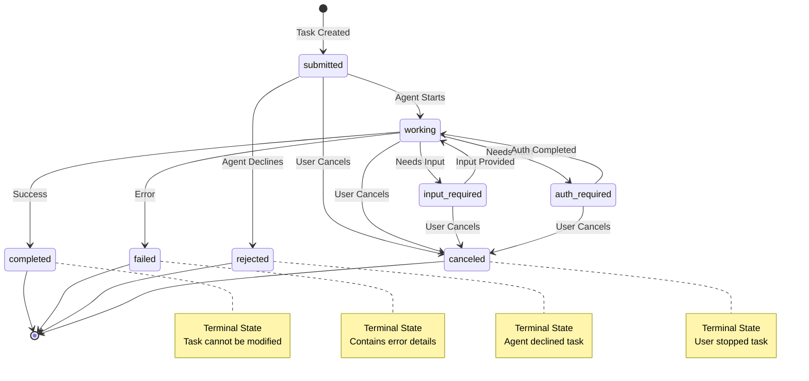

Tasks are the fundamental coordination mechanism in the A2A protocol. They represent stateful execution units that manage the complete lifecycle of work from client request to agent completion. Every interaction between a client and an agent is organized around tasks.

### Task Object

A **Task** is the central coordination unit that tracks work execution. It encapsulates the entire interaction related to a specific goal or request, maintaining conversation history, execution state, and generated artifacts.

**Schema:**
```python
class Task(TypedDict):
    """Stateful execution unit coordinating client-agent interaction.
    
    Tasks serve as the primary coordination mechanism in the bindu protocol,
    managing the complete lifecycle from request to completion. They maintain
    conversation history, track execution state, and collect generated artifacts.
    
    Core Responsibilities:
    - Message Exchange: Facilitate communication between clients and agents
    - State Management: Track task progress and execution status
    - Artifact Collection: Gather and organize agent-generated outputs
    - History Tracking: Maintain complete conversation and decision trail
    
    Task Lifecycle:
    1. Creation: Client initiates task with initial message/requirements
    2. Processing: Agent processes messages and updates status
    3. Communication: Bidirectional message exchange as needed
    4. Artifact Generation: Agent produces deliverable outputs
    5. Completion: Final status update and artifact delivery
    
    Key Properties:
    - Client-Initiated: Always created by clients, never by agents
    - Agent-Controlled: Status and progress determined by executing agent
    - Stateful: Maintains complete execution context and history
    - Traceable: Unique ID enables task tracking and reference
    """
    
    id: Required[UUID]
    """Unique identifier for the task, generated by the server."""
    
    context_id: Required[UUID]
    """The context this task belongs to for session management."""
    
    kind: Required[Literal["task"]]
    """Type discriminator, always "task"."""
    
    status: Required[TaskStatus]
    """Current status including state, timestamp, and optional message."""
    
    artifacts: NotRequired[list[Artifact]]
    """Collection of outputs generated during task execution."""
    
    history: NotRequired[list[Message]]
    """Complete conversation history for this task."""
    
    metadata: NotRequired[dict[str, Any]]
    """Optional metadata for extensions and custom data."""
```

**Realistic Example: Data Analysis Task**

A client requests sales data analysis. The task tracks the entire interaction:

```json
{
  "id": "363422be-b0f9-4692-a24d-278670e7c7f1",
  "contextId": "c295ea44-7543-4f78-b524-7a38915ad6e4",
  "kind": "task",
  "status": {
    "state": "completed",
    "timestamp": "2025-10-31T10:35:00Z",
    "message": {
      "messageId": "status-msg-001",
      "contextId": "c295ea44-7543-4f78-b524-7a38915ad6e4",
      "taskId": "363422be-b0f9-4692-a24d-278670e7c7f1",
      "kind": "message",
      "role": "agent",
      "parts": [
        {
          "kind": "text",
          "text": "Analysis complete. Identified 3 key trends and generated comprehensive report."
        }
      ]
    }
  },
  "artifacts": [
    {
      "artifactId": "9b6934dd-37e3-4eb1-8766-962efaab63a1",
      "name": "Q4 Sales Analysis Report",
      "description": "Comprehensive analysis of Q4 sales trends",
      "parts": [
        {
          "kind": "text",
          "text": "# Q4 Sales Analysis\n\n## Executive Summary\nRevenue increased 23% compared to Q3, driven primarily by mobile sales growth of 45% year-over-year.\n\n## Key Findings\n1. **Revenue Growth**: Total revenue reached $2.45M, up 23% from Q3\n2. **Regional Performance**: West Coast dominated with 35% of total sales\n3. **Mobile Surge**: Mobile channel grew 45% YoY, now 28% of total revenue\n\n## Recommendations\n- Increase inventory allocation for top-performing products\n- Expand mobile marketing campaigns in Q1\n- Focus expansion efforts on West Coast market"
        },
        {
          "kind": "data",
          "data": {
            "summary": {
              "totalRevenue": 2450000,
              "growthRate": 0.23,
              "topRegion": "West Coast",
              "mobileGrowth": 0.45
            },
            "monthlyTrends": [
              {"month": "October", "revenue": 750000, "growth": 0.18},
              {"month": "November", "revenue": 820000, "growth": 0.21},
              {"month": "December", "revenue": 880000, "growth": 0.27}
            ],
            "topProducts": [
              {"name": "Premium Widget", "revenue": 450000, "units": 1200},
              {"name": "Standard Widget", "revenue": 380000, "units": 2500}
            ]
          }
        }
      ],
      "metadata": {
        "generatedAt": "2025-10-31T10:35:00Z",
        "analysisType": "quarterly_sales",
        "dataPoints": 15000
      }
    }
  ],
  "history": [
    {
      "messageId": "9229e770-767c-417b-a0b0-f0741243c589",
      "contextId": "c295ea44-7543-4f78-b524-7a38915ad6e4",
      "taskId": "363422be-b0f9-4692-a24d-278670e7c7f1",
      "kind": "message",
      "role": "user",
      "parts": [
        {
          "kind": "text",
          "text": "Analyze Q4 sales data and identify key trends"
        },
        {
          "kind": "file",
          "file": {
            "name": "sales_q4_2025.csv",
            "mimeType": "text/csv",
            "uri": "https://storage.example.com/data/sales_q4_2025.csv"
          }
        }
      ],
      "metadata": {
        "priority": "high",
        "deadline": "2025-11-01T00:00:00Z"
      }
    },
    {
      "messageId": "agent-msg-001",
      "contextId": "c295ea44-7543-4f78-b524-7a38915ad6e4",
      "taskId": "363422be-b0f9-4692-a24d-278670e7c7f1",
      "kind": "message",
      "role": "agent",
      "parts": [
        {
          "kind": "text",
          "text": "Processing sales data... Analyzing 15,000 transactions across 3 months."
        }
      ],
      "metadata": {
        "timestamp": "2025-10-31T10:30:15Z",
        "processingStage": "data_loading"
      }
    }
  ],
  "metadata": {
    "estimatedDuration": "5 minutes",
    "priority": "high",
    "tags": ["analytics", "sales", "quarterly-report"]
  }
}
```

**What This Example Shows:**
- **Task Identity**: Unique `id` and `contextId` for tracking
- **Status Tracking**: Current state (`completed`) with timestamp and agent message
- **Artifact Delivery**: Complete analysis report with both text and structured data
- **History Preservation**: Full conversation trail from initial request to completion
- **Metadata Context**: Additional information about priority, duration, and categorization

---

### TaskStatus Object

Represents the current state and context of a task at a specific point in time.

**Schema:**
```python
class TaskStatus(TypedDict):
    """Status information for a task at a specific moment.
    
    TaskStatus captures the current execution state along with contextual
    information like timestamps and optional status messages from the agent.
    """
    
    state: Required[TaskState]
    """Current lifecycle state of the task."""
    
    message: NotRequired[Message]
    """Optional message providing status details or context."""
    
    timestamp: Required[str]
    """ISO 8601 datetime when this status was recorded.
    
    Example: "2025-10-31T10:00:00Z"
    """
```

**Example: Task Requiring Input**
```json
{
  "state": "input-required",
  "timestamp": "2025-10-31T10:32:00Z",
  "message": {
    "messageId": "clarification-001",
    "contextId": "c295ea44-7543-4f78-b524-7a38915ad6e4",
    "taskId": "363422be-b0f9-4692-a24d-278670e7c7f1",
    "kind": "message",
    "role": "agent",
    "parts": [
      {
        "kind": "text",
        "text": "I found multiple data files. Which one should I analyze?\n\n1. sales_q4_2025_final.csv\n2. sales_q4_2025_draft.csv\n3. sales_q4_2025_corrected.csv"
      }
    ]
  }
}
```

---

### TaskState Enum

Defines all possible lifecycle states a task can be in during execution.

**Standard A2A States:**

- **`submitted`** - Task has been submitted and is awaiting execution
  - Initial state when task is created
  - Agent has acknowledged receipt but hasn't started processing
  
- **`working`** - Agent is actively working on the task
  - Task is being processed
  - May transition to `input-required`, `completed`, or `failed`
  
- **`input-required`** - Task is paused, waiting for user input
  - Agent needs clarification or additional information
  - Task will resume once user provides required input
  - This is an interrupted state, not terminal
  
- **`completed`** - Task has been successfully completed
  - Final deliverables are available in `artifacts`
  - This is a terminal state - task cannot be modified
  
- **`canceled`** - Task has been canceled by the user
  - User explicitly stopped the task before completion
  - This is a terminal state
  
- **`failed`** - Task failed due to an error during execution
  - Agent encountered an unrecoverable error
  - Error details typically included in status message
  - This is a terminal state
  
- **`rejected`** - Task was rejected by the agent and was not started
  - Agent determined it cannot or will not perform the task
  - May occur during initial creation or after assessment
  - This is a terminal state
  
- **`auth-required`** - Task requires authentication to proceed
  - Additional authentication needed from the client
  - Authentication expected to come out-of-band
  - Not a terminal state - task can resume after auth

**Bindu Extensions** `<NotPartOfA2A>`:

- **`payment-required`** - Task requires payment to proceed
- **`unknown`** - Task is in an unknown or indeterminate state
- **`trust-verification-required`** - Task requires trust verification
- **`pending`** - Task is pending execution (queued)
- **`suspended`** - Task is suspended and not currently running
- **`resumed`** - Task has been resumed after suspension
- **`negotiation-bid-submitted`** - Task bid submitted for negotiation
- **`negotiation-bid-lost`** - Task bid was lost in negotiation
- **`negotiation-bid-won`** - Task bid was won in negotiation

**State Transition Diagram:**



**Legend:**
- **Terminal States**: `completed`, `failed`, `rejected`, `canceled` - Cannot transition further
- **Interrupted States**: `input-required`, `auth-required` - Can resume to `working`
- **Active States**: `submitted`, `working` - Task is being processed

---

### Task Events

Events notify clients of task state changes and artifact updates, typically used in streaming (SSE) or push notification scenarios to keep clients informed without polling.

#### TaskStatusUpdateEvent

Sent by the agent when a task's status changes, enabling real-time progress tracking.

**Schema:**
```python
class TaskStatusUpdateEvent(TypedDict):
    """Event sent by the agent to notify the client of a change in a task's status.
    
    This is typically used in streaming or subscription models to provide
    real-time updates without requiring the client to poll for changes.
    """
    
    task_id: Required[UUID]
    """The ID of the task being updated."""
    
    context_id: Required[UUID]
    """The ID of the context the task is associated with."""
    
    kind: Required[Literal["status-update"]]
    """The type of the event, always "status-update"."""
    
    status: Required[TaskStatus]
    """The new status of the task."""
    
    final: Required[bool]
    """Indicates if this is the final status update (terminal state reached)."""
    
    metadata: NotRequired[dict[str, Any]]
    """Additional metadata about the event."""
```

**Example: Progress Update During Processing**
```json
{
  "taskId": "225d6247-06ba-4cda-a08b-33ae35c8dcfa",
  "contextId": "05217e44-7e9f-473e-ab4f-2c2dde50a2b1",
  "kind": "status-update",
  "status": {
    "state": "working",
    "timestamp": "2025-10-31T10:30:15Z",
    "message": {
      "messageId": "progress-001",
      "contextId": "05217e44-7e9f-473e-ab4f-2c2dde50a2b1",
      "taskId": "225d6247-06ba-4cda-a08b-33ae35c8dcfa",
      "kind": "message",
      "role": "agent",
      "parts": [
        {
          "kind": "text",
          "text": "Analyzing data... 45% complete"
        }
      ]
    }
  },
  "final": false,
  "metadata": {
    "progressPercentage": 45,
    "estimatedTimeRemaining": "2 minutes"
  }
}
```

**Example: Final Status Update (Completion)**
```json
{
  "taskId": "225d6247-06ba-4cda-a08b-33ae35c8dcfa",
  "contextId": "05217e44-7e9f-473e-ab4f-2c2dde50a2b1",
  "kind": "status-update",
  "status": {
    "state": "completed",
    "timestamp": "2025-10-31T10:35:00Z"
  },
  "final": true
}
```

**Use Cases:**
- Real-time progress tracking for long-running tasks
- Notifying clients when tasks require input or authentication
- Alerting on task completion or failure
- Streaming task execution updates via Server-Sent Events (SSE)

---

#### TaskArtifactUpdateEvent

Sent by the agent when an artifact is generated or updated, enabling incremental delivery of large outputs.

**Schema:**
```python
class TaskArtifactUpdateEvent(TypedDict):
    """Event sent by the agent to notify the client that an artifact has been generated or updated.
    
    This is typically used in streaming models to deliver large artifacts
    incrementally, improving user experience for long-running tasks.
    """
    
    task_id: Required[UUID]
    """The ID of the task producing the artifact."""
    
    context_id: Required[UUID]
    """The ID of the context the task is associated with."""
    
    kind: Required[Literal["artifact-update"]]
    """The type of the event, always "artifact-update"."""
    
    artifact: Required[Artifact]
    """The artifact that has been generated or updated."""
    
    append: NotRequired[bool]
    """If true, append to existing artifact. If false, replace existing artifact."""
    
    last_chunk: NotRequired[bool]
    """If true, this is the last chunk of the artifact."""
    
    metadata: NotRequired[dict[str, Any]]
    """Additional metadata about the event."""
```

**Example: First Chunk (New Artifact)**
```json
{
  "taskId": "225d6247-06ba-4cda-a08b-33ae35c8dcfa",
  "contextId": "05217e44-7e9f-473e-ab4f-2c2dde50a2b1",
  "kind": "artifact-update",
  "artifact": {
    "artifactId": "9b6934dd-37e3-4eb1-8766-962efaab63a1",
    "name": "Market Analysis Report",
    "parts": [
      {
        "kind": "text",
        "text": "# Market Analysis Report\n\n## Executive Summary\n\nOur Q4 analysis reveals significant market shifts..."
      }
    ]
  },
  "append": false,
  "lastChunk": false,
  "metadata": {
    "chunkNumber": 1,
    "totalChunks": 5
  }
}
```

**Example: Subsequent Chunk (Append)**
```json
{
  "taskId": "225d6247-06ba-4cda-a08b-33ae35c8dcfa",
  "contextId": "05217e44-7e9f-473e-ab4f-2c2dde50a2b1",
  "kind": "artifact-update",
  "artifact": {
    "artifactId": "9b6934dd-37e3-4eb1-8766-962efaab63a1",
    "name": "Market Analysis Report",
    "parts": [
      {
        "kind": "text",
        "text": "## Competitive Landscape\n\nThree major competitors have entered the market..."
      }
    ]
  },
  "append": true,
  "lastChunk": false,
  "metadata": {
    "chunkNumber": 3,
    "totalChunks": 5
  }
}
```

**Example: Final Chunk**
```json
{
  "taskId": "225d6247-06ba-4cda-a08b-33ae35c8dcfa",
  "contextId": "05217e44-7e9f-473e-ab4f-2c2dde50a2b1",
  "kind": "artifact-update",
  "artifact": {
    "artifactId": "9b6934dd-37e3-4eb1-8766-962efaab63a1",
    "name": "Market Analysis Report",
    "parts": [
      {
        "kind": "text",
        "text": "## Recommendations\n\n1. Increase marketing spend by 20%\n2. Focus on mobile channels\n3. Expand into West Coast markets"
      }
    ]
  },
  "append": true,
  "lastChunk": true,
  "metadata": {
    "chunkNumber": 5,
    "totalChunks": 5
  }
}
```

**Use Cases:**
- Streaming large reports or documents in chunks
- Progressive rendering of generated content
- Real-time display of agent-generated outputs
- Reducing memory overhead for large artifacts

**Chunking Strategy:**
- `append: false` - Start new artifact or replace existing
- `append: true` - Add content to existing artifact
- `lastChunk: true` - Signal completion of artifact delivery

---

### Task Operations & Parameters

Parameters used for various task operations including execution, querying, and management.

#### TaskSendParams `<NotPartOfA2A>`

Internal parameters for task execution within the Bindu framework.

**Schema:**
```python
class TaskSendParams(TypedDict):
    """Internal parameters for task execution within the framework.
    
    These parameters are used internally by the Bindu framework to manage
    task execution and are not part of the standard A2A protocol.
    """
    
    task_id: Required[UUID]
    """The ID of the task to execute."""
    
    context_id: Required[UUID]
    """The ID of the context the task is associated with."""
    
    message: NotRequired[Message]
    """The message to send to the task."""
    
    history_length: NotRequired[int]
    """The maximum number of history messages to include."""
    
    metadata: NotRequired[dict[str, Any]]
    """Additional metadata for task execution."""
```

**Example:**
```json
{
  "taskId": "363422be-b0f9-4692-a24d-278670e7c7f1",
  "contextId": "c295ea44-7543-4f78-b524-7a38915ad6e4",
  "message": {
    "messageId": "msg-002",
    "role": "user",
    "parts": [
      {
        "kind": "text",
        "text": "Use the final version of the data file"
      }
    ],
    "contextId": "c295ea44-7543-4f78-b524-7a38915ad6e4",
    "taskId": "363422be-b0f9-4692-a24d-278670e7c7f1"
  },
  "historyLength": 10,
  "metadata": {
    "priority": "high"
  }
}
```

---

#### TaskIdParams

Simple parameters containing a task ID, used for basic task operations.

**Schema:**
```python
class TaskIdParams(TypedDict):
    """Defines parameters containing a task ID, used for simple task operations.
    
    This is a base parameter type for operations that only require a task ID,
    such as cancellation or basic retrieval.
    """
    
    task_id: Required[UUID]
    """The ID of the task."""
    
    metadata: NotRequired[dict[str, Any]]
    """Additional metadata for the operation."""
```

**Example: Cancel Task**
```json
{
  "jsonrpc": "2.0",
  "id": 3,
  "method": "tasks/cancel",
  "params": {
    "taskId": "363422be-b0f9-4692-a24d-278670e7c7f1",
    "metadata": {
      "reason": "User requested cancellation"
    }
  }
}
```

---

#### TaskQueryParams

Parameters for querying task details with optional history limiting.

**Schema:**
```python
class TaskQueryParams(TypedDict):
    """Defines parameters for querying a task, with an option to limit history length.
    
    Extends TaskIdParams to add history length control for efficient
    retrieval of task information.
    """
    
    task_id: Required[UUID]
    """The ID of the task to query."""
    
    history_length: NotRequired[int]
    """The maximum number of history messages to return."""
    
    metadata: NotRequired[dict[str, Any]]
    """Additional metadata for the query."""
```

**Example: Get Task with Limited History**
```json
{
  "jsonrpc": "2.0",
  "id": 2,
  "method": "tasks/get",
  "params": {
    "taskId": "363422be-b0f9-4692-a24d-278670e7c7f1",
    "historyLength": 5
  }
}
```

**Response:**
```json
{
  "jsonrpc": "2.0",
  "id": 2,
  "result": {
    "id": "363422be-b0f9-4692-a24d-278670e7c7f1",
    "contextId": "c295ea44-7543-4f78-b524-7a38915ad6e4",
    "kind": "task",
    "status": {
      "state": "completed",
      "timestamp": "2025-10-31T10:35:00Z"
    },
    "artifacts": [/* artifacts */],
    "history": [/* last 5 messages only */]
  }
}
```

**Use Cases:**
- Retrieving task status without full history
- Reducing payload size for list operations
- Efficient polling for task updates
- Getting recent conversation context only

---

#### ListTasksParams `<NotPartOfA2A>`

Parameters for listing multiple tasks with optional history limiting.

**Schema:**
```python
class ListTasksParams(TypedDict):
    """Defines parameters for listing tasks.
    
    This is a Bindu-specific extension for retrieving multiple tasks
    with control over history size to optimize payload.
    """
    
    history_length: NotRequired[int]
    """The maximum number of history messages to return for each task."""
    
    metadata: NotRequired[dict[str, Any]]
    """Additional metadata for filtering or controlling the list operation."""
```

**Example: List All Tasks with Limited History**
```json
{
  "jsonrpc": "2.0",
  "id": 4,
  "method": "tasks/list",
  "params": {
    "historyLength": 3,
    "metadata": {
      "status": "completed",
      "limit": 10
    }
  }
}
```

**Response:**
```json
{
  "jsonrpc": "2.0",
  "id": 4,
  "result": {
    "tasks": [
      {
        "id": "task-001",
        "contextId": "ctx-001",
        "kind": "task",
        "status": {
          "state": "completed",
          "timestamp": "2025-10-31T10:35:00Z"
        },
        "artifacts": [/* artifacts */],
        "history": [/* last 3 messages only */]
      },
      {
        "id": "task-002",
        "contextId": "ctx-001",
        "kind": "task",
        "status": {
          "state": "working",
          "timestamp": "2025-10-31T10:38:00Z"
        },
        "history": [/* last 3 messages only */]
      }
    ],
    "total": 15,
    "page": 1
  }
}
```

**Use Cases:**
- Dashboard views showing multiple tasks
- Task management interfaces
- Batch status checking
- Filtering tasks by status or context
- Pagination with history control

---

#### TaskFeedbackParams `<NotPartOfA2A>`

Parameters for providing feedback on completed tasks.

**Schema:**
```python
class TaskFeedbackParams(TypedDict):
    """Defines parameters for providing feedback on a task.
    
    This is a Bindu-specific extension that enables users to rate
    and provide feedback on task execution quality.
    """
    
    task_id: Required[UUID]
    """The ID of the task to provide feedback for."""
    
    feedback: Required[str]
    """Textual feedback about the task execution."""
    
    rating: NotRequired[int]
    """Optional rating from 1 (lowest) to 5 (highest)."""
    
    metadata: NotRequired[dict[str, Any]]
    """Additional metadata about the feedback."""
```

**Example: Positive Feedback**
```json
{
  "jsonrpc": "2.0",
  "id": 5,
  "method": "tasks/feedback",
  "params": {
    "taskId": "363422be-b0f9-4692-a24d-278670e7c7f1",
    "feedback": "Excellent analysis with actionable insights. The regional breakdown was particularly helpful and the recommendations are clear and practical.",
    "rating": 5,
    "metadata": {
      "helpful": true,
      "accurate": true,
      "timely": true,
      "wouldUseAgain": true
    }
  }
}
```

**Example: Constructive Feedback**
```json
{
  "jsonrpc": "2.0",
  "id": 6,
  "method": "tasks/feedback",
  "params": {
    "taskId": "task-002",
    "feedback": "The analysis was good but took longer than expected. Would appreciate more frequent progress updates.",
    "rating": 3,
    "metadata": {
      "helpful": true,
      "accurate": true,
      "timely": false,
      "suggestions": ["Add progress indicators", "Provide time estimates"]
    }
  }
}
```

**Response:**
```json
{
  "jsonrpc": "2.0",
  "id": 5,
  "result": {
    "success": true,
    "feedbackId": "feedback-001",
    "taskId": "363422be-b0f9-4692-a24d-278670e7c7f1",
    "timestamp": "2025-10-31T10:40:00Z"
  }
}
```

**Rating Scale:**
- **5** - Excellent: Exceeded expectations
- **4** - Good: Met expectations well
- **3** - Satisfactory: Met basic expectations
- **2** - Poor: Below expectations
- **1** - Very Poor: Did not meet expectations

**Use Cases:**
- Quality assurance and agent improvement
- User satisfaction tracking
- Identifying areas for enhancement
- Training data for agent optimization
- Performance metrics and analytics

**Best Practices:**
- Provide specific, actionable feedback
- Use ratings consistently across tasks
- Include context in metadata
- Submit feedback promptly after task completion
- Be constructive in criticism

---

### Message Sending Parameters

Parameters for sending messages to agents to initiate or continue task interactions.

#### MessageSendConfiguration

Configuration options for message sending behavior.

**Schema:**
```python
class MessageSendConfiguration(TypedDict):
    """Configuration for message sending.
    
    Controls how the agent processes the message and how the client
    receives responses, including output format preferences and blocking behavior.
    """
    
    accepted_output_modes: Required[list[str]]
    """The accepted output modes (MIME types) for the response.
    
    Examples: ["text/plain", "application/json", "text/markdown"]
    """
    
    blocking: NotRequired[bool]
    """If true, the request blocks until the task completes or requires input.
    If false, returns immediately with task in 'submitted' or 'working' state.
    """
    
    history_length: NotRequired[int]
    """The maximum number of history messages to include in the response."""
    
    push_notification_config: NotRequired[PushNotificationConfig]
    """Configuration for push notifications about task updates."""
```

**Example: Blocking Request with JSON Output**
```json
{
  "acceptedOutputModes": ["application/json", "text/plain"],
  "blocking": true,
  "historyLength": 10
}
```

**Example: Non-Blocking with Push Notifications**
```json
{
  "acceptedOutputModes": ["text/markdown", "text/plain"],
  "blocking": false,
  "push_notification_config": {
    "id": "notif-001",
    "url": "https://client.example.com/webhook/task-updates",
    "token": "secret-webhook-token",
    "authentication": {
      "type": "http",
      "scheme": "bearer"
    }
  }
}
```

---

#### MessageSendParams

Parameters for sending a message to an agent.

**Schema:**
```python
class MessageSendParams(TypedDict):
    """Parameters for sending messages.
    
    Used to initiate a new task or continue an existing one by sending
    a message to the agent. Cannot be used to restart terminal tasks.
    """
    
    message: Required[Message]
    """The message to send to the agent."""
    
    configuration: Required[MessageSendConfiguration]
    """Configuration for how the message should be processed."""
    
    metadata: NotRequired[dict[str, Any]]
    """Additional metadata for the request."""
```

**Example: Initiate New Task (Blocking)**
```json
{
  "jsonrpc": "2.0",
  "id": 1,
  "method": "message/send",
  "params": {
    "message": {
      "messageId": "9229e770-767c-417b-a0b0-f0741243c589",
      "role": "user",
      "parts": [
        {
          "kind": "text",
          "text": "Analyze Q4 sales data and identify key trends"
        },
        {
          "kind": "file",
          "file": {
            "name": "sales_q4.csv",
            "mimeType": "text/csv",
            "uri": "https://storage.example.com/data/sales_q4.csv"
          }
        }
      ]
    },
    "configuration": {
      "acceptedOutputModes": ["text/plain", "application/json"],
      "blocking": true,
      "historyLength": 5
    },
    "metadata": {
      "priority": "high",
      "source": "dashboard"
    }
  }
}
```

**Response: Completed Task**
```json
{
  "jsonrpc": "2.0",
  "id": 1,
  "result": {
    "id": "363422be-b0f9-4692-a24d-278670e7c7f1",
    "contextId": "c295ea44-7543-4f78-b524-7a38915ad6e4",
    "kind": "task",
    "status": {
      "state": "completed",
      "timestamp": "2025-10-31T10:35:00Z"
    },
    "artifacts": [/* analysis results */],
    "history": [/* conversation */]
  }
}
```

**Example: Continue Existing Task (Provide Input)**
```json
{
  "jsonrpc": "2.0",
  "id": 2,
  "method": "message/send",
  "params": {
    "message": {
      "messageId": "msg-002",
      "taskId": "363422be-b0f9-4692-a24d-278670e7c7f1",
      "contextId": "c295ea44-7543-4f78-b524-7a38915ad6e4",
      "role": "user",
      "parts": [
        {
          "kind": "text",
          "text": "Use the final version: sales_q4_2025_final.csv"
        }
      ]
    },
    "configuration": {
      "acceptedOutputModes": ["text/plain"],
      "blocking": false
    }
  }
}
```

**Important Notes:**
- Cannot restart tasks in terminal states (`completed`, `canceled`, `rejected`, `failed`)
- Use `blocking: true` for quick operations, `false` for long-running tasks
- `acceptedOutputModes` helps agent format response appropriately
- Include `taskId` in message to continue existing task

---

### Push Notification Parameters

Parameters for managing push notification configurations associated with tasks.

#### ListTaskPushNotificationConfigParams

Parameters for retrieving all push notification configurations for a task.

**Schema:**
```python
class ListTaskPushNotificationConfigParams(TypedDict):
    """Parameters for getting list of pushNotificationConfigurations associated with a Task.
    
    Retrieves all webhook configurations that receive updates for this task.
    """
    
    id: Required[UUID]
    """The ID of the task."""
    
    metadata: NotRequired[dict[str, Any]]
    """Additional metadata for the request."""
```

**Example:**
```json
{
  "jsonrpc": "2.0",
  "id": 7,
  "method": "tasks/pushNotificationConfig/list",
  "params": {
    "id": "363422be-b0f9-4692-a24d-278670e7c7f1"
  }
}
```

**Response:**
```json
{
  "jsonrpc": "2.0",
  "id": 7,
  "result": {
    "configs": [
      {
        "id": "notif-001",
        "taskId": "363422be-b0f9-4692-a24d-278670e7c7f1",
        "url": "https://client.example.com/webhook/task-updates",
        "authentication": {
          "type": "http",
          "scheme": "bearer"
        }
      },
      {
        "id": "notif-002",
        "taskId": "363422be-b0f9-4692-a24d-278670e7c7f1",
        "url": "https://backup.example.com/notifications",
        "authentication": {
          "type": "http",
          "scheme": "bearer"
        }
      }
    ]
  }
}
```

---

#### DeleteTaskPushNotificationConfigParams

Parameters for removing a push notification configuration from a task.

**Schema:**
```python
class DeleteTaskPushNotificationConfigParams(TypedDict):
    """Parameters for removing pushNotificationConfiguration associated with a Task.
    
    Removes a specific webhook configuration so it no longer receives
    updates for this task.
    """
    
    id: Required[UUID]
    """The ID of the task."""
    
    push_notification_config_id: Required[UUID]
    """The ID of the push notification configuration to remove."""
    
    metadata: NotRequired[dict[str, Any]]
    """Additional metadata for the request."""
```

**Example:**
```json
{
  "jsonrpc": "2.0",
  "id": 8,
  "method": "tasks/pushNotificationConfig/delete",
  "params": {
    "id": "363422be-b0f9-4692-a24d-278670e7c7f1",
    "push_notification_config_id": "notif-001",
    "metadata": {
      "reason": "Webhook endpoint deprecated"
    }
  }
}
```

**Response:**
```json
{
  "jsonrpc": "2.0",
  "id": 8,
  "result": {
    "success": true,
    "deletedConfigId": "notif-001",
    "taskId": "363422be-b0f9-4692-a24d-278670e7c7f1"
  }
}
```

**Use Cases:**
- Clean up obsolete webhook endpoints
- Remove notification configs after task completion
- Update notification routing by removing old configs
- Manage webhook lifecycle

**Related Methods:**
- `tasks/pushNotificationConfig/set` - Add or update notification config
- `tasks/pushNotificationConfig/get` - Retrieve specific config
- `tasks/pushNotificationConfig/list` - List all configs for a task

---

