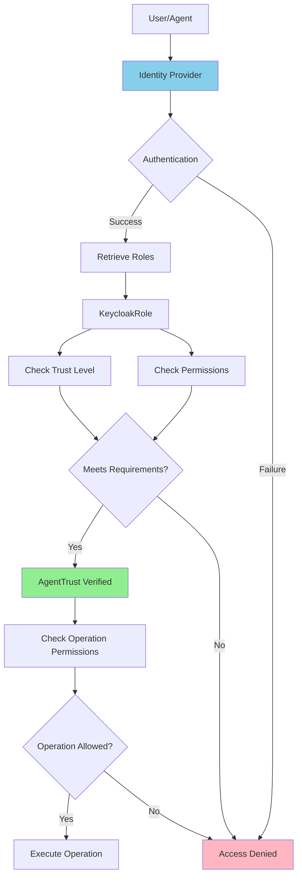
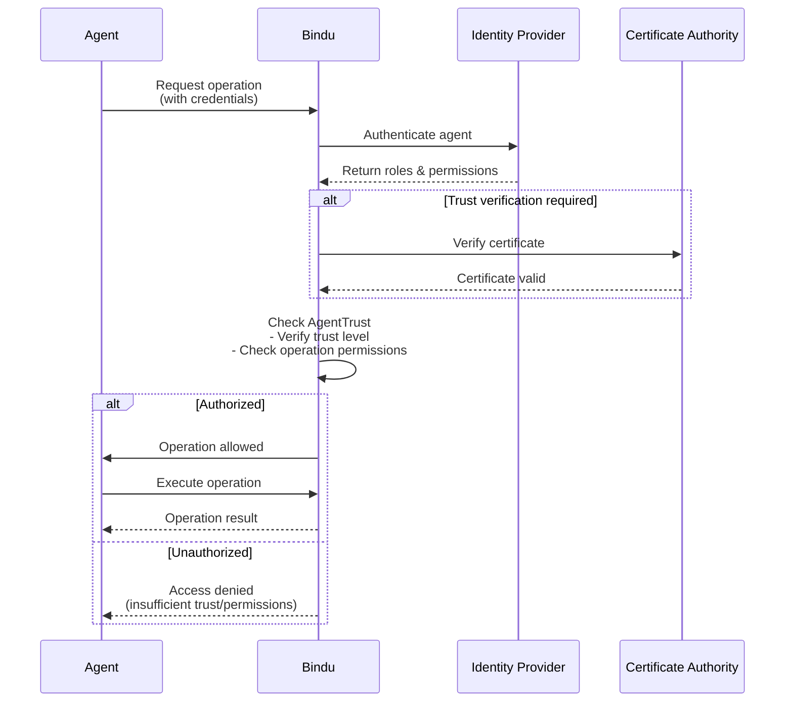

Trust and identity management ensures secure agent operations through role-based access control and identity verification. Bindu authenticates with [Ory Hydra](https://www.ory.sh/hydra/) (OAuth2/OIDC); enterprise IdPs (Keycloak, Azure AD, Okta, Auth0) federate into Hydra rather than appearing as direct provider values.

<Note>
  **Implementation status (2026-05).** The TypedDicts on this page (`KeycloakRole`, `AgentTrust`) ship in [`bindu/common/protocol/types.py`](https://github.com/getbindu/Bindu/blob/main/bindu/common/protocol/types.py) and are accepted by the trust extension. The authorization-layer enforcement (the `require_permissions` flag in `bindu/auth/`) is being rebuilt on Ory Kratos; until that lands, role-based enforcement on RPC methods may not be wired up end-to-end. The `KeycloakRole` name is historical — the shape stays whether the federated IdP is Keycloak or another OIDC provider.
</Note>

### KeycloakRole

**Schema:**
```python
@pydantic.with_config(ConfigDict(alias_generator=to_camel))
class KeycloakRole(TypedDict):
    """Keycloak role model.
    
    Defines roles with permissions and trust levels for access control.
    """
    
    role_id: Required[UUID]
    """The ID of the role."""
    
    role_name: Required[str]
    """The name of the role."""
    
    permissions: Required[List[str]]
    """The permissions of the role."""
    
    trust_level: Required[TrustLevel]
    """The trust level of the role."""
    
    realm_name: Required[str]
    """The realm name of the role."""
    
    external_mappings: NotRequired[Dict[str, str]]
    """The external mappings of the role."""
    
    operation_permissions: NotRequired[Dict[str, TrustLevel]]
    """The operation permissions of the role."""
```

**Use Case: Enterprise Admin Role**
```json
{
  "roleId": "550e8400-e29b-41d4-a716-446655440000",
  "roleName": "enterprise_admin",
  "permissions": [
    "agent.create",
    "agent.delete",
    "user.manage",
    "billing.view"
  ],
  "trustLevel": "admin",
  "realmName": "enterprise-production",
  "externalMappings": {
    "azure_ad": "Enterprise-Admins",
    "okta": "admin-group"
  },
  "operationPermissions": {
    "agent.execute": "operator",
    "data.export": "admin"
  }
}
```

**What it's for:** Defining roles with specific permissions and trust levels in Keycloak. Maps to external identity providers (Azure AD, Okta) for SSO integration. Operation permissions specify minimum trust levels required for specific actions.

---

### AgentTrust

**Schema:**
```python
@pydantic.with_config(ConfigDict(alias_generator=to_camel))
class AgentTrust(TypedDict):
    """Trust configuration for an agent.
    
    Establishes identity, permissions, and verification requirements for agent operations.
    """
    
    identity_provider: Required[IdentityProvider]
    """The identity provider of the agent."""
    
    inherited_roles: Required[List[KeycloakRole]]
    """The roles inherited by the agent."""
    
    certificate: NotRequired[str]
    """The certificate of the agent."""
    
    certificate_fingerprint: NotRequired[str]
    """The fingerprint of the certificate of the agent."""
    
    creator_id: Union[UUID, int, str]
    """The creator ID of the agent."""
    
    creation_timestamp: int
    """The creation timestamp of the agent."""
    
    trust_verification_required: bool
    """Whether trust verification is required for this agent."""
    
    allowed_operations: Dict[str, TrustLevel]
    """The allowed operations and their required trust levels."""
```

<Note>
  The `IdentityProvider` type alias only accepts `"hydra"` or `"custom"` today (see [types-and-enums](./types-and-enums)). Federation to Keycloak, Azure AD, Okta, or Auth0 is configured upstream of Hydra — at the trust layer the provider is still recorded as `"hydra"`.
</Note>

**Use Case: Trusted Data Processing Agent**
```json
{
  "identityProvider": "hydra",
  "inheritedRoles": [
    {
      "roleId": "660e8400-e29b-41d4-a716-446655440001",
      "roleName": "data_processor",
      "permissions": ["data.read", "data.process"],
      "trustLevel": "operator",
      "realmName": "enterprise-production"
    }
  ],
  "certificate": "-----BEGIN CERTIFICATE-----\nMIIC...",
  "certificateFingerprint": "SHA256:a1b2c3d4e5f6...",
  "creatorId": "did:example:creator789",
  "creationTimestamp": 1698796800,
  "trustVerificationRequired": true,
  "allowedOperations": {
    "data.read": "analyst",
    "data.process": "operator",
    "data.export": "admin"
  }
}
```

**What it's for:** Configuring trust and identity for agents. Inherits roles from identity providers, uses certificates for cryptographic verification, and defines operation-level permissions. Trust verification ensures the agent's identity is validated before execution.

### Trust Architecture



**Trust Verification Flow:**



**Summary:**

Trust and identity management combines role-based access control with enterprise identity providers. **KeycloakRole** defines permissions and trust levels with SSO mappings. **AgentTrust** configures agent identity verification using certificates and inherited roles. Each operation requires minimum trust levels, enabling fine-grained security for enterprise deployments, multi-tenant platforms, and high-security operations.

---

