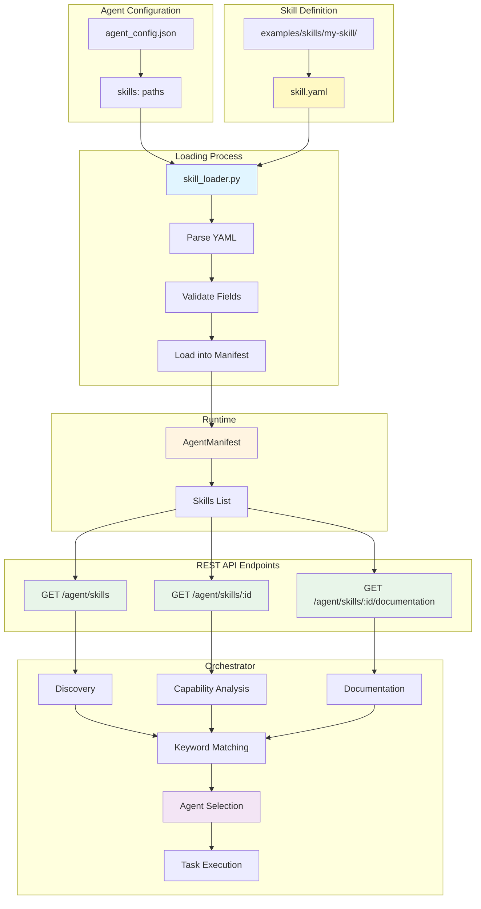

# Skills System

The Bindu Skills System provides rich agent capability advertisement for intelligent orchestration and agent discovery. Inspired by Claude's skills architecture, it enables agents to provide detailed documentation about their capabilities through YAML-based skill definitions, helping orchestrators make informed routing decisions.

## What are Skills?

Skills in Bindu serve as **rich advertisement metadata** that help orchestrators:

- 🔍 **Discover** the right agent for a task
- 📖 **Understand** detailed capabilities and limitations  
- ✅ **Validate** requirements before execution
- 📊 **Estimate** performance and resource needs
- 🔗 **Chain** multiple agents intelligently
- 🎯 **Match** tasks to optimal agents based on keywords and patterns

<Note>
  Skills are not executable code—they're structured YAML metadata that describe what your agent can do, how it performs, and when to use it.
</Note>

---

## Architecture



### How It Works

1. **Define skills** - Create `skill.yaml` files in dedicated directories
2. **Configure agent** - Reference skill paths in agent configuration
3. **Load at startup** - `skill_loader.py` parses YAML and validates structure
4. **Expose via API** - Three REST endpoints serve skill data
5. **Orchestrator queries** - Discovers agents via `/agent/skills`
6. **Keyword matching** - Uses `assessment` fields for intelligent routing
7. **Task execution** - Routes to optimal agent based on capabilities

---

## Why Skills Matter

### For Agent Developers

- **Clear documentation** - Define capabilities in one place
- **Standardized format** - YAML-based, human-readable
- **Easy maintenance** - Update skills without code changes
- **Better discovery** - Help users find your agent

### For Orchestrators

- **Intelligent routing** - Match tasks to the right agent
- **Capability validation** - Check requirements before execution
- **Performance estimation** - Predict resource needs
- **Multi-agent workflows** - Chain agents based on capabilities

### For Users

- **Transparency** - Understand what agents can do
- **Reliability** - Know limitations upfront
- **Better results** - Tasks routed to optimal agents

---

## Skill Definition Format

Bindu uses **YAML files** as the single source of truth for skill definitions.

### Benefits of YAML

- ✅ **Human-readable** - Easy to write and understand
- ✅ **Structured data** - Programmatic access for orchestrators
- ✅ **Rich documentation** - Everything in one place
- ✅ **LLM-friendly** - Easy for AI to parse and understand
- ✅ **No duplication** - Single source of truth

### Directory Structure

```
examples/skills/
├── question-answering/
│   └── skill.yaml
├── pdf-processing/
│   └── skill.yaml
├── zk-policy/
│   └── skill.yaml
├── cbt-drafter/
│   └── skill.yaml
├── cbt-clinical-critic/
│   └── skill.yaml
├── cbt-safety-guardian/
│   └── skill.yaml
└── cbt-supervisor-orchestrator/
    └── skill.yaml
```

**Key Points:**
- Each skill is a directory containing a `skill.yaml` file
- Skills are loaded from paths specified in agent configuration
- Both absolute and relative paths are supported
- Skills can be shared across multiple agents

---

## Basic Skill Example

Here's a minimal skill definition:

```yaml
# Basic Metadata
id: text-analysis-v1
name: text-analysis
version: 1.0.0
author: your@email.com

# Description
description: |
  Analyzes text for sentiment, entities, and key phrases.
  Supports multiple languages and formats.

# Tags
tags:
  - nlp
  - text-analysis
  - sentiment

# Input/Output Modes
input_modes:
  - text/plain
  - application/json

output_modes:
  - application/json

# Example Queries
examples:
  - "Analyze the sentiment of this review"
  - "Extract entities from this document"
  - "Identify key phrases in this text"

# Capabilities
capabilities_detail:
  sentiment_analysis:
    supported: true
    types:
      - positive
      - negative
      - neutral
    limitations: "Supports English only"

  entity_recognition:
    supported: true
    types:
      - person
      - organization
      - location

# Requirements
requirements:
  packages:
    - transformers>=4.0.0
    - torch>=2.0.0
  min_memory_mb: 512

# Performance
performance:
  avg_processing_time_ms: 2000
  max_file_size_mb: 10
  concurrent_requests: 5

# Assessment (for orchestration and routing)
assessment:
  keywords:
    - sentiment
    - analyze
    - text
    - emotion
  specializations:
    - domain: sentiment_analysis
      confidence_boost: 0.3
  anti_patterns:
    - "generate image"
    - "calculate"
    - "write code"
```

---

## Complete Skill Structure

A full skill definition includes:

### 1. Basic Metadata

```yaml
id: skill-id-v1              # Unique identifier (required)
name: skill-name              # Human-readable name (required)
version: 1.0.0                # Semantic version
author: your@email.com        # Skill author
description: |                # Description (required)
  What this skill does
```

### 2. Tags and Modes

```yaml
tags:                         # Searchable tags (required)
  - category
  - feature

input_modes:                  # Accepted input types (required)
  - text/plain
  - application/json
  - application/pdf

output_modes:                 # Output types (required)
  - application/json
  - text/plain
```

### 3. Examples

```yaml
examples:                     # Usage examples
  - "Analyze the sentiment of this review"
  - "Extract entities from this document"
```

### 4. Capabilities Detail

```yaml
capabilities_detail:
  feature_1:
    supported: true
    types:
      - type_a
      - type_b
    limitations: "Optional limitations"
    description: "What this capability does"

  feature_2:
    supported: false
    planned_version: "2.0.0"
```

### 5. Requirements

```yaml
requirements:
  packages:
    - package1>=1.0.0
    - package2>=2.0.0
  system:
    - system-dependency
  min_memory_mb: 512
```

### 6. Performance Metrics

```yaml
performance:
  avg_processing_time_ms: 2000
  avg_time_per_page_ms: 200      # For document processing
  max_file_size_mb: 50
  max_pages: 500                  # For PDF/document skills
  concurrent_requests: 5
  memory_per_request_mb: 500
  timeout_per_page_seconds: 30
  scalability: horizontal         # or vertical
```

### 7. Tool Restrictions

```yaml
allowed_tools:                 # Tools this skill can use
  - Read
  - Search
  - Reason
```

### 8. Documentation

```yaml
documentation:
  overview: |
    Comprehensive description of the skill

  use_cases:
    when_to_use:
      - Scenario 1
      - Scenario 2
    when_not_to_use:
      - Anti-pattern 1
      - Anti-pattern 2

  input_structure: |
    Expected input format with examples

  output_format: |
    Output format with examples

  quality_guidelines:
    - "Guideline 1"
    - "Guideline 2"

  error_handling:
    - "Error type 1: How it's handled"
    - "Error type 2: How it's handled"

  examples:
    - title: "Example 1"
      input: "input data"
      output:
        answer: "result"
        confidence: 0.95

  best_practices:
    for_developers:
      - "Best practice 1"
    for_orchestrators:
      - "Routing guideline 1"
```

### 9. Assessment (For Orchestration)

```yaml
assessment:
  keywords:                    # Keywords for matching tasks to skills
    - keyword1
    - keyword2
    - phrase
  
  specializations:             # Domains where this skill excels
    - domain: domain_name
      confidence_boost: 0.3    # Boost score for this domain
    - domain: another_domain
      confidence_boost: 0.2
  
  anti_patterns:               # Patterns indicating this skill is NOT suitable
    - "pattern to avoid"
    - "another anti-pattern"
  
  complexity_indicators:       # Classify task complexity
    simple:
      - "simple pattern"
      - "basic query"
    medium:
      - "medium pattern"
      - "explain"
    complex:
      - "complex pattern"
      - "comprehensive analysis"
```

**Assessment Fields Explanation:**
- **keywords**: Words/phrases in user input that suggest this skill is relevant
- **specializations**: Domains where skill confidence should be boosted
- **anti_patterns**: Phrases indicating this skill should NOT be used
- **complexity_indicators**: Help orchestrators estimate effort and select appropriate agents

---

## Creating a New Skill

<Steps>
  <Step title="Create Skill Directory">
    ```bash
    mkdir -p examples/skills/my-skill
    cd examples/skills/my-skill
    ```
  </Step>

  <Step title="Create skill.yaml">
    ```bash
    touch skill.yaml
    ```
  </Step>

  <Step title="Define Skill Metadata">
    Edit `skill.yaml` with minimum required fields:
    
    ```yaml
    # Required fields
    id: my-skill-v1
    name: my-skill
    description: |
      What your skill does and when to use it
    
    tags:
      - relevant
      - searchable
      - tags
    
    input_modes:
      - text/plain
    
    output_modes:
      - application/json
    ```
  </Step>

  <Step title="Add Capabilities and Performance">
    ```yaml
    capabilities_detail:
      main_feature:
        supported: true
        description: "What it does"
        types:
          - type1
          - type2
    
    requirements:
      packages: []
      min_memory_mb: 100
    
    performance:
      avg_processing_time_ms: 500
      concurrent_requests: 10
    ```
  </Step>

  <Step title="Add Documentation and Assessment">
    ```yaml
    documentation:
      overview: |
        Detailed description of what this skill does
      
      use_cases:
        when_to_use:
          - Use case 1
          - Use case 2
        when_not_to_use:
          - Anti-pattern 1
    
    assessment:
      keywords:
        - relevant
        - keywords
        - for
        - matching
      anti_patterns:
        - "not suitable for"
        - "avoid when"
    ```
  </Step>

  <Step title="Reference in Agent Config">
    Add to your agent configuration file (`agent_config.json` or Python config):
    
    ```json
    {
      "name": "my-agent",
      "skills": [
        "examples/skills/my-skill"
      ]
    }
    ```
    
    Or in Python:
    ```python
    config = {
        "name": "my-agent",
        "skills": ["examples/skills/my-skill"]
    }
    ```
  </Step>

  <Step title="Test Skill Loading">
    ```bash
    # Start your agent
    python your_agent.py
    
    # Test skill endpoints
    curl http://localhost:3773/agent/skills
    curl http://localhost:3773/agent/skills/my-skill-v1
    curl http://localhost:3773/agent/skills/my-skill-v1/documentation
    ```
    
    **Expected output:**
    - `/agent/skills` - Lists all skills with summary
    - `/agent/skills/my-skill-v1` - Full skill details (without documentation_content)
    - `/agent/skills/my-skill-v1/documentation` - Complete YAML content
  </Step>
</Steps>

---

## API Endpoints

Bindu exposes three REST endpoints for skill discovery and documentation:

### List All Skills

```bash
GET /agent/skills
```

**Description:** Returns a summary of all skills with basic metadata for discovery.

**Response:**
```json
{
  "skills": [
    {
      "id": "question-answering-v1",
      "name": "question-answering",
      "description": "Provides intelligent question answering...",
      "version": "1.0.0",
      "tags": ["qa", "knowledge", "reasoning"],
      "input_modes": ["text/plain", "application/json"],
      "output_modes": ["text/plain", "application/json"],
      "examples": [
        "What is photosynthesis?",
        "How does a refrigerator work?"
      ],
      "documentation_path": "/agent/skills/question-answering-v1"
    }
  ],
  "total": 1
}
```

**Use Case:** Orchestrators discovering available agents and their capabilities.

---

### Get Skill Details

```bash
GET /agent/skills/{skill_id}
```

**Description:** Returns full skill metadata including capabilities, requirements, and performance metrics. Excludes `documentation_content` to reduce payload size.

**Response:**
```json
{
  "id": "question-answering-v1",
  "name": "question-answering",
  "version": "1.0.0",
  "description": "Provides intelligent question answering...",
  "tags": ["qa", "knowledge"],
  "input_modes": ["text/plain", "application/json"],
  "output_modes": ["text/plain", "application/json"],
  "capabilities_detail": {
    "factual_questions": {
      "supported": true,
      "types": ["what", "who", "where", "when", "how", "why"],
      "description": "Answers direct factual questions across various domains"
    },
    "reasoning": {
      "supported": true,
      "types": ["causal", "comparative", "analytical"]
    }
  },
  "requirements": {
    "packages": [],
    "min_memory_mb": 100
  },
  "performance": {
    "avg_processing_time_ms": 750,
    "max_concurrent_requests": 10,
    "memory_per_request_mb": 100,
    "scalability": "horizontal"
  },
  "assessment": {
    "keywords": ["question", "answer", "what", "why", "how"],
    "specializations": [
      {"domain": "science_questions", "confidence_boost": 0.3}
    ],
    "anti_patterns": ["real-time data", "code generation"]
  },
  "has_documentation": true
}
```

**Use Case:** Detailed capability analysis before task routing.

---

### Get Skill Documentation

```bash
GET /agent/skills/{skill_id}/documentation
```

**Description:** Returns the complete `skill.yaml` content as YAML. This is the full source documentation that orchestrators can parse for detailed understanding.

**Response:** (Content-Type: `application/yaml`)
```yaml
id: question-answering-v1
name: question-answering
version: 1.0.0
author: raahul@getbindu.com

description: |
  Provides intelligent question answering capabilities...

tags:
  - qa
  - knowledge

# ... full skill.yaml content ...
```

**Use Case:** LLM-based orchestrators that need complete context for intelligent routing decisions.

---

## Orchestrator Integration

### Discovery Example

```python
import requests

# Discover all available agents
agents = [
    "http://agent1:3773",
    "http://agent2:3773",
    "http://agent3:3773"
]

skills_by_agent = {}

# Fetch skills from each agent
for agent_url in agents:
    response = requests.get(f"{agent_url}/agent/skills")
    skills_data = response.json()
    skills_by_agent[agent_url] = skills_data["skills"]

# Find agents with specific capabilities
qa_agents = []
for agent_url, skills in skills_by_agent.items():
    for skill in skills:
        if "qa" in skill["tags"] or "question" in skill.get("keywords", []):
            qa_agents.append((agent_url, skill))

print(f"Found {len(qa_agents)} agents with QA capabilities")
```

### Keyword-Based Task Matching

```python
def match_task_to_skill(user_input: str, skills: list) -> tuple:
    """Match user input to best skill using assessment keywords."""
    best_match = None
    best_score = 0
    
    user_input_lower = user_input.lower()
    
    for skill in skills:
        score = 0
        assessment = skill.get("assessment", {})
        
        # Check for anti-patterns first
        anti_patterns = assessment.get("anti_patterns", [])
        if any(pattern.lower() in user_input_lower for pattern in anti_patterns):
            continue  # Skip this skill
        
        # Match keywords
        keywords = assessment.get("keywords", [])
        keyword_matches = sum(
            1 for keyword in keywords 
            if keyword.lower() in user_input_lower
        )
        score += keyword_matches * 0.1
        
        # Apply specialization boosts
        specializations = assessment.get("specializations", [])
        for spec in specializations:
            domain = spec.get("domain", "").lower()
            if domain in user_input_lower:
                score += spec.get("confidence_boost", 0)
        
        if score > best_score:
            best_score = score
            best_match = skill
    
    return best_match, best_score

# Example usage
user_query = "What is photosynthesis?"
skill, confidence = match_task_to_skill(user_query, skills_list)
print(f"Best match: {skill['name']} (confidence: {confidence})")
```

### Capability Validation

```python
def validate_requirements(skill: dict, task_context: dict) -> bool:
    """Validate if agent meets task requirements."""
    requirements = skill.get("requirements", {})
    performance = skill.get("performance", {})
    
    # Check file size limit
    file_size_mb = task_context.get("file_size_mb", 0)
    max_size = performance.get("max_file_size_mb", float('inf'))
    if file_size_mb > max_size:
        return False
    
    # Check input mode compatibility
    input_type = task_context.get("input_type", "text/plain")
    if input_type not in skill.get("input_modes", []):
        return False
    
    # Check page count for document skills
    pages = task_context.get("pages", 0)
    max_pages = performance.get("max_pages", float('inf'))
    if pages > max_pages:
        return False
    
    return True

# Example
task = {
    "file_size_mb": 25,
    "input_type": "application/pdf",
    "pages": 100
}

if validate_requirements(pdf_skill, task):
    # Route to agent
    pass
```

### LLM-Based Orchestration

```python
# Provide full skill documentation to LLM for intelligent routing
def get_skills_context_for_llm(agent_url: str) -> str:
    """Build context for LLM with all skill documentation."""
    response = requests.get(f"{agent_url}/agent/skills")
    skills = response.json()["skills"]
    
    context = "Available agent skills:\n\n"
    
    for skill in skills:
        # Get full documentation
        doc_response = requests.get(
            f"{agent_url}/agent/skills/{skill['id']}/documentation"
        )
        skill_yaml = doc_response.text
        
        context += f"--- Skill: {skill['name']} ---\n"
        context += skill_yaml
        context += "\n\n"
    
    return context

# Use in LLM prompt
llm_prompt = f"""
You are an orchestrator routing tasks to specialized agents.

{get_skills_context_for_llm("http://agent:3773")}

User task: "{user_query}"

Which skill should handle this task and why?
"""
```

---

## Best Practices

### For Skill Authors

1. ✅ **Be specific** - Clearly define capabilities and limitations
2. ✅ **Include examples** - Show real usage scenarios
3. ✅ **Document errors** - Explain how errors are handled
4. ✅ **Update versions** - Increment version on changes
5. ✅ **Test thoroughly** - Validate YAML and endpoints

### For Agent Developers

1. ✅ **Keep skills updated** - Reflect actual capabilities
2. ✅ **Use semantic versioning** - Major.Minor.Patch
3. ✅ **Provide rich documentation** - Help orchestrators understand
4. ✅ **Include performance metrics** - Enable capacity planning
5. ✅ **Tag appropriately** - Improve discoverability

### For Orchestrators

1. ✅ **Cache skill data** - Reduce API calls
2. ✅ **Validate before routing** - Check requirements match
3. ✅ **Consider performance** - Route based on metrics
4. ✅ **Handle failures** - Have fallback strategies
5. ✅ **Monitor usage** - Track which skills are used

---

## Configuration

### File-Based Skills (Recommended)

Skills are loaded from filesystem paths specified in your agent configuration:

**JSON Configuration:**
```json
{
  "name": "my-agent",
  "description": "An intelligent agent",
  "skills": [
    "examples/skills/question-answering",
    "examples/skills/pdf-processing"
  ]
}
```

**Python Configuration:**
```python
from bindu.penguin.bindufy import bindufy

config = {
    "name": "my-agent",
    "description": "An intelligent agent",
    "skills": [
        "examples/skills/question-answering",
        "examples/skills/pdf-processing"
    ]
}

def handler(messages):
    return "Hello!"

bindufy(config, handler)
```

### Path Resolution

- **Relative paths**: Resolved from the directory containing your config file
- **Absolute paths**: Used as-is
- **Skill loading**: Happens at agent startup via `skill_loader.py`

```python
# From bindu.utils.skill_loader
from bindu.utils.skill_loader import load_skills
from pathlib import Path

# Load skills from configuration
config_dir = Path("/path/to/config").parent
skills = load_skills(
    skills_config=["examples/skills/my-skill"],
    caller_dir=config_dir
)
```

### How Skills are Loaded

1. **Parse configuration** - Extract skills list from agent config
2. **Resolve paths** - Convert relative paths to absolute paths
3. **Load YAML** - Read and parse each `skill.yaml` file
4. **Validate** - Check for required fields (id, name, description, tags, input_modes, output_modes)
5. **Store content** - Save YAML content as `documentation_content`
6. **Attach to manifest** - Add skills to AgentManifest
7. **Expose via API** - Make available through REST endpoints

### Inline Skills (Not Recommended)

For backward compatibility, you can define minimal skills inline:

```json
{
  "name": "my-agent",
  "capabilities": {
    "legacy-skill": {
      "description": "Old format skill",
      "tags": ["legacy"]
    }
  }
}
```

**Note:** Inline skills lack rich documentation and assessment fields. Use file-based skills for production.

---

## Troubleshooting

<AccordionGroup>
  <Accordion title="Skill Not Loading">
    **Check:**
    - Path is correct in config
    - `skill.yaml` exists in directory
    - YAML syntax is valid
    - Agent has read permissions
  </Accordion>

  <Accordion title="Invalid YAML">
    **Solution:**
    - Validate YAML syntax online
    - Check indentation (use spaces, not tabs)
    - Ensure all required fields are present
    - Use quotes for special characters
  </Accordion>

  <Accordion title="Missing Documentation">
    **Cause:** Documentation section not defined
    
    **Solution:** Add `documentation` section to skill.yaml
  </Accordion>

  <Accordion title="Fields Not Showing">
    **Cause:** Fields not exposed in API
    
    **Solution:** Check API endpoint returns expected fields
  </Accordion>
</AccordionGroup>

---

## Real-World Examples

### Question Answering Skill

From `examples/skills/question-answering/skill.yaml`:

```yaml
id: question-answering-v1
name: question-answering
version: 1.0.0
author: raahul@getbindu.com

description: |
  Provides intelligent question answering capabilities for general knowledge queries.
  Use when users ask factual questions, need explanations, or require information retrieval.

tags:
  - qa
  - knowledge
  - reasoning
  - general

input_modes:
  - text/plain
  - application/json

output_modes:
  - text/plain
  - application/json

examples:
  - "What is photosynthesis?"
  - "How does a refrigerator work?"
  - "Why do we see different phases of the moon?"

capabilities_detail:
  factual_questions:
    supported: true
    types: [what, who, where, when, how, why]
    description: "Answers direct factual questions across various domains"
  
  reasoning:
    supported: true
    types: [causal, comparative, analytical]

performance:
  avg_processing_time_ms: 750
  max_concurrent_requests: 10
  scalability: horizontal

assessment:
  keywords:
    - question
    - answer
    - what
    - why
    - how
    - explain
  specializations:
    - domain: science_questions
      confidence_boost: 0.3
  anti_patterns:
    - "real-time data"
    - "code generation"
    - "calculate"
```

**Use Case:** General purpose QA agent for factual questions across multiple domains.

---

### PDF Processing Skill

From `examples/skills/pdf-processing/skill.yaml`:

```yaml
id: pdf-processing-v1
name: pdf-processing
version: 1.0.0
author: raahul@getbindu.com

description: |
  Extract text, fill forms, and extract tables from PDF documents.
  Handles both standard text-based PDFs and scanned documents with OCR.

tags:
  - pdf
  - documents
  - extraction
  - forms
  - tables

input_modes:
  - application/pdf

output_modes:
  - text/plain
  - application/json
  - application/pdf

capabilities_detail:
  text_extraction:
    supported: true
    types: [standard, scanned_with_ocr]
    languages: [eng, spa, fra, deu]
    preserves_formatting: true
  
  form_filling:
    supported: true
    field_types: [text, checkbox, dropdown, radio]
    validation: true
  
  table_extraction:
    supported: true
    output_formats: [json, csv, dataframe]

requirements:
  packages:
    - pypdf>=3.0.0
    - pdfplumber>=0.9.0
    - pytesseract>=0.3.10
  system:
    - tesseract-ocr
  min_memory_mb: 512

performance:
  avg_processing_time_ms: 2000
  avg_time_per_page_ms: 200
  max_file_size_mb: 50
  max_pages: 500
  concurrent_requests: 5
  memory_per_request_mb: 500

allowed_tools:
  - Read
  - Extract
  - Parse
```

**Use Case:** Document processing agent for PDF extraction and form filling.

---

### CBT Supervisor Orchestrator

From `examples/skills/cbt-supervisor-orchestrator/skill.yaml`:

```yaml
id: cbt-supervisor-orchestrator-v1
name: cbt-supervisor-orchestrator
version: 1.0.0

description: |
  Orchestrates multi-agent CBT therapy workflows by coordinating
  drafter, critic, and safety guardian agents.

tags:
  - orchestration
  - cbt
  - therapy
  - multi-agent

capabilities_detail:
  workflow_orchestration:
    supported: true
    coordinates:
      - cbt-drafter
      - cbt-clinical-critic
      - cbt-safety-guardian
    max_iterations: 3
  
  quality_assurance:
    supported: true
    checks:
      - clinical_accuracy
      - ethical_guidelines
      - safety_protocols

performance:
  avg_processing_time_ms: 15000
  max_concurrent_requests: 3
  scalability: vertical
```

**Use Case:** Multi-agent orchestrator for therapy workflow coordination.

---

## Next Steps

<CardGroup cols={2}>
  <Card title="View Example Skills" icon="github" href="https://github.com/getbindu/Bindu/tree/main/examples/skills">
    Browse real-world skill definitions from the Bindu repository
  </Card>
  <Card title="Agent Configuration" icon="gear" href="/bindu/create-bindu-agent/configuration">
    Learn how to configure agents with skills
  </Card>
  <Card title="DID System" icon="fingerprint" href="/bindu/learn/did/overview">
    Understand agent identity and multi-tenancy
  </Card>
  <Card title="API Reference" icon="code" href="/api/reference">
    Explore the complete Bindu API documentation
  </Card>
</CardGroup>

---

## Additional Resources

- **[Bindu GitHub Repository](https://github.com/getbindu/Bindu)** - Complete source code and examples
- **[Example Skills Directory](https://github.com/getbindu/Bindu/tree/main/examples/skills)** - Real skill definitions
  - question-answering
  - pdf-processing
  - zk-policy
  - cbt-drafter
  - cbt-clinical-critic
  - cbt-safety-guardian
  - cbt-supervisor-orchestrator
- **[YAML Validator](https://www.yamllint.com/)** - Validate your YAML syntax
- **[Skill Loader Source](https://github.com/getbindu/Bindu/blob/main/bindu/utils/skill_loader.py)** - Implementation details
- **[Skills Endpoints Source](https://github.com/getbindu/Bindu/blob/main/bindu/server/endpoints/skills.py)** - API implementation
