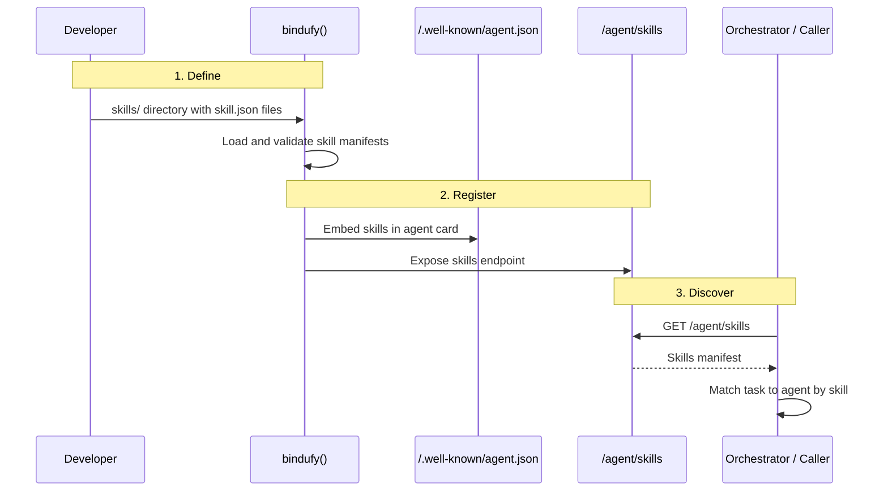
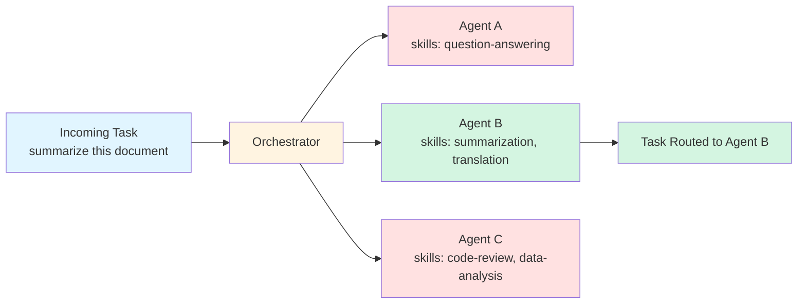

An agent without declared capabilities is a black box. Other agents, orchestrators, and clients have no way to know what it can do, whether it is the right agent for a task, or how to interact with it correctly.

Skills solve that. They are the formal declaration of what your agent knows how to do — structured, discoverable, and published as part of the agent card.

## Why Skills Matter

In a multi-agent network, capability discovery is how work gets routed to the right agent. Without a standard way to declare skills, every integration becomes a custom handshake.

| Without skills | With Bindu skills |
| --- | --- |
| Capabilities are implicit or undocumented | Skills are declared in a structured manifest |
| Orchestrators cannot discover what an agent does | Skills are published at `/agent/skills` |
| Task routing requires manual configuration | Agents can be matched to tasks by capability |
| No standard input/output contract | Each skill defines its expected I/O |
| Fine for single-agent scripts | Required for multi-agent systems |

That is the shift: skills turn an agent from a private script into a discoverable, composable node in the Internet of Agents.

<Note>
  Skills are defined in a `skills/` directory inside your project. Bindu reads them
  automatically during `bindufy` and exposes them via the agent card and the
  `/agent/skills` endpoint.
</Note>

## How Bindu Skills Work

A skill is a directory inside `skills/` that contains a `skill.json` manifest. The manifest describes the skill's identity, input schema, output schema, and any configuration it needs.

### The Skills Model

A minimal skill looks like this:

```
skills/
└── question-answering/
    └── skill.json
```

```json
{
  "id": "question-answering",
  "name": "Question Answering",
  "description": "Answers questions using web search and reasoning",
  "tags": ["research", "search", "qa"],
  "examples": [
    "What is the capital of France?",
    "Summarize the latest news on AI regulation"
  ],
  "inputModes": ["text/plain"],
  "outputModes": ["text/plain"]
}
```

<CardGroup cols={3}>
  <Card title="Declarative" icon="file-lines">
    Skills are defined in JSON. No code required to declare what your agent can do.
  </Card>
  <Card title="Discoverable" icon="globe">
    Published at `/agent/skills` so orchestrators and other agents can find them.
  </Card>
  <Card title="Composable" icon="puzzle-piece">
    Multiple skills per agent. Each skill is independently addressable.
  </Card>
</CardGroup>

### The Lifecycle: Define, Register, Discover


```mermaid
sequenceDiagram
    participant Dev as Developer
    participant Bindu as bindufy()
    participant AgentCard as /.well-known/agent.json
    participant SkillsEndpoint as /agent/skills
    participant Orchestrator as Orchestrator / Caller

    Note over Dev,Bindu: 1. Define
    Dev->>Bindu: skills/ directory with skill.json files
    Bindu->>Bindu: Load and validate skill manifests

    Note over Bindu,SkillsEndpoint: 2. Register
    Bindu->>AgentCard: Embed skills in agent card
    Bindu->>SkillsEndpoint: Expose skills endpoint

    Note over SkillsEndpoint,Orchestrator: 3. Discover
    Orchestrator->>SkillsEndpoint: GET /agent/skills
    SkillsEndpoint-->>Orchestrator: Skills manifest
    Orchestrator->>Orchestrator: Match task to agent by skill
```

<Steps>
  <Step title="Define">
    Create a `skills/` directory in your project root. Each subdirectory is a skill,
    identified by its folder name.

    ```
    your-agent/
    ├── main.py
    ├── agent_config.json
    └── skills/
        ├── question-answering/
        │   └── skill.json
        └── summarization/
            └── skill.json
    ```

    Each `skill.json` declares the skill&apos;s identity and I/O contract.
  </Step>

  <Step title="Register">
    Reference the skills directory in your agent config:

    ```json
    {
      "author": "your.email@example.com",
      "name": "research_agent",
      "description": "A research assistant agent",
      "version": "1.0.0",
      "skills": ["skills/question-answering", "skills/summarization"],
      "deployment": {
        "url": "http://localhost:3773",
        "expose": true
      }
    }
    ```

    Bindu reads the manifests during `bindufy` and registers them automatically.
    No additional code is needed.
  </Step>

  <Step title="Discover">
    Once the agent is running, skills are available at two endpoints:

    ```bash
    # Full agent card including skills
    curl http://localhost:3773/.well-known/agent.json

    # Skills only
    curl http://localhost:3773/agent/skills
    ```

    ```json
    [
      {
        "id": "question-answering",
        "name": "Question Answering",
        "description": "Answers questions using web search and reasoning",
        "tags": ["research", "search", "qa"],
        "inputModes": ["text/plain"],
        "outputModes": ["text/plain"]
      }
    ]
    ```
  </Step>
</Steps>

---

## The Skill Manifest

The `skill.json` file is the complete definition of a skill. All fields except `id` and `name` are optional, but the more you declare, the more useful the skill is for discovery and routing.

```json
{
  "id": "question-answering",
  "name": "Question Answering",
  "description": "Answers questions using web search and reasoning",
  "tags": ["research", "search", "qa"],
  "examples": [
    "What is the capital of France?",
    "Who won the 2024 Nobel Prize in Physics?",
    "Summarize the latest news on AI regulation"
  ],
  "inputModes": ["text/plain"],
  "outputModes": ["text/plain", "application/json"]
}
```

### Fields

| Field | Required | Description |
| --- | --- | --- |
| `id` | Yes | Unique identifier for the skill, matches the directory name |
| `name` | Yes | Human-readable name shown in the agent card |
| `description` | No | What the skill does — used for capability matching |
| `tags` | No | Keywords for discovery and routing |
| `examples` | No | Sample inputs that demonstrate the skill |
| `inputModes` | No | MIME types the skill accepts (default: `text/plain`) |
| `outputModes` | No | MIME types the skill produces (default: `text/plain`) |

---

## Multiple Skills

An agent can declare as many skills as it has capabilities. Each skill is independently addressable and can have its own I/O contract.

```
skills/
├── question-answering/
│   └── skill.json
├── summarization/
│   └── skill.json
├── data-analysis/
│   └── skill.json
└── code-review/
    └── skill.json
```

```json
{
  "skills": [
    "skills/question-answering",
    "skills/summarization",
    "skills/data-analysis",
    "skills/code-review"
  ]
}
```

All declared skills appear in the agent card and the `/agent/skills` response. Orchestrators can inspect the full list and route tasks to the most appropriate skill.

---

## Skills and Task Routing

In a multi-agent system, an orchestrator fetches the skills of available agents and matches incoming tasks to the right agent based on skill tags, descriptions, and examples.


```mermaid
graph LR
    Task[Incoming Task<br/>summarize this document] --> Orchestrator
    Orchestrator --> AgentA[Agent A<br/>skills: question-answering]
    Orchestrator --> AgentB[Agent B<br/>skills: summarization, translation]
    Orchestrator --> AgentC[Agent C<br/>skills: code-review, data-analysis]
    AgentB --> Result[Task Routed to Agent B]

    style Task fill:#e1f5ff
    style Orchestrator fill:#fff4e1
    style AgentA fill:#ffe1e1
    style AgentB fill:#d4f5e1
    style AgentC fill:#ffe1e1
    style Result fill:#d4f5e1
```

The orchestrator does not need to know the agent&apos;s internals. The skill manifest is the contract.

---

## Real-World Use Cases

<AccordionGroup>
  <Accordion title="Research agent with multiple skills">
    A research agent might declare `question-answering`, `summarization`, and
    `web-search` as separate skills. An orchestrator can route a summarization task
    directly to the right skill without guessing.

    ```json
    {
      "skills": [
        "skills/question-answering",
        "skills/summarization",
        "skills/web-search"
      ]
    }
    ```
  </Accordion>

  <Accordion title="Specialized single-skill agent">
    A focused agent that only does one thing well. Declaring a single skill makes its
    purpose unambiguous and easy to route to.

    ```json
    {
      "id": "code-review",
      "name": "Code Review",
      "description": "Reviews Python code for bugs, style, and security issues",
      "tags": ["code", "python", "review", "security"],
      "inputModes": ["text/plain", "text/x-python"],
      "outputModes": ["text/plain", "application/json"]
    }
    ```
  </Accordion>

  <Accordion title="Agent swarm with skill-based routing">
    In a swarm, each agent declares its skills. The orchestrator builds a capability
    map at startup by fetching `/agent/skills` from every agent, then routes tasks
    dynamically based on what each agent can do.
  </Accordion>
</AccordionGroup>

---

## Project Structure

The `create-bindu-agent` template scaffolds the skills directory for you:

```
your-agent/
├── main.py                    # Agent entry point
├── agent_config.json          # Config referencing skills
└── skills/
    └── question-answering/
        └── skill.json         # Starter skill manifest
```

You can add more skills by creating new subdirectories under `skills/` and adding a `skill.json` to each one.

---

## Related

- [Create Bindu Agent](/bindu/create-bindu-agent/overview)
- [Architecture](/bindu/concepts/task-first-and-architecture)
- [A2A Protocol](https://google.github.io/A2A/)

<span className="brand-quote">
  

  <span className="brand-quote-text">
    Skills are how agents introduce themselves to the network -{" "}
    <span className="brand-quote-highlight">not by what they are, but by what they can do</span>.
  </span>
</span>
