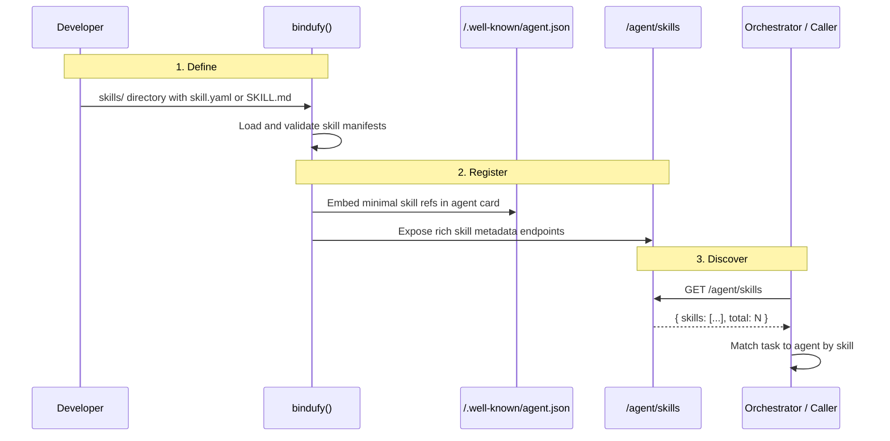
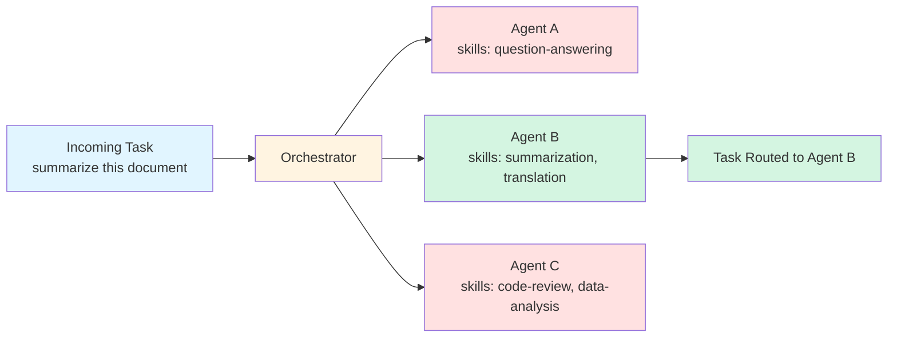

An agent without declared capabilities is a black box. Other agents, orchestrators, and clients have no way to know what it can do, whether it is the right agent for a task, or how to interact with it correctly.

Skills solve that. They are the formal declaration of what your agent knows how to do — structured, discoverable, and published through the agent card and a set of dedicated discovery endpoints.

## Why Skills Matter

In a multi-agent network, capability discovery is how work gets routed to the right agent. Without a standard way to declare skills, every integration becomes a custom handshake.

| Without skills | With Bindu skills |
| --- | --- |
| Capabilities are implicit or undocumented | Skills are declared in a structured manifest |
| Orchestrators cannot discover what an agent does | Skills are published at `/agent/skills` |
| Task routing requires manual configuration | Agents can be matched to tasks by capability |
| No standard input/output contract | Each skill declares its `input_modes` and `output_modes` |
| Fine for single-agent scripts | Required for multi-agent systems |

That is the shift: skills turn an agent from a private script into a discoverable, composable node in the Internet of Agents.

<Note>
  Skills are defined as folders inside your project (conventionally under
  `skills/`). Bindu reads them automatically during `bindufy()` and exposes them
  on the agent card and a family of `/agent/skills` endpoints.
</Note>

## How Bindu Skills Work

A skill is a directory that contains either a `skill.yaml` manifest, a `SKILL.md` markdown file with YAML frontmatter, or both. The loader in `bindu/utils/skills/loader.py` reads whichever it finds.

### The Skills Model

A minimal skill — using the canonical `skill.yaml` format — looks like this:

```
skills/
└── research/
    └── skill.yaml
```

```yaml
id: research-v1
name: research
version: 1.0.0
author: you@example.com
description: |
  Multilingual web research skill that searches the internet and
  summarizes findings in the user's language.
tags:
  - research
  - web-search
input_modes:
  - text/plain
  - application/json
output_modes:
  - text/plain
  - application/json
examples:
  - "What is the Bindu framework?"
  - "Latest news about AI agents"
```

<CardGroup cols={3}>
  <Card title="Declarative" icon="file-lines">
    Skills are defined in YAML (or Markdown with YAML frontmatter). No code is
    required to declare what your agent can do.
  </Card>
  <Card title="Discoverable" icon="globe">
    Published at `/agent/skills`, `/agent/skills/{id}`, and `/agent/skills/{id}/documentation`
    so orchestrators and other agents can find them.
  </Card>
  <Card title="Composable" icon="puzzle-piece">
    Multiple skills per agent. Each skill is independently addressable by `id`.
  </Card>
</CardGroup>

### Two manifest formats: `skill.yaml` and `SKILL.md`

Bindu supports two on-disk formats. Pick whichever fits your workflow:

| File | When to use it |
| --- | --- |
| `skill.yaml` | Pure metadata. Easy to diff, easy to generate from a template. The shape used by every Python example in the repo. |
| `SKILL.md` | YAML frontmatter + a rich Markdown body. Lets you ship operator-readable documentation alongside the manifest. Used by the TypeScript SDK examples. |
| Both in the same folder | Allowed. `skill.yaml` provides the metadata; the Markdown body of `SKILL.md` is attached as `markdown_content` for richer documentation. |

A `SKILL.md` file looks like this:

```markdown
---
id: question-answering-v1
name: question-answering
version: 1.0.0
author: dev@example.com
tags:
  - question-answering
  - conversation
input_modes:
  - text/plain
  - application/json
output_modes:
  - text/plain
  - application/json
---

# Question Answering Skill

General-purpose question answering. Handles conversational queries,
explanations, code generation, analysis, and creative writing.

## Capabilities

### Conversational Q&A
- Direct question answering with contextual understanding
- Multi-turn conversation with history awareness
```

If neither `skill.yaml` nor `SKILL.md` exists in the folder, the loader raises `FileNotFoundError` with a message naming both filenames.

### The Lifecycle: Define, Register, Discover


```mermaid
sequenceDiagram
    participant Dev as Developer
    participant Bindu as bindufy()
    participant AgentCard as /.well-known/agent.json
    participant SkillsEndpoint as /agent/skills
    participant Orchestrator as Orchestrator / Caller

    Note over Dev,Bindu: 1. Define
    Dev->>Bindu: skills/ directory with skill.yaml or SKILL.md
    Bindu->>Bindu: Load and validate skill manifests

    Note over Bindu,SkillsEndpoint: 2. Register
    Bindu->>AgentCard: Embed minimal skill refs in agent card
    Bindu->>SkillsEndpoint: Expose rich skill metadata endpoints

    Note over SkillsEndpoint,Orchestrator: 3. Discover
    Orchestrator->>SkillsEndpoint: GET /agent/skills
    SkillsEndpoint-->>Orchestrator: { skills: [...], total: N }
    Orchestrator->>Orchestrator: Match task to agent by skill
```

<Steps>
  <Step title="Define">
    Create a folder for each skill. The folder name is what most projects use
    as the directory path in the config; the `id` field inside the manifest is
    the actual identifier exposed on the wire.

    ```
    your-agent/
    ├── main.py
    ├── agent_config.json
    └── skills/
        ├── research/
        │   └── skill.yaml
        └── translate/
            └── skill.yaml
    ```

    Each `skill.yaml` (or `SKILL.md`) declares the skill's identity, tags,
    `input_modes`, `output_modes`, and examples.
  </Step>

  <Step title="Register">
    Reference the skill directories in your agent config:

    ```json
    {
      "author": "you@example.com",
      "name": "research_agent",
      "description": "A research assistant agent",
      "version": "1.0.0",
      "skills": [
        "skills/research",
        "skills/translate"
      ],
      "deployment": {
        "url": "http://localhost:3773",
        "expose": true
      }
    }
    ```

    Bindu reads the manifests during `bindufy()` and registers them
    automatically. No additional code is needed.
  </Step>

  <Step title="Discover">
    Once the agent is running, skills are available through several endpoints:

    ```bash
    # Agent card — minimal skill refs (id, name, documentation_path)
    curl http://localhost:3773/.well-known/agent.json

    # Skills list — rich metadata for all skills
    curl http://localhost:3773/agent/skills

    # Single skill — full metadata for one skill
    curl http://localhost:3773/agent/skills/research-v1

    # Raw documentation (the original skill.yaml / SKILL.md body)
    curl http://localhost:3773/agent/skills/research-v1/documentation
    ```

    The `/agent/skills` response is wrapped, not a bare array:

    ```json
    {
      "skills": [
        {
          "id": "research-v1",
          "name": "research",
          "description": "Multilingual web research skill...",
          "version": "1.0.0",
          "tags": ["research", "web-search"],
          "input_modes": ["text/plain", "application/json"],
          "output_modes": ["text/plain", "application/json"],
          "examples": ["What is the Bindu framework?"]
        }
      ],
      "total": 1
    }
    ```

    The agent card itself only carries a minimal reference per skill, to keep
    the card payload small:

    ```json
    {
      "skills": [
        {
          "id": "research-v1",
          "name": "research",
          "documentation_path": "http://localhost:3773/agent/skills/research-v1"
        }
      ]
    }
    ```
  </Step>
</Steps>

---

## The Skill Manifest

The `skill.yaml` (or `SKILL.md` frontmatter) is the complete definition of a skill. Only `id` and `name` are strictly required; the more you declare, the more useful the skill is for discovery and routing.

```yaml
id: question-answering-v1
name: question-answering
version: 1.0.0
author: you@example.com
description: |
  Answers questions using web search and reasoning.
tags:
  - research
  - search
  - qa
input_modes:
  - text/plain
output_modes:
  - text/plain
  - application/json
examples:
  - "What is the capital of France?"
  - "Who won the 2024 Nobel Prize in Physics?"
  - "Summarize the latest news on AI regulation"
```

### Fields

| Field | Required | Description |
| --- | --- | --- |
| `id` | Yes | Unique identifier for the skill. Conventionally suffixed with a version, e.g. `research-v1`. |
| `name` | Yes | Human-readable name shown in the agent card. |
| `description` | No | What the skill does — used for capability matching. |
| `version` | No | Skill version string. Defaults to `"unknown"` if omitted. |
| `author` | No | Author email or identifier. |
| `tags` | No | Keywords for discovery and routing. |
| `examples` | No | Sample inputs that demonstrate the skill. |
| `input_modes` | No | MIME types the skill accepts (default: `["text/plain"]`). |
| `output_modes` | No | MIME types the skill produces (default: `["text/plain"]`). |

<Note>
  The wire format uses snake_case: `input_modes` and `output_modes`. The same
  fields appear under those exact keys in `/agent/skills` responses, so
  orchestrators see the manifest as you wrote it.
</Note>

Skills carrying a `SKILL.md` body also expose two extra fields on the wire:

- `documentation_content` — the raw file contents (returned in full from `/agent/skills/{id}/documentation`).
- `markdown_content` — the Markdown body below the frontmatter (returned in skill detail responses for clients that want rich text).

The list endpoint strips `documentation_content` to keep payloads small and surfaces a boolean `has_documentation` flag in single-skill detail responses instead. Use `/agent/skills/{id}/documentation` to fetch the full document.

---

## Multiple Skills

An agent can declare as many skills as it has capabilities. Each skill is independently addressable and can have its own I/O contract.

```
skills/
├── research/
│   └── skill.yaml
├── translate/
│   └── skill.yaml
├── collaborate/
│   └── skill.yaml
└── code-review/
    └── skill.yaml
```

```json
{
  "skills": [
    "skills/research",
    "skills/translate",
    "skills/collaborate",
    "skills/code-review"
  ]
}
```

All declared skills appear in the agent card (as minimal refs) and in the full `/agent/skills` response. Orchestrators can inspect the full list and route tasks to the most appropriate skill.

### Inline skills

You can also declare a skill inline in the config without a folder on disk. This is useful for one-off skills or for SDKs that don't ship a `skills/` directory:

```json
{
  "skills": [
    "skills/research",
    {
      "name": "ping",
      "description": "Health check — replies with 'pong'",
      "tags": ["health"]
    }
  ]
}
```

The loader accepts a mixed list: strings resolve to folder paths, dictionaries become inline skills. Inline skills must contain at minimum a `name`.

---

## Skills and Task Routing

In a multi-agent system, an orchestrator fetches the skills of available agents and matches incoming tasks to the right agent based on skill tags, descriptions, and examples.


```mermaid
graph LR
    Task[Incoming Task<br/>summarize this document] --> Orchestrator
    Orchestrator --> AgentA[Agent A<br/>skills: question-answering]
    Orchestrator --> AgentB[Agent B<br/>skills: summarization, translation]
    Orchestrator --> AgentC[Agent C<br/>skills: code-review, data-analysis]
    AgentB --> Result[Task Routed to Agent B]

    style Task fill:#e1f5ff
    style Orchestrator fill:#fff4e1
    style AgentA fill:#ffe1e1
    style AgentB fill:#d4f5e1
    style AgentC fill:#ffe1e1
    style Result fill:#d4f5e1
```

The orchestrator does not need to know the agent's internals. The skill manifest is the contract.

---

## Real-World Use Cases

<AccordionGroup>
  <Accordion title="Research agent with multiple skills">
    The `multilingual-collab-agent` example in `examples/multilingual-collab-agent`
    declares three skills as separate folders: `research`, `translate`, and
    `collaborate`. An orchestrator can route a translation task directly to
    the right skill without guessing.

    ```json
    {
      "skills": [
        "skills/research",
        "skills/translate",
        "skills/collaborate"
      ]
    }
    ```
  </Accordion>

  <Accordion title="Specialized single-skill agent">
    A focused agent that only does one thing well. Declaring a single skill
    makes its purpose unambiguous and easy to route to.

    ```yaml
    id: code-review-v1
    name: code-review
    description: Reviews Python code for bugs, style, and security issues
    tags:
      - code
      - python
      - review
      - security
    input_modes:
      - text/plain
      - text/x-python
    output_modes:
      - text/plain
      - application/json
    ```
  </Accordion>

  <Accordion title="Agent swarm with skill-based routing">
    In a swarm, each agent declares its skills. The orchestrator builds a
    capability map at startup by fetching `/agent/skills` from every agent,
    then routes tasks dynamically based on what each agent can do.
  </Accordion>

  <Accordion title="Private skills behind an auth gate">
    If your skill descriptions are themselves part of the product, declare
    them under `private_skills` in the config and supply an `allowed_dids`
    allowlist. The public catalog stays generic; partners on the allowlist
    get the full menu at `/agent/private.json`. See the
    [Private skills](/bindu/skills/private_skills/private_skills) page and
    the runnable example at `examples/private_skills_agent/`.
  </Accordion>
</AccordionGroup>

---

## Project Structure

Two real examples in this repo show the layout in practice:

```
examples/multilingual-collab-agent/
├── main.py
├── agent_config.json
└── skills/
    ├── research/
    │   └── skill.yaml
    ├── translate/
    │   └── skill.yaml
    └── collaborate/
        └── skill.yaml
```

```
examples/typescript-openai-agent/
└── skills/
    └── question-answering/
        └── SKILL.md         # YAML frontmatter + Markdown body
```

Add more skills by creating new folders under `skills/` and adding a `skill.yaml` (or `SKILL.md`) to each one, then listing the folder path in the `skills` array of your agent config.

---

## Where to look in the code

- Loader: [`bindu/utils/skills/loader.py`](../../../../bindu/utils/skills/loader.py) — handles both `skill.yaml` and `SKILL.md`, plus inline dict skills.
- List endpoint: [`bindu/server/endpoints/skills.py`](../../../../bindu/server/endpoints/skills.py) — implements `/agent/skills`, `/agent/skills/{id}`, and `/agent/skills/{id}/documentation`.
- Agent card endpoint: [`bindu/server/endpoints/agent_card.py`](../../../../bindu/server/endpoints/agent_card.py) — minimizes each skill to `{id, name, documentation_path}` before serializing.
- Route registration: [`bindu/server/applications.py`](../../../../bindu/server/applications.py) — wires `/.well-known/agent.json`, `/agent/skills`, and `/agent/private.json`.

---

## Related

- [Private skills](/bindu/skills/private_skills/private_skills) — serve a public catalog to everyone and a fuller catalog to allowlisted DIDs only.
- [Architecture](/bindu/concepts/task-first-and-architecture)
- [A2A Protocol](https://google.github.io/A2A/)

<span className="brand-quote">
  

  <span className="brand-quote-text">
    Skills are how agents introduce themselves to the network -{" "}
    <span className="brand-quote-highlight">not by what they are, but by what they can do</span>.
  </span>
</span>
