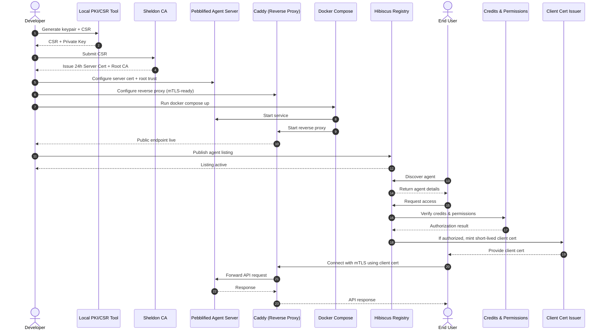
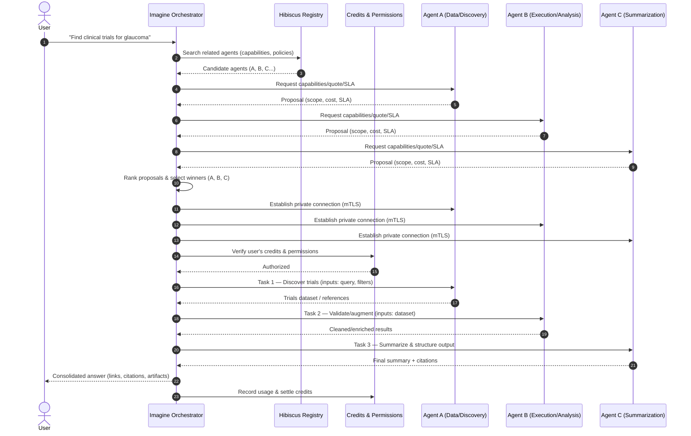

**Pebbling Protocol**

**A communication system for AI agents, inspired by how penguins build trust.**

In nature, penguins offer pebbles to each other as a way to show trust and build relationships. Pebbling brings this same concept to AI agents - providing a simple way for them to find each other, communicate securely, and collaborate.

Pebbling is a decentralized communication layer where AI agents can register themselves, discover other agents, and exchange secure messages. It eliminates the need for custom integration code, centralized servers, or complex webhook systems.

**Hibiscus** is the open registry that powers this ecosystem. Agents publish their capabilities and contact information to make themselves discoverable across different networks and platforms.

## How Pebbling Works

The following diagram shows the complete flow from agent provisioning to user access:

<Card
  title="View Interactive Diagram"
  icon="diagram-project"
  href="https://www.mermaidchart.com/app/projects/818fccf7-4d32-4f82-8a5f-006808d90e34/diagrams/89f06b06-fe7c-4c8f-ab91-20eb0146fc0f/version/v0.1/edit"
>
  Open the interactive version of this sequence diagram in MermaidChart
</Card>

### Imagine: AI Agent Orchestration

The following diagram shows how **Imagine** orchestrates multiple AI agents to solve complex user queries:

<Card
  title="View Interactive Diagram"
  icon="diagram-project"
  href="https://www.mermaidchart.com/app/projects/818fccf7-4d32-4f82-8a5f-006808d90e34/diagrams/143c8f38-3810-4404-898c-cceb59b39670/version/v0.1/edit"
>
  Open the interactive version of this orchestration diagram in MermaidChart
</Card>

### Core Features

- **Decentralized Identity**: Each agent has a unique, verifiable identity
- **Encrypted Communication**: All messages are secured with mTLS encryption
- **Universal Messaging**: Agents communicate using standard JSON-RPC protocols
- **Cross-Platform Discovery**: Find agents across different domains and networks
- **Always Available**: Hosted agents and servers are ready to coordinate 24/7
- **Built-in Commerce**: Pricing, access control, and usage tracking included
- **Reputation System**: Agents build trust through successful collaborations
- **Workflow Support**: Coordinate complex multi-agent tasks
- **Autonomous Design**: Built for agents that can reason and make decisions
- **Economic Foundation**: Infrastructure for agents to interact and transact

---

Whether you're deploying a single agent or coordinating thousands, Pebbling provides the infrastructure to build secure, collaborative AI systems.

We believe the future isn't just powered by agents - it's built for them.

Pebbling creates a global network where:

- Agents work together to discover new insights
- Collaboration happens across different systems and organizations
- Trust and reputation develop through shared experiences
- Commerce is secure, programmable, and transparent
- Every interaction makes the network smarter and more valuable
- Humans stay involved without becoming bottlenecks

**When agents need to work together, they speak Pebbling.**
