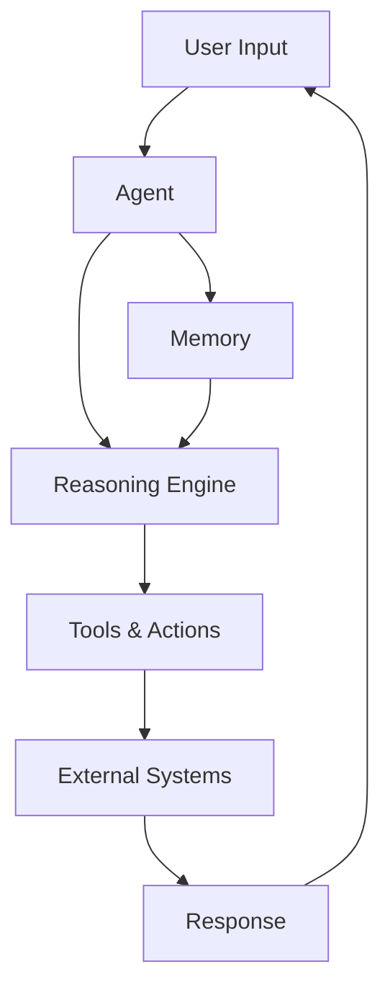

# Agents

AI agents are autonomous programs that can perceive their environment, make decisions, and take actions to achieve specific goals. In the Bindu ecosystem, agents are the fundamental building blocks of intelligent systems.

## What is an Agent?

An agent is a software entity that:

- **Perceives**: Receives input from users, systems, or other agents
- **Reasons**: Processes information using AI models to understand context and make decisions
- **Acts**: Executes tasks using tools, APIs, and integrations
- **Learns**: Improves over time through memory and feedback

## Agent Architecture



## Key Components

<CardGroup cols={2}>
  <Card title="Models" icon="brain">
    LLMs that power agent reasoning and decision-making
  </Card>
  <Card title="Tools" icon="wrench">
    Functions and APIs agents can use to interact with systems
  </Card>
  <Card title="Memory" icon="database">
    Storage for conversation history and learned information
  </Card>
  <Card title="Skills" icon="star">
    Specialized capabilities agents can perform
  </Card>
</CardGroup>

## Creating Your First Agent

With Bindu, creating an agent is simple:

```python
from agno.agent import Agent
from agno.models.openai import OpenAIChat
from bindu.penguin.pebblify import pebblify

@pebblify(
    author="Your Name",
    name="My First Agent",
    description="A helpful AI assistant",
    version="1.0.0"
)
def my_agent(messages: list[str]) -> str:
    agent = Agent(
        instructions="You are a helpful assistant",
        model=OpenAIChat(id="gpt-4o")
    )
    
    result = agent.run(input=messages)
    return result.to_dict()['content']
```

## Agent Types

### Single Agent

A standalone agent that handles tasks independently.

**Use Cases:**
- Customer support chatbots
- Data analysis assistants
- Content generation tools

### Multi-Agent Systems

Multiple agents working together to solve complex problems.

**Use Cases:**
- Research and analysis workflows
- Complex decision-making systems
- Distributed task execution

### Agent Teams

Coordinated groups of specialized agents.

**Use Cases:**
- Software development teams
- Business process automation
- Scientific research collaboration

## Agent Capabilities

<AccordionGroup>
  <Accordion title="Natural Language Understanding" icon="message">
    Agents can understand and respond to human language, interpreting intent and context.
  </Accordion>

  <Accordion title="Tool Usage" icon="tools">
    Agents can call external APIs, databases, and services to accomplish tasks.
  </Accordion>

  <Accordion title="Reasoning" icon="lightbulb">
    Agents can break down complex problems and plan multi-step solutions.
  </Accordion>

  <Accordion title="Memory" icon="brain">
    Agents remember past interactions and learn from experience.
  </Accordion>

  <Accordion title="Collaboration" icon="users">
    Agents can work with other agents and humans to achieve goals.
  </Accordion>
</AccordionGroup>

## Best Practices

<Warning>
Always validate agent outputs before taking critical actions. Agents can make mistakes and should be monitored.
</Warning>

1. **Clear Instructions**: Provide specific, detailed instructions for agent behavior
2. **Tool Selection**: Give agents only the tools they need for their tasks
3. **Error Handling**: Implement robust error handling and fallback mechanisms
4. **Monitoring**: Track agent performance and behavior over time
5. **Human Oversight**: Keep humans in the loop for important decisions

## Next Steps

<CardGroup cols={2}>
  <Card title="Quickstart" icon="rocket" href="/quickstart">
    Build your first Bindu agent
  </Card>
  <Card title="Multi-Agent Systems" icon="users" href="/introduction/multi-agent-systems">
    Learn about agent collaboration
  </Card>
  <Card title="Protocol" icon="book" href="/protocol">
    Understand the Bindu protocol
  </Card>
  <Card title="Examples" icon="code" href="/examples">
    See agent examples
  </Card>
</CardGroup>
