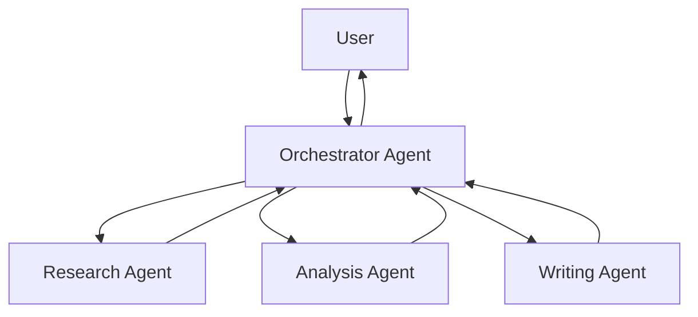
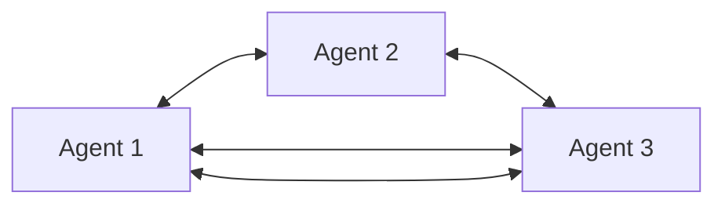
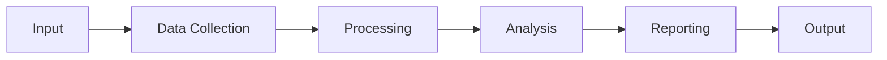

# Multi-Agent Systems

Multi-agent systems enable multiple AI agents to work together, combining their specialized skills to solve complex problems that would be difficult for a single agent to handle.

## Why Multi-Agent Systems?

<CardGroup cols={2}>
  <Card title="Specialization" icon="star">
    Each agent focuses on what it does best
  </Card>
  <Card title="Scalability" icon="chart-line">
    Distribute work across multiple agents
  </Card>
  <Card title="Resilience" icon="shield">
    System continues if one agent fails
  </Card>
  <Card title="Modularity" icon="cubes">
    Easy to add, remove, or update agents
  </Card>
</CardGroup>

## Architecture Patterns

### Orchestrator Pattern

A central orchestrator agent coordinates multiple worker agents.



**Use Cases:**
- Complex research tasks
- Multi-step workflows
- Task delegation systems

### Peer-to-Peer Pattern

Agents communicate directly with each other without a central coordinator.



**Use Cases:**
- Collaborative problem-solving
- Distributed decision-making
- Consensus building

### Pipeline Pattern

Agents process tasks sequentially, each adding value.



**Use Cases:**
- Data processing pipelines
- Content generation workflows
- Quality assurance systems

## Communication Protocols

### Message Passing

Agents exchange structured messages using the Bindu protocol.

```python
{
  "jsonrpc": "2.0",
  "method": "message/send",
  "params": {
    "message": {
      "role": "agent",
      "parts": [
        {
          "kind": "text",
          "text": "I've completed the research. Here are my findings..."
        }
      ]
    }
  }
}
```

### Shared Context

Agents share a common context to maintain conversation continuity.

```python
context_id = "550e8400-e29b-41d4-a716-446655440027"

# Agent 1 creates task
agent1.send_message(context_id=context_id, task_id=task1_id)

# Agent 2 references previous task
agent2.send_message(
    context_id=context_id,
    task_id=task2_id,
    reference_task_ids=[task1_id]
)
```

## Coordination Strategies

<AccordionGroup>
  <Accordion title="Sequential Execution" icon="list-ol">
    Agents execute tasks one after another in a defined order.
    
    **Pros**: Simple, predictable
    **Cons**: Slower, no parallelism
  </Accordion>

  <Accordion title="Parallel Execution" icon="layer-group">
    Multiple agents work simultaneously on different subtasks.
    
    **Pros**: Fast, efficient
    **Cons**: Requires coordination
  </Accordion>

  <Accordion title="Conditional Routing" icon="code-branch">
    Route tasks to agents based on conditions or agent capabilities.
    
    **Pros**: Flexible, optimized
    **Cons**: Complex logic
  </Accordion>

  <Accordion title="Negotiation" icon="handshake">
    Agents bid on tasks and negotiate terms before execution.
    
    **Pros**: Market-based, fair
    **Cons**: Overhead
  </Accordion>
</AccordionGroup>

## Example: Research Team

Here's a multi-agent system for research tasks:

```python
from bindu.penguin.pebblify import pebblify
from agno.agent import Agent
from agno.models.openai import OpenAIChat

# Research Agent
@pebblify(
    name="Research Agent",
    description="Finds and collects information"
)
def research_agent(query: str) -> dict:
    agent = Agent(
        instructions="You are a research specialist. Find relevant information.",
        model=OpenAIChat(id="gpt-4o"),
        tools=[web_search, arxiv_search]
    )
    return agent.run(input=query)

# Analysis Agent
@pebblify(
    name="Analysis Agent",
    description="Analyzes and synthesizes information"
)
def analysis_agent(research_data: dict) -> dict:
    agent = Agent(
        instructions="You are an analyst. Synthesize findings.",
        model=OpenAIChat(id="gpt-4o")
    )
    return agent.run(input=research_data)

# Writing Agent
@pebblify(
    name="Writing Agent",
    description="Creates polished reports"
)
def writing_agent(analysis: dict) -> str:
    agent = Agent(
        instructions="You are a technical writer. Create clear reports.",
        model=OpenAIChat(id="gpt-4o")
    )
    return agent.run(input=analysis)
```

## Orchestration Example

```python
class ResearchOrchestrator:
    def __init__(self):
        self.research_agent = research_agent
        self.analysis_agent = analysis_agent
        self.writing_agent = writing_agent
    
    async def execute(self, query: str) -> str:
        # Step 1: Research
        research_results = await self.research_agent(query)
        
        # Step 2: Analysis
        analysis = await self.analysis_agent(research_results)
        
        # Step 3: Writing
        report = await self.writing_agent(analysis)
        
        return report

# Usage
orchestrator = ResearchOrchestrator()
report = await orchestrator.execute("Latest developments in quantum computing")
```

## Benefits of Multi-Agent Systems

<CardGroup cols={2}>
  <Card title="Specialization" icon="graduation-cap">
    Each agent becomes expert in its domain
  </Card>
  <Card title="Parallel Processing" icon="bolt">
    Multiple tasks execute simultaneously
  </Card>
  <Card title="Fault Tolerance" icon="shield-check">
    System continues if individual agents fail
  </Card>
  <Card title="Scalability" icon="arrows-up-down">
    Add more agents as workload increases
  </Card>
</CardGroup>

## Challenges

<Warning>
Multi-agent systems introduce complexity. Start simple and add agents as needed.
</Warning>

- **Coordination Overhead**: Managing agent communication and synchronization
- **Conflict Resolution**: Handling disagreements between agents
- **Resource Management**: Balancing load across agents
- **Debugging**: Tracing issues across multiple agents
- **Cost**: Running multiple AI models simultaneously

## Best Practices

1. **Start Simple**: Begin with 2-3 agents before scaling up
2. **Clear Roles**: Define specific responsibilities for each agent
3. **Shared Context**: Use context IDs to maintain conversation continuity
4. **Error Handling**: Implement fallbacks for agent failures
5. **Monitoring**: Track performance and interactions between agents
6. **Testing**: Test agent interactions thoroughly

## Next Steps

<CardGroup cols={2}>
  <Card title="Protocol" icon="book" href="/protocol">
    Learn the Bindu protocol
  </Card>
  <Card title="API Reference" icon="code" href="/api-reference">
    Explore API endpoints
  </Card>
  <Card title="Examples" icon="lightbulb" href="/examples">
    See multi-agent examples
  </Card>
  <Card title="Playground" icon="play" href="/introduction/playground">
    Try multi-agent systems
  </Card>
</CardGroup>
